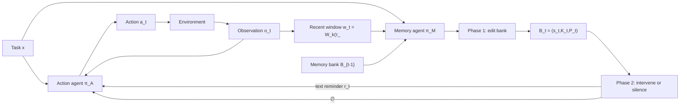

# Proactive Memory Agent：长程 Agent 不是缺记忆，而是缺“何时打断”的策略

## 元信息与 TL;DR

- **论文**：Remember When It Matters: Proactive Memory Agent for Long-Horizon Agents
- **类别**：大模型 Agent / 长程任务记忆 / 后训练
- **原始链接**：https://arxiv.org/abs/2607.08716
- **HTML 全文**：https://arxiv.org/html/2607.08716v1
- **代码链接**：https://github.com/yifannnwu/proactive-memory-agent
- **发布时间**：2026-07-09T17:26:28Z
- **作者机构**：Meta AI
- **本轮备注**：论文给出代码链接，但 GitHub 仓库当前为空，本文把证据边界放在 arXiv HTML、PDF 与 TeX 源。

### TL;DR

- 这篇论文要解决的不是“Agent 能不能存下更多上下文”，而是长程执行里更细的一类失效：**任务要求、环境事实、失败尝试、诊断结论、未完成子目标还在轨迹里，却不再影响下一步动作**。作者把它命名为 **behavioral state decay**，可以直译为“行为状态衰减”。
- 作者提出 **Proactive Memory Agent**：在不修改 action agent 的前提下，旁路运行一个 memory agent。它周期性读取最近 `k=8` 条轨迹窗口和当前记忆库，先用工具调用维护结构化记忆，再决定是否向 action agent 的下一次调用注入一条短提醒，或者明确保持沉默。
- 方法核心不是普通 RAG：
  - 记忆库被拆成私有 `status`、稳定事实 `knowledge`、尝试与结果 `procedural` 三类；
  - Phase 1 只做记忆编辑，输出 `memory_update_status`、`memory_save_knowledge`、`memory_save_procedural`、`memory_delete`；
  - Phase 2 只做干预选择，在 `<context_for_action>` 与 `<no_intervention/>` 之间决策；
  - action agent 的模型、工具、解码、基础指令都不变。
- 实验覆盖两个长程 Agent 场景：
  - **Terminal-Bench 2.0**：85 个有效配对任务，Sonnet 4.5 从 **37.6%** 升到 **45.9%**，提升 **+8.3 pp**；
  - **τ²-Bench**：278 个 airline/retail/telecom 会话任务，Sonnet 4.5 task-weighted average 从 **55.0%** 到 **61.8%**，提升 **+6.8 pp**；
  - 对更强的 Opus 4.6 action agent 仍有 **+2.4 pp** 和 **+2.5 pp**，说明收益不只是补弱模型能力。
- 消融显示，“有记忆但全量暴露”“每步强制注入”“无记忆只给 advisor 建议”“Mem0 向量/BM25 检索”都能带来部分收益，但最均衡的是**记忆维护 + 选择性提醒/沉默**。在 τ²-Bench macro average 上，完整方法是 **64.3**，Full-bank 是 **61.5**，Always inject 是 **63.5**，Mem0 是 **62.1**。
- 后训练部分是论文的第二条线：作者把 prompted memory agent 的轨迹蒸馏给 **Qwen3.5-27B**，再用 **GRPO** 在 SETA pivot turns 上校准干预策略。未训练 27B memory 会把 SETA reward 从 **0.709** 拉低到 **0.693**；SFT 回到 **0.720**，GRPO 到 **0.734**；迁移到 Terminal-Bench 时，冻结 Qwen3.5-122B-A10B action agent 从 **37.6%** 到 **41.1%**。
- 局限也很明确：
  - 主实验里的 memory agent 是 Claude Opus 4.6，每个 memory step 都有额外推理成本；
  - memory 触发采用固定间隔，不是学习出来的触发器；
  - 开源仓库当前没有可复现实代码；
  - 论文只证明了部分 benchmark 与有限训练设置，不证明所有长程 Agent 都应默认接入旁路 memory。

### 为什么本轮选它？

- 最近已经写过 UniClawBench、SkillCenter、TRACE、Multi-Agent AI Control 等 Agent 评测和安全话题。
- 这篇的差异在于：
  - 它不是再造一个 benchmark；
  - 也不是单纯把上下文压缩得更短；
  - 而是把“记忆何时应该进入控制环”定义成一个可消融、可训练的策略问题。
- 对 Daily Report 这类长程自动化也有直接参考价值：
  - 需要记住 contract；
  - 需要记住失败命令；
  - 需要记住去重结论；
  - 但也不能每一步都把全部历史塞回上下文。

## 研究问题：长程 Agent 为什么会“看见过，但没有用上”？

### 作者重新定义了哪种失败？

论文中的关键概念是 **behavioral state decay**。

它不是普通遗忘：

| 类型 | 表面症状 | 更准确的解释 |
|---|---|---|
| 上下文截断 | 早期信息被移出窗口 | 信息确实不可见 |
| 检索失败 | 相关 memory 没被召回 | 存了但没找出来 |
| 行为状态衰减 | 信息还在轨迹或摘要里，但下一步没受它约束 | 信息可见，却没有控制动作 |

作者关心的是第三类。

### 为什么这比“加长上下文”更难？

- 长程任务里的有用状态类型很杂：
  - 初始任务硬约束；
  - 环境路径、工具限制、配置细节；
  - 已失败命令和失败原因；
  - 已验证诊断；
  - 未完成子目标；
  - 用户或工具确认过的状态。
- 这些状态不一定在每一步都需要出现。
- 如果全部暴露，会带来三类成本：
  - token 和延迟增加；
  - 当前局部观察被噪声稀释；
  - action agent 可能被过时或不相关的 memory 带偏。

论文的研究问题因此变成：

```text
不是：应该记住什么？
而是：在当前下一步动作前，哪些已记住的执行状态应该重新变成行动约束？
```

## 论文主张与论证路线

| Claim | Mechanism | Evidence | Boundary |
|---|---|---|---|
| 长程 Agent 的关键失败是执行状态失去行为影响 | 定义 behavioral state decay，区分存储、检索、干预 | Terminal-Bench 与 τ²-Bench 的 qualitative case 显示 Agent 会重复失败尝试、忽略政策条款、忘记诊断 | 论文没有给出跨所有任务的自动失效分类器 |
| memory 应是干预策略，而不只是存储层 | 旁路 memory agent 维护 `B_t`，再选择提醒或沉默 | 完整方法在 Terminal-Bench 和 τ²-Bench 上提升 pass@1 | 主设置依赖强 memory agent，推理成本不低 |
| 选择性干预优于被动暴露 | Phase 2 决定 `<context_for_action>` 或 `<no_intervention/>` | Full-bank context 的 macro 61.5 低于完整方法 64.3 | Always inject 的 micro 61.5 略高于完整方法 61.2，差距很小 |
| 记忆策略可以被训练，但校准很关键 | SFT 学接口，GRPO 校准 pivot turns | Qwen3.5-27B base memory 先伤害 SETA reward，SFT/GRPO 才转正 | 训练只做 memory agent，action agent 冻结，且是初步证据 |

### 论文为什么不把它写成“更好的总结器”？

- 总结器回答的是：
  - 哪些信息要压缩保存？
- 这篇论文回答的是：
  - 哪些保存过的信息现在应该改变下一步动作？
- 这两个问题的控制含义不同：
  - 总结器可能把旧信息写得很完整；
  - 但 action agent 仍可能在关键工具调用前不使用它；
  - proactive memory 的目标是在即将犯错的位置，把具体约束短暂重新激活。

## 方法机制：两阶段 memory agent 怎样接进运行环？

### 形式化设定

论文把 action agent 的环境交互写成轨迹：

```text
τ = (o_1, a_1, o_2, a_2, ..., o_T)
```

变量含义：

| 变量 | 含义 |
|---|---|
| `o_t` | 第 `t` 步环境观察 |
| `a_t` | action agent 在第 `t` 步产生的动作 |
| `x` | 任务描述 |
| `π_A` | action agent 的策略，由 LLM 与工具 scaffold 实现 |
| `π_M` | memory agent 的策略 |
| `w_t = W_k(τ_<t, o_t)` | 最近 `k` 条轨迹窗口，主实验里 `k=8` |
| `B_t` | 第 `t` 个 memory step 后的记忆库 |

action agent 原本按下面方式采样动作：

```text
a_t ~ π_A(a_t | x, τ_<t)
```

引入 memory agent 后，memory step 变成：

```text
B_t ~ π_M^edit( · | x, w_t, B_{t-1})
i_t ~ π_M^intervene( · | x, w_t, B_t)

i_t ∈ {∅, text reminder}
```

解释：

- `π_M^edit` 负责写、改、删 memory bank；
- `π_M^intervene` 负责选择是否注入提醒；
- `∅` 是显式动作，不是“没想起来”；
- 非空 `i_t` 只作为下一次 action-agent call 的 transient context，不永久改写 action agent。

### 记忆库 `B_t=(s_t,K_t,P_t)`

论文把 memory bank 拆成三块：

| 组件 | 是否给 action agent 看 | 保存什么 | 作用 |
|---|---|---|---|
| `s_t` status | 否 | memory agent 私有的进度、风险、未解问题 | 让 memory agent 有自己的任务状态模型 |
| `K_t` knowledge | 可被提醒引用 | 稳定事实、路径、配置、工具限制、任务要求、已验证观察 | 防止硬约束和环境事实失效 |
| `P_t` procedural | 可被提醒引用 | 失败命令、成功修复、被排除假设、诊断信号、经验性改进 | 防止重复踩坑，保留调试连续性 |

这个结构比一段自由文本摘要更硬：

- 每条 memory 有短 ID；
- stale entry 可以显式删除；
- knowledge 与 procedural 被分开；
- private status 不污染 action agent 的上下文。

### Phase 1：记忆维护，不直接输出摘要

Phase 1 只能通过预定义工具调用管理 bank：

```text
Input:
  task x
  recent window w_t
  previous bank B_{t-1}

Allowed operations:
  memory_update_status(...)
  memory_save_knowledge(...)
  memory_save_procedural(...)
  memory_delete(id)

Output:
  updated bank B_t
```

这一步的关键约束是：

- memory agent 不直接“改写一整段 summary”；
- 它只能提交结构化 bank edits；
- 系统按顺序执行这些 edits；
- 如果没有可写信息，可以返回空操作。

### Phase 2：干预选择，决定说还是不说

Phase 2 的输入是更新后的 bank 与当前窗口。

它只能做两类输出：

```text
Option A:
  <context_for_action>
    一个短、具体、基于 memory 的提醒
  </context_for_action>

Option B:
  <no_intervention/>
```

好的提醒应该满足：

- 指向即将被违反的任务要求；
- 指向解释当前观察的环境事实；
- 指向不应重复的失败尝试；
- 指向仍有效的诊断；
- 指向被忽略的开放子目标。

不好的提醒包括：

- 泛泛战略建议；
- 重复当前 observation 已经明说的信息；
- 接管 action agent 的计划；
- 过度自信地提示 speculative inference。

## 用 Mermaid 重建 Figure 1 的运行环



### 这个图里的关键点

- action agent 不需要被微调；
- memory agent 是旁路进程；
- bank 更新与 reminder 注入被拆成两步；
- reminder 是 transient context，不是永久系统提示；
- silence 是策略动作，和 reminder 一样需要被学会。

## 实验设置：两个 benchmark 分别测哪种“状态衰减”？

### Terminal-Bench 2.0

- 使用官方 Terminus-2 风格 terminal agent harness。
- 总任务为 89 个，论文报告 85 个有效配对任务。
- 排除 4 个与 agent 行为无关的 Docker failure。
- 每个任务的结果由 verifier 给出 binary pass/fail。
- 指标是 pass@1。

它主要考察：

- 文件和命令环境 grounding；
- 调试循环连续性；
- 失败命令是否会被重复；
- 诊断结论是否能约束后续编辑。

### τ²-Bench

- 使用 airline、retail、telecom 三个 domain。
- base split 包含：
  - airline：50 个任务；
  - retail：114 个任务；
  - telecom：114 个任务；
  - 合计 278 个任务。
- 每个 episode 是 action agent 与 user simulator 的单轮完整会话。
- 通过 benchmark evaluator 判断任务成功。

它主要考察：

- 用户状态 tracking；
- 工具返回事实与用户说法冲突时谁更可信；
- 域内 policy 是否在多轮后仍起作用；
- 状态改变工具调用前是否记得资格、认证、限制。

### agent 配置

| 角色 | 主实验配置 |
|---|---|
| action agent | Claude Sonnet 4.5 或 Claude Opus 4.6 |
| memory agent | Claude Opus 4.6 |
| memory 触发 | 第一步 + 后续固定间隔 |
| trajectory window | `k=8` messages |
| action agent 是否修改 | 不修改 |
| reminder 注入位置 | 下一次 action-agent call 的 transient context |

## 主结果：弱模型收益更大，强模型收益没有消失

| Benchmark | Domain / Split | Action Model | n | Baseline | + Memory | Δ |
|---|---|---:|---:|---:|---:|---:|
| Terminal-Bench 2.0 | full set | Sonnet 4.5 | 85 | 37.6% | 45.9% | +8.3 pp |
| Terminal-Bench 2.0 | full set | Opus 4.6 | 85 | 43.5% | 45.9% | +2.4 pp |
| τ²-Bench | airline | Sonnet 4.5 | 50 | 68.0% | 78.0% | +10.0 pp |
| τ²-Bench | retail | Sonnet 4.5 | 114 | 49.1% | 58.8% | +9.6 pp |
| τ²-Bench | telecom | Sonnet 4.5 | 114 | 55.3% | 57.9% | +2.6 pp |
| τ²-Bench | task-weighted avg. | Sonnet 4.5 | 278 | 55.0% | 61.8% | +6.8 pp |
| τ²-Bench | airline | Opus 4.6 | 50 | 76.0% | 76.0% | +0.0 pp |
| τ²-Bench | retail | Opus 4.6 | 114 | 64.9% | 69.3% | +4.4 pp |
| τ²-Bench | telecom | Opus 4.6 | 114 | 63.2% | 64.9% | +1.8 pp |
| τ²-Bench | task-weighted avg. | Opus 4.6 | 278 | 66.2% | 68.7% | +2.5 pp |

### 怎么读这些数字？

- Sonnet 4.5 上的收益最大：
  - Terminal-Bench +8.3 pp；
  - τ²-Bench weighted average +6.8 pp。
- Opus 4.6 上仍有收益：
  - Terminal-Bench +2.4 pp；
  - τ²-Bench weighted average +2.5 pp。
- τ²-Bench 的 domain 差异很明显：
  - airline 和 retail 提升大；
  - telecom 提升小；
  - 这支持作者的判断：memory 干预不是固定摘要策略，而是依赖 domain 中什么状态最容易衰减。

## 消融：为什么“全部记忆都给模型看”还不够？

| Variant | Phase 1 | Phase 2 | Airline | Retail | Telecom | Macro | Micro |
|---|---|---|---:|---:|---:|---:|---:|
| Sonnet 4.5 baseline | 无 | 无 | 68.0 | 49.1 | 55.3 | 57.5 | 55.0 |
| Full memory agent | bank management | selective reminder / silence | 78.0 | 57.0 | 57.9 | 64.3 | 61.2 |
| Full-bank context | bank management | expose full bank | 74.0 | 52.6 | 57.9 | 61.5 | 58.6 |
| Always inject | bank management | forced reminder every step | 72.0 | 58.8 | 59.6 | 63.5 | 61.5 |
| Injection-only | skipped | selective guidance / silence | 62.0 | 54.4 | 66.7 | 61.0 | 60.8 |
| Mem0 | Mem0 ADD | vector+BM25 top-10 | 68.0 | 59.6 | 58.8 | 62.1 | 60.8 |

### 每个消融在证明什么？

- **Full-bank context**
  - 有 memory bank，但没有选择性干预；
  - 每步把整个 bank 暴露给 action agent；
  - macro 比完整方法低 2.8 点，micro 低 2.6 点；
  - 说明“可见”不等于“有效控制下一步动作”。
- **Always inject**
  - 保留 bank，也保留 reminder 生成；
  - 去掉 silence 动作；
  - micro 比完整方法高 0.3，但 macro 更低；
  - 说明强制说话在某些任务上不差，但 domain-balanced robustness 不如选择性沉默。
- **Injection-only**
  - 没有持久 bank，只让辅助模型观察轨迹给建议；
  - telecom 很高，但 airline 掉到 62.0，低于 baseline；
  - 说明 advisor-style guidance 可能有帮助，但不够稳定，也不够 grounded。
- **Mem0**
  - 使用一般记忆层的 ADD 与 vector/BM25 top-10 检索；
  - 平均值提升，但 airline 没有超过 baseline；
  - 说明通用 memory retrieval 能找相关记录，却没有显式建模“现在是否应该打断”。

### 最重要的消融结论

论文真正支持的是一个组合判断：

```text
维护执行状态 memory bank 是必要的；
但仅维护还不够。

选择何时让 memory 进入下一步 action context 是另一层策略；
这层策略可以产生收益，也会带来校准错误。
```

## 失败案例与定性分析：memory 到底在哪些时刻有用？

论文把有用干预归纳成五类：

| Mechanism | Typical memory content | Representative examples |
|---|---|---|
| requirement / policy reactivation | 任务规则、域内 policy、允许动作条件 | airline compensation、retail modification rules |
| environment grounding | 运行事实、路径、工具限制、系统怪癖 | Terminal-Bench Git server setup、ARS file-write failure |
| failure-loop avoidance | 之前尝试了什么、为什么失败 | adaptive rejection sampling、telecom diagnostic retries |
| diagnostic carryover | bug 根因或负信号 | regex edge cases、SQLite gcov configuration |
| progress / entity tracking | 当前 user、order、line、branch、subgoal | telecom line lookup、retail authentication state |

### Terminal-Bench 里的典型模式

- Agent 在调试中发现一个约束；
- 后续为了修另一个局部问题，开始违反这个约束；
- memory agent 在下一次动作前提醒：
  - 某个 regex 边界条件仍未满足；
  - 某个文件写入方式已经失败过；
  - 某个环境事实解释了当前错误。

这不是“总结全部历史”。

更像是在即将重复失败前，把一条旧证据重新变成行动约束。

### τ²-Bench 里的典型模式

- 用户声称自己有某个会员状态；
- 工具返回记录显示不是；
- baseline 可能后来又相信用户说法；
- memory-enabled agent 在执行补偿或修改前提醒：
  - 应依据 verified record；
  - basic-economy flight 不能修改；
  - 某个状态改变工具有一次性限制；
  - 当前 order/user/line 才是正在处理的实体。

这类任务里，memory 的价值不是保存百科知识。

它保存的是会话中已经确认过的 policy-relevant state。

## 后训练：为什么未训练的 27B memory 反而会伤害？

### 训练目标

作者想验证：

- proactive memory 不一定永远依赖 frontier prompted model；
- memory intervention policy 能否被蒸馏到 open-weight model；
- RL 是否能校准“什么时候沉默”。

设置如下：

| 项 | 配置 |
|---|---|
| action agent | 冻结 Qwen3.5-122B-A10B |
| memory agent | Qwen3.5-27B |
| 训练数据 | SETA，可执行 terminal-agent tasks，带 verifier reward |
| 训练阶段 | SFT + GRPO |
| 迁移测试 | Terminal-Bench 2.0 85-task |

### 训练逻辑

```text
Stage 1: SFT
  学 prompted memory agent 的轨迹
  学会 bank edit 工具调用
  学会 reminder / silence 接口
  学会简洁写入、更新 stale state、避免明显多余提醒

Stage 2: GRPO
  不再只模仿 prompted memory
  针对 labeled offline rollouts 中的 pivot turns 更新
  目标是校准：该提醒时提醒，该沉默时沉默
```

这里的 pivot turns 很关键。

因为 task-level verifier reward 很稀疏：

- 一个任务可能有很多 memory calls；
- 最终 pass/fail 不容易直接分配到每次 reminder；
- 作者因此聚焦“更可能影响后续成功”的关键转折点。

### 训练结果

| Setup | Avg. reward | Solved | Δ |
|---|---:|---:|---:|
| Action only, no memory | 0.709 | 56 | - |
| + Qwen3.5-27B base memory | 0.693 | 54 | -0.016 |
| + SFT memory | 0.720 | 58 | +0.011 |
| + GRPO memory | 0.734 | 58 | +0.025 |

| Transfer setup | n | Pass@1 | Δ |
|---|---:|---:|---:|
| Qwen3.5-122B-A10B action only | 85 | 37.6% | - |
| + trained Qwen3.5-27B memory | 85 | 41.1% | +3.5 pp |

### 怎么理解“base memory 伤害性能”？

- 一个未经训练的 memory agent 可能会：
  - 写入过多无关 memory；
  - 把 speculative inference 当成事实；
  - 在 action agent 已经知道信息时重复提醒；
  - 在不该打断时打断；
  - 把当前局部问题引向旧问题。
- 这说明 memory agent 不是“越多越好”。
- 它需要学习接口纪律和干预时机。

这也是论文最有价值的后训练点：

```text
SFT 主要教会格式和基本行为；
GRPO 才开始优化“提醒是否真正改善下游执行”。
```

## 伪代码：把论文机制写成可执行流程

```text
Input:
  task x
  action agent π_A
  memory agent π_M
  environment Env
  trigger g(t)
  window size k = 8

State:
  trajectory τ = []
  memory bank B = (status={}, knowledge={}, procedural={})
  pending_reminder = None

for t in 1..T:
  context = build_action_context(x, τ, pending_reminder)
  a_t = π_A(context)
  o_t = Env.step(a_t)
  τ.append((o_t, a_t))
  pending_reminder = None

  if g(t) is true:
    w_t = last_k_messages(τ, k)

    edits = π_M.edit(x, w_t, B)
    for edit in edits:
      B = apply_memory_tool(B, edit)

    i_t = π_M.intervene(x, w_t, B)

    if i_t is text reminder:
      pending_reminder = i_t
    else:
      pending_reminder = None

Output:
  final task result
  memory bank B
  intervention trace

Failure boundaries:
  if edits contain stale or speculative facts, B can mislead future reminders
  if intervene always speaks, local progress can be distracted
  if intervene always stays silent, memory degenerates into unused storage
  if trigger is too frequent, latency and cost rise
  if trigger is too sparse, key pivot turns may be missed
```

## 与相关工作的关系：它站在哪个位置？

### 和长上下文/RAG 的区别

| 方法家族 | 关心问题 | 本文差异 |
|---|---|---|
| 长上下文 | 信息能否留在窗口里 | 本文说信息在窗口里也可能不影响行为 |
| RAG | 如何找回相关资料 | 本文说找回后还要决定是否进入控制环 |
| agent memory systems | 如何组织长期记忆 | 本文聚焦任务执行中的 execution state |
| reflection / critic | 如何给 agent 反馈或策略建议 | 本文限制为 memory-grounded reminder，不做泛化 advisor |
| context compression | 如何压缩轨迹 | 本文把是否打断下一步动作当成策略 |

### 和近期 Daily Report 已覆盖主题的边界

- **CompactionRL** 关心压缩上下文如何保留任务可用信息。
- **TRACE** 关心 agent trajectory 的归因水印。
- **UniClawBench** 关心 proactive agent benchmark。
- **SkillCenter** 关心技能学习和组织。
- **Proactive Memory Agent** 关心：
  - 记忆是否应该在当前步骤变成 action constraint；
  - 并用消融说明“被动可见”不等于“行为上有效”。

## 证据边界与局限

### Figure/Table 逐项证据解读

论文的 Figure 1 和四张表不是装饰性材料，而是在分别支撑不同层级的 claim。

| 图表 | 支撑的主张 | 最有用的读法 | 不能证明什么 |
|---|---|---|---|
| Figure 1 | memory agent 可以旁路接入，不改 action agent | 看清 bank edit 与 reminder selection 是两个阶段 | 不能证明触发频率是最优的 |
| Table 1 | 主方法在两个长程 benchmark 上提高 pass@1 | 重点看弱/强 action agent 都有增益 | 不能证明所有任务都需要 memory |
| Table 2 | 选择性干预比被动暴露更均衡 | 比较 macro 与 micro，而不是只看单列最高值 | 不能排除 Always inject 在某些 domain 更好 |
| Table 3 | 有效 reminder 多发生在状态即将失效的位置 | 把机制和实际 case 对齐，而不是抽象谈“记忆” | 不是量化频率统计 |
| Table 4 | memory intervention policy 有可训练性 | base memory 先伤害，SFT/GRPO 才转正 | 不能证明 27B memory 已接近 prompted Opus |

#### Table 1 的核心不是“分数升了”

更准确的读法是：

- Terminal-Bench 和 τ²-Bench 的任务形态不同；
- 一个偏 terminal debugging，另一个偏 conversational tool-use；
- 两者都提升，说明方法不是只记命令行错误，也不是只记用户状态；
- 强 action agent 仍提升，说明问题不完全是模型能力不足。

但它也留下两个空白：

- memory agent 和 action agent 同为强模型时，额外成本是否值得；
- 每类任务中到底有多少比例属于 behavioral state decay，而不是普通推理错误。

#### Table 2 的关键是 macro/micro 张力

Always inject 的 micro average 是 **61.5**，略高于完整方法的 **61.2**。

如果只看这一个数字，可能会误读为“每步都说也行”。

但 macro average 中完整方法是 **64.3**，Always inject 是 **63.5**；airline 上完整方法 **78.0**，Always inject **72.0**。

这说明：

- 强制提醒可能在任务数更多或更容易受益的 domain 上拉高 weighted average；
- 但选择性沉默在 domain-balanced 视角下更稳；
- 对真实部署来说，稳定性往往比单一加权平均更重要。

#### Table 4 的反直觉点最值得注意

未训练 Qwen3.5-27B memory 让 reward 从 **0.709** 降到 **0.693**。

这不是小插曲，而是论文的核心警告：

- memory agent 是一个会影响行动的控制器；
- 控制器没有校准时，增加信息通道会变成额外干扰源；
- SFT 先教它遵守 memory interface；
- GRPO 再用 verifier reward 校正“何时介入”的偏好。

因此，后训练部分不是附录式加分项。

它解释了为什么 proactive memory 不能只靠 prompt 工程长期解决：真正难的是把“该沉默时沉默”变成稳定策略。

### 论文自己承认或实验暗示的边界

- **成本边界**
  - 主实验 memory agent 是 Claude Opus 4.6；
  - 每个 memory step 都额外调用一个强模型；
  - 如果固定每步调用，成本与延迟会随轨迹增长变成部署问题。
- **触发边界**
  - 主实现用固定间隔；
  - 论文提到可以在 tool error、failed tests、repeated commands、large context shifts 后触发；
  - 但这些触发策略没有作为主实验系统学习或比较。
- **训练边界**
  - Qwen3.5-27B 训练是 early exploration；
  - 只训练 memory agent，不联合训练 action agent；
  - GRPO 是围绕 pivot turns 的单轮式校准，不是完整长程 credit assignment。
- **复现边界**
  - 论文列出代码仓库；
  - 本轮检查时仓库为空；
  - 细节证据主要来自 arXiv HTML、PDF 与 TeX 源，不来自可运行实现。
- **评测边界**
  - Terminal-Bench 报告 85 个有效配对任务；
  - τ²-Bench 只覆盖 airline、retail、telecom；
  - 不能直接外推到所有 browser agent、coding agent、企业内部 workflow。

### 失败模式没有消失，只是换成了 calibration 问题

论文定性分析提到，memory agent 偶尔会：

- 过度自信地提出 speculative inference；
- 重复 action agent 已经知道的信息；
- 提出合理但不必要的担忧；
- 造成额外验证；
- 干扰当前局部推进。

这意味着 proactive memory 的核心风险不是“存不住”，而是：

```text
提醒错了，比不提醒更糟；
提醒晚了，错过 pivot；
提醒太多，action agent 失去局部专注；
提醒太少，memory bank 变成沉睡数据库。
```

## 研究者视角的延伸问题

### 1. 触发函数 `g(t)` 应该被学习吗？

当前主实现固定触发。

更自然的下一步是让触发器观察：

- 最近是否有 tool error；
- 是否重复了相似命令；
- 是否进入 state-changing action 前；
- 是否出现用户事实与工具事实冲突；
- 是否有长上下文压缩或摘要替换；
- 是否靠近 verifier 或 final answer。

这会把问题从 memory intervention 扩展成：

```text
when to invoke memory
what to update
whether to intervene
how to phrase reminder
```

四个子策略需要一起校准。

### 2. memory agent 是否应该有可验证约束？

如果 memory bank 可以写入错误事实，后续提醒会被错误放大。

可能需要：

- memory entry provenance；
- tool-verified 标记；
- speculative / confirmed 分层；
- stale 条件；
- deletion audit；
- action agent 可质疑 memory 的接口。

这会把 memory bank 从自然语言笔记，推向更接近 typed state store。

### 3. 后训练能否获得更细粒度 reward？

论文用 SETA verifier reward 与 pivot turns 做初步 GRPO。

但长程任务里，每个 reminder 的 credit 很难分配。

后续可以考虑：

- 对同一轨迹前缀做 paired rollout；
- 比较 reminder 与 silence 的局部后果；
- 给 memory edit 本身打事实性标签；
- 对“重复失败尝试是否减少”建辅助指标；
- 对 state-changing tool call 前的 policy adherence 单独奖励。

### 4. 它对 coding agent 的意义是什么？

coding agent 经常有这些状态衰减：

- 已经确认测试命令失败原因，却后面又跑同样错误命令；
- 用户明确禁止删除文件，后续清理时忘记；
- 某个 worktree 脏或 stale，后续又在里面发布；
- 某个 schema 字段曾失败，后续 payload 又犯同错；
- 某个远端分支已经 advance，后续还想推旧 commit。

这些都不是“缺知识”。

它们是 execution state 没有在关键动作前重新激活。

### 5. Daily Report 自动化最该借鉴哪一点？

不是给每一步塞完整 automation memory。

更合理的是做选择性提醒：

| 关键动作 | 应激活的 memory |
|---|---|
| 写 payload 前 | 最近 schema traps、字段类型、evidence 结构 |
| publish 前 | worktree 脏状态、origin/data parent、是否已有 dry-run commit |
| push 前 | branch API / ls-remote 的 parent SHA |
| 重跑前 | 文章是否被 soft-move、payload 是否已生成、候选是否已 live |
| 选题前 | 最近已发 topic 与 same-table pivot 规则 |

这和本文机制非常接近：

- 不需要每一步都显示全部历史；
- 只在危险动作前注入最相关的执行状态；
- 并保留“沉默”作为重要动作。

## 结论

- 这篇论文的贡献不在于提出“Agent 要有记忆”这个宽泛观点。
- 它更具体地提出：
  - 长程 Agent 会发生 behavioral state decay；
  - memory 要进入控制环，而不只是进入数据库；
  - 选择性提醒和显式沉默是同一个策略空间；
  - 这个策略可以被消融，也可以被初步后训练。
- 最有说服力的证据是：
  - Terminal-Bench 与 τ²-Bench 上跨弱/强 action agent 的 pass@1 提升；
  - 消融中 Full-bank、Always inject、Injection-only、Mem0 都不如完整方法均衡；
  - 未训练 memory 反而伤害 SETA reward，说明“会记”不等于“会在正确时刻提醒”。
- 最需要谨慎的地方是：
  - 主实验仍依赖强 memory agent；
  - 开源实现暂不可用；
  - 触发与 credit assignment 仍很初步；
  - memory 写错或过度干预会带来新的 agent 可靠性风险。

真正值得带走的一句话是：

```text
长程 Agent 的记忆问题，不只是把过去存下来；
而是在下一步行动前，判断哪些过去应该重新拥有因果影响。
```
