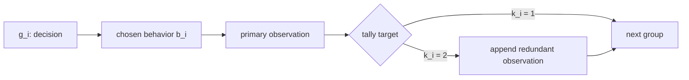
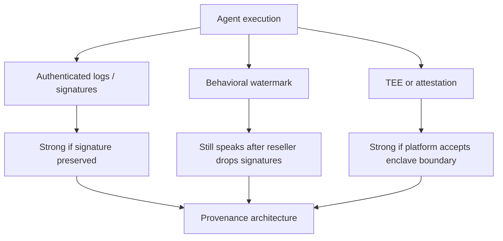

# TRACE：当转售商掌握轨迹日志时，Agent 水印还能怎样证明来源？

## 元信息

| 字段 | 内容 |
| --- | --- |
| 论文 | TRACE: A Two-Channel Robust Attribution Watermark via Complementary Embeddings for LLM-Agent Trajectories |
| 作者 | Longxiang Tang, Lewis Hammond, Martin Tutek, Yali Du, Yarin Gal |
| 时间 | arXiv v1, 2026-07-09 12:25:22 UTC |
| 链接 | [arXiv](https://arxiv.org/abs/2607.08400), [PDF](https://arxiv.org/pdf/2607.08400), [HTML](https://arxiv.org/html/2607.08400v1) |
| 类型 | AI 安全、Agent 轨迹归因、行为水印 |

## TL;DR

- TRACE 研究的不是普通文本水印，而是 **LLM Agent 轨迹日志归因**：当 Agent 经由转售商触达用户，转售商可能重命名工具、改写观察、删掉步骤，事后谁能证明某条轨迹确实来自原开发者的 Agent？
- 论文的威胁模型很强：攻击者不是外部旁观者，而是保存、计费、转发轨迹日志的 reseller；它对证据本身有读写权限，只不能改变真实执行过的动作空间和已发生的环境交互。
- TRACE 的核心设计是两条互补水印：selection channel 用内容键控的无失真采样决定“选哪个行为”，删除后可自同步；tally channel 用骨架键控的计数决定“每个决策组有几条记录”，在任意改写下保持不变。
- 理论上，selection 的零假设服从 Gamma 尾检验，tally 的零假设服从 Binomial 检验；两者用 `min(p1, p2) <= alpha/2` 控制误报。论文还给出熵下界：每个决策的检测信号至少来自该决策熵的一半，确定性决策不给水印信号。
- 实验在 ToolBench 和 ALFWorld 上比较 Base、AgentMark 风格的 AM-F、red-green 行为水印 RG 与 TRACE。TRACE 基本保持未加水印 Agent 的成功率：ALFWorld ID 为 83.6% 对 82.4%，OOD 为 81.1% 对 81.3%，ToolBench 为 76.6% 对 77.2%。
- 检测力随轨迹长度分化明显：ToolBench 每任务约 1.4 个有效决策组，单轨迹不够；ALFWorld 有 23 到 25 个决策步，selection z 达 94.15 到 102.53，tally z 达 54.38 到 55.32。
- 攻击实验显示两条通道正交失效：删除会伤 tally，但 selection 在 70% 删除率下仍有 z=4.06；LLM 改写会擦掉 selection、RG 和 AM-F，但 tally 在所有改写强度下保持 z=14.34、TPR@1%FPR=1.000。
- 局限也很硬：tally 依赖日志格式允许加入上下文中性的冗余 observation；selection 在低熵短轨迹上必须靠池化；组合攻击在高删除率加高改写强度的角落仍能压低两通道，但此时日志已被严重破坏。

## 研究问题：为什么 Agent 轨迹归因比文本水印更难？

### 论文真正担心的场景

作者把问题放在一个商业链路里，而不是放在实验室里：

- Agent 开发者提供一个能调用工具、执行代码、访问环境的 Agent。
- reseller 把它包装成自己的系统，或者宣称使用高价模型，实际替换成便宜模型。
- 用户、平台或监管方事后只拿到一条 trajectory log。
- 这条 log 由 reseller 存储、计费、清洗和转发。
- 争议发生时，需要回答：这条轨迹是否来自开发者的原 Agent？

这里的关键不是“输出文本像不像”，而是“行动记录能不能归因”：

- 文本水印通常依赖 token 序列。
- Agent 日志保留的是工具调用、参数、观察、动作和执行结果。
- token 级水印在结构化日志里大多丢失。
- 行为级水印又面临决策稀疏、低熵和可被日志持有者清洗的问题。

### 为什么单通道水印不够？

论文把 reseller 的清洗动作归结为两类：

| 攻击 | reseller 做什么 | 对水印键控的破坏 |
| --- | --- | --- |
| 删除 deletion | 删掉步骤、截断记录、去除暴露上游供应商的字段 | 位置键控会从第一个删除点开始整体错位 |
| 改写 rewriting | 重命名工具、改写 observation、把上游命名空间换成自己的 | 内容键控会被替换后的字段破坏 |

这张表是整篇论文的设计入口：

- 要抗删除，key 不能依赖全局位置，因为位置会错位。
- 要抗改写，key 不能依赖具体内容，因为内容会被替换。
- 一个 carrier-keying 组合不能同时满足两者。
- 所以 TRACE 不再追求“一条更强水印”，而是把一条轨迹拆成两个可承载信号的表面。

## 论文主张与论证路线

| Claim | Mechanism | Evidence | Boundary |
| --- | --- | --- | --- |
| Agent 归因必须假设日志持有者可改证据 | reseller 威胁模型，攻击者能读写 trajectory log | 论文把 deletion 与 rewriting 定义成两类自然清洗动作 | 仍假设环境动作空间和执行动作流不可被随意伪造 |
| 单通道水印必有致命轴 | 内容键控怕改写，位置键控怕删除 | RG、AM-F 在改写下 TPR 很快归零 | 结论主要针对轨迹日志水印，不替代签名或 TEE |
| 两通道可互补 | selection 承载行为选择，tally 承载记录数骨架 | 删除下 selection 留存，改写下 tally 不动 | 组合攻击仍可在高强度角落压低两者 |
| 无失真采样可保 utility | keyed exponential race 精确复现原分布 | TRACE 在 ToolBench/ALFWorld 成功率接近 Base | 需要能访问候选行为概率或等价采样接口 |
| 检测力来自决策熵 | 每个决策信号下界为 0.5 * entropy | ToolBench 短轨迹弱，ALFWorld 长轨迹强 | 确定性动作没有可压榨的水印随机性 |

这条路线很清楚：

1. 先说明文本水印无法直接迁移到 Agent 轨迹。
2. 再把 reseller 的两种清洗动作形式化。
3. 接着证明单一键控无法同时抗删除和改写。
4. 然后构造 selection 与 tally 两个互补通道。
5. 最后用理论分布、攻击实验和效用实验回答“能检测、少误报、不伤任务、攻击代价高”四个问题。

## 方法机制：TRACE 的两个通道分别在标记什么？

### 轨迹如何分组？

TRACE 不把整条日志看成一个字符串，而是看成一串决策组：

- 每个 group 以一个 decision record 开头。
- 后面跟随 observation record 或相关日志记录。
- 行为水印主要关心该组选择了哪个行为 `b_i`。
- 结构水印主要关心该组有几条 record，即 `k_i`。

可以用这个简化图理解：



### selection channel：用内容键控选择行为

selection channel 的 carrier 是最终选中的行为 `b_i`。

它的上下文只看前一个动作身份序列，而不看绝对位置：

```text
ctx_i = enc(A_{i-1}) || key_1
ctx_1 = bootstrap || key_1
```

对候选行为集合 `B_i` 中每个行为 `b`，TRACE 生成一个 keyed random value：

```text
r_b = DRBG(key = H(ctx_i), nonce = b),  r_b in (0, 1)
```

然后用指数竞赛选择行为：

```text
b_i = argmin_b [ -ln(r_b) / P_i[b] ]
    = argmax_b [ r_b^(1 / P_i[b]) ]
```

变量解释：

| 符号 | 含义 |
| --- | --- |
| `B_i` | 第 i 个决策处可选行为集合 |
| `P_i[b]` | 原 Agent 对行为 b 的选择概率 |
| `r_b` | 由密钥和上下文生成的伪随机值 |
| `b_i` | 实际记录在轨迹中的行为 |

关键点是：

- 指数竞赛精确复现原分布：`Pr[b_i = b] = P_i[b]`。
- 因此它不是把概率质量推向某个 green list。
- 行为 utility 不靠调参维持，而是由采样规则保证。
- 选中的行为倾向于带更大的 `r_b`，这个“赢得竞赛的残差”就是检测信号。

检测时，验证方不用相信日志里自报的随机数，而是重放 key 和上下文：

```text
phi_i = -ln(1 - r_{b_i})
X_1 = sum_i phi_i
z_1 = (X_1 - n) / sqrt(n)
```

在零假设下：

```text
X_1 ~ Gamma(n, 1)
```

这让 selection channel 有精确 p-value，而不是只靠经验阈值。

### 为什么 selection 能抗删除？

它不把绝对位置放进 key。

删除一个 record 后：

- 被删除 group 的局部上下文会受影响。
- 紧邻后继 group 可能重新取 key。
- 但再往后的 group 可由幸存内容重新同步。
- 论文把这叫 blast radius one。

所以 deletion 不是从第一个缺口开始让整条轨迹全错位，而是制造局部损伤。

这也是为什么作者不用更长 content window：

- window 越长，单次删除影响的后继 group 越多。
- memory-one window 让删除损伤尽量局部化。
- 代价是上下文绑定更短，攻击面和统计力之间需要取舍。

### tally channel：用骨架键控决定记录数

tally channel 的 carrier 不是行为内容，而是每个决策组的 record count：

```text
k_i in {1, 2}
```

它的 key 只看任务实例与 group 位置：

```text
rho_i = DRBG(key = H(key_2), nonce = H(qid || i))
G_i = {1}, if rho_i < 1/2
G_i = {2}, if rho_i >= 1/2
```

如果目标是 `{2}`，并且当前环境日志格式允许，embedder 会在 primary observation 后追加一条上下文中性的 redundant record。

上下文中性有三个条件：

| 条件 | 作用 |
| --- | --- |
| 内容是已有前缀的确定函数 | 不给 Agent 新信息 |
| 不调用工具、没有环境副作用 | 不改变真实执行过程 |
| 记录类型是 observation 而非 decision | 不开启新的决策组 |

这条通道的检测统计量是：

```text
X_2 = sum_i 1[k_i in G_i]
z_2 = (X_2 - n * p_0) / sqrt(n * p_0 * (1 - p_0))
p_0 = 1/2
```

在零假设下：

```text
X_2 ~ Binomial(n, 1/2)
```

如果每个可增广 group 都命中，完美 hit 的概率是：

```text
Pr[X_2 = n] = 2^(-n)
```

所以 30 个有效 group 已经给出约 `2^-30 ~= 1e-9` 级别的误报概率。

### 为什么 tally 能抗改写？

论文对 rewriting 的定义很重要：

- 改写可以替换工具名、观察文本、行为 identity。
- 改写保留轨迹骨架：有多少 group、每组有多少 record。
- 改写不插入新的 decision，也不删除 record。

在这个类里，tally channel 的 carrier 和 key 都不看内容：

- carrier 是 `k_i`。
- key 是 `(key_2, qid, i)`。
- detector 只重放 skeleton。

因此任意强度的内容改写都不改变 tally 的统计量。

这不是“实验上比较鲁棒”，而是定义层面的不变性。

## 伪代码：嵌入与检测如何跑？

### Embed

```text
Input:
  trajectory task id qid
  agent policy P_i over candidate behaviors B_i
  keys key_1, key_2

State:
  previous action identity sequence A_{i-1}
  decision group index i

For each decision group i:
  1. Build ctx_i from enc(A_{i-1}) and key_1.
  2. For every candidate behavior b in B_i:
       r_b = DRBG(H(ctx_i), nonce=b)
       clock_b = -ln(r_b) / P_i[b]
  3. Select behavior b_i with the smallest clock.
  4. Execute b_i and record the primary observation.
  5. Compute rho_i from key_2, qid and i.
  6. If rho_i >= 1/2 and redundant observation is admissible:
       append one context-neutral observation record.
  7. Update A_i and continue.

Output:
  watermarked trajectory log

Failure boundary:
  deterministic decisions carry no selection entropy;
  environments that forbid redundant observation records weaken tally.
```

### Detect

```text
Input:
  observed trajectory log
  qid
  keys key_1, key_2
  false-positive budget alpha

State:
  effective decision groups after parsing skeleton
  replayed content contexts for surviving groups

For each effective group:
  1. Replay selection key and compute r_{b_i}.
  2. Add phi_i = -ln(1 - r_{b_i}) to X_1.
  3. Replay tally target G_i from qid and position i.
  4. Add 1[k_i in G_i] to X_2.

Compute:
  p_1 = Gamma upper tail Q(n, X_1)
  p_2 = Binomial tail for X_2

Decision:
  reject H0 if min(p_1, p_2) <= alpha / 2

Output:
  provenance verdict plus z_1, z_2
```

这个检测器的好处是：

- 不需要读取模型隐藏思维。
- 不需要日志自带可信随机数。
- 不依赖 reseller 提供完整原始字段。
- 只要日志还有足够行为或骨架证据，就能给出统计归因。

## 理论核心：信号为什么来自熵？

论文最值得认真读的公式是 selection channel 的熵下界：

```text
E[phi_i] >= 1 + 1/2 * H(P_i)
```

含义是：

- 零假设下 `phi_i` 的期望是 1。
- 加水印后，胜出行为带来高于零假设的残差信号。
- 这个增量至少是该决策分布熵的一半。
- 如果 `P_i` 是 point mass，熵为 0，信号也没有。

这给 Agent 水印一个很朴素的边界：

| 决策形态 | 熵 | selection 信号 |
| --- | ---: | --- |
| 只有一个合法工具 | 0 | 无法无失真地产生行为水印 |
| 两三个候选但概率极偏 | 低 | 需要多轨迹池化 |
| 长任务、多次可选动作 | 高 | 单轨迹也可能足够 |

这也解释了实验现象：

- ToolBench 每任务约 1.4 个有效决策组。
- ALFWorld 每任务约 23 到 25 个决策步。
- 同一水印在 ToolBench 上需要池化，在 ALFWorld 上单轨迹就很强。

换句话说，TRACE 没有声称“任意 Agent 轨迹都能强归因”。

它更精确地说：

- 不伤行为分布的水印，不能凭空制造随机性。
- 检测力要么来自长轨迹。
- 要么来自多条短轨迹的统计池化。
- 要么只能接受更弱置信度。

## 实验设置：作者实际比较了什么？

### Benchmark 与模型

| 项 | 设置 |
| --- | --- |
| ToolBench | 六个测试 split，覆盖单工具、多工具、跨类别工具使用；每 seed/split n=20，T5 n=50 |
| ALFWorld ID | 140 个 in-distribution 文本环境家务规划任务 |
| ALFWorld OOD | 134 个 unseen environment 任务 |
| 主干模型 | GPT-5.4-mini，经 API relay 服务 |
| 额外消融 | 本地部署 Qwen backbone，仅在 ALFWorld 上报告 |
| 重复次数 | 三个 seed，结果给 mean +/- sample std |
| 攻击 | random observation deletion、LLM rewriter、二者组合 |

### 对比方法

| 方法 | 核心信号 | 主要风险 |
| --- | --- | --- |
| Base | 无水印 | 无法归因 |
| RG | red-green 行为偏置 | 低熵处损伤 utility，改写可擦除 |
| AM-F | AgentMark 风格的多 bit 分布保持水印 | clean detection 强，但单次改写会崩 |
| TRACE | selection + tally 两通道 | 需要日志骨架和足够熵或足够池化 |

### 指标

| 指标 | 含义 |
| --- | --- |
| SR | success rate，由同一 GPT-5.4-mini judge 打分，solved=1、unsure=0.5、unsolved=0 |
| Steps/task | 每任务记录步数；TRACE 包含 tally 的冗余记录 |
| z | 通道检测统计量，阈值用 theta=2 |
| wk | wrong-key control，用从未用于嵌入的 key 估计经验零假设 |
| TPR@FPR | 在固定误报率下的检测真阳性率 |

## 主结果：水印没有明显伤任务，但 biased baseline 会

### Success Rate

| Setting | Base SR | AM-F SR | RG SR | TRACE SR | 读法 |
| --- | ---: | ---: | ---: | ---: | --- |
| ALFWorld ID | 82.4 | 84.0 | 74.3 | 83.6 | TRACE 与 Base 同量级，RG 下降 8.1 点 |
| ALFWorld OOD | 81.3 | 83.8 | 78.1 | 81.1 | TRACE 基本持平，RG 下降 3.2 点 |
| ToolBench Avg. | 77.2 | 78.9 | 77.6 | 76.6 | 四者差异在 seed 噪声附近 |

这一表支持两个判断：

- distribution-preserving 方法确实能少伤任务。
- RG 这类 biased selection 在低熵决策上要付 utility 税。

但 TRACE 的 step count 不是完全免费：

- ALFWorld ID 中 Base 平均 24.9 步，TRACE 34.2 步。
- OOD 中 Base 24.8 步，TRACE 36.7 步。
- 作者分解后指出，多出的主要是 tally 冗余记录，不是额外工具调用。
- 这些记录不执行环境副作用，但会增加日志体积、存储和审计成本。

## 检测结果：长轨迹非常强，短轨迹必须池化

### pooled z

| Setting | RG z | TRACE selection z | TRACE tally z | wrong-key 控制 |
| --- | ---: | ---: | ---: | --- |
| ToolBench | 2.72 | 4.51 | 5.77 | selection -0.16，tally 0.43 |
| ALFWorld ID | 37.37 | 94.15 | 54.38 | selection -4.53，tally 1.06 |
| ALFWorld OOD | 34.48 | 102.53 | 55.32 | selection -2.43，tally 0.73 |

读法：

- wrong-key 近零说明经验零假设没有明显漂移。
- ToolBench z 不高，是因为每条轨迹决策太少。
- ALFWorld selection z 接近 100，是长 horizon 行为熵累积后的结果。

### TPR@1%FPR

| Setting | Channel | B=1 | B=10 | B=50 |
| --- | --- | ---: | ---: | ---: |
| ToolBench | TRACE selection | 0.080 | 0.618 | 1.000 |
| ToolBench | TRACE tally | 0.083 | 1.000 | 1.000 |
| ToolBench | RG | 0.030 | 0.563 | 1.000 |
| ToolBench | AM-F | 0.130 | 1.000 | 1.000 |
| ALFWorld ID | TRACE selection | 0.874 | 1.000 | 1.000 |
| ALFWorld ID | TRACE tally | 0.850 | 1.000 | 1.000 |
| ALFWorld OOD | TRACE selection | 0.938 | 1.000 | 1.000 |
| ALFWorld OOD | TRACE tally | 0.860 | 1.000 | 1.000 |

这组数字让论文的部署含义更具体：

- 如果每条任务轨迹很短，单条证据很弱。
- 如果 reseller 持续转售服务，平台通常会拿到多条轨迹。
- 对 ToolBench 这类短轨迹，10 条即可让 tally 达到 1.000 TPR@1%FPR。
- 对 ALFWorld 这类长轨迹，单条就经常足够。

## 攻击实验：两通道如何互补？

### 删除攻击

删除 rate `r` 逐步升高时：

| 方法/通道 | 现象 |
| --- | --- |
| TRACE selection | z 从 11.34 衰减到 4.06，70% 删除率仍高于 theta=2 |
| TRACE tally | 因 record count 被删，约在 r=0.5 附近跌破阈值 |
| RG | content-keyed，也能抗一定删除，但信号弱于 TRACE selection |
| AM-F | RLNC erasure coding 能抗删除，70% 删除仍 z=8.67、bit accuracy=1.00 |

删除不是 TRACE 的独占优势。

更准确的结论是：

- 删除轴上，content-keyed selection 和 AM-F 都能留住信号。
- 但 reseller 要达到 70% 删除，已经删掉大量可计费服务证据。
- 对 TRACE 来说，删除主要是伤 tally，不会同时伤 selection。

### 改写攻击

LLM rewriter 的强度 `q` 升高时：

| 方法/通道 | 结果 |
| --- | --- |
| RG | 从 z=7.09 下降到 0.29 |
| AM-F | 从 z=15.85 下降到 -4.04，bit accuracy 降到 0.34 |
| TRACE selection | 按设计失效，最终 z=-3.51 |
| TRACE tally | z=14.34 在所有改写强度下保持不变 |

这里是论文最强的安全论点：

- 改写工具名和 observation 是 reseller 很自然的 rebranding 动作。
- 这类动作会清掉所有内容键控信号。
- 但只要不改变 skeleton，tally 完全不动。
- 这种不动不是“模型没攻击好”，而是 rewriting class 的定义保证。

### 组合攻击

组合攻击是：

```text
first rewrite at strength q
then delete observations at rate r
```

结果大致是：

- `q` 主要降低 selection。
- `r` 主要降低 tally。
- 两者近似正交。
- 强通道的 max z 除少数角落外仍高于 theta=2。

危险角落包括：

| 条件 | 解释 |
| --- | --- |
| r=0.7 且 q>=0.6 | 删除 70% 记录，同时高强度改写内容 |
| r=0.5, q=0.8 | 边界格点，combined detector 接近或低于阈值 |

作者的判断是：

- 到这个强度，reseller 已经不只是洗白日志。
- 它同时丢弃大量服务证据并重写多数内容。
- 这会损害轨迹作为可售服务、可审计记录和执行证明的价值。

但研究者也应保留边界：

- 如果攻击者只想否认来源，不在意日志可用性，这个成本未必足够阻止。
- 如果下游验证只能拿到极少短轨迹，统计力也可能不足。
- 如果系统日志格式不允许冗余 observation，tally 设计要换载体。

## Figure/Table 逐项证据解读

| 证据 | 支持的结论 | 不能证明什么 |
| --- | --- | --- |
| Figure 1 framework | 两通道分别绑定内容与骨架，检测时从日志重放 | 不证明所有生产日志都能插入 tally 记录 |
| Table 1 main results | TRACE 成功率接近 Base，RG 在 ALFWorld 明显掉点 | 不证明任何模型、任何工具环境都零损伤 |
| Table 2 detection | ALFWorld 长轨迹让 selection/tally z 很高，wrong-key 近零 | 不证明单条短 ToolBench 轨迹足够 |
| Figure 3 TPR bundle | ToolBench 需要多轨迹池化，ALFWorld 单轨迹较强 | 不证明真实 reseller 一定提供足够样本 |
| Figure 4 robustness | 删除伤 tally、改写伤 selection，互补关系成立 | 不证明组合高强攻击不能成功 |
| Qwen appendix | 第二 backbone 上 ALFWorld 趋势一致 | 只在 ALFWorld 消融，没有覆盖 ToolBench Qwen |

## 相关工作位置：TRACE 与已有 Agent 水印差在哪？

### 外部参考检索情况

围绕论文标题、arXiv 编号和“两通道 Agent 轨迹水印”关键词检索时，没有发现独立第三方长篇解读。

因此本文的证据重心放在：

- arXiv 摘要页的日期与元数据。
- PDF 正文的威胁模型、方法和实验。
- TeX source 中的表格、公式、图注和附录数字。

这也意味着，本文不会把尚未出现的社区评价写成共识；对部署价值的判断，只从论文给出的理论、实验和日志工程前提出发。

### 与文本水印的关系

TRACE 借用了文本水印里的几个思想：

- keyed pseudorandom sampling。
- Gumbel/exponential race 风格的无失真采样。
- 用统计尾概率控制 false positive。
- 用多样本池化提升检测力。

但它不能直接使用 token 水印：

- Agent 日志不保留完整 token 序列。
- 关键证据是行动流和 observation。
- 行为决策数量远少于 token。
- 低熵行为处的偏置更容易损害任务成功率。

### 与 Agent Guide、AgentMark、AgentWM、ActHook 的关系

| 工作方向 | 大致目标 | TRACE 的差异 |
| --- | --- | --- |
| Agent Guide / RG | 偏置行为分布，检测 green behavior | TRACE selection 不改变行为分布 |
| AgentMark / AM-F | 分布保持、多 bit 行为水印 | TRACE 增加 skeleton-keyed tally，专门抗改写 |
| AgentWM | 保护 agent imitation / 模仿训练 | TRACE 聚焦 reseller 持有日志后的归因 |
| ActHook | 在轨迹数据里埋 hook，让训练后模型复现 | TRACE 不假设对方训练模型，直接检查日志 |

这篇论文最重要的定位是：

- 它不是单纯提升 clean detection。
- 它把攻击者换成“证据持有者”。
- 因此鲁棒性目标从通用扰动变成 deletion 与 rewriting 的结构对抗。

### 与日志签名、TEE、attestation 的关系

论文没有说水印能替代加密签名。

更合理的系统图是：



TRACE 的位置是：

- 当 reseller 愿意保留签名，签名更直接。
- 当 reseller 删除签名、重命名字段、改写内容时，行为水印仍可能提供统计证据。
- 它更像 provenance architecture 的补充信号，而不是唯一信任根。

## 失败案例与边界

### 低熵决策是根本瓶颈

如果一个 Agent 在多数步骤只有一个合法动作：

- selection channel 没有可用随机性。
- 无失真条件不允许强行改动作概率。
- 检测力只能来自少量高熵步骤或多轨迹池化。

这对很多生产 Agent 很现实：

- 表单提交型 Agent 可能动作空间很窄。
- workflow engine 可能把下一步写死。
- tool router 可能在高置信场景直接选唯一工具。

### tally 的工程前提不总是成立

tally 需要一种上下文中性的冗余 observation。

它要求：

- 不让模型看到新信息。
- 不重新调用外部工具。
- 不改变环境状态。
- 日志解析器还能把它折进当前 group。

在某些系统里，这很自然，例如附加一条可验证的重复 observation。

但在另一些系统里：

- 日志 schema 可能严格禁止多余 record。
- 任何 observation 都会进入后续 prompt 并影响上下文长度。
- 存储、合规或审计系统可能把冗余记录视为污染。

所以 tally channel 不是“一定可插”的通用魔法，而是一个需要日志层配合的设计。

### 改写类定义决定了不变性边界

论文中的 rewriting 保留 skeleton。

如果攻击者愿意：

- 插入新的 decision record。
- 删除部分 observation。
- 合并或拆分 group。
- 重排日志。

那就不再是纯 rewriting，而进入组合攻击或更强攻击。

TRACE 的论证并没有否认这一点。

它的意思是：

- 只改内容，不伤 tally。
- 只删记录，不灭 selection。
- 同时消灭两者，需要对日志内容与骨架都动手。
- 动手越多，日志越不像可售服务证据。

## 研究者视角的判断

### 这篇论文真正推进了什么？

我认为 TRACE 的贡献不在“z 值很高”，而在威胁模型和载体分解：

- 它把 Agent 安全里的 provenance 问题从“模型输出是否带水印”推进到“轨迹日志被持有者改写后还能否归因”。
- 它没有把鲁棒性当成经验增强，而是先问攻击会保留哪些不变量。
- 它把内容和骨架拆成两个互补 carrier，这比单通道水印更贴近 agent log 的结构。
- 它给出熵下界，让短轨迹弱检测不再只是实验现象，而是无失真水印的理论价格。

### 对 Agent 平台的启发

如果未来平台要做可追责 Agent 市场，TRACE 提醒我们：

- 日志 schema 不是中性实现细节。
- schema 是否保留 group、record count、action identity，会影响归因能力。
- 只存自然语言 summary 会丢掉行为水印载体。
- 只靠签名也不够，因为 reseller 可以直接不转发签名。
- 行为水印、签名、attestation、审计策略需要一起设计。

### 还值得继续追问什么？

后续问题至少有五个：

1. **真实生产日志是否允许 tally carrier？**  
   需要在 OpenAI Agents SDK、LangGraph、AutoGen、browser agent、coding agent 等真实框架里验证。

2. **更强 reseller 会不会合成假 skeleton？**  
   论文讨论 skeleton edits 成本，但真实攻击者可能用模型重写整条可读轨迹。

3. **多租户、多模型混用时如何归因？**  
   如果 reseller 混合多个 upstream agent，单一 key 的统计解释会更复杂。

4. **水印与隐私如何冲突？**  
   轨迹归因需要保留足够行为证据，但用户可能希望最小化日志。

5. **检测结论如何进入法律或平台仲裁？**  
   z 值和 p-value 是统计证据，不等于自动责任判定；需要可解释审计流程。

## 结论

TRACE 是一篇很典型的“Agent 时代安全论文”：

- 它不只看模型输出。
- 它把工具调用、日志结构、平台转售和审计责任放在同一个威胁模型里。
- 它把水印从 token 序列迁移到行为轨迹，再进一步拆成内容与骨架两类载体。

最值得带走的判断是：

- **Agent provenance 的关键证据是 trajectory log。**
- **当日志持有者本身是攻击者时，单通道水印会暴露单一清洗轴。**
- **两条互补通道不能阻止所有破坏，但能把“洗掉来源”变成“同时破坏内容与骨架”的高成本动作。**

这不会让 Agent 归因问题一次解决。

但它给了一个更有研究价值的方向：

- 不要只问“能不能检测水印”。
- 要问“攻击者必须保留什么不变量才能继续销售这条轨迹”。
- 然后把水印信号绑定到这些不变量上。
