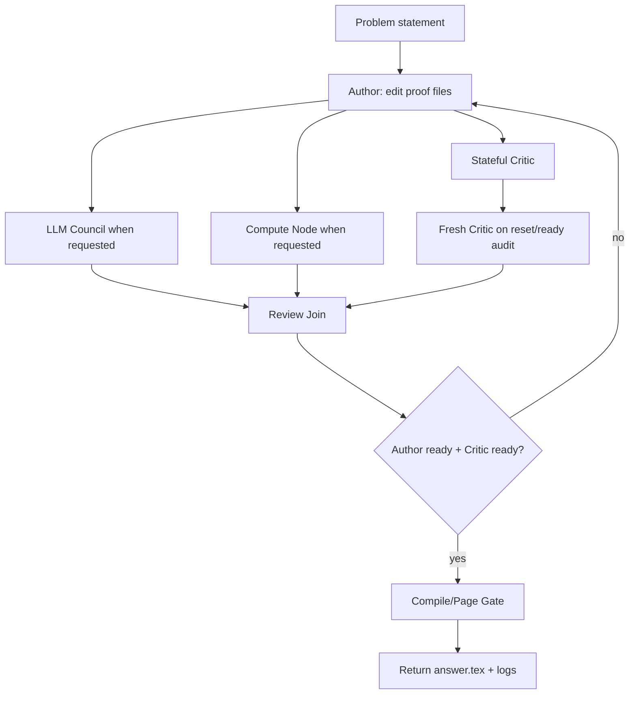

# ProofCouncil：把数学研究 Agent 做成“作者、审稿人、委员会、计算节点”的可审计循环

## 元信息

| 字段 | 内容 |
|---|---|
| 标题 | ProofCouncil: An LLM Agent for Solving Open Mathematical Problems |
| 作者 | Johannes Schmitt, Tim Gehrunger, Jasper Dekoninck, Gergely Bérczi, Uri Kreitner, Liam Price, David Holmes |
| 类型 | 论文 + 开源代码项目 |
| 方向 | 大模型 Agent；数学研究 Agent；可审计工作流 |
| 发布时间 | 2026-07-10 |
| 原文 | [arXiv:2607.09474](https://arxiv.org/abs/2607.09474) |
| 代码 | [eth-sri/proof-council](https://github.com/eth-sri/proof-council) |
| 本文关注 | 不是把它当成“又一个解数学题的 LLM”，而是看它怎样把真实数学研究拆成可运行、可审计、可复盘的 Agent 系统。 |

## TL;DR

- **这篇论文做什么：**ProofCouncil 是 ETH SRI 团队发布的数学研究 Agent，用于攻击开放数学问题；它参加 FirstProof 第二批 10 道真实数学问题挑战，并把系统与底层 Agent-building library 一起开源。
- **它怎么做：**核心不是单次提示，而是一个循环：`Author` 写证明，`Critic` 审查证明，定期重置的 `Fresh Critic` 做独立复核，`LLM Council` 给额外路线，`Compute Node` 调用代码与 CAS 工具验证具体断言。
- **关键工程抽象：**底层库把 Agent 系统表示为条件 DAG；节点可以是 LLM 调用、Python block、CLI 计算 Agent、确定性 gate 或 human node，循环通过 bounded repeat 展开，条件边决定是否调用委员会或计算节点。
- **主要实验数字：**FirstProof 官方 10 题中，ProofCouncil 的 6 题提交被裁判认为正确到至多小修；研究者开放问题集里，30 题有 21 份反馈，其中 5 份完整正确、2 份可能完整但待最终核验、8 份有有用的部分进展。
- **成本与代价：**FirstProof 官方运行记录总成本约 3,186 美元；排除 API timeout 没有产出的 P6 后，约 350 美元/题。作者节点约占 48.8%，critic 约占 31.6%，委员会与 compute worker 分摊其余成本。
- **局限：**两个开放问题输出解决了更容易的解释版本；P8 曾被 critic 错误接受但被人类裁判驳回；部分证明可读性不足；研究者问题集是开发过程中自适应调整后的评估，不是冻结配置的一次性 benchmark。
- **为什么值得读：**它给出一个很清楚的研究型 Agent 样板：复杂任务不要只追求“更强模型”，而要设计状态、文件、独立审查、工具委托、预算、日志、可视化与失败边界。

## 1. 研究问题：开放数学题为什么需要 Agent，而不是单次问答？

### 论文回应的缺口是什么？

- 论文的出发点是：LLM 已经在数学开放问题上显示出能力，但真实数学研究不是一次性生成答案。
- 一个研究者通常会反复做几件事：
  - 写出候选证明；
  - 找反例或断点；
  - 查文献和定义；
  - 对具体子命题做计算；
  - 回到草稿，改写、删去、补充；
  - 请同行指出“这是不是只证明了更弱命题”。
- ProofCouncil 把这些动作显式拆成 Agent 角色，而不是让一个模型在长上下文里同时扮演所有角色。

### FirstProof 给了怎样的压力测试？

| 约束 | 含义 | 对 Agent 设计的影响 |
|---|---|---|
| 10 个真实数学问题 | 题目没有公开解答 | 不能靠检索现成答案；必须组织探索。 |
| 24 小时窗口 | 每个系统要自主运行 | 需要预算、超时、停止条件和错误处理。 |
| 公开模型与工具 | 不能用私有人工流程替代 | Agent 的工具调用、文件输出、审查日志要能落地。 |
| 人类裁判评分 | 最终不只看模型自评 | Critic 只能降低风险，不能替代数学家判断。 |

### 这篇论文真正的 claim

| Claim | Mechanism | Evidence | Boundary |
|---|---|---|---|
| 作者-审稿人循环比单模型更适合开放问题 | Author 维护证明文件，Critic 持续审查并给反馈 | FirstProof 6/10 题达到正确至多小修，优于单次 GPT-5.5-Pro baseline 的 4/9 | 没有做严格消融证明每个组件的独立贡献。 |
| 独立审查能减少路径依赖 | stateful critic 每 3 轮重置；ready 后再 fresh critic audit | P10 中 stateful critic 多次接受，但 fresh critic 全部拒绝，最终避免错误提交 | P8 仍出现 critic false positive，说明独立审查不是充分保障。 |
| 研究 Agent 需要可编辑状态，而不是只靠聊天历史 | `answer.tex`、`research_notes.tex`、`references.bib` 作为 canonical files | README 和 prompt 设计都要求 Author 读写这些文件，并让后续轮次继承 | 文件状态不能自动保证问题解释正确。 |
| 工具委托在具体断言上最有价值 | Compute Node 处理 CAS、代码、检索和反例验证 | 论文说 compute worker 在 P3/P4/P5/P8/P10 中大量用于检验 evolving drafts | 宽泛战略探索仍依赖 Author/Council，人类数学直觉仍重要。 |

## 2. 系统机制：ProofCouncil 的四个核心角色

### Author：不是聊天回复，而是维护三个研究文件

- Author 的职责：
  - 生成并修订 `answer.tex`；
  - 在 `research_notes.tex` 里保存探索、失败路线、文献线索、计算 sanity check；
  - 在 `references.bib` 里维护引用；
  - 对 Critic、Council、Compute Node 的反馈做整合。
- 论文中 Author 使用强推理模型并带有代码执行和搜索工具。
- repo 中的 `author.py` 进一步说明两种文件 I/O 模式：
  - container-files mode：上传三份 canonical files，模型在容器中读写 `/mnt/data/<name>`；
  - inline mode：旧路径，模型用 fenced file block 重写文件。

### Critic：持续审查，但不能永远相信同一个上下文

- Critic 的目标不是“提出建议”，而是以严格数学 referee 的口吻找漏洞：
  - 是否有未证明的关键引理；
  - 是否引用了不适用的文献结果；
  - 是否只解决了更弱或更容易的问题；
  - 是否违反 FirstProof 的 LaTeX 和页数契约。
- 默认 critic 是 stateful：
  - 它会看到历轮证明版本和自己的历史反馈；
  - 好处是能追踪同一个 proof gap 是否被修；
  - 坏处是可能被前文路径绑定，逐渐接受同一个错误框架。
- 因此系统每 `k=3` 轮引入 fresh critic：
  - fresh critic 没有旧对话；
  - 当 stateful critic 接受证明时，还要 fresh critic 做独立 audit；
  - 只有 Author ready、stateful/fresh 审查都过，才可能返回。

### LLM Council：把“换个角度想”做成可调用分支

- Council 不是第二个 critic。
- 它更像研究同事：
  - 当 Author 卡在子问题时，给可能路线；
  - 对某个技术 lemma 提供邻近文献或反例方向；
  - 用不同模型的归纳偏好增加探索多样性。
- 论文配置中，council 包含 GPT-5.5-Pro、Claude Opus、Gemini Pro 系列模型。
- 它们彼此独立回答，Author 下一轮把这些回答作为额外上下文。

### Compute Node：把可验证子任务从主循环剥离

- Compute Node 是一个 Codex agent，能调用更丰富的数学软件环境。
- 论文列出的工具包括：
  - SageMath；
  - GAP；
  - Singular；
  - PARI/GP；
  - 普通代码执行与文件系统。
- 它适合处理的任务：
  - 枚举小规模例子；
  - 直接验证某个代数、组合或数论断言；
  - 查找候选反例；
  - 下载和阅读相关论文；
  - 维护多轮代码工作区。
- 论文里的一个重要边界是：compute worker 对“具体可检验断言”最有用；如果 Author 还没有把问题缩成可执行检查，它就很难凭空提供战略突破。

## 3. 运行逻辑：从循环到条件 DAG

### 为什么要把 Agent 做成 DAG？

- 开放数学问题的控制流不是线性链。
- 每一轮可能发生：
  - Author 写文件；
  - Critic 总是审查；
  - Council 只有 Author 请求时才运行；
  - Compute Node 只有 Author 请求时才运行；
  - Fresh Critic 只在特定轮次或 ready gate 前运行；
  - Compile gate 只在准备返回时严查 LaTeX。
- 论文和 repo 都把这个结构抽象成 conditional DAG：
  - 节点是模型调用、工具、CLI worker、确定性 gate、人类节点；
  - 边表示依赖；
  - 条件边表示“只有上游输出满足条件才执行”；
  - repeat block 把反馈循环展开成有限 DAG。



### 伪代码：ProofCouncil 的控制循环

```text
Input:
  problem, budget, max_rounds, page_limit

State:
  answer.tex, research_notes.tex, references.bib
  critic_history
  council_replies, compute_replies
  cost, wallclock

for round in 0..max_rounds:
  Author reads current files and latest feedback
  Author writes revised files
  Author may emit:
    <council> question </council>
    <compute_agent> instructions </compute_agent>
    <ready>true/false</ready>

  run stateful_critic on revised files

  if round % k == 0 or stateful_critic accepts:
    run fresh_critic from empty history

  if council requested:
    run council members independently

  if compute requested:
    run persistent compute worker

  join all reviews and tool replies

  if Author ready and required critic checks accept:
    compile answer.tex
    if page_limit and compile gate pass:
      return solution

  if budget exhausted or timeout:
    return best available files with failure metadata

Output:
  final files, run logs, cost accounting, reviewer decisions
```

### 这里的 Agent 设计原则

- **状态外显：**关键状态写入文件，不埋在聊天上下文里。
- **审查独立：**不能只让同一个 critic 越看越顺眼，要定期换新上下文。
- **工具按需：**Council 和 Compute Node 都不是每轮强制运行，而是由 Author 结构化请求触发。
- **预算可见：**运行有最大美元预算和 wallclock，FirstProof preset 设置 24 小时上限。
- **失败可归因：**compile gate、timeout、API error、critic reject、page limit 都是不同失败类型。

## 4. 论文实验：研究者开放问题集

### 数据来源与评估方式

- 作者联系 ETH Zurich 数学系成员，并从其他机构私下收集开放问题。
- 每个问题先经过 screening：
  - 判断陈述是否自包含；
  - 判断是否有缺定义或明显错字；
  - 必要时与提交研究者协作修改。
- 系统总共尝试：
  - 30 个研究者提供的开放问题；
  - 3 个公开 Erdős 问题；
  - 其中研究者问题的输出会发回给问题作者请求反馈。

### 表 1 的结果怎么读？

| 类别 | 数量 | 应怎样解释 |
|---|---:|---|
| Problems evaluated | 30 | 研究者开放问题总数，不含 3 个公开 Erdős 问题。 |
| Researcher reviews received | 21 | 只有 21 份收到人类反馈，未反馈的不应当算成功或失败。 |
| Complete solutions | 5 | 问题作者认为完整正确。 |
| Possibly complete solutions | 2 | 有希望完整，但还需最终核验。 |
| Meaningful partial progress | 8 | 没有完全解决，但提供了研究者认为有用的进展。 |
| No errors, but no progress | 4 | 没明显错，但没有实质推进。 |
| Misinterpreted problems | 2 | 证明可能正确，但解决的是更容易的解释版本。 |

### 这个结果最有信息量的地方

- 正面信号：
  - 5 个完整解和 8 个有用部分进展，说明多轮 Agent 在真实开放问题上不只是复述文献；
  - 论文强调，没有收到“声称解决原题但数学上错误”的人类反馈。
- 负面信号：
  - 2 个 misinterpretation 说明，系统可能严谨地证明了“错误问题”；
  - 这类问题很难被共享同一题意的 Author/Critic 内部发现；
  - 需要外部专家或问题提交者确认“这是不是原题真正意思”。
- 评估边界：
  - 这些运行在开发过程中反过来影响 prompt 和 bug fixes；
  - 因此它更像开发期 field test，而不是冻结版本的 blind benchmark。

## 5. FirstProof 结果：6/10 题与成本结构

### 官方挑战中的结果分布

| 问题 | 结果 |
|---|---|
| P1, P2, P3, P5, P7, P9 | 裁判认为正确到至多小修。 |
| P10 | 有部分进展，但需要大修。 |
| P4, P8 | 被驳回。 |
| P6 | 因 OpenAI API repeated timeout 没有产出，不纳入后续性能分析。 |

### 与单次 baseline 的对比

- 论文给出的比较：
  - ProofCouncil：9 个可分析问题中解决 6 个；
  - single-query GPT-5.5-Pro baseline：9 个可分析问题中解决 4 个；
  - ProofCouncil 成本约 350 美元/题；
  - 单次 baseline 成本约 12 美元/题。
- 这不是“ProofCouncil 免费提升准确率”的故事。
- 更准确的结论是：
  - 多 Agent 循环能把 solve rate 从 4/9 推到 6/9；
  - 但用重复 frontier-model 调用换来了约 30 倍级别的成本；
  - 论文没有优化成本，因此后续空间在 routing、early stopping、cheap critic、子任务模型选择。

### 成本拆解

| 组件 | 成本 | 占比 | 说明 |
|---|---:|---:|---|
| Author | $1,555 | 48.8% | 主证明生成与修订，最大开销。 |
| Critic, fresh and stateful | $1,008 | 31.6% | 审查几乎与 Author 同等重要，也同样昂贵。 |
| Council: GPT-5.5-Pro | $361 | 11.3% | 最强也最贵的 council member。 |
| Council: Claude Opus 4.7 | $115 | 3.6% | 在 P3/P5 有具体贡献。 |
| Council: Gemini 3.1 Pro Preview | $18 | 0.6% | 便宜，但作用更偏路线验证。 |
| Compute worker | $128 | 4.0% | 成本小于 Author/Critic，但对具体检查有帮助。 |

### 组件 utility 的关键观察

- Critic 的正面作用：
  - 几乎所有问题中都帮助避免错误解过早接受；
  - P10 中 stateful critic 多次接受中间版本，但 fresh critic 全部拒绝，最终避免把不完整方案当成完成。
- Critic 的失败：
  - P8 中 critic 接受了一个依赖未证明技术断言的错误方案；
  - P3 中 critic 一直拒绝，但人类裁判认为正确到小修。
- Council 的作用：
  - GPT-5.5-Pro 在 P3/P5/P10 提供明显有用想法；
  - Claude 在 P3 提供正确方向，在 P5 提供有用评论；
  - Gemini 成本低，在 P5 路线验证、P3 类比上有帮助。
- Compute worker 的作用：
  - 在 P3/P4/P5/P8/P10 使用较多；
  - 主要用于文献检索和验证草稿中产生的具体 claims；
  - 多次发现反例或中间断言失败。

## 6. 附录 A：Erdős 539 为什么是关键证据？

### 它不是主 benchmark，却展示了“研究进展”的形态

- 附录 A 给出 ProofCouncil 对 Erdős Problem 539 的进展。
- 该问题研究：

```math
Q(A)=\left\{\frac{a}{\gcd(a,b)}:a,b\in A\right\}
```

- 其中：
  - `A` 是正整数有限集；
  - `|A|=n`；
  - `h(n)` 是所有大小为 `n` 的 `A` 中 `|Q(A)|` 的最小可能值。
- 已知公开界限曾是：

```math
n^{1/2}\ll h(n)\ll n^{2/3}
```

- ProofCouncil 产出的改进是：

```math
\frac{1+\sqrt{8n-7}}{2}\le h(n)\le n^{1/2}\exp(C\sqrt{\log n})
```

- 因而得到指数结论：

```math
\lim_{n\to\infty}\frac{\log h(n)}{\log n}=\frac{1}{2}
```

### 证明路线的结构

| 步骤 | 作用 | 关键对象 |
|---|---|---|
| 数论问题向向量问题转换 | 用唯一分解把整数的 gcd 结构变成指数向量差 | `D(F)=(F-F)_+` |
| 通用平方根下界 | 用普通差集大小约束正差集大小 | `|F-F| >= 2n-1` |
| 二维 base strip | 构造一个正差集较小的基础集合 | `B_W subset Z^2` |
| separated suspension | 把已有构造升维并控制 `D(F)` 增长 | `S_K(F) subset Z^{2d+1}` |
| 迭代优化 | 让维度随 `n` 增长，得到 `n^{1/2+o(1)}` | `s ~ sqrt(log n)` |

### 为什么这个附录对 Agent 文章重要？

- 它展示的不是 benchmark 上“答对选择题”，而是：
  - Agent 给出一个可写成自包含数学文本的证明；
  - 人类专家验证主要内容；
  - Codex + GPT-5.5 进一步把主要组合与渐近成分形式化到 Lean；
  - 形式化范围也被清楚标明：指数结论与固定深度上界被形式化，显式 `n^{1/2} exp(C sqrt(log n))` 上界仍只在非形式化证明中给出。
- 这正好说明 ProofCouncil 的可信度边界：
  - 不是“模型说了所以真”；
  - 而是“模型产出候选证明，人类与形式化工具再划定哪些部分可信”。

## 7. 失败模式：这篇论文最值得保留的负面证据

### Misinterpretation 是最危险的失败

- 两个研究者问题被判断为解决了更容易版本。
- 这类错误特别难处理：
  - Author 可能从第一轮就采用错误解释；
  - Critic 读到的是同一题面与同一解释，也可能默认接受；
  - Compute Node 只能验证当前形式化后的断言；
  - Council 也可能围绕错误解释给建议。
- 改进方向：
  - 加入独立 problem interpretation node；
  - 让该 node 输出“可能解释集合”；
  - 在 Author 证明前先让问题提交者或 domain expert 选定解释；
  - 对关键结论做“是否解决原题”专项审查，而不是只审查证明内部一致性。

### Local minimum 是循环 Agent 的常见病

- 论文的 postscreen audit 发现：
  - ProofCouncil 有时反复修补同一个 proof issue；
  - 这些修补没有真正推进完整证明；
  - 系统像研究者一样“卡在一个局部路线”。
- 一个直接方案是并行多个 author-critic threads：
  - 好处：增加策略多样性；
  - 代价：成本大幅上升；
  - 需要更强的 merger 或 portfolio selector。

### Critic 既会假阳性，也会假阴性

| 案例 | 现象 | 含义 |
|---|---|---|
| P8 | critic 接受，但人类裁判拒绝 | LLM critic 可能漏掉未支撑的核心断言。 |
| P3 | critic 一直拒绝，但裁判认为小修可过 | critic 可能过度保守，错杀可接受证明。 |
| P10 | stateful critic 多次接受，fresh critic 拒绝 | fresh critic 对路径依赖有实际防御价值。 |

### 可读性也是 research Agent 的质量指标

- 作者承认 ProofCouncil 优先优化“找到正确解”，不是优化“写出可读论文”。
- 多位数学家反馈：
  - 输出证明可能密集；
  - 对非该子领域专家不够友好；
  - 需要补背景、统一符号、扩展论证说明。
- 这提示下一代系统可以引入：
  - exposition agent；
  - notation normalizer；
  - proof-to-paper rewrite pass；
  - human-facing explanation critic。

## 8. 与近期数学 Agent 工作的相对位置

### 它和形式化证明 Agent 不完全同类

- Prover Agent、Lean/Coq/Isabelle 系统通常强调：
  - 把证明写进形式系统；
  - 依赖 proof assistant 检查；
  - benchmark 多是可形式化题集。
- ProofCouncil 的重心不同：
  - 面向开放数学研究；
  - 证明首先是 LaTeX 研究文本；
  - formalization 是局部和后续验证手段；
  - 人类裁判仍是终极评价。

### 它和 AI co-mathematician 的差异

- AI co-mathematician 类工作更强调帮助数学家生成 conjecture、搜索结构、协作推进。
- ProofCouncil 更像一个 FirstProof harness：
  - 输入题目；
  - 自主运行 24 小时；
  - 输出 `answer.tex`；
  - 有清晰 budget、page limit、ready gate、compile gate。
- 因此它更适合作为“自主数学研究 Agent 的可审计运行系统”来读。

## 9. 对 Agent 系统设计的启发

### Detail inventory：把论文细节拆成可复用工程清单

| 维度 | 论文/代码中的具体做法 | 可以迁移到哪里 |
|---|---|---|
| 输入 | FirstProof 题面或研究者给出的开放问题；必要时先做 prescreen | 法律研究、漏洞分析、长程代码修复、科学文献假设生成 |
| 主状态 | `answer.tex`、`research_notes.tex`、`references.bib` 三个文件 | 任何需要区分正式交付、工作笔记、引用来源的任务 |
| 主循环 | Author 根据 Critic/Council/Compute 反馈改写文件 | 复杂报告写作、形式化验证、设计文档迭代 |
| 审查机制 | stateful critic 追踪历史，fresh critic 周期性独立复核 | 防止 reviewer 被旧上下文“说服”或路径依赖 |
| 工具分派 | Author 用结构化 tag 请求 council 或 compute worker | 让主 Agent 只在有具体问题时调用昂贵分支 |
| 终止条件 | ready gate、compile gate、预算、超时、最大轮数 | 长任务必须有可解释停止原因 |
| 可观测性 | run monitor、execution graph、cost accounting、输出文件 | 让失败复盘能定位到节点，而不是只看最终回答 |

### 消融问题：论文没有完全回答，但给了线索

- 如果只保留 Author + stateful Critic：
  - 可能降低成本；
  - 但 P10 的例子说明 stateful critic 会接受不完整方案；
  - fresh critic 的防御价值会消失。
- 如果去掉 Council：
  - 成本会下降；
  - 但 P3/P5/P10 中 GPT-5.5-Pro council 的贡献会缺失；
  - 系统更容易陷入单一路线。
- 如果去掉 Compute Node：
  - 总成本只下降约 4%；
  - 但具体断言检查、反例搜索和文献检索能力会弱很多；
  - 对 P3/P4/P5/P8/P10 这类需要验证 evolving claims 的问题影响可能大于成本占比。
- 如果只用 single-query baseline：
  - 成本大幅降低；
  - 但 FirstProof 可分析 9 题中从 6 题降到 4 题；
  - 说明“多轮审查 + 工具委托”确实买到了部分额外 solve rate。

### 可复现性边界：开源不等于结果可完全复跑

- 可复现部分：
  - repo 公开了 app、workflow preset、prompt、Docker/FirstProof harness 入口；
  - README 给出 `uv sync`、本地 app、CLI workflow、Docker harness 的运行路径；
  - FirstProof 输出格式包括每题 `.tex`、`solutions.json`、`run_summary.json`、`token_usage.jsonl` 和 workflow traces；
  - 附录 A 的 Lean 目录公开了 Erdős 539 相关形式化模块。
- 不完全可复现部分：
  - 论文使用的 frontier model 版本、API 行为和工具环境会随时间变化；
  - 研究者私有开放问题及其反馈不能全部公开；
  - 成本和 timeout 与当时的服务状态相关，P6 就因为 repeated API timeout 没产出；
  - 人类裁判对“正确到小修”的判断不是自动判分器。
- 因此，读这篇论文时应把开源 repo 看作“系统设计和运行框架可复查”，而不是把每个数学成功都看作可一键复现的 benchmark score。

### 安全与治理视角：为什么这也属于 Agent safety 话题？

- 数学证明看似低风险，但 ProofCouncil 暴露的治理问题非常通用：
  - Agent 会产生高置信输出，但它可能解决了错误解释；
  - 审查 Agent 会被上下文影响，不能被当成最终事实裁判；
  - 工具调用能提高能力，也会扩大错误路线的执行半径；
  - 成本预算会影响系统是否继续审查，进而影响错误暴露概率。
- 对更高风险领域，例如网络安全、代码迁移、科学实验规划，这些问题会更尖锐：
  - “误解任务”可能变成错误修复或错误实验；
  - “critic false positive”可能放行不安全补丁；
  - “局部最小值”可能让系统反复加固错误假设；
  - “工具节点”可能把未经审查的计划执行到真实环境。
- 所以 ProofCouncil 的价值也在于：它把这些风险放进一个可观察的研究场景，而不是只在抽象安全原则里讨论。

### 研究型 Agent 需要“文件状态 + 审查状态 + 工具状态”

| 状态类型 | ProofCouncil 中的形式 | 为什么重要 |
|---|---|---|
| 交付状态 | `answer.tex` | 最终可被人类和编译器检查。 |
| 研究状态 | `research_notes.tex` | 保存失败路线、背景、局部观察，不污染正式证明。 |
| 引用状态 | `references.bib` | 强迫文献引用可追踪。 |
| 审查状态 | critic conversation / fresh audit | 区分连续追踪与独立复核。 |
| 工具状态 | compute workspace | 让复杂计算和检索能跨轮持续。 |
| 运行状态 | cost、round、timeout、compile result | 支撑预算控制和失败归因。 |

### “可审计”不等于“保证正确”

- ProofCouncil 的 audit 能做到：
  - 谁写了什么文件；
  - 哪一轮 critic 提了什么问题；
  - 哪个 council member 给了什么建议；
  - compute worker 检查了什么；
  - 何时 ready、何时 compile gate 通过；
  - 成本分布如何。
- 它不能自动做到：
  - 证明一定正确；
  - 题意一定没有误解；
  - 文献引用一定足够；
  - human referee 一定会接受。
- 因此它的价值是降低黑箱程度，而不是把数学判断完全自动化。

### 最值得迁移的模式

- 对任何复杂研究 Agent，都可以借鉴这四个 gate：
  - **Interpretation gate：**先确认问题到底是什么；
  - **Generation gate：**让 Author 维护可交付文件；
  - **Independent review gate：**定期让 fresh reviewer 从零审查；
  - **Execution gate：**让工具节点验证具体 claims，并把输出纳入日志。

## 10. 结论与后续问题

### 本文判断

- ProofCouncil 最重要的贡献不是“数学 Agent 终于能解决开放题”这一句。
- 更准确地说，它给了一个可运行的系统蓝图：
  - 用 Author/Critic 循环模拟研究写作；
  - 用 fresh critic 抵抗路径依赖；
  - 用 council 增加策略多样性；
  - 用 compute node 把可验证子任务交给工具；
  - 用 conditional DAG 把这些组件编排成可视化、可审计、可扩展的 workflow。

### 证据边界

- 数字上，FirstProof 的 6/9 可分析问题成功率很强，但成本高。
- 开放问题集的 5 个完整解和 8 个部分进展很有价值，但不是冻结配置评测。
- Critic 能减少错误，却会同时出现 false positive 和 false negative。
- 形式化证明覆盖了 Erdős 539 结果的主要组合与渐近成分，但没有覆盖所有非形式化上界细节。

### 继续追问

- 如何设计一个低成本 routing policy，让 easy subtask 走便宜模型，hard proof step 才调用 frontier model？
- 如何把 problem interpretation 作为独立、可审计、可反驳的前置阶段？
- 如何在并行 author-critic 线程之间做 portfolio selection，而不是只靠单一路线反复修补？
- 如何把 LaTeX 证明自动拆成可形式化 lemma graph，让 Lean/Coq 逐步接管关键断言？
- 如何评估“有用部分进展”，让开放数学 Agent 不只按 solved/unsolved 二分？
