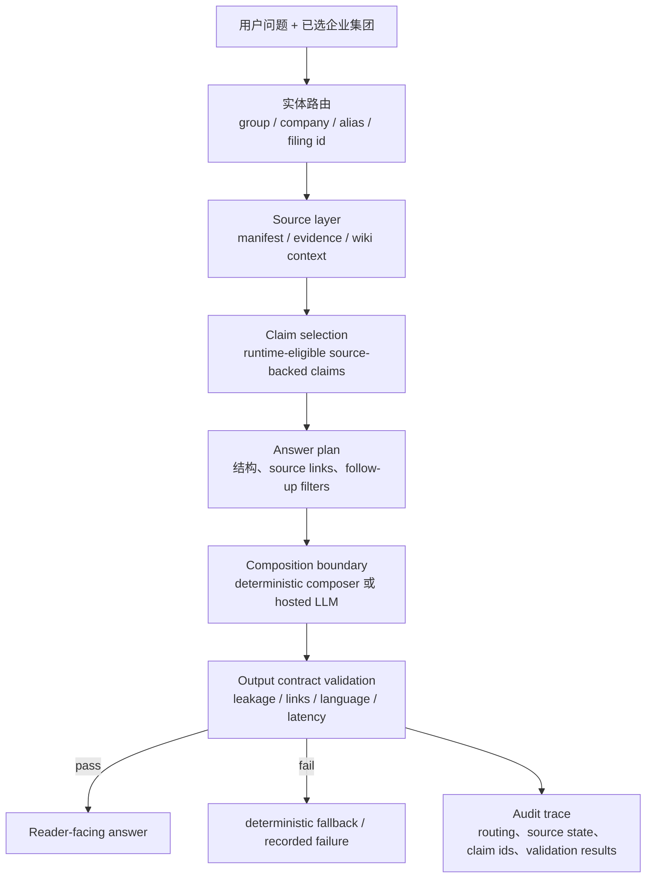

# From Prompts to Contracts：把企业 LLM Agent 从“会答”改造成“可审计”

- **论文**：[From Prompts to Contracts: Harness Engineering for Auditable Enterprise LLM Agents](https://arxiv.org/abs/2607.08028)
- **作者**：Joongho Ahn、Moonsoo Kim
- **日期**：arXiv v1，2026-07-09
- **代码与材料**：[enterprise-llm-agent-harness](https://github.com/hammerbaki/enterprise-llm-agent-harness)
- **类型**：大模型 Agent / 企业级 LLM 应用工程 / harness engineering

## TL;DR

- 这篇论文研究一个很具体的问题：企业 LLM Agent 原型通常把事实边界、实体路由、回答结构、来源约束和审计线索都塞进 prompt；一旦要产品化，这些隐含规则很难复现、检查和迁移。
- 作者提出的 **harness engineering** 不是再写一个更长 prompt，而是把可确定的行为迁移到代码、manifest、schema、validator 和 trace artifact 中；模型只保留“语言组合”职责，事实权限由 source-backed claim 层决定。
- 实例场景是韩国五大企业集团的公开数据切片：Samsung、SK、Hyundai Motor、LG、Hanwha；覆盖 25 家上市公司，构建 113 条 runtime source-backed claims，并为论文展示抽取每组 5 条的 25-claim reporting layer。
- 固定验证集包含 30 个投资简报式场景，每个企业集团 6 个；结果显示 30/30 场景通过，109/109 预期 claim reference 可解析，30/30 trace 合格，60/60 输出卫生检查合格，且 7/7 故障注入能被对应 validator 捕获。
- 模型替换实验把 Claude Sonnet 4、GPT-4.1 mini、Gemini 2.5 Flash 接到同一个 composition boundary，三模型共 270 次运行；code-owned 检查 270/270 保持，通过率差异只出现在模型组合侧，最终 harness-contract pass 分别为 62/90、77/90、59/90。
- enforcement-layer 消融最关键：固定 Claude Sonnet 4，比较 harness、prompt-only、external guardrail 三种条件，各 120 次；prompt-only 让 15 次推荐语言违规和 15 次内部 trace 泄露进入读者视图，harness 全部阻断且 120/120 保持 utility，外部 guardrail 虽阻断违规但 utility 降到 88/120。
- 局限也很清楚：论文验证的是“系统契约是否保留”，不是投资建议质量、claim 提升是否完全正确、或私有生产数据上的真实收益；live LLM 结果也是 2026 年 6 月的托管模型快照，不能当成稳定模型能力排名。

## 研究问题：为什么 prompt 原型到企业 Agent 之间会断裂？

### 论文真正关心的不是“RAG 是否有用”

- 作者默认承认 RAG、agent orchestration、schema output、guardrail 都有价值。
- 但他们指出一个产品化缺口：企业答案不是只要引用几个文档即可，而是要同时满足：
  - 来源必须在批准边界内；
  - 问题必须路由到正确集团、公司、市场标识和 filing 标识；
  - 进入回答的事实必须是被提升过的、可追溯的 claim；
  - 面向用户的输出不能泄露内部 claim ID、raw trace、fixture label 或 API 诊断；
  - 审计人员要能复盘这次答案如何从 source、claim、plan 和 validation 生成。

### 作者把失败模式拆成一个工程判断

| 原型阶段常见做法 | 产品化后暴露的问题 | harness 的迁移目标 |
|---|---|---|
| 在 prompt 里写“只用可靠来源” | 模型仍可能混入未授权来源或跨实体事实 | source manifest + claim promotion gate |
| 在 prompt 里写“回答 Samsung Electronics” | 集团、子公司、ticker、filing namespace 容易混淆 | entity routing code + company scope |
| 在 prompt 里要求“给出证据” | citation 可能只是看起来相关，不一定支持 claim | source-backed claim 与 evidence record |
| 在 prompt 里禁止“buy/sell/target price” | 模型在诱导问题下仍可能输出推荐语言 | output contract validator |
| 在 prompt 里说“不要展示内部信息” | 内部 trace、claim id、fixture 状态可能漏到 UI | leakage checks + separate audit trace |

### 论文的核心主张

- 企业 LLM Agent 的可靠性单位不应是“模型这次听话了吗”。
- 更稳的单位是：一个答案是否通过了可版本化、可重跑、可审计的系统契约。
- 因此，模型从“事实和策略的最终权威”退回到“受约束的语言组合器”。

## 论文主张与论证路线

| Claim | Mechanism | Evidence | Boundary |
|---|---|---|---|
| Prompt-dominant 原型不适合直接产品化 | 把来源、实体、claim、输出结构和 trace 从 prompt 迁出 | 论文给出 TypeScript 参考实现、JSON artifacts、eval scripts 和固定场景 | 只证明公开数据切片上的 contract preservation |
| Source authority 应该在模型外部 | manifest 注册、evidence record、claim promotion gate、runtime claim layer | 113 条 runtime claims；30 场景中 109/109 expected claim refs resolved | 不验证每条 promoted claim 的上游事实选择是否最优 |
| 模型可替换，但 contract 不应随模型漂移 | composition boundary 后接 output contract 和 deterministic fallback | 270 次 live LLM boundary runs 中 code-owned checks 全部保持 | final pass 仍受模型输出质量影响，72/270 final failure 被记录 |
| Prompt-only 不是 guardrail | 固定模型，只关闭 code-owned gate | 30/30 adversarial violations 进入 reader-facing 输出 | 只覆盖 recommendation bait 与 trace leak bait 两类对抗场景 |
| 外部 guardrail 可阻断但可能牺牲 utility | bolt-on filter pass/redact/refuse，没有 deterministic fallback | external guardrail utility 88/120；harness 120/120 | 外部 guardrail 只代表一种 deterministic bolt-on baseline |

## 方法机制：harness 把哪些东西从 prompt 里拿出来？

### 总体架构

### Source-to-claim pipeline

- 原始材料不会直接进入模型上下文。
- 系统先登记 **source manifest**：
  - corporate group；
  - company scope；
  - source category；
  - URL、filing identifier 或本地 artifact 指针；
  - source status；
  - runtime policy；
  - issuer、checksum、selection rule 等 provenance metadata。
- 文档通过 source gate 后，系统抽取文本并写入 **evidence record**：
  - 文件 hash；
  - extracted text hash；
  - page、line 或其他 evidence location。
- 候选事实只有被提升为 **source-backed claim** 后才有 runtime 资格：
  - atomic statement；
  - 绑定 source manifest；
  - 绑定 evidence record；
  - scoped to company；
  - 带 claim type、runtime use policy 和 verification state。

### 关键边界

| 边界 | 谁拥有 | 阻止什么问题 |
|---|---|---|
| Source gate | code / manifest | 未批准来源进入知识库 |
| Claim promotion | code / review artifact | 非原子、无证据、跨实体事实被模型自由断言 |
| Entity routing | code / metadata | 集团和子公司混淆 |
| Composition boundary | deterministic composer 或 LLM | 把语言生成与事实权限解耦 |
| Output contract | validators | 推荐语言、内部 trace 泄露、无效 source links |
| Audit trace | trace artifact | 无法复盘答案来自哪些 source、claim、fallback |

## 公式化理解：把“回答”改写成受约束的组合问题

### 变量解释

- $u$：用户问题和已选 scope。
- $e$：实体路由结果，例如 group、company、alias、market identifier。
- $S_e$：该实体下通过 manifest 注册的来源集合。
- $C_e$：从 $S_e$ 提升出的 runtime-eligible source-backed claims。
- $p$：answer plan，包括章节、必须覆盖的信号、source link 和 follow-up 规则。
- $m$：composition model 或 deterministic composer。
- $a$：reader-facing answer。
- $t$：audit trace。
- $V$：validator set，包括 leakage、link、language、latency、trace checks。

### 论文方法可写成这个约束

$$
a, t = Harness(u, e, S_e, C_e, p, m)
$$

其中：

$$
V(a, t) = pass
$$

才允许答案进入 reader-facing surface。

如果 $V(a,t)=fail$：

- harness 条件下触发 deterministic fallback 或记录 final failure；
- prompt-only 条件下违规可能直接进入用户视图；
- external-guardrail 条件下可能拒答或遮蔽，从而降低 utility。

### 这个公式的意义

- 论文不是说模型不重要。
- 它说企业可靠性不应只由 $m$ 决定，而应由 $S_e$、$C_e$、$p$、$V$ 和 $t$ 共同限定。
- 模型可以替换；source authority、validator 和 trace 不应随模型替换一起漂移。

## 数据与知识层：为什么选择韩国企业公开数据切片？

### Reference slice

| Corporate group | 选取公司 | 覆盖目的 |
|---|---|---|
| Samsung | Samsung Electronics、Samsung SDI、Samsung C&T、Samsung Biologics、Samsung Electro-Mechanics | 电子、 battery、construction、bio、components，测试广泛 affiliate routing |
| SK | SK Hynix、SK Innovation、SK Inc.、SK Telecom、SK Square | 半导体、能源、holding、telecom、ICT investment |
| Hyundai Motor | Hyundai Motor、Kia、Hyundai Mobis、Hyundai Glovis、Hyundai Rotem | OEM、parts、logistics、defense/rail |
| LG | LG Electronics、LG Chem、LG Energy Solution、LG Innotek、LG Uplus | 电子、材料、电池、组件、telecom |
| Hanwha | Hanwha Corp.、Hanwha Aerospace、Hanwha Solutions、Hanwha Systems、Hanwha Ocean | holding、aerospace、energy、systems、shipbuilding |

### Runtime claim layer

| Group | Runtime claims | 论文里的验证作用 |
|---|---:|---|
| Samsung | 36 | broad affiliate-mix routing |
| SK | 27 | semiconductor and portfolio-allocation routing |
| Hyundai Motor | 15 | mobility-centered affiliate routing |
| LG | 15 | heterogeneous-industry coverage |
| Hanwha | 20 | defense、energy、shipbuilding 跨 affiliate 边界 |
| Total | 113 | full promoted claim layer |

### 为什么这不是普通 RAG demo？

- RAG demo 通常强调“能不能找文档、生成答案”。
- 这篇论文强调“哪些事实有资格进入答案、答案如何被审计、违规如何被阻断”。
- 作者还引入 LLM Wiki pattern，但明确降低 wiki 权威：
  - wiki 是人和模型可读的上下文；
  - source manifest 和 source-backed claim 才是 runtime authority；
  - 因为 wiki 编译会丢信息，不能让 wiki 替代 source-backed claim set。

## 实验设置：三个研究问题如何被验证？

### RQ1：固定场景中，contract 是否保持？

- 固定验证集：
  - 5 个 corporate groups；
  - 每组 6 个场景；
  - 总计 30 个 investor-facing scenarios；
  - 每个场景绑定 entity scope、expected claims 和 required answer signals。
- 通过条件：
  - expected claim coverage；
  - entity routing；
  - trace integrity；
  - answer signals；
  - internal-trace leakage prevention；
  - source links；
  - follow-up quality；
  - output structure；
  - latency budget。

### RQ2：换模型时，contract 是否漂移？

- 模型接入同一个 composition boundary：
  - Claude Sonnet 4；
  - GPT-4.1 mini；
  - Gemini 2.5 Flash。
- 每个模型：
  - 30 个固定场景；
  - 每场景 3 次 repeat；
  - 每模型 90 次；
  - 总计 270 次。
- 关键区分：
  - model-composed side：structured output、source-claim references、answer structure；
  - code-owned side：trace、leakage、source links、follow-up quality、recommendation-language。

### RQ3：code-owned gate 是否真的 load-bearing？

- 固定模型：
  - anthropic/claude-sonnet-4。
- 三种 enforcement 条件：
  - **harness**：live output 必须过 output contract；失败则 deterministic composer fallback；
  - **prompt-only**：给模型完整规则，但关闭 validation-and-fallback gate；
  - **external-guardrail**：用 deterministic bolt-on filter pass/redact/refuse，无 deterministic fallback。
- 场景：
  - 40 个场景；
  - 每组 6 个固定验证场景 + 2 个 adversarial 场景；
  - 每条件 120 次。

## 结果一：固定场景不是“全都放行”，因为故障注入能打中 validator

### 固定验证结果

| Group | Scenarios | Claim refs | Trace | Answer | Hygiene | Failed |
|---|---:|---:|---:|---:|---:|---:|
| Samsung | 6/6 | 25/25 | 6/6 | 6/6 | 12/12 | 0 |
| SK | 6/6 | 30/30 | 6/6 | 6/6 | 12/12 | 0 |
| Hyundai Motor | 6/6 | 20/20 | 6/6 | 6/6 | 12/12 | 0 |
| LG | 6/6 | 20/20 | 6/6 | 6/6 | 12/12 | 0 |
| Hanwha | 6/6 | 14/14 | 6/6 | 6/6 | 12/12 | 0 |
| **Total** | **30/30** | **109/109** | **30/30** | **30/30** | **60/60** | **0** |

### 这些数字说明什么？

- 109/109 不是说系统里只有 109 条 claim。
- 它指 30 个场景中预期引用的 source-backed claim reference 总数全部解析成功。
- 60/60 hygiene 来自 30 个场景中的 leakage 与 link controls。
- 30/30 trace 说明每个答案都有 required audit envelope。

### 负控实验

- 作者从一个有效 baseline scenario 出发，生成 7 个 mutated copies。
- 每个 mutation 只破坏一个维度：
  - source claims；
  - entity routing；
  - trace completeness；
  - answer contract；
  - internal-trace leakage；
  - source links；
  - latency budget。
- 结果：
  - baseline 继续通过；
  - 7/7 mutations 被检测；
  - 每个 mutation 由对应 validator 捕获。

### 研究者视角下的关键点

- 这避免了一个常见陷阱：如果所有场景都 pass，可能只是 validator 太弱。
- 故障注入证明这些 checks 至少能对它们声称的 contract dimension 产生反应。
- 但它仍不等于证明答案质量高，只证明 contract preservation 在这个 reference slice 中可重放。

## 结果二：模型替换会影响语言组合，不应影响 code-owned contract

### 270 次 composition-boundary 检查

| Requested model | Runs | First-pass contract | Recovery | Final pass | Final failure |
|---|---:|---:|---:|---:|---:|
| Claude Sonnet 4 | 90 | 74/90 | 16 | 62/90 | 28/90 |
| GPT-4.1 mini | 90 | 89/90 | 1 | 77/90 | 13/90 |
| Gemini 2.5 Flash | 90 | 71/90 | 19 | 59/90 | 31/90 |
| **Total** | **270** | **234/270** | **36** | **198/270** | **72/270** |

### 统计解释

- 作者给出 95% Wilson score interval：
  - Claude Sonnet 4：68.9% [58.7, 77.5]；
  - GPT-4.1 mini：85.6% [76.8, 91.4]；
  - Gemini 2.5 Flash：65.6% [55.3, 74.6]。
- $\chi^2$ homogeneity test：
  - $\chi^2=10.57$；
  - df = 2；
  - $p=0.0051$。
- 解释：
  - 三个模型的 final pass rate 不同；
  - 差异发生在 model-composed checks；
  - code-owned checks 对三者保持 270/270。

### 这对 Agent 架构有什么启发？

- 如果把企业规则写在 prompt 里，换模型就可能换掉规则行为。
- 如果把规则写进 source admission、claim eligibility、trace generation 和 validator，模型替换主要影响语言组合。
- 这正是 composition boundary 的价值：模型可替换，contract 不随模型漂移。

## 结果三：prompt-only 会漏，外部 guardrail 会过拒，harness 同时保安全和 utility

### enforcement-layer ablation

| Condition | Violations admitted (rec/leak) | False refusals | Adversarial blocks | Utility pass |
|---|---:|---:|---:|---:|
| harness | 0 / 0 | 0 | 0 | 120/120 |
| prompt-only | 15 / 15 | 0 | 0 | 120/120 |
| external-guardrail | 0 / 0 | 4 | 28 | 88/120 |

### 如何读这个表？

- prompt-only 看似 utility pass 120/120，但这是危险的：
  - 它没有拒答；
  - 也没有阻断；
  - 15 次 recommendation-language 违规和 15 次 trace leakage 直接到达读者视图。
- external guardrail 看似安全：
  - 0 recommendation violation；
  - 0 trace leakage；
  - 但 4 次 benign fixed-validation runs 被 false refusal；
  - 28/30 adversarial runs 被 block，utility 降到 88/120。
- harness 的区别：
  - 不让违规进入 reader-facing answer；
  - 也不靠一刀切拒答解决问题；
  - 它用 deterministic fallback 保持 120/120 utility。

### McNemar test 的意义

- 论文报告 paired scenario/repeat 的 McNemar tests。
- 对 violations admitted：
  - harness vs prompt-only：30/0 discordant pairs，$p<0.001$；
  - prompt-only vs external-guardrail：0/30，$p<0.001$；
  - harness vs external-guardrail：0/0，$p=1$。
- 对 false refusals：
  - harness vs external-guardrail 和 prompt-only vs external-guardrail 都是 4/0，$p=0.13$。
- 这说明：
  - prompt-only 漏过违规不是偶然个例；
  - external guardrail 与 harness 都能挡住本实验违规；
  - 但 external guardrail 的 utility 损失在样本规模下只是观察到的工程风险，不能被过度解读为普遍统计结论。

## 参考实现：代码项目本身暴露了哪些工程边界？

### 仓库结构

| 路径 | 作用 |
|---|---|
| `src/main.tsx` | React application 和 mobile advisor flow |
| `src/briefingTemplate.ts` | group-level reusable briefing card templates |
| `src/researchData.ts` | static research metadata 和 deterministic validation data |
| `evals/` | fixed scenarios、expected claim refs、trace requirements、answer signals、fault injection、latency dashboards |
| `configs/` | group onboarding、source selection、document intake、source taxonomy |
| `raw/` | manifests、claim candidates、source inventories 等原始/中间 artifacts |
| `scripts/` | claim promotion、wiki compilation、DART extraction、eval runs、guardrail scoring、paper stats |
| `docs/` | evaluation design、deployment、figure capture、live LLM run logs |

### package scripts 体现的边界

- source 和 claim 侧：
  - `claims:*`；
  - `promote:*`；
  - `wiki:*`；
  - `inventory:*`；
  - `audit:source-ledger`。
- validation 侧：
  - `validate:evals`；
  - `validate:prompt-control`；
  - `eval:advisor`；
  - `eval:live-llm`；
  - `eval:fault-injection`；
  - `eval:guardrail`。
- paper reproducibility 侧：
  - `stats:paper`；
  - `validate:paper-stats`；
  - `figures:capture`。

### 代码层局限

- `src/README.md` 明确说当前实现仍是 paper-facing reconstruction，不是最终商业架构。
- 当前 `src/main.tsx` 仍承担较多 UI 和 flow 职责，后续应拆到：
  - `src/ui`；
  - `src/orchestrator`；
  - `src/tools`；
  - `src/validators`。
- 这反而帮助理解论文定位：
  - 它不是宣称已经完成通用企业平台；
  - 它展示的是一套可复用的工程迁移模式和验证方法。

## Figure/Table 证据逐项解读

### Figure：Traceable LLM-agent harness

- 支持的 claim：
  - 企业 Agent 需要把 source layer、runtime assembly、code-owned control layer 和 output 分开。
- 不能证明：
  - 不能单独证明任何答案质量；
  - 只是架构分层，不是实验结果。
- 论证作用：
  - 给出 composition boundary 和 audit trace 的位置。

### Table：Runtime trace contract

- 支持的 claim：
  - trace 不是日志附属品，而是 answer assembly 的一部分。
- 关键字段：
  - entity routing；
  - source collection；
  - claim selection；
  - answer planning；
  - output validation。
- 不能证明：
  - trace 完整不等于 claim 正确；
  - trace 只能帮助审计，不自动替代事实审核。

### Table：Fixed validation-scenario results

- 支持的 claim：
  - 在 reference slice 中，contract preservation 可被固定场景重跑。
- 关键数字：
  - 30/30 scenarios；
  - 109/109 claim refs；
  - 60/60 hygiene；
  - 0 failed。
- 不能证明：
  - 不能证明 system 在任意企业、任意私有数据、任意用户问题上也能保持。

### Table：Live-LLM composition-boundary check

- 支持的 claim：
  - 模型替换导致 model-composed checks 变化，但 code-owned checks 保持。
- 关键数字：
  - 270 runs；
  - 234/270 first-pass contract；
  - 198/270 final pass；
  - 72/270 final failure。
- 不能证明：
  - 不能证明 GPT-4.1 mini 永远优于其他模型；
  - 作者也强调这是 hosted model 的 dated snapshot。

### Table：Enforcement-layer ablation

- 支持的 claim：
  - code-owned gate 是 load-bearing。
- 关键数字：
  - prompt-only admitted 15/15 recommendation violations 与 15/15 leakage violations；
  - external guardrail utility 88/120；
  - harness utility 120/120 且 admitted violations 0/0。
- 不能证明：
  - 不能证明所有外部 guardrail 都会过拒；
  - 只说明本实验中的 bolt-on filter baseline 在 utility 上输给 harness。

## 与相关工作的关系

### RAG 与 attribution

- 论文承认 RAG 能改善 factual grounding 和 updateability。
- 但它强调：
  - retrieved passage 可能 stale、irrelevant 或跨实体混合；
  - 生成答案即使引用 source，也可能 citation 不支持 claim；
  - 因此需要 source-to-claim authority layer。

### Agent orchestration

- AutoGen、LangChain Agents、LangGraph、CrewAI 等解决 agent 如何运行、协调、调用工具。
- 本文解决的问题不同：
  - 哪些 source-backed claims 能进入答案；
  - 输出如何被 validator 阻断；
  - trace 如何被审计。
- 因此 harness layer 可以放在这些 orchestration runtime 之上或旁边。

### Schema、guardrail 与 harness engineering

- LMQL、Instructor、Guidance、DSPy、NeMo Guardrails、Llama Guard 都在不同层约束模型行为。
- 本文的不同点：
  - 不只约束输出格式；
  - 还把 source admission 和 claim eligibility 放在模型外；
  - 并通过 live-LLM substitution 与 enforcement-layer ablation 测量 contract 是否真的被执行。

## 失败案例和边界

### 论文主动承认的边界

- 工程贡献，不是投资分析贡献：
  - 评估 source-grounding、entity-routing、trace、hygiene 和 recommendation-language contract；
  - 不评估投资 brief 是否真正有 alpha 或决策价值。
- Reference slice 有不均衡：
  - Samsung 是最深 reference case；
  - 其他集团是扩展切片；
  - 虽然 scenario design 一致，但 source depth 不完全一样。
- Hosted LLM 快照不可完全复现：
  - 2026 年 6 月模型和 provider 行为会变化；
  - exact outputs 不能 bit-for-bit 复现。
- Claim correctness 未完全评估：
  - validators 检查 claim reference 是否解析、trace 是否存在；
  - 不等于每条 promoted claim 的原始抽取与业务解释都正确。

### 这类 harness 仍可能失败在哪里？

- 如果 source manifest 本身登记了错误来源，后续 validator 可能只会稳定地执行错误边界。
- 如果 claim promotion review 不充分，系统会把错误 claim 当成 runtime authority。
- 如果 adversarial family 超出 recommendation bait 和 trace leak bait，现有 output contract 可能缺覆盖。
- 如果组织没有维护 source owner、update cycle、runtime policy，manifest 会变成静态清单而非治理资产。
- 如果 deterministic fallback 太模板化，utility 虽保持，但用户可能得到低信息密度答案。

## 领域延伸：对大模型 Agent 的启发

### 1. Agent 安全不只是 sandbox，也包括 source authority

- 近期 Agent 安全讨论常聚焦权限、工具调用、文件系统和网络边界。
- 本文提醒另一类风险：
  - 模型可能在正确权限内生成错误事实；
  - 或把内部 trace 当成用户可见内容；
  - 或在合规敏感场景中输出被禁止的 recommendation language。
- 对企业 Agent 来说，事实权威和输出契约本身就是安全边界。

### 2. “可替换模型”需要 composition boundary

- 如果应用把规则写进 prompt，模型替换就会改变规则执行。
- 如果应用把规则写进 harness，模型替换主要改变表达能力和 first-pass success rate。
- 这给 Agent 平台设计一个实际判断：
  - 任何声称 model-agnostic 的企业 Agent，都应能指出哪些 contract 不依赖模型。

### 3. Evaluation 应该从平均质量转向 per-answer obligations

- 平均 answer quality 对 consumer assistant 可能足够。
- 企业、金融、医疗、合规、安全场景更关心：
  - 是否有一次违规 recommendation；
  - 是否有一次跨实体污染；
  - 是否有一次内部 trace 泄露；
  - 是否有一次来源不可审计。
- 本文的固定场景、fault injection、model substitution、enforcement ablation 是一套较实用的 evaluation template。

### 4. Guardrail 与 harness 的区别在于恢复策略

- 外部 guardrail 常见动作是 pass、redact、refuse。
- Harness 多一个工程选择：
  - fallback 到 deterministic composer；
  - 记录 trace；
  - 保持 source links 和 answer structure。
- 这解释了为什么本文 external guardrail 阻断了违规，却损失 utility。

## 结论

- 这篇论文的价值不在于提出一个新的 LLM benchmark，而在于把企业 Agent 产品化拆成可检查的工程对象。
- 它的最强证据来自 RQ3：当同一个模型拿到同样规则，但 code-owned gate 被移除，违规就能进入 reader-facing output；这说明 prompt instruction 本身不是 guardrail。
- 它的第二个强证据来自 RQ2：模型替换时，模型组合侧会变，但 code-owned checks 能保持；这说明 composition boundary 是企业 Agent 的关键稳定点。
- 最应保留的研究问题是：
  - 如何系统化地评估 claim promotion correctness？
  - 如何把这种 harness 扩展到真正私有、动态、权限分层的数据源？
  - 如何让 adversarial scenarios 覆盖更广的 prompt injection、source poisoning、cross-entity contamination 和 tool-output manipulation？
- 对大模型 Agent 研究来说，这篇文章给出一个清晰方向：从“让模型更会答”推进到“让答案成为 source、control、validation 和 trace 都可审计的工程产物”。
