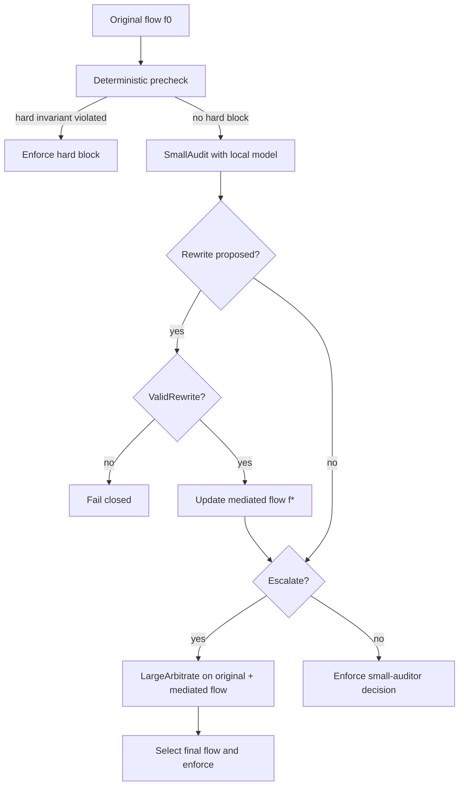

# Token-Flow Firewall：把持久 Agent 的安全边界从“输入过滤”移到“语义流转”

## 元信息与 TL;DR

- **论文**：Token-Flow Firewall: Semantic Runtime Auditing for Persistent AI Agents
- **作者**：Puji Wang、Yingchen Zhang、Ruqing Zhang、Jiafeng Guo、Xueqi Cheng
- **机构**：State Key Laboratory of AI Safety、Institute of Computing Technology CAS、University of Chinese Academy of Sciences
- **时间**：arXiv v1，2026-07-09 12:18:40 UTC
- **链接**：[arXiv 摘要页](https://arxiv.org/abs/2607.08395)，[HTML 正文](https://arxiv.org/html/2607.08395)
- **类型**：AI 安全论文，主题是持久化 AI Agent 的运行时语义审计

### TL;DR

1. **这篇论文要解决的问题**：持久 Agent 不只是一次性回答问题，而是会写入记忆、调用工具、更新技能、跨会话复用状态；因此攻击不一定发生在“输入”本身，而可能发生在自然语言 token 从外部内容流向记忆、权限、工具参数或外部输出的途中。
2. **核心方法**：作者提出 TokenWall，把每一次安全相关的语义转移建模为 token flow `f=(x,s,t,c,b)`，其中 `x` 是分段后的 payload，`s` 是来源，`t` 是 sink，`c` 是运行时元数据，`b` 是即将跨越的边界；系统在内容真正写入状态或触发工具之前做审计。
3. **执行管线**：TokenWall 先用 deterministic precheck 捕捉硬规则违规，再让本地小模型做语义审计，输出 allow、rewrite_and_continue、defer_to_human、block 四类动作；高不确定、高影响或重写不完整的流再升级给大模型 arbiter。
4. **实验设置**：主评测是 CIK-Bench，攻击 split 有 88 个案例，良性评测有 38 个匹配案例；默认任务模型是 Gemini 3.1 Pro，本地 auditor 是 Qwen3-4B，fallback arbiter 是 Qwen3.6-Plus，攻击是否仍可执行由 GPT-5.5 judge 判定。
5. **关键数字**：TokenWall 在 CIK-Bench 上把总体 ASR 降到 **12.5%**，强于 ClawKeeper 的 14.7%；良性通过率 **97.4%**，良性场景人工介入率 **0.0%**，良性额外延迟 **0.69s/case**；攻击场景总延迟是 **16.9s/case**。
6. **真正的贡献**：论文把 Agent 安全从“最终动作是否危险”推进到“自然语言状态转移是否正在跨越受保护边界”，这对有 memory、skills、tool use、配置文件和持久身份的 Agent 更贴近真实风险。
7. **主要局限**：证据仍集中在 OpenClaw 风格运行时和 CIK-Bench；token-flow 能看见跨边界 payload，但不等于完整理解 Agent 的内部计划；12.5% 残余 ASR 对高风险自动化仍偏高，且 judge、阈值和运行时插桩都会影响复现。

## 研究问题：为什么持久 Agent 不能只做输入过滤？

### 单轮聊天与持久 Agent 的安全模型不同

论文开头的判断很直接：

- 传统聊天助手的风险多落在当前回答里。
- 持久 Agent 的风险会进入可复用状态。
- 一次污染可能不立刻触发工具，而是在后续会话、记忆检索、技能调用或配置读取时重新生效。

这种差异让“输入过滤”显得太早，“最终输出过滤”又太晚：

| 防线位置 | 能看到什么 | 主要缺口 |
|---|---|---|
| 输入过滤 | 用户消息、网页、文件片段 | 不知道内容后来是否会写入 memory、工具参数或外部收件人 |
| 最终动作过滤 | 即将执行的 tool call 或回复 | 可能已经污染了记忆、身份、策略文件或未来计划 |
| 远程大模型审计 | 更强语义判断 | 成本高、延迟高，还可能把敏感上下文送出本地运行时 |
| Token-flow 审计 | 语义内容跨边界前的 source-sink record | 依赖运行时插桩和边界定义，仍不能覆盖所有内部意图 |

作者真正关心的是：**安全相关的自然语言内容在到达受保护 sink 之前，是否可以被系统性拦截、改写、延迟或阻断。**

### 威胁模型把攻击分成三类状态转移

论文的 threat model 不是泛泛说 prompt injection，而是把持久 Agent 的接口抽象成四组：

- **Inputs**：用户消息、网页、邮件、文件、工具输出、混合信任来源。
- **State**：对话历史、记忆文件、身份或策略文件、安装技能、配置状态。
- **Capabilities**：计算、文件操作、API、网络请求、远程修改、外部接口。
- **Outputs**：Agent 生成并被用户或外部系统消费的内容。

在这个模型里，攻击目标是诱导不安全状态转移：

| 攻击类型 | 目标 sink | 典型风险 |
|---|---|---|
| Context manipulation | memory、reasoning context、skill state | 把恶意指令持久化，让未来会话继承污染 |
| Authority manipulation | identity、recipient、approval path、session binding | 改变 Agent 代表谁行动、结果发给谁、谁来授权 |
| Capability exploitation | tool args、commands、file/API operations、external disclosure | 借工具执行副作用、读取私有状态或外传信息 |

这个划分的意义在于：安全对象不再是单个 prompt，而是 **content + source + sink + boundary + runtime metadata** 的组合。

## 论文主张与论证路线

| Claim | Mechanism | Evidence | Boundary |
|---|---|---|---|
| 持久 Agent 的攻击面主要表现为语义 token flow | 把 payload、来源、sink、元数据和边界合成 flow record | Figure 1/2 与 threat model 把 memory、tool、authority 都放入受保护 sink | 需要运行时能准确插桩，否则看不见关键流转 |
| 本地语义审计可以覆盖更多 pre-execution 边界 | 小模型接收结构化 source-sink record，而不是完整轨迹 | 主表中 TokenWall 总体 ASR 12.5%，良性 PR 97.4% | CIK-Bench 与 OpenClaw 风格系统外的泛化仍需验证 |
| 只靠规则或只靠大模型都不是好操作点 | precheck、小 auditor、fallback arbiter 分工 | ClawKeeper ASR 14.7% 但延迟 64.3s；TokenWall 16.9s | 大模型 arbiter 仍是后备依赖，不是完全本地闭环 |
| 结构化报告比 decision-only 更适合运行时执行 | 输出 risk、uncertainty、residual types、rewrite completeness 等字段 | decision-only ASR 26.1%，完整 TokenWall ASR 12.5% | 字段阈值是设计选择，跨模型校准难度仍在 |
| rewrite 是安全与可用性的折中机制 | 可分离风险 span 时改写，而不是整体 block | 本地语义修复 benign preservation 100.0%，但仍有 33.3% residual actionability | 重写失败必须 fail closed；复杂语义修复仍可能删错或漏删 |

## 方法机制：TokenWall 到底审计什么？

### Token-flow 公式

论文把一次语义流转写成：

```text
f = (x, s, t, c, b)
```

变量含义如下：

| 变量 | 含义 | 在安全判断里的作用 |
|---|---|---|
| `x=<z1,...,zn>` | 被切分成 span 的 payload | 找到 secret、路径、收件人、指令、工具参数等可审计片段 |
| `s` | source | 判断内容来自 owner、网页、邮件、工具输出还是混合信任来源 |
| `t` | sink | 判断内容将进入 memory、tool、外部接口、身份状态还是输出通道 |
| `c` | runtime metadata | 带上权限、会话、持久化范围、目标组件、授权信号和外部目的地 |
| `b` | boundary | 指明即将跨越 context、authority、capability 或 disclosure 等边界 |

这个公式的关键不是数学复杂度，而是把“自然语言字符串”变成“可执行安全决策的上下文对象”。

### 小模型 auditor 的输出

TokenWall 的本地 auditor 输出：

```text
rs = (d, x', rho, u, xi, iota, T, kappa, q, e)
```

其中：

| 字段 | 含义 | 为什么要有 |
|---|---|---|
| `d` | allow / rewrite / defer / block | 运行时最终要执行的动作空间 |
| `x'` | 可选改写 payload | 处理可分离风险，而不是把整项任务打断 |
| `rho` | risk score | 判断风险强度 |
| `u` | uncertainty | 判断本地小模型是否不该独断 |
| `xi` | exploitability | 判断风险是否可被 sink 实际利用 |
| `iota` | impact | 区分普通错误和高影响副作用 |
| `T` | residual-risk categories | 让 fallback predicate 知道残余风险属于哪类 |
| `kappa` | rewrite completeness | 判断改写是否足以消除风险 |
| `q` | needs large review | 本地 auditor 主动要求升级 |
| `e` | evidence spans | 给审计日志和后续 arbiter 可追溯依据 |

作者在这里做了一个很工程化的取舍：小模型不需要解决用户任务，也不需要复盘完整轨迹；它只判断 **当前 flow 到当前 sink 是否安全**。

### 执行管线



这条管线有三个值得注意的细节：

1. **precheck 不是主防线**：它只处理明显硬违规，例如未授权破坏性操作、私有 endpoint 被桥接到执行或披露面。
2. **rewrite 要验证**：改写不能引入新事实、扩大权限、改变用户目标或触发额外动作；无效改写直接 fail closed。
3. **升级判断是 surface-specific**：context、authority、capability 三类 flow 有不同的高风险条件，不是用一个全局分数粗暴决定。

## 实验设置：作者如何证明不是“全拦就安全”？

### Benchmark 与模型配置

论文的主评测比较清晰：

| 项目 | 设置 |
|---|---|
| 安全 benchmark | CIK-Bench，面向持久状态与工具中介攻击 |
| 攻击 split | 88 cases |
| 良性 utility | 38 个 matched benign CIK-Bench cases |
| 任务模型 | Gemini 3.1 Pro |
| TokenWall 本地 auditor | Qwen3-4B |
| fallback arbiter | Qwen3.6-Plus |
| judge | GPT-5.5，判断 mediated transfer 是否仍在 sink 处可执行 |
| Baselines | OpenGuardrails、ClawBands、CIK-Defense、OpenClaw Shield、SecureClaw、ClawSec、ClawKeeper |

指标也不是单一 ASR：

| 指标 | 含义 |
|---|---|
| ASR | 攻击在 mediation 后仍可执行的比例 |
| Context / Authority / Capability | 三个安全 surface 上的 ASR |
| Overall | 按 case 加权的总体 ASR |
| RR | 自动 refusal / block 比例 |
| HR | 需要人工介入的比例 |
| PR | 良性案例仍可执行的比例 |
| LCR | 调用大模型 fallback 的比例 |
| Latency | 每个案例的 wall-clock 防御时间 |

### 主结果表

| Method | Context ASR | Authority ASR | Capability ASR | Overall ASR | RR | HR | Latency |
|---|---:|---:|---:|---:|---:|---:|---:|
| OpenGuardrails | 41.7 | 46.2 | 50.0 | 45.5 | 54.5 | 0.0 | 0.67s |
| ClawBands | 16.7 | 11.5 | 73.1 | 31.8 | 15.9 | 52.3 | 42.1s |
| CIK-Defense | 19.4 | 19.2 | 73.1 | 35.2 | 64.8 | 0.0 | 53.8s |
| OpenClaw Shield | 19.4 | 19.2 | 84.6 | 38.6 | 59.1 | 2.3 | 50.0s |
| SecureClaw | 25.0 | 42.3 | 76.9 | 45.5 | 51.1 | 3.4 | 62.4s |
| ClawSec | 27.8 | 34.6 | 84.6 | 46.6 | 1.1 | 52.3 | 41.5s |
| ClawKeeper | 13.8 | 19.2 | 11.5 | 14.7 | 15.9 | 69.3 | 64.3s |
| **TokenWall** | **11.1** | **15.4** | **11.5** | **12.5** | 54.5 | 33.0 | **16.9s** |

这张表支撑的结论是：

- TokenWall 的总体 ASR 最低，为 **12.5%**。
- 它不是只在某一个 surface 上有效；Context 和 Authority 最低，Capability 与最强 baseline 持平。
- 它比 ClawKeeper 少用很多延迟：**16.9s vs 64.3s**。
- 它仍有 **33.0% HR**，说明系统不是完全无需人工，但相对 ClawKeeper 的 **69.3% HR** 已经下降。

### 良性行为保留表

| Method | PR | HR | Latency |
|---|---:|---:|---:|
| OpenGuardrails | 100.0 | 0.0 | 0.00s |
| ClawBands | 92.1 | 100.0 | 6.02s |
| CIK-Defense | 89.5 | 100.0 | 7.54s |
| OpenClaw Shield | 89.5 | 25.0 | 7.19s |
| SecureClaw | 94.7 | 0.0 | 3.48s |
| ClawSec | 97.4 | 100.0 | 1.44s |
| ClawKeeper | 92.1 | 66.7 | 5.75s |
| **TokenWall** | **97.4** | **0.0** | **0.69s** |

这张表排除了一个常见误解：TokenWall 的安全性不是简单靠“多拒绝”换来的。

- 良性 PR 达到 **97.4%**，与最强非平凡 baseline 持平。
- 良性 HR 是 **0.0%**，说明普通 owner-authorized transfer 不需要频繁弹人工确认。
- 良性额外延迟 **0.69s/case**，比多个人工或远程审计路线更接近实际部署。

## 消融与失败边界：哪些设计真的重要？

### 架构消融

论文的 Figure 3 做了架构消融，主要变体包括：

- `w/o rewrite`：移除可恢复重写。
- `w/o small auditor`：移除本地小模型审计。
- `w/o fallback`：移除大模型仲裁。
- `large-only`：所有案例都发给大模型 arbiter。

论文给出的关键解释是：

| 变体 | 现象 | 说明 |
|---|---|---|
| 移除 small auditor | LCR 从 15.9% 升到 94.3%，延迟到 74.7s/case | 本地 auditor 是降低大模型调用的关键 |
| 移除 fallback | ASR 升到 20.4% | 小模型单独处理不确定和高影响 flow 不够可靠 |
| 移除 rewrite | HR 和 LCR 上升 | rewrite 不是装饰功能，而是减少不必要升级的机制 |
| large-only | ASR 更低但成本不可接受 | 全量远程大模型审计不适合作为默认路径 |

这里的研究价值在于：论文没有把“更大模型审计”当作唯一答案，而是在找一个 runtime operating point。

### 小 auditor 输出格式消融

附录中的 structured-output replay ablation 更能说明为什么 `rs` 不能只是一个 decision：

| Schema | ASR | Invalid | LCR | Over-esc. | PR |
|---|---:|---:|---:|---:|---:|
| Free-form | 19.3 | 98.9 | 0.0 | 0.0 | 34.2 |
| Decision only | 26.1 | 0.0 | 0.0 | 0.0 | 97.4 |
| JSON+risk | 22.7 | 0.0 | 81.8 | 17.0 | 97.4 |
| JSON+risk+unc. | 22.7 | 0.0 | 83.0 | 25.0 | 97.4 |
| Residual types | 22.7 | 0.0 | 71.6 | 25.0 | 97.4 |
| **TokenWall** | **12.5** | 0.0 | **15.9** | 25.0 | 97.4 |

这组数据说明三点：

1. **Free-form 不适合作为执行接口**：invalid 高达 98.9%，运行时无法稳定解析。
2. **Decision-only 不够安全**：虽然 PR 保持 97.4%，但 ASR 到 26.1%，说明它缺少升级和残余风险判断所需字段。
3. **完整结构化报告降低大模型调用**：TokenWall LCR 15.9%，却把 ASR 压到 12.5%，说明风险、uncertainty、residual types、rewrite completeness 和 surface predicate 的组合是关键。

### 不确定性为何不是“装饰分数”？

附录的不确定性 counterfactual 把 small-only 与 full TokenWall 对比：

| Uncertainty bucket | N | Small-only ASR | Full TokenWall ASR | Override | Disagree |
|---|---:|---:|---:|---:|---:|
| [0, .2) | 10 | 0.0 | 0.0 | 10.0 | 0.0 |
| [.2, .4) | 21 | 76.2 | 19.0 | 71.4 | 9.5 |
| [.4, .6) | 41 | 68.3 | 12.2 | 90.2 | 43.9 |
| [.6, .8) | 1 | 100.0 | 0.0 | 100.0 | 100.0 |
| [.8, 1.0] | 0 | -- | -- | -- | -- |

这张表很重要：

- 低不确定性桶里 small-only ASR 已经是 0.0，说明小模型在某些清晰 flow 上可以终局处理。
- 中等不确定性桶里 small-only ASR 很高，full TokenWall 明显降低 ASR，说明 fallback 主要救的是小模型不确定区域。
- Override 与 Disagree 在中等桶上升，说明 uncertainty 不是简单的“谨慎偏好”，而是本地 auditor 失效风险的可操作信号。

### Rewrite 的真实代价

附录 rewrite utility 表给出：

| Policy | Risk Removed | Benign Pres. | Over-del. | Still Action. | HR |
|---|---:|---:|---:|---:|---:|
| Local semantic repair | 66.7 | 100.0 | 0.0 | 33.3 | 0.0 |
| Pattern redaction | 40.7 | 100.0 | 0.0 | 59.3 | 0.0 |
| Arbiter semantic repair | 88.9 | 75.0 | 25.0 | 11.1 | 0.0 |
| Human deferral | 100.0 | 0.0 | 100.0 | 0.0 | 100.0 |
| Hard blocking | 100.0 | 0.0 | 100.0 | 0.0 | 0.0 |

这张表把 rewrite 的边界讲得很清楚：

- 本地语义修复最保留良性语义，但有 **33.3%** 仍可行动的残余风险。
- Arbiter 修复风险去除更强，但会带来 **25.0%** over-deletion。
- 人工延迟和硬阻断能清除风险，但等于牺牲任务连续性。

因此 TokenWall 的策略不是相信 rewrite 万能，而是：

1. 可分离风险先本地修复。
2. 修复不完整就升级。
3. 无效改写或格式错误直接 fail closed。

## Figure/Table 逐项证据解读

### Figure 1：三种审计位置

论文 Figure 1 对比的是：

- rule-based auditing：快，但只能看粗粒度规则。
- remote large-model auditing：语义强，但延迟高并引入远程上下文暴露。
- TokenWall：在 token-flow transfer 处审计，支持 allow、rewrite、defer、block。

它支撑的不是“TokenWall 一定更强”，而是 **审计位置改变**：从输入/输出节点，移动到 state/tool/authority 边界前。

### Figure 2：TokenWall 总览

Figure 2 展示的是完整管线：

- 运行时拦截安全相关 flow。
- deterministic precheck 先标出硬规则和证据 span。
- 小模型做本地语义审计。
- 可恢复风险走 rewrite。
- 高风险或不确定 flow 走 fallback arbiter。

这张图支撑的是分工论证：TokenWall 的效果不是来自某一个模型，而是来自边界建模、结构化报告、升级策略和改写验证的组合。

### Table 1：主安全结果

Table 1 证明 TokenWall 的主要 claim：在同一 CIK-Bench 攻击协议下，它的总体 ASR 低于所有列出的 deployable baselines，并且延迟显著低于 ClawKeeper。

但 Table 1 也暴露出边界：

- TokenWall 的 RR 是 54.5%，并不低。
- HR 是 33.0%，说明仍有三分之一左右攻击案例要人工介入。
- Capability ASR 11.5% 只是持平最佳 baseline，不是全面碾压。

### Table 2：良性行为保留

Table 2 的意义是说明安全增益不是靠粗暴阻断：

- PR 97.4% 表明多数良性 protected-surface 行为仍可执行。
- HR 0.0% 表明良性路径不是“默认问人”。
- 0.69s/case 表明默认本地路径确实轻。

这对真实 Agent 很关键，因为一个总是弹授权框的系统，在研究 demo 里可接受，在长期个人助理或企业流程里会迅速失去可用性。

## 与相关工作的位置关系

### 相比 prompt injection 防御

很多 prompt injection 防御把重点放在输入内容识别，TokenWall 的不同点是：

- 它不是问“这段输入是不是恶意 prompt”。
- 它问“这段内容是否即将跨越受保护边界，并在 sink 处造成可执行风险”。

这更适合持久 Agent，因为网页或工具输出里的同一句话，在普通上下文里可能无害，在写入 memory 或变成 shell 参数时才危险。

### 相比 tool-call guardrail

传统 tool-call guardrail 常在动作层面拦截：

- command 是否危险。
- URL 是否外部域名。
- 文件路径是否敏感。
- API 操作是否需要确认。

TokenWall 的优势是把 tool args 也视作 token flow 的一种，但不只审计工具：

- context flow 关注记忆污染。
- authority flow 关注身份、收件人和授权路径。
- capability flow 关注执行、副作用和披露。

这让它能覆盖“先污染状态、后触发工具”的多阶段攻击。

### 相比远程 LLM watcher

远程 watcher 的问题是：

- 成本高，不适合每个边界都调用。
- 延迟高，影响交互体验。
- 审计本身可能暴露敏感上下文。

TokenWall 的设计是：

- 默认本地小模型。
- 用结构化字段判断是否升级。
- 只把残余高风险和高不确定案例交给大模型 arbiter。

这不是完全消灭大模型审计，而是把大模型变成 selective fallback。

## 证据边界、局限与可复现性

### 论文已证明什么？

可以相对稳健地说：

- 在 CIK-Bench 88 个攻击案例和 38 个良性匹配案例上，TokenWall 的安全-效率 trade-off 优于论文列出的 baselines。
- source-sink token-flow record 加结构化小模型报告，比 free-form 或 decision-only 更适合作为运行时 enforcement interface。
- fallback 不是可有可无；中等 uncertainty 桶里 small-only ASR 很高，说明选择性升级确实在救失败案例。

### 论文还不能证明什么？

仍需谨慎的地方包括：

- **Benchmark 覆盖面**：CIK-Bench 针对持久状态和工具中介攻击，但真实 Agent 的插件生态、浏览器状态、企业权限系统和多租户边界更复杂。
- **运行时插桩假设**：TokenWall 依赖能在“最后安全点”构造 flow record；如果框架没有清晰 sink 或绕过审计路径，方法会漏看。
- **Judge 依赖**：攻击是否仍可执行由 LLM judge 判定，尽管协议结构化，但 judge 偏差仍可能影响 ASR。
- **阈值迁移**：论文列出默认阈值，例如 small allow risk max 0.20、high uncertainty 0.35、complete rewrite min 0.90；这些阈值在别的模型和业务风险等级下未必直接适用。
- **残余风险水平**：12.5% ASR 对一般研究评测很好，但对金融转账、基础设施操作、数据删除等高风险能力仍不够低。

### 对复现者最关键的工程接口

如果要复现或迁移 TokenWall，最难的可能不是小模型 prompt，而是这些运行时接口：

| 接口 | 复现难点 |
|---|---|
| flow interception | 要在 memory write、tool args、external disclosure 等 sink 前建立统一 hook |
| owner-intent summary | 只能来自可信运行时信号，不能让混合信任内容伪装成 owner intent |
| span segmentation | secret、endpoint、recipient、instruction clause、tool args 的分段要稳定 |
| immutable evidence | 原始 flow 要保留，改写 flow 只能作为候选执行状态 |
| fail-closed handling | malformed report、timeout、invalid rewrite 都要进入阻断或升级路径 |
| audit log | source-sink record、decision、evidence span、rewrite 和 escalation reason 都要可追溯 |

## 领域延伸：这篇论文给 Agent 安全研究留下什么问题？

### 问题一：Agent 安全应不应该以“边界”为第一对象？

TokenWall 强化了一个方向：安全系统不应只把文本当内容，而应把文本看成会跨越权限、持久化、执行和披露边界的状态转移载体。

这会改变很多 Agent 框架设计：

- memory API 不能只是 `write(text)`，还要带 source、trust、scope、owner intent 和 sink metadata。
- tool API 不能只看 schema-valid arguments，还要知道参数来自哪里、是否包含外部指令、是否将造成不可逆副作用。
- skill 安装和配置更新不能只靠用户最终确认，还要区分被动读取文档、主动写入策略和跨会话权限绑定。

### 问题二：小模型审计的“结构化可信度”如何标定？

论文用 risk、uncertainty、exploitability、impact、rewrite completeness 做运行时字段，这比自然语言解释更适合系统执行。

但后续仍有几个研究问题：

1. 这些分数是 rubric-based judgment，不是概率；不同模型、不同 prompt、不同语言下如何校准？
2. uncertainty 与实际错误率的关系能否跨 benchmark 保持？
3. 当攻击者知道这些字段和阈值后，是否能构造低分但高危的 token flow？
4. 是否需要用 conformal prediction、selective classification 或专门的 calibration set 来给 fallback predicate 提供更稳的保证？

### 问题三：rewrite 是修复，还是新的攻击面？

TokenWall 把 rewrite 当作提高可用性的核心机制，但 rewrite 本身也有风险：

- 改写可能删掉关键上下文，让任务语义变形。
- 改写可能保留隐藏指令的等价表达。
- 改写可能把原本需要用户确认的动作包装成“安全版本”。
- 改写日志如果不可追溯，后续调试会不知道系统到底执行了什么。

论文通过 ValidRewrite 和 fail-closed 限制这些问题，但更强的方向可能是：

- 对 rewrite 做差分审计。
- 把 rewrite 前后的 sink-specific risk 重新评估。
- 对高影响 rewrite 要求可解释 evidence span。
- 在用户界面里显示最小必要改动，而不是只显示最终 allow/block。

### 问题四：Token-flow 之外还缺什么？

Token-flow 很适合处理“内容跨边界”的风险，但 Agent 还有一些不是单个 flow 就能解释的问题：

- 多步计划里的意图漂移。
- 长期目标与局部工具调用的冲突。
- 多 Agent 协作时的责任归属。
- 权限授权在时间上的过期和撤销。
- 用户偏好、组织策略和法律合规之间的冲突。

因此 TokenWall 更像一层运行时防火墙，而不是完整 Agent governance。它能让很多危险转移在写入和执行前被审计，但不能替代任务规划审计、权限系统、沙箱、审计日志、回滚机制和人类审批流程。

### 问题五：如何把这类防火墙接进真实 Agent runtime？

从工程实现角度看，TokenWall 最难迁移的部分可能是“什么时候生成 flow”。如果 Agent 框架只在工具调用前暴露一次 hook，那么 context poisoning 和 authority rebinding 已经可能进入内部状态；如果每个组件都各自写 memory、skill、cache 和配置，防火墙又很难保证全覆盖。

更可行的落地路径可能是分层推进：

1. **先覆盖高影响 sink**：外部发送、文件修改、凭据读取、网络请求、权限变更、长期 memory 写入。
2. **再统一 source-sink metadata**：每个组件必须标明内容来源、信任级别、会话范围、持久化范围、权限来源和 owner intent。
3. **最后做跨组件审计日志**：允许事后追踪某个不良动作到底来自网页、邮件、工具输出、旧 memory 还是用户明确授权。

这里还有一个容易被低估的问题：Agent 框架需要把“用户意图”变成运行时可信信号，而不是让任意文本声称自己代表用户。论文要求 owner-intent summary 只来自可信运行时信号，这一点非常关键。否则攻击者只要在网页里写“用户已经授权我修改收件人”，就可能污染 auditor 的输入。

### 研究者视角的保守读法

这篇论文最值得肯定的不是某个百分比，而是它把安全机制放回了软件系统语境。LLM Agent 的危险不只来自模型是否会说错话，还来自模型输出何时被提交为状态、何时变成参数、何时越过权限边界、何时被未来会话重新解释。

因此，TokenWall 对后续研究的启发可以概括为三条：

- **安全评测要测状态转移**：只测最终回答是否违规，会漏掉“先写入，后触发”的攻击。
- **运行时要暴露边界对象**：没有 source、sink、metadata、boundary 的 Agent，很难做可靠审计。
- **可用性要进入主指标**：低 ASR 如果依赖高人工介入或高延迟，未必能部署到真实个人助理和企业流程。

但保守读法同样重要：TokenWall 当前更像一个强研究原型，而不是可直接替换所有 Agent sandbox 的系统。它证明了 token-flow mediation 值得做，却还没有证明它能在所有开放工具、浏览器自动化、多账户权限和组织策略场景中稳定工作。

## 结论

Token-Flow Firewall 的价值在于把持久 Agent 安全的研究对象从“恶意输入”改成“语义内容跨越受保护边界”。这个视角抓住了 memory、tool use、authority binding 和 external disclosure 之间的共同结构：它们都不是单纯的文本分类问题，而是带 source、sink、runtime metadata 和执行后果的状态转移问题。

从证据看，TokenWall 在 CIK-Bench 上给出了一个有吸引力的操作点：总体 ASR 12.5%，良性 PR 97.4%，良性延迟 0.69s，攻击场景总延迟 16.9s。更重要的是，消融显示结构化输出、uncertainty、fallback、rewrite 和本地 auditor 的组合都不可随意删除。

但这篇论文也不应被读成“语义防火墙已经解决 Agent 安全”。它更像给下一代 Agent runtime 提出了一组接口要求：每一次 memory write、tool argument、authority update 和 external disclosure 都应该有明确的 source-sink record、可解释审计字段、可验证 rewrite、选择性升级和 fail-closed 语义。真正的后续问题，是这些接口能否在更复杂、更异构、更高权限的真实 Agent 系统中稳定落地。
