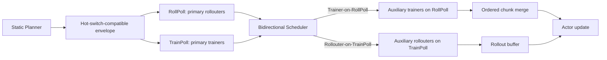

# BiDiRL：把 RL 后训练里的空闲 GPU 窗口变成双向可借的计算资源

| 项目 | 信息 |
| --- | --- |
| 论文 | Bidirectional Resource Scheduling for Disaggregated and Asynchronous RL Post-Training |
| 作者 | Zhiqiang Tan, Maoxin Wang, Sijie Wang, Yiming Yin, Qiang Wang, Xiaowen Chu, Shaohuai Shi |
| 链接 | https://arxiv.org/abs/2607.09207 |
| 发布时间 | 2026-07-10 |
| 方向 | 大模型后训练 / RL post-training / 分离式训练系统 |
| 类型 | 论文深读 |

外部参考搜索：本轮检索了 `Bidirectional Resource Scheduling for Disaggregated and Asynchronous RL Post-Training`、`BiDiRL RL Post-Training`、`2607.09207 BiDiRL`。除 arXiv 摘要页、HTML 正文、PDF 和 TeX source 外，未找到有实质细读价值的第三方解读；因此正文以原文证据为主，不额外编造相关评论。

## TL;DR

- **这篇论文研究什么**：BiDiRL 关注大模型 RL 后训练中的系统吞吐问题。现有 veRL、AReaL、ROLL 这类系统已经把 rollout 和 training 分离、异步重叠，但在 staleness 约束、响应长度变化、模型并行粒度和资源切分不均衡下，rollout 池或 trainer 池仍会出现空闲窗口。
- **作者怎么做**：论文把空闲分成两个层次：静态资源切分造成的 **structural bubbles**，以及运行期负载变化和 staleness 造成的 **residual bubbles**。BiDiRL 先用静态 planner 选择可热切换、吞吐友好的 RollPoll/TrainPoll 资源 envelope，再用运行期 bidirectional scheduler 让空闲池临时借给瓶颈阶段。
- **核心机制**：系统支持两个方向的借用：`Rollouter-on-TrainPoll` 用空闲训练池补 rollout 缺口，`Trainer-on-RollPoll` 用空闲 rollout 池处理 trainer chunk。每次借用都要通过模型预测收益大于 `C_in + C_out + C_grad` 的门控，避免为了短窗口付出更高切换成本。
- **实验怎么做**：作者在两个 32-GPU testbed 上评测：A6000 集群和 H100 集群。模型覆盖 Qwen3VL-2B、Qwen3VL-4B、Qwen3-8B；数据覆盖 Geo3K 和 GSM8K；response length 从 1K 到 4K，staleness 从 0 到 4，资源预算从 8 到 32 GPU。
- **关键数字**：端到端对比中，BiDiRL 相比 veRL、AReaL、ROLL 提升 `1.05x-1.94x`。A6000 默认、staleness、资源、模型/数据 sweep 中为 `1.27x-1.68x`，32 GPU scale-up 达到 `1.94x`；H100 上默认设置为 `1.23x-1.47x`，scale-up 为 `1.05x-1.53x`。
- **消融证据**：禁用借用、只保留单方向借用、或 opportunistic 看到空闲就借，都会落后。BiDiRL 相比 no-borrow 提升 `1.12x-1.71x`，相比 opportunistic borrowing 提升 `1.02x-1.31x`，说明收益不是来自“借用”这个动作本身，而是来自带成本门控的双向调度。
- **收敛边界**：BiDiRL 改变的是计算放置和执行时序，不改变 GRPO 看到的 logical rollout groups 与 training samples。前 60 step reward 对比中，staleness 1 的最后共同记录点差距 `+0.017`，staleness 2 为 `+0.000`，平均差距分别为 `+0.020` 和 `+0.001`。
- **局限**：论文证明的是系统吞吐优化，不是新的 RL objective。评测基于 Qwen3 系列、Geo3K/GSM8K、两个 32-GPU 环境和 veRL/AReaL/ROLL；更大模型、跨机网络更弱的集群、不同 reward pipeline、长期收敛和 failure mode 仍需要单独验证。

## 研究问题：为什么异步分离还会浪费 GPU？

### RL 后训练的两个主阶段

在大模型 RL 后训练里，一个迭代通常包含两类重型工作：

- **Rollout 阶段**：
  - actor model 对一批 prompt 自回归生成响应。
  - 推理引擎通常是 vLLM 或 SGLang。
  - 在 GRPO 风格任务中，同一个 prompt 会生成一组 responses，构成 prompt-level rollout group。

- **Training 阶段**：
  - trainer 消费生成样本，计算 reward、policy loss、reference logprob、actor update。
  - 训练引擎通常是 PyTorch FSDP 或 Megatron-LM。
  - 为控制显存，训练 batch 会被拆成 micro-batch，BiDiRL 把这种可调度单元称为 **chunk**。

一个极简 step 近似可以写成：

```text
T_step ~= T_wait + T_consume

T_wait: 等待 rollout buffer 里有足够 valid rollout groups 的时间
T_consume: trainer 消费 batch 并完成训练更新的时间
```

这个公式的意义不是精确计时，而是暴露瓶颈：

- 如果 rollout 太慢，`T_wait` 变大，trainer 等样本。
- 如果 trainer 太慢，rollouter 可能跑到 staleness 上限后停住。
- 如果 staleness 严格，样本新鲜度约束会同时限制两边的超前程度。

### staleness 不是“越异步越好”的许可

论文采用 staleness policy `s` 来描述异步样本可接受程度：

| staleness 区间 | 含义 | 对系统调度的影响 |
| --- | --- | --- |
| `s = 0` | 严格 on-policy，所有样本必须来自最新 actor | rollout 很难跑得太前，trainer 容易等新样本 |
| `0 < s < 1` | 允许一定比例 stale samples，但 batch 仍需足够 fresh samples | 两边可部分重叠，但仍存在新鲜样本缺口 |
| `s >= 1` | batch 可以由近期有效样本组成 | overlap 增强，但资源切分和响应长度变化仍会制造空闲 |

这解释了论文为什么不满足于“分离式 + 异步”：

- AReaL、StreamRL、ROLL 等系统已经能让 rollout 和 training 重叠。
- 但重叠只是减少串行等待，不等于资源池始终满载。
- 固定资源池下，一边快、一边慢、或 staleness 卡住时，空闲窗口仍然出现。

## 论文主张与论证路线

| Claim | Mechanism | Evidence | Boundary |
| --- | --- | --- | --- |
| 分离式 RL 后训练的浪费来自两类 bubble | structural bubble 来自静态切分失衡；residual bubble 来自响应长度、staleness、模型并行粒度和运行期变化 | Figure 1/2 展示 rollout/trainer scaling 差异、response length dynamics 和三类 idle timeline | bubble 分析是系统层解释，不直接改变 RL objective |
| 静态 planner 只能解决粗粒度切分，不能处理运行期变化 | planner 枚举可热切换资源 envelope，最大化 `min(lambda_r, lambda_t)` | 2B/4B partition sweep 中吞吐差异达 `1.40x` 和 `2.09x`，planner 能选中显示 sweep 的最佳分区 | planner 目标是排序和避免坏切分，不保证绝对时间预测精确 |
| 双向借用比单向优化更稳 | rollout heavy 时借训练池给 rollout；trainer heavy 时借 rollout 池给 trainer | 消融中 BiDiRL 比 `w/o T-on-R` 快 `1.02x-1.68x`，比 `w/o R-on-T` 快 `1.00x-1.24x` | 单方向在特定状态可能接近最优，但 workload/staleness 改变后会失效 |
| 看到空闲就借不够，必须带成本门控 | 用 stage-time model 和 online profiler 判断收益是否覆盖 hot-switch overhead | BiDiRL 比 opportunistic borrowing 快 `1.02x-1.31x`，hot-switch 表中 4B 切换成本明显高于 2B | 短窗口、网络弱、模型更大时，门控阈值更关键 |
| 调度不应改变 RL 逻辑数据流 | 热切换只改变计算放置，chunk/order/rollout group 仍按原逻辑合并 | 前 60 step reward gap 很小：staleness 1 最后共同点 `+0.017`，staleness 2 `+0.000` | 只覆盖短期收敛行为，不等于长期训练完全等价 |

## 方法机制：BiDiRL 的系统边界

### 两个资源池

BiDiRL 把 GPU cluster 切成两个 committed pools：

- `RollPoll`：
  - 默认运行 primary rollouters。
  - 负责生成 prompt-level rollout groups。
  - 空闲时可以临时运行 auxiliary trainers。

- `TrainPoll`：
  - 默认运行 primary trainers。
  - 负责 trainer chunks、loss、gradient 和 actor update。
  - 空闲时可以临时运行 auxiliary rollouters。

系统不是把两类工作混在同一池里随意抢占，而是保持默认 ownership，并在 scheduler 批准后发放临时 lease。



### hot-switch runtime 为什么是关键？

如果没有热切换，双向借用会被三类成本吃掉：

- 进场成本：加载辅助角色需要的模型状态和执行上下文。
- 退场成本：辅助角色释放资源，恢复 primary role。
- 同步成本：trainer 参与 actor update 时，auxiliary gradients 需要合并。

论文把这些成本显式记为：

```text
C_in: 切入辅助角色的成本
C_out: 切回 primary role 的成本
C_grad: auxiliary trainer 参与 actor update 时的梯度同步成本
```

热切换 runtime 的基本规则是：

- primary workers 默认拥有资源池。
- scheduler 批准借用后，runtime 唤醒 passive auxiliary workers。
- lease 结束或 primary 需要恢复时，auxiliary 停止接新任务。
- 未开始的 trainer chunks 可以回收，正在跑的 chunk 跑完后按原顺序 merge。
- 未完成 rollout group 返回 prefix 和 completion 状态，由 primary rollouter 继续生成。

这套规则的重点是：**物理执行可切换，逻辑数据流不能乱。**

## 静态 planner：先减少 structural bubbles

### 资源 envelope 的定义

论文把静态 planner 的输出写成：

```text
E = (g_r, g_t, rho_r, rho_t, M_r, M_t)

g_r: 分给 RollPoll 的 GPU 数
g_t: 分给 TrainPoll 的 GPU 数
rho_r: rollout replica layout
rho_t: trainer replica layout
M_r: rollout stage-time model
M_t: trainer stage-time model
```

这个 envelope 必须同时满足两个条件：

- **throughput-aware**：平均上 rollout 生产和 trainer 消费不要严重失衡。
- **hot-switch compatible**：每个可能承载辅助角色的 pool 都必须能被对应 replica layout 整除，避免借用时重启或重新切 shard。

### 为什么不是只最大化 rollout 或 trainer？

planner 对候选切分 `(g_r, g_t)` 计算两个速率：

```text
lambda_r = B_p / M_r(B_p, d_r)
lambda_t = B_p / M_t(U_B, d_t)
lambda_pipe = min(lambda_r, lambda_t)
```

变量解释：

| 变量 | 含义 |
| --- | --- |
| `B_p` | 代表性 batch 中的 prompt-level rollout group 数 |
| `U_B` | 对应的 stage-ordered trainer workload |
| `d_r` | rollout replicas 数 |
| `d_t` | trainer replicas 数 |
| `M_r(B_p, d_r)` | rollout 生产 `B_p` 个 group 的预测时间 |
| `M_t(U_B, d_t)` | trainer 消费 workload 的预测时间 |
| `lambda_pipe` | pipeline 稳态速率，由慢的一边决定 |

这里的关键是 `min`：

- 如果只最大化 rollout 速率，trainer 可能成为瓶颈。
- 如果只最大化 trainer 速率，rollout 可能供不上样本。
- `min(lambda_r, lambda_t)` 强迫 planner 选择两边更均衡的切分。

### planner 伪代码

```text
Input:
  G: GPU budget
  Pi: placement constraints
  W: workload statistics, including B_p and U_B
  P: model configuration

State:
  rho_r, rho_t = minimal feasible rollout/trainer layouts
  M_r, M_t = stage-time models
  best = none

Loop:
  for (g_r, g_t) in CandidatePartitions(G, Pi):
    if not Compatible(g_r, g_t, rho_r, rho_t):
      continue

    d_r = ReplicaCount(g_r, rho_r)
    d_t = ReplicaCount(g_t, rho_t)

    T_r = M_r(B_p, d_r)
    T_t = M_t(U_B, d_t)

    lambda_r = B_p / T_r
    lambda_t = B_p / T_t
    lambda_pipe = min(lambda_r, lambda_t)

    if best is none or lambda_pipe > best.lambda_pipe:
      best = (g_r, g_t, rho_r, rho_t, M_r, M_t)

Output:
  best resource envelope
```

复杂度也很朴素：

- planner 枚举候选 partition。
- 对每个候选做兼容性检查和两次 stage model 评估。
- 常见二分设备切分下，候选规模是 `O(G)`。
- 这是训练前一次性成本，可以摊销到整个 RL job。

## 动态 scheduler：再回收 residual bubbles

### online profiler 记录什么？

BiDiRL 的 scheduler 不能只看“当前有空闲”。

它需要知道：

- 当前空闲窗口够不够长。
- 切换成本是多少。
- primary 和 auxiliary 合作后能缩短多少时间。
- rollout 和 trainer 的实际速度是否偏离静态模型。

论文让每个完成执行单元上报：

```text
(k, x, pi, X, d, T_hat)

k: stage, rollout r 或 trainer t
x: role, primary p 或 auxiliary a
pi: executing pool
X: workload summary
d: active replica count
T_hat: observed time
```

profiler 同时上报：

```text
(I_r, I_t, Q_r, U, C_in, C_out, C_grad)

I_r: RollPoll idle window
I_t: TrainPoll idle window
Q_r: rollout group deficit
U: remaining trainer workload
C_*: measured switching/synchronization costs
```

### 方向一：Rollouter-on-TrainPoll

当 trainer pool 空闲，而 trainer 又缺新样本时，BiDiRL 可以让 TrainPoll 临时跑 auxiliary rollouters。

门控公式是：

```text
M_r(Q_r, d_p) - M_r(Q_r, d_p + d_a) > C_in + C_out
```

变量解释：

| 变量 | 含义 |
| --- | --- |
| `Q_r` | 当前缺少的 prompt-level rollout groups |
| `d_p` | primary rollouter replica 数 |
| `d_a` | auxiliary rollouter replica 数 |
| `M_r(Q_r, d_p)` | 不借资源时补齐缺口的预测时间 |
| `M_r(Q_r, d_p + d_a)` | 借用后补齐缺口的预测时间 |

如果省下的时间不能覆盖切入和切出成本，就不借。

通过门控后，辅助 rollouters 分到：

```text
Q_a = round(d_a / (d_p + d_a) * Q_r)
Q_p = Q_r - Q_a
```

这里没有做细粒度 response length 预测，因为每个响应的真实长度只有生成后才知道。作者选择按 data-parallel capacity 分配 prompt groups，避免把 scheduler 建在不可观测的未来 token length 上。

### 方向二：Trainer-on-RollPoll

当 rollout pool 空闲，而 trainer 仍有 chunk workload 时，BiDiRL 可以让 RollPoll 临时跑 auxiliary trainers。

这个方向更复杂，因为 trainer 需要保持 chunk 顺序和 gradient merge。

核心流程是：

```text
Input:
  U: remaining stage-ordered trainer workload
  d_p, d_a: primary / auxiliary replica counts
  s_max: max chunk size
  C_in, C_out, C_grad: switching and synchronization costs

Step 1:
  U' = DrainPrefix(U, C_in, M_t, d_p)
  # 切入 auxiliary trainer 期间，primary trainer 本来就能完成一段 prefix

Step 2:
  T_no = M_t(U, d_p)
  T_joint = M_t(U', d_p + d_a)
  T_borrow = C_in + T_joint + C_out + C_grad

Step 3:
  if T_borrow >= T_no:
    return primary-only execution

Step 4:
  Build chunk queue over U'
  while queue not empty:
    if tail window:
      JointTailSplit(queue, s_max, M_t, d_p, d_a)
      RunTail()
      break
    for each ready side in {primary, auxiliary}:
      c = LazyPull(queue, side, s_max)
      RunAsync(side, c)

Output:
  ordered chunk merge and optional auxiliary gradient merge
```

这个算法解决两个问题：

- **启动期不要重复计费**：`DrainPrefix` 把 auxiliary 准备期间 primary 会自然完成的前缀排除掉。
- **尾部不要失衡**：lazy pull 先用大 chunk 保持效率，尾部再用 `JointTailSplit` 调整 primary/auxiliary 完成时间。

## 实现细节：为什么 chunk 状态要显式建模？

### 四类 trainer chunk 状态

论文 Table 2 把 trainer chunk 状态分成四类：

| 状态 | 含义 | 是否可恢复 |
| --- | --- | --- |
| `queued` | 输入传输或 worker buffer 已开始，但 accelerator execution 未开始 | 是 |
| `running` | worker 正在 accelerator 上执行 chunk | 否 |
| `finished` | 输出已取回，并按原顺序 merge | 否 |
| `cancelled` | queued chunk 在执行前被释放 | terminal |

这个表看起来像实现细节，但它是 BiDiRL 能保持语义不乱的关键。

如果 lease 被撤销：

- `queued` chunk 可以回到 pending queue。
- `running` chunk 继续跑完，避免浪费 accelerator work。
- `finished` chunk 按原顺序合并。
- `cancelled` chunk 不再参与后续执行。

### 与 veRL 的关系

作者实现了一个基于 veRL 的 prototype：

- 约 `8.3K` 行 Python。
- rollout 使用 vLLM。
- training 使用 PyTorch FSDP。
- orchestration 使用 Ray。
- 新增模块包括 static planning、bidirectional scheduling、workload partitioning、worker lifecycle、hot switching、cross-pool synchronization、asynchronous chunk execution、online profiling。

这说明 BiDiRL 不是一个抽象调度数学模型，而是嵌进真实 LLM RL stack 的系统改造。

### 跨池同步的三条路径

论文保留 veRL 原有 primary trainer 到 primary rollouter 的 actor weight synchronization，并增加三类借用同步：

- `Trainer-on-RollPoll`：
  - primary trainer 把所需 actor weights 广播给 RollPoll 上的 auxiliary trainers。

- `Rollouter-on-TrainPoll`：
  - primary rollouter 把 rollout weights 广播给 TrainPoll 上的 auxiliary rollouters。

- auxiliary trainer 参与 actor update：
  - auxiliary gradients 同步回 primary trainer，再执行 optimizer step。

这些路径依赖 static planner 选出的 compatible replica layout。否则热切换会退化成昂贵 resharding 或 worker restart。

## 实验设置：作者如何证明这不是单点优化？

### testbed 与模型

| 维度 | 设置 |
| --- | --- |
| A6000 集群 | 4 nodes，共 32 GPU；每 server 8x NVIDIA RTX A6000-48G、512GB DDR4、200Gb/s network |
| H100 集群 | 4 nodes，共 32 GPU；每 server 8x NVIDIA H100-80G HBM3、2TB DDR5、8x 400Gb/s network |
| 模型 | Qwen3VL-2B、Qwen3VL-4B、Qwen3-8B |
| 数据 | Geo3K multimodal dataset、GSM8K text dataset |
| 默认 workload | Geo3K、max response length 2K、global prompt batch size 64、GRPO group size 8 |
| 默认 staleness | `s = 1` |
| 默认模型 | Qwen3VL-4B |
| 默认资源 | 2 nodes |

H100 的 batch size 会加倍，以利用更大的显存。

### baseline 与公平性

对比系统包括：

- **veRL v0.7.1**：提供实用 colocated 和 disaggregated LLM RL dataflow。
- **AReaL v1.0.3**：强调大规模异步 disaggregated RL。
- **ROLL v0.2.1**：提供 rollout scheduling、parallel strategy 和 data-transfer 支持。

论文明确处理了不支持和失败设置：

- unsupported settings 标为 `N/A` 或图中的 `x`。
- OOM 和 failed runs 不进入 speedup range。
- fractional staleness `0 < s < 1` 不被 ROLL 和 AReaL 支持。
- AReaL 要求 batch size 可被 rollout data parallelism 整除，因此部分 H100 partition sweep 被标为 unsupported。

### 指标定义

论文把 RL training throughput 定义为：

```text
throughput = measured training steps consumed prompt tokens and response tokens / step time
```

对 staleness `s` 的实验，会丢掉头尾不稳定步骤：

```text
drop_head = max(1, ceil(s))
drop_tail = ceil(s)
```

这点很重要：

- 头部包含 buffer fill。
- 尾部包含 drain。
- 如果不丢，异步系统会被启动/收尾状态污染。

## 主结果：1.05x-1.94x 的收益来自哪里？

### 端到端结果

| 场景 | BiDiRL 相比外部 baseline 的提升 |
| --- | --- |
| 全部端到端设置 | `1.05x-1.94x` |
| A6000 默认 / staleness / batch-resource / model-dataset sweep | `1.27x-1.68x` |
| A6000 32 GPU scale-up | `1.94x` |
| H100 默认设置 | `1.23x-1.47x` |
| H100 scale-up | `1.05x-1.53x` |
| H100 resource partition, Qwen3VL-4B | `1.24x-1.41x` |
| H100 resource partition, Qwen3VL-2B | `1.11x-1.41x` |

这些数字的解释不是“BiDiRL 总是让 GPU 更多”，而是：

- 总 GPU budget 相同。
- 系统从固定 committed pools 里找空闲。
- 当前瓶颈阶段临时借用对侧 idle pool。
- 借用只有在预测收益超过切换成本时才发生。

### response length 与 staleness sweep

在 A6000 上，response length sweep 的收益是：

| max response length | speedup |
| --- | --- |
| 1K | `1.55x` |
| 2K | `1.45x` |
| 4K | `1.27x` |

这个结果有两个含义：

- 长响应让 rollout 更重，但不自动让借用收益无限增大，因为长尾和内存安全配置也会减少可复用 slack。
- 不同 response length 会移动 rollout/trainer rate ratio，固定 partition 很难始终合适。

staleness sweep 的结果：

- A6000：`1.45x-1.68x`。
- H100：`1.26x-1.39x`。
- `s=0` 时，BiDiRL 与 veRL colocated 的 throughput 接近，因为严格 on-policy 下 colocated 已经能消除部分 pipeline bubble。
- `s>0` 时，分离式异步更常见，但 residual bubble 仍可被 BiDiRL 回收。

### 为什么 H100 提升较小？

论文给出的解释很符合系统直觉：

- H100 更强，batch size 更大。
- 更快设备和更大 batch 会缩短一部分 residual idle windows。
- 空闲窗口变短后，hot-switch 门控会拒绝更多不划算的借用。

这不是负面结果，反而说明 BiDiRL 的收益依赖真实 idle window，而不是人为放大调度动作。

## 消融：为什么双向和门控都不可少？

### 消融设置

论文在 A6000 上做 scheduling ablation：

- multimodal workload 使用 `4-12` rollout/trainer partition、16-device budget、prompt batch size 60。
- 这个切分有意制造调度压力，能暴露 rollout-heavy 和 trainer-heavy 状态。
- Qwen3-8B/GSM8K 使用 `8-8` partition、prompt batch size 256，避免 OOM。

消融变体：

| 变体 | 含义 |
| --- | --- |
| `No borrow` | 固定静态切分，禁用运行期借用 |
| `w/o R-on-T` | 禁用 Rollouter-on-TrainPoll |
| `w/o T-on-R` | 禁用 Trainer-on-RollPoll |
| `Opport.` | 看到对侧 pool 空闲就借，不做收益/成本门控和模型引导切分 |
| `BiDiRL` | 完整双向、模型引导、成本门控 |

### 关键消融数字

| 比较对象 | BiDiRL 的提升 |
| --- | --- |
| strongest valid ablated variant | `1.00x-1.13x` |
| no borrowing | `1.12x-1.71x` |
| opportunistic borrowing | `1.02x-1.31x` |
| w/o T-on-R | `1.02x-1.68x` |
| w/o R-on-T | `1.00x-1.24x` |
| stronger one-direction variant | `1.00x-1.19x` |

这些结果支撑三个判断：

- **禁用借用损失最大**：说明固定 disaggregated pool 确实浪费。
- **opportunistic 不够**：说明短窗口借用会被切换成本吞掉，不能看到 idle 就动。
- **单方向不稳**：说明 residual bubble 方向会随 response length、staleness、dataset、model size 改变。

### hot-switch cost 的实测证据

| Borrowing path | `C_in` | `C_out` | `C_grad` |
| --- | ---: | ---: | ---: |
| Trainer-on-RollPoll | 3.58 / 6.16 秒 | 3.40 / 5.62 秒 | 0.66 / 1.21 秒 |
| Rollouter-on-TrainPoll | 5.54 / 7.70 秒 | 4.20 / 5.59 秒 | - |

表中每项是 Qwen3VL-2B / Qwen3VL-4B。

结论很直接：

- 4B 模型切换成本高于 2B。
- hot-switch cost 虽然相对训练窗口不大，但对短 idle window 不可忽略。
- `C_grad` 只在 auxiliary trainers 参与 actor update 时出现。
- 这就是为什么 BiDiRL 必须用 admission test，而不是简单检测 idle。

## Figure/Table 证据如何读？

### Figure 1/2：问题不是单侧瓶颈

Figure 1 的作用是证明 rollout 和 trainer scaling 不同：

- rollout 对 response length 更敏感。
- trainer 对 batch/token computation 更像密集训练。
- response length 会在 RL 训练过程中变化。
- 静态 partition 即使换几种切法，仍可能留下等待窗口。

Figure 2 把 residual bubble 分成三类：

| 图中情形 | 解释 | BiDiRL 对应动作 |
| --- | --- | --- |
| training idle | rollout 更慢，trainer 等样本 | Rollouter-on-TrainPoll |
| rollout idle | trainer 更慢，rollout pool 等 trainer | Trainer-on-RollPoll |
| two-sided idle | staleness 约束让 trainer 等 fresh samples，同时 fast rollouters 又不能无限超前 | 双向门控，按窗口选择 |

### Figure 5：端到端吞吐

Figure 5 聚合 A6000/H100 多种 workload 和 resource settings。

它支持的结论是：

- BiDiRL 在 response length、staleness、resource、model/dataset、batch/resource scaling 下都有提升。
- speedup range 排除了 OOM、failed 和 unsupported runs。
- H100 的提升相对更小，但仍稳定存在。

它不能证明的是：

- 任意模型规模都同样提升。
- 长期 RL 收敛完全不受时序影响。
- 网络条件更差的集群可以直接复用同一阈值。

### Figure 6：调度策略消融

Figure 6 说明：

- no-borrow 显著落后。
- opportunistic 有时有用，但会为短窗口付切换成本。
- 单方向调度无法覆盖 workload 和 staleness 的双向变化。
- 完整 BiDiRL 的收益来自“模型引导 + 双向 + 成本门控”的组合。

### Figure 7：静态 planner 与 stage-time model

Figure 7 有两个重点：

- partition sweep 中，Qwen3VL-2B 的吞吐差异为 `1.40x`，Qwen3VL-4B 为 `2.09x`，说明静态切分本身很重要。
- stage-time model 的 median error 为 `3.12%` 和 `2.92%`，p90 error 为 `5.77%` 和 `4.68%`，足以提供排序和门控信号。

这里的边界也很清楚：

- planner 不追求精确预测每一个绝对时间。
- 它只需要避免明显坏切分，并为动态 scheduler 提供可用模型。

### Figure 8：收敛行为

Figure 8 比较 BiDiRL 与 veRL 在同 staleness 下的前 60 step reward。

证据点：

- staleness 1 最后共同 logged point reward gap 是 `+0.017`。
- staleness 2 是 `+0.000`。
- mean gap 分别是 `+0.020` 和 `+0.001`。

这支持一个有限结论：

- BiDiRL 的系统调度没有在短期实验里破坏 GRPO 看到的 logical training behavior。

但不能推出：

- 所有长期训练都完全等价。
- reward model、tool-use RL、多任务混合数据下不会出现新的 sampling bias。

## 相关工作位置：BiDiRL 和现有系统差在哪？

| 系统/方向 | 主要能力 | BiDiRL 的差异 |
| --- | --- | --- |
| veRL / HybridFlow | 灵活高效的 LLM RL dataflow，支持 colocated/disaggregated | BiDiRL 在 veRL 上实现，但增加双向热切换和 residual bubble 回收 |
| AReaL | 大规模异步 disaggregated RL | BiDiRL 不只异步重叠，还让空闲 pool 临时执行瓶颈阶段 |
| ROLL | rollout scheduling、parallel strategy、data transfer 栈 | BiDiRL 更强调同一 budget 内的 bidirectional borrowing |
| StreamRL / disaggregated RL | 分离 rollout/training，利用 staleness overlap | BiDiRL 把 static planning 和 runtime borrowing 组合起来 |
| RLBoost / external resource harvesting | 利用外部或 preemptible resources 降成本 | BiDiRL 不假设额外 GPU，只在已承诺资源池内借用 |
| Weave / co-scheduling | disaggregated RL co-scheduling | BiDiRL 的论文重点是 hot-switch-compatible envelope、双向 admission 和 chunk recovery |

这篇论文的位置可以概括为：

- 不是新的 PPO/GRPO 算法。
- 不是新的模型训练配方。
- 是把后训练系统从“资源切分 + 异步 overlap”推进到“同预算内可验证的动态资源借用”。

## 证据边界与可复现性问题

### detail inventory：本轮深读抽到的关键细节

| 维度 | 论文里的具体信息 | 深读时的解释 |
| --- | --- | --- |
| 方法名 | BiDiRL，bidirectional resource scheduling | 不是训练算法，而是 RL 后训练系统调度层 |
| 核心对象 | RollPoll、TrainPoll、primary workers、auxiliary workers | 两个 committed pools 默认分工，只有借用窗口才切换角色 |
| 关键状态 | structural bubbles、residual bubbles | 前者由静态切分造成，后者由运行期响应长度、staleness 和并行粒度造成 |
| 关键公式 | `lambda_pipe = min(lambda_r, lambda_t)` | planner 追求两阶段稳态速率平衡，而不是单侧最快 |
| rollout 门控 | `M_r(Q_r,d_p)-M_r(Q_r,d_p+d_a)>C_in+C_out` | 只有补 rollout 缺口的预测收益超过切换成本，才让训练池帮忙生成 |
| trainer 门控 | `T_borrow = C_in + M_t(U',d_p+d_a)+C_out+C_grad` | 只有联合执行剩余 trainer workload 更快，才让 rollout 池帮忙训练 |
| 工作单元 | prompt-level rollout group、trainer chunk | 两个方向粒度不同，所以恢复规则也不同 |
| 实现基础 | veRL、vLLM、PyTorch FSDP、Ray、8.3K Python | 论文不是纯模拟，确实嵌入现有后训练栈 |
| benchmark | Geo3K、GSM8K、Qwen3VL-2B/4B、Qwen3-8B | 覆盖多模态和文本，但没有覆盖超大参数模型 |
| baseline | veRL v0.7.1、AReaL v1.0.3、ROLL v0.2.1 | 对比的是当前常见 RL 后训练系统栈 |
| 消融 | no-borrow、w/o R-on-T、w/o T-on-R、opportunistic | 用来拆分“借用本身”“双向性”和“模型门控”的贡献 |
| 失败边界 | OOM、unsupported、fractional staleness 不支持 | 作者没有把不兼容点强行算进 speedup，减少结果污染 |

### 如果把它复用到自己的 RL 后训练系统，最容易踩哪里？

- **只复制双向借用，不复制门控**：
  - 看到某个 pool idle 就借，短窗口会被 `C_in/C_out` 吞掉。
  - opportunistic 消融已经说明这类策略低于完整 BiDiRL。

- **只看平均吞吐，不看 chunk/order 语义**：
  - trainer chunk 如果乱序 merge，系统吞吐可能变高，但 GRPO 看到的数据流已经变了。
  - 这会把系统优化悄悄变成算法改动，后续 reward 曲线就不再可比。

- **把 staleness 当成算法参数，忽略调度含义**：
  - `s=0`、`0<s<1`、`s>=1` 对 rollout run-ahead 和 trainer waiting 的限制不同。
  - 同一套资源切分在不同 staleness 下可能暴露完全相反的瓶颈方向。

- **忽略模型规模带来的切换成本变化**：
  - 2B 与 4B 的 hot-switch cost 已经明显不同。
  - 放到更大模型时，权重同步、梯度同步、状态释放和恢复可能成为主导成本。

- **把 planner 当成一次性万能调参器**：
  - planner 只减少 structural bubble。
  - response length、dataset、reward latency 和 staleness 会在训练过程中移动瓶颈，因此 runtime scheduler 仍然必要。

### 已经证明得比较扎实的部分

- 两类 bubble 的区分有清晰系统动机。
- static planner 的 partition sweep 显示切分差异足够大。
- hot-switch cost 被实测并进入 admission rule。
- 消融覆盖 no-borrow、单方向和 opportunistic。
- H100 与 A6000 双硬件环境降低了单平台偶然性。
- 收敛实验至少说明短期 GRPO logical dataflow 没被破坏。

### 还没有完全回答的问题

- **更大模型**：Qwen3VL-4B 和 Qwen3-8B 不等于 70B/100B+ 训练，hot-switch state movement 的占比可能变大。
- **更长训练**：前 60 step reward 对齐不等于长期 policy distribution 完全一致。
- **更复杂 reward pipeline**：如果 reward model、verifier、tool environment 也成为瓶颈，BiDiRL 的两池模型可能需要扩展。
- **多租户与故障恢复**：论文关注单 job 的同预算借用，生产集群里的 preemption、node failure、quota 隔离需要额外机制。
- **网络弱环境**：A6000/H100 testbed 网络条件较强；跨机带宽下降会抬高 `C_in/C_out/C_grad`，使 admission 更保守。

### 复现时最该检查的清单

- replica layout 是否真的 hot-switch compatible。
- model weights、rollout weights、auxiliary gradients 的同步路径是否有一致性检查。
- trainer chunk 是否按原顺序 merge。
- cancelled/queued/running/finished chunk 是否能正确恢复。
- staleness metric 是否在 head/tail 去掉启动和 drain 状态。
- opportunistic baseline 是否真的没有成本门控，否则消融会失真。

## 研究者视角：这篇论文对后训练系统的启发

### 第一，RL 后训练优化已经进入系统-算法共同设计阶段

过去讨论后训练时，焦点常在：

- reward design。
- PPO/GRPO/DPO/RLOO/DAPO 等 objective。
- 数据质量和 verifier。
- reasoning trace 长度。

BiDiRL 提醒我们：

- 当 rollout 变长、模型变大、staleness 放宽后，系统调度本身会改变训练成本。
- 同样的 RL objective，在不同资源组织方式下吞吐差异可接近 `2x`。
- 如果训练预算固定，系统吞吐就会转化为可跑 experiment 数、可调 hyperparameter 数和可迭代数据策略数。

### 第二，staleness 应该被当成调度状态，而不是单个超参数

很多 RL 系统把 staleness 看成算法容忍度。

BiDiRL 的观点更细：

- staleness 影响样本是否 valid。
- 也影响 rollout 能否继续 run ahead。
- 还影响 trainer 是否等待 fresh samples。
- 因此 staleness 同时是算法约束和系统调度约束。

这意味着未来的后训练系统可能需要把 staleness、response length、reward latency、verifier queue 和 actor update cost 放进统一 scheduler。

### 第三，安全和可审计后训练也会受资源调度影响

这篇论文不是 AI 安全论文，但它对安全训练有间接意义：

- 如果安全 RLHF/RLAIF 需要更长 response、更复杂 verifier、更严格 on-policy，系统 bubble 会更严重。
- 如果调度层为了吞吐改变样本新鲜度或 merge 顺序，就可能引入难以察觉的训练偏差。
- BiDiRL 的贡献在于把“调度不改变 logical dataflow”作为设计约束，而不是只报告吞吐。

后续值得追问：

- 能否把 safety verifier 也作为第三类 pool 纳入类似 bidirectional borrowing？
- 当 reward hacking 检测本身很慢时，borrowed windows 应该如何和 verifier latency 协同？
- 如果 agent post-training 使用真实工具环境，rollout 侧的外部等待是否也能被调度器建模？

## 结论与局限

BiDiRL 的核心价值不是“多用一点 GPU”，而是把 disaggregated RL 后训练里反复出现的空闲窗口形式化为可预测、可门控、可恢复的调度机会。

它的论证链条比较完整：

- 先说明 rollout 和 trainer 的 scaling 不同。
- 再把空闲分成 structural bubbles 和 residual bubbles。
- 用 static planner 处理结构性切分。
- 用 bidirectional scheduler 处理运行期两侧空闲。
- 用 hot-switch runtime 和 chunk recovery 保持 logical RL dataflow。
- 最后用端到端、消融、planner validation、hot-switch cost、短期 convergence 支撑结论。

但这仍是一篇系统论文，结论边界需要保持清楚：

- 它证明了在两个 32-GPU testbed 和若干 Qwen3 workload 上的吞吐收益。
- 它没有证明所有 RL 后训练设置都应采用同样两池结构。
- 它没有替代算法层面的 staleness/importance correction 分析。
- 它对长期收敛、超大模型、复杂 reward pipeline 和生产多租户故障还留有开放问题。

对研究者而言，BiDiRL 最值得带走的一点是：

- RL post-training 的效率瓶颈不只在 objective 和 kernel。
- 当 rollout、training、staleness、模型并行和网络同步交织在一起时，**调度器本身就是后训练方法的一部分**。
