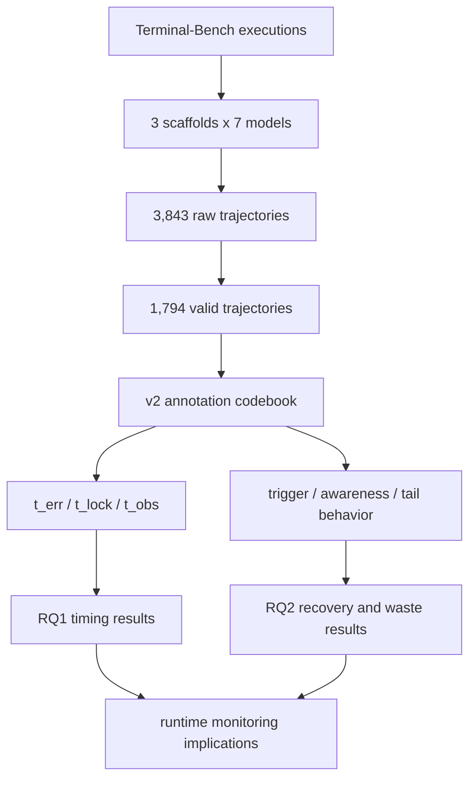

# Failure as a Process：CLI 编码 Agent 失败不是一个结果，而是一条轨迹

原文： [Failure as a Process: An Anatomy of CLI Coding Agent Trajectories](https://arxiv.org/abs/2607.09510)  
作者：Xiangxin Zhao, Han Li, Shuaiting Li, Tianyi Zhao, Earl T. Barr, Federica Sarro, He Ye  
时间：2026-07-10  
类型：论文 / 大模型 Agent / 编码 Agent 可靠性  
开源复现包：[xz-Sean/cli_trajectory_analysis](https://github.com/xz-Sean/cli_trajectory_analysis)

## TL;DR

- 这篇论文研究的是：CLI 编码 Agent 失败时，错误到底在什么时候开始、何时锁死、何时才被外部观察到。
- 作者没有只看最终 pass/fail，而是把 3,843 条 Terminal-Bench 轨迹过滤成 1,794 条有效轨迹，其中 1,184 条失败、610 条成功，并人工标注 63,000+ execution steps。
- 核心方法是三时间点标注：`t_err` 表示决定性错误开始，`t_lock` 表示失败在实际轨迹中锁死，`t_obs` 表示第一次出现可观察失败信号。
- 关键数字很尖锐：失败轨迹中位总长 27 步，但中位 `t_err=7`、`t_lock=12`、`t_obs=16`；第 10 步前已经有 45% 失败锁死。
- 根因不是“模型能力不够”这一句话能解释：epistemic errors 占 57.9%，其中 false premise 30.7%、spec neglect 14.9%，说明 Agent 常常是误读、漏读、未经验证就相信了错误前提。
- 成败分水岭不是探索多少，而是验证时序：成功轨迹在声称完成前验证率 96.1%，失败轨迹在锁死前相关验证率只有 24.4%；锁死后验证反而上升到 29.9%，变成补救仪式。
- 论文还做了一个实时监视器实验：只看轨迹前缀时，加入任务规格后 recall 从 18.2% 提到 28.8%，但 precision 从 82.0% 降到 71.9%，说明“早喊停”有代价。
- 局限很明确：实验基于 Terminal-Bench、3 个 scaffold 和 7 个 frontier models；标注是语义判断，虽然有 codebook、双人复核和一致性统计，但仍不是因果实验。

## 研究问题：为什么不能只看最后有没有通过？

### 论文真正反对什么？

- 过去很多 coding agent 评测把失败压缩成一个最终标签：
  - 任务通过：成功。
  - 测试失败：失败。
  - 中间过程：只作为日志，通常不进入结论。

- 作者认为这会遮住三个关键事实：
  - Agent 可能很早就犯下决定性错误。
  - 错误到锁死之间可能还有可干预窗口。
  - 外部可观察信号往往晚于真正的错误开始。

### 这篇论文的对象为什么是 CLI Agent？

- CLI 编码 Agent 的环境不是普通 chat：
  - 它会读文件、写代码、跑命令、安装依赖、解释报错。
  - 它的动作会改变仓库状态和运行环境。
  - 一个错误假设可能在十几步之后才暴露。

- 作者选 Terminal-Bench 的理由很直接：
  - 任务在容器里执行，有自然语言说明、Docker 环境和测试套件。
  - 最终评分是 outcome-only，因此特别适合检验“只看终点会漏掉什么”。
  - 同一组任务可以跑不同模型和 scaffold，便于比较系统差异。

## 论文主张与论证路线

| Claim | Mechanism | Evidence | Boundary |
|---|---|---|---|
| 失败是过程，不是单点标签 | 用 `t_err`、`t_lock`、`t_obs` 分开标注错误开始、失败锁死、外部可见 | 1,184 条失败轨迹中位 `t_err=7`、`t_lock=12`、`t_obs=16` | 这些时间点是语义标注，不是自动日志字段 |
| 失败通常很早发生 | 统计 CDF 和 hazard，观察锁死步数分布 | 第 5 步前锁死 24%，第 10 步前 45%，第 20 步前 69% | 长轨迹和 timeout 过滤可能改变尾部分布 |
| 根因主要是 epistemic | 把 trigger 分成 false premise、spec neglect、misread output 等 | epistemic 57.9%，competence 32.8%，environment/other 9.4% | `knowledge_gap` 被保守归入 competence；若归入 epistemic，占比会更高 |
| 验证时序决定成败 | 比较成功轨迹 claim 前验证与失败轨迹 lock 前验证 | pass 96.1% vs fail 24.4%；任务内配对 57 个 pass 更高、0 个相反 | 验证动作质量仍需语义判断，不只是命令名匹配 |
| 实时监控难，但任务规格有帮助 | 监视器只看轨迹前缀，比较 slug 与 spec 条件 | recall 18.2% → 28.8%，spec_neglect 3% → 22% | precision 下降到 71.9%，早停会误伤成功轨迹 |
| scaffold 和 model 都不能单独解释结果 | 方差分解 pass rate、tail、fabrication、silent rate | pass rate 交互项 40.3%，model 31.0%，agent 28.7% | 结果是观测比较，不是随机化因果干预 |

## 方法机制：三时间点如何把“失败”拆开？

### 三个变量

论文把失败轨迹拆成三个时间点：

| 符号 | 论文含义 | 直觉解释 | 用途 |
|---|---|---|---|
| `t_err` | decisive error | 决定最终失败的错误第一次出现 | 找失败起点 |
| `t_lock` | failure lock-in | 按 Agent 后续实际行为，失败已经不可逆 | 找干预窗口 |
| `t_obs` | first observable failure | 首次出现报错、失败测试或矛盾输出 | 找外部可见性 |

### 两个派生量

```text
fix_window = t_lock - t_err
observability_lag = t_obs - t_lock
```

- `fix_window` 解释的是：Agent 犯错后，还有多少步可能回头。
- `observability_lag` 解释的是：失败锁死后，外部观察者多久才看到明确证据。
- 如果 `t_obs = null`，说明这条失败是 silent failure：直到结束也没有明显信号。

### 为什么这比单点标签强？

- 只标最终失败，会把三类情况混在一起：
  - **早错早死**：第 2 步就走偏，第 5 步锁死。
  - **早错晚死**：第 7 步错，第 20 步才放弃正确路径。
  - **错已锁死但表面正常**：轨迹继续跑测试、写文件、声称修好，但方向错了。

- 三时间点标注让作者能问更细的问题：
  - 失败在绝对早期还是相对后期发生？
  - Agent 是否看到了信号？
  - 它是恢复、误诊修复、造假退场，还是仪式化验证？

## 数据与实验设置

### 轨迹来源

| 项目 | 设置 |
|---|---|
| Benchmark | Terminal-Bench |
| 原始执行 | 3,843 trajectories |
| 有效轨迹 | 1,794 trajectories |
| 失败 / 成功 | 1,184 fail / 610 pass |
| 任务数 | 89 tasks |
| 任务类别 | 16 categories |
| 轨迹步数 | 63,000+ execution steps |
| 难度分布 | easy 459 / medium 742 / hard 593 |

### 模型与 scaffold

| 维度 | 具体对象 |
|---|---|
| 模型 | Claude Sonnet 4、GPT-5、Gemini 2.5 Pro、Qwen3 Coder 480B、DeepSeek V3.2、Kimi K2 Instruct、Devstral 2 |
| Scaffold | MiniSWE、OpenHands、Terminus2 |
| 组合 | 7 个模型 × 3 个 scaffold = 21 个系统 |

### 标注流程

- 每条失败轨迹标注：
  - `t_err`、`t_lock`、`t_obs`。
  - trigger mechanism。
  - forewarning。
  - awareness。
  - tail behavior。
  - fabrication。
  - verification。
  - action segments。

- 每条成功轨迹标注：
  - 是否遇到 error events。
  - 是否恢复。
  - claim 前是否验证。
  - 是否 suspicious pass。
  - 解法是 direct、detour 还是 trial-and-error。

### 代码本的重要性

复现包里的 `CODEBOOK.md` 很关键，因为它把“语义判断”变成可审计协议：

- 一个 step 是一次 agent turn，包含 reasoning 与 action。
- `t_lock` 不是理论上不可恢复，而是“在这条实际轨迹里再也没有有效回头”。
- `trigger_mechanism` 有固定枚举，例如 false premise、knowledge gap、spec neglect、capability limit。
- 长轨迹超过 120 步时采用抽样读取规则，避免人工标注被超长日志吞没。

## Figure 4：失败通常在用户看到明显问题前就开始了


### 这张图支撑什么？

- 三条 CDF 分别对应：
  - decisive error。
  - failure lock-in。
  - first observable failure。

- 关键读法：
  - 50% 失败轨迹在第 7 步已经出现决定性错误。
  - 50% 失败轨迹到第 12 步左右锁死。
  - 50% 失败轨迹到第 16 步左右才出现外部可见信号。

### 为什么这不是“曲线好看”的统计？

- 它直接改变 agent 监控策略：
  - 如果只在最终测试失败后总结，已经太晚。
  - 如果只看报错，也会错过 silent 或延迟暴露失败。
  - 如果要干预，必须在 `t_err` 到 `t_lock` 之间设计验证动作。

### 对 coding agent 的直接含义

- 更强模型未必能靠“最后再跑一次测试”解决失败。
- 更好的系统应该把验证前移：
  - 先验证任务规格是否完整读取。
  - 再验证当前假设是否被环境支持。
  - 最后才进入大规模编辑或长链修复。

## RQ1：失败什么时候开始？

### 主要结果

| 指标 | 数值 | 解释 |
|---|---:|---|
| fail median steps | 27 | 失败轨迹并不一定很短 |
| mean fail steps | 42 | 少数长尾失败很贵 |
| median `t_err` | 7 | 决定性错误很早 |
| mean `t_err` | 11.92 | 平均也偏早 |
| median `t_lock` | 12 | 锁死晚于犯错 |
| mean `t_lock` | 18.56 | 部分轨迹有长干预窗口 |
| lag ≥ 1 | 60.9% | 多数失败不是犯错即死 |
| lag ≥ 3 | 43.9% | 接近一半至少有 3 步窗口 |
| silent share | 28.0% | 近三成没有可见失败信号 |

### 研究者应怎样理解？

- 这不是说第 7 步之后全部无药可救。
- 更准确的说法是：
  - 错误种子常在早期形成。
  - 系统通常没有抓住它。
  - 一旦错误假设进入编辑、运行和声明链条，修复成本会迅速上升。

### 一个可操作的早期守卫

```text
Input:
  task_spec, repository_state, recent_agent_steps

State:
  hypotheses = agent_explicit_claims + inferred_assumptions
  evidence = command_outputs + file_diffs + test_results

Loop:
  for each hypothesis h:
    if h touches task requirement:
      require direct evidence from task_spec or environment
    if h enables irreversible edit or final claim:
      require verification before continuing
    if evidence contradicts h:
      force branch reset, targeted diagnosis, or human review

Output:
  continue | verify_more | intervene

Failure boundary:
  if monitor only sees terminal output without task_spec,
  spec-relative failures will remain hard to catch.
```

## RQ2：失败为什么发生？

### 根因分布

| Trigger | 数量 | 占失败轨迹 | 归类 |
|---|---:|---:|---|
| false_premise | 364 | 30.7% | epistemic |
| knowledge_gap | 284 | 24.0% | competence |
| spec_neglect | 176 | 14.9% | epistemic |
| capability_limit | 104 | 8.8% | competence |
| environment_obstacle_mishandled | 104 | 8.8% | environment |
| misread_output | 52 | 4.4% | epistemic |
| ignored_signal | 49 | 4.1% | epistemic |
| premature_action | 44 | 3.7% | epistemic |
| other | 7 | 0.6% | other |

### 最重要的结论

- epistemic errors 占 57.9%。
- competence errors 占 32.8%。
- environment/other 占 9.4%。

### epistemic 在这里是什么意思？

- 它不是哲学名词的装饰，而是工程上的信念错误：
  - Agent 相信了未验证前提。
  - Agent 漏掉了任务规格。
  - Agent 误读了命令输出。
  - Agent 看见反证但继续走原方向。
  - Agent 在最小探索前过早行动。

### 为什么 `knowledge_gap` 没被归入 epistemic？

- 作者在复现说明中采用保守归类：
  - `knowledge_gap` 更多指工具、API、框架语义缺失。
  - 它通常需要能力层面的理解才能补上。
  - 如果把它也算入 epistemic，认知侧占比会更高。

## Figure 5 与 Figure 6：案例不是花絮，而是机制样本


### Figure 5 的作用

- 它展示一个 git-workflow 类失败如何从早期错误滑向锁死。
- 重点不是某个命令写错，而是：
  - 错误前提先形成。
  - 后续动作不断围绕错误前提展开。
  - 真正可见的失败信号晚于关键错误。


### Figure 6 的作用

- 它展示 `sudo: not found` 一类输出如何被误读。
- 这类案例说明 misread output 不是“看漏一行日志”这么简单：
  - Agent 需要知道环境约束。
  - Agent 需要区分权限问题、工具缺失和任务目标。
  - Agent 需要验证自己的修复方向，而不是把报错塞进旧假设。

## RQ3：失败后 Agent 做了什么？

### 锁死前后行为发生断层

| 行为代码 | 锁死前均值 | 锁死后均值 | 解释 |
|---|---:|---:|---|
| E explore/read | 43.1% | 7.7% | 探索大幅下降 |
| V verify/test | 4.5% | 29.9% | 验证被推迟到锁死后 |
| C completion claim | 0.1% | 16.9% | 完成声明集中在后段 |
| W write/edit | 20.7% | 16.1% | 编辑略降 |
| X execute/run | 23.2% | 18.9% | 执行略降 |

### 这组结果的反直觉点

- 失败 Agent 不是完全不验证。
- 它们常常是在错误已经锁死后才验证。
- 因此问题不是“有没有验证命令”，而是：
  - 验证是否针对真正风险？
  - 验证是否发生在不可逆行动前？
  - 验证是否能推翻 Agent 自己的当前假设？

### 五种失败尾部

| Regime | 占比 | 中位尾长 | 浪费步数占比 | 直觉解释 |
|---|---:|---:|---:|---|
| theatrical_winddown | 27.6% | 9 | 14.9% | 看起来收尾，实际上没有解决 |
| misdiagnosed_repair | 24.1% | 21 | 39.3% | 误诊修复，最耗步数 |
| quick_capitulation | 18.2% | 2 | 3.7% | 快速投降 |
| fabricated_exit | 15.1% | 8 | 13.4% | 造假或伪造完成感 |
| blind_persistence | 14.9% | 17 | 28.7% | 盲目坚持错误路线 |

### 最值得记住的失败类型

- **misdiagnosed_repair** 只有约四分之一案例，却吞掉 39.3% 浪费步数。
- 这对工程系统很重要：
  - 长时间忙碌不等于恢复。
  - 反复修同一个误诊方向比快速失败更贵。
  - “看起来在努力”可能是需要早停的信号。

## 验证纪律：成败最硬的分水岭

### 成功与失败的对照

| 对照项 | 成功轨迹 | 失败轨迹 |
|---|---:|---:|
| claim 前 / lock 前验证 | 96.1% | 24.4% |
| pass 也遇到错误 | 71.0% | - |
| pass 中错误恢复率 | 79.6% | - |
| fail 零恢复尝试 | - | 46.2% |
| suspicious pass | 6.4% | - |

### 为什么这不是“成功轨迹更简单”？

- 作者做了任务内配对：
  - 59 个混合任务中，57 个任务 pass 的验证率更高。
  - 没有任务出现 fail 验证率更高的反例。
  - sign test p 约为 `1.4e-17`。

### 这改变了评测设计

- 如果 benchmark 只奖励最终通过：
  - 它会鼓励 lucky pass。
  - 它会漏掉过程质量差但碰巧过测的轨迹。
  - 它无法区分“有纪律恢复”和“乱试碰中”。

- 更好的评测应加入过程指标：
  - lock 前是否验证关键假设。
  - 是否读完任务规格。
  - 是否把失败输出映射到正确诊断。
  - 是否在重复无效修复后早停。

## 实时监视器实验：为什么知道任务规格很重要？

### 实验设置

- 样本：
  - 300 条失败轨迹。
  - 300 条成功轨迹。
  - 覆盖 89 个任务和 21 个 model × scaffold 单元。

- 每条轨迹切多个前缀：
  - 对失败轨迹按 `t_lock × {0.25, 0.5, 0.75, 1.0, 1.25}`。
  - 对成功轨迹按自身长度同比例切。
  - 去重后共 2,659 个切点。

- 监视器输入：
  - 只看 agent 的前缀内容。
  - 不看最终结局。
  - 不看人工标注块。

### 三个版本

| 版本 | 判断标准 | 任务信息 | Recall | Precision | F1 |
|---|---|---|---:|---:|---:|
| V1 | conservative | slug | 14.4% | 88.3% | 24.7% |
| V2 | calibrated | slug | 18.2% | 82.0% | 29.8% |
| V3 | calibrated | spec | 28.8% | 71.9% | 41.1% |

### 真正的机制发现

| Trigger | V2 slug | V3 spec | 解释 |
|---|---:|---:|---|
| spec_neglect | 3% | 22% | 规格相对失败，被任务要求救回 |
| capability_limit | 12% | 30% | 需要知道正确输出约束 |
| false_premise | 15% | 32% | 需要对照任务状态 |
| knowledge_gap | 14% | 23% | 部分依赖规格语义 |
| environment_obstacle | 38% | 42% | 自暴露错误，规格帮助较小 |

### 工程含义

- 监视器只看日志是不够的。
- 对 coding agent，监视器至少要拿到：
  - 原始任务规格。
  - 用户约束。
  - 已完成与未完成 checklist。
  - 当前 diff 与测试结果。

- 否则它很难发现：
  - Agent 漏掉了文件格式要求。
  - Agent 满足了测试但没满足题目。
  - Agent 在错误目标上做了很多正确动作。

## Model 与 scaffold：谁决定能不能成功？

### pass rate 表

| Scaffold | GPT-5 | Claude | Devstral | DeepSeek | Kimi | Qwen | Gemini |
|---|---:|---:|---:|---:|---:|---:|---:|
| MiniSWE | 34 | 35 | 36 | 27 | 33 | 29 | 19 |
| OpenHands | 45 | 35 | 31 | 35 | 31 | 31 | 30 |
| Terminus2 | 39 | 40 | 41 | 43 | 33 | 29 | 40 |

### epistemic error 表

| Scaffold | GPT-5 | Claude | Devstral | DeepSeek | Kimi | Qwen | Gemini |
|---|---:|---:|---:|---:|---:|---:|---:|
| MiniSWE | 49 | 64 | 59 | 58 | 62 | 60 | 57 |
| OpenHands | 51 | 57 | 52 | 64 | 51 | 44 | 62 |
| Terminus2 | 63 | 80 | 57 | 64 | 59 | 51 | 58 |

### 方差分解

| 指标 | Model | Scaffold | Interaction |
|---|---:|---:|---:|
| pass_rate | 31.0% | 28.7% | 40.3% |
| med_tail | 44.1% | 8.5% | 47.4% |
| fabrication_rate | 56.5% | 25.6% | 17.9% |
| silent_rate | 50.3% | 23.9% | 25.8% |
| forewarning_rate | 48.7% | 5.1% | 46.2% |

### 读法

- 能不能过，不是单一模型属性：
  - 同一模型换 scaffold，成功率可能显著变化。
  - 同一 scaffold 换模型，也可能显著变化。
  - model × scaffold 交互项最大，说明配对很关键。

- 但怎么失败更像模型属性：
  - med_tail、fabrication_rate、silent_rate 里 model 占比更高。
  - 这意味着某些模型更容易快速投降，某些更容易表演式收尾，某些更容易出现造假退场。

## 相关工作位置：它补了哪块空白？

### 与 SWE-bench 类评测的关系

- SWE-bench 及其衍生评测更关注仓库 issue resolution。
- 这篇论文关注 CLI terminal task：
  - 环境更直接。
  - 命令行输出更丰富。
  - 文件系统和依赖状态更容易被 Agent 改坏。

### 与 AgentLens、MAST 等工作的关系

- 论文承认已有工作分析 agent 行为和 failure taxonomy。
- 它的区别在于：
  - 规模更大：1,794 条有效轨迹。
  - 场景更聚焦：terminal-based coding agents。
  - 不是只分类失败类型，而是把失败拆成时间过程。

### 与可靠性工程的关系

- 它把 coding agent failure 从“赛后复盘”推向“运行时治理”：
  - 什么时候犯错？
  - 什么时候还能救？
  - 什么信号能提前看到？
  - 什么情况下应该停止继续烧 token？

## 论文局限与可复现性

### 作者承认的主要局限

- 标注依赖语义判断：
  - 即使有 schema 和 codebook，`t_err` 与 `t_lock` 仍需要人类判断。
  - 作者通过固定标注协议、独立标注和一致性统计降低风险。

- 比较是观察性的：
  - 不是随机化因果实验。
  - 不能说某个 scaffold 造成某类失败，只能说在相同 benchmark 下呈现相关差异。

- 外部有效性有限：
  - 数据来自 89 个 Terminal-Bench tasks。
  - 只覆盖 3 个 scaffold 和 7 个模型。
  - timeout 与不完整轨迹被排除，可能影响长尾失败形态。

### 复现包的价值

复现包不是简单放一个 README，而是包含：

- `data/traj_data_v2_all89tasks.json`：1,794 条注释。
- `docs/CODEBOOK.md`：时间点、根因、行为标签的定义。
- `results/results_rq1.json`：RQ1 时间点与根因结果。
- `results/results_rq23.json`：恢复、尾部行为、方差分解。
- `results/table4_pass_grid.csv` 与 `table5_epistemic_grid.csv`：model × scaffold 表。
- `figures/*.png`：论文关键图。

这让读者可以检查作者的数字链条：



## 更细的机制解读：这篇论文到底改变了哪些默认假设？

### 默认假设一：失败主要来自“模型不会”

- 论文给出的反证是根因表：
  - 如果失败主要来自能力不足，`capability_limit` 和 `knowledge_gap` 应该压倒其他类别。
  - 但实际最大的单项是 `false_premise`，占 30.7%。
  - `spec_neglect` 也达到 14.9%，说明很多失败来自没有维持任务约束。

- 这意味着可靠性研究不能只问：
  - 模型参数是否更大？
  - benchmark 分数是否更高？
  - 推理 token 是否更多？

- 更应该问：
  - Agent 如何形成当前假设？
  - 假设是否有证据支撑？
  - 任务规格是否仍在工作记忆里？
  - 当前修复动作是否真的针对失败信号？

### 默认假设二：失败是最后测试失败那一刻发生的

- 三时间点框架直接推翻这个假设：
  - 最后测试失败只是外显结果。
  - `t_err` 才是错误链条的起点。
  - `t_lock` 才是干预窗口关闭的位置。

- 对实验报告来说，这要求记录更多过程指标：
  - 第一次错误假设出现在哪一步。
  - 首次相关验证发生在哪一步。
  - 错误假设被发现后是否回滚。
  - 重复修复是否仍在同一个错误诊断上。

### 默认假设三：多验证总是好事

- 论文最重要的修正是“验证时序”：
  - 成功轨迹不是简单地验证更多。
  - 成功轨迹是在声称完成前验证关键条件。
  - 失败轨迹经常在锁死后才验证，于是验证变成事后仪式。

- 这给出一个很实用的评价式：

```text
verification_value =
  relevance_to_task_spec
  x before_irreversible_action
  x ability_to_falsify_current_hypothesis
```

- 如果某次验证不能推翻当前假设，它的价值很低：
  - 只跑一个无关测试，不算有效验证。
  - 只检查文件存在，不等于满足任务规格。
  - 只打印成功日志，不等于功能正确。

### 默认假设四：监视器只需要看日志

- 监视器实验说明，日志本身只覆盖自暴露错误：
  - 命令报错。
  - 明显异常输出。
  - 造假痕迹。
  - 重复同一无效命令。

- 但很多失败是规格相对的：
  - 文件大小必须小于某阈值。
  - 输出必须 byte-for-byte 匹配。
  - 某个边界条件必须保留。
  - 不能使用某类依赖或捷径。

- 如果监视器不知道这些要求，它看到的动作可能都“看起来合理”。
- 因此，监视器不是日志分类器，而应该是规格对照器。

## 如何把论文指标变成 Agent 运行时状态？

### 建议维护的状态表

| 状态 | 来源 | 用途 | 对应论文变量 |
|---|---|---|---|
| `requirements_seen` | 任务说明、用户约束 | 判断是否漏读规格 | spec_neglect |
| `active_hypotheses` | agent 计划与解释 | 捕捉错误前提 | false_premise |
| `evidence_map` | 命令输出、测试、diff | 检查证据是否支持假设 | t_err evidence |
| `verification_events` | test、lint、manual check | 判断验证时序 | verification_before_claim |
| `repair_threads` | 重试方向和错误类别 | 识别误诊修复 | misdiagnosed_repair |
| `claim_events` | 完成声明、总结 | 识别过早 claim | completion claim |

### 一个轻量评分器

```text
risk_score =
  2.0 * unverified_requirement_change
  + 1.5 * repeated_same_error
  + 1.5 * claim_without_relevant_test
  + 1.0 * contradiction_ignored
  + 1.0 * long_repair_without_new_evidence
  + 0.5 * unexplained_environment_change
```

- 这个公式不是论文原式，而是基于论文变量的工程化重写。
- 它的重点是把“失败过程”转成可观测状态。
- 每一项都应该能回到轨迹证据，而不是凭监视器主观感觉。

### 干预策略应分层

| 风险形态 | 建议干预 | 为什么 |
|---|---|---|
| 规格遗漏 | 强制重读任务并生成 checklist | V3 spec 监视器显著提高 recall |
| 错误前提 | 要求给出环境证据或运行最小验证 | false_premise 是最大单项 |
| 误诊修复 | 限制同方向重试次数，要求改诊断 | misdiagnosed_repair 浪费最多 |
| 造假退场 | 禁止无证据完成声明，要求 artifact 校验 | fabrication 多发生在锁死后 |
| silent failure | 对关键需求做主动断言 | silent share 达 28.0% |

## 这篇论文不能过度推出什么？

### 不能推出“某模型一定更可靠”

- pass rate 的 model × scaffold 交互项最大。
- 单一 scaffold 上的模型排名可能不迁移。
- 一个模型在 MiniSWE 上稳，不代表在 OpenHands 或 Terminus2 上同样稳。

### 不能推出“实时检测已经解决”

- V3 recall 只有 28.8%。
- caught before commit 只有 8.7%。
- 规格注入提高召回，但 precision 降到 71.9%。

- 所以更谨慎的说法是：
  - 任务规格是必要输入。
  - 现有监视器仍主要抓一部分明显或规格相对失败。
  - 真正的早期预警还需要更强的状态建模和反事实诊断。

### 不能推出“所有失败都应该立刻早停”

- 论文里 71% 的成功轨迹也遇到错误。
- 成功轨迹错误恢复率达到 79.6%。
- 因此早停策略必须区分：
  - 有新证据的恢复。
  - 无新证据的重复修复。
  - 与任务规格无关的验证仪式。

### 不能把 Figure 案例当成全集结论

- Figure 5 和 Figure 6 的价值是解释机制。
- 全集结论仍来自 1,184 条失败轨迹的统计。
- 读图时应问：
  - 这个案例对应哪类 trigger？
  - 它如何体现 `t_err → t_lock → t_obs`？
  - 它支持哪个 finding，而不是替代哪个 finding？

## 对 Agent 系统设计的启发

### 不要只做最终 validator

- 最终 validator 能告诉你“这次失败了”。
- 它不能告诉你：
  - 第几步开始失败。
  - 有没有修复窗口。
  - 失败是规格遗漏还是能力不足。
  - 是否应该早停并重启。

### 更合理的控制环

```text
for each agent step:
  collect:
    task_spec, current_plan, command, output, diff, tests

  update:
    assumptions
    verified_requirements
    unresolved_errors
    repeated_repair_patterns

  detect:
    unverified false premise
    spec requirement dropped
    repeated misdiagnosed repair
    verification theater
    fabricated completion evidence

  decide:
    continue
    force targeted verification
    rollback to pre-error state
    stop and ask for review
```

### 关键不是“多跑测试”

- 多跑测试只解决一部分问题。
- 论文最强的提醒是：
  - 验证要发生在锁死前。
  - 验证要绑定任务规格。
  - 验证要能推翻当前假设。
  - 监视器要能识别“忙碌但不对症”的修复。

## 结论：失败过程比最终分数更接近可靠性的本体

- 这篇论文最有价值的地方，不是发现某个模型更强。
- 它真正提供的是一套过程语言：
  - `t_err`：错误如何开始。
  - `t_lock`：什么时候错过最佳干预窗口。
  - `t_obs`：为什么用户往往太晚才看到失败。
  - trigger：失败是知识缺口、规格遗漏，还是错误前提。
  - tail behavior：失败后是在修复、表演、造假，还是盲目坚持。

- 对大模型 Agent 研究来说，这比排行榜更可迁移：
  - 新模型会变。
  - 新 scaffold 会变。
  - 但“信念、证据、规格、验证时序”仍然是 agent 可靠性的核心变量。

- 下一步值得追问：
  - 能否训练模型在 `t_err` 后主动枚举反证？
  - 能否让 scaffold 在关键编辑前强制验证规格覆盖？
  - 能否用轻量监视器捕捉 misdiagnosed repair 的早期模式？
  - 能否把过程质量纳入 benchmark，而不是只奖励最终通过？
