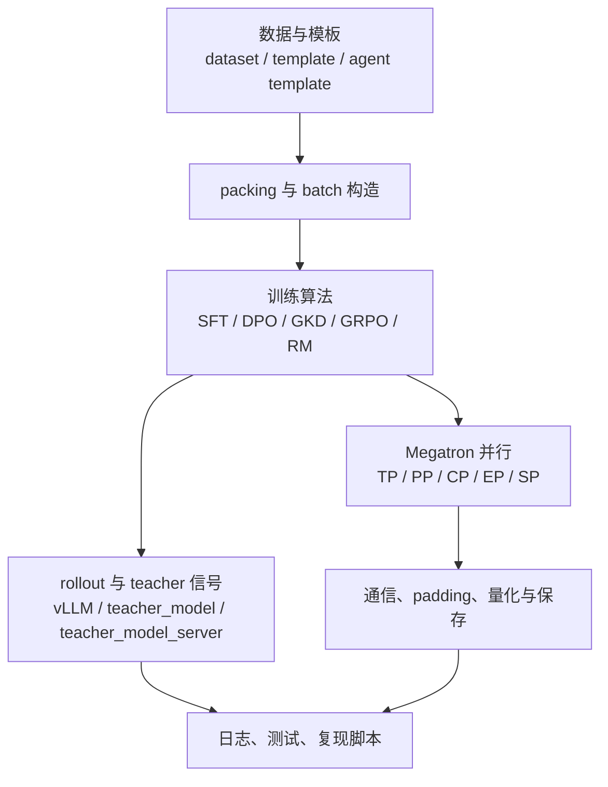
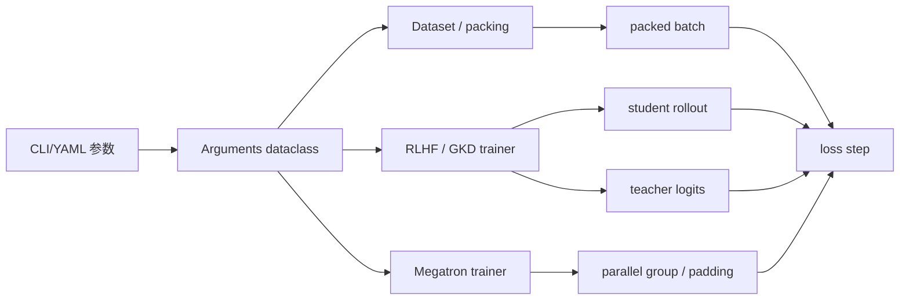
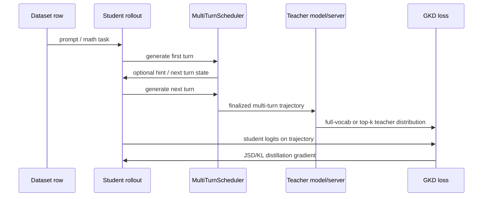
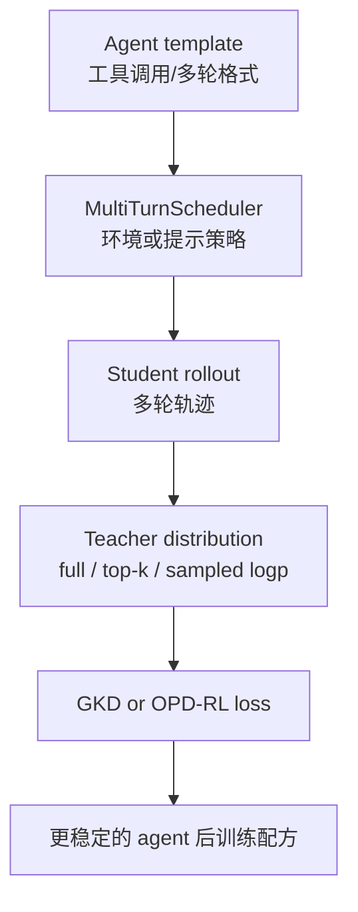

# modelscope/ms-swift v4.4.1：一个“补丁版”为什么值得后训练工程师细读

## 元信息与 TL;DR

- **内容类型**：代码项目 release 深读
- **项目**：modelscope/ms-swift
- **版本**：v4.4.1
- **发布时间**：2026-07-13T02:52:50Z
- **原始链接**：https://github.com/modelscope/ms-swift/releases/tag/v4.4.1
- **比较范围**：`v4.4.0...v4.4.1`
- **本轮分类**：大模型后训练

### TL;DR

- `ms-swift v4.4.1` 名义上是 patch release，但 compare 中有 **22 个提交、64 个文件变更**；它不是提出新算法，而是在后训练流水线的几个高风险控制面上补洞。
- 最值得看的是四组改动：
  - **packing_strategy**：给 SFT packing 增加 `binpack | sequential`，解决长度优先装箱会重排样本、破坏顺序采样配方的问题。
  - **GKD multi-turn**：把 GKD 接到与 GRPO 共用的 `MultiTurnScheduler`，并补充普通、Megatron、Ray 三套多轮 GKD 示例。
  - **Megatron 稳定性**：新增 `nccl_comm_warmup`，在训练循环前预热 DP/CP/TP/PP/model/embedding 等 NCCL communicator，避免第一步内存峰值才触发 NCCL `cudaMalloc`。
  - **FP8/MXFP8 packing 修复**：在 sequence parallel 下把 MXFP8 padding 对齐从通用 FP8 的 `TP * 16` 改成 `TP * 32`，让每个 TP shard 满足 32 block 约束。
- 证据来自 GitHub release、compare、关键 PR、README、docs、examples 与源码；项目 README 标称支持 **600+ text-only LLM、400+ multimodal LLM**，覆盖 CPT/SFT/DPO/GRPO/GKD/RM/KTO 等训练任务。
- 这次没有官方 benchmark 或吞吐提升数字；因此本文不声称 v4.4.1 “提升模型效果”，只讨论它怎样降低复现实验、长序列 packing、多轮蒸馏和大规模 Megatron 训练的工程失败概率。
- 研究者视角的重点是：后训练系统的可复现性不只取决于 loss 和数据，还取决于 **样本顺序、pack 边界、teacher 信号粒度、rollout 多轮轨迹、分布式通信初始化、量化 block 对齐** 这些看似底层的控制变量。

## 为什么选这条，而不是安全博客或 Agent PR？

### 本轮 Scout 候选表

| 排名 | 方向 | 候选 | 时间证据 | 取舍 |
|---:|---|---|---|---|
| 1 | 后训练 | `modelscope/ms-swift v4.4.1` | GitHub release `published_at=2026-07-13T02:52:50Z` | 选中；有 release、compare、PR 与源码证据 |
| 2 | AI 安全 | Safeguard AI-generated code security review | 页面标记 2026-07-13 | 备选；文章质量可读，但底层研究多来自较早论文 |
| 3 | Agent | CrewAI Responses API tool calls PR | commit 在 2026-07-13 | 未选；PR 未合并，适合跟踪不适合发布深读 |
| 4 | Agent | Dify marketplace header jitter PR | merged_at 在 2026-07-13 | 未选；平台相关但技术深度不足 |

### 选择逻辑

- **时间窗口合格**：
  - 契约要求本周从 2026-07-13T00:00:00Z 开始；
  - `v4.4.1` 在 2026-07-13T02:52:50Z 发布。
- **内容深度足够**：
  - release body 很短，只给 Full Changelog；
  - 但 compare 展开后有 22 个提交、64 个文件。
- **和近期内容不重复**：
  - 最近已覆盖 `SIS`、`TTHE`、`aiAuthZ`、`TokenWall`、`Proactive Memory Agent`、`ScopeJudge`、`Prismata`；
  - 本文转向后训练工程工具链，不再延续 web-agent containment 或 agent security 主题。

## 项目定位：ms-swift 是什么后训练层？

### README 给出的能力边界

| 维度 | README 中的定位 | 对后训练的含义 |
|---|---|---|
| 模型范围 | 600+ text-only LLM、400+ multimodal LLM | 工具链要面对大量模板、tokenizer、模型结构和训练后端差异 |
| 训练任务 | CPT、SFT、human alignment、DPO、KTO、RM、CPO、SimPO、ORPO、GKD、GRPO | 它不是单一 SFT wrapper，而是多种后训练算法的统一入口 |
| 分布式 | DDP、DeepSpeed、FSDP/FSDP2、Megatron TP/PP/SP/CP/EP/VPP | release 的许多修复出现在 Megatron 和 sequence parallel 上并不意外 |
| 推理/rollout | vLLM、SGLang、LMDeploy、OpenAI-style serving | GRPO/GKD 的 on-policy 或 teacher API 训练依赖推理后端 |
| 硬件 | A10/A100/H100、RTX、AMD、CPU、MPS、Ascend NPU | 文档和示例必须处理跨硬件兼容，而不是只服务单机实验 |

### 它在后训练栈里的位置



- v4.4.1 的改动主要落在图里的 **B、C、D、E、F**。
- 它不改变“后训练应该优化什么目标”的研究命题。
- 它改变的是：一个目标函数能否在真实多卡、多轮、长上下文、量化和蒸馏设置中稳定执行。

## Release diff：22 个提交实际分成哪几类？

### 变更分组

| 组别 | 代表提交/PR | 直接影响 |
|---|---|---|
| SFT packing 可复现性 | `#9598`，`packing_strategy` | 保留顺序采样器的样本顺序与 pack 边界 |
| GKD 多轮训练 | `#9698`，新增 multi-turn 示例与 trainer 测试 | 把 GKD 从单轮蒸馏推进到多轮 rollout 场景 |
| Megatron 大模型稳定性 | `#9602`，`nccl_comm_warmup` | 避免第一步内存峰值才初始化 NCCL communicator |
| MXFP8 sequence parallel | `#9722`，`get_padding_to()` | 修复 packed sequence 在 TP shard 上不满足 32 block 对齐 |
| 新模型/模板适配 | Hy3、DeepSeek-V4、Qwen3.5、Qwen3-TTS、Qwen3-Coder | 降低新模型模板、packing、transformers version 的兼容风险 |
| 文档与示例 | NPU、DeepSeek-V4、Qwen3.5、Distillation、GRPO docs | 把新增控制面暴露给用户，而不是只藏在源码里 |

### 这个 release 的真实主题

- 表面是 patch：
  - bugfix；
  - docs；
  - model support；
  - version bump。
- 实质是后训练工程的 **隐含状态显式化**：
  - packing 策略从隐含 best-fit-decreasing 变成用户可选；
  - teacher routing、top-k logits、multi-turn scheduler 在 GKD 中变成可配置路径；
  - communicator 初始化时机从第一步懒加载变成可提前 warmup；
  - MXFP8 block size 从通用 FP8 分支中独立出来。

### 逐文件看，主线在哪里？

| 文件/目录 | 这次变化的意义 | 为什么不是普通清理 |
|---|---|---|
| `swift/dataset/packing.py` | 新增 `strategy` 分支，并把 unfinished pack 作为 carry-over 返回 | 它改变样本进入同一 pack 的规则，影响训练样本邻接关系 |
| `swift/pipelines/train/sft.py` | 把 `args.packing_strategy` 传入 `PackingDataset` 或 `IterablePackingDataset` | 参数不只停留在 CLI，而是真正进入 SFT 数据路径 |
| `swift/arguments/base_args/base_args.py` | 增加 `packing_strategy: Literal['binpack','sequential']` | 把 packing 算法变成被 schema 管住的训练参数 |
| `swift/rlhf_trainers/gkd_trainer.py` | GKD trainer 复用 rollout 基础设施，处理 teacher logits 与 JSD loss | 让 GKD 从静态监督损失进入可在线采样的训练路径 |
| `swift/megatron/trainers/gkd_trainer.py` | Megatron GKD 处理 teacher loading、top-k、CP/TP padding、resample | 把分布式 GKD 的 teacher/student 对齐逻辑显式化 |
| `swift/rlhf_trainers/rollout_mixin.py` | 统一 rollout → score → encode → postprocess → log 的骨架 | GRPO 与 GKD 可以共享轨迹生成框架，减少算法路径分叉 |
| `swift/megatron/trainers/rollout_mixin.py` | 创建 rollout process group，覆盖 TP/PP/CP 组合 | 多轮 rollout 不再只是假设单进程采样，而是对齐 Megatron 并行拓扑 |
| `swift/megatron/trainers/base.py` | 在 `setup_model_training` 中加入 communicator warmup | 修复训练开始前后的资源时序，而不是训练循环内部小优化 |
| `swift/megatron/utils/utils.py` | `get_padding_to()` 对 `mxfp8` 特判 | 修复 packed sequence 与 MXFP8 block 之间的数学约束 |

这组文件说明一个事实：

- release 的主线不是“加了几个模型名”。
- 主线是把后训练运行时的关键假设放进代码结构：
  - 数据路径有可选 packing 语义；
  - rollout 路径有统一抽象；
  - teacher 路径有本地模型、API、多 teacher、自蒸馏等分支；
  - Megatron 路径有独立的通信与 padding 不变量。

### 从用户命令到训练步：v4.4.1 暴露了哪些新控制点？



- `packing_strategy` 进入 C。
- `multi_turn_scheduler`、`lmbda`、`gkd_logits_topk`、`teacher_model_server` 进入 D。
- `nccl_comm_warmup`、`fp8_recipe=mxfp8`、`sequence_parallel` 进入 E。
- 这些参数共同决定 J：
  - 哪些 token 参与 loss；
  - teacher 分布是否完整；
  - packed sequence 如何切分；
  - 分布式通信是否能在第一步顺利完成。

## 关键改动一：packing_strategy 让“样本顺序”成为可控变量

### 原问题是什么？

PR `#9598` 的说明非常直接：

- 旧 packing path 用 `binpacking.to_constant_volume`。
- 这种 best-fit-decreasing 会按长度重排样本。
- 对普通吞吐优化，这通常是合理的。
- 但对某些复现配方，**样本顺序本身就是训练 recipe 的一部分**。
- 如果 domain weighting、课程顺序、顺序采样器边界被编码在样本排列里，重排会改变训练信号。

### 新参数怎么接入？

源码路径：

- `swift/arguments/base_args/base_args.py`
- `swift/dataset/packing.py`
- `swift/pipelines/train/sft.py`
- `docs/source_en/Instruction/Command-line-parameters.md`

核心行为：

| 参数 | 默认 | 行为 |
|---|---|---|
| `--packing_strategy binpack` | 是 | best-fit-decreasing，优先填满 pack，可能按长度重排 |
| `--packing_strategy sequential` | 否 | next-fit，只维护一个 open pack，放不下就 flush，保留输入顺序 |
| `--packing_num_proc 1` | 建议配合 sequential | 确保单一全局顺序，不被多进程分片打散 |

### 机制伪代码

```text
Input:
  sequences = [(sample_id, seq_len), ...]
  packing_length = max tokens per pack
  strategy in {"binpack", "sequential"}

State:
  packs = []
  cur_pack = []
  cur_len = 0

If strategy == "sequential":
  for item in sequences in original order:
    if cur_pack is not empty and cur_len + item.seq_len > packing_length:
      flush cur_pack into packs
      reset cur_pack and cur_len
    append item to cur_pack
    cur_len += item.seq_len
    if cur_len >= packing_length:
      flush cur_pack into packs

If unfinished streaming batch:
  keep trailing cur_pack as carry-over

Output:
  completed packs
  trailing unfinished pack
```

### 研究意义

- 对 SFT / CPT：
  - packing 不只是“省 padding”。
  - 它会影响哪些样本共享一个 packed sequence。
  - 如果 loss mask、position、domain mixture 或课程顺序有语义，pack 边界就是训练变量。
- 对复现：
  - `binpack` 强调吞吐；
  - `sequential` 强调配方忠实度；
  - v4.4.1 把这个 trade-off 暴露出来。

### 为什么“pack 边界”会影响训练语义？

在许多实验里，研究者默认 packing 只是工程优化：

- 原始样本长度不同；
- padding 浪费显存；
- 把多个短样本拼进一个长序列；
- 用 mask 确保样本之间不互相看见。

但真实后训练里还会出现三种更复杂的情况：

| 情况 | pack 边界为什么重要 |
|---|---|
| domain mixture 被顺序编码 | 如果数据先按 domain 或 difficulty 排列，重排会改变 curriculum |
| 长短样本分布代表任务类型 | best-fit-decreasing 会把相似长度样本聚在一起，间接改变 batch 统计 |
| streaming / iterable dataset | unfinished pack 会跨 mini-batch carry-over，边界影响下一个 batch 的组成 |

因此，packing 至少有两种目标函数：

$$
\text{ThroughputObjective}=\max \frac{\text{non-padding tokens}}{\text{allocated tokens}}
$$

$$
\text{RecipeFidelityObjective}=\min \text{distance}(\text{original order}, \text{packed order})
$$

- `binpack` 更接近第一个目标。
- `sequential` 更接近第二个目标。
- 两者没有绝对优劣，取决于实验是否把顺序当作训练信号。

### sequential 不是“更慢的 binpack”，而是另一种实验声明

如果研究者选择 `sequential`，最好同时在实验记录中写清：

- 是否使用 `packing_num_proc=1`。
- 数据是否已经按 domain、difficulty、来源或 curriculum 排序。
- 是否使用 streaming dataset。
- 是否允许 trailing unfinished pack 进入下一批。
- 是否把 pack 内样本顺序视为复现要求。

这类信息过去常被省略。

v4.4.1 的价值，是让这些信息不再只存在于维护者脑子里，而是可以出现在命令行、配置和日志里。

### 边界

- PR 说明提到 sequential 算法曾用于真实 Qwen3.5-35B SFT 复现。
- 但 release 没有给出复现实验指标。
- 因此只能说它 **降低顺序配方被 packing 改写的风险**，不能说它必然提升效果。

## 关键改动二：GKD multi-turn 把蒸馏推到轨迹级

### GKD 在 ms-swift 里是什么？

文档把 GKD 定义为：

$$
\mathcal{L}_{\text{GKD}}(x, y)=
\sum_{t=1}^{|y|}
D_{\text{JSD}(\beta)}
\left(
P_{\text{teacher}}(\cdot|x,y_{<t}),
P_{\text{student}}(\cdot|x,y_{<t})
\right)
$$

变量解释：

| 符号/参数 | 含义 |
|---|---|
| `x` | prompt 或任务输入 |
| `y` | 数据集答案或 student 在线采样答案 |
| `P_teacher` | teacher 在每个 token 位置的分布 |
| `P_student` | student 在同一条件下的分布 |
| `beta` | JSD 插值系数；0 接近 forward KL，1 接近 reverse KL |
| `lmbda` | 每个 batch 走 on-policy student generation 的概率 |
| `gkd_logits_topk` | 只取 teacher top-k logits 近似 KL，常用于外部 teacher API |

### v4.4.1 新增了什么？

新增或更新的证据点：

- `examples/train/rlhf/gkd/multi_turn.sh`
- `examples/megatron/rlhf/gkd/multi_turn.sh`
- `examples/ray/gkd/multi_turn_colocate.yaml`
- `docs/source_en/Instruction/Distillation.md`
- `docs/source_en/Megatron-SWIFT/GKD.md`
- `tests/train/test_gkd.py`
- `tests/megatron/test_gkd.py`
- `tests/megatron/test_ray_gkd.py`

这些不是只加一条参数说明，而是把普通 trainer、Megatron trainer、Ray-Megatron colocate 场景都补上了入口。

### 多轮 GKD 的控制流



### GKD 的三种 teacher 来源如何影响实验？

文档把 teacher infrastructure 拆成三种来源：

| teacher 来源 | 机制 | 适用场景 | 风险 |
|---|---|---|---|
| `teacher_model` | 训练进程加载 frozen teacher | 小到中等规模 teacher，便于 full-vocab logits | 显存占用高，和 student 竞争资源 |
| `teacher_model_server` | 通过外部 vLLM 服务请求 logprobs | 大 teacher、服务化 teacher、多 teacher 路由 | 通信开销、top-k 近似、服务一致性 |
| self-distillation | student/base model 作为 teacher | LoRA 或 OPSD 场景，避免额外 teacher | teacher 与 student 边界更难审计 |

这三种路径在论文写作中容易被一句“we use a teacher model”带过。

但工程上差异很大：

- full-vocab teacher logits 可以计算更完整的 divergence。
- top-k teacher logits 降低通信和显存，但会丢掉长尾概率。
- sampled-token teacher logp 成本最低，却更接近单样本估计。
- self-distillation 的 teacher 是否固定、是否 disable adapter、是否看 privileged prompt，都会改变训练含义。

### 多轮 GKD 和 OPD-RL 的边界

文档中把 teacher signal 分成两条路：

| 路径 | 启用方式 | signal 怎么进入训练 |
|---|---|---|
| GKD | `--rlhf_type gkd` | teacher divergence 直接作为 loss 反传 |
| OPD-RL | `--rlhf_type grpo` + teacher | teacher log-ratio 作为 policy gradient advantage |
| OPSD | 在上述路径里加入 `teacher_prompt` | teacher 输入可包含 privileged info |

这意味着 v4.4.1 的 multi-turn GKD 不应该被理解成“又一个 RL 算法”。

更准确的说法是：

- 它把多轮 rollout 产物交给 distillation loss。
- 它让 GKD 能观察 student 自己生成的中间状态。
- 它和 GRPO 共用 rollout/multi-turn 基础设施，但优化信号不同。

### 一个多轮 math-tip 示例背后的训练含义

新增示例里有几个值得注意的配置：

- `--lmbda 1`
  - 表示使用 student 在线生成，而非只吃数据集答案。
- `--multi_turn_scheduler math_tip_trick`
  - 表示中间 turn 不是随意对话，而是由 scheduler 控制。
- `--loss_scale last_round`
  - 暗示 loss 重点落在最后一轮，避免所有中间提示都被同等监督。
- `--truncation_strategy delete`
  - 长轨迹超长时删除，而不是直接报错。
- `--vllm_mode colocate`
  - rollout 与训练共享资源，需要 offload/sleep 等机制配合。

这些参数共同定义了“多轮 GKD 实验”。

如果只写一句“we train with GKD”，读者无法知道：

- student 是在线生成还是离线答案；
- teacher 看的是哪一轮上下文；
- loss 是最后一轮还是全轨迹；
- 超长样本如何处理；
- rollout 是否和训练模型共址。

### 为什么这比单轮蒸馏更重要？

- 单轮 GKD 关注：
  - teacher 对固定 `x,y` 的 token distribution；
  - student 是否模仿 teacher 的 next-token preference。
- 多轮 GKD 还关注：
  - student 在中间 turn 中如何暴露错误；
  - scheduler 如何修改下一轮输入；
  - loss 如何落到最终轨迹而不是单条答案。
- 对 agent 或 reasoning 训练：
  - 工具调用、提示注入、math hint、环境交互都不是一次性 completion；
  - 多轮轨迹中的“错误后修正”本身就是训练信号。

### 具体示例说明了哪些运行参数？

| 示例 | 关键参数 | 说明 |
|---|---|---|
| 普通 GKD multi-turn | `swift rlhf --rlhf_type gkd` | 用 Qwen3.5-2B student、Qwen3.5-9B teacher、LoRA、vLLM colocate |
| Megatron GKD multi-turn | `megatron rlhf --rlhf_type gkd` | 加入 TP=2、sequence parallel、padding_free、teacher offload |
| Ray Megatron colocate | YAML `colocate_groups: [[train, rollout]]` | train/rollout 共址，teacher offload，vLLM rollout |

### 失败边界

- 这次没有给出 multi-turn GKD 的 benchmark。
- 示例默认 `math_tip_trick` scheduler，不能代表所有 agent 环境。
- teacher top-k 近似会丢掉长尾分布；文档也承认 full-vocab 更准确但内存成本更高。
- 多轮轨迹若 scheduler 设计不当，可能把提示技巧蒸馏成格式依赖，而非泛化能力。

## 关键改动三：nccl_comm_warmup 修的是第一步死亡问题

### 问题不是“算法错”，而是“初始化时机错”

PR `#9602` 描述的问题：

- NCCL communicator 懒初始化。
- 第一次 collective 可能发生在 iteration-1 的内存峰值。
- 大模型或紧内存配置下，NCCL 内部 `cudaMalloc` 可能失败。
- 报错形式类似 `Failed to CUDA calloc async N bytes`。
- 相关场景包括 Qwen3-Next-80B-A3B、8×H20，以及 Qwen3.5-35B-A3B。

### v4.4.1 的实现

新增参数：

- `--nccl_comm_warmup true`

执行位置：

- `BaseMegatronTrainer.setup_model_training()`
- 在 `on_train_begin` 前；
- 也就是训练循环真正开始前。

预热方式：

```text
Input:
  enabled = args.nccl_comm_warmup

If enabled:
  dummy = zero tensor with shape [1]
  for group in:
    data parallel with context parallel
    data parallel
    context parallel
    tensor parallel
    pipeline parallel
    model parallel
    embedding group
    position embedding group
  do:
    all_reduce(dummy, group)
  synchronize cuda

Output:
  communicator buffers are allocated before iteration-1 peak
```

### 为什么这对后训练尤其重要？

| 训练场景 | 为什么容易触发 |
|---|---|
| MoE + Megatron | EP/TP/PP/CP group 多，collective 类型多 |
| 长上下文 packing | iteration-1 可能已经接近显存上限 |
| LoRA + 大模型 | 参数量少了，但 activation、teacher、rollout 和通信 buffer 仍然重 |
| GKD/GRPO | rollout、teacher 或 reward 路径增加额外显存压力 |

### 它和算法无关，但会决定算法能否跑起来

后训练论文通常把训练失败归为几类：

- learning rate 不稳；
- reward model 噪声；
- KL 约束过强或过弱；
- 数据分布偏移；
- rollout 太短或太长。

但大规模工程中还有另一类失败：

- 通信 group 没有按预期初始化；
- 第一轮才分配内部 buffer；
- 当前显存已经被 activation、optimizer、teacher、rollout 占满；
- 于是训练还没产生第一个有效 loss 就崩溃。

`nccl_comm_warmup` 的意义，是把这类失败从“第一步随机爆炸”变成“训练前显式初始化”。

这对实验管理很重要：

- 如果 warmup 阶段失败，问题更可能是并行 group 或环境配置。
- 如果 warmup 通过、第一步仍失败，问题更可能是训练峰值真的超限。
- 这能把排错空间从混合状态里拆开。

### warmup 的成本与收益

| 维度 | 收益 | 成本 |
|---|---|---|
| 稳定性 | 避免懒初始化撞上 iteration-1 峰值 | 训练前多一次 group all-reduce |
| 可诊断性 | 失败更早、更接近通信配置 | 需要用户知道何时开启 |
| 数值影响 | dummy tensor 为 0，不参与模型计算 | 没有直接提升 loss 或指标 |
| 适用性 | 大模型、紧显存、多 parallel group 更受益 | 小模型可能感觉不到差异 |

### 边界

- 这是 opt-in，默认关闭。
- PR 说明只做了编译检查，完整多 GPU 训练依赖 CI/用户验证。
- 它不能降低训练本身的峰值显存，只是把 communicator allocation 从峰值点前移。

## 关键改动四：MXFP8 padding 让量化 block 与 sequence parallel 对齐

### 旧逻辑哪里不够？

`get_padding_to(args)` 原先对 generic FP8 走 `TP * 16`。

但 MXFP8 的 block size 是 32：

- 在 sequence parallel 下，packed sequence 会按 TP 切分。
- 每个 TP rank 拿到 `seq_len / TP`。
- 如果总 padding 只保证 `TP * 16`，每个 shard 可能是 16 的倍数但不是 32 的倍数。
- TransformerEngine quantizer 会断言失败。

### 新逻辑

```text
if fp8_recipe == "blockwise":
  padding_to = base * 128
elif fp8_recipe == "mxfp8":
  padding_to = base * 32
elif generic fp8/fp4:
  padding_to = base * 16
```

其中：

- `base` 会先乘上 TP、CP 等并行维度；
- 对 MXFP8，最终保证每个 TP shard 满足 32 对齐；
- 如果 `attention_backend == "fused"`，还要考虑 fused attention 的 64 对齐下界。

### 一个最小例子

| 项 | 值 |
|---|---|
| 总 padded length | 31936 |
| TP | 4 |
| 每 rank shard | 7984 |
| `7984 % 16` | 0 |
| `7984 % 32` | 16 |
| 结果 | generic FP8 可能过关，MXFP8 会失败 |

### 研究意义

- 量化训练不是“打开 fp8 即可”。
- 对齐规则会和 sequence parallel、packing、padding_free 一起作用。
- 后训练论文如果只报告算法和模型，不报告 padding/packing/parallel 细节，复现实验很容易在底层 kernel 处失败。

### padding 规则其实是一组约束求解

可以把 `get_padding_to()` 理解为约束合并：

$$
\text{padding\_to}
=
f(\text{TP}, \text{CP}, \text{FP8 recipe}, \text{attention backend})
$$

其中：

- TP 要求 sequence 能被 tensor parallel 切分。
- CP 要求上下文并行维度也被纳入长度对齐。
- MXFP8 要求每个 shard 维度满足 32 block。
- fused attention 可能要求更高的 64 对齐。

这不是单个 if 分支的问题，而是不同系统层同时施加约束。

因此，v4.4.1 的修复给研究者一个提示：

- 报告 long-context 后训练时，不应只写 `max_length`。
- 还要写：
  - `padding_free` 是否开启；
  - 是否使用 packing；
  - sequence parallel 是否开启；
  - TP/CP 大小；
  - FP8 recipe；
  - attention backend。

否则，一个看似相同的训练配置，可能在另一个集群上因为 padding 对齐差异完全跑不起来。

## DeepSeek-V4、Hy3、Qwen3.5：新模型支持不是孤立 patch

### 这次模型相关变化

| 模块 | 变化 |
|---|---|
| `swift/agent_template/deepseek_v4.py` / mapping | DeepSeek-V4 agent template 接入 |
| supported models docs | DeepSeek-V4-Flash、DeepSeek-V4-Pro 等条目进入支持表 |
| `hy_v3` template | Hy3 / Hy3-preview 支持与 template 修复 |
| Qwen3.5 docs / template | transformers version、GKD deploy、template bugfix |
| Qwen3-TTS | project input text embedding 和模板修复 |

### 为什么这属于后训练，而不只是模型列表？

- 模型支持牵涉：
  - chat template；
  - agent template；
  - special token；
  - loss mask；
  - tool-call 或 multi-turn 格式；
  - packing 下的 position 与 padding；
  - Megatron convert 与部署参数。
- 后训练时，一处模板错误就可能变成：
  - teacher/student 对齐错；
  - 多轮轨迹截断错；
  - 最后一轮 loss mask 错；
  - agent tool call 学到错误格式。

### agent template 与后训练模板的交叉点

这次 release 里有 Hy3、DeepSeek-V4、Qwen3-Coder、Qwen3-TTS 等模板相关修复。

这些变化看起来属于模型支持，但对后训练有三层影响：

- **输入序列层**：
  - system/user/assistant/tool 的边界必须可解析；
  - 特殊 token 必须和 tokenizer 一致；
  - 非字符串 prefix 元素不能被错误替换。
- **loss mask 层**：
  - 哪些 token 是 prompt；
  - 哪些 token 是 response；
  - 哪些 token 属于工具调用或最后一轮答案；
  - 这些决定后训练到底在学什么。
- **rollout 层**：
  - multi-turn scheduler 依赖模板拼接；
  - teacher 与 student 必须看到同构上下文；
  - agent template 错误会放大成轨迹级偏差。

因此，模板修复虽然不如新算法醒目，却可能直接影响 GKD/GRPO/SFT 的有效监督范围。

### 对“Agent 训练”的含义

README 里提到项目支持 Agent templates。

这与 v4.4.1 的多轮 GKD 可以形成一条后续路线：



- 当前 release 还没有给出完整 agent benchmark。
- 但基础设施已经在靠近这个方向：
  - 模板支持；
  - 多轮 rollout；
  - teacher distillation；
  - vLLM colocate；
  - Megatron/Ray 分布式训练。

## detail_inventory

| 类别 | 本文提取到的细节 |
|---|---|
| 方法名 | GKD、OPD-RL、OPSD、packing_strategy、NCCL communicator warmup、MXFP8 sequence padding |
| 输入输出 | dataset row → template encode → packed batch → rollout/teacher signal → trainer loss → Megatron distributed step |
| 关键参数 | `packing_strategy`、`packing_num_proc`、`lmbda`、`beta`、`gkd_logits_topk`、`teacher_model_server`、`multi_turn_scheduler`、`nccl_comm_warmup`、`fp8_recipe=mxfp8` |
| 数据/示例 | NuminaMath-TIR 示例、Qwen/Qwen3.5 student/teacher、多轮 math tip trick scheduler |
| 后端 | Transformers trainer、Megatron trainer、Ray Megatron、vLLM colocate/server |
| baseline/默认 | `binpack` 默认不变；`nccl_comm_warmup` 默认 false；GKD 默认 `beta=0.5`、`lmbda=0.5` |
| 测试证据 | GKD train/megatron/ray 测试扩展；PR 对 packing/warmup 说明主要依赖编译、CI 与用户场景 |
| 失败案例 | 顺序采样被 binpack 重排；NCCL 第一轮 OOM；MXFP8 shard 非 32 对齐；teacher top-k 近似丢长尾 |

## 这个 release 不能证明什么？

### 不能证明模型效果提升

- 没有官方 benchmark 表。
- 没有给出 before/after 的 loss、accuracy、reward 或 win-rate。
- 没有公开完整复现实验日志。

### 不能证明所有环境都稳定

- NCCL warmup 只解决 lazy allocation 时机。
- 如果模型本身峰值显存超限，warmup 不能救。
- Ray colocate、teacher offload、vLLM server 的真实瓶颈仍取决于集群拓扑。

### 不能证明 multi-turn GKD 就优于 GRPO

- GKD 与 GRPO 的信号不同：
  - GKD 学 teacher distribution；
  - GRPO 学 reward-relative policy update。
- 多轮 GKD 更像轨迹蒸馏基础设施。
- 它需要好的 teacher、scheduler 和任务定义，否则可能只蒸馏格式技巧。

### 还不能证明这些修复覆盖所有组合

组合爆炸是后训练工具链的常态：

| 维度 | 可能取值 |
|---|---|
| trainer | Transformers、Megatron、Ray-Megatron |
| 算法 | SFT、DPO、GKD、GRPO、OPD-RL、OPSD |
| rollout | 无 rollout、vLLM server、vLLM colocate |
| teacher | local、API、multi-teacher、自蒸馏 |
| packing | 无 packing、binpack、sequential、streaming |
| 并行 | TP、PP、CP、EP、SP、FSDP、DeepSpeed |
| 数值 | bf16、FP8、MXFP8、FP4、quantized training |

v4.4.1 修复了其中几条已知路径。

但没有证据表明所有组合都被系统性验证。

这也是为什么 release 深读不能只看“支持了某功能”，还要看：

- 有没有测试；
- 有没有示例；
- 有没有文档；
- 有没有默认值；
- 有没有失败条件说明。

## 和近期 Daily Report 主题的关系

| 近期主题 | 关联点 | 差异 |
|---|---|---|
| SIS / TTHE / RL composition | 都关心后训练信号 | 本文看工程工具链，不分析新训练算法论文 |
| Proactive Memory Agent | 都涉及多轮 agent 轨迹 | 本文的 multi-turn 是训练基础设施，不是记忆策略 |
| aiAuthZ / Prismata / ScopeJudge | 都涉及 agent 执行边界 | 本文主要是后训练可复现性与系统稳定性 |
| UniClawBench / TRACE | 都强调 agent 轨迹 | 本文讨论如何训练/蒸馏多轮轨迹，而不是如何评测或水印 |

## 研究者该带走的判断

### 判断一：后训练的“数据顺序”应该被写进实验配置

- 如果 paper 或报告只写 dataset mixture，不写 sampler、packing 和 pack boundary，复现空间仍然很大。
- `packing_strategy=sequential` 暗示一个更严肃的复现要求：
  - 样本顺序；
  - 多进程 packing；
  - streaming carry-over；
  - loss mask；
  - position id；
  - 都应被视为训练配方的一部分。

### 判断二：多轮蒸馏需要轨迹级接口，而不是单条 answer 级接口

- 多轮任务的错误常发生在中间状态：
  - 早停；
  - 工具调用格式；
  - hint 使用；
  - 环境 observation 读取；
  - 最后一轮答案汇总。
- GKD 接入 `MultiTurnScheduler` 后，teacher signal 可以覆盖这些中间状态。
- 但它也要求研究者重新定义：
  - 哪些 turn 进入 loss；
  - 最后一轮还是全轨迹计算；
  - teacher 是否看见 privileged prompt；
  - truncation 删除哪些内容。

### 判断三：大模型训练失败常常不是 reward 失败，而是系统不变量失败

| 系统不变量 | v4.4.1 对应修复 |
|---|---|
| communicator 必须在显存可用时创建 | `nccl_comm_warmup` |
| quantized shard 维度必须满足 block size | MXFP8 `TP * 32` padding |
| teacher/student 样本标签必须路由正确 | `teacher_tag_key` 与 multi-teacher docs |
| sequential recipe 不能被装箱重排 | `packing_strategy=sequential` |

## 后续值得追问什么？

### 对 ms-swift 项目

- `sequential` packing 是否会在典型 SFT 配方中带来可量化吞吐损失？
- GKD multi-turn 是否会发布官方 benchmark，例如 math multi-turn、tool-use 或 agent task？
- teacher top-k 近似在多轮轨迹上会产生多大偏差？
- `nccl_comm_warmup` 是否应在检测到特定 Megatron parallel layout 时自动建议开启？
- MXFP8、blockwise FP8、FP4 与 fused attention 的 padding 规则是否能统一成显式 invariant checker？

### 对后训练研究

- 报告后训练实验时，应把 `packing_strategy`、`packing_num_proc`、`padding_free`、sequence parallel 和 teacher signal granularity 写进方法部分。
- 对 multi-turn distillation，应区分三种成功：
  - 模仿 teacher 语言分布；
  - 学会中间 turn 策略；
  - 提升最终任务指标。
- 对工程 release，应避免只看版本号大小：
  - 小版本可能正好修复复现和稳定性关键路径；
  - 但没有指标时，也不能把工程修复扩写成算法结论。

## 结论

- `ms-swift v4.4.1` 的价值不在“发布了一个新后训练算法”。
- 它的价值在于把几个真实训练中容易被忽略的控制变量前移到用户可见层：
  - 样本顺序；
  - 多轮轨迹；
  - teacher 分布粒度；
  - 分布式通信初始化；
  - 量化 block 对齐。
- 对研究者来说，这类 release 是一个提醒：
  - 后训练论文里的 loss 只是系统的一层；
  - 真正能复现、能扩到大模型、能进入多轮任务的训练流程，还需要这些底层不变量被认真记录、测试和暴露。
