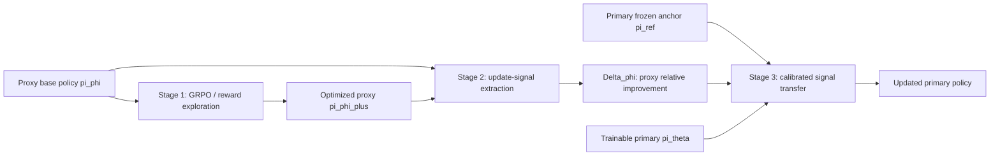
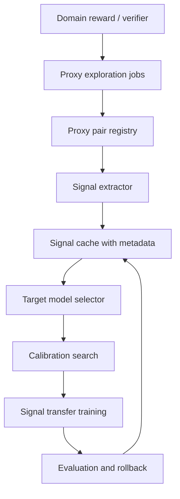

# Proxy Exploration and Reusable Guidance：把后训练的“探索”从主模型上拆出去

- **论文**：Proxy Exploration and Reusable Guidance: A Modular LLM Post-Training Paradigm via Proxy-Guided Update Signals
- **作者**：Daocheng Fu、Rong Wu、Yu Yang、Xuemeng Yang、Jianbiao Mei、Licheng Wen、Pinlong Cai、Yong Liu、Botian Shi、Yu Qiao
- **时间**：arXiv v1 提交于 2026-07-13 12:56:21 UTC
- **方向**：大模型后训练、On-Policy Distillation、弱到强信号迁移
- **原文**：https://arxiv.org/abs/2607.11505
- **官方代码页**：https://github.com/KnowledgeXLab/PUST
- **官方模型页**：https://huggingface.co/KnowledgeXLab/PUST-Experiments

### TL;DR

- 这篇论文提出 **PUST：Proxy-guided Update Signal Transfer**，核心问题是：后训练里的“高成本探索”是否一定要由最终要优化的主模型亲自完成？
- 作者把后训练拆成三步：**代理模型探索高奖励行为**、**抽取代理优化前后的相对更新信号**、**把这个方向性信号迁移到主模型上做分布对齐**。
- 方法不是让 Qwen3-8B 直接模仿 Qwen3-4B 或 Qwen3-1.7B 的最终分布，而是迁移从 `proxy base` 到 `proxy RL` 的 **log-ratio 改变量**，因此强调“方向”而不是“弱模型答案本身”。
- 实验覆盖 Qwen3-1.7B、4B、8B，在数学和代码域验证：4B proxy 的数学信号迁移到 8B 后，四个主表 benchmark 平均从 17.3 提到 47.5；代码域平均从 55.9 提到 60.5，LCB 从 16.7 提到 25.0。
- 可复用性实验显示，同一个 4B GRPO 信号只需 50 步 transfer，就能分别提升 1.7B、4B、8B；这比每个目标模型重新做 500 步 GRPO 更像“缓存训练经验”。
- 消融/敏感性集中在校准系数 `lambda`：4B -> 8B 时平均最好约 45.17，1.7B -> 8B 时最好约 37.19；过小 `lambda` 会过度跟随 proxy 信号甚至崩溃。
- 局限也很明确：论文主要报告 Qwen3 系列、数学/代码两个可验证域；官方 README 说明代码和数据将在两周后开放，当前可见的是论文、模型权重和方法说明。

### 这篇论文真正要拆开的耦合是什么？

- 当前后训练常见两类路径：
  - **奖励优化**：PPO、GRPO 等方法让当前策略采样、拿 reward、更新策略。
  - **分布匹配**：SFT、DPO、OPD 等方法更像把学生对齐到某个目标分布。

- 作者指出二者在 OPD 语境下仍然存在一个隐藏耦合：
  - 要得到好的 teacher 或目标分布，仍要先有人做 reward-oriented exploration。
  - 如果每个主模型、每个领域都自己探索，成本会随模型规模和领域数上升。
  - 如果直接模仿弱模型的最终分布，又会把弱模型的绝对能力上限一起带过来。

- PUST 的问题意识可以写成一个工程问题：

| 训练环节 | 传统做法 | PUST 想改变什么 |
|---|---|---|
| 探索 | 主模型或同规模 teacher 亲自做 rollout/reward 优化 | 交给较小 proxy 先做 |
| 信号形式 | 最终答案、偏好对、teacher 分布 | proxy 优化前后的相对变化 |
| 复用方式 | 每个模型/领域重新跑训练 | 缓存 proxy signal，再迁移 |
| 主要风险 | 成本高、强 teacher 难得、探索和对齐绑死 | proxy 信号噪声、尺度不匹配、过更新 |

### 原文论证顺序细读：为什么不是“又一种蒸馏”？

- **第一步：作者先把后训练的两件事分开命名**。
  - 奖励优化负责“发现什么方向更好”。
  - 分布匹配负责“如何快速吸收一个目标分布”。
  - 这个拆分很重要，因为很多后训练讨论会把算法名字直接当作整体流程，例如把 GRPO 看成训练、把 OPD 看成训练，却没有区分其中的探索成本和对齐成本。

- **第二步：作者用 OPD 的效率反过来指出 OPD 的依赖**。
  - OPD 之所以快，是因为它已经拿到了一个可对齐的目标。
  - 但目标从哪里来？通常仍来自一个经过奖励优化的 expert。
  - 因而 OPD 解决的是 alignment efficiency，不是 exploration cost 本身。

- **第三步：作者避免把 weak-to-strong 写成简单 teacher-student**。
  - 如果弱模型直接当 teacher，它的错误分布会被强模型模仿。
  - 如果弱模型只贡献“从旧策略到新策略的变化方向”，它就不再要求自己在绝对能力上超过强模型。
  - 这就是 PUST 与普通蒸馏的核心差异。

- **第四步：作者把复用性作为机制结果，而不是工程宣传**。
  - 一旦 signal 是 `pi_phi^+ / pi_phi` 的 log-ratio，它天然可以离开某一次训练 run。
  - signal 可以被保存，也可以用不同 `lambda` 作用到不同 primary。
  - 因此“异步生成、缓存、复用”不是额外系统设计，而是公式表达带来的训练接口变化。

### 为什么相对信号可能比绝对分布更能迁移？

- **绝对分布携带两个东西**：
  - proxy 的能力上限。
  - proxy 在 reward 作用下形成的改进方向。

- **PUST 要剥离第二个东西**：
  - `pi_phi^+` 本身可能弱。
  - 但 `pi_phi^+` 相对 `pi_phi` 增加了哪些 token 的概率、压低了哪些 token 的概率，可能对应可泛化的 reward preference。

- **以数学推理为例**：
  - 弱 proxy 未必能稳定做出复杂题。
  - 但 GRPO 可能让它更倾向于展开关键步骤、检查中间答案、避免短答。
  - 这些“方向”如果迁移给更强 primary，primary 可能利用自身更好的基础能力产生更高收益。

- **以代码任务为例**：
  - proxy 可能不如 primary 会写完整程序。
  - 但 reward 优化可能让它提高边界条件处理、函数签名遵循、测试样例覆盖等行为概率。
  - 这些 token-level 方向能否稳定转成强模型能力，正是 Table 2 想验证的点。

### 机制上的一个关键细节：冻结谁、更新谁？

| 符号 | 角色 | 是否更新 | 为什么 |
|---|---|---:|---|
| `pi_phi` | proxy base | 否 | 用作 proxy 改变量的起点 |
| `pi_phi_plus` | reward-optimized proxy | 否 | 用作 proxy 改变量的终点 |
| `pi_ref` | primary frozen anchor | 否 | 衡量 primary 已经偏离多少 |
| `pi_theta` | trainable primary | 是 | 真正吸收信号的模型 |

- 这个冻结关系防止了一个常见混乱：
  - PUST 不是同时训练 proxy 和 primary。
  - proxy exploration 完成后，signal 就固定下来。
  - transfer 阶段只训练 primary，且每一步都用 `Delta_theta` 检查 primary 是否已经走得太远。

- 这也解释了 `lambda` 为什么关键：
  - 若没有 anchor 惩罚，固定 signal 会不断推同一批 token。
  - 当 primary 已经吸收这个方向后，继续推就不再是学习，而是过拟合一个旧方向。
  - 因此 `lambda` 本质上是“吸收了多少就少推多少”的刹车。

### 作者论证路线：claim -> mechanism -> evidence -> boundary

| Claim | Mechanism | Evidence | Boundary |
|---|---|---|---|
| 后训练可以拆成探索和对齐两个阶段 | 把 GRPO 式 exploration 与 OPD 式 distribution matching 区分开 | 初步分析显示 OPD 变体约 20 步快速收敛，而 GRPO 需要更长探索 | 这说明 OPD 对齐高效，但仍依赖已有高质量目标分布 |
| 弱 proxy 的“相对改变量”可以帮助强 primary | 抽取 `Delta_phi = log pi_phi^+ - log pi_phi`，不蒸馏弱模型绝对分布 | 1.7B/4B proxy 信号都能提升 Qwen3-8B 数学成绩 | 只在 Qwen3 家族内跨规模验证，尚未证明跨架构稳定 |
| 信号可以复用 | proxy pair 保存优化前后分布差，transfer 只需少量步骤 | 4B GRPO 500 步得到的信号，迁移到 1.7B/4B/8B 各 50 步都有提升 | 缓存的是训练信号，不等同于任意新任务无需探索 |
| 迁移必须校准 | 用 primary 相对 frozen anchor 的 log-ratio 作惩罚项 | `lambda=0` 或过小设置导致性能崩溃，较保守系数更稳 | 当前 `lambda` 是常数，未做 trajectory-adaptive calibration |
| PUST 是模块化范式 | proxy exploration、signal extraction、signal transfer 解耦 | GitHub/HF 页面提供方法、模型权重和 GRPO checkpoints | 官方 README 标注代码和数据尚未完全开放 |

### 方法机制：PUST 的三阶段管线



- **Stage 1：Proxy Exploration**
  - 选择一个较小 proxy 模型，例如 Qwen3-1.7B 或 Qwen3-4B。
  - 对 proxy 使用 GRPO，在数学域用 DeepMath-103K，在代码域用 Eurus-RL-Code。
  - 得到优化后的 `pi_phi^+`，它不是最终要部署的强模型，而是一个“探索器”。

- **Stage 2：Update-Signal Extraction**
  - 标准蒸馏会让 primary 模仿 `pi_phi^+`。
  - PUST 不这样做，因为弱 proxy 的绝对分布可能不如 primary。
  - 它抽取的是 proxy 经过 reward optimization 后，相对自己初始状态发生了什么变化。

- **Stage 3：Signal Transfer**
  - 将这个相对变化应用到 primary 的策略空间。
  - primary 的 frozen anchor `pi_ref` 用来衡量 primary 已经吸收了多少更新。
  - `lambda` 负责抑制重复放大同一个固定信号。

### 关键公式：不是模仿弱模型，而是迁移改变量

#### 1. Proxy 相对更新信号

```text
Delta_phi(a | s_t)
  = log pi_phi_plus(a | s_t) - log pi_phi(a | s_t)
  = log [ pi_phi_plus(a | s_t) / pi_phi(a | s_t) ]
```

- `s_t`：解码到第 `t` 步时的 token-level state。
- `a`：词表 `V` 中的一个候选 token。
- `pi_phi`：proxy 初始策略。
- `pi_phi_plus`：proxy 经过 reward optimization 后的策略。
- `Delta_phi > 0`：reward 优化让 proxy 更倾向于选这个 token。
- `Delta_phi < 0`：reward 优化压低了这个 token。

这一步的意义在于：PUST 不问“弱模型最后会怎么答”，而问“弱模型在奖励驱动下学会朝哪个方向移动”。

#### 2. Primary 已吸收更新的幅度

```text
Delta_theta(a | s_t)
  = log [ pi_theta(a | s_t) / pi_ref(a | s_t) ]
```

- `pi_ref`：primary 的 frozen anchor。
- `pi_theta`：正在训练的 primary。
- `Delta_theta` 越大，说明 primary 已经偏离 anchor，继续沿同一方向推可能过度。

#### 3. 带校准的 token-level utility

```text
r_lambda(a | s_t)
  = Delta_phi(a | s_t) - lambda * Delta_theta(a | s_t)
```

- `lambda > 0`：校准系数。
- 小 `lambda`：更激进地跟随 proxy 信号。
- 大 `lambda`：更保守地靠近 anchor，减少过更新。

#### 4. Transfer objective

```text
J_proxy(theta)
  = E_{s_t ~ D} [
      sum_{a in V} pi_theta(a | s_t)
      * (Delta_phi(a | s_t)
         - lambda * log(pi_theta(a | s_t) / pi_ref(a | s_t)))
    ]
```

- 优化时，`pi_phi`、`pi_phi_plus`、`pi_ref` 都冻结。
- 只有 `pi_theta` 更新。
- 因而训练更像“把 proxy 发现的方向性奖励信号投影到 primary 的 policy space”。

### 算法流程：PUST 可以怎样落到训练脚本里？

```text
Input:
  proxy base policy pi_phi
  primary base policy pi_ref
  reward function R
  training states D
  calibration coefficient lambda

State:
  pi_phi_plus = proxy after exploration
  pi_theta = trainable copy initialized from pi_ref
  cached_signal = empty

Loop 1: proxy exploration
  for step in GRPO_steps:
    sample responses from pi_phi
    score responses with R
    update proxy policy
  set pi_phi_plus = optimized proxy

Loop 2: signal extraction
  for each state s_t in D:
    for each token a in vocabulary V:
      Delta_phi[a, s_t] =
        log pi_phi_plus(a | s_t) - log pi_phi(a | s_t)
  cache Delta_phi

Loop 3: calibrated signal transfer
  for step in transfer_steps:
    sample or enumerate states s_t
    compute Delta_theta =
      log pi_theta(a | s_t) - log pi_ref(a | s_t)
    compute r_lambda =
      Delta_phi - lambda * Delta_theta
    update only pi_theta to maximize expected r_lambda

Output:
  updated primary policy pi_theta

Failure boundary:
  if lambda is too small:
    fixed proxy signal may be over-applied
  if proxy-primary gap is too large:
    signal quality may drop and needs stronger calibration
```

### 实验设置：模型、数据和指标

| 维度 | 设置 |
|---|---|
| 模型族 | Qwen3-1.7B、Qwen3-4B、Qwen3-8B，均为 non-thinking mode |
| 框架 | verl；官方 README 也说明代码基于 G-OPD 与 verl |
| 硬件 | 8 x NVIDIA A100 80GB |
| 数学 proxy exploration | DeepMath-103K，GRPO，主文使用 500 steps |
| 代码 proxy exploration | Eurus-RL-Code，GRPO，300 steps |
| 数学评测 | AIME 2024、AIME 2025、HMMT 2025 Feb/Nov；附录还有 AIME 2026、CMIMC、SMT、HMMT 2026 |
| 代码评测 | HumanEval+、MBPP+、LiveCodeBench |
| 数学指标 | Mean@16 |
| 代码指标 | 主文表格写 Mean@16，附录说明代码按既有脚本报告 Mean@8；这里保留论文表格数字并提示这个表述差异 |

### 主结果一：弱 proxy 信号可以提升 8B primary

#### 数学域主表

| Model | AIME24 | AIME25 | HMMT25 Feb | HMMT25 Nov | Average |
|---|---:|---:|---:|---:|---:|
| Qwen3-1.7B Base | 14.2 | 12.3 | 4.4 | 4.8 | 8.9 |
| Qwen3-1.7B Math RL | 35.6 | 31.7 | 19.6 | 15.2 | 25.5 |
| Qwen3-4B Base | 23.2 | 22.1 | 10.6 | 7.9 | 16.0 |
| Qwen3-4B Math RL | 58.8 | 55.8 | 33.1 | 38.3 | 46.5 |
| Qwen3-8B Base | 24.4 | 22.5 | 12.3 | 10.0 | 17.3 |
| PUST 1.7B -> 8B | 54.4 | 40.2 | 22.1 | 31.3 | 37.2 |
| PUST 4B -> 8B | 62.5 | 52.7 | 34.2 | 40.4 | 47.5 |

- **最强证据点**：
  - 4B proxy signal 迁移到 8B 后，平均分从 17.3 到 47.5，提升 30.2。
  - 1.7B proxy signal 也能把 8B 平均分提到 37.2，说明弱 proxy 并非完全无用。
  - 在 AIME24 和 HMMT25 Nov 上，4B -> 8B 的提升幅度分别为 +38.1 和 +30.4，甚至超过 4B 自身 RL 的部分增益。

- **这支持什么 claim**：
  - 不是只有强 teacher 的绝对分布才有价值。
  - proxy 的“被 reward 推动过的方向”可以成为强模型的训练信号。

- **这不能证明什么**：
  - 不能证明任意弱模型都能指导任意强模型。
  - 不能证明跨 tokenizer、跨架构、跨任务域都能无损迁移。

#### 数学结果的细读：哪些数字最能说明“方向”有效？

- **1.7B -> 8B 的意义不只是提升幅度**：
  - Qwen3-1.7B Math RL 自己的平均分是 25.5。
  - 但它的 signal 迁移到 Qwen3-8B 后平均分达到 37.2。
  - 这说明迁移的不是 1.7B 的绝对答案分布；否则强模型很难超过弱 teacher 自己的水平这么多。

- **4B -> 8B 的意义在于信号质量更高**：
  - 4B Math RL 平均分 46.5。
  - 4B -> 8B 的 PUST 平均分 47.5。
  - 这不是简单复制 4B，因为 AIME24 和 HMMT25 Nov 上的 8B 表现还超过了 4B RL。

- **HMMT 与 AIME 的分布差异也值得注意**：
  - AIME24 上 4B -> 8B 达到 62.5，提升 +38.1。
  - HMMT25 Feb 上达到 34.2，提升 +21.9。
  - 不同 benchmark 上增益不均，说明 signal 对题型、数据分布和基础模型能力仍然敏感。

- **研究结论应当保守表述**：
  - 可以说 PUST 在这些数学 benchmark 上证明了 proxy relative signal 的可迁移性。
  - 不应说它已经证明弱模型可普遍监督强模型。
  - 更不应把它理解成省掉 reward exploration；它省的是重复在每个 primary 上做 exploration。

#### 代码域主表

| Model | HumanEval+ | MBPP+ | LCB | Average |
|---|---:|---:|---:|---:|
| Qwen3-4B Base | 79.4 | 64.1 | 18.0 | 53.8 |
| Qwen3-4B Code RL | 82.5 | 68.7 | 19.0 | 56.7 |
| Qwen3-8B Base | 80.5 | 70.6 | 16.7 | 55.9 |
| PUST 4B -> 8B | 83.1 | 73.5 | 25.0 | 60.5 |

- **代码域更克制**：
  - 平均提升为 +4.6，不像数学域那样巨大。
  - LCB 从 16.7 到 25.0，是最明显的增益。
  - HumanEval+ 与 MBPP+ 基线已经较高，提升空间较小。

- **需要小心的地方**：
  - 表格脚注说明 Qwen3-8B 的 LCB 基线低于 Qwen3-4B 是模型本身表现差异，作者沿用了既有评测协议。
  - 因此 LCB 上的大幅提升很有价值，但也应理解为在特定评测协议下的现象。

#### 为什么代码域增益更小？

- 可能原因一：**代码基线已经高**。
  - HumanEval+ 的 8B base 已经是 80.5。
  - MBPP+ 的 8B base 已经是 70.6。
  - 在这些相对饱和的指标上，PUST 很难像数学域那样释放大幅空间。

- 可能原因二：**代码 reward 的局部性更强**。
  - 数学推理的 reward 常能鼓励完整解题轨迹。
  - 代码题的 reward 常来自测试通过与否，很多 token 改变只有在完整程序层面才体现价值。
  - token-level relative signal 可能更难稳定捕捉“哪一小段代码风格带来通过率提升”。

- 可能原因三：**LCB 更能暴露训练信号**。
  - LCB 基线低，提升空间大。
  - PUST 在 LCB 上 +8.3，是代码表里最强证据。
  - 这提示 PUST 可能更适合仍有明显能力缺口、且 reward 能区分行为质量的设置。

### 主结果二：同一个 proxy signal 可以复用

| Signal source / target | AIME24 | AIME25 | HMMT25 Feb | HMMT25 Nov | Avg | Steps |
|---|---:|---:|---:|---:|---:|---:|
| Qwen3-4B Math RL | 58.8 | 55.8 | 33.1 | 38.3 | 46.5 | 500 |
| PUST 4B -> 1.7B | 36.5 | 30.0 | 18.3 | 17.5 | 25.6 | 50 |
| PUST 4B -> 4B | 60.7 | 55.0 | 32.4 | 37.9 | 46.5 | 50 |
| PUST 4B -> 8B | 62.5 | 52.7 | 34.2 | 40.4 | 47.5 | 50 |

- **作者要强调的不是“50 步一定等价于 500 步”**。
- 更准确的解释是：
  - 500 步 GRPO 负责探索并形成 signal。
  - 后续每个 target 不再重新做完整探索，而是用 50 步吸收信号。
  - 当多个 primary 或多个训练配置需要同一类能力时，signal 可以摊销探索成本。

### 主结果三：信号可以多跳，但会漂移

| Transfer path | AIME24 | AIME25 | HMMT25 Feb | HMMT25 Nov | Avg |
|---|---:|---:|---:|---:|---:|
| Qwen3-8B Base | 24.4 | 22.5 | 12.3 | 10.0 | 17.3 |
| PUST 1.7B -> 8B | 50.8 | 42.1 | 22.9 | 30.6 | 36.6 |
| PUST 4B -> 8B | 62.5 | 52.7 | 34.2 | 40.4 | 47.4 |
| PUST 4B -> 1.7B -> 8B | 60.6 | 49.6 | 28.5 | 36.7 | 43.9 |

- **多跳结论**：
  - 4B -> 1.7B -> 8B 仍能把 8B 平均分从 17.3 提到 43.9。
  - 但它低于直接 4B -> 8B 的 47.4。

- **论文里的边界判断**：
  - 信号经过中间模型会出现 drift 或 deviation。
  - 多跳传递证明了“方向性信号不是一次性的”，但也说明每一跳都可能损失信息。

### 消融与失败：`lambda` 不是装饰项

| Transfer | lambda | Avg |
|---|---:|---:|
| 4B -> 8B | 0 | 0 |
| 4B -> 8B | 0.5 | 30.85 |
| 4B -> 8B | 0.75 | 44.14 |
| 4B -> 8B | 1.0 | 44.92 |
| 4B -> 8B | 1.1 | 45.17 |
| 4B -> 8B | 1.5 | 38.74 |
| 1.7B -> 8B | 0.5 | 0 |
| 1.7B -> 8B | 1.0 | 27.51 |
| 1.7B -> 8B | 1.25 | 34.67 |
| 1.7B -> 8B | 1.5 | 37.19 |
| 1.7B -> 8B | 1.75 | 35.70 |
| 1.7B -> 8B | 2.0 | 33.61 |

- **失败案例很清楚**：
  - `lambda=0` 的 4B -> 8B 直接崩到 0。
  - `lambda=0.5` 的 1.7B -> 8B 也直接崩到 0。

- **机制解释**：
  - proxy signal 是固定的。
  - 如果 primary 每一步都无限放大同一个方向，就会过更新。
  - proxy 越弱、proxy-primary gap 越大，越需要更强校准。

- **这个消融支撑的 claim**：
  - PUST 的贡献不只是“拿弱模型信号蒸馏一下”。
  - Anchor-based calibration 是弱到强迁移能稳定工作的关键。

### 失败边界展开：过更新为什么会让结果归零？

- **直观解释**：
  - proxy signal 是从一个较小模型的训练轨迹中提取的。
  - 它告诉 primary：“这些 token 在 proxy 的 reward 训练里变得更重要。”
  - 但 primary 的原始分布可能已经比 proxy 更合理，或者在某些状态上已经吸收了类似方向。

- **当 `lambda` 太小**：
  - primary 几乎不惩罚自己偏离 anchor。
  - 固定 `Delta_phi` 被反复利用。
  - 一开始可能提升，但随后会把分布推得过尖、过偏或离开原有能力区域。

- **为什么 1.7B -> 8B 需要更大 `lambda`**：
  - 1.7B 与 8B 的能力差距更大。
  - 弱 proxy 信号噪声更高，且更可能包含弱模型特有的错误偏好。
  - 因此更保守的校准能过滤掉一部分过强迁移。

- **这给后续研究的启示**：
  - signal transfer 不应只看 proxy 分数。
  - 更应估计 proxy-primary distribution gap。
  - 一个实用系统可能需要先做小规模 sweep，或用验证集动态调节 `lambda`。

### 如果把 PUST 看成系统，它需要哪些模块？



- **Proxy exploration jobs**
  - 负责在可验证 reward 上训练 proxy。
  - 需要记录数据、reward、步数、模型版本和训练曲线。

- **Signal cache**
  - 不只是保存 checkpoint。
  - 还应保存 `Delta_phi` 的生成方式、适用 tokenization、domain 标签和推荐校准范围。

- **Calibration search**
  - 对每个 primary 不应默认同一个 `lambda`。
  - 可以用小验证集测试不同 transfer strength。
  - 也可以根据 KL、entropy、reward slope 自动调参。

- **Evaluation and rollback**
  - 因为过更新会崩溃，transfer 后必须有回滚机制。
  - 数学和代码域可用 rule-based verifier；安全或偏好域需要更谨慎的评价协议。

### 与近期后训练趋势的关系

- **与 RLVR / GRPO 热潮的关系**
  - RLVR 强调可验证 reward 下的直接强化学习。
  - PUST 不否认 RLVR，而是把 RLVR 降级为可复用 signal 的生产环节。
  - 如果一个领域会被多个模型反复训练，这种拆分尤其有意义。

- **与 OPD 的关系**
  - OPD 追求用在线分布匹配减少训练步数。
  - PUST 借用这种“分布匹配更高效”的观察，但把目标从 teacher distribution 换成 induced update target。
  - 它的问题不是“怎样更像 teacher”，而是“怎样吸收 reward-induced direction”。

- **与模型蒸馏的关系**
  - 普通蒸馏容易把 teacher 的知识和偏差一起蒸过去。
  - PUST 希望只拿 teacher pair 的差分。
  - 这让蒸馏对象从“模型输出”变成“优化轨迹”。

- **与对齐安全的关系**
  - 如果安全 reward 可定义，PUST 可能用小模型探索拒绝/合规方向，再迁移给强模型。
  - 但安全域的问题是 reward 更易被 reward hacking，且 false positive / false negative 成本更高。
  - 因此 PUST 在安全域应用前，需要更强的红队评估和分布外测试。

### Figure/Table 证据逐项解读

| 证据 | 支撑什么 | 不能证明什么 |
|---|---|---|
| Figure 1 pipeline | serial / parallel / proxy asynchronous 三种后训练组织方式差异 | 不能说明 proxy pipeline 在所有领域更便宜 |
| Figure 2 preliminary analysis | OPD 类分布匹配收敛快，但仍需要先有探索来的 teacher | 不能替代最终 PUST 主实验 |
| Figure 3 method | PUST 的三段式：抽取 relative signal，再 anchor-calibrated transfer | 不能说明固定 `lambda` 已经最优 |
| Table 1 math | 弱 proxy 信号能显著提升 Qwen3-8B 数学表现 | 只覆盖 Qwen3 family 和指定 benchmark |
| Table 2 code | 代码域也有提升，尤其 LCB | 增益小于数学域，且表格/附录指标表述需留意 |
| Table 3 reusability | 一个 4B signal 可在 50 步内迁移到多种 target | 尚未给出跨领域缓存库的大规模成本核算 |
| Table 4 transitivity | 多跳信号仍有效但弱于直接 transfer | 多跳过程中漂移不可忽略 |
| Table 8/9 lambda | 校准系数决定稳定性，过小会崩 | 只 sweep 常数 `lambda`，未研究动态校准 |
| Figure 8/9 proxy training | proxy GRPO 梯度范数趋稳、响应长度趋于饱和 | 不能证明所有 proxy 都能学到高质量信号 |

### 与 OPD、GRPO、Direct-OPD 的位置关系

- **相对 GRPO**
  - GRPO 直接让目标模型探索并优化。
  - PUST 用 GRPO 训练 proxy expert，但不要求每个 primary 都做完整探索。

- **相对 OPD**
  - OPD 强调在线分布匹配，让 student 对齐 teacher 分布。
  - PUST 认可分布匹配的训练效率，但认为探索信号不该与目标模型绑定。

- **相对 Direct-OPD**
  - Direct-OPD 已经关注从弱模型 pair 转移 RL-induced policy shift。
  - PUST 更强调 proxy-guided extraction、信号缓存复用、以及不同 primary 上的 calibrated transfer。

- **相对弱到强监督**
  - 普通弱到强监督常被理解为弱标注、弱模型输出或 preference 被强模型吸收。
  - PUST 更像“弱模型优化轨迹的差分”被强模型吸收。

### 官方代码和权重状态

- GitHub 仓库 `KnowledgeXLab/PUST` 创建于 2026-07-13，2026-07-14 有 push。
- README 提供：
  - 方法公式。
  - 主结果图片。
  - Hugging Face 模型权重入口。
  - 依赖 G-OPD 与 verl 的说明。
- README 同时说明：
  - **Code release：代码和数据将在两周后开放**。
  - 因此当前可复现边界是：论文 TeX、README、表格、HF 权重可核对；完整训练脚本尚不能审计。
- Hugging Face 页面可见：
  - `Qwen3-1.7B-Math-GRPO-Steps500`
  - `Qwen3-1.7B-Math-GRPO-Steps800`
  - `Qwen3-8B-Math-GRPO-Steps400`
  - license 标记为 MIT。

### 可复现性清单：现在能查什么，不能查什么？

| 项目 | 当前状态 | 对可信度的影响 |
|---|---|---|
| arXiv 论文 | 可读，含 HTML、PDF、TeX source | 公式、表格、实验设置可核对 |
| GitHub README | 可读，含公式和结果图 | 方法说明与论文一致 |
| Hugging Face 权重 | 可见多个 GRPO checkpoint | 支持作者确实发布了部分训练产物 |
| 完整训练代码 | README 说两周后开放 | 暂不能复现训练 pipeline |
| 数据处理脚本 | 当前未见完整开放 | DeepMath/Eurus 过滤细节需等待 |
| Eval scripts | 论文说沿用既有协议 | 不能完全排除实现差异 |

- 因此这篇文章适合做 **机制与结果解读**。
- 但如果要做工程采用，应该等代码释放后再检查：
  - signal 是否以 logits、delta logits、checkpoint pair 还是在线计算方式保存。
  - transfer 是否需要同 tokenizer。
  - 显存和通信成本是否真的低于直接主模型 GRPO。
  - `lambda` sweep 的实际开销是否会抵消部分节省。

### 反例与替代解释

- **替代解释一：Qwen3 family 内部太相似**
  - 1.7B、4B、8B 属于同一模型族。
  - 同族模型的 token distribution 和训练偏好可能高度对齐。
  - 因此跨规模成功不等同于跨家族成功。

- **替代解释二：数学数据本来适合弱到强**
  - 数学题有明确正确性 reward。
  - 小模型通过 GRPO 学到的“多写步骤、按格式推导、避免短路”可能对大模型很通用。
  - 在主观偏好或安全拒答中，reward 方向可能更不稳定。

- **替代解释三：transfer 本身也在做有效训练**
  - 50 步 transfer 并不是零成本。
  - 它仍然让 primary 在数据分布上更新。
  - 对照实验需要进一步量化：同样 50 步普通 OPD、SFT 或小步 GRPO 与 PUST 的差距。

- **替代解释四：proxy signal 质量高度依赖探索收敛**
  - 作者在附录强调 proxy experts 训练到收敛，梯度范数约稳定在 0.03。
  - 如果 proxy exploration 早停，signal 可能更噪。
  - 因而“低成本 proxy”并不等于“随便训一下 proxy”。

### 研究者视角：这篇文章为什么值得注意？

- **它把后训练的“经验”对象化了**：
  - 传统上，经验存在于 trained checkpoint、reward model 或数据集里。
  - PUST 试图把经验表示为 policy pair 的 log-ratio direction。
  - 这让经验有可能被缓存、迁移、调强度、跨目标模型复用。

- **它提供了一个介于 RL 和 distillation 之间的接口**：
  - RL 负责发现方向。
  - Distribution matching 负责高效吸收。
  - Calibration 负责不让强模型被弱方向拖过头。

- **它让“弱到强”问题更细粒度**：
  - 弱模型的答案可能不如强模型。
  - 但弱模型从 base 到 RL 的变化，可能仍携带有用的 reward gradient proxy。
  - 这比“弱者教强者答案”更合理，也更符合 post-training 的机制直觉。

### 证据边界与局限

- **模型族边界**
  - 实验主要在 Qwen3 family 内做。
  - 同 tokenizer、相近架构、相近预训练背景，都会降低迁移难度。
  - 跨 Llama、DeepSeek、Qwen 或闭源模型的信号迁移仍是开放问题。

- **任务域边界**
  - 数学域增益很强，代码域增益更温和。
  - 两者都有可验证 reward，适合 GRPO。
  - 开放式写作、偏好对齐、安全拒答等 reward 更模糊的域是否适用，论文没有证明。

- **成本边界**
  - PUST 能摊销 proxy exploration，但 proxy 本身仍要训练到收敛。
  - 如果只训练一个 primary、一个领域，收益可能不如多模型、多配置、多领域场景明显。

- **校准边界**
  - 常数 `lambda` 是一个可用 baseline。
  - 但不同 prompt、不同 token、不同 entropy 区域可能需要不同 transfer strength。
  - 作者也把 trajectory-adaptive calibration 作为后续方向。

- **复现边界**
  - 论文和模型页可核实主要数字与权重存在。
  - 完整代码/数据尚未公开，不能独立检查训练实现、采样细节和所有 eval script。

### 我会怎样继续追问这条线？

- **第一问：signal 是否能跨 tokenizer？**
  - 当前公式依赖 token-level `a` 和共享词表 `V`。
  - 如果 proxy 和 primary tokenization 不同，直接 log-ratio 迁移会变难。
  - 可能需要把 signal 提升到 span、semantic unit 或 hidden-state distribution 层。

- **第二问：能否做 signal library？**
  - 如果 proxy signals 可缓存，下一步自然是按领域、能力、reward 类型组织信号库。
  - 但信号库需要元数据：
    - proxy 模型。
    - reward function。
    - 数据分布。
    - 适用 primary 范围。
    - 推荐 `lambda`。

- **第三问：安全对齐能否使用这种方向信号？**
  - 安全任务里，弱模型可能学到“拒绝危险请求”的方向。
  - 强模型是否能吸收这个方向，同时不牺牲过多 helpfulness，是一个值得测的问题。
  - 关键难点是 reward 不再像数学/代码那样可用 rule-based correctness。

- **第四问：如何自动选择 `lambda`？**
  - 论文证明过小会崩，过大又可能吸收不足。
  - 一个自然方案是让 `lambda` 依赖：
    - proxy-primary KL。
    - local entropy。
    - validation reward slope。
    - signal agreement across proxies。

- **第五问：PUST 与持续后训练如何结合？**
  - 如果每个领域都能产出 signal，持续后训练就变成信号调度问题。
  - 需要避免：
    - 多 signal 冲突。
    - 旧 signal 过期。
    - 弱 proxy 在新领域给出错误方向。

### 结论

- PUST 的价值不在于又提出一个后训练缩写，而在于把后训练中最贵的部分重新命名为 **可探索、可抽取、可缓存、可迁移的 update signal**。
- 它把 GRPO 的探索能力和 OPD 的分布匹配效率分离开来，让弱 proxy 不必作为 teacher 提供最终答案，只要提供“被 reward 推动后的方向”。
- 目前最强证据来自 Qwen3 数学域：4B -> 8B 平均从 17.3 到 47.5，且同一 4B signal 能在 50 步 transfer 中提升多个 target。
- 最重要的失败证据同样值得保留：`lambda` 过小会让 transfer 崩溃，说明 proxy signal 不能无脑放大。
- 对后训练研究而言，这篇论文提出的核心范式是：未来的训练资产可能不只是数据集、reward model 或 checkpoint，也可能是一组经过校准的、可复用的策略改变量。
