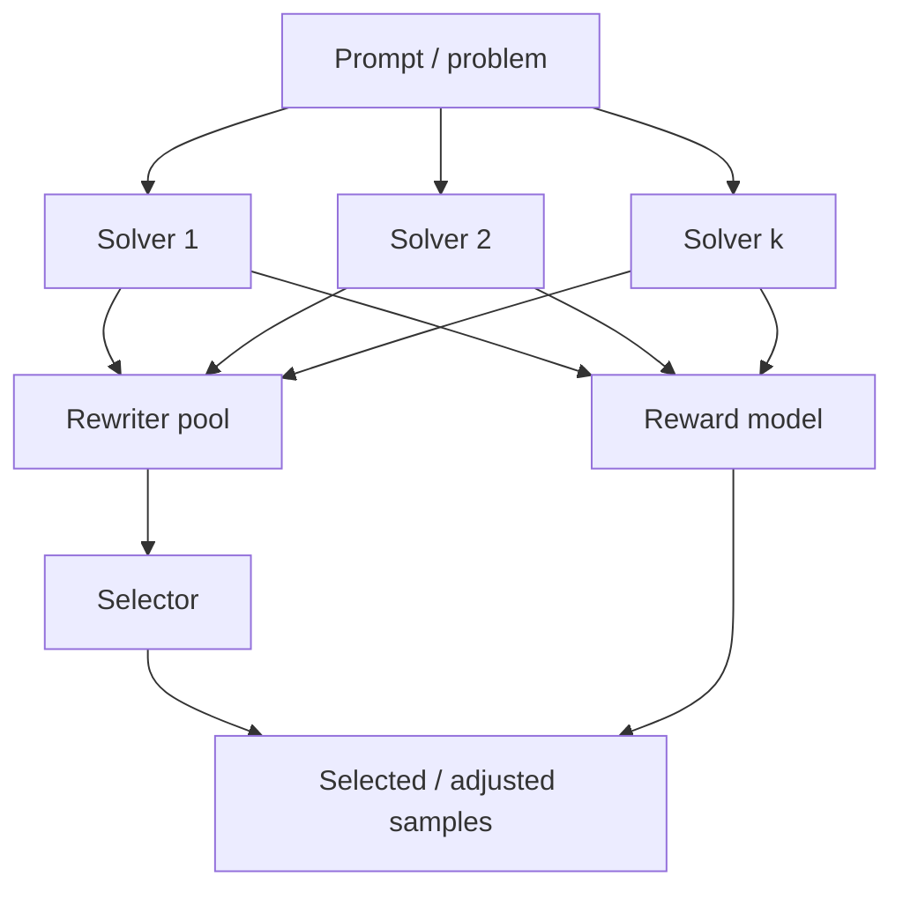

# Vime：把 vLLM 放进后训练闭环，而不只是当成推理后端

## 元信息

- **项目**：[vllm-project/vime](https://github.com/vllm-project/vime)
- **类别**：大模型后训练 / RL scaling / vLLM 生态
- **本轮日期锚点**：仓库 `pushed_at=2026-07-13T05:57:24Z`；PR [#329](https://github.com/vllm-project/vime/pull/329) 于 2026-07-13 合并，修复 pipeline parallel 下非 colocated NCCL 权重同步挂起。
- **深读材料**：项目 README、Quick Start、Usage、delta weight sync、external rollout engines、fully async、multi-agent、coding-agent RL 示例、`train.py`、`train_async.py`、`vime/rollout/vllm_rollout.py`、`vime/utils/arguments.py`、PR #329 说明与文件变更。
- **本文边界**：本文基于公开代码和文档解读系统设计；没有复现实机 H200/GB200 集群训练，也不把 PR 描述中的内部集成结果扩展为通用 benchmark。

## TL;DR

- **Vime 做什么**：它是 vLLM 社区维护的 LLM 后训练框架，把 slime/Megatron 训练栈与 vLLM rollout 服务接成闭环，目标是让 RL 后训练里的“采样、打分、训练、同步权重、再采样”成为可扩展基础设施。
- **它怎么做**：训练侧由 Megatron actor/critic 消费 rollout 数据；推理侧由 vLLM engines 和 vllm-router 产生样本；中间用 Ray placement groups、Data Buffer、自定义 generate/reward hook、以及 full/delta 权重同步连接。
- **关键约束**：每轮 rollout 产出的样本数必须和训练消费样本数对齐，即 `rollout_batch_size × n_samples_per_prompt = global_batch_size × num_steps_per_rollout`；否则 on-policy 训练会在数据账本上失衡。
- **当前周更新证据**：2026-07-13 合并的 PR #329 修复了 `TP=1, PP>1` 时多个 pipeline stage 同时初始化 vLLM 接收 communicator 导致 NCCL 双方等待不同 group 的问题，并新增非 colocated PP E2E smoke test。
- **最值得关注的设计**：Vime 不只暴露普通文本生成，还显式支持多轮 Agent、coding-agent sandbox、tool observation loss mask、fan-out 轨迹、external rollout engines、disk/delta 权重同步和 fully async rollout。
- **局限**：delta weight sync 文档仍标注“尚未充分验证，默认用 full”；外部 engine 的生命周期不由 Vime 恢复；colocated 模式下 delta 没有收益；复杂 Agent rollout 的 token provenance 维护成本很高。


## 为什么 Vime 值得单独看？

### 它不是“又一个 RLHF repo”，而是在回答后训练系统的基础设施问题

- 许多后训练框架把重点放在算法名上：
  - GRPO、PPO、REINFORCE++、GSPO、CISPO。
  - reward model、verifier、KL、clip、advantage normalization。
  - 单机脚本、若干模型示例、若干数据集入口。

- Vime 更像在拆一个工程问题：
  - **训练引擎**：Megatron 负责 actor/critic、大模型并行、checkpoint、loss。
  - **rollout 引擎**：vLLM 负责高吞吐采样，router 负责 engine 分发。
  - **连接层**：Ray 管 GPU 资源，Vime 管样本、权重同步、hook 和状态。
  - **扩展层**：自定义生成函数、自定义 reward、多轮工具调用、外部 inference 集群。

- 这使它对研究者的意义不只是“能跑 Qwen3-4B 的 GRPO”：
  - 它把后训练流程里的系统边界暴露出来。
  - 它把“采样服务”和“训练进程”从同一个 Python 调用栈里拆开。
  - 它把 Agent 轨迹的 token 归因、loss mask、sandbox 评测放进训练数据结构。

### Vime 对 vLLM 生态的位置判断

| 维度 | 常见后训练框架的关注点 | Vime 的关注点 |
| --- | --- | --- |
| 推理后端 | 调用 inference server 或内部 rollout worker | 默认用 vLLM + vllm-router，并透传大量 EngineArgs |
| 训练后端 | 自带 Trainer、FSDP、DeepSpeed 或 Megatron | 以 Megatron 为主，强调大模型并行和 checkpoint 格式 |
| 采样形态 | 单轮 prompt-response | 单轮、多轮、工具调用、Agent sandbox、fan-out 轨迹 |
| 权重同步 | 通常隐含在同进程或简单 broadcast | full/delta、NCCL/disk、external engine、PP 修复 |
| 可靠性边界 | 多靠脚本约定 | 用参数校验、单元测试、E2E smoke test 和显式约束暴露 |

### 文章里的核心判断

- **Vime 的真正中心不是某个 RL 算法**。
- **中心是后训练的闭环账本**：
  - 哪些样本在第几轮产生？
  - 哪些 token 可被训练？
  - reward 是逐样本、逐 group，还是外部评测？
  - 训练权重何时同步到 rollout engine？
  - 同步失败时会不会让下轮采样使用过期 actor？
  - Agent 多分支轨迹如何避免把环境 token 当作模型 token 反传？

## 训练闭环：从 rollout 到 optimizer.step

### 主循环长什么样？

`train.py` 的同步路径可以概括为：

```text
Input:
  args, placement groups, rollout manager, actor model, optional critic model

Loop rollout_id in [start_rollout_id, num_rollout):
  1. rollout_manager.generate(rollout_id)
  2. actor/critic async_train(rollout_data)
  3. periodic save
  4. offload/onload when colocated
  5. actor_model.update_weights()
  6. periodic eval

Output:
  checkpoints, rollout logs, updated vLLM engines, eval metrics
```

- 这里最重要的细节不是 `async_train` 这个名字。
- 关键是 **每轮训练后立即把 actor 权重推给 rollout manager**。
- 后训练里的 rollout 不是普通数据加载器：
  - 它生产的数据取决于当前策略。
  - 如果权重同步出错，下一批样本就可能来自旧策略。
  - 如果训练与采样异步重叠，还要显式处理 off-policy 程度。

### 样本数约束为什么重要？

Vime 文档给出一个硬约束：

```math
rollout\_batch\_size \times n\_samples\_per\_prompt
=
global\_batch\_size \times num\_steps\_per\_rollout
```

变量解释：

| 变量 | 含义 | 系统含义 |
| --- | --- | --- |
| `rollout_batch_size` | 每轮采样多少个 prompt | Data Buffer 向 rollout 端取多少组任务 |
| `n_samples_per_prompt` | 每个 prompt 采多少个回答 | GRPO 等组内相对优势的基础 |
| `global_batch_size` | 一次参数更新消费多少样本 | Megatron actor 的训练 batch |
| `num_steps_per_rollout` | 当前 rollout 数据被消费多少个 optimizer step | on-policy 程度控制 |

这个公式背后的判断是：

- 如果左边大于右边：
  - rollout 产生的数据没有被当前训练轮消费完。
  - 剩余样本要么被浪费，要么进入下一轮造成策略版本混杂。

- 如果左边小于右边：
  - 训练端需要额外样本。
  - 最危险的补法是重复旧样本，因为 advantage 和 logprob 都带有策略时刻。

- 如果两边相等：
  - 每个 rollout round 形成一个可审计的 batch 账本。
  - `rollout_id`、样本 index、reward、loss mask 和 update step 可以对齐。

### 同步路径与异步路径的差异

| 路径 | 文件入口 | 适用场景 | 主要风险 |
| --- | --- | --- | --- |
| 同步训练 | `train.py` | 默认、容易验证、每轮采样后训练 | 慢样本会拖住整轮 |
| 异步训练 | `train_async.py` | 采样和训练可重叠 | 权重更新不能插在生成中间 |
| fully async rollout | `vime.rollout.fully_async_rollout` | 维持常驻 in-flight 生成池 | 排序、ABORTED 样本回流、评估模式冲突 |

`train_async.py` 里一个很有意思的保护是：

- 在达到 `update_weights_interval` 时，先等待当前 next rollout future。
- 然后再执行 `actor_model.update_weights()`。
- 这说明异步不是无限并行，而是围绕“何时允许换 actor 权重”建立边界。

## vLLM router：为什么它不是普通 HTTP 采样

### Vime 如何把 vLLM 参数接进来？

Vime 的 `vime/backends/vllm_utils/arguments.py` 做了一个工程上很实用的事：

- 它调用 vLLM 的 `AsyncEngineArgs.add_cli_args`。
- 对大多数 engine flags 自动加 `--vllm-` 前缀。
- 同时跳过一些必须由 Vime 自己控制的字段：
  - `model`
  - `tensor_parallel_size`
  - `host`
  - `port`
  - `seed`
  - 若干分布式 executor 相关参数。

这意味着：

- 用户可以沿用 vLLM 的大量推理参数。
- Vime 仍保留训练闭环需要的资源调度权。
- `--rollout-num-gpus-per-engine` 被解释为 vLLM engine 的 TP size。
- router 默认策略是 `consistent_hash`，并通过 `x-session-id` 保持多轮会话 affinity。

### 为什么 consistent hash 对 Agent rollout 重要？

对于单轮数学题，任意 engine 接一个请求通常没问题。

但 Agent rollout 有更多隐含状态：

- prompt prefix cache。
- 多轮 session 的上下文增长。
- tool call 和 observation 拼接。
- 可能存在同一个样本的多个并行分支。
- vLLM engine 侧的缓存命中率和请求局部性。

Vime 在 `generate` 里为有 `session_id` 的样本加 header：

```text
if router_policy == consistent_hash:
  headers = {"x-session-id": sample.session_id}
```

这个小设计说明：

- router 不是只为了负载均衡。
- 它也参与了多轮训练样本的可复现性和性能边界。
- 如果 session affinity 被破坏，长上下文 Agent 的性能和缓存行为都会改变。

### rollout 请求的数据结构

默认文本路径大致是：

```text
Sample.prompt
  -> tokenizer.encode(...)
  -> /inference/v1/generate
  -> choice.token_ids + choice.logprobs
  -> sample.append_response_tokens(trainable=True)
  -> reward model
```

对训练来说，重点不是最终 `response` 字符串，而是：

- `tokens`
- `response_length`
- `rollout_log_probs`
- `loss_mask`
- `reward`
- `status`

换句话说：

- `response` 是人类可读 sidecar。
- token、logprob 和 mask 才是 RL 更新的账本。

## Data Buffer 与动态采样：后训练不是静态数据集

### 动态采样在解决什么？

Vime 文档里的 DAPO 风格动态采样例子使用：

```text
--over-sampling-batch-size 64
--dynamic-sampling-filter-path check_reward_nonzero_std
--rollout-batch-size 32
--n-samples-per-prompt 8
```

逻辑是：

- 先过采样 64 个 prompt group。
- 每组 prompt 采 8 个回答。
- 如果 8 个 reward 的标准差为 0，就丢弃。
- 因为组内 reward 全一样时，GRPO 式相对优势没有学习信号。

可以写成：

```math
keep(group) = std([r_1, r_2, ..., r_n]) > 0
```

这里的 `std` 不是统计装饰，而是训练信号判断：

- `std=0`：组内没有区分度。
- `std>0`：同一 prompt 下不同回答有相对好坏，advantage 才有意义。

### partial rollout 为什么存在？

动态采样会产生一个问题：

- 某些 prompt group 被发现不合格后，已经发出去的请求可能还在生成。
- 如果直接 abort，这些半截样本的计算被浪费。
- 如果继续等待，又拖慢整轮。

Vime 的 partial rollout 思路是：

- abort 未完成请求。
- 收集已有 response 的 partial samples。
- 把它们放回 buffer。
- 下轮按策略继续利用或重新生成。

这说明 Vime 的 Data Buffer 不是普通 queue：

| 功能 | 普通数据加载器 | Vime Data Buffer |
| --- | --- | --- |
| 样本来源 | 静态文件 | 当前 actor rollout |
| 样本状态 | 通常无状态 | PENDING / COMPLETED / TRUNCATED / ABORTED |
| 样本分组 | 可任意 batch | prompt group 与 n-samples 有语义 |
| 回流机制 | 少见 | partial / aborted 样本可回流 |
| 过滤逻辑 | 训练前处理 | rollout 中按 reward/状态过滤 |

## 权重同步：Vime 最像基础设施的部分

### 为什么权重同步会成为瓶颈？

后训练闭环里每轮都可能发生：

```text
actor train step
  -> export Megatron weights
  -> convert / stream to HF-compatible chunks
  -> push to vLLM engines
  -> rollout resumes with new actor
```

当模型规模变成几十亿、几百亿、几千亿参数时，权重同步不是“工程细节”。

它会决定：

- rollout engine 是否长时间停顿。
- trainer 和 inference 能不能跨集群部署。
- colocated 模式是否需要 offload。
- external engines 是否能热加载新 actor。
- 故障时能不能明确知道哪一侧持有旧权重。

### full 与 delta 的设计对比

| 模式 | 传什么 | 怎么传 | 适用场景 | 文档给出的边界 |
| --- | --- | --- | --- | --- |
| `full + nccl` | 全量 HF weight chunks | trainer-engine NCCL group | 默认、同集群 | PP communicator 要正确管理 |
| `full + disk` | 完整 HF checkpoint | 共享文件系统 + HTTP reload | 外部 engine，不能建 NCCL | 大模型频繁同步成本高 |
| `delta + nccl` | changed positions + values | NCCL broadcast | 同集群验证 delta 编码 | 不是默认生产路径 |
| `delta + disk` | sparse safetensors deltas | 共享 FS + HTTP reload | 跨集群/跨 DC 设想 | 文档标注尚未充分验证 |

Delta 的核心公式可以理解为：

```math
\Delta W = \{(i, W_t[i]) \mid bytes(W_t[i]) \ne bytes(W_{t-1}[i])\}
```

变量解释：

- `W_t`：当前训练后权重。
- `W_{t-1}`：上一次同步后保存在 pinned CPU snapshot 的权重。
- `i`：参数张量展平后的位置。
- `ΔW`：只包含发生字节变化的位置和值。

重要的是：

- 它不是量化压缩。
- 它不是近似更新。
- 它是选择性覆盖：接收侧只把 changed positions 写回。
- 文档强调没有算术近似，因此理论上不会引入 delta drift。

### 为什么 colocated 模式不适合 delta？

Vime 文档明确说 delta 不适合 colocated。

原因很直接：

- colocated 权重同步可以走 CUDA IPC。
- 跨进程传的是很小的 memory handle。
- delta 节省“网络字节”的收益消失。
- snapshot、diff、sparse encode 反而是额外开销。

这是一种很好的工程边界：

- 不是所有优化都应该全局打开。
- 优化必须绑定具体瓶颈。
- 当瓶颈从网络带宽变成本机内存句柄，delta 就不是正确工具。

## 2026-07-13 的关键更新：PP 权重同步挂起修复

### 问题是怎么发生的？

PR #329 修复的是：

- 非 colocated。
- full NCCL weight sync。
- Megatron actor 使用 pipeline parallel。
- 典型配置如 `TP=1, PP=2`。

旧逻辑把所有 `DP=0, TP=0` 的 rank 都视为 source rank。

在 `TP=1, PP=2` 时：

| Global rank | TP rank | PP rank | 旧逻辑判断 |
| --- | ---: | ---: | --- |
| 0 | 0 | 0 | source |
| 1 | 0 | 1 | source |

问题在于：

- 两个 PP stage 都会尝试初始化 trainer-to-vLLM NCCL transfer group。
- 当前 vLLM 接收侧只保留一个 active receiver communicator。
- 后初始化的 communicator 可能覆盖前一个。
- trainer A 在 communicator A 上 broadcast。
- vLLM 却在 communicator B 上等待。
- 结果是 NCCL 双方等待不同 group，表现为挂起。

### 修复思路是什么？

PR 的设计可以压缩成三条规则：

1. **PP=1 保持快路径**
   - 仍然创建持久 transfer group。
   - 不改变常见非 PP 路径的 communicator 生命周期。

2. **raw export + PP>1 改成分 stage 发送**
   - connect 阶段只记录 rollout engines。
   - update 阶段一次激活一个 PP stage。
   - 避免多个 PP source rank 同时初始化同一个 vLLM 接收侧。

3. **Megatron-Bridge export 走另一套 collective 合约**
   - 每个 PP rank 都必须参与 Bridge export。
   - 但只有 `DP=0, TP=0, PP=0` 拥有 vLLM receiver communicator。
   - PP0 发送完整 HF weight stream。

### 为什么这个修复重要？

这不是一个边角 bug。

它说明 Vime 的权重同步必须同时尊重两套分布式语义：

| 分布式对象 | 语义 | 如果混淆会怎样 |
| --- | --- | --- |
| Megatron pipeline parallel | 每个 PP stage 持有部分层 | 可能多个 stage 都以为自己该发 |
| vLLM receiver communicator | 当前只维护一个 active 接收 group | 多 group 初始化会互相覆盖 |
| raw export | stage-local | 可以逐 stage 发送 |
| Bridge export | model-parallel collective | 部分 rank 不参与会死锁 |
| rollout engine lock | 可序列化 bucket broadcast | 不能自动隔离 communicator init |

PR 还新增了测试：

- `tests/utils/test_update_weight_from_distributed.py` 的 PP 场景单元测试。
- `tests/test_qwen2_5_0_5B_non_colocate_pp.py` 的 4-GPU E2E smoke test。
- Buildkite 增加 `vime-customized` GPU suite。

这对使用者的提示是：

- 如果你把 TP/PP 拓扑改来改去，不能只看训练脚本是否启动。
- 权重同步路径也需要按拓扑验证。
- 分布式 optimizer checkpoint 的拓扑兼容性和 weight sync 不是同一个问题。

## Agent rollout：Vime 为什么认真处理 loss mask？

### 多轮工具调用的训练目标不是整段文本

Vime Usage 文档的多轮适配规则很清楚：

- 模型生成的 token：
  - thinking。
  - action。
  - tool call。
  - final answer。
  - `loss_mask=1`。

- 环境或工具返回的 token：
  - search result。
  - shell output。
  - observation。
  - sandbox 文件内容。
  - `loss_mask=0`。

可以写成：

```text
for turn in trajectory:
  model_output = policy(prompt + history)
  append(model_output, loss_mask=1)

  if action:
    observation = environment(action)
    append(observation, loss_mask=0)

  if final_answer or max_turns:
    break
```

这个边界非常重要：

- 工具观察不是模型采样出来的。
- 如果把 observation token 也反传，模型会被训练成“生成环境”。
- 如果重 tokenize 后 token provenance 丢失，表面连续的字符串会变成错误训练目标。

### coding-agent RL 示例给了更强的约束

`examples/coding_agent_rl` 不是玩具示例。

它把 coding agent 训练拆成四层：

| 层 | 作用 | 关键文件 |
| --- | --- | --- |
| sandbox | 启动隔离环境、读写文件、执行命令 | `vime.agent.sandbox` |
| harness | 安装并运行 Claude Code 或 Codex CLI | `vime.agent.harness` |
| adapter | Anthropic/OpenAI 协议转 vLLM token 生成 | `vime.agent.adapters` |
| SWE task | 准备 workspace、捕获 diff、干净环境评测 | `examples/coding_agent_rl/swe.py` |

它的训练样本不是“agent 最后输出一段答案”。

真实流程是：

1. 新建 sandbox。
2. 写入 problem statement。
3. 启动 coding CLI。
4. CLI 发起多轮消息、工具调用和子 agent 调用。
5. Adapter 把消息渲染成模型 token 请求。
6. vLLM 返回 sampled output ids 和 logprobs。
7. harness 捕获 git diff。
8. 另一个干净 sandbox 运行评测。
9. reward 写回每条 root-to-leaf 轨迹。

### “string in, token out” 是核心正确性约束

coding-agent 文档里的一个关键判断是：

- 环境是字符串/message based。
- 训练必须是 token based。

因此 adapter 保存：

- 每轮 prompt token ids。
- 每轮 sampled output ids。
- 每个 output token 的 rollout logprob。
- 后续 prompt 与历史 sampled token 的 prefix 匹配关系。

当后续消息发生 divergence 时：

- 新的环境 suffix 用 `loss_mask=0`。
- 新的 vLLM 输出用 `loss_mask=1`。
- 如果 prompt 不再能证明匹配之前的 sampled output，相关输出前缀也要保守地 mask 掉。

这比“把完整聊天记录重新 tokenizer 一遍”复杂很多。

但它避免了一个严重错误：

- 字符串上看，trajectory 是连续的。
- token provenance 上看，某些 token 并不是当前 policy sample。
- 直接反传会污染 RL 目标。

## Multi-Agent 与 fan-out：一个 prompt 不一定只产生一个 Sample

### multi-agent 示例的结构

`examples/multi_agent` 提供了：

- SolverAgent：并行生成初始解。
- RewriterAgent：基于多个已有解重写。
- SelectorAgent：从候选解中选择。
- Reward adjustment：按正确/错误权重调整 reward。

流程可以画成：



这说明 Vime 的 `generate` hook 可以返回：

- 一个 `Sample`。
- 或多个 `Sample`。

coding-agent RL 里的 fan-out 更进一步：

- 子 agent dispatch。
- 自动压缩。
- prompt-prefix divergence。
- root-to-leaf chains。

这些都会让一个 base sample 展开成多个训练样本。

### fan-out 的 reward 分配问题

如果一个 agent session 分出 `K` 条 root-to-leaf chain：

```math
r_i = \frac{R}{K}, \quad i \in \{1, ..., K\}
```

含义：

- `R` 是整条任务评测得到的 reward。
- `K` 是导出的轨迹分支数。
- `r_i` 是分给每条链的 reward。

这样做的目的不是数学优雅。

它是在避免：

- 子 agent 越多，loss reducer 看到的样本越多。
- 如果每条都拿完整 reward，就会改变任务权重。
- 分摊 reward 能让一次任务在 per-rollout mean 下仍大致计为一次。

## external rollout engines：训练和推理可以属于不同系统

### 这个功能真正解决什么？

External rollout engines 的目标是：

- vLLM engines 不是由 Vime training job 启动。
- 另一个系统负责 engine 生命周期。
- Vime 只发现 HTTP endpoint、注册 router、同步 actor 权重。

这适合：

- 单独的 inference cluster。
- 预热好的 vLLM 服务。
- 跨机房 rollout。
- 训练集群和推理集群硬件不同。
- 需要独立 vLLM 环境，而训练侧保留 Megatron 环境。

### 选择路径

| 需求 | 推荐入口 |
| --- | --- |
| Vime 自己启动多组 vLLM engine | `--vllm-config` |
| 已有外部 vLLM engine | `--rollout-external-engine-addrs` |
| trainer 和 engine 能建 NCCL | `full + nccl` |
| 不能建 NCCL 但共享文件系统可见 | `full + disk` |
| 全量 checkpoint 太重 | `delta + disk` |
| 需要 frozen ref/reward model | `vllm-config` 中 `update_weights: false` |

### 外部 engine 的边界

外部 engine 不是免费午餐。

需要明确：

- engine HTTP 地址必须从 training job 可达。
- 共享文件系统路径必须两侧都可见。
- external engine 的故障恢复不由 Vime 负责。
- `--vllm-config` 和 `--rollout-external-engine-addrs` 互斥。
- NCCL transport 仍受网络、硬件、驱动和拓扑兼容性约束。

这和很多后训练系统的隐性假设不同：

- Vime 把“谁拥有 rollout engine 生命周期”变成了显式边界。
- 这有助于大规模团队把训练平台和推理平台分开演进。

## 和其他后训练框架相比，Vime 的问题意识在哪里？

### 不能只用“是否支持 GRPO”来比较

如果只看算法入口，很多框架都会列出相近功能：

- 支持 GRPO。
- 支持 PPO。
- 支持 reward model。
- 支持 vLLM 生成。
- 支持若干 Qwen、Llama、DeepSeek 示例。

但这类清单容易遮蔽真正差异。

对后训练系统来说，更关键的问题是：

| 问题 | 为什么重要 | Vime 给出的回答 |
| --- | --- | --- |
| rollout 服务是否独立可扩展？ | 大规模 RL 的采样成本常常高于训练单步 | vLLM engines + router，支持内置或外部 engine |
| 权重同步是否是一等公民？ | actor 每轮更新后，rollout 侧必须拿到正确权重 | full/delta、NCCL/disk、PP stage 修复 |
| Agent 轨迹如何训练？ | tool observation 和模型输出不能混成同一种 token | loss mask、adapter、trajectory manager、fan-out |
| 多模型 serving 怎么表达？ | reward/ref/actor 可能共存，且有些不更新 | `vllm-config` 的 model/server group 结构 |
| 失败样本怎么处理？ | 长 rollout 中 abort 和超时很常见 | partial rollout、ABORTED status、buffer 回流 |

这说明 Vime 的问题意识更偏“后训练操作系统”。

它不只是让用户调用一个算法，而是把采样、状态、同步、拓扑、工具环境和评测结果都放到同一套闭环里。

### 这种设计也带来复杂度

Vime 的复杂度不是偶然的。

它来自五个真实张力：

1. **训练侧与推理侧的速度不一致**
   - 训练一步可能很快。
   - rollout 可能被长回答、工具调用、sandbox 启动拖慢。
   - fully async 可以缓解，但会引入策略陈旧问题。

2. **Megatron 与 vLLM 的并行语义不同**
   - Megatron 关心 TP、PP、CP、EP、checkpoint sharding。
   - vLLM 关心 engine TP、router、KV cache、服务并发。
   - 同步权重时必须把两边的语义精确对齐。

3. **字符串环境与 token 训练目标不同**
   - Agent 环境天然是消息、文件、命令、观察。
   - RL loss 只能落在模型采样 token 上。
   - 中间任何重写、压缩、分支都会破坏简单拼接假设。

4. **系统吞吐与可验证性冲突**
   - 过采样、partial rollout、fan-out 都能提高数据利用。
   - 但每个优化都会增加审计难度。
   - 需要记录状态、reward、mask、版本和来源。

5. **生产部署与研究脚本的边界不同**
   - 研究脚本可以假设所有进程一起启动。
   - 生产部署可能已有独立 vLLM 集群、共享文件系统、不同 GPU 型号。
   - external engines 把这条边界放到参数层，而不是隐藏在脚本里。

### 什么时候不应该选 Vime？

从公开文档看，Vime 也不是所有场景的最小解。

更谨慎的选择标准是：

- 如果只是单机 LoRA/SFT，小模型快速实验：
  - Vime 的 Megatron、Ray、vLLM router、权重同步栈可能过重。

- 如果没有独立 rollout 服务压力：
  - 一体化 trainer 可能更简单。

- 如果没有维护 Megatron checkpoint 和模型配置的能力：
  - 手写 `MODEL_ARGS`、转换 `torch_dist`、校验 RoPE 等细节会带来门槛。

- 如果只是做静态数据偏好优化：
  - Agent rollout、partial sample、external engine 的收益有限。

- 如果目标是最快复现论文算法：
  - 一个更小的 TRL/verl 脚本可能更直接。

这并不削弱 Vime 的价值。

它说明 Vime 适合的问题更具体：

- 大模型。
- 高吞吐 rollout。
- vLLM 生态。
- 训练推理解耦。
- 多轮 Agent 或工具环境。
- 需要把权重版本与样本账本讲清楚的 RL scaling。

## 失败模式：读 Vime 时最该记住的五个坑

### 1. 样本公式不满足，会让 on-policy 账本破裂

如果 `rollout_batch_size × n_samples_per_prompt` 和 `global_batch_size × num_steps_per_rollout` 不相等，问题不只是报错。

它会破坏研究结论：

- 多出来的样本可能来自当前 actor，却被下一轮 actor 训练消费。
- 不足的样本可能被重复使用，改变 advantage 分布。
- reward 与 rollout logprob 对应关系可能变得含糊。

因此这个公式应该被看作实验协议的一部分，而不是参数建议。

### 2. router 负载均衡策略会影响多轮 Agent 性能

单轮任务可以随机分发。

多轮任务更依赖：

- session affinity。
- prefix cache。
- 上下文长度稳定。
- tool call 返回后的同会话继续生成。

如果把 `consistent_hash` 换成普通 round-robin，需要重新验证长上下文 Agent 的吞吐和稳定性。

### 3. Bridge export 与 raw export 不能用同一个直觉

PR #329 的一个深层教训是：

- raw export 可以按 pipeline stage 分段处理。
- Bridge export 需要所有 PP rank 参与 collective。

如果把 raw 的“非 active stage 等待”迁移到 Bridge，就可能在第一个 bucket 前死锁。

这类错误很难靠阅读训练 loss 发现，往往表现为 NCCL 挂住。

### 4. Agent 轨迹不能靠最终字符串重建训练目标

coding-agent RL 示例反复强调 token provenance。

原因是：

- 工具输出可能插入到模型上下文。
- 子 agent 可能生成分支。
- 自动压缩可能重写消息。
- 后续 prompt 可能只匹配历史输出的一部分。

如果最后把整段文本重新 tokenizer：

- 看似得到一条完整 response。
- 实际上把环境 token、模板 token、旧模型 token 和当前模型 token 混到一起。
- RL loss 的 credit assignment 会错位。

### 5. delta sync 的收益取决于真实瓶颈

Delta sync 很吸引人，因为它把同步从全量权重变成稀疏变化。

但它只在特定瓶颈下有意义：

- 跨集群。
- 共享文件系统带宽有限。
- 每步变化密度低。
- 全量 checkpoint 成本压倒训练/采样收益。

如果在 colocated CUDA IPC 场景打开 delta：

- 传输字节本来就不是瓶颈。
- diff 与 encode 反而增加成本。

所以 Vime 文档对 delta 的保守态度是合理的：

- 它是重要方向。
- 但不是默认万能开关。

## 证据清单：本文从代码里读到了什么？

### 关键文件与证据

| 证据点 | 文件 / 页面 | 支撑的判断 |
| --- | --- | --- |
| Vime 定位 | `README.md` | slime 训练栈 + vLLM rollout backend |
| 样本数约束 | `docs/en/get_started/quick_start.md` | rollout 产出与训练消费必须对齐 |
| vLLM 参数透传 | `vime/backends/vllm_utils/arguments.py` | 自动前缀化 EngineArgs，保留 Vime 控制字段 |
| 同步训练循环 | `train.py` | rollout、train、save、update_weights、eval 顺序 |
| 异步训练边界 | `train_async.py` | update_weights 前等待正在生成的 future |
| token rollout | `vime/rollout/vllm_rollout.py` | token_ids/logprobs/status/loss mask 进入 Sample |
| 多 Agent 示例 | `examples/multi_agent` | custom generate 可以返回多样本 |
| coding-agent RL | `examples/coding_agent_rl` | sandbox、adapter、token provenance、fan-out |
| delta sync | `docs/en/advanced/delta-weight-sync.md` | changed positions + values，不是近似压缩 |
| external engines | `docs/en/advanced/external-rollout-engines.md` | 生命周期边界和 disk/NCCL 选择 |
| 当前周 PR | GitHub PR #329 | PP>1 NCCL full sync communicator 修复 |

### detail inventory

| 类型 | 提取到的细节 |
| --- | --- |
| 方法名 | GRPO、GSPO、CISPO、PPO、REINFORCE++、TIS、dynamic sampling、partial rollout、delta weight sync |
| 训练设置 | `num_rollout`、`rollout_batch_size`、`n_samples_per_prompt`、`global_batch_size`、`num_steps_per_rollout` |
| 并行设置 | TP、PP、CP、EP、ETP、actor nodes、rollout GPUs、colocate、PD disaggregation |
| 权重同步 | full/delta、NCCL/disk、raw export、Megatron-Bridge export、vLLM update session |
| Agent 机制 | custom generate、custom reward、metadata、tool observation mask、session id、fan-out |
| 测试与验证 | unit tests、4-GPU PP E2E smoke、Buildkite `vime-customized` suite、PR 说明里的 H200 集成验证 |
| 失败案例 | PP stage communicator 覆盖、Bridge collective 死锁、delta colocated 无收益、external engine 生命周期外置 |

## 局限与继续追问

### 目前不能从公开材料推出什么？

- 不能推出 Vime 在所有大模型后训练任务上优于 verl、SkyRL、OpenRLHF、NeMo RL。
- 不能推出 delta sync 已经是默认生产路径，因为文档仍提示尚未充分验证。
- 不能推出 coding-agent RL 示例已经给出公开 benchmark 提升。
- 不能推出 external rollout engines 能自动恢复外部服务故障。
- 不能把 PR #329 的 H200 验证结果泛化到所有网络拓扑和 NCCL 配置。

### 研究者下一步应该追什么？

1. **策略新鲜度**
   - fully async rollout 会提高吞吐。
   - 但异步越强，样本越可能来自旧 actor。
   - 需要测量 staleness 与 reward improvement 的关系。

2. **token provenance**
   - Agent RL 的核心不是让模型“调用工具”。
   - 核心是知道哪些 token 真的由 policy 采样。
   - 对 compaction、sub-agent、tool observation、prompt rewrite 的 provenance 需要更通用的数据结构。

3. **权重同步成本模型**
   - full sync、delta sync、disk sync、CUDA IPC 的最优选择取决于模型大小、更新密度、网络带宽、压缩开销。
   - 需要一个明确 cost model，而不是只给经验推荐。

4. **跨框架 benchmark**
   - 同一模型、同一数据、同一 reward、同一硬件下，比较 Vime、verl、OpenRLHF、SkyRL 等。
   - 指标应包括 tokens/sec、sync time、rollout idle、train idle、reward curve、logprob diff、失败恢复。

5. **外部 engine 可观测性**
   - 一旦 rollout engine 由另一个系统拥有，Vime 需要更清晰地记录：
     - 当前 engine 权重版本。
     - 最近一次成功 update version。
     - 失败 engine 的样本影响范围。
     - router 是否仍在向旧权重 engine 发请求。

## 结论

- Vime 的价值不在于把“vLLM 很快”重复一遍。
- 它把 vLLM 放进了后训练最难的闭环：
  - rollout 生成。
  - reward 与过滤。
  - Megatron 训练。
  - 权重同步。
  - Agent 轨迹归因。
  - external engine 边界。

- 2026-07-13 的 PP 权重同步修复尤其能代表这个项目的工程难度：
  - 一个简单的 source rank predicate。
  - 在 pipeline parallel 和 vLLM receiver communicator 的组合下。
  - 会变成 NCCL 挂起。
  - 修复必须区分 raw export 与 Bridge export 的 collective 合约。

- 对后训练研究者来说，Vime 最值得借鉴的是这三个问题：
  - **样本账本是否清楚？**
  - **token provenance 是否可信？**
  - **权重版本是否可追踪？**

- 如果一个后训练系统不能回答这三个问题，再多算法名也很难把 Agent RL 或大规模 RL scaling 稳定落地。
