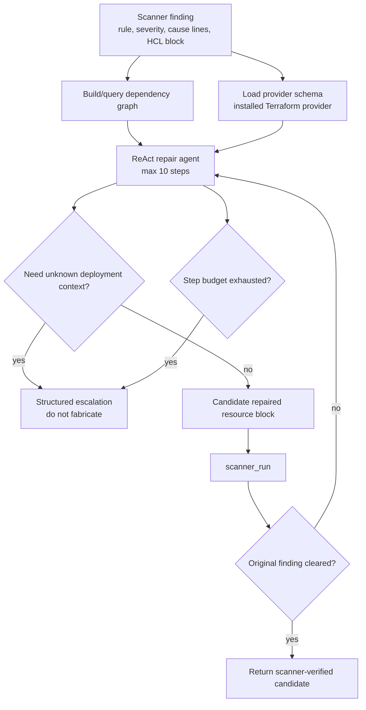

# TerraRepair：把 Terraform 安全修复 Agent 从“自称修好”推向工具接地验证

| 项目 | 内容 |
| --- | --- |
| 论文 | TerraRepair: A Tool-Grounded LLM Agent for Infrastructure-as-Code Repair |
| 作者 | Minase Mekete Mengistu, Juri Di Rocco, Phuong T. Nguyen, Davide Di Ruscio |
| 日期 | arXiv v1: 2026-07-13 |
| 领域 | 大模型 Agent / AI for 安全 / Infrastructure-as-Code 修复 |
| 原文 | https://arxiv.org/abs/2607.11390 |
| HTML 全文 | https://arxiv.org/html/2607.11390v1 |
| 复制包 | https://anonymous.4open.science/r/TerraRepair-1ECE/README.md |

## TL;DR

- **这篇论文研究的是 Terraform 安全扫描告警之后的自动修复问题**：Checkov、Trivy 这类 IaC scanner 能指出未加密存储、过宽 IAM、开放网络入口等 misconfiguration，但开发者还要判断资源依赖、provider schema、部署上下文和修复是否真的清掉原始告警。
- **作者提出 TerraRepair**：一个 ReAct 风格的 bounded LLM repair agent。它不是只把告警和代码块丢给模型，而是给 Agent 三类工具：`graph_query` 查 Terraform 引用依赖，`schema_lookup` 查已安装 provider schema，`scanner_run` 对候选 patch 重新跑 scanner。
- **核心机制是“修复或升级”二选一**：如果修复需要 KMS ARN、证书、日志 bucket、CIDR、least-privilege IAM scope 等本地代码和 schema 都没有的信息，Agent 应输出结构化 escalation，而不是编一个看似合理的 Terraform 片段。
- **主结果很清楚**：在合并 AWS benchmark 上，受控 one-shot baseline 的 scanner-verified fix rate 是 Checkov 26.6%、Trivy 44.8%；TerraRepair 提高到 Checkov 78.4%、Trivy 72.4%，增益分别是 +51.8 pp 和 +27.6 pp。
- **论文真正有价值的指标不是“LLM 说修好了多少”**：作者定义 claimed-vs-verified repair gap。baseline 在 AWS 上有 44.8 到 73.6 pp 的自称成功与重扫成功差距；TerraRepair 通过 in-loop scanner verification 把这个差距压到约 5 pp 内。
- **语义正确性仍然没有被 scanner 完全解决**：作者抽样 171 个 scanner-verified AWS repairs，由作者和两个 LLM judges 做多数投票，135/171 被判为语义正确，估计为 78.9%，95% CI 为 [72.2%, 84.4%]。
- **消融说明工具接地的贡献并不平均**：去掉 provider schema 后 Checkov 修复率从 75.1% 降到 35.9%；去掉 dependency graph 后降到 55.1%；去掉 scanner_run 对最终 fix rate 影响较小，但会破坏成功报告的校准。
- **最大边界是外部部署上下文**：三轮、14 个 dataset-scanner 配置里平均每轮 181.3 个 escalation，约 25.4%；其中 82.7% 是 missing external context，说明自治修复的瓶颈经常不在“模型不会写 HCL”，而在“系统不知道组织允许用哪个真实资源”。

## 1. 研究问题：IaC 修复为什么不是普通代码修 bug？

### 1.1 Scanner 能发现风险，但不能自动给出可信修复

Infrastructure-as-Code 把云资源配置写成 Terraform 这类声明式代码。它的优点是：

- 配置可以 code review；
- 环境可以重复部署；
- 安全规则可以在 CI 阶段扫描；
- 变更可以和应用代码一样被版本控制。

但 IaC 的失败形态也很特殊：

- 一个 S3 bucket、security group、KMS key、IAM role 不是局部函数；
- HCL 语法正确不代表 provider 接受；
- provider 接受不代表云端部署一定成功；
- scanner warning 消失不代表策略真的安全；
- 某些修复必须知道组织上下文，例如允许的 CIDR、证书、日志目标或密钥资源。

因此，这篇论文关心的问题可以写成：

> 给定一个 Terraform scanner finding，LLM Agent 能否在有限工具和有限步骤内生成一个更可信的候选修复；如果上下文不足，能否停止并升级，而不是幻觉式补全？

这里的关键词是 **bounded** 和 **grounded**：

- bounded：每个 finding 最多 10 个 agent steps；
- grounded：修复必须依赖代码依赖图、provider schema 和 scanner feedback；
- escalation：无法从局部仓库推断的信息，不能伪造。

### 1.2 论文回应的直接失败模式

作者不是泛泛地说 LLM 会 hallucinate，而是把 IaC repair 的失败拆成几类：

| 失败模式 | 在 Terraform 中的具体表现 | 为什么 one-shot LLM 容易中招 |
| --- | --- | --- |
| Unsupported construct | 生成 provider 版本不支持的 attribute 或 nested block | 模型记忆的是通用 Terraform 语料，不知道当前 provider schema |
| Warning suppression | 改写代码让 scanner 不再命中，但没有修复真实风险 | scanner 是不完整 oracle，模型会对规则文本过拟合 |
| Missing deployment context | 修复需要 KMS key、logging target、CIDR 等外部值 | prompt 中没有这些值，模型仍可能编一个占位资源 |
| Broken references | 改了资源块但没有同步引用关系 | IaC 资源间依赖不在单个 block 内闭合 |
| Invalid HCL / validate error | 修复后 Terraform validate 新增错误 | one-shot 缺少工具反馈和二次修正 |

这也是论文和普通自动程序修复不同的地方。普通 APR 通常依赖 test suite、compiler error 或 crash；IaC repair 的 oracle 更弱：

- scanner 只检查一部分策略；
- `terraform validate` 只检查语法、类型和 provider 可接受性；
- cloud deployment 还需要真实账户、权限、状态和组织策略；
- 语义安全往往要人审或专家规则。

## 2. 论文主张与论证路线

### 2.1 Claim → mechanism → evidence → boundary

| Claim | Mechanism | Evidence | Boundary |
| --- | --- | --- | --- |
| 工具接地能显著提升 scanner-verified fix rate | ReAct repair loop 调用 dependency graph、provider schema、scanner rerun | AWS Checkov 从 26.6% 到 78.4%；Trivy 从 44.8% 到 72.4% | 只在 TerraGoat、KaiMonkey 和一个 repair model 上验证 |
| 仅让 LLM 自称修好会严重失真 | claimed-vs-verified gap 衡量 `is_fixed=true` 与重扫结果差距 | baseline gap 为 44.8-73.6 pp；TerraRepair 约在 5 pp 内 | scanner verification 只校准报告，不等于语义正确 |
| provider schema 与依赖图是主要贡献项 | leave-one-out ablation 移除 schema、graph、scanner_run | no_schema 后 Checkov fix rate 35.9%；no_graph 为 55.1%；full 为 75.1% | ablation 只在 TerraGoat AWS + Checkov 上做 |
| 缺上下文时应升级而不是编造 | structured escalation taxonomy | 平均 181.3 escalations/run；82.7% 是 missing external context | escalation 质量依赖 prompt、工具接口和分类规则 |
| scanner-verified repair 仍需语义审计 | 抽样 171 个 AWS scanner-verified repairs，作者 + 两个 LLM judge 多数投票 | 135/171 正确，估计 78.9%，95% CI [72.2%, 84.4%] | judge 不是独立 ground truth，作者也是评审者之一 |

### 2.2 论文真正的技术判断

这篇文章最值得带走的判断不是“LLM 可以修 Terraform”，而是：

- **自治修复系统必须有报告校准机制**：否则模型输出的 `is_fixed=true` 会把失败包装成成功。
- **工具不是越多越好，而是必须对准修复 oracle 的缺口**：provider schema 对付 unsupported constructs；dependency graph 对付跨资源引用；scanner_run 对付自称成功。
- **升级是能力的一部分**：在安全修复里，“我缺少部署上下文，不能安全修复”比“我猜一个配置”更接近可靠自治。
- **scanner-verified 只是第一层证据**：它能排除“原告警还在”的失败，但不能证明部署可用、组织合规或语义安全。

## 3. 方法机制：TerraRepair 的 Agent 到底怎么跑？

### 3.1 输入、状态、工具、输出

| 组成 | 内容 |
| --- | --- |
| 输入 | scanner finding、rule id、severity、resolution hint、resource identifier、cause lines、完整原始 HCL block |
| 状态 | 当前候选 patch、已查到的依赖上下文、provider schema 片段、scanner feedback、step budget |
| 工具 1 | `graph_query`：从 HCL reference dependency graph 中取 KMS ARN、network id、security group reference 等 |
| 工具 2 | `schema_lookup`：读取已安装 Terraform provider 对目标 resource type 的 schema |
| 工具 3 | `scanner_run`：对候选修复重新跑 Checkov 或 Trivy，检查原始 finding 是否仍出现 |
| 输出 A | 一个 scanner-verified repaired resource block |
| 输出 B | 一个 structured escalation，说明缺少哪类上下文或为何无法收敛 |

作者把每次 repair attempt 限制为 10 个 agent steps。这让系统有足够空间做：

1. 查依赖；
2. 查 schema；
3. 生成 patch；
4. 重跑 scanner；
5. 根据 feedback 修正；
6. 若无法满足条件则升级。

但它也阻止了 agent 在一个 finding 上无限循环。

### 3.2 Mermaid：从告警到修复或升级



### 3.3 伪代码：bounded tool-grounded repair loop

```text
Input:
  f: scanner finding
  b: original Terraform resource block
  G: dependency graph
  S: installed provider schema
  scanner: Checkov or Trivy
  max_steps = 10

State:
  context = {finding: f, block: b}
  patch = null
  feedback = null

for step in 1..max_steps:
  if repair requires external value not present in code/schema:
    return Escalate(reason="missing_external_context")

  if schema knowledge is needed:
    context.schema = schema_lookup(S, resource_type(b))

  if cross-resource value is needed:
    context.deps = graph_query(G, references(b, f))

  patch = propose_repaired_block(context, feedback)

  if patch is invalid HCL or unsupported by schema:
    feedback = explain_invalidity(patch)
    continue

  scan_result = scanner_run(apply_patch(b, patch))

  if original_finding_is_cleared(scan_result, f):
    return Repaired(block=patch, evidence=scan_result)

  feedback = scan_result

return Escalate(reason="max_step_or_unresolved_feedback")
```

### 3.4 公式：claimed-vs-verified repair gap

论文把 one-shot LLM 的一个关键问题量化为：

```text
claimed_repair_rate = claimed_fixed / total_original_findings
verified_fix_rate = findings_cleared_after_rescan / total_original_findings
claimed_vs_verified_gap = claimed_repair_rate - verified_fix_rate
```

变量解释：

- `claimed_fixed`：模型或 agent 报告自己修好的 findings 数；
- `findings_cleared_after_rescan`：同一个 scanner 重扫后原始 finding 不再出现的数量；
- gap 越大，说明系统越容易“自称成功但证据不足”；
- gap 接近 0，只说明报告与 scanner 证据更一致，不说明语义绝对正确。

这个指标非常适合安全 Agent，因为安全修复的第一风险不是“没修好”，而是“没修好但系统以为已经修好”。

## 4. 实验设置：作者如何避免不公平比较？

### 4.1 Benchmark 与 scanner

论文用两个 vulnerable-by-design Terraform repositories：

- **TerraGoat**：包含 AWS、Azure、GCP 配置；
- **KaiMonkey**：包含四个 AWS slices，包括 compute、network、storage、cross-module SSRF scenario。

组合后有 7 个 benchmark slices。每个 slice 用两个 scanner：

- Checkov 3.2.510；
- Trivy 0.69.3。

因此总共有 14 个 dataset-scanner 配置。

表 1 的 finding counts：

| Dataset / Provider | Checkov | Trivy |
| --- | ---: | ---: |
| TerraGoat AWS | 158 | 113 |
| TerraGoat Azure | 124 | 90 |
| TerraGoat GCP | 55 | 49 |
| KaiMonkey AWS | 69 | 55 |
| Combined AWS | 227 | 168 |
| Grand total | 406 | 307 |

### 4.2 模型、版本和重复实验

论文的工程设置比较具体：

| 组件 | 版本 / 设置 |
| --- | --- |
| Repair model | `gpt-4o-mini-2024-07-18` |
| Temperature | 0.0 |
| Terraform CLI | 0.14.11 |
| python-hcl2 | 7.3.1 |
| AWS provider | TerraGoat 4.67.0；KaiMonkey 3.76.1 |
| AzureRM provider | 4.68.0 |
| Google provider | 7.27.0 |
| TerraRepair repetitions | 每个配置 3 次 |
| Baseline repetitions | AWS RQ1 配置 3 次 |

作者强调，即使 temperature 为 0.0，API inference 也可能不完全 bit-deterministic，所以三次重复是必要的。

### 4.3 Baseline 为什么是受控 one-shot？

论文没有直接拿 Low et al. 2024 的数字当主比较，因为：

- scanner 版本不同；
- Terrascan 已 archived；
- provider 和 benchmark 环境不同；
- 旧结果只能作为历史背景。

作者构造了一个 within-study baseline：

- 使用 Low et al. autonomous first-pass prompt；
- 每个 finding 只做一次 LLM call；
- 不给 dependency graph；
- 不查 provider schema；
- 不做 in-loop scanner verification；
- 与 TerraRepair 使用同一模型、scanner 版本、finding population、patching logic、scoring procedure。

这个设计让比较重点落在架构差异：

| 系统 | 是否工具接地 | 是否多步修复 | 是否 in-loop scanner | 是否 structured escalation |
| --- | --- | --- | --- | --- |
| Controlled baseline | 否 | 否 | 否 | 否 |
| TerraRepair | 是 | 是，最多 10 steps | 是 | 是 |

## 5. 主结果：修复率提升，但不要把 scanner 当真理

### 5.1 AWS combined benchmark 的 scanner-verified fix rate

| System | Approach | Checkov | Trivy |
| --- | --- | ---: | ---: |
| Low et al. GPT-3.5 pass 1 | historical context | 9.0% | 17.1% |
| Low et al. GPT-4 pass 1 | historical context | 27.4% | 44.2% |
| Low et al. GPT-4 pass 2 | human-assisted historical context | 87.4% | 67.3% |
| Controlled baseline | one-shot, gpt-4o-mini | 26.6% ± 1.4 pp | 44.8% ± 1.4 pp |
| TerraRepair | agent + tools, gpt-4o-mini | 78.4% ± 0.8 pp | 72.4% ± 4.0 pp |
| Gain | TerraRepair - baseline | +51.8 pp | +27.6 pp |

这个结果支持两个判断：

- 对 Checkov，工具接地带来的收益非常大；
- 对 Trivy，baseline 已经更高，但 TerraRepair 仍有明显增益。

但论文没有把这个结果夸大成“自动安全修复解决了”。原因是：

- scanner-verified 只表示原始 scanner finding 不再出现；
- scanner 规则可能漏报；
- patch 可能通过 scanner 但不适合真实部署；
- IaC policy 的语义正确性经常需要组织上下文。

### 5.2 自称成功与重扫成功的差距

作者的 claimed-vs-verified gap 很有启发：

| 系统 | gap 表现 | 解读 |
| --- | --- | --- |
| Controlled baseline | AWS 配置上为 44.8-73.6 pp | one-shot LLM 经常返回 `is_fixed=true`，但重扫后原始 finding 仍在 |
| TerraRepair | 约在 5 pp 内，部分小负值 | in-loop scanner_run 让报告与重扫证据基本一致 |

小负值不是“额外证明更安全”，而是 finding granularity 的副作用：

- TerraRepair 按 resource block 修；
- scanner finding 按规则和位置报；
- 一个 block-level patch 可能同时清掉多个 finding；
- 因此系统可能少报了自己间接清掉的 finding。

这个细节说明作者没有把数字包装得过满，而是在解释度量的粒度边界。

### 5.3 Terraform validity 与语义审计

作者又加了两层证据：

| 证据层 | 结果 | 能证明什么 | 不能证明什么 |
| --- | --- | --- | --- |
| Differential `terraform validate` | AWS benchmark 三轮 TerraRepair 新增 validate errors 为 0 | patch 没引入 Terraform validate 层面的新错误 | 不证明云端可部署或策略语义正确 |
| Semantic audit | 171 个 sampled scanner-verified AWS repairs 中 135 个多数投票正确，78.9%，95% CI [72.2%, 84.4%] | scanner-verified repairs 中有相当比例经上下文审查也合理 | 不是独立 ground truth；作者是评审者之一，两个 judge 是 LLM |

语义审计的设计：

- 样本来自 Run 3 AWS；
- Run 3 的 fix rates 最接近三轮均值；
- 用 Cochran formula 和 finite population correction 抽样 171/303；
- 按 dataset-scanner strata 比例分配；
- 评审者包括作者、Claude Sonnet 4.5、GPT-5.4；
- 多数投票给最终标签；
- LLM judge 使用 conservative prompt，不确定时倾向 WRONG。

这里有一个研究者视角的重点：

- 论文没有把 LLM judge 当 oracle；
- 它把这一步称为 semantic audit；
- 结论是估计值，而不是绝对正确率。

## 6. 跨云、消融与失败案例

### 6.1 RQ2：跨 cloud provider 的表现差异

HTML 正文给出的 RQ2 结论是：

- TerraRepair 在 AWS 和 GCP 上整体有效；
- Azure 表现更弱；
- 差异可能来自 provider schema、scanner rule、benchmark finding 类型、resource pattern 的组合。

对这篇论文来说，跨云结果的意义不是“哪个云更容易修”，而是说明：

- Terraform repair agent 不是一个纯语言任务；
- 它依赖 provider-specific schema；
- scanner 规则和 resource model 会改变 agent 的可行动作空间；
- 因此把一个云上的修复率迁移到另一个云上是不严谨的。

### 6.2 RQ3：工具消融结果

论文在 TerraGoat AWS + Checkov 上做 leave-one-out ablation：

| Configuration | Scanner-verified fix rate | 说明 |
| --- | ---: | --- |
| Full TerraRepair | 75.1% | 三类工具都启用 |
| No graph_query | 55.1% | 缺跨资源依赖检索，少了 KMS、network、reference context |
| No schema_lookup | 35.9% | 缺 provider schema，容易生成 unsupported attributes 或错用 nested blocks |
| No scanner_run | 与 full 接近或略不同 | 最终 fix rate 未必大降，但成功报告校准会变差 |

这组结果说明：

- `schema_lookup` 是最关键的工程接地；
- `graph_query` 解决局部 block 看不到的资源依赖；
- `scanner_run` 的贡献更偏向 stopping condition 和 report calibration；
- 如果只看最终 full-codebase rescan，可能低估 in-loop scanner 的价值。

### 6.3 RQ4：什么情况不能自治修？

三轮、14 个配置里，TerraRepair 平均每轮 escalates 181.3 findings，rate 为 25.4%，std 为 1.3 pp。

| Escalation category | Run 1 | Run 2 | Run 3 | Mean | Share |
| --- | ---: | ---: | ---: | ---: | ---: |
| Missing external context | 150 | 149 | 151 | 150.0 | 82.7% |
| Max-step termination | 31 | 21 | 16 | 22.7 | 12.5% |
| Missing schema support | 8 | 6 | 7 | 7.0 | 3.9% |
| Unresolved variable/local refs | 3 | 1 | 1 | 1.7 | 0.9% |
| Total | 192 | 177 | 175 | 181.3 | 100% |

最主要的 missing external context 包括：

- KMS ARNs；
- certificates；
- logging targets；
- secrets；
- disk-encryption sets；
- logging buckets；
- network identifiers；
- 不能从本地代码推断的 least-privilege IAM scopes。

Max-step terminations 也有具体失败原因：

- heredoc-containing blocks，例如 IAM policy 或 user_data script，使 scanner_run parse 失败；
- scanner feedback 没说明未满足条件；
- schema_lookup 缺 nested block 细节；
- LLM 生成 invalid tool-call formatting；
- agent 耗尽 steps 或把 `FINISH` 当成无效 tool action。

这些失败案例说明，未来改进不只是换更强模型，还包括：

- 更好的 HCL representation；
- 更清晰的 scanner feedback adapter；
- 更细粒度的 provider schema extraction；
- 更严格的 tool-call protocol；
- 组织级知识库接入。

## 7. Figure/Table 逐项证据解读

### 7.1 Figure 1：架构图支撑的是“工具接地”而非“多 Agent”

Figure 1 展示 TerraRepair workflow。它的证据作用是把论文从“LLM prompt 改写”区分出来：

- scanner 先产出 finding；
- 系统构建 dependency graph；
- 系统加载 provider schema；
- 单个 ReAct-style repair agent 在 10 steps 内调用工具；
- 成功条件是 scanner-verified candidate；
- 失败条件包括 structured escalation。

它不能证明的是：

- 这个流程在所有 IaC 语言上有效；
- scanner clearing 等于语义安全；
- 真实生产组织上下文可以自动推断。

### 7.2 Table 1：finding population 是比较公平性的基础

Table 1 给出 Checkov/Trivy 在不同 provider 和 dataset 上的原始 finding counts。它支撑的是：

- baseline 和 TerraRepair 比较前有相同 finding population；
- AWS 是主比较，因为最接近 prior work；
- Azure/GCP 是跨 provider robustness 检查。

它的边界：

- vulnerable-by-design repo 不能代表生产 IaC；
- finding 类型分布可能偏向教学型 misconfiguration；
- scanner 版本变化会改变 finding population。

### 7.3 Table 2：主结果证明工具接地显著提高 scanner-verified fix rate

Table 2 是论文最直接的结果表。它支持：

- TerraRepair 在 Checkov 上相对 one-shot baseline 有 +51.8 pp；
- TerraRepair 在 Trivy 上有 +27.6 pp；
- gpt-4o-mini 的 one-shot baseline 与 Low et al. GPT-4 historical context 接近，说明 baseline 不是刻意做弱。

它不能证明：

- TerraRepair 达到 human-assisted GPT-4 pass 2 的完整能力；
- 所有修复都语义正确；
- 更强模型一定会保留同样的架构增益。

### 7.4 Figure 2：gap 图证明“报告校准”是独立问题

Figure 2 关注 claimed-vs-verified repair gap。它支撑：

- one-shot baseline 不是只修复率低，还经常错误报告成功；
- scanner_run 让 TerraRepair 的成功声明接近 final rescan；
- 安全 Agent 需要把成功报告作为被验证对象。

它的边界：

- gap 小不代表 security semantics 正确；
- gap 只围绕同一个 scanner 的原始 finding；
- 如果 scanner rule 本身有缺陷，gap 仍可能误导。

### 7.5 Ablation table：schema 与 graph 是主贡献项

消融结果支撑：

- provider schema grounding 对 Terraform 修复特别关键；
- dependency graph 对跨资源补全很重要；
- scanner_run 是验证和 stopping control 的核心。

它的边界：

- 只在 TerraGoat AWS + Checkov；
- 不单独分离 prompt style、repair ordering 和工具设计；
- 不说明其他 IaC scanner 或 provider 的相同排序。

### 7.6 Table 5：升级分类证明自治边界主要来自缺上下文

Table 5 的关键结论是：

- escalation 不是随机失败；
- 82.7% 指向 missing external context；
- 这把自治修复的边界从“模型能力”转向“系统知识边界”。

它不能证明：

- 所有 missing context 都无法通过组织知识库补齐；
- escalation 分类完全客观；
- 更大 step budget 就能解决核心问题。

## 8. 相关工作位置：TerraRepair 在哪条线上？

### 8.1 与自动程序修复的关系

自动程序修复通常围绕：

- 编译错误；
- 测试失败；
- crash trace；
- static-analysis warning；
- patch overfitting。

TerraRepair 借鉴了 APR 的 “generate candidate → validate against oracle” 思路，但它的 oracle 更复杂：

- scanner finding 是策略告警；
- provider schema 是类型和资源接口约束；
- dependency graph 是 IaC 语义上下文；
- escalation 是不可修复边界。

因此它不是简单把 APR 套到 HCL，而是在重写 repair loop 的 evidence sources。

### 8.2 与 LLM vulnerability repair 的关系

LLM vulnerability repair 常见路线：

- zero-shot patch；
- retrieval-augmented repair；
- static-analysis-guided repair；
- tool-using agent；
- repository-history-aware repair。

TerraRepair 的区别是：

- 修复对象是 Terraform resource blocks；
- 工具围绕 provider schema 和 scanner rerun；
- 输出不是必须给 patch，也可以 structured escalation；
- 评价重点加入 claimed-vs-verified gap。

### 8.3 与 IaC / config security 研究的关系

论文提到的邻近方向包括：

- Terraform generation and mutation；
- Kubernetes misconfiguration repair；
- Terraform remediation dataset；
- CloudFormation multi-agent RAG remediation；
- Terraform reconciliation。

TerraRepair 的位置可以概括为：

| 方向 | 典型目标 | TerraRepair 的差异 |
| --- | --- | --- |
| IaC smell detection | 找出风险 | 关注检测之后的候选修复 |
| LLM IaC generation | 从自然语言生成配置 | 从 scanner finding 到 bounded repair |
| RAG remediation guidance | 给开发者建议 | 直接生成 candidate block 或 escalation |
| Cloud-state reconciliation | 从真实云状态同步代码 | 不访问真实云状态，只用本地 code/schema/scanner |
| Agentic repair | 多步工具使用 | 明确把 provider schema、graph、scanner 作为闭环 |

## 9. 复制包与可复现性：能复现什么，不能复现什么？

复制包 README 给出的关键信息包括：

- 无需 GPU；
- 测试环境包含 macOS，Linux 支持，Windows 建议 WSL2；
- 需要 Python 3.14、Trivy 0.69.3、Checkov 3.2.510、Terraform 0.14.11；
- benchmark repo 固定 commit：TerraGoat `729f8da`，KaiMonkey `3feb0bf`；
- agent runs 使用 `gpt-4o-mini`；
- reference findings 放在 `data/findings/`；
- 如果本地 scanner 版本同号但 finding 不一致，脚本会用 reference filtering 保持和论文表格一致；
- baseline、multi-cloud、ablation、escalation、semantic audit、figure generation 都有独立脚本。

这对复现很重要，因为 IaC scanner 的输出可能受环境和 packaging 影响。作者在复制包里用 reference finding sets 固定 paper population，避免读者因为本地 scanner 多报或少报而得到不可比较的结果。

但复制包也有边界：

- 需要 API key，模型服务会随时间变化；
- temperature 0.0 不保证逐 token 一致；
- semantic correctness 的人审 Excel 依赖作者最终文件；
- 生产 repo 的 remote state、private modules、organization policy 不在复制包内。

## 10. 证据边界与局限

### 10.1 Scanner-verified 不是语义正确

论文反复强调：

- scanner clearing 是 operational metric；
- 它能发现原始 warning 是否消失；
- 它不能证明 patch 可以部署；
- 它不能证明组织安全策略满足；
- 它不能覆盖 scanner 没有建模的风险。

这点非常重要。否则很容易把 78.4% 或 72.4% 误读成“安全修复正确率”。

更准确的读法是：

| 数字 | 合理解释 | 不合理解释 |
| --- | --- | --- |
| 78.4% Checkov | 原始 Checkov findings 在重扫中消失的比例 | Terraform 安全问题被正确修复的比例 |
| 72.4% Trivy | 原始 Trivy findings 在重扫中消失的比例 | 真实云部署安全合规的比例 |
| 78.9% semantic audit | sampled scanner-verified AWS repairs 中多数投票认为正确的估计 | 独立专家 ground truth 正确率 |
| gap 约 5 pp 内 | 成功声明和 scanner evidence 更一致 | 系统没有安全 hallucination |

### 10.2 Benchmark 不是生产 IaC

TerraGoat 和 KaiMonkey 的优点是公开、可复现、vulnerable-by-design。但生产 IaC 常见问题包括：

- private modules；
- provider aliases；
- remote state；
- dynamic blocks；
- workspace-specific variables；
- custom providers；
- 公司内部 approved resource inventories；
- 组织级 policy exceptions。

这些恰好都是 TerraRepair escalation 里最常见的缺上下文来源。

### 10.3 模型与工具接口会漂移

论文使用一个 repair model：`gpt-4o-mini-2024-07-18`。因此：

- fix rates 不是模型无关性质；
- ablation 排序可能随模型改变；
- scanner rule 更新可能改变 finding population；
- provider schema 和 Terraform 版本也会改变可用属性。

研究者复用这篇论文时，更应该复用：

- bounded repair protocol；
- tool grounding selection；
- claimed-vs-verified gap；
- escalation taxonomy；
- semantic audit 分层；

而不是直接复用某个 fix rate 数字。

## 11. 对 Agent 安全与工程自治的延伸思考

### 11.1 安全 Agent 的第一原则：不要把缺知识包装成行动

TerraRepair 最有启发的设计是 structured escalation。对安全修复 Agent 来说：

- 不知道 KMS key，就不能编一个；
- 不知道 allowed CIDR，就不能猜一个；
- 不知道 logging destination，就不能随便创建一个；
- 不知道 IAM least privilege scope，就不能靠常识补一个过宽 policy。

这条原则可以推广到更广的 AI for security：

| 场景 | 应该升级的缺口 | 不应做的事 |
| --- | --- | --- |
| 云配置修复 | 组织批准的资源、账户边界、网络策略 | 编造资源 ARN 或默认开放 |
| 代码漏洞修复 | 业务不变量、兼容性约束、测试缺口 | 只让漏洞扫描不再报 |
| Incident response | 资产归属、授权范围、保留证据规则 | 自动隔离或删除未知资源 |
| Agent tool permission | 用户意图、外部副作用、权限委托 | 默认执行高权限工具 |

这说明“会用工具”不是 Agent 安全的终点；“知道什么时候不能用工具”同样是能力。

### 11.2 Tool grounding 不等于 RAG

这篇论文里的 grounding 不是泛化知识检索，而是围绕 repair validity 的三类证据：

- provider schema：动作空间约束；
- dependency graph：局部上下文约束；
- scanner_run：结果反馈约束。

这比普通 RAG 更窄，也更可验证。对 Agent 系统构建来说，工具选择应从失败模式反推：

```text
Failure mode -> Required evidence -> Tool

Unsupported attribute -> provider interface -> schema_lookup
Missing cross-resource value -> code dependency -> graph_query
False success claim -> original scanner oracle -> scanner_run
Missing deployment intent -> organization knowledge absent -> escalation
```

如果工具不能对应具体失败模式，它可能只是在增加复杂度。

### 11.3 Autonomy 的评价要分层

TerraRepair 给了一个很好的分层模板：

1. **Operational verification**：scanner finding 是否消失；
2. **Syntax/provider validity**：`terraform validate` 是否新增错误；
3. **Report calibration**：claimed-vs-verified gap 是否接近 0；
4. **Semantic audit**：上下文审查是否认为 patch 合理；
5. **Deployment validation**：真实或仿真环境是否可部署；
6. **Policy validation**：组织安全策略是否满足。

论文覆盖了前四层，未覆盖最后两层。它的贡献因此很明确：

- 不是宣称“端到端安全修复”；
- 而是把 LLM IaC repair 从 one-shot suggestion 推进到 bounded, tool-grounded, scanner-calibrated candidate repair。

### 11.4 后续值得追问的问题

从研究角度，至少有五个后续问题：

- **组织知识如何接入 escalation loop？**  
  例如 approved KMS keys、logging destinations、certificate inventory、IAM policy templates 是否能以只读工具形式提供给 Agent。

- **scanner feedback 能否结构化？**  
  当前 scanner output 往往面向人类。若把 unmet condition、resource path、expected schema、policy rationale 结构化，max-step termination 可能下降。

- **semantic audit 能否独立化？**  
  需要 IaC/cloud-security practitioners、真实 deployment tests、policy-as-code checks，而不只依赖作者与 LLM judge。

- **multi-finding repair 如何处理相互作用？**  
  一个 block 可能被多个 scanner findings 命中。逐 finding 修复可能造成局部最优，未来需要 block-level 或 module-level planning。

- **安全修复 Agent 的权限边界如何设计？**  
  如果未来接入真实云账户、remote state 或组织 inventory，Agent 的读取、写入、模拟和执行权限必须分层隔离。

## 12. 结论

TerraRepair 的贡献在于把 Terraform 安全修复 Agent 的核心问题讲清楚了：

- one-shot LLM 可以生成看似合理的 HCL，但会有很大的自称成功与重扫成功差距；
- provider schema 和 dependency graph 能显著减少不接地修复；
- scanner_run 能把成功声明变成可校准的证据；
- structured escalation 能把缺上下文从 hallucination 风险变成显式边界；
- scanner-verified repair 仍然只是候选修复，需要 validate、semantic audit、deployment 和 policy checks 继续约束。

如果只看结果表，这篇论文像是一个 IaC repair 工具论文；如果从 Agent 系统角度读，它更像是在回答一个更基础的问题：

> 面向安全任务的 LLM Agent，如何在有限自治中同时保留行动能力、验证证据和停止边界？

这个问题比 Terraform 更大，也更接近生产 Agent 安全的核心。

## 参考链接

- arXiv abstract: https://arxiv.org/abs/2607.11390
- arXiv HTML: https://arxiv.org/html/2607.11390v1
- arXiv PDF: https://arxiv.org/pdf/2607.11390
- Replication package README: https://anonymous.4open.science/r/TerraRepair-1ECE/README.md
