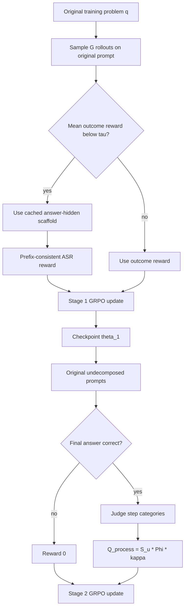

# SCOPE-RL：把 RLVR 的奖励从“答对了吗”推进到“怎样答对”

| 项目 | 内容 |
|---|---|
| 原文 | [SCOPE-RL: Optimizing Reasoning Paths Before and After Success](https://arxiv.org/abs/2607.11506v1) |
| 日期 | 2026-07-13 |
| 作者 | Xiaojian Liu, Han Xu, Jianqiang Xia, Zhixuan Li, Ke Xu, Yiwei Dai, Xinran Chen, Changwo Wu, Yuchen Li |
| 方向 | 大模型后训练 / RLVR / 过程奖励 |
| 代码 | [tokencraft-lab/SCOPE-RL](https://github.com/tokencraft-lab/SCOPE-RL) |

## TL;DR

- **这篇论文要解决什么**：RLVR 常用最终答案是否正确作为奖励，信号可靠但太稀疏。难题在成功前拿不到中间进展奖励，已会做的题在成功后也分不清“高质量推理”和“冗长自我修补”。
- **作者怎么做**：SCOPE-RL 把训练分成两段。第一段 ASR 给低成功率题目构造 answer-hidden scaffold，用可验证子问题前缀奖励放大成功前信号；第二段 QPR 只在答案已正确时启动过程形状奖励，用 step-level judge 区分 useful、mechanical、redundant、reversion、error。
- **关键机制**：SCOPE-RL 不改 GRPO 更新本身，只替换标量奖励。ASR 用前缀一致性避免模型跳过先修步骤骗奖励，QPR 用 correctness gate 避免“短但错”的轨迹获得高分。
- **实验怎么做**：作者在 Qwen3-8B-Instruct 上用 DAPO-Math 和 Big-Math 各 2,400 题训练，评测 GPQA、MATH500、AIME 2024、AIME 2025，并额外报告 useful-step ratio、first-error relative position、平均 token。
- **关键数字**：在 DAPO-Math 训练设置下，GRPO 平均准确率 55.80%，SCOPE-RL 到 66.35%；在 Big-Math 下从 53.58% 到 64.79%。平均 token 分别下降 16.2% 和 27.1%。GSPO 后端从 61.60% 到 66.93%，Qwen3-0.6B 从 26.06% 到 32.06%。
- **为什么重要**：它把后训练讨论从“用什么 RL optimizer”拉回“奖励信号在哪些状态有梯度”。如果最终答案奖励是唯一锚点，GRPO 只会在同组 rollout 有对有错时学到东西；SCOPE-RL 试图在全错和全对两类退化组里重新制造可用差异。
- **主要局限**：scaffold 构造依赖可自动验证的数学子答案，QPR 依赖 LLM judge 的 step segmentation 和标签稳定性；结果主要在数学、科学推理 benchmark 上验证，还不能直接证明开放式问答、代码 Agent 或不可验证任务同样成立。

## 研究问题：RLVR 的“可靠奖励”为什么仍然不够？

### 论文把失败拆成两个阶段

| 阶段 | outcome-only RLVR 看见什么 | 它看不见什么 | 训练后果 |
|---|---|---|---|
| 成功前 | 最终答案错，所以奖励为 0 | 先修概念、局部推导、接近正确的中间进展 | 难题 rollout 经常全错，组内优势为 0 |
| 成功后 | 最终答案对，所以奖励为 1 | 正确轨迹是否简洁、是否反复回退、是否靠长篇自纠错才到达答案 | 模型可能越训越长，保留低价值步骤 |

作者的核心问题不是“最终答案奖励是否可信”。恰恰相反，论文承认 rule-based verifier 是 RLVR 的可靠锚点。

真正的问题是：

- **锚点过少**：只有终点可见，中间路径没有密度。
- **锚点过粗**：只知道到没到终点，不知道路线质量。
- **GRPO 组内标准化放大了这个问题**：同一 prompt 的 rollout 如果全错或全对，组内 reward 方差为 0，advantage 被置为 0。

### 用公式看稀疏锚点

论文先写出 outcome-only 奖励：

```text
r_out(y, a) = 1[ answer(y) = a ]
```

其中：

- `y` 是模型生成的推理轨迹。
- `a` 是可验证标准答案。
- `answer(y)` 是从轨迹中抽取的最终答案。

GRPO 对同一问题采样 `G` 条轨迹，按组内 reward 标准化：

```text
A_g = ( R(q, y_g) - mean_j R(q, y_j) ) / std_j R(q, y_j)
```

如果同组 reward 全相同：

- 全错：`[0, 0, 0, ...]`
- 全对：`[1, 1, 1, ...]`

那么 `std = 0`，实现上通常令 `A_g = 0`。这意味着：

- 难题虽然可能有“接近正确”的轨迹，但最终答案全错时没有梯度。
- 易题虽然答案全对，但冗长和简洁轨迹被视为同等好。

论文定义了一个有效梯度支持比例：

```text
eta_R = P_q[ Var_g R(q, y_g) > 0 ]
```

SCOPE-RL 的目标可以概括为：

> 不放弃最终答案 verifier，但在成功前和成功后分别让 `Var_g R(q, y_g)` 更常大于 0。

## 论文主张与论证路线

| Claim | Mechanism | Evidence | Boundary |
|---|---|---|---|
| 最终答案奖励是可靠但稀疏的锚点 | 分析 GRPO 组内 reward 方差，全错和全对组都没有有效 advantage | Figure 1 展示 scaffold prompt 能暴露先修进展，正确轨迹中仍有大量低价值步骤 | 这不是否定 verifier，而是指出单一 verifier 不足以描述路径 |
| 成功前需要可验证中间目标 | ASR 离线构造 answer-hidden scaffold，并用 on-policy 成功率路由难题 | Stage 1 后平均准确率大幅提高，effective gradient ratio 高于 GRPO | scaffold 适合可分解、可验证问题，不适合所有开放任务 |
| 成功后需要 correctness-gated process reward | QPR 只在最终答案正确时让 LLM judge 标注 step quality | SCOPE-RL 相比 ASR only 降低 token，提升 useful-step ratio 和 first-error position | judge 不负责判对错，只负责过程诊断，但标签仍有主观性 |
| 两阶段顺序是关键 | 先 ASR 提供正确轨迹供给，再 QPR 优化轨迹质量 | ablation 中 Mix-Stage 平均准确率只有 60.98%，低于完整 SCOPE-RL | 顺序依赖意味着训练成本和工程复杂度增加 |

### 为什么不是普通的 process reward？

很多 process reward 方法会让模型或 PRM 评价中间步骤。SCOPE-RL 的区别在于它把“可验证性”分两种处理：

- **ASR 阶段**：
  - 子问题答案仍然是 rule-verifiable。
  - 子答案隐藏在 prompt 之外，只给 verifier 使用。
  - 奖励来自前缀是否连续正确。
- **QPR 阶段**：
  - 最终答案正确性仍由 rule verifier 决定。
  - LLM judge 只在正确轨迹内部评估过程形状。
  - judge 的输出不能覆盖最终答案判定。

这种设计试图避免两个常见失败：

1. 中间提示泄露答案，模型学会复述 scaffold 而不是推理。
2. 过程奖励压过正确性，模型学会写短而流畅的错误答案。

## 方法机制一：ASR 在成功前给难题制造可验证前缀

### Scaffold 不是给答案，而是给可验证子目标

ASR 为每个训练问题 `q` 和标准答案 `a` 离线构造一个 scaffold：

```text
S(q) = { (q_1, a_1), ..., (q_m, a_m), (q_main, a) }
```

含义是：

- `q_i` 是先修子问题。
- `a_i` 是对应可验证子答案。
- `q_main` 的答案仍是原始问题答案 `a`。
- 训练时模型只看到子问题链，不看到 `a_i`。
- `a_i` 只用于 reward extraction 和 verifier。

论文要求 scaffold 同时满足四类约束：

| 约束 | 含义 | 防止什么问题 |
|---|---|---|
| `V` automatic verifiability | 子答案可由规则验证 | judge 主观奖励污染 |
| `P` prerequisite relevance | 子问题确实服务原题 | 拆出无关小题骗密集奖励 |
| `D` dependency awareness | 后续子问题依赖前序结果 | 子问题只是并列碎片 |
| `H` answer-hidden non-leakage | prompt 不泄露子答案或最终答案 | 模型直接抄答案 |

论文附录报告自动分解统计：

| 数据集 | 输入规模 | 成功构造 | 成功率 | 平均子问题数 | 最大/最小 |
|---|---:|---:|---:|---:|---:|
| DAPO-Math 2.4K | 2,400 | 2,382 | 99.3% | 3.84 | 13 / 2 |
| DAPO-Math full | 17,406 | 17,287 | 99.3% | 3.80 | 15 / 1 |
| Big-Math 2.4K | 2,400 | 2,251 | 93.8% | 3.01 | 9 / 1 |
| Big-Math full | 12,400 | 11,846 | 95.5% | 2.97 | 11 / 1 |

这组数字说明：

- 至少在数学数据上，自动构造 scaffold 的通过率很高。
- Big-Math 比 DAPO-Math 更难分解，成功率低一些，平均子问题也更少。
- 这不能证明 scaffold 质量完全可靠，所以作者又做了 200 条人工审核。

### On-policy routing：只把难题送进 scaffold

ASR 不对所有题都使用 scaffold，因为已经能答对的题不需要增加 rollout 成本。

训练时先在原始 prompt 上采样 `G=8` 条 rollout，计算平均 outcome reward：

```text
r_bar(q) = (1 / G) * sum_g r_out(y_g, a)
```

然后按阈值路由：

```text
if r_bar(q) < tau:
    use scaffolded path
else:
    keep original prompt and outcome reward
```

论文实验里设：

- `G = 8`
- `tau = 0.5`

这个路由有两个含义：

- 它不是静态难度标签，而是当前策略自己的成功率估计。
- 随着策略变强，同一道题可能不再需要 scaffold。

### Prefix-consistent reward：不能跳过前置步骤

对于 routed scaffold，模型要在一次生成中回答所有子问题和主问题。

定义第 `i` 个前缀是否全对：

```text
Pi_i = product_{j=1..i} 1[ answer_j = a_j ]
```

ASR reward 写成：

```text
R_ASR = beta * sum_i (1/m) * Pi_i
        + (1 - beta) * Pi_m * 1[ main_answer = a ]
```

变量解释：

- `m` 是 scaffold 子问题数量。
- `beta` 是子问题前缀奖励权重，论文设 `0.5`。
- `Pi_i` 要求从第 1 个子问题到第 `i` 个子问题连续正确。
- 主问题奖励只有在 `Pi_m = 1` 时才会给，也就是所有先修子问题都正确之后才计算最终答案。

这个前缀乘积很关键。它防止模型：

- 猜中后面的子答案，却没有解决前面的先修概念。
- 只优化局部可猜的 checkpoint。
- 从 scaffold 中绕开原题结构。

## 方法机制二：QPR 在成功后清理冗长和低价值步骤

### Correctness gate 是 QPR 的安全阀

QPR 从 ASR 训练出的 checkpoint `theta_1` 开始，回到原始未分解问题。

它的奖励是：

```text
R_QPR(y, a) =
    0,                 if answer(y) != a
    Q_process(y),      if answer(y) = a
```

这意味着：

- 错误答案永远不能靠“看起来过程好”得分。
- LLM judge 不参与判定最终答案。
- 过程奖励只在正确轨迹之间制造差异。

### Step taxonomy：把正确轨迹拆成五类步骤

对于答案正确的轨迹，judge 先切分成 `N` 个 atomic steps，再给每个 step 标注一类：

| 标签 | 直观含义 | 对奖励的作用 |
|---|---|---|
| useful | 推进问题解决的实质步骤 | 正向贡献 |
| mechanical | 机械重写、无新信息计算 | 惩罚 |
| redundant | 已有内容的重复 | 惩罚 |
| reversion | 反复推翻、回退、绕路 | 惩罚 |
| error | 局部错误或误导性步骤 | 惩罚 |

先定义 useful-step ratio：

```text
S_u = (1 / N) * sum_i 1[ c_i = useful ]
```

再定义低价值步骤的乘法惩罚：

```text
Phi = product_{k in {mec, red, rev, err}} (1 - lambda_k * r_k)
```

其中：

- `r_k` 是某类低价值 step 的比例。
- `lambda_k < 1` 控制惩罚强度。
- 乘法组合让不同低价值类型都能压低分数。

最后是软长度因子：

```text
kappa = 1 / (1 + alpha * ln(N + 1))
Q_process = S_u * Phi * kappa
```

这个组合有一个细节：

- `kappa` 只能乘在正向质量上。
- 如果 useful density 很低，单纯缩短回答不会变成高分。
- 因此 QPR 不是普通 length penalty，而是“正确性门控下的有用密度、低价值惩罚、软长度”三项共同作用。

## 两阶段流程：为什么 ASR 要在 QPR 前面？



作者的顺序假设是：

1. **先解决供给问题**：难题一开始很少产生正确答案，QPR 的 correctness gate 会让大量轨迹奖励为 0。
2. **再解决质量问题**：ASR 提高成功率后，正确轨迹变多，QPR 才能在正确轨迹之间比较 useful density 和冗余。
3. **不要把两种奖励混在一起**：如果还没有足够正确轨迹就施加过程惩罚，模型可能在错误轨迹上学到不稳定偏好。

消融结果支持这个判断。论文报告的 Mix-Stage 控制组，也就是没有 ASR warm-up、混合 ASR/QPR 奖励，平均准确率只有 60.98%，低于完整两阶段 SCOPE-RL。

## 实验设置：作者到底比较了什么？

### 模型、数据和评测

| 组件 | 设置 |
|---|---|
| 主模型 | Qwen3-8B-Instruct |
| 小模型验证 | Qwen3-0.6B-Instruct |
| 优化后端 | GRPO 为主，另测 GSPO |
| 训练数据 | DAPO-Math 2,400 题；Big-Math 2,400 题 |
| 评测 | GPQA@1、MATH500@1、AIME24@8、AIME25@8 |
| 过程指标 | Useful%、first-error relative position、平均 token |
| 对照 | base、outcome-only GRPO、ASR only、SCOPE-RL |

论文还额外做了：

- step-quality protocol 的 scaling validation。
- 三位领域专家对 200 个正确样本的 pairwise preference。
- QPR 奖励项消融。
- routing 阈值和训练实现细节附录。

### 主结果：准确率和 token 同时改善

| 训练来源 | 方法 | GPQA | MATH500 | AIME24 | AIME25 | 平均准确率 | Useful% | 1st-Err-Pos | Avg Tokens |
|---|---:|---:|---:|---:|---:|---:|---:|---:|---:|
| DAPO-Math | GRPO | 48.48 | 79.70 | 51.67 | 43.33 | 55.80 | 56.79 | 0.606 | 6,936 |
| DAPO-Math | ASR only | 51.52 | 90.23 | 65.00 | 56.67 | 65.86 | 60.73 | 0.638 | 6,948 |
| DAPO-Math | SCOPE-RL | 53.03 | 90.30 | 65.83 | 56.25 | 66.35 | 64.52 | 0.703 | 5,815 |
| Big-Math | GRPO | 43.43 | 84.21 | 46.67 | 40.00 | 53.58 | 59.73 | 0.656 | 8,228 |
| Big-Math | ASR only | 53.03 | 87.22 | 59.17 | 50.00 | 62.36 | 61.92 | 0.666 | 6,245 |
| Big-Math | SCOPE-RL | 55.05 | 84.96 | 64.58 | 54.58 | 64.79 | 66.47 | 0.738 | 5,994 |

这张表里有三个值得细读的点：

- **ASR 是准确率跃升的主力**：DAPO-Math 从 55.80 到 65.86，Big-Math 从 53.58 到 62.36，说明成功前的 scaffold reward 确实增加了可学习信号。
- **QPR 的价值主要体现在质量和效率**：DAPO-Math 中 ASR only token 反而略高于 GRPO，但 SCOPE-RL 降到 5,815；Big-Math 中 SCOPE-RL 继续把 token 从 ASR only 的 6,245 降到 5,994。
- **QPR 没有靠牺牲准确率换短回答**：DAPO-Math 下 SCOPE-RL 仍略高于 ASR only；Big-Math 下 MATH500 低于 ASR only，但平均准确率、Useful%、AIME 指标更好。

### Robustness：不是只绑定 GRPO 或 8B 模型

论文报告两个补充验证：

| 设置 | 对照 | SCOPE-RL | 说明 |
|---|---:|---:|---|
| GSPO backend | 61.60% | 66.93% | 奖励 densification 可叠加到不同 policy update 后端 |
| Qwen3-0.6B | 26.06% | 32.06% | 小模型上也有增益，且 token 下降 22.9% |

这不等于证明所有优化器和所有模型都有效，但它削弱了一个反驳：

- 如果 SCOPE-RL 只在 GRPO 或 8B 模型上成立，那么可能只是实现偶然。
- 现在至少可以说，它的 before/after-success 奖励分解不完全依赖单一 backend。

## 消融：哪些设计是承重墙？

### QPR 的 step-level 分解不能轻易替换

论文比较了几类替代：

| 消融 | 现象 | 说明 |
|---|---|---|
| Holistic Judge | Useful% 接近完整方法，但平均准确率低 2.37 pp，token 多 25% | 单一轨迹分数不如 step-level 标签能约束冗余 |
| Concise Prompt | useful-step density 降到 58.69% | 推理时提醒“简洁”不能替代训练时过程奖励 |
| Overlong Penalty | 准确率变弱，长度控制不稳定 | 粗暴长度惩罚可能伤害必要推理 |
| No Positive Term | 平均准确率跌到 58.81% | 只有惩罚没有 useful density 会让奖励目标失衡 |
| No Penalty | 冗余残留，Useful% 只有 61.00% | 只奖励有用步骤不足以清理低价值步骤 |
| No Length Factor | 准确率保留但 token 膨胀到 7,882 | 没有软长度因子时仍可能过度展开 |

这一组消融的结论很明确：

- `S_u`、`Phi`、`kappa` 分别处理不同失败模式。
- step-level decomposition 比 holistic score 更能约束具体轨迹结构。
- sequential staging 比混合训练更稳。

### 训练动态对应两阶段解释

论文 Figure 3 展示三个动态：

1. **effective gradient ratio**：ASR 阶段高于 GRPO，因为 scaffold reward 让原本 outcome-uniform 的难题组产生前缀差异。
2. **mean response length**：Stage 1 可能让回答变长，因为模型要处理子问题链；Stage 2 启动后长度下降。
3. **validation reward**：两个阶段都提升，说明 QPR 不是简单删除步骤，而是在正确轨迹中去掉低价值内容。

这和主结果表一致：

- ASR 先解决“做不出来”的问题。
- QPR 再解决“做出来但绕太远”的问题。

## Figure / Table 证据逐项解读

### Figure 1：同一个稀疏锚点的两面

Figure 1(a) 的作用是证明：

- 对原始 prompt 失败的题，scaffolded prompt 可能显露出先修子问题进展。
- 正确子问题前缀越长，主答案成功率越高。

它支持 ASR 的假设：

- 子问题前缀不是任意提示。
- 它们和最终成功有关。

Figure 1(b) 的作用是证明：

- 在最终答案已经正确的轨迹中，outcome-only GRPO 仍会保留大量低价值内容。
- 正确不等于高质量，长推理不等于必要推理。

它支持 QPR 的假设：

- 成功后仍然有优化空间。
- 优化对象不是答案，而是到达答案的路径结构。

### Table 1：ASR 和 QPR 的分工最清楚

Table 1 不是简单展示“我们比 baseline 高”。更重要的是它展示了阶段分工：

| 观察 | 支持的机制 |
|---|---|
| ASR only 准确率大幅超过 GRPO | prefix-decomposed verifiable reward 缓解成功前稀疏信号 |
| ASR only token 不一定下降 | scaffold 学习会带来更多显式推理或更长轨迹 |
| SCOPE-RL token 明显下降 | QPR 清理冗余、回退和机械步骤 |
| Useful% 和 1st-Err-Pos 同时提升 | QPR 不是只压长度，而是改善 step composition |

### Figure 4：正确轨迹内部的质量变化

Figure 4 把正确轨迹拆成五类 step。它的重要性在于：

- 如果只看最终准确率，ASR 和 SCOPE-RL 的差距可能不大。
- 如果看 step composition，QPR 的作用更清楚。
- useful step 占比上升，低价值类别下降，平均 token 下降。

这类证据对后训练尤其重要，因为很多 reasoning model 的输出质量问题并不体现在 final answer 上，而体现在：

- 推理链太长。
- 反复自我纠错。
- 机械验证占比过高。
- 中间错误太早出现但最后侥幸修正。

## 相关工作位置：SCOPE-RL 夹在 RLVR、hint 和 process reward 之间

### 和 hard-problem exploration 的关系

已有方法常见路线包括：

- curriculum：从易到难组织训练。
- difficulty filtering：选择更能产生学习信号的问题。
- hint 或 prefix injection：给模型额外提示。
- decomposition：把难题改写成更易探索的形式。

SCOPE-RL 与这些方法相近，但关键差异是：

- 它不只是把提示放进 prompt。
- 它为子问题答案安装 rule verifier。
- 它把子答案隐藏起来，避免答案泄露。

因此 ASR 更像是“可验证中间目标”而不是“提示增强”。

### 和 process supervision 的关系

过程监督常见问题是：

- PRM 或 judge 可能把风格当质量。
- 中间步骤正确性很难自动验证。
- 过程分数可能与最终正确性冲突。

QPR 的防线是 correctness gate：

- 先由 rule verifier 判定最终答案。
- 再在正确轨迹内部标注步骤类型。
- judge 只负责过程诊断，不负责结果裁判。

这使 QPR 更保守，但也带来边界：

- 它不能帮助完全错误的 rollout。
- 它依赖 ASR 或其他机制先提高正确轨迹供给。

## 局限与可复现性：哪些结论还不能外推？

### 可验证任务偏置

SCOPE-RL 最适合：

- 数学题。
- 科学问答中有确定答案的题。
- 可拆成子答案且子答案可规则验证的任务。

它不直接覆盖：

- 开放式写作。
- 多文件代码修改。
- Agent 长期任务。
- 安全分析中没有唯一答案的判断。

如果要迁移到这些任务，需要回答：

| 迁移问题 | 为什么难 |
|---|---|
| 子目标怎么定义 | 开放任务的中间状态未必有唯一标准答案 |
| 子目标怎么验证 | verifier 可能退化成 judge，可靠性下降 |
| prefix consistency 是否合理 | 某些任务可以并行探索，不一定线性依赖 |
| QPR 标签是否仍有效 | 代码和 Agent 任务的“有用步骤”定义不同 |

### Judge 可靠性仍是弱点

论文做了 human validation：

- scaffold 前置链人工检查 200 条，报告 100% 满足严格 prerequisite-chain integrity。
- step-quality evaluation 中，约 1,250 个 step 的 useful/non-useful 二分类与专家共识比较。
- 专家 pairwise 评价中，SCOPE-RL 在 conciseness、non-redundancy、clarity、logical coherence、overall quality 上均被偏好。

这些验证有价值，但边界也清楚：

- 样本量仍有限。
- step segmentation 本身由 judge 预切分。
- 四种低价值类别之间的边界没有同等强度的人类验证。
- judge prompt 和模型选择可能影响 QPR reward。

### 工程成本不低

SCOPE-RL 引入了额外组件：

- 离线 scaffold decomposition。
- scaffold validity filtering。
- routed rollout。
- QPR judge 服务。
- 两阶段训练与 checkpoint 选择。
- process-quality evaluation pipeline。

官方仓库结构也反映了这一点：

| 目录 | 作用 |
|---|---|
| `data/` | ASR 训练前的问题分解 |
| `verl/recipe/step_reward_rl/` | 基于 verl 的自定义 ASR/QPR reward 训练 |
| `benchmark/` | step-level reasoning quality 评测 |

这说明 SCOPE-RL 不是一个只改 prompt 的方法，而是完整后训练 pipeline。

## 研究者视角：它对后训练有什么启发？

### 第一，奖励设计要按“策略状态”分区

SCOPE-RL 最有价值的不是某个具体公式，而是阶段划分：

- 成功前：问题是没有可用正例和梯度。
- 成功后：问题是正确轨迹之间缺少质量排序。

这提示后训练系统不应只问：

- 用 GRPO 还是 GSPO？
- 用哪个 reward model？
- token penalty 设多少？

更应该先问：

- 当前 prompt 组处于全错、混合、还是全对？
- reward 在这个状态下有没有方差？
- 如果没有，应该制造哪一种可信差异？

### 第二，过程奖励最好被正确性约束

QPR 的保守设计值得保留：

- 不让 judge 决定答案是否正确。
- 不让短回答绕过验证。
- 不让错误轨迹因为形式漂亮得分。

对 Agent 后训练也类似。若要奖励“少调用工具”“少改文件”“回答简洁”，必须先有任务成功、权限合规、状态一致的 gate。否则模型会学到：

- 少做事。
- 快速结束。
- 生成看起来规范但未验证的结果。

### 第三，可验证中间目标是 RLVR 的下一个工程瓶颈

ASR 说明：

- 如果能把难题拆成可验证中间目标，RLVR 的覆盖面会显著增加。
- 但可验证中间目标不是自然存在的，需要构造、过滤和审计。

对更广泛任务，可能的方向包括：

| 任务 | 可能的中间 verifier |
|---|---|
| 代码修复 | 单测、静态检查、最小 repro、接口契约 |
| Agent 浏览 | 页面状态断言、表单字段检查、任务日志一致性 |
| 安全分析 | sandbox 复现、权限边界检查、漏洞条件谓词 |
| 数据分析 | schema check、数值 invariant、查询结果 diff |

真正难点是：

- verifier 要足够可靠。
- 子目标不能泄露最终答案。
- 子目标不能把任务简化成局部指标作弊。

## 结论

SCOPE-RL 的核心贡献是把 RLVR 的稀疏奖励问题拆成两个互补阶段：

- **成功前**：用 answer-hidden scaffold 和 prefix-consistent verifiable reward，让全错组也可能产生可学习差异。
- **成功后**：用 correctness-gated process reward，让全对组也能按轨迹质量继续优化。

它的实验数字很强：

- DAPO-Math 设置平均准确率从 55.80% 到 66.35%。
- Big-Math 设置从 53.58% 到 64.79%。
- 平均 token 最多下降 27.1%。
- GSPO 和 0.6B 模型上仍有增益。

但这篇论文最值得带走的不是“又一个 RLVR recipe”，而是一条更一般的后训练原则：

> 最终答案 verifier 是锚点，不是完整奖励。训练系统要知道模型是在成功前缺信号，还是成功后缺质量排序，然后为不同状态设计不同的、受验证约束的奖励密度。

如果未来 reasoning model 和 Agent model 都要靠可验证反馈继续提升，SCOPE-RL 提出的关键问题会越来越重要：

- 哪些中间状态可以被可靠验证？
- 哪些过程质量只能由 judge 诊断？
- judge 的诊断怎样被 correctness gate 约束？
- 如何避免密集奖励把模型带向局部指标作弊？

这些问题比单纯更换 RL optimizer 更接近后训练的工程核心。
