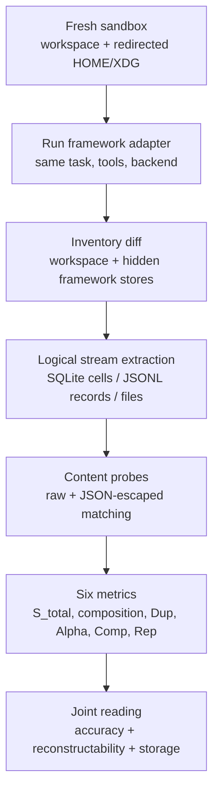

# The Hidden Footprint：把 LLM Agent 的“磁盘遗留物”变成一等评测指标

### 元信息

| 项目 | 内容 |
|---|---|
| 论文 | The Hidden Footprint: Making Storage a First-Class Metric for LLM Agent Evaluation |
| 作者 | Chenglin Yu, Hongquan Gui, Ying Yu, Hongxia Yang, Ming Li |
| 日期 | arXiv v1，2026-07-13 06:44:33 UTC |
| 方向 | 大模型 Agent / Agent 评测 / 持久化与合规成本 |
| 原文 | https://arxiv.org/abs/2607.11149 |
| HTML 全文 | https://arxiv.org/html/2607.11149v1 |
| 代码与数据 | 论文说明 harness、生成器、adapter 与逐 run 记录随 artifact 发布；本轮以 arXiv 正文、TeX source 和补充 PDF 元信息为主证据。 |

### TL;DR

- **这篇论文把 LLM Agent 评测里长期被忽略的一项变成可量化指标**：Agent 完成任务后留在磁盘上的日志、上下文快照、checkpoint、debug trace、session database 和中间状态，不只是“硬盘占用”，还影响桌面部署、fleet 级运营、数据保留、删除义务、审计与故障复现。
- **作者提出 AgentFootprint**：一个跨框架 benchmark 和 measurement harness，用 fresh sandbox 对每个 `(framework, task, repetition)` 运行做前后文件系统 diff，并把原始字节解析成 SQLite cell、JSONL record 等 logical content streams，避免数据库分页和 JSON escaping 掩盖重复内容。
- **指标不是单个 byte count，而是 6 个配套量**：`S_total` 总留存、store composition、`Dup` 重复因子、`Alpha` 增长指数、`Comp` 长窗口可压缩性、`Rep` 0-3 分的 conversation-history reconstructability；论文反复强调这些指标必须和 accuracy、reconstructability 一起读。
- **主实验覆盖 8 个 Agent 框架、1,061 次沙箱运行**：LangGraph 1.2.8、AutoGen 0.7.5、CrewAI 1.15.2、SmolAgents 1.26.0、OpenAI Agents SDK 0.18.0、LlamaIndex 0.14.23、Agno 2.7.1、InfiAgent 3.12.24；同一模型、工具和任务下，100% accuracy 的配置在 retained bytes 上相差 **15.7x**。
- **核心证据很具体**：LangGraph 在 file-QA 上平均留下 5.10MB、CrewAI 0.32MB、OpenAI Agents 0.33MB、SmolAgents 0B；同一条固定 trajectory 通过 7 个持久化框架 adapter 回放，留存大小仍相差 **6.7x**，说明差异不只是 agent 行为，而是 persistence layer 放大。
- **增长风险不是线性的假设**：在反复读取同一个 2KB status file 的 200 轮 stress task 中，full-history checkpoint / snapshot 设计呈 superlinear growth；LangGraph 留下 `323±26MB`，AutoGen `102±21MB`，而 windowed 或 bounded 设计在 1.4-36.4MB 范围。
- **野外验证来自 SWE-bench Verified**：作者抓取 July 2026 snapshot 中 134 个提交，108 个满足 instance-normalized inclusion threshold；每实例 exported trajectory volume 从 6.6KB 到 10.6MB，跨度 **1,617x**，与 resolve rate 无可检测相关性：Kendall `tau_b=0.080`，permutation `p=0.222`。
- ** mitigation 不是“全删掉”**：作者做了一个约 300 行的 content-addressed trajectory store，把 JSON、JSONL、log、SQLite cell 中大于 1KB 的字符串或 blob 拆到 zstd 压缩的 hash store，再用 hash reference 替代；70 runs 上 retention 降低 **4.8x-32.7x**，并保留原 `Rep` 分数。
- **局限要一起读**：受控任务偏 retrieval、retention 和 read-transform-write，不覆盖一般推理；wild data 是导出的 trajectory，不是运行时 residue；`Rep` 只覆盖对话历史重建，不覆盖所有 crash resume、workflow state 和 debug provenance；结果描述的是版本化配置，不是框架永恒属性。

### 1. 研究问题：Agent 完成任务后，为什么“留下多少”也要评测？

Agent 评测通常围绕几类问题：

| 传统评测轴 | 典型问题 | 已有代表 |
|---|---|---|
| task success | 能不能解题、修 bug、完成工具任务 | GAIA、SWE-bench |
| reliability | 多次尝试是否稳定 | pass^k、tau-bench |
| inference cost | token、模型调用、延迟是否值得 | AI Agents That Matter 一类成本分析 |
| tool correctness | 工具调用是否合规 | Agent tool-use benchmark |

这篇论文指出：这些轴都忽略了一个生产系统会真正在磁盘上积累的状态。

作者把问题说成一个 stock-flow 区分：

- **inference cost 是 flow**：
  - 任务结束时，token 和推理费用已经发生；
  - 后续不会自动继续堆积；
  - 通常能按请求计费或清算。
- **retention 是 stock**：
  - 任务结束后，日志、状态、trace、数据库行仍在；
  - 每个任务都会把存量推高；
  - 合规、审计、删除、隐私和迁移都会持续受影响。

论文用一个生产测量例子把量级讲清楚：

| 观测对象 | 数字 |
|---|---:|
| 供应链报价系统单任务 retention | 131MB |
| 其中 framework residue | 79MB |
| delivered artifacts | 2.6MB |
| per-task retention median | 715KB |
| per-task retention p90 | 81MB |
| 约 1,000 recorded rounds 累积 | 约 56GB |
| 若 10,000 rounds/day 且不删除 | 约 560GB/day |

这里的重点不是“磁盘贵不贵”，而是 retained bytes 承载了两类互相冲突的含义：

1. **它可能是必要能力**：
   - replay debugging；
   - crash recovery；
   - compliance audit；
   - postmortem 和错误归因；
   - 复现某次模型调用历史。
2. **它也可能是无谓放大**：
   - 同一段 tool observation 被 checkpoint 多次复制；
   - SQLite page 和 JSON escaping 让重复内容不容易被普通 du 或 chunking 看见；
   - 框架默认保留 debug/event log，但任务本身不需要；
   - 长线程或重复读取时，历史被反复序列化。

因此论文的问题不是“谁写磁盘最少谁最好”，而是：

> 在相同任务成功率和相同可重建能力下，一个 Agent 系统究竟需要留下多少持久化状态？

### 2. 论文主张与论证路线：claim → mechanism → evidence → boundary

| Claim | Mechanism | Evidence | Boundary |
|---|---|---|---|
| Agent 评测缺少 storage footprint 这一资源轴 | 每次运行后，workspace 和 framework-side store 会留下可累积状态 | 调查 leaderboards 与 agent metric catalog；生产案例显示单任务 131MB、全局 56GB 累积 | 论文不声称所有部署都有同等量级，只说明该轴可约束部署 |
| 原始 byte-level 测量会低估重复 | SQLite paging、JSON escaping、chunk boundary 错位会隐藏逻辑重复 | LangGraph checkpoint store raw chunking 给 `Dup=1.01`，但 zstd 可压缩 `142x`；logical stream 后同一 store `Dup=12.1` | logical stream 仍可能漏掉跨表示、多层 encoding 的重复 |
| 同等 accuracy 下，框架默认 retention 差距很大 | 不同 persistence mechanism 保存全历史、窗口、状态、debug log 或空状态 | 100% accuracy 配置 retained bytes 相差 `15.7x`；LangGraph 5.10MB，CrewAI 0.32MB | 默认配置能力不同，不能简单判定高 retention 全是浪费 |
| 差距不只是模型行为造成 | 固定同一 trajectory，用 unmodified adapter 回放到各 persistence layer | fixed-trace control 得到 `6.7x` retained-size spread | 只隔离一个 scripted trajectory，不能穷尽所有 workload |
| 可重建历史不必等于 megabytes | 内容寻址把大块重复内容外置并按 hash 引用 | 70 runs retention 降低 `4.8x-32.7x`，恢复检查与 `Rep` 分数保留 | CAS 是 feasibility reference，不是完整生产存储系统 |
| 野外 trajectory 体积与成功率不显著相关 | SWE-bench Verified 导出轨迹在团队间差异巨大 | 108 systems 每实例体积 `1,617x`，Kendall `tau_b=0.080`, `p=0.222` | exported trajectory 不是 runtime residue，导出策略不同 |

这条论证的结构很工程化：

1. **先定义测量边界**：fresh sandbox 里前后 filesystem delta。
2. **再修正测量对象**：不要只看 raw files，要解析 logical streams。
3. **然后用受控任务比较框架**：同模型、同工具、同任务、三次 repetition。
4. **再隔离 persistence layer**：用 fixed trajectory 控制 agent behavior。
5. **再看野外数据**：SWE-bench exported trajectories 是否也高度分散。
6. **最后给出 headroom demonstration**：content addressing 能否在不损失重建分数的情况下降低留存。

### 3. 方法机制：AgentFootprint 到底测什么？

论文把 footprint 定义为：

```math
Footprint(run) = Bytes_{after}^{sandbox} - Bytes_{before}^{sandbox}
```

但这个式子只是边界，不是最终指标。真正的 measurement pipeline 包括：



论文的四类语义 taxonomy 很重要，因为它避免了“字节越少越好”的幼稚解释：

| 类型 | 含义 | 是否一定可删 |
|---|---|---|
| decisions | 模型输出、决策轨迹，通常不可再生 | 否，可能是审计和复现核心 |
| observations | 工具与环境返回，有些不可再取回 | 不一定，取决于外部环境可重放性 |
| derivations | framework 生成的 snapshot、summary、checkpoint | 可能可压缩或重算 |
| duplicates | 同一内容第二次到第 n 次出现 | 最可能是优化空间 |

### 4. 六个指标：为什么只看 `du -sh` 不够？

论文定义的 6 个指标分别回答不同问题。

| 指标 | 含义 | 研究意义 |
|---|---|---|
| `S_total` | apparent-length filesystem delta，分 workspace artifact 和 framework residue | 最接近运营上会看到的留存总量 |
| Store composition | 按 state/checkpoints、debug/event logs、conversation/actions、other 分组 | 区分“为什么留下” |
| `Dup` | `S_total^logical / S_unique`，基于 logical stream 的 content-defined chunks | 揭示重复内容，而不是被 SQLite / JSON 表象骗过 |
| `Alpha` | 在重复观察任务上拟合 `log S_total ~ Alpha log T` | 判断留存随回合数是 sublinear、linear 还是 superlinear |
| `Comp` | zstd -19 + 128MB long-range window 后的压缩比 | 给出“纯语法压缩”下界，但不等于可在线使用存储 |
| `Rep` | 0-3 分的 conversation-history reconstructability | 表示 retained bytes 能否重建模型在第 k 步看到的对话历史 |

`Rep` 的分级可以写成：

| `Rep` | 解释 |
|---:|---|
| 0 | 没有可用于重建的 retained bytes |
| 1 | 有 bytes，但没有 per-call structure |
| 2 | 有 per-call structure，但 observations 不完整 |
| 3 | 至少一个 channel 有完整、精确记录 |

关键点：

- `S_total` 不能单独读：
  - 0B 可能意味着轻量，也可能意味着不可恢复、不可审计；
  - 5MB 可能意味着保留了完整历史，也可能只是重复放大。
- `Rep` 也不能单独读：
  - 全量保留一切也能拿高分；
  - 目标是 **minimal bytes at exact reconstruction**。

可以把论文追求的目标写成一个 constrained optimization：

```math
\min S_{total}
```

```math
\text{s.t. } Accuracy \ge A_0,\quad Rep \ge R_0,\quad RestoreChecks = pass
```

变量解释：

- `A_0`：任务成功率下限；
- `R_0`：所需重建能力，例如生产调试要求 `Rep=3`；
- `RestoreChecks`：结构化文本 JSON equality、SQLite row-set equality、byte-exact pass-through 等恢复检查；
- `S_total`：不是唯一目标，而是在功能约束满足后的资源目标。

### 5. Benchmark 设计：1,061 次运行如何构成证据？

AgentFootprint 使用 6 类任务，再加一个 control。

| 任务族 | 规模或设置 | 测什么 |
|---|---|---|
| file-QA | 10 个约 60KB 文档、5 个顺序问题，A/B/A/C/A revisit pattern | read amplification 与留存差距 |
| long-horizon | 反复读取 2KB status file，`T in {25,50,100,200}` | `Alpha` 增长指数 |
| write-task | 读两个文档并写 summary file | legitimate artifact vs framework residue |
| exploratory retrieval | 去掉 adversarial 读取结构，允许自由 list/read | 判断差异是否来自人为 stress |
| edit | read-transform-write | 任务成功和 artifact delivery |
| data analysis | read-transform-write | workspace/home 边界与交付位置 |
| fixed-trace control | scripted mock endpoint 回放同一 trajectory | 隔离 persistence layer 放大 |

被测框架与版本：

| 框架 | 版本 | 论文关注的持久化机制 |
|---|---:|---|
| LangGraph | 1.2.8 | SQLite checkpointer |
| AutoGen | 0.7.5 | per-turn state + event log |
| CrewAI | 1.15.2 | task-output store |
| SmolAgents | 1.26.0 | default in-memory / none |
| OpenAI Agents SDK | 0.18.0 | `SQLiteSession` |
| LlamaIndex | 0.14.23 | serialized `Context` |
| Agno | 2.7.1 | SQLite session db |
| InfiAgent | 3.12.24 | task stores + raw traces |

公平性协议：

- 同一 minimal tool set；
- 同一后端模型 DeepSeek-V4-Flash；
- temperature 0；
- 每个任务 3 个 independent repetitions；
- 每个框架使用文档化 durable-session configuration；
- 不为 storage 做手工调优。

这个协议的限制也很清楚：

- 它比较的是 **documented default footprint**；
- 不比较框架在所有可调配置下的最优存储；
- 默认配置支持的 recovery、resume、debug capability 不完全相同；
- 因而 high retention 不能直接等同于 bad design，只能说明它是必须报告的 resource axis。

### 6. 主结果：同样 100% accuracy，字节相差 15.7x

file-QA 主表最能说明问题。

| Framework | `S_total` | `Dup` | Echo | `Comp` | `Alpha` | Acc. | `Rep` | CAS 后 |
|---|---:|---:|---:|---:|---:|---:|---:|---:|
| LangGraph | `5.10±0.58MB` | 12.8 | 8.1x | 136 | `1.74±0.01` | 100% | 3 | 0.50MB, 10.3x |
| AutoGen | `2.49±0.33MB` | 8.4 | 4.1x | 106 | `1.95±0.18` | 86% | 3 | 0.07MB, 32.7x |
| InfiAgent | `2.12±0.05MB` | 1.8 | 1.7x | 43 | 1.15 | 100% | 3 | 0.36MB, 5.8x |
| Agno | `1.15±0.02MB` | 2.5 | 0.8x | 42 | 0.98 | 99.3% | 3 | 0.06MB, 20.5x |
| LlamaIndex | `0.93MB` | 4.2 | 1.3x | 40 | `1.88±0.10` | 100% | 3 | 0.09MB, 10.3x |
| OpenAI Agents | `0.33±0.02MB` | 1.6 | 0.5x | 14 | 0.73 | 100% | 3 | 0.07MB, 4.8x |
| CrewAI | `0.32MB` | 1.5 | 0.5x | 14 | 1.20 | 100% | 1 | 0.05MB, 6.1x |
| SmolAgents | 0B | - | - | - | - | 100% | 0 | - |

这张表支持三层判断：

1. **同样成功，不代表同样运营 footprint**  
   6 个框架答题 100%，但持久化配置差异巨大。

2. **同样 `Rep=3`，也不代表同样字节数**  
   OpenAI Agents 0.33MB 与 LangGraph 5.10MB 都达到 `Rep=3`，但大小差 15x 以上。

3. **0B 不是免费午餐**  
   SmolAgents 默认 0B 且 100% accuracy，但 `Rep=0`，意味着不能从 retained store 复原历史。

论文还拆了 channel composition：

| Channel | 典型框架 | 解释 |
|---|---|---|
| state/checkpoints | LangGraph、Agno、LlamaIndex、OpenAI Agents | 保存 session / checkpoint / context |
| debug/event logs | AutoGen、InfiAgent | 保留事件或 debug 轨迹 |
| conversation/actions | InfiAgent | 原始 action / conversation traces |
| none | SmolAgents | 不持久化，立即成功但不支持重建 |

最值得注意的是 duplication：

- full-history checkpoint / snapshot 设计更容易高 `Dup`：
  - LangGraph 12.8；
  - AutoGen 8.4；
  - LlamaIndex 4.2。
- windowed 或 append-only 设计更低：
  - OpenAI Agents 1.6；
  - CrewAI 1.5；
  - InfiAgent 1.8。

这不是简单的“某框架好坏排名”，而是告诉评测报告应该披露：

```text
success rate + inference cost + retained bytes + reconstructability
```

缺其中任一项，都会误读 Agent 系统的部署成本。

### 7. 增长实验：为什么 full-history 会 superlinear？

long-horizon stress task 固定一个 2KB status file，让 agent 在 `T=25,50,100,200` 轮里反复读取。这个任务把“内容本身增长”排除掉，观察 persistence policy 如何放大同一 observation。

论文把增长拟合为：

```math
\log S_{total} = \alpha \log T + \epsilon
```

解释：

- `T`：回合数；
- `S_total`：任务后留存总字节；
- `Alpha`：增长指数；
- `Alpha≈1`：近似线性；
- `Alpha>1`：superlinear，通常表示历史被反复完整序列化或 checkpoint。

关键结果：

| 框架类别 | `Alpha` 或结果 | 解释 |
|---|---|---|
| LangGraph / AutoGen / LlamaIndex full-history | `Alpha 1.74-1.95` | 每轮持久化越来越大的历史快照 |
| LangGraph at `T=200` | `323±26MB` | 一个 2KB status file 反复监控后留下数百 MB |
| AutoGen at `T=200` | `102±21MB` | 事件日志和 per-turn state 同样放大 |
| InfiAgent / CrewAI / Agno | `Alpha 0.98-1.20` | windowed 或 bounded per-round store |
| OpenAI Agents | `Alpha=0.73` | session log append each message once，sublinear fit |

论文没有把 `Alpha` 说成通用 scaling law，而是明确限定：

- 这是 workload-conditioned full-range fit；
- 四个 horizon、每个三次 seeded run 不足以区分所有函数形式；
- claim 是 measured range 内 superlinear；
- checkpoint-layer consolidation 可能导致局部斜率变化。

这个边界很重要。它避免了把 stress task 的趋势外推成所有真实任务必然增长。但对于长期 Agent、监控 Agent、自动化运维 Agent 来说，它已经足够说明：

> 如果 framework 每轮都 append 全历史快照，长任务的磁盘风险不能用“单轮平均字节”估计。

### 8. Reconstructability：高分历史重建到底怎么验证？

论文没有只让自动脚本看字段，而是做了 reconstructability validation。

验证过程：

1. 对每个 `(framework, task)` 选取运行；
2. 在 logging proxy 后重跑任务，记录每个 model request body；
3. 从 retained bytes 重建 conversation history；
4. 对比：
   - roles；
   - contents；
   - tool-call ids；
   - tool arguments；
   - tool results；
   - order。

结果：

| 项目 | 数字 |
|---|---:|
| 被验证 calls | 194 |
| 精确重建 calls | 194/194 |
| 达到 `Rep=3` 的框架 | 6 个 |
| `Rep=1` | CrewAI |
| `Rep=0` | SmolAgents |

这里有一个容易忽视的点：

- `Rep=3` 只说明能重建 model 所见 conversation history；
- 它不等于完整 workflow crash resume；
- 它不等于 debug provenance 全部保留；
- 它不等于可以满足所有合规审计。

所以论文说：

```text
Rep explains history reconstruction,
not every capability a durable store may serve.
```

这也是为什么作者不把 LangGraph 的 5.10MB 全部判为浪费。更准确的判断是：

- 同样 `Rep=3` 可以在 0.33MB 到 5.10MB 之间实现；
- CAS 后 0.05-0.50MB 范围仍能恢复原 `Rep`；
- 这说明有大量 removable redundancy；
- 但每个框架额外保留的 crash resume、state machine、debug provenance 能力还要单独评估。

### 9. Fixed-trace control：同一条轨迹，为什么仍有 6.7x？

此前实验可能被质疑：

- 某框架让 agent 读了更多文件；
- 某框架 prompt 不同导致轨迹不同；
- 某框架失败较多，所以留存不同。

fixed-trace control 用 scripted mock endpoint 排除这些变量：

| 控制项 | 设置 |
|---|---|
| trajectory | 固定同一条，三次 read、182.7KB observations、一个 answer |
| model | 离线 deterministic mock，不涉及模型策略 |
| adapters | 使用 7 个 persisting frameworks 的 unmodified adapters |
| 变量 | 只剩 persistence mechanism |

结果：

- identical-content amplification 从 `1.03x` 到 `6.86x`；
- spread 为 `6.7x`；
- sequential transport 下 LangGraph 可到 `7.40x`。

这组实验支撑的是一个更窄但更强的 claim：

> 即使 agent 行为完全相同，框架如何序列化、保存、重复、checkpoint 这条轨迹，也会显著改变磁盘 footprint。

它对评测设计的影响很直接：

- 不能只报告模型、prompt、任务；
- framework 和 durable-session configuration 也是实验变量；
- Agent benchmark 应该像报告 token cost 一样报告 retention metric。

### 10. 野外 SWE-bench：导出轨迹越大，成功率越高吗？

作者用 SWE-bench Verified 的 public exported trajectories 做外部校验。

采集边界：

| 项目 | 数字 |
|---|---:|
| July 2026 snapshot submissions | 134 |
| 有 S3 prefix | 115 |
| expose size listings | 113 |
| 满足 90% coverage threshold | 108 |
| multi-entry families | 25 |
| families 总数 | 63 |

结果：

| 指标 | 数字 |
|---|---:|
| mean exported volume per mapped instance 最小 | 6.6KB |
| 最大 | 10.6MB |
| 跨系统 spread | 1,617x |
| Kendall `tau_b` | 0.080 |
| permutation `p` | 0.222 |
| resolve rate 65-75% band 内 spread | 134x |
| IQR | 139-402KB |

解释要谨慎：

- 这些是 exported trajectory，不是 runtime residue；
- 各团队导出策略不同；
- 因此不能拿它直接推断某个系统运行时更浪费；
- 但它能支持一个较弱结论：真实 agent 系统产生和公开的 trajectory volume 高度异质，且在这个 snapshot 里没有证据表明“更大导出体积 = 更高成功率”。

这正好回应了一个常见辩护：

> “我们保留大量轨迹，是因为高质量 Agent 必须这么做。”

论文的回答不是否定保留，而是要求报告：

- 你保留了什么；
- 它支持什么 reconstructability；
- 是否和成功率、debug、审计能力一起形成 Pareto frontier；
- 是否有重复和可内容寻址的优化空间。

### 11. CAS mitigation：内容寻址为什么能降 4.8x-32.7x？

论文的 content-addressed trajectory store 不是新压缩算法，而是可行性参考。

伪代码可以写成：

```text
Input:
  retained stores from framework run
  threshold = 1KB
  supported containers = JSON, JSONL, log lines, SQLite cells

State:
  block_store: hash -> zstd_compressed_block
  rewritten_store: original schema with hash references

Loop:
  for each logical stream in retained stores:
    parse container into fields / cells / lines
    for each string_or_blob larger than threshold:
      h = SHA256(content)
      if h not in block_store:
        block_store[h] = zstd_compress(content)
      replace content with {hash: h, preview: prefix(content)}
    preserve original schema and container layout

Output:
  rewritten_store + block_store

Failure boundary:
  if parser cannot preserve container semantics:
    pass through byte-exact original content
  if restore check fails:
    do not count reduction as valid
```

恢复检查包括：

| Store 类型 | 检查 |
|---|---|
| structured JSON | JSON-object equality |
| SQLite user tables | row-set equality |
| internal / FTS shadow tables | 视为可再生，排除 |
| pass-through files | byte-exact |
| `Rep` | CAS restore 后重新打分，必须复现原分数 |

结果：

| 项目 | 数字 |
|---|---:|
| persisting frameworks | 7 |
| runs | 70 |
| retained files restore checks | 310 |
| retention reduction | 4.8x-32.7x |
| AutoGen 最大 reduction | 32.7x |
| `Rep` 保持 | 全部复现 |

作者还区分了 CAS 和普通 zstd archive：

| 方案 | 好处 | 限制 |
|---|---|---|
| whole-store zstd archive | 更小，例如 LangGraph 约 0.04MB vs CAS 0.50MB | 不解压不能在线使用；不保留 schema-level access |
| CAS | schema-preserving，可按 hash restore | 需要 framework-side shim 才能在线消费引用；垃圾回收、删除语义、跨租户隐私未解决 |

这让论文的结论更稳：

- 不是说 CAS 就是最终生产答案；
- 而是证明 **exact history reconstruction 不需要默认留下的 megabytes**；
- 因此 reporting storage footprint 有实际优化头寸。

### 12. Figure / Table 证据逐项解读

| 图表 | 支撑什么 | 不能证明什么 |
|---|---|---|
| Figure 1 pipeline | fresh sandbox + logical stream extraction + metric suite 的测量路径 | 不证明该 harness 覆盖所有 agent 部署形态 |
| Table 1(a) main results | 8 框架在 file-QA 上的 `S_total/Dup/Alpha/Acc/Rep/CAS` 联合画像 | 不等价于框架永久排名，因为版本和配置会变 |
| Table 1(b) channel composition | retention 来自 checkpoint、debug log、conversation/action 等不同 channel | 不能自动判定每个 channel 是必要还是浪费 |
| Figure 2 growth | repeated-observation stress task 下 full-history 设计 superlinear | 不外推到所有 workload 的长期增长函数 |
| Figure 4 SWE-bench wild | exported trajectory volume 与 resolve rate 无可检测相关性 | 不代表 runtime residue 与成功率也完全无关 |
| CAS column | 内容寻址能在保留 `Rep` 的情况下显著降 bytes | 不解决生产中的删除、GC、隐私隔离和在线引用消费 |

### 13. 相关工作位置：这篇论文补的是哪一块？

论文把自己放在三类工作之间。

| 相关方向 | 代表问题 | 与本文区别 |
|---|---|---|
| Agent benchmark | success、pass^k、tool correctness、任务完成质量 | 本文扩展“评测什么”，不是提出更难任务 |
| Inference cost reporting | token、模型调用、延迟、价格 | 本文关注任务结束后持续存在的 storage stock |
| provenance / workflow tracing | 可追溯、可审计、可复现 | 本文把 tracing 产生的 bytes 作为可比较资源指标 |
| storage amplification | LSM、数据库、压缩、去重 | 本文把这些思想迁移到 Agent trajectory / checkpoint / session store |
| observability 平台 | log、trace、metrics 上报 | 本文提供潜在 reporter metric，而不是替代 observability |

它对 Agent 研究社区的实际贡献是：

1. **把“状态遗留物”从运维细节提升为 benchmark 输出**。
2. **把准确率和存储放到同一张表里**，避免 success-only leaderboard 误导。
3. **把 reconstructability 作为保留理由显式化**，避免简单要求所有框架少写磁盘。
4. **把 serialization-aware measurement 作为方法论提醒**，避免 raw byte chunking 漏掉重复。

### 14. 局限与复现边界

论文的局限写得比较自觉，可以整理成 6 条。

| 局限 | 含义 | 对结论影响 |
|---|---|---|
| controlled suites 范围 | retrieval、retention、read-transform-write，不覆盖一般推理 | 结果不应外推到所有 Agent 能力任务 |
| versioned configurations | 框架版本和文档化配置固定 | 新版本或调参后排名可能变 |
| wild data 类型 | SWE-bench 是 exported trajectory，不是 runtime residue | 野外结论只能支持 volume heterogeneity |
| `Rep` 定义窄 | 只覆盖 conversation-history reconstruction | crash recovery、workflow state、debug provenance 需要另测 |
| roster representative | 8 个框架不是全宇宙 | 不能代表所有闭源或内部框架 |
| fresh sandbox 低估共享线程 | 共享 thread 可产生 95.2MB vs 5.8MB | 长期真实使用可能更糟，不是更轻 |

还有一个重要的配置敏感性检查：

- AutoGen save cadence 最容易争议；
- end-of-run variant 仍为 2.1MB vs 2.49MB；
- `Alpha` 仍为 1.50；
- 说明主结论不是完全由一个保存频率选择制造的。

### 15. 对 Agent 系统研究的延伸问题

这篇论文最有价值的地方，是把 Agent “状态”从功能实现问题变成评测对象。沿着这个方向，后续可以继续追问：

| 问题 | 为什么重要 |
|---|---|
| 能否做 capability-normalized storage benchmark？ | 现在默认配置能力不同，下一步要比较相同 resume/debug/audit contract 下的最小 footprint |
| `Rep` 是否应扩展到 workflow-state reconstructability？ | 生产 Agent 的恢复不只需要对话历史，还需要 planner state、tool state、artifact lineage |
| 存储 footprint 能否进入 Agent training 或 policy selection？ | Agent 可以选择少读、少重复、压缩摘要或 reference by hash |
| 删除权与审计权如何同时满足？ | 合规要求可能既要可审计又要可删除，CAS 和 hash references 会引入新治理问题 |
| Agent benchmark 是否应报告 retention Pareto frontier？ | 类似 accuracy-cost frontier，Agent 系统也需要 accuracy-latency-storage-reconstructability 联合视图 |
| 多租户和跨任务去重是否安全？ | 内容寻址跨用户去重可能泄露存在性信息，需要 privacy-preserving design |

对工程实践来说，本文给出的不是“换某个框架”的结论，而是一个评测 checklist：

```text
每个 Agent benchmark run 至少报告：
1. task success / exact grader / artifact delivery
2. inference cost / latency
3. retained bytes: workspace vs framework residue
4. channel composition
5. Dup / Comp / growth under long horizon
6. Rep or equivalent reconstructability contract
7. deletion / retention policy
```

### 16. 结论：Agent 的“记忆”必须有账本

这篇论文的核心判断可以压缩成三句话：

- **Agent 是否成功完成任务，不足以说明它是否可部署**；如果每次运行都留下大量不可解释的状态，合规、审计、删除和成本问题会在任务结束后继续存在。
- **Agent 是否保留历史，也不足以说明它是否浪费**；必须同时报告可重建能力、状态用途、重复因子和增长曲线。
- **Storage footprint 应该像 token cost 一样成为 Agent 评测的一等指标**；否则 success-only leaderboard 会把很不同的系统误报为同等可用。

本文最值得带走的不是某个框架的排名，而是测量方式：

```text
fresh sandbox
  -> filesystem delta
  -> logical stream parsing
  -> duplication / growth / compression
  -> reconstructability validation
  -> accuracy-storage joint report
```

对大模型 Agent 研究者来说，这相当于把“长上下文、工具轨迹、持久记忆、debug trace”都拉回一个可验证问题：

> 留下来的每一个字节，究竟支持了什么能力？如果支持不了，它为什么还在？
