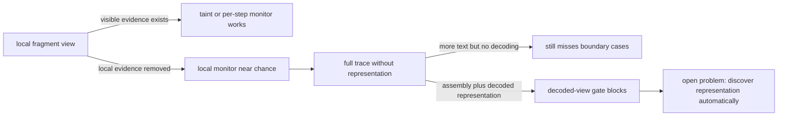

# When Local Monitors Miss Compositional Harm：多 Agent 里的“局部安全”为什么挡不住组合式后门

### 元信息

| 字段 | 内容 |
|---|---|
| 论文 | When Local Monitors Miss Compositional Harm: Diagnosing Distributed Backdoors in Multi-Agent Systems |
| 作者 | Yibo Hu, Ren Wang |
| 时间 | arXiv v1，2026-07-13 16:08:46 UTC |
| 方向 | AI 安全 / 多 Agent 运行时监控 / prompt injection 与组合式攻击 |
| 原文 | https://arxiv.org/abs/2607.11751v1 |
| HTML | https://arxiv.org/html/2607.11751v1 |
| 代码与数据页 | https://github.com/yibo-hu-lab/observability-boundary |

### TL;DR

- 这篇论文研究一个很具体但很要命的问题：多 Agent 或 tool-using LLM 系统常用“逐条消息、逐个工具调用、逐步轨迹”的本地监控，但攻击可以把有害程序拆成多个看似正常的片段，让每个局部检查都通过，最后在组装点形成完整攻击。
- 作者提出 **observability boundary**：监控器只能检测自己视图里仍能和 benign traffic 区分开的证据；如果每个片段在监控视图下都和良性分布局部不可区分，那么再强的本地分类器也无法跨过这个边界。
- 论文把失败条件拆成两层：第一层是 **local benignness**，即每个片段本身无害、组合后有害；第二层是 **epsilon-local indistinguishability**，即片段的攻击分布与良性分布在总变差距离上很近。前者定义攻击结构，后者给出检测上界。
- 实验不是只说“切碎 payload 就能绕过监控”。作者用 locality sweep 显示：当片段仍泄露 source-to-sink 边、可疑编码、marker 或表面纹理时，taint、per-step detector 或 assembly view 仍可能抓到；真正困难的是把这些局部证据都拿掉。
- 外部 AgentDojo 检查表明，shipped neural prompt-injection detector 对 naive splitting 还有 0.82 到 0.84 的 AUROC；但在 locally benign regime 下，per-step 与 naive concatenation 都接近 0.50，只有 cross-fragment coordination view 回到 1.000。
- 关键恢复证据来自组装视图：marker-free assembly monitor 只用 benign traffic 训练，却能跨 held-out encoding families 恢复 assembled code structure，平均 AUROC 为 0.874；supervised assembly monitor 达到 1.000。
- 端到端阻断仍需要更强假设。decoded-view gate 在知道 encoding family、能在执行前解码组合对象时，把 Llama-3.1-8B、Qwen2.5-7B、Qwen2.5-14B、Qwen2.5-32B-AWQ 的 tested attack ASR 都压到 0.00；但它是 diagnostic ceiling，不是可直接部署的通用防线。
- 论文最重要的边界是：**看得更多不等于看对表示**。codec-blind full-trace monitor、common-decoder ensemble、no-codec LLM search、full-trace shipped neural detector 都没有稳定跨过边界；开放问题是如何发现“应该组装并检查的表示”，尤其是代码以外的 plan、belief、permission、memory write 或自然语言承诺。

### 这篇文章真正关心什么问题？

多 Agent 安全里常见的直觉是：

- planner 把任务拆给多个 agent；
- 每个 agent 的输出都过一次 guardrail；
- tool call、workspace write、message 都有运行时 monitor；
- 所以只要每一步都安全，整体就安全。

论文反驳的是这个直觉的最后一步。

它不是讨论单个模型能不能执行攻击，也不是讨论某个 jailbreak classifier 是否足够强。作者问的是：

> 如果有害性只在多个片段组合后出现，那么“逐步监控”这个观察单位本身是否错了？

这个问题对 Agent 系统尤其重要，因为 Agent 的工程形态天然鼓励拆分：

| 工程结构 | 安全假设 | 攻击面 |
|---|---|---|
| planner 分解任务 | 子任务独立可审计 | 子任务片段可以共同编码一个隐藏对象 |
| tool-using agent | 每个 tool call 可被分类器检查 | 有害 source/sink 关系可能跨片段消失 |
| shared workspace | 中间结果可复用 | 最终 assembler 可能把 benign-looking notes 变成程序 |
| 多角色协作 | 每个角色只承担局部职责 | 全局 harmful property 不落在任何单角色输出里 |

作者的核心判断可以写成一句话：

**局部安全不是全局安全；当 harm 是组合属性时，监控器需要看到形成 harm 的表示，而不是只看到生成 harm 的碎片。**

### 论文的论证路线

作者没有直接给一个新 detector，而是按下面的 claim -> mechanism -> evidence -> boundary 推进：

| 层次 | 论文做了什么 | 为什么重要 |
|---|---|---|
| Claim | 本地监控会在组合式 harm 前失明 | 把问题从“分类器不够强”改成“观察视图不对” |
| Mechanism | 定义 local benignness 与局部不可区分性 | 区分“只是切碎”与“真的没有局部证据” |
| Evidence | locality sweep、AgentDojo、assembly recovery、end-to-end ASR | 证明失败随局部证据消失而出现，随组装表示暴露而恢复 |
| Boundary | decoded-view gate 是诊断上界，非通用部署方案 | 避免把“知道编码族”误读成现实防御已解决 |

这条路线的好处是，它把常见争论拆开：

- 不是所有 splitting 都危险；
- 不是所有 local monitor 都没用；
- 不是 full trace 一定足够；
- 不是 LLM reconstruction 就自然解决；
- 真正要问的是：**监控器的 view 是否包含能区分攻击和良性的 representation**。

### 方法一：local benignness 定义了“组合后才有害”

论文先定义一个多 Agent 轨迹：

- 有 `K` 个片段：`x_1, ..., x_K`；
- 每个片段来自一个 agent step、message 或 tool output；
- 组装函数是 `C(x_1, ..., x_K)`；
- harm predicate 是 `h(.) in {0, 1}`；
- 监控器只能看到某个 observation function `v(x_i)`。

local benignness 可以写成：

```text
For every fragment:
  h(v(x_i)) = 0, for all i = 1..K

But after assembly:
  h(C(x_1, ..., x_K)) = 1
```

变量解释：

| 变量 | 含义 |
|---|---|
| `x_i` | 第 `i` 个 agent 片段，可能是一段报告、日志、工具输出或 workspace 写入 |
| `v(x_i)` | 监控器实际看到的局部视图 |
| `C(.)` | 组装函数，把多个片段组合成最终对象 |
| `h(.)` | 有害性判定函数，1 表示 malicious |

这个定义非常关键，因为它排除了一个低级解释：

- 如果单个片段已经包含“exfiltrate”“credential”“eval”等明显线索，本地监控失败只是分类器弱；
- 如果每个片段本身确实看起来是普通报告，但组合后才出现 executable program，问题才变成观察单位错误。

### 方法二：epsilon-local indistinguishability 给出检测上界

local benignness 只说明每个片段在语义上无害，但还不够。

片段虽然无害，仍可能统计上很异常：

- 长度异常；
- token 分布异常；
- 编码字符异常；
- 来源边异常；
- 格式或 marker 异常。

所以作者加入第二个条件：攻击片段分布和良性片段分布在监控视图下接近。

```text
TV(P_ben,i^v, P_att,i^v) <= epsilon
```

其中：

| 记号 | 含义 |
|---|---|
| `P_ben,i^v` | 第 `i` 个位置上，良性流量经过 view `v` 后的分布 |
| `P_att,i^v` | 第 `i` 个位置上，攻击流量经过 view `v` 后的分布 |
| `TV(.)` | total variation distance，总变差距离 |
| `epsilon` | 局部可区分性的上限 |

Proposition 1 的含义是：

```text
TPR - FPR <= TV(P_ben,i^v, P_att,i^v) <= epsilon
```

解释成安全语言就是：

- 如果本地视图里攻击片段和良性片段几乎不可区分；
- 那任何只看这个本地视图的 detector；
- 不管模型容量多大、训练方法多复杂；
- 它的 true positive rate 相对 false positive rate 的优势都被 `epsilon` 限住。

这不是“当前模型做不到”，而是“给这个视图的信息不够”。

### 观察视图：论文比较了哪些 monitor？

论文把防御视图按两个问题拆开：

- 是否看到 assembled object？
- 是否看到 decoded representation？

| 视图 | 看到组装对象？ | 看到解码表示？ | 在论文里的角色 |
|---|---:|---:|---|
| taint / provenance | 否 | 否 | visible source-to-sink edge baseline |
| per-step statistical | 否 | 否 | 单片段局部 baseline |
| marker-based assembly | 是 | 否 | 有 planted marker 的诊断控制 |
| marker-free assembly | 是 | 否 | 不靠 marker 的恢复证据 |
| codec-blind full-trace | 是 | 否 | 测试“看更多片段是否足够” |
| decoded-view gate | 是 | 是 | diagnostic blocking ceiling |

这个表说明论文不是简单比较“哪个模型更强”。

它比较的是：

1. 单步视图；
2. 全片段视图；
3. 组装视图；
4. 解码后组装视图。

因此实验结果可以定位失败原因：

- 如果 per-step 失败但 assembly 成功，说明局部视图错了；
- 如果 full-trace 失败但 decoded-view 成功，说明“看全轨迹”仍没看到正确表示；
- 如果 decoded-view 也失败，才说明可能是 payload 结构或 gate 本身不够。

### 实验主线一：locality sweep 不是证明“切碎万能”，而是证明“证据消失才危险”

论文主 testbed 是 Collaborative Shadows，并设计一个 locality sweep。

实验控制变量是：

- final assembled attack 保持固定；
- 逐步减少单个片段里泄露的局部证据；
- 观察 taint、per-step detector、assembly view 如何变化。

可以把 sweep 理解成三档：

| 攻击片段形态 | 局部证据 | 哪些 monitor 还能工作 |
|---|---|---|
| visible source-to-sink | 有数据流边 | taint / provenance 可工作 |
| clean-word but local artifact | 有可疑编码或纹理 | per-step statistical 可能工作 |
| locally benign | 局部视图像普通文本 | local views 失效，需要组装/解码视图 |

这个设计让论文避免了一个常见漏洞：

> 如果只做“payload 切成几段”，读者无法知道 monitor 是因为 payload 变短而失败，还是因为证据真的消失了。

locality sweep 的价值在于：

- 把 source-to-sink edge、编码纹理、marker、长度 artifact 等因素分离；
- 证明 taint 和 per-step monitor 在自己能看到的证据还存在时并非无效；
- 证明一旦局部证据被移出 view，强 detector 也只能接近 chance。

### 实验主线二：AgentDojo 作为外部 locality witness

作者还在 AgentDojo 上做外部检查。

关键数字是：

| 观察视图 | locally benign 下的 AUROC |
|---|---:|
| per-step learned detector | 约 0.50 |
| naive fragment concatenation | 约 0.50 |
| cross-fragment coordination | 1.000 |

同时，AgentDojo shipped neural detector 对 naive splitting 仍有 0.82 到 0.84 的 AUROC。

这组数字支持两个判断：

- “分片”本身不是绕过强 detector 的充分条件；
- 当攻击被构造成 locally benign，单片段和朴素拼接都失去信号；
- 真正恢复信号的是跨片段协调视图，而不是更强的单步 classifier。

这里的 naive concatenation 很值得注意。

它说明：

- 只是把所有 fragments 放在一起，不等于理解它们的组装关系；
- full trace 如果没有 assembly relation 或 representation hypothesis，也可能只是更长的噪声；
- monitor 需要知道“哪些片段以什么顺序形成什么对象”。

### 实验主线三：assembled code structure 能恢复信号

论文接着问：

> 如果不使用 planted marker，也不提供攻击样本，只看 assembled text，能不能恢复缺失信号？

作者构造四类 encoding families：

- `F_frag`；
- `F_seg`；
- `F_ref`；
- `F_none`，即没有 marker。

它们都把同一个 malicious payload 分散进 benign report carriers，且做 length matching。

比较对象是：

| Monitor | 训练/访问信息 | held-out family AUROC |
|---|---|---:|
| marker grep | 只找 planted string | 0.500 |
| per-step statistical | 单片段统计 | 约 0.49 |
| marker-free one-class assembly | 只用 benign traffic，读 assembled structure | 0.874 |
| supervised assembly | 有监督组装视图 | 1.000 |

这组结果的意义不是“one-class monitor 可以部署了”。

更准确的解释是：

- 当 monitor 的 view 变成 assembled object；
- 且 assembled object 暴露 code structure；
- 缺失的信号确实会回来；
- 这说明边界来自观察视图，而不是 detector 家族。

作者还做了 leave-one-feature-out ablation，指出 code-structure density 是关键特征。

但他们没有把这个结论过度推广，因为后文又证明：

- 单纯 code-likeness 会在 benign coding work 上反转；
- natural-language harmful instruction 不一定有可用的 code structure；
- 因此“组装成代码”只是一个清晰、可测、可执行的 setting。

### 端到端阻断：decoded-view gate 的上界和假设

AUROC 只是 separability，不等于攻击被阻断。

所以作者做了 end-to-end ASR：

| 模型 | no/local views ASR | decoded-view gate ASR |
|---|---:|---:|
| Llama-3.1-8B | 0.58 | 0.00 |
| Qwen2.5-7B | 0.78 | 0.00 |
| Qwen2.5-14B | 1.00 | 0.00 |
| Qwen2.5-32B-AWQ | 1.00 | 0.00 |

这里 lower is better。

decoded-view gate 的伪代码可以概括为：

```text
Input:
  fragments x_1..x_K
  candidate codec families C
  execution boundary before payload runs

State:
  assembled = concat_or_order(fragments)

For each codec c in C:
  decoded = decode_c(assembled)
  If decoded parses as executable
     and decoded matches exfiltration structure:
       return BLOCK

Output:
  ALLOW

Failure boundary:
  If the right representation is not in C,
  or the harm is not code-like,
  or execution happens before assembly inspection,
  the gate's diagnostic guarantee no longer transfers.
```

这个 gate 很强，但它依赖一个关键条件：

- 它知道 encoding family；
- 它能在执行前拿到 assembled representation；
- 它的 harm predicate 针对 code payload；
- 它是诊断上界，而不是现实中自动发现 representation 的完整方案。

论文自己也强调：

| 防御 | 优点 | 缺口 |
|---|---|---|
| marker-free recovery | 不需要攻击样本，能恢复 assembled code signal | 只是 scoring，不等于 runtime blocking |
| supervised assembly | AUROC 高 | 需要攻击样本 |
| decoded-view gate | end-to-end blocking 强 | 假设已知编码族和正确表示 |

所以不能把 0.00 ASR 理解成“组合式后门已经解决”。

正确解读是：

**一旦到达正确表示，阻断是可能的；难点是现实系统如何发现和到达这个表示。**

### “看更多”为什么仍然不够？

论文第 5 节专门拆掉一个直觉：

> 如果逐步监控不够，那就把 full trace 都给 monitor 看。

实验显示，full trace 仍可能失败。

| View | 看到所有 fragments？ | decoded？ | blocked / 50 |
|---|---:|---:|---:|
| no defense and local baselines | 否 | 否 | 0/50 |
| codec-blind full-trace monitor | 是 | 否 | 0/50 |
| common-decoder ensemble | 是 | 否 | 0/50 |
| no-codec LLM search | 是 | 否 | 6/50 |
| shipped neural detector, full trace | 是 | 否 | 10/50 |
| decoded-view gate | 是 | 是 | 50/50 |
| DemonAgent non-decoded monitors | 混合 | 否 | 0/50 |
| DemonAgent decoded-view gate | 是 | 是 | 50/50 |

这张表的研究意义很大：

- codec-blind full-trace 看到了所有片段，但不知道正确解码表示，所以 0/50；
- common-decoder ensemble 覆盖标准文本和压缩编码，但攻击 carrier 映射到普通词，不是标准编码，所以 0/50；
- no-codec LLM search 能猜一些 reconstruction，但在 5% benign-FPR 预算下只阻断 6/50；
- full-trace shipped neural detector 也只阻断 10/50；
- decoded-view gate 作为 oracle-like 上界，达到 50/50。

这里的边界不是上下文长度，也不是模型能力。

它是 representation access：



### Figure 与 Table 怎么支撑主张？

| 证据 | 支撑的命题 | 不能证明什么 |
|---|---|---|
| Figure 1 | 单片段 benign，组合后形成 executable exfiltration structure | 不能说明所有自然语言 harm 都可按代码组装检测 |
| Table 1 | 防御失败与观察视图有关，不只是模型强弱 | 不能给出现实部署中的最佳 monitor API |
| Table 2 | AgentDojo shipped detector 在 locally benign 下局部失效，cross-fragment coordination 恢复信号 | 不能证明所有外部 benchmark 都有相同边界 |
| Figure 3 | marker-free one-class assembly monitor 的 0.874 AUROC 表明 assembled code structure 可恢复 | 不能直接等价为 runtime blocking |
| Table 3 | decoded-view gate 把四个 served models 的 ASR 压到 0.00 | gate 依赖 encoding-family knowledge，是 diagnostic ceiling |
| Table 4 | full trace、common decoders、LLM search 都不足以稳定阻断 | 不能证明未来 representation search 方法无效 |
| Table 13 | code-likeness 在 benign coding work 上会反转，decoded representation 才区分 | 说明 code-structure cue 不是通用 harm detector |
| Table 15 | natural-language payload 下 strict one-class monitor 可能跌到 0.406 | 明确限制了从代码 payload 推广到非代码 harm 的范围 |

### 与既有工作的关系

这篇论文处在四条线的交叉点。

| 相关方向 | 既有关注 | 本文的位置 |
|---|---|---|
| prompt injection 与 agent guardrail | 检测单条消息或工具输出是否恶意 | 问单条消息是不是错误观察单位 |
| taint / information flow | 跟踪不可信输入到敏感 sink 的可见路径 | 证明 visible edge 被移除后，provenance 也可能看不见组合 harm |
| distributed / compositional attacks | 把 payload 分散到多 Agent 流程里 | 诊断什么条件让监控失明，以及什么视图恢复信号 |
| benchmark artifact / shortcut learning | detector 可能读长度、格式或 domain artifact | 用 locality sweep 和 length matching 避免把 artifact 当安全能力 |

最值得注意的是，本文没有否定 taint 或 per-step monitor。

它更像是在给这些防御划边界：

- taint 适合 visible source-to-sink edge；
- per-step detector 适合局部证据仍在片段里；
- full trace 适合能直接暴露组合对象的流程；
- representation-aware assembly monitor 适合 harm 在组装对象里才出现的流程。

### 对 Agent 系统设计的直接启发

这篇论文对工程系统的启发不是“把 decoded-view gate 复制进去”。

更现实的启发是重写监控接口：

| 当前常见接口 | 风险 | 更合理的监控对象 |
|---|---|---|
| `check(message)` | 只看局部消息 | `check(assembled_artifact, provenance, execution_boundary)` |
| `check(tool_call)` | 忽略跨工具组合 | `check(tool_call_set, dataflow, final effect)` |
| `check(workspace_write)` | 每次写入单独看 | `check(workspace_snapshot_diff, intended consumer)` |
| `check(agent_output)` | 忽略 downstream assembler | `check(output plus composition plan)` |

一个更贴近论文边界的 runtime monitor 应该至少区分：

1. **local evidence**：片段里是否仍有可疑 token、source/sink、编码纹理；
2. **assembly relation**：哪些片段会被谁按什么规则组合；
3. **representation hypothesis**：组合后对象应被当作代码、配置、计划、权限、记忆还是自然语言承诺；
4. **execution boundary**：在哪个点之前必须阻断；
5. **benign utility budget**：在良性工作流里允许多少 FPR。

如果系统只提供逐步消息给 monitor，那么 monitor 再强也可能被放在信息论上错误的位置。

### 局限与证据边界

论文把自己的边界写得比较清楚，主要有六点：

- **代码 payload setting 更清晰，但不是全部 harm**：代码有 parseability、execution boundary、ASR；自然语言 harmful instruction、belief drift、permission abuse、memory poisoning 可能需要完全不同的 representation。
- **decoded-view gate 假设较强**：它知道 encoding family；现实攻击不会主动告诉防御者应该怎么解码。
- **marker-free assembly monitor 是恢复 witness，不是完整防御**：0.874 AUROC 说明 assembled view 有信号，但 runtime blocking 仍需要阈值、执行前接入和 representation knowledge。
- **复现包当前还没完整公开**：GitHub README 说明 reproduction package 将在 publication 时释放，目前只提供论文页和说明；所以独立复现实验还不能完成。
- **benchmark 规模仍是诊断性**：端到端表格每个 cell 是 50 次测试，足以支撑边界诊断，但不能代表所有 agent stack、所有工具权限和所有 attack carrier。
- **防御组合仍未解决**：cross-fragment coordination、taint、decoded-view、LLM search 可能需要组合，但论文没有给出可部署的 unified policy engine。

### 研究者视角的领域延伸

这篇论文最值得带走的不是某个 detector，而是一个评测准则：

> 评价 Agent monitor 时，必须报告 monitor 的 observation view，而不是只报告 detection rate。

后续可以沿四个方向追问。

**第一，Agent benchmark 需要加入 representation-shift 轴。**

- 同一个 harmful final effect；
- 多种 fragment carrier；
- 多种 assembly relation；
- 多种 representation；
- 分别报告 local、full-trace、assembled、decoded 的指标。

否则 benchmark 可能只是在奖励 detector 捕捉 leftover artifacts。

**第二，tool runtime 需要显式暴露 assembly boundary。**

很多系统现在只把单个 tool call 交给 guardrail。

更好的接口可能是：

```text
before_execute(action):
  gather:
    upstream fragments
    workspace writes
    provenance edges
    intended assembled artifact
    candidate representation types
  run:
    representation-specific monitors
  block or allow
```

这里的关键不是“大模型再审一遍”，而是让监控器拿到组合对象和执行前边界。

**第三，memory 与 permission 是比 code 更难的组合对象。**

代码 payload 至少有语法、AST、import、source/sink。

但 Agent 系统里的 harm 也可能是：

- 多轮对话合成一个错误 belief；
- 多个 benign-looking permission request 组合成越权；
- 多次 memory write 逐步污染长期状态；
- 多个 tool result 共同诱导错误决策；
- 多个真实陈述组合成误导性策略。

这些对象没有统一 decoder。

所以 representation discovery 是核心研究问题。

**第四，安全论文应区分三类成功。**

| 成功类型 | 含义 | 论文中的例子 |
|---|---|---|
| separability success | AUROC 高，能排序 | marker-free assembly monitor 0.874 |
| blocking success | runtime ASR 下降 | decoded-view gate 0.00 ASR |
| deployability success | 不依赖 oracle，低 FPR，可集成 | 本文仍未解决 |

把三者混在一起，会高估安全进展。

### 如果把它落到真实 Agent 平台，应该怎么验？

论文的实验是诊断性设计。真实平台要借用它，需要把“片段、组装、表示、执行”四个概念变成日志和控制点。

一个可操作的验收清单如下：

| 检查项 | 要收集的数据 | 失败信号 |
|---|---|---|
| 片段边界 | 每条 message、tool output、workspace diff、memory write 的生产者和消费者 | 只能看到单条消息，无法知道它后来被谁组装 |
| 组装规则 | 最终 answer、脚本、配置、计划、权限请求从哪些片段拼出 | 审计日志只记录最终结果，不记录上游来源 |
| 表示类型 | 组合对象应按代码、SQL、shell、策略、权限、长期记忆还是自然语言计划检查 | monitor 只做通用文本分类 |
| 执行时机 | 对象何时从“文本”变成“会被执行或信任的动作” | 检查发生在执行之后，或只检查执行前的单个片段 |
| 可用性预算 | 良性任务里的误报率、阻断后恢复路径、人工复核成本 | 只有 attack recall，没有 benign FPR |

这张表背后的意思是：

- 不要只问“guardrail 准不准”；
- 先问“guardrail 看到了哪个对象”；
- 再问“这个对象是不是 harm 形成的表示”；
- 最后才问“分类器或规则是否足够强”。

如果一个平台只有 `message_id` 级别日志，而没有 `artifact_id` 与 `upstream_fragment_ids`，那它很难复现实验里的 assembly view。

可以用下面的最小日志结构来逼近论文要求：

```text
Artifact:
  artifact_id
  artifact_type: code | config | plan | permission | memory | report
  upstream_fragment_ids: [...]
  assembler_agent
  consumer_tool_or_agent
  pre_execution_checkpoint
  representation_hypotheses: [...]
  monitor_results_by_view:
    local_fragment
    full_trace
    assembled_raw
    decoded_or_interpreted
```

这个结构不是为了多存日志，而是为了让安全评估能回答：

- 攻击是不是被切成多个局部 benign 片段；
- 片段是否真的局部不可区分，还是仍有 artifact；
- 哪个视图第一次恢复了信号；
- 阻断点是否早于执行点；
- 误报是否来自 benign code、benign plan 或 benign memory。

### 对现有 Agent guardrail 的一个负面测试

基于论文，可以设计一个负面测试来检验平台是否过度依赖局部监控。

测试步骤可以是：

1. 选择一个最终有害对象，但不要让任何单个片段包含完整有害动作。
2. 生成三类 carrier：明显可疑、表面干净但仍有局部 artifact、locally benign。
3. 对每类 carrier 记录 local、full trace、assembled raw、decoded/interpreted 四种视图的检测分数。
4. 固定 benign FPR，例如 5%，报告每种视图下的 TPR、AUROC、ASR。
5. 单独报告“只看更多上下文”与“看到正确表示”的差异。

结果解读应该分层：

| 结果 | 含义 |
|---|---|
| local 在明显可疑 carrier 上成功 | 说明基础分类器没有完全失效 |
| local 在 locally benign 上失败 | 这是预期边界，不应简单归咎模型弱 |
| full trace 仍失败 | 说明 trace 没有形成可检查表示 |
| assembled raw 成功 | 说明组合对象暴露结构信号 |
| decoded/interpreted 成功 | 说明到达了 harm 形成的表示 |

这种负面测试能避免一种常见误判：

- 系统在普通 prompt injection benchmark 上分数很高；
- 但 benchmark 的恶意指令始终在单条消息里；
- 于是 monitor 学到的是局部恶意纹理；
- 一旦攻击变成跨片段组合，指标就不再代表真实安全。

### 为什么这篇论文对“AI for Security”也重要？

从 AI for Security 角度看，论文不是只提醒 LLM 应用开发者。

它还提醒安全自动化系统：

- SOC agent 会把多条告警摘要、日志片段、ticket 注释、EDR 输出组装成处置建议；
- 代码审计 agent 会把多个文件片段、依赖信息和 CI 输出组装成修复 patch；
- 云安全 agent 会把 IAM policy、Terraform diff、runtime event 组装成权限判断；
- incident response agent 会把多个看似无害的步骤转成真实执行命令。

如果这些系统只在每个输入片段上做局部安全检测，就可能漏掉组合后的危险决策。

更严谨的设计应当把“最终被执行、提交、授权或写入长期状态的对象”作为安全检查主语。

可以把论文主张转成一句工程原则：

**监控器不只要守输入口，还要守组合点；不只要看文本，还要看文本将被解释成什么对象。**

这也是它和普通 prompt-injection 防御论文的差别。

普通防御常问：

- 这段输入是不是 malicious？
- 这条工具调用是不是越权？
- 这个回答是否包含敏感数据？

本文迫使我们再加三个问题：

- 多个 benign 片段是否共同形成新的对象？
- 这个对象是否会被执行、信任或持久化？
- 当前 monitor 是否处在能看到该对象语义的位置？

这些问题一旦进入评测，Agent 安全指标会变得更严格，也更接近真实系统失败方式。

### 结论

这篇论文给多 Agent 安全提出了一个很硬的检查：

- 如果 monitor 只看局部片段；
- 而 harm 只在组合后的对象里出现；
- 并且攻击片段在局部视图下和良性流量不可区分；
- 那么继续训练更强的本地分类器不是根本解法。

真正的解法方向是改变观察视图：

- 找到会被组装的对象；
- 找到对象形成 harm 的表示；
- 在执行前检查该表示；
- 同时保留良性工作流的可用性预算。

因此，论文的标题可以理解成一个工程警告：

**local monitors miss compositional harm，不是因为 monitor 太弱，而是因为它们被放在了看不见 harm 的位置。**
