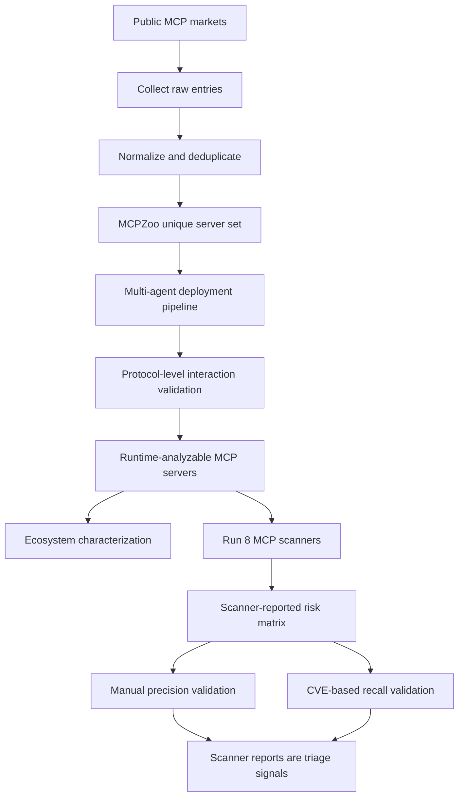

# Rethinking MCP Security：把 MCP 安全从“扫描器告警率”拉回运行时证据

## 元信息与 TL;DR

| 项目 | 内容 |
| --- | --- |
| 论文 | Rethinking MCP Security: A Large-Scale Study of Runtime MCP Servers and Security Scanner Reliability |
| 方向 | AI 安全 / Agent 工具协议 / MCP 运行时测量 |
| 原文 | https://arxiv.org/abs/2607.11086v1 |
| HTML | https://arxiv.org/html/2607.11086v1 |
| 发布时间 | 2026-07-13 04:55:16 UTC |
| 本轮状态 | Scout 第 1 位候选 `2607.11751v1` 已在当前 data 树中发布；本文从同一 Scout 表内 pivot 到第 2 位 MCP 安全测量论文。 |

### TL;DR

- **这篇论文要解决的问题**：MCP 已经成为 LLM Agent 调工具、连服务、执行外部动作的标准接口，但生态安全判断常常只来自扫描器告警。作者的问题不是“有没有风险”，而是“这些告警能不能代表真实漏洞”。
- **作者怎么做**：论文构建 MCPZoo，把公开市场里的静态 MCP 仓库转成可运行、可交互、可动态分析的服务。核心流程不是简单爬仓库，而是用多 Agent 流水线推断环境、生成 Dockerfile、启动服务、做协议级验证，再根据失败日志迭代修复。
- **关键规模数字**：MCPZoo 从 10 个市场收集 156,842 条原始记录，得到 113,927 个有效 MCP server，其中 64,611 个去重唯一；67,207 个总 server、37,288 个唯一 server 支持动态分析，唯一 server 的动态支持率是 **57.71%**。
- **生态测量结论**：生态表面规模被 forks、mirrors 和模板复制放大；78.6% 的 server 没有 Dockerfile；即使 Dockerfile、README、配置齐全，原生无修改运行成功率也只有 **19.6%**。多数 server 工具数少于 10，但最大 server 暴露 **8,816** 个工具，37.66% 的工具能力属于高风险类。
- **扫描器可靠性结论**：8 个 MCP 安全扫描器中，至少一个扫描器把 **96.89%** 的可交互 server 标为 risky，但人工抽样验证的平均 precision 只有 **45.53%**，最差扫描器只有 **10.40%**；扫描器集合之间平均 Jaccard 相似度只有 **15.66%**，基于 10 个 CVE 的已知漏洞 recall 只有 **24.17%**。
- **为什么重要**：论文把 MCP 安全讨论从“扫描器说大多数 server 有风险”改写成“扫描器告警只是 triage signal”。对 Agent 安全研究来说，真正需要的是可运行语料、协议交互、可复现 scanner benchmark、人工或 CVE ground truth，以及把 capability risk 和 confirmed vulnerability 分开的证据链。
- **局限**：MCPZoo 仍会偏向容易自动部署的 server；需要 API key、硬件、私有环境的 server 可能被低估；扫描器版本和 LLM 后端会变化；CVE ground truth 只有 10 个漏洞，足以暴露 recall 缺口，但还不是完整漏洞基准。

### 本轮 Scout 候选与选择

| 排名 | category_id | 候选 | 日期证据 | 处理 |
| ---: | --- | --- | --- | --- |
| 1 | ai-safety | When Local Monitors Miss Compositional Harm | arXiv v1: 2026-07-13 | 当前 data 树已发布 `itm_550ffc8e8839a7a1`，按 duplicate rule 放弃。 |
| 2 | ai-safety | Rethinking MCP Security | arXiv v1: 2026-07-13 | 选中；同属 AI 安全，但主题从组合式后门转为 MCP 运行时测量与扫描器可靠性。 |
| 3 | ai-safety | AMT-X | arXiv v1: 2026-07-13 | 备选；多轮红队主题和近期 AHA coverage 更接近。 |
| 4 | ai-safety | MJ: Multi-turn LLM Jailbreaking | arXiv v1: 2026-07-13 | 备选；更偏 jailbreak RL credit assignment。 |
| 5 | llm-agent | MM-ToolSandBox | arXiv v1: 2026-07-13 | 备选；视觉工具 Agent benchmark，和 MCP 安全不是同一问题。 |

## 1. 研究问题：MCP 安全为什么不能只看扫描器？

MCP 的安全边界和传统库扫描不同：

- **传统依赖库**多半是在应用里被调用，风险通常落在 API、权限、输入校验或版本漏洞上。
- **MCP server**直接变成 Agent 的工具端点，承接文件读写、网络请求、命令执行、数据库访问、消息发送等动作。
- **LLM Agent**会把自然语言目标转成工具调用，因此 server 的描述、参数 schema、返回内容和运行时副作用都会进入安全边界。

论文把问题压成两个研究问题：

| 研究问题 | 不是在问什么 | 真正在问什么 |
| --- | --- | --- |
| RQ1: MCP 生态在真实运行时是什么样？ | 不是数 GitHub 仓库或市场条目。 | 哪些 server 能部署、能协议交互、暴露哪些工具能力、复制和重名有多严重。 |
| RQ2: MCP scanner 是否可靠？ | 不是看哪个 scanner 报得最多。 | 告警是否有真实可达行为证据，不同 scanner 是否一致，能否发现已知 CVE。 |

这个问题意识很重要。若只看扫描器汇总，结论会是“几乎所有 MCP server 都 risky”。但如果告警来自 metadata 模式、关键词、宽泛 capability 或 LLM 猜测，用户和开发者会同时遇到两类错误：

| 错误 | 后果 |
| --- | --- |
| 把低置信告警当 confirmed vulnerability | 大量精力投入不可复现或不可达风险，生态看起来比实际更坏。 |
| 把低告警率当安全 | 扫描器没有覆盖的真实漏洞被忽略，尤其是运行时交互和版本相关问题。 |

## 2. 论文主张与论证路线

作者的主张不是“MCP 很安全”或“MCP 很危险”，而是更窄、更可验证：

| Claim | Mechanism | Evidence | Boundary |
| --- | --- | --- | --- |
| 生态规模不能直接由市场条目代表。 | 对 10 个市场采集、清洗、去重，并计算 overlap / exclusivity。 | 156,842 raw entries 最终变成 64,611 unique valid servers；模板复制和跨市场重叠显著。 | 去重依赖仓库、市场元数据和实现相似性，仍可能漏掉私有或闭源 server。 |
| 大规模运行时测量需要先解决部署问题。 | 多 Agent 框架推断环境、生成 Dockerfile、验证协议、诊断失败。 | 唯一 server 中 37,288 个支持动态分析；全局 dynamic rate 57.71%。 | 自动化部署会偏向依赖清晰、无需私钥或外部设备的项目。 |
| MCP server 暴露的工具能力具有安全含义。 | 把 tool capability 分成执行、写本地、出站传输、读本地、读远程、prompt 等类别。 | 高风险工具占 37.66%；最大 server 暴露 8,816 个工具。 | capability risk 不等于漏洞，只说明潜在影响面。 |
| 当前 scanner 告警不能直接代表漏洞率。 | 8 个 scanner 在同一 MCPZoo 上统一运行，再做人工抽样和 CVE recall。 | 96.89% 被至少一个 scanner 标 risky，但平均 precision 45.53%，CVE recall 24.17%。 | 人工验证和 CVE 集合仍有限，不能给出完整真实漏洞率。 |

### 论证结构图



这张图可以看出论文的关键转折：

- 数据集不是终点，**可运行状态**才是测量起点。
- 扫描器不是终点，**验证告警是否对应可达行为**才是安全判断起点。
- 风险类别不是漏洞标签，**scanner agreement、人工 precision、CVE recall**共同决定它是否能支撑生态级结论。

## 3. MCPZoo 方法机制：从静态仓库到可运行 server

### 3.1 为什么要用多 Agent 构建？

真实 MCP 仓库常见失败不是单一类型：

- 缺 Dockerfile；
- README 与当前代码不同步；
- `.env` 或配置示例不完整；
- Python / Node / package manager 版本不一致；
- server 能启动但无法完成 MCP initialize / tools/list / tools/call；
- 工具需要额外参数、token 或服务依赖；
- 市场条目指向 fork、mirror、模板副本或过期仓库。

所以作者把构建过程拆成多个角色，而不是用一个静态脚本：

| 模块 | 输入 | 动作 | 输出 |
| --- | --- | --- | --- |
| Collection | 多个 MCP 市场、NPM、PyPI 等入口 | 收集 raw entry，归一化元数据，去重 | server candidates |
| Environment inference | 仓库文件、package 配置、README | 判断语言、依赖、启动命令、配置需求 | runtime hypothesis |
| Dockerfile generation | runtime hypothesis | 生成或修补容器启动环境 | container build plan |
| Protocol verification | running container | 执行 MCP 协议交互，检查 initialize / tool list / invocation | success / failure logs |
| Failure diagnosis | build logs、runtime logs、协议错误 | 推断缺依赖、入口错误、配置缺口并迭代 | repaired deployment attempt |

### 3.2 伪代码化理解

```text
Input:
  S = collected MCP server repositories
  P = MCP protocol checks
  B = deployment budget per server

State:
  deployment_hypothesis
  build_log
  runtime_log
  protocol_trace

For each server s in S:
  infer language, package manager, entrypoint, config from repository artifacts
  generate Dockerfile and launch command

  For attempt in 1..B:
    build container
    if build fails:
      diagnose dependency or environment error
      refine Dockerfile
      continue

    launch server
    run MCP protocol checks P
    if initialize and interaction checks pass:
      mark s as dynamic-analysis-capable
      store validated runtime metadata
      break

    diagnose startup or protocol failure
    refine launch command, config, or dependency plan

Output:
  MCPZoo dynamic subset
  failure labels for non-deployable servers
  runtime metadata for scanner evaluation
```

这里最值得注意的是 **protocol verification**。如果一个 server 只是容器启动了，但不能完成 MCP 交互，它对 Agent 安全测量没有太大意义。论文要求通过真实协议交互来证明 server 可被动态分析，这比“仓库存在”或“进程启动”更严格。

## 4. 数据规模：MCPZoo 到底覆盖了什么？

### 4.1 Table 2：市场条目、有效 server、动态子集

| 口径 | 数量 | 解释 |
| --- | ---: | --- |
| Raw entries | 156,842 | 来自 10 个 MCP 相关市场或包生态的原始条目。 |
| Valid servers | 113,927 | 清洗后仍可作为 MCP server 记录的条目。 |
| Unique valid servers | 64,611 | 去重后的唯一 server 数。 |
| Dynamic servers, total | 67,207 | 原始条目口径下支持动态分析的 server。 |
| Dynamic servers, unique | 37,288 | 唯一 server 口径下支持动态分析的 server。 |
| Unique dynamic rate | 57.71% | 去重唯一 server 中能进入运行时分析的比例。 |

这个表支撑论文的第一个边界判断：

- MCP 生态的表面规模很大，但 raw entry 到 unique valid server 之间有明显压缩。
- 若做安全测量，应该区分 **collected**、**valid**、**unique**、**dynamic** 四个口径。
- 静态规模越大，不代表运行时证据越强；真正能被交互验证的子集才适合 scanner benchmark。

### 4.2 Table 3：部署工件与运行成功率

| 部署工件 | 原生成功 | Agent 修复后成功 | 失败 | 关键含义 |
| --- | ---: | ---: | ---: | --- |
| Docker + README + Config | 19.6% | 49.9% | 30.5% | 材料最完整时，原生运行也只有约五分之一成功。 |
| Docker + README | 13.7% | 36.6% | 49.7% | 缺配置会明显拖累部署。 |
| Docker only | 10.5% | 40.4% | 49.1% | 只有容器文件不足以支撑协议级运行。 |
| README + Config | 0% native | 64.4% | 35.6% | 没有 Dockerfile 时，多 Agent 推断贡献最大。 |
| README only | 0% native | 46.8% | 53.2% | 文档可帮助推断，但失败仍过半。 |
| 无明显工件 | 0% native | 43.3% | 56.7% | 自动化仍可救一部分，但偏差不可避免。 |

这个结果对 Agent 工具安全很现实：

- 很多 MCP server 不是“安全分析还没跟上”，而是 **连稳定复现运行时都很难**。
- 如果 scanner 只扫描静态文件，它会错过 runtime-only 行为。
- 如果 scanner 依赖 live endpoint，它又会受部署成功率制约。
- 所以 scanner benchmark 必须报告 coverage，否则 precision / recall 的解释都会失真。

## 5. 工具能力：风险面来自 capability，不等于漏洞

论文把工具能力按数据流和副作用拆开。这个拆法比“server 属于哪个应用领域”更接近安全问题。

| 风险层级 | 能力类型 | 安全含义 |
| --- | --- | --- |
| High | Command & Script Execution | 可执行 shell、脚本、数据库查询或进程操作；若被 Agent 错用，可能直接改变系统。 |
| High | Local File Modification | 写入、删除、移动、修改文件；和 ransomware、配置污染、持久化后门相关。 |
| High | Outbound Data Transfer | 上传、发送邮件、发布消息、外传数据；和数据泄露、越权通知相关。 |
| Medium | Local Info Retrieval | 读取本地文件、截图、目录结构；隐私风险高，但通常还需后续外传才形成泄露。 |
| Medium | Remote Info Retrieval | 搜索、浏览、抓取网页或 API；会引入间接 prompt injection 和数据污染。 |
| Medium | Prompt Provision | 给模型提供上下文、memory、reflection 或 prompt；可能改变 Agent 的后续目标解释。 |
| Low | Utilities / Others | 纯计算、格式转换、时间等低副作用工具。 |

论文报告高风险工具能力占 **37.66%**，中风险占 **56.02%**。这不是在说 37.66% 的工具有漏洞，而是说明 MCP server 的能力分布天然靠近高影响操作：

- 文件修改和命令执行会改变本地系统状态；
- 出站传输会形成数据外流通道；
- 远程读取会把不可信内容带入 Agent 上下文；
- prompt provision 会影响模型解释任务和调用工具的方式。

### 能力风险公式

可以把论文的判断抽象成一个保守公式：

```text
Operational Risk(tool) =
  Capability Impact
  x Reachability at Runtime
  x Agent Autonomy
  x Evidence Confidence
```

变量解释：

- `Capability Impact`：工具本身能造成的状态改变或数据流影响。
- `Reachability at Runtime`：真实 Agent 是否能调用到该工具，而不是只在源码里出现。
- `Agent Autonomy`：Agent 是否会在没有明确人工确认时调用它。
- `Evidence Confidence`：告警是否来自可复现行为、源码路径和协议 trace，而不是关键词或 LLM 推断。

扫描器常常只覆盖第一项或第四项的一小部分。论文真正提醒的是：**capability 是风险入口，不是漏洞证明**。

## 6. Scanner 实验：为什么 96.89% 不是“漏洞率”？

### 6.1 实验设置

作者评估 8 个 MCP security scanners，覆盖三类策略：

| 类型 | 典型输入 | 优点 | 风险 |
| --- | --- | --- | --- |
| Static | 源码、README、工具描述、依赖文件 | 覆盖面大，不需要 server 跑起来。 | 难证明 runtime 可达；容易把 capability 或关键词当漏洞。 |
| Dynamic | live MCP endpoint、tool invocation log | 更贴近真实交互。 | 覆盖率受部署成功率、调用预算和 server 状态影响。 |
| Hybrid / LLM-assisted | 静态材料 + 规则 + LLM 判断 | 能处理自然语言描述和复杂上下文。 | 易受 prompt、上下文窗口、模型配置和启发式影响。 |

为了控制变量，论文固定运行环境、输入、资源限制；LLM scanner 使用固定本地 Qwen3-235B-A22B-Instruct 后端；最大执行 timeout 为 1500 秒，每个 server 最多 5 次迭代。

### 6.2 Table 5 / Table 6：告警率很高，但分歧更大

| 指标 | 数值 | 解释 |
| --- | ---: | --- |
| 可交互 server 数 | 37,288 | scanner 实验的动态分析基础。 |
| 至少一个 scanner 标 risky | 36,129 | 占 96.89%。 |
| 被全部 8 个 scanner 同时标 risky | 0 | 没有一个 server 得到全体一致风险判断。 |
| scanner 风险率范围 | 0.54% 到 80.04% | 不同 scanner 的敏感度差异极大。 |
| GitHub stars >= 5000 的 reported risk | 97.66% | star 高不代表 scanner 告警率低。 |
| GitHub stars [0,1) 的 reported risk | 96.27% | 低 star 和高 star 在告警率上都很高。 |

最重要的不是 96.89%，而是“没有任何 server 被所有 scanner 同时标记”。这说明：

- scanner 之间不是在观测同一个稳定的漏洞集合；
- 一些 scanner 可能在报 capability risk；
- 一些 scanner 可能只支持少量风险类别；
- 一些 scanner 的 prompt injection 判断高度依赖 tool description；
- 动态 scanner 的低告警也可能来自覆盖不足。

### 6.3 Figure 6 / Figure 7：risk report 更贴近 capability，而非应用领域

论文观察到：

- 网络数据读取和发送贡献了 74.91% 的 Data Leakage risk reports；
- execution-related capability 与 82.72% 的 Prompt Injection reports 关联；
- 不同应用域之间的风险类别比例差异不如 tool capability 明显。

这说明 scanner 并不是完全随机，但它们更像在识别“某类能力看起来危险”，而不是稳定地证明“某个 server 有可利用漏洞”。

## 7. 人工 precision 与 CVE recall：扫描器真正差在哪里？

### 7.1 人工验证规则

作者对 scanner reports 做人工抽样验证。一个告警只有在满足更强证据时才算 true positive：

- 有具体 vulnerable behavior；
- 或有 reachable unsafe data/control flow；
- 能从 scanner evidence、源码、runtime metadata 或 MCP interaction 中验证；
- 不能只依赖宽泛 capability、可疑措辞或不可验证的 LLM inference。

两名 reviewer 独立判断，初始 Cohen's kappa 为 **0.87**，分歧由第三人解决。

### 7.2 Table 7：平均 precision 只有 45.53%

| 观察 | 含义 |
| --- | --- |
| 平均 precision 45.53% | 抽样告警里不到一半能被确认为真阳性。 |
| 最差 scanner precision 10.40% | 高告警率可能主要是噪声。 |
| 最高 precision 96.88% | 少报的 scanner 可能更精确，但覆盖面有限。 |
| code-based scanner 相对更精确 | 源码路径和数据流证据比纯交互启发式更稳。 |
| interaction-driven scanner 覆盖和精度都受约束 | live endpoint 分析若调用不充分，既会漏报也会误报。 |

这里有一个安全工程常见 tradeoff：

```text
Scanner Utility =
  Coverage
  x Precision
  x Recall on Confirmed Vulnerabilities
  x Explainability of Evidence
  x Operational Cost
```

论文的实证结果说明，只看 `Coverage` 或 `Reported Risk %` 会误导。一个 scanner 可以通过泛化规则覆盖大量 server，但 precision 很低；另一个 scanner precision 很高，但只报很少 server，不能支撑生态级安全结论。

### 7.3 CVE ground truth：已知漏洞 recall 只有 24.17%

作者从 NVD 中用 Model Context Protocol 等关键词筛选，构建 10 个真实 CVE 的 ground-truth dataset，并映射到 MCPZoo server。

| CVE 验证维度 | 论文处理方式 |
| --- | --- |
| 版本状态 | 比较 server 下载时间和 CVE 修复时间，判断是否处于 vulnerable version。 |
| 仓库匹配 | 用 exact repository matching 和 path-level alignment 对齐 MCPZoo server。 |
| 风险类别 | 把 CVE 风险归到统一类别，如 command injection、credential leakage、prompt injection。 |
| recall 口径 | 对每个 scanner-server pair，看 scanner 是否成功处理并支持对应风险类别。 |

结果是 **24.17% recall**。这比低 precision 更危险，因为它说明 scanner 不是“多报但至少能抓真漏洞”，而是同时存在：

- 大量低置信告警；
- 对 scanner 间不一致；
- 对已知真实漏洞的漏检。

## 8. 关键 Figure / Table 的证据作用

| 图表 | 支持什么 | 不能证明什么 |
| --- | --- | --- |
| Figure 1 | MCPZoo 从采集、部署、协议验证到 scanner 分析的工作流。 | 不能证明自动部署覆盖所有真实 server。 |
| Table 1 | 现有动态 MCP 研究规模很小，最大动态研究约 1,360 server；本文 unique dynamic 37,288。 | 不能说明本文覆盖所有私有生态。 |
| Table 2 | MCPZoo 的 raw / valid / dynamic / unique 口径。 | 不等于每个 dynamic server 都有安全漏洞。 |
| Table 3 | 部署工件不足和自动修复对动态分析覆盖率的影响。 | 不证明自动修复后的运行状态完全等同生产部署。 |
| Figure 4 | 多个 MCP 市场之间有严重 overlap。 | 不证明 overlap server 的风险完全相同。 |
| Table 4 | 高风险和中风险 capability 分布广泛。 | capability 不等于 confirmed vulnerability。 |
| Table 5 / 6 | scanner reported risk 高到接近全体 server。 | reported risk 不是漏洞率。 |
| Table 7 | 人工 precision 验证暴露告警可靠性问题。 | 抽样 precision 不是完整生态真实漏洞率。 |
| Table 10 | CVE-based recall 使用真实漏洞作为外部 ground truth。 | 10 个 CVE 太少，不能覆盖全部风险类型。 |

这些图表共同完成一个证据闭环：

1. 先证明“能运行的大规模 MCP 语料”是可构建的；
2. 再证明“生态结构确实有复制、弱部署、高能力工具”等风险因素；
3. 然后证明“scanner 的 reported risk 很高”；
4. 最后用人工 precision 和 CVE recall 反转直觉：高告警率不能直接解释为高漏洞率。

## 9. 相关工作位置：它不是又一篇 MCP 威胁列表

近期 MCP 安全文献大致有三类：

| 类型 | 关注点 | 本文区别 |
| --- | --- | --- |
| Threat taxonomy / survey | 描述 prompt injection、tool poisoning、权限滥用、跨工具泄露。 | 本文不主要扩展 taxonomy，而是测量真实生态。 |
| Attack benchmark | 构造可复现攻击任务或小规模 MCP 环境。 | 本文把动态 server 数量扩大到数万级，并研究 scanner 可靠性。 |
| Scanner / defense tooling | 用规则、LLM、静态分析或动态调用发现风险。 | 本文把 scanner 自身当作被评估对象。 |

这让论文更像 Agent 安全里的“测量基础设施论文”：

- 它不给出一个新的攻击技巧；
- 也不声称提出最终防御；
- 它建立一个可以问更可靠问题的运行时 corpus；
- 它要求把 scanner output、capability exposure、confirmed vulnerability 分开记录。

对 MCP 生态来说，这个位置很关键。没有类似 MCPZoo 的运行时基准，scanner 开发会不断陷入两个极端：

- 报得越多越像“全面”，但误报无法消化；
- 报得越少越像“精确”，但真实漏洞漏检无法衡量。

## 10. 局限与失败边界

### 10.1 Deployment bias

MCPZoo 能部署的 server 更可能具备以下特征：

- 依赖清晰；
- 不强依赖私有凭据；
- 不需要专用硬件；
- 启动入口可以由仓库文件推断；
- 协议交互不依赖复杂外部服务状态。

因此，论文不能代表所有企业内 MCP server，更不能代表闭源 SaaS connector 的真实风险。

### 10.2 Scanner version drift

scanner 是活跃工具：

- 规则会更新；
- LLM backend 会变化；
- MCP 协议版本会变化；
- 新风险类别会出现；
- 工具描述和 schema 规范会演化。

所以本文的 scanner 排名不应被当成长期结论。更稳的结论是：**scanner benchmark 必须固定版本、输入、后端、时间窗口和验证口径**。

### 10.3 Ground truth 太小

10 个 CVE 足够暴露 recall 问题，但不足以构建完整 MCP vulnerability benchmark。

后续需要更丰富的 ground truth：

- 真实 exploit reproduction；
- bug bounty / disclosure reports；
- 运行时 taint traces；
- policy-violating tool call traces；
- multi-server composition attacks；
- versioned vulnerable / fixed pairs。

### 10.4 Capability label 的边界

工具分类依赖名称、描述和 input schema。它能做大规模统计，但仍有盲区：

- 工具名安全但实现危险；
- 工具描述危险但实际不可达；
- 参数 schema 看不出外部副作用；
- prompt-provision 工具的影响需要 Agent 轨迹才能验证；
- server 组合后的跨工具泄露不会在单工具标签中完全显现。

## 11. 对 Agent 安全研究的延伸

### 11.1 从 scanner-first 转向 evidence-first

这篇论文最值得带走的安全工程原则是：

> MCP 安全报告应默认把 scanner output 标为 potential risk，只有经过 runtime trace、源码路径、版本证据或人工验证后，才升级为 confirmed vulnerability。

这可以落成一个四层证据等级：

| 等级 | 名称 | 证据要求 |
| --- | --- | --- |
| L0 | Capability exposure | 工具具备高影响能力，如命令执行或文件写入。 |
| L1 | Scanner signal | 至少一个 scanner 报告风险，但未验证可达行为。 |
| L2 | Reachable unsafe flow | 能通过 MCP interaction 触发可达不安全数据流或控制流。 |
| L3 | Confirmed vulnerability | 有版本、复现步骤、影响范围、修复状态或 CVE / disclosure 证据。 |

如果生态报告能统一采用这个分层，就不会再把 96.89% 这类 reported risk 误读成漏洞率。

### 11.2 MCP server 需要“能力账本”

Agent 调工具前，client 或 policy layer 不应该只看 server 名称，而应维护 capability ledger：

- server 暴露哪些工具；
- 每个工具读哪些本地或远程资源；
- 每个工具是否修改状态；
- 每个工具是否发送数据到外部；
- 哪些调用需要用户确认；
- 哪些工具只能在 sandbox 中运行；
- scanner signal 和 confirmed vulnerability 如何随版本更新。

这和论文的 public query interface 思路一致：查询结果不只是“危险 / 安全”，而要返回 matched entity、scanner reports、agreement 和 validation status。

### 11.3 Scanner benchmark 要报告三张表

后续 MCP scanner 论文或工具发布，至少应报告：

| 表 | 必需字段 |
| --- | --- |
| Coverage table | 输入 server 数、成功处理数、失败原因、timeout、unsupported protocol。 |
| Precision table | 抽样策略、true positive 标准、reviewer agreement、每类风险 precision。 |
| Recall table | ground truth 来源、版本判断、risk-category mapping、per-scanner recall。 |

没有这三张表，scanner 的“发现了多少风险”很难和工程价值对应。

## 12. 结论：MCP 安全测量需要运行时地基

这篇论文的核心贡献，是把 MCP 安全从“生态很大、风险很多、scanner 很忙”的叙事，推进到一个更严格的测量问题：

- **先分清生态规模口径**：raw entries、valid servers、unique servers、dynamic servers 不能混用。
- **再分清风险和漏洞**：tool capability 是影响面，scanner report 是 triage signal，confirmed vulnerability 需要可达证据。
- **再评估 scanner 本身**：高告警率没有意义，precision、Jaccard agreement、CVE recall 和 coverage 才能说明可靠性。
- **最后建设共享运行时语料**：没有 MCPZoo 这类可运行 corpus，MCP 安全工具会很难比较，也很难复现。

对 AI 安全和 Agent 系统研究来说，这篇论文最重要的不是“96.89% server 被标 risky”这个数字，而是它拆掉了这个数字的误导性。更准确的结论是：

> MCP 生态确实暴露了大量高影响工具能力，但当前扫描器还不足以把这些能力稳定、准确、可复现地转化为漏洞判断。

接下来真正值得追问的是：

1. 能否构建更大的 confirmed vulnerability benchmark，而不是只靠 scanner reports？
2. 能否把 MCP server 的 capability ledger 接入 Agent runtime permission system？
3. 能否让 scanner 输出可复现 trace，而不是只输出自然语言告警？
4. 能否对跨 server、跨工具、跨上下文的组合风险建立动态测试？
5. 能否把 public query interface 变成持续更新的生态风险索引，同时明确区分 potential risk 与 confirmed vulnerability？

如果这些问题继续推进，MCP 安全就会从“事后扫描仓库”走向“运行时证据、权限控制、持续验证和生态级透明度”的组合工程。

