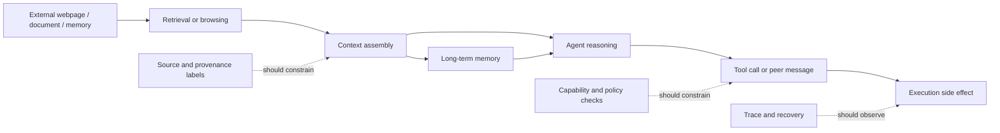

# Isolation as a First-Class Principle：把 Agent 安全问题重新写成“边界失效”问题

| 元信息 | 内容 |
| --- | --- |
| 论文 | Isolation as a First-Class Principle for LLM-Agent System Safety: Concepts, Taxonomy, Challenges and Future Directions |
| 作者 | Huihao Jing, Wenbin Hu, Shaojin Chen, Haochen Shi, Sirui Zhang, Hanyu Yang, Changxuan Fan, Zhongwei Xie, Hongyu Luo, Wun Yu Chan, Wei Fan, Haoran Li, Yangqiu Song |
| 时间 | 2026-07-14 |
| 链接 | https://arxiv.org/abs/2607.12406 |
| 类型 | AI 安全 / LLM Agent survey |

### TL;DR

- **这篇论文要解决的问题**：LLM Agent 的安全失败已经不只是“模型输出了不安全文本”。Agent 会读文件、调用工具、浏览网页、执行代码、写状态、和其他 Agent 协作，因此失败经常发生在接口处：低权限输入变成高权限指令，工具输出变成控制信号，环境内容进入行动链路，或者共享记忆把污染带到未来会话。
- **作者的核心方法**：把“隔离”提升为 LLM-Agent 系统安全的一等原则。论文把 Agent 系统拆成 5 个隔离边界：user-agent、agent-tool、agent-execution、agent-agent、system-environment，并按“隔离最先在哪里失效”来分类攻击、防御和评测。
- **最重要的结构性洞察**：看似不同的 prompt injection、tool misuse、memory poisoning、MCP metadata manipulation、web-agent injection 和 multi-agent prompt infection，都可以解释为某个边界上 data、authority、state 或 execution 的身份混淆。
- **证据形态**：这不是一个提出新 benchmark 的实验论文，而是一篇 survey。它通过 Figure 1 的五边界结构、Figure 2 的路线图式 taxonomy，以及 Table 1 的文献映射，把 2022-2026 年间大量攻击、防御、benchmark 和 agent 工程趋势重新放到边界中心的坐标系里。
- **关键结论**：安全 Agent 不能只依赖更强的拒答、更好的系统提示或单点过滤器；更可靠的方向是 isolation-by-construction，也就是让输入来源、工具能力、执行通道、Agent 间通信、环境上下文和记忆状态在系统结构里持续可区分、可审计、可恢复。
- **局限**：论文主要是概念整合和研究议程，没有给出统一形式化模型、跨边界 benchmark 或可运行 runtime；许多防御仍停留在单边界设置，真实系统里边界会组合失效。

### 1. 研究问题：为什么 Agent 安全不能再按“攻击类型清单”来组织？

作者开篇抓住的是一个系统层变化：

- LLM 不再只是一个回答问题的模型；
- 在 Agent 架构里，它变成了系统的 “brain”；
- 这个 brain 连接工具、文件、浏览器、代码解释器、数据库、检索器、长期记忆和其他 Agent；
- 因此安全问题从“输出是否有害”扩展为“控制、能力、记忆和上下文如何在系统里流动”。

这导致传统分类方式出现缺口：

| 旧分类方式 | 有用之处 | 论文认为的缺口 |
| --- | --- | --- |
| 按攻击类型分类 | 能列出 prompt injection、jailbreak、tool misuse、RAG poisoning 等 | 很难说明这些攻击为什么会互相转化 |
| 按应用域分类 | 能区分代码 Agent、Web Agent、机器人 Agent、数据分析 Agent | 会掩盖不同应用里共同的结构性失败 |
| 按模型能力分类 | 能讨论规划、工具调用、记忆、协作 | 容易把安全边界误认为模型内部能力问题 |
| 按 benchmark 分类 | 能复现局部风险 | 很难覆盖长链路、持久状态和跨接口传播 |

论文的重构方式是：**先问隔离在哪里破了，再问攻击叫什么名字。**

这句话很关键。比如：

- 用户输入覆盖系统提示，不只是 “prompt injection”，而是 user-agent 边界把 data 当成了 control；
- 工具返回的网页内容改写下一步行动，不只是 “indirect injection”，而是 agent-tool 或 system-environment 边界没有保留来源身份；
- 一个 Agent 把恶意摘要转发给另一个 Agent，不只是 “multi-agent attack”，而是 agent-agent 边界把 peer message 当成可信控制；
- 记忆污染影响未来付款、配置或数据访问，不只是 “memory poisoning”，而是 state 没有被来源、权限和生命周期隔离。

### 2. 论文主张与论证路线

论文没有提出一个新模型，而是提出一个读文献和设计系统的坐标系。

| Claim | Mechanism | Evidence | Boundary |
| --- | --- | --- | --- |
| Agent 安全的基本单位应是边界，而不是单个 prompt | 将系统接口拆成用户、工具、执行、Agent 间通信、环境 5 类 | Figure 1 给出 agent core 周围的五边界图 | 论文没有证明五类边界完备，只是给出可操作 taxonomy |
| 表面不同的失败共享“隔离丧失”这一结构原因 | 按 data、authority、state、execution 的混淆解释攻击传播 | Figure 2 把 prompt injection、MCP risk、web-agent injection、RAG poisoning 等放入同一图谱 | 文献映射依赖作者的 primary boundary 判断 |
| 单点防御不足以覆盖真实 Agent 风险 | 失败会从用户输入、网页、工具输出、共享记忆一路传播到执行副作用 | 第 7 节总结 sequential escalation 和 environment-originated propagation | 仍缺跨边界统一 benchmark |
| isolation-by-construction 比 prompt-only safety 更接近工程现实 | 把 trust、authority、capability scope、trace、recovery 做成接口约束 | 论文引用 managed agents、AgentVisor、CaMeL-like defenses、privilege separation 等趋势 | 具体 runtime 设计仍需后续工作 |

可以把论文的逻辑写成一个简化公式：

```text
Agent Risk = f(Control Flow, Capability Scope, State Persistence, Source Trust, Execution Side Effects)

当 source identity、authority level、capability permission 或 state lifetime 在边界处丢失时：

Boundary Failure -> Propagation -> Unsafe Action / Disclosure / Persistence
```

这个公式不是论文原文给出的数学定义，而是对全文论证的工程化概括。它能解释作者为什么反复强调“系统行为”和“真实执行后果”：一个 Agent 的风险不只来自模型本身，还来自模型把哪一类上下文当成了哪一类权威。

### 3. 五个边界：Figure 1 到底想让读者看到什么？

Figure 1 的信息可以压缩成下面这张表。

| 边界 | 正常隔离状态 | 失效时发生什么 | 典型风险 |
| --- | --- | --- | --- |
| User-Agent | 用户内容是请求、查询或任务数据；系统/开发者指令保持更高权威 | 低权限内容变成高权限控制 | prompt injection、jailbreak、long-context steering、memory injection |
| Agent-Tool | 工具描述、工具输出、工具参数只是受约束接口 | 工具返回或 metadata 变成隐藏控制通道 | indirect injection、tool selection failure、MCP metadata manipulation |
| Agent-Execution | 规划与行动之间有检查、延迟和阻断 | 模型输出直接变成外部副作用 | 执行恶意代码、错误点击、错误提交、物理动作风险 |
| Agent-Agent | 一个 Agent 的消息只是有边界的贡献 | peer message 被当作可信推理或命令 | prompt infection、debate amplification、cascade failure |
| System-Environment | 网页、文档、RAG 片段、界面元素是观察材料 | 外部环境内容进入控制回路 | web injection、RAG poisoning、environment-mediated disclosure |

这张图的价值在于它把 Agent core 放在中心，但不把安全问题缩回 core。作者要读者关注的是中心周围的接口：

- 入口是否能保留来源身份；
- 工具是否能保留能力边界；
- 执行是否能保留行动门槛；
- 协作是否能保留责任和信任差异；
- 环境是否能保留观察与指令的区别。

这也是论文和普通 prompt-injection survey 的差别。普通 survey 可能会问“攻击字符串长什么样”；这篇更关心“这段字符串为什么能穿过系统结构”。

### 4. User-Agent 边界：用户内容什么时候从 data 变成 control？

这一节是最经典的 Agent 安全入口。

作者给出的 threat model 很直接：

- 在正常系统里，用户输入应该只是请求、查询或任务数据；
- 系统提示和开发者指令应该保持更高权威；
- 失败从用户可控内容开始影响内部策略或行为的那一刻开始。

这个边界覆盖四类递进风险：

1. **直接 prompt injection 与 jailbreak**
   - 早期工作证明自然语言可以覆盖隐藏提示、泄露系统指令、混淆角色层级；
   - 近期攻击转向 adversarial suffix、black-box search、proxy-guided optimization 和 automated red teaming；
   - HarmBench、JailbreakBench、JailbreakEval 等 benchmark 让这类风险更可复现。

2. **从单轮攻击到多轮妥协**
   - 多轮 jailbreak 通过渐进式 steering、implicit clues、long-context overload 让模型逐步偏离；
   - 这解释了为什么一次性 refusal score 不够；
   - 很多系统在 one-shot 评测里看似稳健，在真实 session 里会退化。

3. **多模态输入扩展攻击面**
   - 用户图片可以承载视觉或排版指令；
   - 文本过滤器不一定能识别图像里的控制信号；
   - Agent 一旦把图像 OCR、视觉 grounding 或界面识别结果放入上下文，边界就不再只是文本问题。

4. **持久化妥协**
   - in-context poisoning、dynamic soft prompting、memory injection 让用户影响在原会话之后继续存在；
   - 这把 user-agent 边界和长期状态安全连接起来；
   - 一次低权限输入可能在未来会话中重新出现并改变行动。

作者在防御侧也做了三组归纳：

| 防御组 | 目标 | 例子 |
| --- | --- | --- |
| 显式 authority separation | 让系统知道哪些内容是指令，哪些只是数据 | structured queries、signed prompts、DSL-style interfaces |
| 模型侧 jailbreak hardening | 降低模型被攻击输入带偏的概率 | safety classifiers、semantic smoothing、repetition-based defenses、inference-time self-protection |
| 妥协后的 repair | 处理已经退化或被污染的行为边界 | unlearning、model editing、refusal-boundary control |

这一节的结论不是“prompt injection 已经解决”，而是相反：

- 短 prompt 评测不够；
- 静态拒答分数不够；
- 多轮、长上下文、多模态和持久记忆场景才更接近真实 Agent。

### 5. Agent-Tool 边界：工具不是手，工具接口本身也是攻击面

这一节是论文最贴近当前 Agent 工程的一部分。

作者把工具边界定义为：Agent 如何访问外部能力。在良好隔离的系统中，工具应该扩展 Agent 能力，但不能接管 Agent 决策。

失败通常发生在四个位置：

| 位置 | 失效方式 | 后果 |
| --- | --- | --- |
| 工具输出 | tool-returned content 被当作可信指令 | 间接 prompt injection 改写下一步 reasoning/action |
| 工具选择 | Agent 选择错误工具或被恶意工具广告影响 | 路由到错误能力、外部服务或高风险 API |
| 参数构造 | 工具对了，但参数不安全 | 局部推理错误变成外部副作用 |
| 协调轨迹 | 单次调用无害，但多步组合危险 | trace-level unsafe workflow |

这节最值得注意的是 MCP-style 风险。作者指出，风险正在从“工具输出内容”上移到“协议和 metadata”层：

- 工具描述会影响模型偏好；
- capability advertisement 会影响工具发现和排序；
- metadata 会影响路由和决策；
- MCP 生态里，工具还没被调用，工具接口本身就已经进入模型上下文。

这对 Agent 平台很重要。很多工程实践把 tool schema 当作“中性说明书”，但论文强调：从模型角度看，schema、description、capability text 和 protocol metadata 都可能是控制面。

可以用一个小伪代码表示工具边界的安全要求：

```text
Input:
  task, tool_registry, tool_metadata, user_context, environment_observations

State:
  source_label for every text span
  authority_level for every instruction-like span
  capability_scope for every tool
  trace_log for every call

Loop:
  propose_tool_call()
  if metadata_source is untrusted:
      downrank or quarantine control-like claims
  if requested_capability exceeds scope:
      block or require escalation
  if arguments include untrusted instructions:
      convert to data, not control
  execute only through mediated interface
  append observation with source_label and trust_level

Output:
  bounded observation or blocked action

Failure boundary:
  any untrusted output that changes policy, routing, or capability without mediation
```

这段伪代码不是论文的算法，而是把作者的 agent-tool boundary 论点翻译成工程检查表。

### 6. Agent-Execution 边界：从“不安全文本”到“不安全副作用”

执行边界处理的是内部决策变成真实行动的时刻。

作者给出的关键区分是：

- 模型输出不安全文本是一类问题；
- Agent 点击按钮、运行代码、提交表单、操作浏览器、控制机器人，是另一类问题；
- 后者会产生外部副作用，成本更高，也更难回滚。

论文列举的执行风险可以分成三层：

| 层级 | 例子 | 为什么不能只靠普通 alignment |
| --- | --- | --- |
| 代码 / browser / GUI | risky code generation、website compromise、unsafe web interaction、GUI hidden action | 模型可能语言上拒绝风险，但界面行动链仍被诱导 |
| 真实工作流 | clicks、submissions、navigation、action grounding | 安全性取决于 action trace，而不是最后一句回答 |
| embodied / VLA | robot jailbreaking、contextual backdoors、adversarial patches | 感知错误或后门会变成物理动作 |

这一节让“隔离”变得非常具体：planning 和 acting 必须分开。

如果把执行边界写成系统约束，它至少包含：

- **delay**：高风险动作不要从模型 token 直接变成动作；
- **check**：执行前做 policy-executable 检查；
- **contain**：代码、浏览器、文件系统、网络和物理动作要有 sandbox 或 capability scope；
- **observe**：每一步 action、参数、来源上下文和结果要进入 trace；
- **recover**：发生错误后能撤销、隔离或阻断后续传播。

论文对这个边界的防御归纳偏向 containment：

| 防御方向 | 作用 |
| --- | --- |
| constrained execution | 限制可执行动作集合和参数空间 |
| zero-trust architecture | 默认不信任模型提出的行动，按接口授权 |
| active defense | 在执行链路中加入动态检查 |
| policy-executable safeguards | 把安全规则变成可执行检查，而不是自然语言建议 |
| realistic execution benchmarks | 在真实界面和工作流中评测安全，而不是只看文本输出 |

这一节的研究含义是：Agent 安全评测应该从 “answer-level safety” 走向 “action-level safety”。

### 7. Agent-Agent 边界：协作不是天然防御，也可能是放大器

多 Agent 系统常被包装成更可靠：

- 一个 Agent 规划；
- 一个 Agent 执行；
- 一个 Agent 批判；
- 一个 Agent 审核；
- 多轮 debate 得出共识。

论文提醒：如果没有隔离，协作本身会成为传播机制。

作者把 agent-agent boundary 的 threat model 定义为：一个 Agent 的消息应当是有边界的 contribution，而不是自动可信的控制信号。

主要风险包括：

1. **prompt infection**
   - 一个被污染的 Agent 把恶意指令传给其他 Agent；
   - 普通协调消息变成攻击载体；
   - 恶意控制不再来自用户，而来自 peer agent。

2. **debate / critique amplification**
   - 讨论、批判、投票和共识形成不一定削弱攻击；
   - 如果恶意内容被反复引用、总结、压缩，反而可能增强影响；
   - 多 Agent 结构会制造更多 transformation step，让来源身份更难保留。

3. **topology / cascade failure**
   - 网络结构、路由规则、共享记忆决定失败传播速度；
   - 星型、链式、全连接、黑板式共享状态的风险不同；
   - 一处 compromise 可能变成系统级 failure。

4. **shared memory weaponization**
   - 被污染的共享记忆能在未来任务中激活；
   - 这比单条消息危险，因为 rollback 更难；
   - 责任归因也更困难。

论文对防御的建议不是“再加一个判断 Agent”这么简单，而是给安全角色以结构性权威：

| 防御 | 核心问题 |
| --- | --- |
| guard agents / defense agents | 谁有权检查和阻断其他 Agent 的输出？ |
| attribution | 哪个 Agent、哪条消息、哪一步造成决定性失败？ |
| memory partitioning | 哪些状态可共享，哪些状态只能局部可见？ |
| topology-aware monitoring | 传播图里是否出现异常扩散模式？ |
| privilege separation | 不同 Agent 是否拥有不同工具、数据和行动权限？ |

这一节最有价值的判断是：**collaboration is not automatically a safeguard**。多 Agent 的安全性不是由 Agent 数量决定，而是由通信边界、共享状态、权限差异和归因能力决定。

### 8. System-Environment 边界：外部世界不是被动材料，而是控制回路的一部分

系统-环境边界覆盖网页、文档、邮件、检索片段、界面元素、记忆 artifact 和物理环境。

作者的定义是：

- 在安全系统里，环境内容应该保持为 observation；
- 失败发生在环境来源内容被吸收到 Agent 上下文，并被当成有权威的指令；
- 一旦外部内容能 steering reasoning、retrieval 或 action，外部世界就进入了控制回路。

这节把几个常见问题放到同一条线上：

| 场景 | 表面问题 | 边界解释 |
| --- | --- | --- |
| 网页隐藏指令 | indirect prompt injection | environment-originated content 没有和 user/developer instruction 隔离 |
| Web Agent 点击页面 | hostile interface | 页面不只是信息源，也是诱导动作的环境 |
| RAG 被投毒 | corrupted evidence | retrieval passage 作为证据进入推理，但来源和可靠性未保留 |
| 数据泄露 | environment-mediated disclosure | 外部交互把私有状态带出系统 |
| 记忆污染 | persistent environment state | 环境或检索结果被写入长期状态并跨会话复用 |

RAG 部分尤其值得注意。论文指出，RAG 风险不一定表现为显式恶意指令，也可能是 corrupted evidence：

- 检索库被投毒；
- 排名被操纵；
- 支撑证据被污染；
- Agent 在看似正常的 citation 上构造错误结论；
- 私有知识通过检索接口泄露。

这解释了为什么“过滤 prompt injection 字符串”不足以解决 RAG-Agent 安全。真正的问题是：检索结果进入上下文之后，系统是否仍知道它来自哪里、可信度如何、能否作为行动依据、能否写入记忆。

论文提到的防御方向包括：

- source authentication；
- provenance tracking；
- instruction detection；
- task-alignment shielding；
- temporal causal diagnostics；
- causal attribution；
- trustworthy evidence selection；
- memory hygiene。

如果用 Mermaid 重构这条传播链，可以写成：



这张图表达了第 6 节和第 7 节的共同点：环境内容不是只进来一次，它可能被检索、摘要、转发、执行、写入记忆，然后再进入未来推理。

### 9. Cross-Boundary Challenges：真正危险的是边界之间的传播

第 7 节是全文的收束。作者强调严重失败往往不是单边界事件，而是跨边界传播。

典型路径一：从用户输入升级到执行副作用。

```text
User prompt
  -> user-agent boundary failure
  -> tool choice / argument manipulation
  -> agent-tool boundary failure
  -> code/browser/API action
  -> agent-execution boundary failure
  -> unsafe side effect
```

典型路径二：从环境污染进入 Agent 工作流。

```text
Malicious webpage / retrieved passage / poisoned memory
  -> system-environment boundary failure
  -> context assembly treats content as control
  -> tool call or peer-agent message
  -> cross-agent propagation or execution
  -> persistent state update
```

典型路径三：从多 Agent 协作放大。

```text
Compromised agent message
  -> agent-agent boundary failure
  -> debate / critique / summary repeats it
  -> shared memory stores it
  -> future agent retrieves it
  -> later tool/action chain executes it
```

论文在这里给出一个非常实用的评测批评：

- 许多 benchmark 仍测试单个边界；
- 真实失败跨过多个边界；
- 单个接口的 robustness 不能保证系统级安全；
- downstream transformation 会改变信息形态，使前一层防御失效；
- memory、retrieval cache、shared agent state 会让 compromise 变得隐蔽且持久。

这也是为什么作者提出 isolation-by-construction。它不是一个单点模块，而是一组贯穿 workflow 的系统性质：

| 性质 | 工程含义 |
| --- | --- |
| trust separation | 每段上下文保留来源和权威等级 |
| scoped capabilities | 工具、文件、网络、执行权限默认最小化 |
| traceability | 每次调用、转发、摘要和写记忆都可追踪 |
| policy checks | 高风险动作通过可执行规则检查 |
| recovery | 被污染的 memory、cache、shared state 可以隔离、撤销或降权 |
| visible boundaries | 系统自己能看到边界，而不是只在文档里描述边界 |

### 10. Figure / Table 证据怎么读？

这篇 survey 的图表不是实验结果，而是论证框架。

| 图表 | 作用 | 支撑什么 claim | 不能证明什么 |
| --- | --- | --- | --- |
| Figure 1 | 把 Agent core 放在五个接口中心 | Agent 安全应以边界为单位理解 | 五个边界一定完备、互斥 |
| Figure 2 | roadmap-style taxonomy | prompt injection、tool risk、execution risk、multi-agent risk、environment risk 可统一到 isolation 视角 | 每篇文献分类都唯一无争议 |
| Table 1 | 大规模文献映射 | 2022-2026 攻击、防御、benchmark 已经沿不同边界展开 | 不提供新的实证 benchmark 或统一指标 |

Figure 2 最值得读的地方是它把每个边界拆成了子主题：

| 边界 | 子主题摘要 |
| --- | --- |
| User-Agent | direct prompt injection、authority separation failure、multi-turn attacks、multimodal/long-context attacks、persistent compromise |
| Agent-Tool | tool outputs as control、tool misuse/selection failures、argument construction、protocol/metadata risks、trajectory-level orchestration |
| Agent-Execution | code/browser/GUI action risks、unsafe action realization、embodied/VLA systems、containment/runtime mediation |
| Agent-Agent | prompt infection、debate propagation、topology/cascade/memory、defense agents/attribution |
| System-Environment | indirect prompt、hostile web/interfaces、RAG poisoning、env-mediated disclosure、auth/provenance/causal defense |

这张 taxonomy 对研究者的意义是：当看到一个新攻击时，不要只问它属于哪种攻击名，而要问：

- 它最先突破哪个边界？
- 它改变的是 data、authority、state 还是 execution？
- 它会不会向下游工具、执行、Agent 通信或记忆传播？
- 现有 benchmark 是否覆盖这个传播路径？
- 防御是在边界前、边界中，还是边界后修复？

### 11. 相关工作位置：它和 PVDetector、MCP 安全、Agent failure tracing 的关系

结合今天已经发布的几篇相邻内容，可以更清楚地看这篇 survey 的位置。

| 相邻方向 | 解决的问题 | 这篇论文的位置 |
| --- | --- | --- |
| PVDetector | 在 purpose-specific Agent 中检测 prompt injection 造成的策略违规隐藏表示 | 属于 user-agent / system-environment 边界的检测组件，但不覆盖工具、执行和多 Agent 传播 |
| OAT agent failure tracing | 用成功轨迹定位 Agent 失败步骤 | 属于 traceability / attribution 方向，可服务跨边界传播诊断 |
| MCP / tool surface poisoning | 工具描述、协议 metadata、能力暴露被操纵 | 属于 agent-tool 边界，论文把它提升为协议层控制面问题 |
| CaMeL-style design defenses | 用能力、数据流和隔离结构降低 prompt injection 风险 | 是 isolation-by-construction 的代表性工程趋势之一 |
| AgentVisor / managed agents | 把 brain 和 hands 分离，控制执行与工具权限 | 对应 agent-execution 和 agent-tool 的结构化隔离 |

这说明该 survey 的贡献不是替代这些具体方法，而是提供一个“放置具体方法”的框架。

比如 PVDetector 的 hidden-state detector 很强，但它仍然依赖白盒模型访问和策略校准；如果被检测内容随后通过工具 metadata、peer-agent message 或 memory summary 变形传播，单点 detector 未必覆盖。Isolation taxonomy 可以帮助判断还缺哪些系统边界。

### 12. 局限与可复现性：这篇论文没有证明什么？

这篇论文很有用，但边界也清楚。

| 局限 | 具体表现 | 对读者的影响 |
| --- | --- | --- |
| 没有新实验 | 论文主要是 survey 和 taxonomy | 不能把它当成某个防御方法的 benchmark 证据 |
| 没有统一形式化模型 | “隔离”“权威”“信任”“能力”主要是概念和工程术语 | 后续需要类型系统、权限模型、信息流或 runtime policy 形式化 |
| 文献分类存在主观性 | 作者按 primary safety boundary 归类，但很多论文天然跨边界 | 读者应把 taxonomy 当作分析工具，不是唯一真值 |
| 缺跨边界 benchmark | 作者自己也指出很多评测仍是单边界 | 很难量化 isolation-by-construction 的系统收益 |
| 缺生产 runtime | 没有给出可直接部署的 agent framework | 工程团队仍需自己设计 tracing、scope、policy、memory hygiene |

最需要避免的误读是：把“隔离”理解成“把 Agent 关起来就安全了”。论文说的 isolation 更接近：

- 保留来源身份；
- 保留权限层级；
- 保留能力范围；
- 保留状态生命周期；
- 保留执行门槛；
- 保留跨边界传播的可追踪性。

它是系统结构，不是一个开关。

### 13. 研究者视角：后续最值得追的几个问题

这篇论文的价值在于把零散文献收束为一个研究 agenda。后续可以沿四个方向推进。

#### 13.1 能否建立 Agent 工作流的信息流类型系统？

现在很多 Agent runtime 仍把上下文拼成自然语言字符串。Isolation-by-construction 需要更强的类型：

- `UserData<T>`；
- `DeveloperInstruction<T>`；
- `ToolObservation<T>`；
- `EnvironmentEvidence<T>`；
- `PeerAgentMessage<T>`；
- `Memory<T, source, expiry, authority>`；
- `Action<T, capability, risk_level>`。

如果类型系统能强制低权限内容不能直接变成高权限 instruction，很多 prompt injection 就不再只是模型鲁棒性问题。

#### 13.2 跨边界 benchmark 应该怎么设计？

一个更真实的 benchmark 不应只问模型是否拒答，而应包含：

| 阶段 | 需要记录的证据 |
| --- | --- |
| 输入阶段 | 来源、权限、模态、是否包含隐藏控制 |
| 检索阶段 | 证据来源、排序、污染比例、引用链 |
| 工具阶段 | 工具选择、参数、metadata、返回内容 |
| 执行阶段 | action trace、side effect、rollback 能力 |
| 协作阶段 | message propagation、summarization、debate influence |
| 记忆阶段 | 写入、读取、过期、污染恢复 |

最后指标也不应只有 success rate：

- boundary violation rate；
- unsafe action rate；
- source-label preservation；
- privilege escalation count；
- poisoned-memory survival time；
- recovery success rate；
- attribution precision。

#### 13.3 防御组件之间如何组合？

单点防御经常在 transformation 后失效。比如：

- 输入过滤器挡住原始攻击，但摘要器改写后绕过；
- RAG provenance 在第一轮存在，但工具调用参数里丢失；
- guard agent 检查最终回答，却看不到执行 trace；
- memory hygiene 清理一部分状态，但 peer agent 已经复制了污染摘要。

因此后续研究需要 compositional defense：

```text
Detector + Provenance + Capability Scope + Trace Monitor + Memory Recovery
```

其中任何一项都不是完整答案。真正的难点是证明组合后边界仍然可见。

#### 13.4 Agent 平台应该把“恢复”作为一等能力

很多安全讨论聚焦 prevention，但论文反复提示 persistent compromise 和 shared state。现实系统必须假设隔离会失败。

因此 runtime 需要：

- contamination marking；
- memory quarantine；
- tool credential rotation；
- action rollback；
- trace-based root cause；
- peer-agent state invalidation；
- cache and retrieval index repair。

这会把 Agent 安全从“拦截提示”推进到“故障恢复工程”。

### 14. 结论：这篇 survey 最值得带走的一句话

如果只带走一句话，应是：

**LLM Agent 的安全边界不在模型输出末端，而分布在用户、工具、执行、Agent 通信和环境上下文之间；失败发生在这些边界把数据、权威、状态和行动混在一起的时候。**

这也是它对 AI 安全和 Agent 工程最实际的贡献。它把 prompt injection、MCP 风险、Web Agent 风险、RAG poisoning、multi-agent cascade 和 memory poisoning 放进同一个系统问题里。对研究者来说，这能帮助设计更好的 benchmark 和形式化模型；对工程团队来说，它提醒我们不要把自然语言系统提示当成唯一安全边界，而要把隔离做进接口、权限、trace、记忆和恢复机制里。

### 参考与延伸

- arXiv abstract and metadata: https://arxiv.org/abs/2607.12406
- arXiv HTML full text: https://arxiv.org/html/2607.12406v1
- arXiv cs.AI recent listing: https://arxiv.org/list/cs.AI/recent
- 直接第三方深度解读检索结果很少；本篇主要依据论文 PDF/HTML 原文、arXiv 元数据和论文内的文献地图完成。
