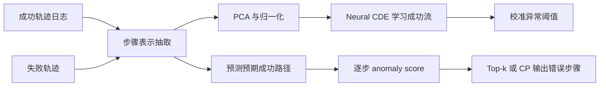

# Tracing Agentic Failure from the Flow of Success：只看成功轨迹，也能定位 Agent 失败步骤吗？

### 元信息与 TL;DR

- **论文**：Tracing Agentic Failure from the Flow of Success
- **作者**：Samuel Yeh, Yiwen Zhu, Shaleen Deep, Sharon Li
- **机构**：University of Wisconsin-Madison, Microsoft Research
- **提交时间**：2026-07-14 13:16:14 UTC
- **原始链接**：https://arxiv.org/abs/2607.12747
- **HTML 全文**：https://arxiv.org/html/2607.12747v1
- **代码与数据**：https://anonymous.4open.science/r/OAT-183C
- **类别**：大模型 Agent 相关；更准确地说，是长轨迹 Agent 失败归因与运行时诊断。

**TL;DR：**

1. 这篇论文研究的问题不是“Agent 会不会失败”，而是失败后怎样定位**哪几个步骤真正把任务带坏了**。作者把它称为 failure attribution，用在多 Agent、工具调用、网页浏览、代码执行等长轨迹系统中。
2. 现有路线主要有两类：用 GPT-4o/GPT-5 这类强模型读完整失败轨迹并判断错误步骤，或者用带步骤级错误标签的失败轨迹继续训练一个归因模型。前者推理成本高、延迟高；后者标注昂贵且主观。
3. 论文提出 OAT，也就是 One-class Agent Tracing。它只用成功轨迹训练，把每个 Agent 步骤编码成隐空间向量，再用 Neural Controlled Differential Equations 学习“成功执行流”的动态模式。
4. 推理时，OAT 不再调用前沿 LLM 读轨迹，而是计算失败轨迹中每一步与“预期成功流”的偏离距离。偏离越大，越可能是 failure-contributing step。
5. 实验使用 MCP-Atlas 的 103 条成功轨迹训练，并在 88 条 MCP-Atlas 失败轨迹上做域内测试；再迁移到 Who&When 的 184 条失败轨迹做 OOD 测试。OAT 不使用失败轨迹监督，也不使用步骤级错误标签训练。
6. 关键数字很明确：MCP-Atlas 上 OAT-CP 的 F1 为 0.435，优于 GPT-4o 的 0.212 和 GPT-5 的 0.181；Who&When 上 OAT-Top-k 的 F1 为 0.225，优于 GPT-4o 的 0.151 和 GPT-5 的 0.152。
7. 成本差异是论文最强的工程证据：OAT 推理 token 为 0，MCP-Atlas 平均延迟 7ms；GPT-5 约 3012 tokens、39626ms。Who&When 上 OAT 平均 16ms，而 GPT-5 约 37819ms。
8. 局限也很清楚：MCP-Atlas 错误步骤仍由作者人工标注；OAT 依赖步骤表示质量和阈值选择；conformal prediction 的硬阈值会漏掉边界附近的真实错误；Who&When 是 failure-only，因此跨域实验仍不是完整闭环部署评估。

### 研究问题：为什么失败归因比失败分类更难？

Agent 系统失败后，工程上常见的排查问题不是：

- “这次任务是否失败？”
- “最终答案是否错误？”
- “哪个 Agent 名字看起来最可疑？”

真正难的问题是：

- **错误起点在哪里？**
- **后续步骤是在制造新错，还是只是在继承前面的错？**
- **工具返回错误、推理幻觉、参数写错、重复无效搜索，哪个步骤应该被标为因果贡献？**
- **能否不让一个更贵的 LLM 再读一遍完整轨迹？**

论文把一条 Agent 轨迹写成：

```text
tau = (Q, a_1, s_1, a_2, ..., s_{T-1}, a_T)
```

变量含义：

| 符号 | 含义 | 在 Agent 诊断中的角色 |
|---|---|---|
| `Q` | 用户问题或任务描述 | 轨迹的目标条件 |
| `a_t` | 第 `t` 个 Agent 动作 | 可能是推理文本、工具调用、代码块或最终回答 |
| `s_t` | 工具或环境返回 | 决定后续动作可见信息 |
| `T` | 轨迹长度 | 长轨迹里错误可能被后续补偿或掩盖 |
| `y(t)` | 步骤级错误标签 | 测试时用于评估，OAT 训练时不用 |

作者的核心判断是：

| 诊断层级 | 常规做法 | 问题 | OAT 的切入点 |
|---|---|---|---|
| 轨迹级 | 判断任务成败 | 不能告诉开发者修哪里 | 不满足调试需求 |
| 类型级 | 标成 planning/tool/reasoning error | 粒度仍太粗 | 只能辅助解释 |
| 步骤级 | 定位第几步导致失败 | 标注贵、LLM 判读贵 | 用成功流的偏离做无监督定位 |

这让论文的问题意识很集中：如果成功轨迹本来就是系统运行时自然产生的副产物，那么能否把成功轨迹当成“正常执行分布”，再把失败轨迹中偏离正常流的步骤挑出来？

### 论文主张与论证路线

| Claim | Mechanism | Evidence | Boundary |
|---|---|---|---|
| 失败归因可以不依赖失败轨迹训练 | 只用成功轨迹学习 one-class normal flow | MCP-Atlas 103 条成功轨迹训练，测试 88 条失败轨迹 | 成功轨迹必须足够覆盖正常执行模式 |
| Agent 步骤可以被建模为连续动态路径 | 每一步用 LLM hidden state 表示，再用 Neural CDE 拟合轨迹 | OAT 在域内和 OOD 都优于随机、首步、GPT-4o、GPT-5 基线 | 表示质量依赖抽取模型、层、聚合方式 |
| Gated control path 能提升跨域鲁棒性 | 对控制路径导数加门控，抑制异常控制信号 | 消融显示 gated CDE 优于去掉 gating 的版本 | 论文没有证明门控一定对应可解释因果机制 |
| OAT 比 prompt-based 归因更适合部署 | 推理阶段无需 LLM token，只跑轻量模型 | 延迟从秒级/十秒级降到毫秒级 | 需要先有状态抽取与训练流程 |
| 阈值策略影响 precision/recall | Top-k 保证选出若干步；CP 用校准分数给阈值 | OAT-Top-k 召回更强，OAT-CP 精度更强 | CP 硬阈值可能漏掉边界错误 |

这条论证的关键不是“模型更大所以更好”，而是反过来：

1. 失败轨迹步骤级标注是稀缺资源。
2. 成功轨迹是每个 Agent 平台更容易积累的日志资产。
3. 如果成功执行有可学习的动态结构，失败步骤应表现为局部偏离。
4. 因此，失败诊断可以从“再让大模型审一遍”转向“学习成功流，再找异常点”。

### 方法机制：OAT 怎样从成功轨迹学习？

OAT 的流程可以拆成五个阶段：



#### 第一步：把每个 Agent 步骤变成向量

论文用模型中间层隐藏状态表示每个步骤：

```text
h_t = M_t^(ell)(a_t | Q, a_1, s_1, ..., a_{t-1}, s_{t-1}) in R^{d_h}
```

解释：

- `M_t^(ell)` 表示在第 `ell` 层取隐藏状态。
- `a_t` 是当前动作，但表示时会条件化在任务和历史上下文上。
- `h_t` 是步骤级表示，不是整条轨迹表示。
- 论文默认使用 mean pooling；附录消融显示 last-token 表示会明显变差，因为错误信号常出现在推理内容或工具参数构造的中间 token，而不一定在最后 token。

这一步很重要，因为 OAT 的“异常”不是在原始文本上算编辑距离，而是在行为步骤的隐空间里看动态偏离。

#### 第二步：用 Neural CDE 建模成功执行流

作者先给出一个 Neural ODE 形式：

```text
z(u) = z(0) + integral_0^u f(v, z(v); theta_f) dv
h_hat(u) = g_1(z(u); theta_g1)
z(0) = g_2(h_Q; theta_g2)
```

但 Agent 轨迹不是普通等间隔时间序列。每一步的内容、工具返回、推理转折都会改变路径。于是作者采用 Neural Controlled Differential Equation：

```text
z(u) = z(0) + integral_0^u f(v, z(v); theta_f) dX(v)
```

变量解释：

| 符号 | 含义 | 作用 |
|---|---|---|
| `z(u)` | 连续时间隐藏状态 | 表示成功轨迹的动态演化 |
| `X(v)` | 控制路径 | 由步骤表示插值得到，携带轨迹输入变化 |
| `f` | 向量场网络 | 学习状态如何随控制路径变化 |
| `h_hat(u)` | 预测的成功步骤表示 | 与真实步骤表示比较，得到重构误差 |

训练目标是让成功轨迹上的每一步都能被成功流重构：

```text
L(theta) = E_{tau ~ D_succ} [ sum_t || h_t - h_hat(u_t) ||_2^2 ]
```

这说明 OAT 不是直接学习“错误是什么”，而是学习“成功通常长什么样”。

#### 第三步：gated control path 为什么必要？

论文认为，失败轨迹或跨域轨迹会带来控制路径分布漂移。如果直接把 `dX/du` 喂给 CDE，模型可能被 OOD 控制信号强行牵引，导致重构路径本身也偏离正常流。

所以 OAT 加了门控：

```text
dX_tilde(u)/du = q(dX(u)/du; theta_q) * dX(u)/du
```

直观理解：

- `dX/du` 是控制路径变化率。
- `q(...)` 是一个小网络输出的门控方向。
- 门控后的 `dX_tilde` 会抑制不可靠控制信号。
- 在失败轨迹上，模型更像是在问：如果这条轨迹按成功动态走，当前步骤应该落在哪里？

这也是题目里 “flow of success” 的含义：失败不是先被定义出来，而是通过偏离成功流被发现。

### 错误步骤怎样输出：Top-k 与 conformal prediction

推理时，对失败轨迹的每一步计算：

```text
e_t = || h'_t - h_hat(u_t) ||_2^2
```

其中：

- `h'_t` 是失败轨迹中第 `t` 步的实际表示。
- `h_hat(u_t)` 是 OAT 预测的成功流中对应位置。
- `e_t` 越大，表示这一步越不像成功轨迹中的合理步骤。

论文使用两种检测策略：

| 策略 | 公式 | 优点 | 风险 |
|---|---|---|---|
| Top-k | 选出 `e_t` 最大的 `k` 个步骤 | 召回高，保证返回候选 | 可能把无害但异常的步骤也列入 |
| CP | `delta = Quantile(1-alpha, calibration_scores)`，输出 `e_t > delta` | 精度更高，可校准 | 阈值附近的真实错误可能漏掉 |

论文默认：

- Top-k 的 `k = 3`。
- CP 的 `alpha = 0.2`。
- latent dim 为 64。
- Neural CDE hidden dim 为 64。
- CDE 主体是 3 层 MLP。
- gate hidden dim 为 12，gate 是 4 层。
- 训练 300 epoch，batch size 32，学习率 `4e-5`，weight decay `1e-5`。

这些设置让 OAT 更像一个轻量诊断器，而不是另一个需要昂贵推理的大模型。

### 实验设置：两个数据集分别验证什么？

#### MCP-Atlas：域内训练与测试

MCP-Atlas 是工具使用 Agent benchmark：

| 项目 | 数字 |
|---|---:|
| MCP servers | 36 |
| Tools | 220 |
| 原始任务 | 1000 |
| 本文实际使用任务 | 203 |
| 成功轨迹 | 103 |
| 失败轨迹 | 100 |
| 过滤后失败轨迹 | 88 |
| 成功轨迹平均步骤 | 7.18 |
| 失败轨迹平均步骤 | 7.32 |
| 失败轨迹平均 token | 4.2K |
| 失败轨迹最多错误步骤 | 12 |

作者用 Qwen3.5-27B 生成轨迹，并用 claims-based rubric 判断任务是否成功。失败轨迹里，作者排除了 12 条不是 Agent 行为导致的失败，例如某个 search API 稳定 timeout、空日志等。

步骤级标注规则包括：

1. 推理内容幻觉，导致计划或动作走错。
2. 工具调用参数错误、格式错误或语义不合适。
3. 工具返回显式错误后，Agent 没有正确处理。
4. 搜索型工具允许探索不同查询；但如果同一无效查询反复出现，第一次不罚，后续重复无效动作标为 failure-contributing step。

#### Who&When：跨域失败归因

Who&When 只包含失败轨迹：

| 项目 | 数字 |
|---|---:|
| 失败轨迹 | 184 |
| 平均步骤 | 20.28 |
| 最大步骤 | 129 |
| 平均 token | 6.8K |
| 最大 token | 60K |
| 任务来源 | GAIA 与 AssistantBench |
| Agent 系统 | CaptainAgent 与 Magnetic-One |
| 基座模型 | GPT-4o |

因为 Who&When 没有成功轨迹，OAT 不能在它上面训练，只能从 MCP-Atlas 成功轨迹迁移过去。这使它成为 OOD 测试：同一个成功流模型能否识别另一个 Agent 系统的失败步骤？

### 主结果：OAT 的优势在哪里？

#### 域内 MCP-Atlas

| 方法 | Precision | Recall | F1 | Hit | AUROC | AUPRC |
|---|---:|---:|---:|---:|---:|---:|
| Random-Step | 0.284 | 0.246 | 0.255 | 0.284 | 0.529 | 0.226 |
| First-Step | 0.136 | 0.108 | 0.116 | 0.136 | 0.469 | 0.206 |
| GPT-4o | 0.233 | 0.210 | 0.212 | 0.250 | 0.509 | 0.217 |
| GPT-5 | 0.217 | 0.183 | 0.181 | 0.250 | 0.515 | 0.217 |
| OAT Top-k | 0.321 | 0.706 | 0.420 | 0.777 | - | - |
| OAT CP | 0.443 | 0.484 | 0.435 | 0.566 | 0.629 | 0.324 |

这张表里最值得注意的不是 OAT “全面碾压”，而是不同指标暴露了两个用途：

- **Top-k 更像 debug 候选器**：召回 0.706，Hit 0.777，适合让工程师快速看几个最可疑步骤。
- **CP 更像告警器**：Precision 0.443，F1 0.435，适合减少误报。
- GPT-5 在这个任务上没有胜过 GPT-4o，说明“更强推理模型读轨迹”不自动等价于更好步骤归因。

#### OOD Who&When

| 方法 | Precision | Recall | F1 | Hit | AUROC | AUPRC |
|---|---:|---:|---:|---:|---:|---:|
| Random-Step | 0.137 | 0.137 | 0.137 | 0.137 | 0.547 | 0.061 |
| First-Step | 0.115 | 0.115 | 0.115 | 0.115 | 0.535 | 0.057 |
| GPT-4o | 0.129 | 0.198 | 0.151 | 0.198 | 0.566 | 0.066 |
| GPT-5 | 0.111 | 0.275 | 0.152 | 0.275 | 0.584 | 0.078 |
| OAT Top-k | 0.150 | 0.451 | 0.225 | 0.451 | - | - |
| OAT CP | 0.184 | 0.330 | 0.211 | 0.330 | 0.758 | 0.128 |

OOD 结果更保守，但更有研究价值：

1. OAT 只在 MCP-Atlas 成功轨迹上训练。
2. Who&When 的任务来源、Agent 系统、轨迹长度都不同。
3. OAT-Top-k 仍把 F1 从 GPT-5 的 0.152 提到 0.225。
4. OAT-CP 的 AUROC 为 0.758，说明 anomaly score 的排序信息在跨域场景仍有信号。

这支持一个有限结论：成功轨迹中的动态模式不是完全数据集特有的，它至少能迁移出一部分 Agent 失败信号。

### 成本与部署：为什么 0 token 推理是关键？

论文把 OAT 与 prompt-based baseline 的推理成本放在一起：

| 数据集 | 方法 | 平均 token | 平均延迟 |
|---|---|---:|---:|
| MCP-Atlas | GPT-4o | 121 | 4241ms |
| MCP-Atlas | GPT-5 | 3012 | 39626ms |
| MCP-Atlas | OAT | 0 | 7ms |
| Who&When | GPT-4o | 118 | 4522ms |
| Who&When | GPT-5 | 2694 | 37819ms |
| Who&When | OAT | 0 | 16ms |

这组数字说明 OAT 的价值不只是指标高一点：

- 在持续运行的 Agent 平台里，失败归因可能是每次失败后都要跑的基础设施。
- 如果每次都让前沿 LLM 读取长日志，成本会随失败量线性增长。
- OAT 的推理阶段不需要 LLM token，更接近“日志后处理模型”。
- 这使它有机会进入在线观测、批量回放、自动标注候选、回归测试定位等工程环节。

不过，0 token 并不表示完全免费。它把成本前移到了：

1. 轨迹日志标准化。
2. 步骤表示抽取。
3. 成功轨迹收集。
4. PCA、归一化、CORAL 等预处理。
5. 每个系统或领域的模型训练与校准。

### 消融与失败案例：哪些设计真正起作用？

论文主文与附录给出多组消融，重点可以整理为：

| 消融点 | 观察 | 含义 |
|---|---|---|
| Neural CDE vs Neural ODE | CDE 更适合轨迹输入变化 | Agent 步骤不是平滑自发演化，而是受动作内容控制 |
| 去掉 gated control path | 跨域鲁棒性下降 | OOD 失败轨迹会污染控制信号 |
| RNN 替代 CDE | 表现不如 OAT | 连续路径建模对不规则轨迹更合适 |
| last-token 表示 | 明显劣于 mean pooling | 错误信号可能藏在工具参数或推理中段 |
| proxy LLM 表示 | Llama-4-Scout、Gemma-4-31B、GPT-oss-120B 只小幅下降 | 不一定必须访问生成轨迹的原模型 hidden states |

论文的 case study 也很具体：

1. **医院与充电站任务**：Agent 在 Wikipedia API 没拿到结果后，用参数知识幻觉出错误医院，再基于错误医院搜索充电站。OAT 对幻觉步骤给出高 anomaly score，对继承错误的后续步骤给出较温和分数。
2. **数据库分析任务**：Agent 发现目标 collection 没有数据后，多次重复无效动作，最后用不忠实假设绕过缺失信息。OAT 同时标出重复无效动作和不忠实假设。
3. **评论数排名任务**：Agent 用 display name 统计评论，误把同名不同邮箱用户合并，导致最终用户错误。这个例子说明很多 Agent 错误是数据建模细节错误，不是显眼的工具异常。
4. **失败案例**：论文指出 CP 硬阈值会漏掉 anomaly score 略低于阈值但因果上重要的步骤，因此更自适应的检测策略可能提升表现。

### Figure 与 Table 逐项证据解读

| 图表 | 支持什么 | 不能证明什么 |
|---|---|---|
| Figure 1 | OAT 从成功轨迹学习 hidden path，并用偏离分数识别失败步骤 | 不能证明偏离一定是因果错误 |
| Table 1 / 2 | OAT 在 MCP-Atlas 与 Who&When 上 F1、Hit、AUROC 优于基线 | 数据集规模仍有限，且标注有主观性 |
| Table 3 | OAT 推理延迟与 token 成本远低于 GPT-4o/GPT-5 | 不包含状态抽取和训练的全部工程成本 |
| Table 4 / 5 | MCP-Atlas 与 Who&When 的轨迹规模、步骤数、token 数 | 不能代表所有生产 Agent 系统 |
| Table 6 | 超参数完整公开，便于复现 | 不证明这些超参数在新系统中最优 |
| Figure 14 / 17 / 18 | 阈值、mean pooling、proxy LLM 表示对表现有影响 | 图形证据更多是经验性，不是理论保证 |
| Figure 19 / 20 / 23 | 成功与失败案例展示 OAT 能捕捉幻觉、重复无效动作、错误统计逻辑 | case study 不能替代大规模因果验证 |

这类证据的边界要特别小心：OAT 学到的是“偏离成功流的步骤”，而不是形式化因果证明。它适合作为候选定位器、审计提示器、调试排序器，但不能把 anomaly score 直接当作最终责任判决。

### 相关工作位置：它和 AgentTracer、Who&When、异常检测的关系

论文把自己放在三个交叉点上：

| 方向 | 已有工作 | OAT 的差异 |
|---|---|---|
| Agent failure attribution | Who&When 提出步骤定位问题；AgentTracer、GraphTracer 等尝试训练或提示归因 | OAT 不用失败轨迹步骤标签训练 |
| Prompt-based diagnosis | 让 GPT-4o/GPT-5 读完整轨迹并返回候选错误步骤 | OAT 推理阶段不用 LLM token |
| Anomaly detection | one-class / trajectory anomaly detection 常见于机器学习与机器人 | OAT 做的是步骤级归因，不只是轨迹级异常 |
| Neural CDE | 适合不规则时间序列与控制路径建模 | OAT 把它用于 Agent 行为步骤的隐空间动态 |

更抽象地说，OAT 不是“更聪明的裁判模型”，而是把 Agent 运行日志变成可训练的动力系统问题：

```text
成功轨迹 = normal dynamics
失败步骤 = local deviation
调试输出 = ranked anomaly candidates
```

这个重新表述很有启发：未来 Agent 平台的可靠性工具可能不只依靠自然语言审稿式日志分析，还会把轨迹、状态、工具调用、权限边界、错误恢复路径都纳入时序建模。

### 证据边界、局限与可复现性

#### 证据边界

1. **训练数据小但设计克制**：103 条成功轨迹训练看起来很少，但这正是论文的主张之一，即低监督、低标注条件下也能工作。问题是，新系统是否也有同样清晰的成功流结构，还需要验证。
2. **步骤标签仍有人为判断**：MCP-Atlas 的失败贡献步骤由作者人工标注，模糊案例讨论到共识为止。这比自动标签可靠，但也意味着评估目标并非完全客观。
3. **基线 prompt 可能受模板影响**：GPT-4o/GPT-5 的表现与轨迹序列化方式、提示模板、候选格式有关。论文给出 prompt template，有助于复现，但不能排除更强提示提升基线。
4. **OAT 定位的是异常，不是因果证明**：下游继承错误、工具返回噪声、环境分布漂移，都可能形成异常分数。工程上仍需要人工或更强审计器确认。
5. **跨域实验有价值但不完整**：Who&When 只有失败轨迹，所以无法在目标域校准完整成功流；作者用 CORAL 对齐二阶统计来缓解漂移，但这不是通用解决方案。

#### 可复现性线索

代码仓库 README 给出的最小流程是：

```bash
python extract_states.py --dataset mcp_atlas --aggregation mean
python extract_states.py --dataset who_and_when --aggregation mean
python run_pipeline.py baselines --dataset mcp_atlas
python run_pipeline.py train --dataset mcp_atlas
python run_pipeline.py ood --train-dataset mcp_atlas --test-dataset who_and_when
```

仓库结构也与论文方法对应：

| 文件或目录 | 作用 |
|---|---|
| `extract_states.py` | 从轨迹中抽取步骤表示 |
| `data_pipeline.py` | 加载轨迹、拆分成功/失败、PCA、归一化、CORAL |
| `models/oat.py` | TorchCDE neural CDE 核心与 gated control |
| `train.py` | 训练、校准分数、失败轨迹打分 |
| `evaluate.py` | 指标计算与多 seed 聚合 |
| `run_pipeline.py` | baselines、train、ood 的统一入口 |

这说明论文不是只给概念图，而是把训练、评估、跨域测试路径都落到脚本上。局限是仓库仍是匿名审稿形式，不是长期维护的正式 GitHub 项目；生产系统采用前需要检查数据许可、依赖版本、日志脱敏和推理服务集成。

### 对 Agent 可靠性研究的延伸问题

这篇论文最值得带走的不是某个 F1 数字，而是一个研究范式转换：

- 从“失败后让另一个 LLM 解释”转向“持续学习成功运行的结构”。
- 从“最终答案评分”转向“轨迹中间状态诊断”。
- 从“错误类型 taxonomy”转向“可排序、可校准、可批量运行的步骤级信号”。

后续问题可以沿四条线推进：

1. **与权限和安全边界结合**：如果 Agent 每个工具调用都有权限标签、数据敏感度、外部副作用等级，OAT 的 anomaly score 可以和 risk score 组合，优先审计高风险异常步骤。
2. **与自动修复闭环结合**：OAT 只能指出可疑步骤；下一步可以研究如何把可疑步骤回放给 planner、retriever 或 tool router，让系统生成最小修复轨迹。
3. **与人类审计工作流结合**：Top-k 模式适合给调试者候选列表，CP 模式适合自动告警。真正系统可能需要按任务风险动态切换 precision/recall。
4. **与后训练数据构造结合**：如果 OAT 能稳定从生产日志里挖出错误起点，它可以帮助构造更细粒度的偏好数据、反事实轨迹和错误恢复训练样本。

<u>最重要的边界</u>是：OAT 不是让 Agent 自动免责或自动定责的工具。它提供的是一种便宜、可扩展的失败定位信号。对于高风险 Agent，最终判断仍需要结合工具输出、外部事实、权限策略、人工审计和可重放环境。

### 结论

OAT 把 Agent 失败归因问题拆成一个更可工程化的形式：

1. 收集成功轨迹。
2. 学习成功执行的隐空间动态。
3. 对失败轨迹逐步计算偏离。
4. 用 Top-k 或 conformal threshold 输出可疑步骤。
5. 把结果交给人或下游修复系统进一步确认。

论文的实验证据显示，这条路在 MCP-Atlas 和 Who&When 上比 GPT-4o/GPT-5 prompt-based 归因更准、更快，尤其是推理阶段 0 token 和毫秒级延迟，使它接近 Agent 可观测性基础设施，而不只是离线论文指标。

但它的主张应该被限定在“无监督步骤级候选定位”上，而不是“自动找到真实根因”。真正有价值的下一步，是把 OAT 这类成功流模型接入更完整的 Agent 运行平台：日志 schema、工具权限、回放测试、失败恢复、人工审计和后训练数据生产，形成能持续改进的可靠性闭环。
