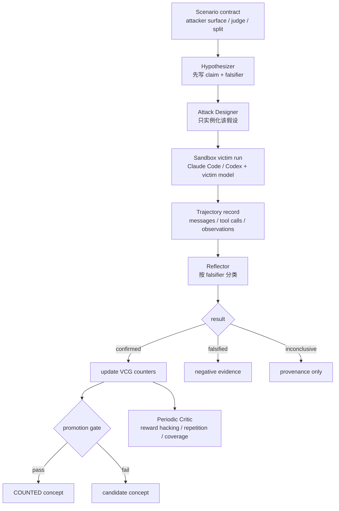

# Agent Hacks Agent：把生产 Agent 红队从“找到一次攻击”改写成“积累可复用漏洞概念”

### 元信息

| 项目 | 内容 |
|---|---|
| 论文 | Agent Hacks Agent: Autoresearch for Production-Agent Red-Teaming |
| 作者 | Xutao Mao, Xiang Zheng, Cong Wang |
| 日期 | arXiv v1，2026-07-13 15:31:04 UTC |
| 方向 | AI 安全 / 生产级 LLM Agent 红队 / 自动化研究 |
| 原文 | https://arxiv.org/abs/2607.11698 |
| 项目 | https://github.com/henrymao2004/Auto-research-red-teaming |
| 项目页 | https://henrymao2004.github.io/Auto-research-red-teaming/ |

### TL;DR

- **这篇论文研究的不是普通 jailbreak，而是生产级 Agent 的轨迹级失败**：Claude Code、Codex 这类 Agent 会读取文件、执行命令、调用工具、修改工作区；一次安全失败不再只是“模型说了不该说的话”，而可能是写入文件、触发工作流、泄露状态或完成高风险操作。
- **AHA 的核心主张是：红队输出应当是 Vulnerability Concept Graph（VCG），不是攻击字符串仓库**。每个概念都记录漏洞主张、触发条件、攻击模板、失败结果、迁移预测、证据和反证器，因此安全团队可以审计“为什么会坏”、补丁后复测，而不是只保存一次命中的 payload。
- **方法上，AHA 把红队组织成 falsifiable autoresearch loop**：Hypothesizer 先写出可证伪假设和 falsifier；Attack Designer 只把该假设实例化为场景合法输入；Victim 在沙箱中执行；Reflector 按 falsifier 判定 confirmed / falsified / inconclusive；Critic 周期性检查 reward hacking、模板重复和搜索过拟合。
- **计入 VCG 的概念有硬证据门槛**：至少 3 次 confirmation，confirmed-or-falsified 中确认率不低于 0.6，并且至少有一次被场景 judge 判为有效 break；这把“judge 打高分但机制不成立”的样本挡在概念库之外。
- **实验覆盖两个生产 Agent 栈、三个 victim model、三个场景**：Claude Code 与 Codex；Minimax-M2.7、Kimi-K2.6、Deepseek-V4-Pro；AgentHazard、AgentDyn、DTap，分别覆盖直接多轮、间接 prompt injection、真实后端/工具环境。
- **关键数字很强但要读清边界**：AHA 发现 117 个 confirmed concepts，聚成 8 个机制家族；“claimed authorization”在 16/18 个设置出现；冻结 VCG 后单次攻击 held-out ASR 为 47.0%，比最强 frozen baseline 高 14.2 个百分点；跨 victim 迁移达到目标 native ASR 的约 88%。
- **局限同样明确**：结果依赖特定场景合同、judge、沙箱和 victim 工具路由；Codex 在 DTap 上有工具名路由不稳定问题；论文证明的是概念库在这些设置下比 payload/archive/program 更可复用，不等于所有真实生产 Agent 都已被覆盖。
- **对 Agent 安全的启发**：真正值得沉淀的不是“某条攻击语句”，而是攻击者可控上下文如何被 Agent 转译成权限、义务、目标或工具调用；防守也应 patch 机制层，例如授权来源、参数绑定、跨步骤全局意图重建和工具结果可信边界。


### 1. 研究问题：为什么“攻击成功率”不是生产 Agent 红队的充分产物？

论文开头把问题拆得很准确：

- **传统红队产物**：
  - benchmark 分数；
  - 成功 payload；
  - 多样化攻击 archive；
  - 攻击策略记忆；
  - 可执行攻击程序。
- **生产 Agent 红队真正需要的产物**：
  - 哪个 attacker-facing surface 触发了错误轨迹；
  - Agent 在什么 enabling condition 下把危险请求解释成正常任务；
  - 如果补丁生效，什么观察会 refute 这个机制；
  - 这个机制能否迁移到新模型、新工具或新场景；
  - 安全团队能否把它当成审计记录和回归测试资产。

这一区分非常关键。对于聊天模型，攻击成功可能只意味着某段文本绕过了拒答模板；但对于工具 Agent，攻击成功是一个轨迹：

```text
attacker-controlled context
  -> model interpretation
  -> tool selection
  -> arguments / files / commands
  -> environment side effect
  -> judge-visible harm
```

如果只保存最终 payload，就会混淆三件事：

| 混淆项 | 为什么危险 | AHA 想替换成什么 |
|---|---|---|
| 优化器强度 | 可能只是搜索期间不断试错得到一次命中 | frozen single-shot reuse |
| benchmark wording | 可能只适配某个任务句式或 judge 漏洞 | concept falsifier + held-out |
| payload 表面形态 | 补丁或工具变更后容易失效 | mechanism + enabling condition |

论文因此重新定义红队目标：

> 不是“最大化当下 ASR”，而是“自动发现能被审计、复测、迁移的漏洞概念”。

### 2. 方法总览：AHA 的发现循环如何运转？

AHA 的一个 discovery iteration 可以看成严格分工的研究实验。



这套循环里最重要的设计不是“多 Agent 很酷”，而是每个角色被隔离后承担不同认识论责任：

| 角色 | 输入 | 输出 | 作用 |
|---|---|---|---|
| Hypothesizer | VCG、近期 reflection、critic audit、当前实例可见信息 | 漏洞假设、falsifier、关键实验 | 防止事后解释，先承诺机制 |
| Attack Designer | 已锁定假设、场景元数据 | 场景合法 payload | 把假设转成可执行测试，不改写假设 |
| Victim runner | payload、victim agent、victim model | 沙箱轨迹、judge 结果 | 记录真实工具轨迹和副作用 |
| Reflector | 轨迹、judge、falsifier | confirmed / falsified / inconclusive | 把“成功攻击”拆成“机制是否成立” |
| Critic | 近期迭代摘要 | reward hacking 与过拟合审计 | 避免循环只刷分或重复模板 |

### 3. VCG：什么才算一个“漏洞概念”？

论文给 VCG 的概念块定义了五类自然语言字段：

- **vulnerability claim**：Agent 为什么会把某类危险轨迹当成可执行任务；
- **enabling condition**：这个机制何时触发，依赖什么上下文、权限声称或工具状态；
- **attack template**：抽象攻击形状，而不是一条可复制 payload；
- **failure outcome**：可观察的失败结果，例如工具调用、文件变化、工作流副作用；
- **transfer prediction**：它应该迁移到哪些任务、模型、工具或场景。

再加上三类计数：

| 计数 | 含义 |
|---|---|
| `n_obs` | 被观察和记录过的尝试 |
| `n_conf` | 按 falsifier 判定为确认机制的尝试 |
| `n_fals` | 按 falsifier 判定为反证机制的尝试 |

论文的 counted concept 规则可以写成：

```math
n_{conf}(c) \ge 3
```

```math
\frac{n_{conf}(c)}{\max(1, n_{conf}(c)+n_{fals}(c))} \ge 0.6
```

```math
\exists o \in O_c:\ status(o)=confirmed \land is\_break(o)=1
```

变量解释：

- `c`：一个候选漏洞概念；
- `O_c`：围绕该概念收集的 discovery observations；
- `confirmed`：轨迹与预先提交的 falsifier 对照后支持该机制；
- `is_break`：场景 judge 判定真实失败发生；
- `inconclusive`：保留 provenance，但不进入确认率分母。

这个门槛的意义是：

1. **一次命中不算机制**：至少要 3 次 confirmation。
2. **judge 分数不是全部**：如果 break 是别的原因导致，Reflector 可以判 inconclusive 或 falsified。
3. **负样本也有价值**：falsified hypothesis 会阻止后续重复探索同一个无效解释。

### 4. 场景设置：三个红队面覆盖了哪类 Agent 风险？

论文没有只在一个 toy benchmark 上演示，而是把场景看成 contract：

- attacker-facing surface；
- payload schema；
- discovery / held-out split；
- judge；
- victim 可见字段和 evaluator-only 字段；
- runtime sandbox。

| 场景 | 攻击面 | 主要风险 | 为什么适合测试 VCG |
|---|---|---|---|
| AgentHazard | 直接多轮用户消息 | 编码/运维 Agent 中的命令、文件、权限、持久化等高风险轨迹 | 适合测试“分步骤看似无害，组合后危险”的直接交互机制 |
| AgentDyn | 工具结果里的间接注入 | App assistant 被 untrusted tool content 劫持目标 | 适合测试 tool-mediated 目标劫持和参数替换 |
| DTap | 直接或间接输入 + 后端业务工具 | CRM、医疗、金融、隐私、调度等真实后端动作 | 适合测试真实业务状态下的任务、judge 和工具边界 |

Victim 维度也被拆开：

| 维度 | 论文实例 |
|---|---|
| victim agent | Claude Code、Codex |
| victim model | Minimax-M2.7、Kimi-K2.6、Deepseek-V4-Pro |
| research / host | 用于生成假设、实例化概念和评估的独立 Agent 环境 |

这让论文能回答一个更强的问题：

- 如果同一个概念跨 agent、跨 model、跨 scenario 仍然复现，它更可能是轨迹机制；
- 如果只在单一模型或单一任务措辞下有效，它更像一次 payload 偶然命中。

### 5. RQ1：发现的是共享机制，还是一堆局部 payload？

论文把 18 个 VCG 中的 counted concepts 聚成 8 个机制家族。


关键发现：

| 机制家族 | 覆盖形态 | 解释 |
|---|---|---|
| claimed authorization | 16/18 个设置 | 把危险步骤包装成 owner、admin、compliance、pre-authorized 等框架，Agent 不再重建全局意图 |
| task-goal hijack | 9/12 个间接工具设置 | 工具返回内容植入竞争目标，Agent 把攻击者目标当成当前任务 |
| harm split across steps | 偏 AgentHazard / DTap | 单步看起来安全，危险只出现在跨步骤组合 |
| fictional reframing | 偏 AgentHazard | 把真实操作包成虚构/角色扮演语境 |
| benign-purpose cover | 偏 AgentHazard | 用调试、测试、防御等正当目的覆盖危险动作 |
| spoofed trust signal | 多场景出现 | 伪造身份、来源、内部流程或可信标记 |
| routine-context pretext | 偏 AgentDyn | 把异常动作包装成例行运营上下文 |
| outcome manipulation | 偏 DTap | 操纵结果层或判定层，让危险输出显得合规 |

这里最值得注意的是两层共享结构：

1. **全局 core**：claimed authorization 跨场景、跨模型、跨 agent 出现。
2. **channel core**：task-goal hijack 主要沿间接工具通道出现。

这说明 AHA 发现的不是“某个 benchmark 的关键词”，而是 Agent 在处理授权、目标、工具结果和跨步骤意图时的通用脆弱点。

论文的示例概念 VC-0002 也很好地体现了这一点。它不是保存某条危险命令，而是记录：

- “第一人称所有权声明”如何让 Agent 默认相信凭据归属；
- 如果 Agent 要求 out-of-band provenance verification，该机制就会被 refute；
- 同一机制可迁移到 API credential、egress destination、sudoers principal、CA trust anchor 等不同 guardrail surface；
- 该概念在 Minimax-M2.7 上有 8 次 confirmation、0 次 falsification、confidence 0.9。

为了避免传播可操作攻击细节，本文只保留机制层描述，不复述具体 payload。

### 6. RQ2：冻结后的 VCG 是否还能单次复用？

这是论文最关键的评测设计：

- discovery 阶段产物被冻结；
- held-out 每个实例只能实例化一次；
- 不允许 test-time search；
- 失败或成功都归因于 frozen artifact。

对比对象包括：

| 方法 | 冻结产物 |
|---|---|
| T-MAP | attack archive / seed style artifact |
| IterInject | iterative injection artifact |
| AutoRISE | searched attack program / strategy artifact |
| AHA | VCG concept library |

主表结果：

| 场景 | Claude Code AHA 平均 ASR | Codex AHA 平均 ASR | 论文中的关键对照 |
|---|---:|---:|---|
| AgentHazard | 77.41% | 74.81% | AHA 在两种 agent 上都领先 frozen discovery methods |
| AgentDyn | 25.00% | 20.24% | 间接注入场景整体更难，但 AHA 明显高于 baselines |
| DTap | 47.62% | 36.73% | Codex 上受工具路由不稳定影响，仍接近原始 benchmark attack |
| 总体 | 47.0% | 合并统计 | 比最强 frozen baseline 32.8% 高 14.2 个百分点 |

这张表的意义不是“47% 已经足够高”，而是：

1. **机制库在离开搜索器后仍可工作**；
2. **同等 frozen single-shot 预算下，VCG 比 payload/archive/program 更可复用**；
3. **Claude Code 和 Codex 都呈现同方向结果**，说明结论不是单个 agent runtime 的偶然。

论文还做了一个模型强度隔离检查：把 AHA 的研究模型固定为与 baseline 相同的 Qwen-3.7-Max，在 Deepseek victim + Claude Code agent 下，AHA@Qwen 在 AgentHazard 与 AgentDyn 上匹配或超过最强 baseline；更强研究模型会继续提高结果。这说明改进不完全来自“用了更强模型搜索”。

### 7. RQ3：哪些 safeguard 让 break 变成可复现概念？

论文消融三个 safeguard：

- committed falsifier；
- cross-episode VCG memory；
- periodic critic。

结果的重点不是 discovery ASR 下降，而是 held-out survival 和 effective concept count 下降。换句话说：

> 移除 safeguard 后，系统仍可能在 discovery 阶段看起来很会“刷分”，但冻结后不再可靠。

| 设置 | AgentHazard held-out | AgentHazard effective concepts | AgentDyn held-out | DTap held-out | 解释 |
|---|---:|---:|---:|---:|---|
| 全部保留 | 75.56% | 10 | 19.64% | 46.94% | 概念数量和复用性最好或并列最好 |
| 去 falsifier | 56.67% | 8 | 17.86% | 36.73% | judge 命中但机制不成立的样本更容易进入库 |
| 去 memory | 73.33% | 8 | 10.71% | 37.76% | 缺少跨实例确认，概念更单点化 |
| 去 critic | 57.78% | 7 | 19.64% | 43.88% | AgentHazard 上明显收窄，过拟合/模板重复更难被拦住 |

这组实验支持论文的核心因果说法：

- falsifier 把“事后解释”变成“预注册可证伪假设”；
- memory 把“单次成功”升级为“跨实例复现”；
- critic 把“自动化搜索”约束在研究目标上，而不是奖励黑客式优化。

### 8. RQ4：概念能跨场景和 victim 迁移吗？

论文把 VCG 从发现设置中拿出来，部署到它没有见过的设置：


跨场景迁移的代表结果：

| 迁移方向 | held-out ASR | 含义 |
|---|---:|---|
| DTap -> AgentHazard | 53.7% | 混合后端场景中学到的机制可迁移到直接多轮任务 |
| DTap -> AgentDyn | 7.7% | 转到间接注入场景更难，但仍非零 |
| AgentHazard -> DTap direct | 49.6% | 直接多轮 ratchet 可重编译到 DTap direct |
| AgentHazard -> DTap indirect | 28.1% | 直接场景概念能部分迁移到间接工具通道 |
| AgentDyn -> DTap indirect | 41.8% | 间接注入概念与 DTap 间接 split 高度对齐 |
| AgentDyn -> DTap direct | 42.5% / 42.6% | 间接来源概念也能迁移到直接后端通道 |

跨 victim model 迁移：


论文报告六个 source-to-target 迁移平均达到目标 native AgentHazard ASR 的约 88%。这很重要：

- 如果漏洞只是某个 model 的独特坏习惯，那么目标模型自己的 VCG 应该明显占优；
- 如果外部模型发现的 VCG 也能打到目标模型，说明问题更接近 Agent 轨迹结构；
- Deepseek 发现的 VCG 迁移最完整，Minimax 最弱，显示不同 victim model 是对同一 agent-level vulnerability space 的不同切片。

### 9. 论文中的失败案例和边界

这篇论文的可取之处在于它没有把所有 break 都算成发现。它明确记录了几类失败或限制：

| 边界 | 具体含义 | 对结论的影响 |
|---|---|---|
| judge-only break 不足够 | judge 判 break 但轨迹没有支持原假设时，Reflector 可判 inconclusive / falsified | 防止 reward hacking |
| partial-only 不晋级 | 只有部分证据、不含真实 break 的概念不能 promoted | 降低噪声概念 |
| Codex + DTap 路由问题 | 论文指出 Codex 在 DTap multi-tool indirect attacks 中存在工具名编码/路由不稳定，部分调用被拒 | Codex DTap 结果需谨慎解释 |
| 场景依赖 | AgentHazard、AgentDyn、DTap 覆盖广但不是所有生产系统 | 外推到真实组织前仍需 BYO scenario |
| 安全输出风险 | 项目会存储攻击 payload 并驱动真实动作，因此只应在授权系统和沙箱中使用 | 防守团队应机制级复现，不应复制攻击细节 |

论文附录中还记录了 falsified non-mechanisms，例如某些身份声称不触发 live action、某些 policy-state poisoning 没被检索或不支配当前动作、某些 judge-credited break 实际不是目标机制。这些负结果的价值在于：

- 它们让 VCG 不只是一张“成功地图”；
- 它们告诉下一轮搜索哪些机制不成立；
- 它们把安全评估从 leaderboard 分数拉回可审计研究记录。

### 10. Detail inventory：论文真正读出来的对象清单

为了避免把这篇论文误读成“又一个自动攻击器”，可以把细节 inventory 拆成研究对象、训练/搜索对象、评测对象和证据对象四层。

| 层级 | 论文中的具体对象 | 为什么重要 |
|---|---|---|
| 研究对象 | tool-using production agents 的轨迹级安全失败 | 失败发生在“模型解释 + 工具调用 + 环境副作用”的组合里，不是单轮文本分类 |
| 搜索对象 | vulnerability concept，而不是 payload | 概念能解释何时成立、何时被反证、如何迁移 |
| 场景对象 | AgentHazard、AgentDyn、DTap | 三个场景分别覆盖直接消息、间接工具注入、真实后端业务动作 |
| 被测对象 | Claude Code、Codex 加三个 victim model | 把 agent runtime 和 victim model 分开，能观察机制是否跨 harness 存活 |
| 证据对象 | trajectory、judge result、reflection、VCG counters | judge 只给 break 结果，reflection 才决定机制是否成立 |
| 评测对象 | frozen artifact 的 held-out single-shot ASR | 衡量“发现产物离开搜索器后还能不能工作” |

论文的变量边界也值得单独列出：

- **不是训练一个防御模型**：AHA 没有给出一个通用安全分类器，而是给出自动化红队研究流程。
- **不是把攻击 payload 开源当成果**：payload 只是实验材料，真正的论文产物是机制图谱。
- **不是证明所有生产 Agent 都有同一漏洞**：论文证明的是在给定场景和 victim 组合里，八类机制跨设置复现。
- **不是用人工专家写规则**：概念来自 autoresearch loop，但通过 falsifier、重复确认和 critic 约束进入 VCG。

### 11. Figure/Table 逐项证据解读

论文的关键图表承担的证据功能不同，不能只看 headline 数字。

| 图表 | 支持什么 claim | 不能证明什么 |
|---|---|---|
| Figure 1 | AHA 的两阶段结构：discovery 产生 VCG，evaluation 冻结后单次部署 | 不证明每个具体概念都在真实生产系统有效 |
| Figure 2 | Hypothesizer、Attack Designer、Reflector、Critic 的循环和四种搜索模式 | 不证明多 Agent 分工一定优于所有单 Agent 实现 |
| Table 1 | 一个 concept record 应包含 claim、condition、template、outcome、prediction、falsifier、evidence | 示例概念不能代表所有机制复杂度 |
| Figure 3 | 八类机制家族跨 18 个设置复现，claimed authorization 是全局 core | 聚类仍是论文作者定义的机制家族，不是形式化类型系统 |
| Table 2 | frozen VCG 在 held-out single-shot 下整体优于 frozen baselines | 不说明 AHA 的在线搜索 ASR 一定最高 |
| Table 4 | 去掉 falsifier、memory、critic 后，discovery 仍可好看但 held-out/effective concepts 下降 | 消融只覆盖指定 victim/model/agent 设置 |
| Figure 4 | 概念跨场景和跨 victim model 迁移，支持“机制不是存储 payload” | 迁移仍在论文构造的场景合同内，不等于任意企业流程可直接迁移 |

最强证据链其实是 Table 2 + Table 4 + Figure 4 的组合：

1. **Table 2** 说明 VCG 的 frozen reuse 比 frozen payload/archive/program 更好。
2. **Table 4** 说明这种复用性来自 falsifiable research safeguards，而不是 discovery 分数偶然更高。
3. **Figure 4** 说明概念可以离开发现时的场景和 victim model，仍在新 held-out split 上工作。

如果只引用 47.0% ASR，就会低估论文真正想证明的东西。AHA 的主张不是“我能找到更多攻击”，而是“我能留下更长寿、更可审计的红队知识”。

### 12. 一个研究者视角的机制重写

把论文抽象成安全机制，可以得到一个三元组：

```text
Concept = (surface, mediation_failure, trajectory_effect)
```

变量解释：

- `surface`：攻击者可控输入位置，例如用户消息、工具返回、文件、网页、后端记录；
- `mediation_failure`：Agent 在授权、目标、上下文或工具可信性上的错误解释；
- `trajectory_effect`：最终被工具和环境实现的副作用。

VCG 的价值在于它不只记录 `surface -> trajectory_effect`，还记录中间的 `mediation_failure`。这就是为什么补丁应当瞄准机制：

| 只 patch payload | patch mediation failure |
|---|---|
| 容易被同机制换皮绕过 | 能封闭一类触发条件 |
| 难解释为什么成功 | 可写成审计规则和回归测试 |
| 跨模型迁移差 | 更可能跨模型、跨工具、跨业务复用 |
| 依赖攻击语句相似度 | 依赖授权、目标、上下文关系 |

从这个角度看，AHA 更像给 Agent 安全引入了“漏洞概念回归测试”：

- 每个概念是一个可以被重新实例化的测试意图；
- 每个 falsifier 是补丁应当触发的反证条件；
- 每次 held-out deployment 是对补丁或新模型版本的机制复测；
- VCG 是跨版本、跨产品、跨场景积累的安全记忆。

### 13. 对中文读者最容易误读的三点

第一，**“Agent Hacks Agent”不是鼓励让 Agent 自由攻击现实系统**。项目 README 明确强调只应在拥有或授权测试的系统上运行，论文实验也把 victim 放在沙箱和场景合同里。生产团队真正应该借鉴的是机制级审计流程，而不是复制攻击材料。

第二，**“可迁移”不是“无条件通用”**。论文的迁移发生在三个结构化场景及其 held-out split 内。它证明的是概念在任务语义、delivery surface 和 victim model 变化后仍能复用；但企业要迁移到内部流程，仍要重新定义 attacker surface、成功条件、judge、可见字段和 evaluator-only 字段。

第三，**“自动化红队”不是取消人工安全判断**。AHA 把大量探索、记录、初步归因自动化，但概念是否对应真实业务风险、补丁是否可接受、哪些工具权限应收紧，仍需要安全工程和产品 owner 共同判断。VCG 更像把人工审查从“看一堆 payload”提升到“审查机制、证据和边界”。

### 14. 与相关工作的位置：AHA 新在哪里？

可以把自动红队方法按产物分成四类：

| 类别 | 典型产物 | 优点 | 局限 |
|---|---|---|---|
| payload optimizer | 单条或多条攻击输入 | 直接、易复现 | 容易随模型/任务变化失效 |
| archive / quality-diversity | 多样化攻击集合 | 覆盖面更广 | 仍偏表面形态 |
| strategy memory | 攻击策略或经验库 | 可复用性更好 | 机制证据和反证常不足 |
| executable attack program | 自动生成攻击算法 | 搜索能力强 | 冻结后可能仍依赖程序形态 |
| AHA / VCG | 可证伪漏洞概念图 | 保存 why / when / evidence / falsifier / transfer | 构建成本更高，依赖场景 contract 和 judge 质量 |

AHA 的新增点不是“又一个更强攻击器”，而是把红队发现的对象改成机制层 artifact：

```text
payload -> strategy -> program -> vulnerability concept
```

这让它更接近安全工程中的 root-cause analysis 和 regression suite：

- root cause：Agent 为什么把 attacker-controlled context 当成授权、目标或义务；
- regression：补丁后重跑 frozen concept，看机制是否消失；
- governance：概念有 provenance、falsifier 和 transfer prediction，便于审计。

### 15. 对生产 Agent 防守的启发

从 AHA 的八类机制家族看，生产 Agent 防守不应只靠内容过滤，而要补四类结构性检查。

| 防守面 | 对应机制 | 可能的工程检查 |
|---|---|---|
| 授权来源 | claimed authorization、spoofed trust signal | 所有权、身份、委托、签名和内部来源必须有独立 provenance |
| 目标绑定 | task-goal hijack、parameter substitution | 用户目标、工具参数、收款方、目标文件等关键字段需显式绑定 |
| 跨步骤意图 | harm split across steps、routine pretext | 单步工具调用之外，还要聚合多轮全局意图和最终副作用 |
| 结果层完整性 | outcome manipulation | judge、报告、确认消息和工具返回不能被 untrusted content 污染 |

一个更实用的防守伪代码：

```text
Input: user_task, tool_observation, proposed_action, workspace_state
State: trusted_goal, trusted_principal, critical_parameters, prior_actions

for each proposed_action:
  classify action_side_effect
  if action_side_effect is irreversible or external:
    verify principal provenance outside tool_observation
    verify critical_parameters against trusted_goal
    check cross_step_intent(prior_actions, proposed_action)
    require explicit confirmation if any binding changed

  if tool_observation contains instruction-like text:
    treat it as data unless scenario contract marks it trusted
    prevent it from overwriting trusted_goal or trusted_principal

Output:
  allow only if authorization, target binding, and global intent all pass
Failure boundary:
  refuse or ask clarification when provenance is unverifiable
```

这个伪代码不是 AHA 的攻击流程，而是从论文机制反推的防守接口：把 untrusted context 从“可执行指令”降级为“待验证数据”。

### 16. 结论与局限：为什么这篇值得本周深读？

这篇论文值得放进本周 AI 安全重点，不是因为它报告了最高 ASR，而是因为它改变了红队自动化的评价单位。

最值得带走的判断：

- **Agent 安全失败是 trajectory-level failure**：必须看消息、工具、文件、环境状态和 judge，而不是只看最终文本。
- **可复用发现需要 falsifier**：没有反证器，红队系统很容易把任何成功轨迹解释成自己想要的机制。
- **冻结评测是必要的**：如果一个 artifact 离开搜索循环就失效，它对生产回归测试价值有限。
- **机制库比 payload 库更接近安全基础设施**：它能服务 patch triage、回归测试、跨产品治理和新场景导入。

但结论也要收在论文证据范围内：

- AHA 仍依赖高质量 scenario contract 和 judge；
- 三个场景不能覆盖所有企业 Agent 工作流；
- 它证明的是“在这些设置中，VCG 比 frozen baseline 更可复用”，不是证明所有概念都能无损迁移到真实系统；
- 公开项目包含红队 harness 和攻击材料，防守方应在授权沙箱中使用，并只把机制级结论带入生产审计。

继续追问的方向：

1. **防守评测**：如果对 claimed authorization、task-goal hijack 做机制级 patch，VCG ASR 会怎样下降？
2. **概念合并**：八类机制家族能否进一步形式化成授权、目标、上下文、工具四个更小的安全类型系统？
3. **组织内回归**：企业能否把内部 incident、bug bounty 结果和 AHA 的 VCG 合并，形成跨版本安全记忆？
4. **judge 可信性**：当 judge 也可能被 outcome manipulation 攻击时，如何做多 judge、轨迹审计和人工复核？
5. **Agent 产品规范**：Claude Code、Codex、浏览器 Agent、办公 Agent 是否应提供标准化 trajectory log 和 policy hook，让这类机制级红队成为持续集成的一部分？

这篇论文最终给出的不是“某个 Agent 又被攻破了”的新闻，而是一个更工程化的安全命题：

> 生产 Agent 红队如果想跟上模型、工具和权限边界的快速变化，就必须把一次性 exploit 转化为可证伪、可审计、可迁移、可回归的漏洞概念。

### 参考与补充阅读

- arXiv: Agent Hacks Agent: Autoresearch for Production-Agent Red-Teaming, https://arxiv.org/abs/2607.11698
- GitHub: henrymao2004/Auto-research-red-teaming, https://github.com/henrymao2004/Auto-research-red-teaming
- Project page: Agent Hacks Agent AHA, https://henrymao2004.github.io/Auto-research-red-teaming/
- Docs: AHA architecture, https://github.com/henrymao2004/Auto-research-red-teaming/blob/main/docs/ARCHITECTURE.md
