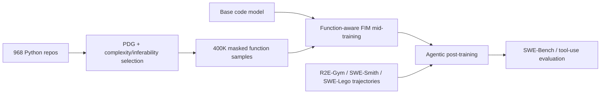

# Function-Aware FIM：为什么“补函数”可以作为 Coding Agent 的中训练

### 元信息

| 项目 | 内容 |
|---|---|
| 论文 | Function-Aware Fill-in-the-Middle as Mid-Training for Coding Agent Foundation Models |
| 作者 | Yubo Wang, Jiarong Liang, Yuxuan Zhang, Xuye Liu, Cong Wei, Yuyu Zhang, Ping Nie, Wenhu Chen |
| 机构 | University of Waterloo, University of British Columbia, NVIDIA, Verdent AI, Vector Institute |
| arXiv | https://arxiv.org/abs/2607.12463v1 |
| 公开日期 | 2026-07-14 07:44:26 UTC |
| 关联资源 | Hugging Face 数据集 `TIGER-Lab/FIM-Midtraining-400K`、模型卡 `TIGER-Lab/FIM-7B/8B/14B` |
| 本文类型 | 论文深读；方向为大模型后训练与 Coding Agent |
| 图片处理 | 未本地化图片；Figure 1/2/5/6 与 Table 1/2/3/5 的证据用表格、公式块、伪代码和 Mermaid 重写 |

### TL;DR

- 这篇论文回答的问题不是“再收集多少 SWE-Bench 轨迹”，而是：**在 agentic post-training 之前，能不能先给代码模型装入一种更像工具调用的结构先验**。
- 作者的核心类比是：coding agent 的 `history -> action -> observation -> continuation`，与普通代码里的 `caller context -> function call -> callee return -> downstream use` 同构；普通 Python 仓库里天然有大规模这种结构。
- 方法叫 **Function-Aware Fill-in-the-Middle mid-training**：不随机遮 span，而是用程序依赖图选择函数或相关函数组，把函数体遮掉，让模型根据调用方、被调方、签名、类上下文和后续使用恢复实现。
- 数据规模是 **400K FIM 样本、约 2.6B tokens、75,568 个 Python 文件、968 个 GitHub 仓库**；并排除 SWE-Bench 源仓库重叠，且限制到早于 SWE-Bench Verified/Lite 最早 base commit 的代码。
- 训练流程是：`Qwen2.5-Coder-7B/14B-Instruct` 或 `Qwen3-8B` 先做 1 epoch FIM mid-training，再接原样的 R2E-Gym、SWE-Smith 或 SWE-Lego agentic post-training。
- 主结果：在 SWE-Bench-Verified 上，7B/R2E-Gym 提升 **+2.8**，14B/R2E-Gym 提升 **+3.0**，Qwen3-8B/SWE-Lego 提升 **+3.2**；SWE-Bench-Lite 分别提升 **+3.67 / +4.0 / +5.4**。
- 更有意思的是能力保持：14B 上 R2E-Gym alone 会让 LiveCodeBench、BFCL、tau-bench 等非目标能力下滑；加 FIM mid-training 后，LiveCodeBench 恢复 **+11.1**，tau-bench **+3.9**，BFCL **+2.4**。
- 论文的边界也清楚：语料和主评测都是 Python；CoT rationale 默认依赖 Gemini-3-Flash；跨 base model 只验证了一个 Qwen3-8B 组合；方法假设代码具备模块化函数结构，不适合所有 notebook、生成式脚本或跨文件依赖。

### 这篇论文真正想补哪一块？

现在很多 Coding Agent 论文把训练重点放在轨迹上：

- 收集或合成 issue-resolution trajectory。
- 让模型学习 `search -> edit -> test -> repair`。
- 用 SWE-Bench、SWE-Bench-Lite、SWE-Bench-Verified 看最终 patch 是否通过。

作者指出，这条路线中间有一个被低估的空档：

| 阶段 | 常见做法 | 被忽略的问题 |
|---|---|---|
| 代码预训练 | next-token prediction，偶尔混入随机 FIM | 模型看到的是“向前写代码”，很少被要求从上下文和后续使用恢复一个外部返回 |
| agentic post-training | SFT/RL 学习 agent trajectory | 直接让模型适配工具返回、错误输出和 patch 循环，成本高且可能侵蚀基础能力 |
| 本文插入的中训练 | function-aware FIM | 先学习“根据外部计算结果继续推理”的结构，再接 agent 轨迹 |

这里的关键判断是：

> agent 能力不只来自轨迹模仿，还来自一种更底层的条件化能力：看见上下文、看见外部返回或缺口、再继续构造一致的后续行为。

作者没有把普通 FIM 当作代码补全技巧，而是把它重新解释为 agent step 的结构模拟器。

### 核心类比：函数调用为什么像 Agent 工具调用？

论文的 Figure 1 画的是一个四段式对齐。这里用文字重写：

| Coding Agent step | Python function call site | 需要模型学会的能力 |
|---|---|---|
| 历史上下文 `h_t` | 调用前代码、变量绑定、类状态 | 理解当前任务意图和可用状态 |
| 动作 `a_t` | 调用某个函数 `f(args)` | 选择一个外部计算过程 |
| 观测 `o_t` | 被调函数返回值或副作用 | 接受不在当前位置展开的结果 |
| 继续推理 `h_{t+1}` | 后续代码消费返回值 | 根据返回结果继续构造正确行为 |

这个类比有一个重要限制：

- FIM 训练时，模型同时看到 prefix 和 suffix。
- Agent 推理时，模型通常只能向后生成，不会提前知道完整 suffix。

作者承认这不是字面等价，而是结构先验：如果模型在训练中反复学习“一个外部函数应该怎样把上下文和后续使用连接起来”，那么 post-training 时它更可能学会处理工具返回、错误日志和测试反馈。

可以把论文假设写成一个研究公式：

```text
agent_continuation_skill
  ~= ability_to_condition_on(context, external_result, downstream_constraint)
  ~= function_aware_FIM_prior + agentic_post_training
```

普通 next-token code pretraining 主要强化：

```text
P(next_code | previous_code)
```

本文的中训练更接近：

```text
P(reasoning, function_body | prefix_context, suffix_context, dependency_structure)
```

这就是为什么作者要把 FIM 放在 **mid-training**，而不是只说“预训练里已经有 FIM 了”。

### 数据是怎么构造的？

论文和 HF 数据集卡给出的数据规模很具体：

| 数据项 | 数值 |
|---|---:|
| GitHub 源仓库 | 968 |
| 主题类别 | 10 |
| 自包含 Python 文件 | 约 78K；HF 卡列出 unique source files 为 75,568 |
| 总 FIM 样本 | 约 400K |
| token budget | 约 2.6B；HF 卡进一步拆成 input 2.33B、target 0.30B |
| 单函数样本 | 约 320K，约 2.0B tokens |
| 两函数组 | 约 60K，约 0.4B tokens |
| 三函数组 | 约 20K，约 0.2B tokens |
| Gemini-3 CoT 覆盖 | 100% target 带 rationale |
| SWE-Bench 源仓库 overlap | 0 |

数据清洗有两层防泄漏：

1. **仓库层面**：排除与 SWE-Bench 源仓库同名或已知 fork 重叠的仓库。
2. **时间层面**：每个仓库只保留早于 SWE-Bench-Verified 和 SWE-Bench-Lite 最早 base commit 的代码。

这并不等于完全消除所有现实 benchmark contamination，但比只声明“没有直接训练测试集”更具体，因为它把源仓库和 commit 时间都纳入约束。

### 不是随机遮 Span：函数目标怎么选？

论文的核心工程不是“把函数体替换成 mask”这么简单，而是：选哪些函数才有训练价值。

作者为每个文件构造程序依赖图：

- 节点 `V`：顶层函数和类方法。
- 调用边 `E_call`：调用方到被调用方。
- sibling 边 `E_sib`：同一 class 内的方法，代表共享实例状态。

然后给候选函数打两个分：

| 分数 | 含义 | 组成 |
|---|---|---|
| `H_hat(v)` complexity | 这个函数是否值得预测 | LoC、McCabe cyclomatic complexity、最大控制流嵌套深度 |
| `I_hat(v)` inferability | 这个函数是否能从上下文恢复 | 调用点参数、内部被调函数、签名、docstring、同类 sibling |

论文中的复杂度分可以用这个形式理解：

```text
H_hat(v) =
  w_loc * phi(LoC(v), cap_loc)
+ w_cc  * phi(CC(v), cap_cc)
+ w_dep * phi(Depth(v), cap_depth)

默认权重：
w_loc = 0.4, w_cc = 0.4, w_dep = 0.2

默认 cap：
cap_loc = 50, cap_cc = 10, cap_depth = 5
```

inferability 的五个信号更像手写 proxy：

| 信号 | 直觉 |
|---|---|
| caller specificity | 调用方是否提供具体 literal、keyword、name 参数 |
| callee signal | 被遮函数是否调用同文件内其他 helper |
| signature signal | 类型标注、函数名、参数数是否泄露意图 |
| docstring signal | 是否有 docstring |
| class signal | 同类 sibling 和 `__init__` 是否给出状态语义 |

最后的单函数 FIM score 是一个“二者都要高”的组合：

```text
Delta(v) = max(0, H_hat(v) - I_hat(v)) / (H_hat(v) + eps)

rho(Delta) =
  1                                      if Delta <= tau_d
  exp(- (Delta - tau_d)^2 / (2*sigma^2)) if Delta > tau_d

FIM(v) =
  H_hat(v) * I_hat(v) / (H_hat(v) + I_hat(v) + eps)
  * rho(Delta(v))
```

这个公式的意义是：

- 只复杂但上下文不可推断的函数，会变成噪声。
- 只容易但太短太浅的函数，训练价值低。
- 复杂度和可推断性都高的函数，才像 agent 中“有信息量但可恢复的外部观察”。

硬过滤也很保守：

| 过滤项 | 默认值或规则 |
|---|---|
| 文件行数 | 50 到 1800 行 |
| 函数 LoC | 10 到 200 行 |
| dunder method | 丢弃 |
| `H_hat` | 至少 0.15 |
| `FIM(v)` | 至少 0.08 |

### 多函数目标为什么重要？

现实 SWE-Bench patch 很多不是单函数修改，而是同一文件内多个函数要一起变。作者因此引入 pair/triple 目标。

多函数组来自八种拓扑：

| k | 拓扑 | 解释 |
|---|---|---|
| 2 | caller-callee | A 直接调用 B |
| 2 | co-callee | 两个函数被同一调用方调用 |
| 2 | sibling-coupled | 同类方法共享实例属性 |
| 2 | mutual-call | A 与 B 相互调用 |
| 3 | call-chain | A -> B -> C |
| 3 | hub | A 调用 B 和 C |
| 3 | fan-in | B 和 C 都调用 A |
| 3 | class-triad | 三个同类方法共享状态 |

组评分额外乘以 coupling：

```text
FIM(G) =
  Coup(G)
  * H_hat(G) * I_hat(G) / (H_hat(G) + I_hat(G) + eps)
  * rho_G(Delta(G))

Coup(G) =
  w_call * normalized_call_edges
+ w_sib  * normalized_sibling_edges
+ w_state * mean_Jaccard(shared_instance_attributes)
```

这里最关键的细节是：`I_hat(G)` 会在 joint masking 下重新计算。

- 组内函数之间的引用不能给自己加分。
- 组内 docstring 被遮掉，不能算可见证据。
- 签名保留，因为训练时不遮函数签名。

这个设计避免了一个常见漏洞：如果遮掉 A 和 B，却还用 A 调 B 的内部关系给可推断性加分，训练目标会显得比实际更容易。

### 训练样本长什么样？

每条样本是 chat-format SFT 形式：

```text
user:
  You are an expert Python programmer...
  ## Code with Masked Function
  <完整文件，其中 1 到 3 个函数体替换成 # <MASKED_FUNCTION_BODY>>

assistant:
  ### Reasoning
  <根据可见上下文推断实现的步骤>

  ### Implementation
  <函数体代码>
```

CoT 生成流程是三段：

1. **Generate**：Gemini-3-Flash 只看 masked file，生成 rationale 和候选函数体。
2. **Filter**：另一个 Gemini-3-Flash judge 用 ground-truth body 做 feasibility 和质量维度评分。
3. **Format**：保留高分样本，把 rationale 和 implementation 一起放进 FIM middle span。

一个重要边界是：

- ground-truth body 不直接交给生成 rationale 的模型。
- 但 ground-truth body 用于过滤样本质量。
- 因此这不是纯无监督 FIM；更准确地说，是 self-supervised masking 加 teacher rationale/filter 的混合中训练。

### 训练流程与超参

论文把 FIM mid-training 放在 agentic post-training 之前：



FIM mid-training 的表 7 给出统一超参：

| 超参 | 值 |
|---|---|
| optimizer | AdamW |
| learning rate | 1.0e-5 |
| schedule | cosine |
| warmup ratio | 0.1 |
| weight decay | 0.05 |
| epochs | 1 |
| per-device batch size | 1 |
| gradient accumulation | 16 |
| effective batch size | 128 |
| sequence length | 32,768 |
| precision | bf16 |

agentic post-training 则保留原 pipeline：

| pipeline | base | LR | epoch | sequence length | 备注 |
|---|---|---:|---:|---:|---|
| R2E-Gym | Qwen2.5-Coder-7B/14B | 1.0e-5 | 2 | 32,768 | follow official scripts |
| SWE-Smith | Qwen2.5-Coder-7B | 1.0e-4 | 3 | 32,768 | 用 TorchTune |
| SWE-Lego | Qwen3-8B | 1.0e-4 | 2 | 40,960 | 官方 4 epoch，本文降到 2 以防过拟合 |

compute 约束很高：

- 单节点 8 张 NVIDIA H100 80GB。
- 完整复现三种 base model、三条 post-training pipeline、mid-trained variants、消融、多 seed evaluation，需要约 30 天 wall-clock。
- 总计约 **5,760 GPU-hours**。
- preliminary/discarded runs 还额外约 30% compute。

这意味着论文结果虽然开放数据和模型卡，但完整复现实验不是轻量级。

### 主结果：SWE-Bench 上提升是否稳定？

Table 1 的核心结果如下：

| 设置 | SWE-Bench-Verified | SWE-Bench-Lite | 平均 | 相对 reproduced baseline |
|---|---:|---:|---:|---:|
| Qwen2.5-Coder-7B + R2E-Gym reproduced | 15.00 | 11.33 | 13.17 | baseline |
| 7B + FIM-Midtrain + R2E-Gym | 17.80 | 15.00 | 16.40 | +3.24 avg |
| Qwen2.5-Coder-7B + SWE-Smith reproduced | 12.30 | 14.20 | 13.25 | baseline |
| 7B + FIM-Midtrain + SWE-Smith | 17.60 | 14.70 | 16.15 | +2.90 avg |
| Qwen2.5-Coder-14B + R2E-Gym reproduced | 26.20 | 18.00 | 22.10 | baseline |
| 14B + FIM-Midtrain + R2E-Gym | 29.20 | 22.00 | 25.60 | +3.50 avg |
| Qwen3-8B + SWE-Lego reproduced | 31.80 | 27.30 | 29.55 | baseline |
| Qwen3-8B + FIM-Midtrain + SWE-Lego | 35.00 | 32.70 | 33.85 | +4.30 avg |

这个表支持三个 claim：

| Claim | Mechanism | Evidence | Boundary |
|---|---|---|---|
| FIM mid-training 对 agentic patching 有帮助 | 在 post-training 前安装函数调用/工具调用结构先验 | 7B、14B、Qwen3-8B 都提升 Verified 与 Lite | 只覆盖三组模型/pipeline，且都在 coding-agent 任务上 |
| 不是只适配 R2E-Gym | 同一 7B 上换 SWE-Smith 仍提升 | Verified +5.30，Lite +0.50 | SWE-Smith 的 Lite 增益小，说明收益受 pipeline 分布影响 |
| 不完全绑定 Qwen2.5 | Qwen3-8B + SWE-Lego 也提升 | Verified +3.20，Lite +5.40 | 同时改变 base 与 post-training pipeline，不能单独归因到 base transfer |

我认为最值得关注的是第三列边界。论文没有夸成“任意 base model 都适用”，而是更谨慎：至少不是只在 Qwen2.5-Coder + R2E-Gym 上成立。

### 能力保持：为什么这比 SWE-Bench 数字更有意思？

很多 agentic post-training 的隐性代价是：模型变得更会跑 SWE-Bench，但普通代码、函数调用或工具使用能力可能下降。

Table 2 用 14B + R2E-Gym 做对照：

| 设置 | LiveCode | OJBench | FSB-EN | Terminal | tau-bench | BFCL | Avg |
|---|---:|---:|---:|---:|---:|---:|---:|
| Instruct Model | 37.20 | 5.20 | 53.80 | 0.00 | 5.70 | 23.20 | 20.85 |
| + R2E-Gym | 24.10 | 2.80 | 47.72 | 2.41 | 3.40 | 15.80 | 16.04 |
| + FIM Mid-Train + R2E-Gym | 35.20 | 4.74 | 48.25 | 3.66 | 7.30 | 18.20 | 19.56 |
| FIM 相对 R2E-Gym only | +11.10 | +1.94 | +0.53 | +1.25 | +3.90 | +2.40 | +3.52 |

这张表的逻辑很强：

- R2E-Gym alone 明显提升 agent patching，但 LiveCodeBench 从 37.20 掉到 24.10。
- 加 FIM mid-training 后，LiveCodeBench 回到 35.20，接近 instruct ceiling。
- tau-bench 和 BFCL 没有 Python code-editing trajectory，却也恢复。

这给作者的同构假设提供了间接证据：

```text
如果 FIM corpus 只有 Python 代码，
并且没有 tool-use trajectory，
但 tau-bench / BFCL 仍提升，
那么收益可能不是来自记住某些 SWE-Bench 模式，
而是来自“函数调用式条件化”的结构先验。
```

当然，这仍然是推断，不是机制证明。更严格的证明需要跨语言、跨工具接口、跨 scaffold 的 controlled causal study。

### 消融：到底是 FIM、CoT、还是 Gemini teacher 在起作用？

Table 3 做了三组 7B + R2E-Gym 消融，预算固定为 200K targets。

#### CoT 来源

| 设置 | Verified | Lite | Average |
|---|---:|---:|---:|
| baseline，无 mid-train | 15.00 | 11.33 | 13.17 |
| FIM，无 CoT | 16.10 | 12.60 | 14.35 |
| FIM，self-CoT | 16.40 | 13.30 | 14.85 |
| FIM，Gemini-3-Flash CoT | 17.00 | 14.20 | 15.60 |

这个消融把“是不是只是蒸馏 Gemini”拆开了：

- 无 CoT 已有 +1.18 average。
- self-CoT 进一步到 14.85。
- Gemini CoT 最好，但相对 self-CoT 只多 0.75 average。

因此合理结论是：

- FIM 结构本身有独立贡献。
- teacher rationale 有额外收益。
- 默认 recipe 仍依赖闭源强 teacher，这是复现边界。

#### 函数选择算法

| 选择策略 | Verified | Lite | Average |
|---|---:|---:|---:|
| Random | 15.30 | 12.60 | 13.95 |
| Gemini-selected | 16.40 | 13.70 | 15.05 |
| PDG only | 16.10 | 13.60 | 14.85 |
| PDG + complexity | 16.50 | 13.60 | 15.05 |
| PDG + inferability | 16.70 | 14.00 | 15.35 |
| Full：PDG + complexity + inferability | 17.00 | 14.20 | 15.60 |

这里最重要的不是 full 比 random 高，而是 `I_hat` 的作用：

- 只看复杂度不够。
- 只让 Gemini 主观挑函数也不够。
- 可从上下文推断这一点是 agentic transfer 的关键。

#### mask 粒度

| 粒度 | Verified | Lite | Average |
|---|---:|---:|---:|
| single-function only | 17.00 | 14.20 | 15.60 |
| 85% single + 15% pair | 17.20 | 14.60 | 15.90 |
| 95% single + 5% triple | 17.00 | 14.40 | 15.70 |
| 80% single + 15% pair + 5% triple | 17.40 | 14.80 | 16.10 |

pair/triple 带来的不是巨大跃迁，但方向一致。结合后面的行为分析，它说明跨函数依赖是收益集中点，而不是随机多遮几个 span。

### 行为分析：模型到底怎么变了？

论文没有只停在最终 pass rate，而是看 agent trajectory。

#### 负反馈恢复率

作者定义 negative observation：

- stack trace。
- shell error。
- no replacement was performed。
- 其他固定错误模式。

关键结果：

| 设置 | Recovery rate | Edits / solved | Steps / solved | Pass |
|---|---:|---:|---:|---:|
| + R2E-Gym | 24.8 | 3.3 | 15.1 | 26.2 |
| + FIM-Midtrain + R2E-Gym | 28.8 | 7.4 | 23.6 | 29.2 |

作者的解释是：

- 两个模型遇到负反馈的比例相近。
- FIM 版本更常在负反馈后继续编辑、运行、修复。
- 它不是少犯错，而是更会从错误观察中恢复。

这正好对应函数调用类比：

```text
function-aware FIM:
  给定 prefix 和 suffix，必须产出一个非空且与上下文一致的 middle。

agent repair:
  给定历史和错误观测，必须产出一个新的行动，而不是直接 finish。
```

#### 收益集中在多函数单文件任务

SWE-Bench-Verified 的 gold patch shape 分层：

| 任务形态 | n | R2E-Gym | FIM + R2E-Gym | 增益 |
|---|---:|---:|---:|---:|
| single-function single-file | 341 | 32.5 | 34.6 | +2.1 pp |
| multi-function single-file | 88 | 13.6 | 22.7 | +9.1 pp |
| multi-file | 71 | 约 11.3 | 约 11.3 | 0 |

这个结果很有解释力：

- 方法训练的是同一文件内函数级依赖。
- 最大收益出现在同一文件多函数 patch。
- 跨文件任务没有额外收益，说明训练粒度没有覆盖跨文件协调。

这也避免了过度解释：FIM mid-training 不是“通用软件工程魔法”，它帮助的正是它训练过的结构。

#### no-patch failure 几乎消失

Figure 6 的失败分布显示：

| 失败类型 | R2E-Gym | FIM + R2E-Gym | 变化 |
|---|---:|---:|---:|
| no-patch | 约 11 | 约 1 | 大幅下降 |
| localization error | 约 131 | 约 126 | 小幅下降 |
| patch error | 约 227 | 约 227 | 基本不变 |
| solved | 增加约 15 |  | 主要来自 no-patch collapse |

这说明 FIM 版本不是大幅提升最终 patch correctness 的每个环节，而是先解决一个更基础的问题：

- baseline 有时过早 `<finish>`，没有真正编辑。
- FIM 训练让模型习惯于“缺口必须被填上”。
- 这种倾向在 agentic post-training 后仍保留。

### 用伪代码重写本文算法

下面把核心选择流程压成一个可读伪代码：

```text
Input:
  Python repositories R
  SWE-Bench source repo list and base commit timestamps
  thresholds for file length, function LoC, H_hat, FIM score

State:
  corpus = []

For each repo in R:
  if repo overlaps SWE-Bench source repos:
    continue
  checkout commit before earliest SWE-Bench base commit

  For each Python file s:
    if line_count(s) not in [50, 1800]:
      continue

    T = parse_AST(s)
    PDG = build_call_edges_and_sibling_edges(T)

    single_targets = []
    For each function v in PDG:
      if v is dunder or LoC(v) not in [10, 200]:
        continue

      H = complexity_score(v)
      I = inferability_score(v, visible_context=s minus v.body)
      if H < 0.15:
        continue

      Delta = max(0, H - I) / (H + eps)
      score = harmonic_like(H, I) * one_sided_penalty(Delta)

      if score >= 0.08:
        single_targets.append(v)

    group_targets = []
    For each topology in [caller-callee, co-callee, sibling, mutual,
                          call-chain, hub, fan-in, class-triad]:
      groups = enumerate_connected_groups(PDG, topology)
      For each group G:
        if group fails LoC, coupling, H, or file-ratio filters:
          continue
        I_group = recompute_inferability_under_joint_masking(G)
        group_score = coupling(G) * harmonic_like(H_group, I_group) * penalty(G)
        if group_score clears size-specific floor:
          group_targets.append(G)

    selected = greedy_non_overlap(single_targets, group_targets)

    For each target in selected:
      masked_file = replace_body_with_mask(s, target)
      rationale, impl = Gemini_generate(masked_file)
      quality = Gemini_judge(rationale, impl, ground_truth_body)
      if quality passes:
        corpus.append(chat_format(masked_file, rationale, impl))

Output:
  400K function-aware FIM samples
```

### Figure/Table 证据如何支撑论文主张？

| 证据 | 支撑什么 | 不能证明什么 |
|---|---|---|
| Figure 1 | 函数调用与 agent step 的四段式同构；FIM 可以作为结构先验 | 不能单独证明这种同构因果导致 SWE-Bench 提升 |
| Figure 2 | target selection 不是随机，依赖 PDG、复杂度、可推断性 | 不能证明手写 proxy 是最优；只证明这套 proxy 在消融里有效 |
| Table 1 | 三组模型/pipeline 上 SWE-Bench 提升稳定 | 不能泛化到所有代码模型、所有语言、所有 scaffold |
| Table 2 | FIM mid-training 缓解 post-training 的 off-domain erosion | 仍是 14B + R2E-Gym 的受控比较，其他设置未完整复现 |
| Table 3 | FIM、CoT、函数选择、多函数粒度各有贡献 | 消融只在 7B + R2E-Gym，且 200K budget 低于主配方 |
| Figure 5 | 收益集中在同文件多函数 patch | 跨文件任务无增益，暴露粒度边界 |
| Figure 6 | no-patch failure 大幅下降 | patch error 基本不变，说明最终修补正确性仍需其他机制 |
| Table 5 | 语料规模、去重和样本结构具体 | 不能替代独立复现实验；许可证仍需使用者按仓库核查 |

### 与相关工作的关系

这篇论文位于三条线交叉处：

| 相关线索 | 旧问题 | 本文区别 |
|---|---|---|
| FIM / code infilling | 随机 span 或 AST subtree 是否更适合代码补全 | 选择函数和函数组，目标是 agentic transfer 而不只是补全 |
| 中训练 / continued pretraining | 专用数据应该放在 pretraining 后期还是 post-training 前 | 把中训练设计成 agent 结构先验安装阶段 |
| Coding agent post-training | R2E-Gym、SWE-Smith、SWE-Lego 等轨迹如何提升 SWE-Bench | 不改轨迹 pipeline，在其前面加入自监督函数结构训练 |
| CoT distillation | teacher rationale 是否能提升推理 | rationale 放进 FIM middle，但消融显示 FIM 结构不是纯 teacher 蒸馏 |

我对它的定位是：

- 它不是新的 agent scaffold。
- 也不是新的 SWE-Bench 轨迹生成器。
- 它提出的是：**agent foundation model 的训练栈可以有一个专门安装结构先验的中间层**。

### 局限与复现边界

论文自己列了四个限制，外部资源验证还补充一个工程边界。

| 局限 | 具体影响 |
|---|---|
| Python-only corpus and evaluation | 主证据集中在 Python 代码修补；Java/C++/Rust 只剩间接推断 |
| CoT teacher dependency | 默认 rationale 来自 Gemini-3-Flash；完全开源复现需要替代 teacher |
| Partial cross-base validation | Qwen3-8B 实验同时改变 base 与 post-training pipeline，不能拆开归因 |
| Modularity assumption | 函数结构清晰的仓库最适合；monolithic scripts、notebooks、生成式代码可能样本少 |
| 官方 GitHub 仓库可访问性 | HF 数据集和模型卡公开，但本文运行时 `git ls-remote https://github.com/TIGER-AI-Lab/FIM-Midtraining.git` 返回 repository not found；可复现性需以后续仓库可访问状态为准 |

许可证也不能忽略：

- HF 卡声明 968 个源仓库各自保留原许可。
- 超过 80% 是 MIT / Apache-2.0 / BSD。
- 其余也被作者归为至少允许非商业研究使用。
- 实际训练衍生模型前仍应按 `repository_url` 与许可证清单逐项核查。

### 研究者视角：这篇论文给后训练什么启发？

我认为它最值得后续跟进的不是某个具体 SWE-Bench 数字，而是一个训练栈设计问题：

```text
base model
  -> structural mid-training
  -> agentic post-training
  -> environment-specific alignment
```

这条路线暗示，agent 能力可能不该全部压到最后的 trajectory SFT/RL 上。

可以继续追问四个方向：

| 追问 | 为什么重要 |
|---|---|
| 跨文件 FIM 能否帮助 multi-file SWE-Bench？ | 本文 multi-file 无增益，说明当前粒度到文件内为止 |
| 工具 schema-aware FIM 是否优于函数 FIM？ | 函数调用只是类比，真实 agent 还有 JSON schema、权限、失败码和外部状态 |
| 开源 teacher rationale 能否替代 Gemini？ | 这决定方法能否成为可审计训练 recipe |
| FIM mid-training 与 RL 的关系是什么？ | 如果 FIM 改变的是“不要过早 finish”的策略，RL 可能进一步强化何时继续、何时停止 |

一个更激进的实验设计是：

```text
Compare:
  A. random FIM mid-training
  B. function-aware FIM
  C. tool-trace reconstruction
  D. function-aware FIM + tool-trace reconstruction

Evaluate:
  SWE-Bench single-function / multi-function / multi-file
  terminal tool recovery
  API/function calling
  off-domain code generation erosion
  premature-finish rate
```

如果 D 明显优于 B 和 C，说明函数结构和真实工具轨迹是互补先验；如果 B 已经覆盖多数收益，说明普通代码里的函数调用结构确实足够强。

### 更细的机制判断：它到底改变了什么习惯？

从行为结果看，我倾向于把这篇论文的贡献理解为三种“习惯”的迁移，而不是单纯知识迁移。

| 训练中形成的习惯 | 在 FIM 样本中的表现 | 在 Agent 任务中的表现 |
|---|---|---|
| 不把缺口留空 | middle span 必须生成 rationale 和函数体 | 遇到错误后不急着 finish，继续尝试 edit/test |
| 对上下文负责 | 函数体必须同时满足 prefix、suffix、签名和调用关系 | patch 必须兼容已有测试、调用方和文件结构 |
| 跨局部依赖推理 | pair/triple 目标迫使模型联合恢复相关函数 | 同文件多函数 patch 上收益最大 |

这三种习惯都不是“记住某个 benchmark 答案”。它们更像模型在训练中被反复塑形的生成策略：

- 看到上下文缺口时，优先构造一个可执行的非空补丁。
- 看到外部反馈时，把反馈当作约束，而不是当作终止信号。
- 看到一个函数变化时，继续追踪同文件里调用它、被它调用或共享状态的函数。

这解释了为什么 no-patch failure 下降比 patch error 下降更明显。FIM mid-training 先解决“要不要行动”的问题，尚未彻底解决“行动是否一定正确”的问题。后者仍需要更强的环境反馈、测试选择、定位能力和跨文件理解。

### 为什么能力侵蚀结果值得单独看？

如果只看 SWE-Bench，可能会把本文归入“又一个让 benchmark 提三点的方法”。但 Table 2 暴露的是一个更常见的后训练矛盾：

- 轨迹 SFT 让模型更像某个特定 scaffold 里的 agent。
- 这种适配可能压缩原有代码生成、函数调用和一般工具使用能力。
- 如果上线的是通用 Coding Agent，而不是只跑 SWE-Bench 的模型，这种隐性损失会影响真实任务。

本文的中训练相当于在轨迹后训练前加了一个缓冲层：

```text
没有 FIM:
  base capability -> narrow agent trajectory imitation -> off-domain erosion

有 FIM:
  base capability -> structural conditioning prior -> agent trajectory imitation
                  -> less erosion and better recovery
```

这个解释仍需更多证据，但它提出了一个可操作评估准则：以后评价 agent post-training，不应只报 SWE-Bench pass rate，还应同时报 capability preservation bundle。

一个较完整的 bundle 可以包括：

| 维度 | 指标示例 | 作用 |
|---|---|---|
| 目标任务 | SWE-Bench Verified/Lite、Multi-SWE-Bench | 看软件修复能力 |
| 普通代码 | LiveCodeBench、OJBench、FullStackBench | 看是否牺牲基础编程 |
| 工具使用 | BFCL、tau-bench、Terminal-Bench | 看是否保留函数调用和外部动作能力 |
| 行为诊断 | no-patch、localization error、patch error | 看失败发生在哪个阶段 |
| 交互效率 | steps、edits、execute_bash/search 比例 | 看模型是盲目多试还是有效迭代 |

### 对 AI 安全和 Agent 系统的旁路意义

虽然这篇论文不是安全论文，但它对 agent 安全有一个间接启发：**训练目标会改变 agent 面对异常反馈时的默认策略**。

如果一个模型因为训练习惯更愿意继续编辑、继续执行、继续调用工具，那么安全系统也要重新评估：

- 它是否更能从测试失败中恢复。
- 它是否也更可能在错误权限或不完整约束下持续尝试。
- 它的停止策略是否需要独立训练，而不是只依赖系统提示。
- 它在真实环境中是否需要更严格的 action budget、sandbox 和 review gate。

换句话说，本文提升的是“继续行动”的倾向。这个倾向在 SWE-Bench 上有益，因为 no-patch 是失败；但在高风险工具环境中，继续行动也可能扩大副作用。因此后续 agentic post-training 需要同时学习：

```text
when_to_continue:
  negative observation is informative
  action remains within allowed scope
  reversible or sandboxed test is available

when_to_stop:
  permission boundary is unclear
  tool side effect is irreversible
  observation suggests policy or safety violation
  uncertainty cannot be reduced by safe tests
```

这也是为什么函数调用类比还不够。真实 agent 的 observation 不只是返回值，还包含权限、成本、风险、时间和人类批准边界。把这些结构也纳入中训练，可能是 Function-Aware FIM 的下一步。

### 如果要复现实验，我会优先复现哪三件事？

完整复现实验要 8xH100 跑很久，不适合每个团队起步。因此更务实的复现路线是先验证三个最关键的因果点。

| 优先级 | 小复现实验 | 成功标准 |
|---|---|---|
| 1 | 在 7B 上重跑 no-CoT FIM vs random FIM | 确认函数结构选择本身优于随机遮 span |
| 2 | 固定 R2E-Gym，只比较 post-only vs FIM-mid + post | 复现 no-patch 下降和 Verified/Lite 提升方向 |
| 3 | 只构造 single vs pair 数据子集 | 检查同文件多函数任务是否确实更吃 pair target |

这三项不一定能复现论文全部分数，但能回答最重要的问题：

- 不是 teacher 蒸馏造成全部收益。
- 不是某个随机数据清洗偶然提升。
- 多函数依赖不是事后解释，而是能在任务分层中被观察到。

如果这些小实验都成立，再扩大到 14B、Qwen3-8B 和跨 pipeline 才更有意义。

### 结论

这篇论文的贡献可以压缩成一句话：

- **把普通 Python 函数调用重新解释为 agent action-observation-continuation 的大规模自监督替身，并证明它作为 post-training 前的中训练阶段，能稳定改善 Coding Agent 的 SWE-Bench 表现，同时缓解轨迹后训练造成的能力侵蚀。**

最有说服力的地方：

- target selection 细，不是随机遮 span。
- 主结果跨 7B、14B、Qwen3-8B 和三条 post-training pipeline。
- 消融拆开了 FIM 结构、CoT teacher、函数选择和多函数粒度。
- 行为分析解释了收益：更少 no-patch，更能从负反馈中恢复，尤其帮助同文件多函数任务。

最需要保留的怀疑：

- 机制证据仍是行为层面，不是 representation-level causal proof。
- 跨语言、跨文件、跨 scaffold 还没有充分验证。
- 完整复现实验昂贵，且官方 GitHub 代码链接当前不可直接克隆。
- Gemini rationale 让方法在“完全开放训练配方”上还差一步。

对后训练研究来说，这篇论文的重要性在于它把问题从“如何生成更多 agent 轨迹”往前推了一层：**在模型进入 agent 环境之前，是否已经学会了处理外部返回、填补结构缺口、并在负反馈后继续行动**。这可能会成为 Coding Agent foundation model 训练栈里一个越来越重要的中间阶段。
