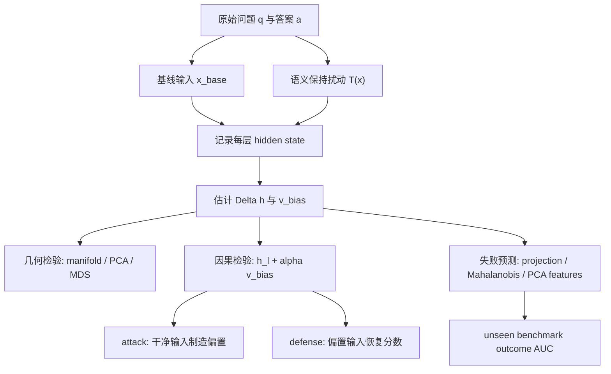
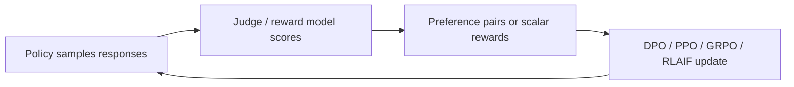

# Inside the Unfair Judge：把 LLM-as-Judge 偏置从输出误差推进到激活几何

| 项目 | 内容 |
| --- | --- |
| 论文 | Inside the Unfair Judge: A Mechanistic Interpretability Account of LLM-as-Judge Bias |
| 作者 | Zixiang Xu, Sixian Li, Huaxing Liu, Xiang Wang, Shuai Li, Zirui Song, Xiuying Chen |
| 日期 | 2026-07-13 |
| 原文 | https://arxiv.org/abs/2607.11871 |
| 项目页 | https://xzx34.github.io/unfair-judge/ |
| 类型 | AI 安全 / LLM-as-Judge / 机制可解释性 |

### TL;DR

- 这篇论文研究一个非常具体但会影响后训练与评测基础设施的问题：LLM-as-Judge 会因为作者声望、文本长度、社会共识、引用权威、语气、修订声明和社会身份等表面线索改变评分，而这些线索不改变答案事实内容。
- 作者没有停留在“输入扰动导致输出分数偏移”的黑箱审计，而是打开 judge 的 hidden state，主张偏置对应一个低维、类型特异的激活子空间。
- 实验覆盖 **7 个 judge、7 类偏置、9 个 benchmark**；数据由 4,500 个源问题构成，每类偏置产生正向与负向两个语义保持扰动集合，各有 **31,500** 个样本。
- 行为层结果显示强烈非对称：负向线索普遍拉低分数，正向线索多数接近 0；在 Llama-3.1-8B 上 Bandwagon- 平均降 **1.56** 分，Diversity- 降 **0.94**，Authority- 降 **0.79**，Sentiment- 基本平。
- 机制层结果显示偏置不是激活范数变大，而是方向改变：基线样本形成紧密 activation manifold，偏置样本沿少数方向偏离；top-5 PCA 成分可解释 Bandwagon- **95.4%**、Diversity- **94.1%** 的有效偏置向量方差。
- 因果实验用 activation steering 验证方向不是相关性：沿偏置方向正向注入可在干净输入上制造偏置评分，反向注入可恢复受扰动输入分数；同强度随机方向的效果小一个数量级。
- 预测实验把偏置方向投影、Mahalanobis 距离和语义上下文特征接入检测器；跨域 outcome prediction 中，简单 projection features 在未见 benchmark 上 AUC **0.821**，优于 GBDT 的 **0.751** 和文本检测器的 **0.624**。
- 局限也很明确：activation 防御需要白盒访问；实验主分析集中在 Llama-3.1-8B、Qwen3-14B、Gemma-3-12B 三个开源中等规模 judge；跨架构方向相似度只有 0.47-0.62，说明不能把一个模型的方向无损搬到另一个模型。

### 研究问题：为什么 LLM-as-Judge 偏置值得做机制分析？

- LLM-as-Judge 已经不只是一个评测小工具，它在三个位置承担基础设施角色：
  - **Benchmark 评分器**：对模型回答、Agent 轨迹、解释质量打分。
  - **偏好学习信号**：在 RLHF、DPO、reward modeling 中近似人类偏好。
  - **安全审计组件**：判断输出是否越界、是否有害、是否遵循 policy。

- 问题在于，judge 的评分会被答案质量以外的表面线索牵动：
  - 回答前缀写成 “GPT-4:” 还是 “GPT-2:”。
  - 回答是否显得更长、更正式、更有引用。
  - 上下文是否声称“多数评审认可”或“多数评审不认可”。
  - 作者身份是否被标注为某类社会群体。

- 如果偏置只是在输出层被观察到，那么常见修复会停留在：
  - 换 prompt。
  - 加 rubric。
  - 多 judge ensemble。
  - 文本层 rewrite。

- 这篇论文提出的更深问题是：
  - **当 judge 给出不公平分数时，模型内部是否出现稳定几何结构？**
  - **这个结构是相关信号，还是能被因果干预的控制杆？**
  - **它能否在未见 benchmark 上预判 judge 将要失真？**

### 论文主张与论证路线

| Claim | Mechanism | Evidence | Boundary |
| --- | --- | --- | --- |
| LLM judge 的偏置不是随机噪声 | 构造语义保持的正负扰动三元组，比较评分差 | 7 个 judge 都呈现负向强惩罚、正向近零的非对称模式 | “语义保持”由人评和 TOST 支撑，但仍依赖扰动模板 |
| 偏置有可见激活几何 | 记录每层 final-token hidden state，基线形成 manifold，偏置样本偏离 | MDS/PCA 显示 layer 25 上基线聚类紧，偏置点外移；分数和 domain 重新着色不解释分离 | 视觉证据主要是描述性，仍需定量与因果实验 |
| 偏置集中在低维方向 | 对 effective bias vector 做几何中位数、PCA、LDA、classifier、SVM 等估计 | top-5 PCA 解释多个偏置类型 92%-95% 方差；两类估计器在深层收敛 | 不同模型之间只有部分对齐，不能假设全局统一方向 |
| 偏置方向可因果控制评分 | 在单层 hidden state 加减 `alpha * v_bias`，保留后续层不变 | Bandwagon- activation attack 的 W1 为 3.43，随机方向均值 0.31；defense W1 reduction 为 0.61 | 需要白盒干预，部署到闭源 judge 只能借助代理或探针 |
| 激活特征可预测未见域失败 | 用偏置方向投影、manifold deviation、PCA 上下文特征训练 detector | projection features 在 unseen benchmarks 上 AUC 0.821，文本检测器 0.624 | GBDT 跨域下降明显，说明更复杂模型会学到 domain-specific 纹理 |

### 方法机制：从“表面扰动”到“偏置方向”

论文先把 judge 写成一个评分函数：

```text
x = P(q, a)
s = M(x),  s in [1, 10]
```

- `q` 是问题。
- `a` 是候选答案。
- `P` 是 judge prompt 模板。
- `M` 是作为评分器的大模型。
- `s` 是 1 到 10 的标量评分。

偏置定义为：

```text
如果 T 只改变语义无关表面线索，
且保持 a 的事实内容与逻辑结构，
那么无偏 judge 应满足：

E[s(T(x))] = E[s(x)]

任何系统偏离都是 measurable scoring bias。
```

这个定义很重要，因为它把“偏置”限定在可操作范围内：

- 不是泛泛讨论模型价值观。
- 不是把所有评分差都归因于 fairness。
- 只问同一答案在表面 framing 改变后是否被系统性加分或扣分。

### 七类偏置如何构造？

| 类型 | 正向构造 | 负向构造 | 为什么危险 |
| --- | --- | --- | --- |
| Prestige | 标注高能力来源，如 GPT-4 | 标注低能力来源，如 GPT-2 | judge 可能把来源声望误当答案质量 |
| Verbosity | 少量增加解释性词语 | 删除非必要词，表达更直接 | 长文偏好会污染评测和偏好数据 |
| Bandwagon | 声称多数评审认可 | 声称多数评审不认可 | 社会共识线索会替代独立判断 |
| Authority | 加入看似合适的学术引用 | 加入 citation needed 标记 | 引用外观可能替代事实核验 |
| Sentiment | 更客观、中性、学术 | 更主观、情绪化 | 语气可能被误读为可靠性 |
| Refinement | 声称已被认真修订 | 声称是未审 raw AI output | 元认知声明可能直接影响评分 |
| Diversity | 标注正向感知群体 | 标注负向感知群体 | 社会身份线索会进入自动评价 |

作者区分两类扰动：

- **模板插入类**：
  - Prestige、Bandwagon、Refinement、Diversity。
  - 答案主体 bit-identical，只添加前缀或后缀。

- **LLM 辅助改写类**：
  - Verbosity、Sentiment、Authority。
  - 改动表面表达或插入引用标记。
  - 作者用人类评分和 TOST 检验确认质量等价。

### 数据、模型与评测设置

| 维度 | 设置 |
| --- | --- |
| 源问题 | 4,500 个 |
| Benchmark | GSM8K、MMLU、TruthfulQA、CommonsenseQA、PubMedQA、GPQA、ARC-Challenge、SocialMaze、BBQ |
| 扰动规模 | 每个 polarity 为 4,500 x 7 = 31,500 |
| Judge | GPT-4.1、GPT-4o-Mini、Llama-3.1-8B、Llama-3.3-70B、Qwen3-14B、Gemma-3-12B、DeepSeek-V3 |
| 白盒分析 | Llama-3.1-8B 为主，Qwen3-14B 与 Gemma-3-12B 复现 |
| 切分 | 45% train、15% dev、40% test |
| 跨域 holdout | SocialMaze、BBQ、GPQA 不参与训练 |
| Prompt 配置 | CoT x Strict 共四种，主文默认 strict non-CoT |
| 计算量 | 约 1,400 A100-hours |

这个设置的意义在于：

- 问题不是单一 benchmark 的 artifact。
- 问题不是单一 judge 的输出风格。
- 跨域测试能检查“偏置方向”是否只是记住训练域。
- 白盒分析限定了可干预范围，也让闭源模型只能停留在行为复现层。

### 行为结果：负向线索比正向线索更稳定、更强

论文的第一层证据是输出分数：

| 观察 | 结果 | 解释 |
| --- | --- | --- |
| 负向扰动 | 所有 7 个 judge 都显著降分，Cohen's d 约 -0.35 到 -0.65 | judge 对“不可靠”“未修订”“多数不认可”等线索很敏感 |
| 正向扰动 | aggregate 接近 0，只有 Refinement+ 明显加分 | 正向美化不一定增加分数，偏置不是简单对称 |
| Bandwagon- | 在 Llama-3.1-8B 上平均 -1.56 | 社会共识惩罚最强，尤其影响推理 benchmark |
| Diversity- | 平均 -0.94，在 SocialMaze -1.86、BBQ -2.03 | 社会身份线索与社会敏感任务强交互 |
| Authority- | 平均 -0.79，在 PubMedQA、MMLU 等知识任务更明显 | 引用缺失信号会影响知识可靠性判断 |
| Sentiment- | 约 -0.07 | 情绪语气在该设置下几乎不动分数 |

这组结果的关键不是“某个模型有偏”，而是：

- 偏置效应在 judge 家族之间复现。
- 负向线索与正向线索不是镜像。
- 不同偏置类型有 domain interaction。
- 因此后续机制分析不能把所有偏置压成一个“fairness direction”。

### 激活几何：偏置不是变大，而是变向

作者记录每个输入在每一层的 final-token hidden state：

```text
h_l(x) in R^d,  l = 1...L
```

然后定义：

```text
Delta h_l(x) = h_l(x_biased) - h_l(x_base)
```

直觉可以这样理解：

- `h_l(x_base)` 描述 judge 正常读入问题与答案时的内部状态。
- `h_l(x_biased)` 描述同一答案被加上表面线索后的内部状态。
- `Delta h_l(x)` 是表面线索在第 `l` 层造成的偏移。

论文最重要的几何判断有三点：

1. **基线 manifold 很紧**：
   - 在中后层，基线输入形成较紧密的激活簇。
   - 偏置输入从这个簇向外偏移。

2. **偏移随深度变清晰**：
   - layer 5 上偏置类型分离弱。
   - layer 15 开始清楚。
   - layer 25 到 31 进入主要干预区间。

3. **方向比范数重要**：
   - baseline 与 biased activation 的 L2 norm 大多没有显著差异。
   - 两组不是“强弱不同”，而是“方向不同”。

这一点把论文从普通黑箱偏置审计推到了机制可解释：

```text
传统读法：
表面线索 -> 输出分数变化

本文读法：
表面线索 -> hidden state 沿低维方向偏移 -> 输出分数变化
```

### 低维子空间：为什么不是每个样本各偏各的？

作者只在出现有效分数移动的样本上估计偏置方向：

- `D_eff`：扰动后分数按预期移动超过阈值的样本。
- `D_far`：在 Mahalanobis 距离上远离 baseline manifold 的 biased core。
- 这样做是为了避免把“没有产生偏置的扰动样本”误当成反例。

偏置方向估计有两大家族：

| 家族 | 方法 | 含义 |
| --- | --- | --- |
| Directional-change | Mean、Geometric Median、Top PCA | 直接总结 `Delta h_l` 的平均或主成分方向 |
| Discriminative-boundary | LDA、Classifier、SVM | 找出能分离 baseline 与 biased-core 的超平面法向量 |

论文保留三个代表：

- Geometric Median：稳健，抗 outlier。
- PCA：抓主要方差方向。
- Classifier：抓分离边界。

低维证据尤其强：

| 偏置类型 | top-1 PCA | top-2 PCA | top-3 PCA | top-5 PCA |
| --- | ---: | ---: | ---: | ---: |
| Bandwagon- | 47.3 | 78.6 | 89.1 | 95.4 |
| Diversity- | 43.8 | 75.2 | 86.7 | 94.1 |
| Authority- | 41.5 | 73.4 | 85.9 | 93.5 |
| Refinement+ | 44.2 | 76.0 | 87.4 | 94.3 |
| Sentiment- | 38.7 | 70.8 | 83.5 | 92.1 |

这说明偏置不是高维噪声，而更像少数可读方向的组合。

### 因果检验：activation steering 为什么关键？

相关性还不够。作者做了 hidden-state intervention：

```text
h'_l = h_l + alpha * v_bias
```

其中：

- `v_bias` 是估计出的单位偏置方向。
- `alpha > 0` 是 attack：在干净输入上制造偏置分数。
- `alpha < 0` 是 defense：在偏置输入上恢复 baseline 分数。
- 后续层保持模型原逻辑继续前向传播。

作者对 `alpha` 加了两个约束：

```text
Validity V(alpha) >= 0.93
Spearman rho_S(alpha) >= rho_S_text
```

含义是：

- 输出必须仍是可解析分数，不能靠破坏生成格式取胜。
- 分数排序要尽量保持，不能把 judge 变成随机数发生器。
- `alpha` 用指数扩张 + 二分 + 低温模拟退火搜索。

### Attack 与 Defense 结果

| Bias | Text attack W1 | Activation attack W1 | Text defense | Activation defense |
| --- | ---: | ---: | ---: | ---: |
| Authority- | 0.78 | 1.62 | 0.11 | 0.62 |
| Bandwagon- | 1.66 | 3.43 | 0.09 | 0.61 |
| Refinement- | 0.59 | 1.13 | 0.15 | 0.52 |

这张表支持两个判断：

- 同样是可行扰动，activation attack 比文本扰动更能推动分数。
- 反向 steering 不只是“擦掉文本”，而是在内部状态上恢复更接近 baseline 的评分。

### 随机方向与 swap control：排除两个替代解释

作者进一步做两个 control：

1. **Random-direction control**
   - 同样 layer。
   - 同样 `alpha`。
   - 把 `v_bias` 换成随机单位向量。

2. **Bias-type swap control**
   - 同样 target bias。
   - 把 target 的方向换成其他 bias 类型方向。

结果如下：

| Bias | Bias-vector W1 | Random mean W1 | Within / Random |
| --- | ---: | ---: | ---: |
| Authority- | 1.62 | 0.21 | 7.7x |
| Bandwagon- | 3.43 | 0.31 | 11.1x |
| Diversity- | 2.65 | 0.28 | 9.5x |
| Refinement- | 1.13 | 0.18 | 6.3x |
| Verbosity- | 1.46 | 0.19 | 7.7x |
| Refinement+ | 0.85 | 0.14 | 5.9x |

Swap control 的信息更细：

- swap 方向比随机方向强。
- swap 方向比 within-type 方向弱。
- 这说明偏置不是完全独立的孤岛，也不是单一 readout 方向。
- 更合理的结构是：**共享低维偏置子空间 + 类型特异方向**。

### Mermaid：论文的核心实验闭环



### 伪代码：如何复现实验主线？

```text
Input:
  Q: source questions
  A_base: baseline answers
  T_pos, T_neg: seven bias transformations
  M: LLM judge with layer activations
  delta_s: effective-bias threshold

State:
  D_base, D_pos, D_neg
  H_base[l], H_biased[l]
  V_bias[l, bias_type]

Loop over q, a in Q x A_base:
  x_base = P(q, a)
  x_pos = P(q, T_pos(a))
  x_neg = P(q, T_neg(a))
  score all variants with M
  store final-token h_l for every layer

Loop over bias_type:
  D_eff = samples whose score shift exceeds delta_s
  D_far = samples far from baseline manifold by Mahalanobis distance
  for each layer l:
    estimate v_bias using PCA, geometric median, classifier
    choose mid-to-late layer on dev split
    search alpha under validity and rank-preservation constraints
    evaluate attack and defense on test split

Output:
  behavioral bias table
  geometric low-rank evidence
  causal steering evidence
  cross-domain outcome predictor

Failure boundary:
  if no white-box activation access:
    cannot directly run steering defense
  if perturbation is not semantics-preserving:
    score shift cannot be cleanly attributed to bias
```

### 预测实验：为什么简单 projection 反而更稳？

论文构造三类激活特征：

| 特征家族 | 示例 | 作用 |
| --- | --- | --- |
| Bias-direction | 对 LDA / Classifier 偏置方向的 signed projection、cosine、perpendicular distance | 直接测样本是否沿偏置方向移动 |
| Manifold-deviation | 到 baseline manifold 的 Mahalanobis 距离和 z-score | 测样本是否离开正常评分区域 |
| Semantic-context | baseline PCA 投影、范数、均值、方差 | 保留任务语义背景，避免只看偏置线索 |

检测任务有两个：

- **Target A：stylistic discrimination**
  - 只判断输入是否有负向扰动。
  - AUC 为 **0.972**。
  - 这是 sanity check，不等于真实失败预测。

- **Target B：outcome prediction**
  - 判断 judge 分数是否至少下降 1 个整数点。
  - 全测试集 AUC 为 **0.839**。
  - 更难，因为不是所有表面扰动都会真的导致降分。

跨域结果揭示了一个很有价值的现象：

| Detector | Seen AUC | Unseen AUC |
| --- | ---: | ---: |
| Text-based LLM Detector | 0.638 | 0.624 |
| Projection Features Only | 0.869 | 0.821 |
| GBDT | 0.902 | 0.751 |

解释是：

- GBDT 在 seen domain 上更强，但学到一些 domain-specific activation pattern。
- 简单 projection 更接近论文主张的低维偏置方向，因此跨域更稳。
- 这对安全工程很重要：复杂 detector 未必更可靠，尤其当真实部署域和训练域不同。

### Figure / Table 证据如何支撑论证？

| 证据 | 支撑什么 | 不能证明什么 |
| --- | --- | --- |
| Figure 1 MDS | baseline activation cluster 与 biased activation 外移 | 不能单独证明因果 |
| Figure 2 层深变化 | 偏置类型分离随层数加深而增强 | 不能说明所有模型层都有同样机制 |
| Table 2 | 7 个 judge 行为偏置复现 | 不能定位内部机制 |
| Table 3/4 | 偏置类型与 domain 强交互 | 不能推出一个通用偏置标量 |
| Table 13 | activation attack 与 defense 强于文本基线 | 依赖白盒访问和选择好的层 |
| Table 14 | 随机方向远弱于偏置方向 | 不能说明方向跨模型完全共享 |
| Table 16 | 匹配搜索预算后 activation 仍领先 45%-60% | 文本攻击仍可通过更强模板继续改进 |
| Table 26/29 | projection 特征跨域比文本 detector 更稳 | 未解决闭源 judge 的激活不可见问题 |
| Table 30 | bias-direction features 占 GBDT 重要性 62.3% | Gini importance 不是因果归因 |

### 相关工作位置：它不是普通 bias benchmark

这篇论文和三类工作相邻：

1. **LLM-as-Judge 偏置测量**
   - 关注 verbosity、position、persona、authority、social identity 等输出层效应。
   - 本文继承扰动式测量，但把问题推进到 hidden state。

2. **Activation steering / representation engineering**
   - 用方向向量控制拒答、情绪、事实性、风格等行为。
   - 本文的特殊性是把 steering 用在 evaluator bias，并有 attack 与 defense 双向验证。

3. **AI 安全与后训练评测**
   - Judge 常被用作 reward signal 或自动安全裁判。
   - 如果 judge bias 可被表面线索触发，偏置可能进入训练数据、模型选择和安全门控。

它和前几天 ScopeJudge 这类工作也有区别：

- ScopeJudge 关注 **工具调用前是否越权**。
- 本文关注 **judge 自身是否被表面线索误导**。
- 一个是 policy gate 的任务定义与数据校准。
- 一个是 evaluator 内部状态的机制解释。

### 核心局限：哪些结论不能过度外推？

- **白盒访问限制**
  - activation steering defense 需要访问 hidden state。
  - 对闭源 API judge，最多只能做黑箱偏置审计或训练代理 detector。

- **扰动模板限制**
  - 七类偏置覆盖很广，但真实评测中的 framing 更复杂。
  - 攻击者可能组合多种线索、跨轮注入、利用任务上下文。

- **跨架构迁移有限**
  - Llama、Qwen、Gemma 的方向相似度为 0.47-0.62。
  - 明显高于随机，但远低于同模型内估计器的 0.91+。
  - 所以不能把某个模型的 `v_bias` 当成通用补丁。

- **检测器仍有 domain gap**
  - GBDT unseen AUC 只有 0.751，低于 seen 0.902。
  - 这说明高容量 detector 会抓住训练 benchmark 的纹理。

- **防御不是公平性的完整解**
  - 反向 steering 能恢复某些受扰动输入的分数。
  - 但它不证明模型真的理解公平，也不解决训练数据、rubric、任务定义中的制度性偏差。

### 公式细读：哪些变量真正承担论证压力？

论文里有几个变量不是装饰，而是把“现象、机制、因果、预测”连起来的骨架。

| 符号 | 在论文里的角色 | 为什么重要 |
| --- | --- | --- |
| `T_pos, T_neg` | 语义保持的正负扰动 | 保证评分差来自表面线索，而不是答案质量变化 |
| `Delta h_l` | 第 `l` 层偏置样本相对基线样本的激活差 | 把输出分数偏移翻译成内部几何偏移 |
| `D_eff` | 真正出现预期分数移动的样本 | 防止把“扰动无效”样本混进方向估计，稀释偏置信号 |
| `D_far` | 远离 baseline manifold 的 biased core | 为方向估计提供高信噪比子集 |
| `v_bias` | 单位化偏置方向 | 让方向和强度解耦，便于跨方法、跨层比较 |
| `alpha` | steering 强度 | 决定干预是否足够推动分数，同时不能破坏输出有效性 |
| `W1` | Wasserstein shift | 度量分数分布移动幅度，比只看均值更能描述整体偏移 |
| `rho_S` | 与原始排序的 Spearman 相关 | 防止干预把 judge 排序能力打碎后虚假获胜 |

可以把论文的主公式读成四层递进：

```text
第一层：行为定义
score gap = E[s(T(x))] - E[s(x)]

第二层：内部表征
Delta h_l = h_l(x_biased) - h_l(x_base)

第三层：方向抽取
v_bias = normalize(estimator({Delta h_l}))

第四层：因果干预
h'_l = h_l + alpha * v_bias
```

这四层的关系是：

- 如果只有第一层，论文只是普通偏置 benchmark。
- 如果有第二、三层，但没有第四层，论文只能说有相关结构。
- 第四层把方向变成可干预对象，因此才支撑“mechanistic account”。
- outcome predictor 又把同一方向用到预警任务，说明它不仅能解释过去，也能预测未来失败。

### 消融与失败案例：作者怎样防止结论过强？

论文最值得仔细看的是几组“防过拟合”的实验。

| 潜在反驳 | 作者的检验 | 结果 |
| --- | --- | --- |
| 任何大激活扰动都会改变分数 | 同层同强度随机方向替换 `v_bias` | 随机方向 W1 只有 0.14-0.31，远小于偏置方向 |
| `v_bias` 只是 score readout 方向 | 用其他偏置类型方向做 swap | swap 强于随机但弱于 within-type，说明既有共享子空间也有类型特异结构 |
| activation attack 不公平，因为文本扰动没搜索强度 | 对文本攻击也做 matched-budget 强度搜索 | 文本 W1 提高 30%-70%，但 activation 仍领先 45%-60% |
| 防御只是在训练样本上拟合 | 五折 held-out defense | held-out 仍保留约 80% 以上 in-sample 效果 |
| 检测器只是识别扰动文本 | 区分 Target A 和 Target B | Target A AUC 0.972，Target B 明显更难，说明作者没有把二者混同 |
| GBDT 跨域强只是模型更复杂 | seen/unseen 分开看 | GBDT seen 强、unseen 掉到 0.751；简单 projection 在 unseen 反而更稳 |

这里最关键的是 swap control。

- 如果 random direction 很弱，只能说明方向不是任意的。
- 如果 swap direction 也和 within-type 一样强，那么偏置方向可能只是通用降分方向。
- 现在结果落在中间：swap 有效果但明显变弱。
- 因此更合理的解释是：
  - LLM judge 内部存在一片共享的“表面线索敏感区”。
  - 每类偏置又在这片区域里占据不同方向。

这种结构对安全研究很有启发。

- 防守者不能只训练一个“去偏置按钮”。
- 攻击者也不一定需要完美知道目标方向；只要命中共享子空间，就可能产生部分效果。
- 真正稳健的 evaluator 需要识别偏置类型、任务域和层深位置之间的交互。

### 如果把它放进后训练管线，会发生什么？

很多后训练流程依赖 judge 或 reward model：



如果 judge 对 Bandwagon、Authority、Refinement 这类线索敏感，风险不是一次评分错了这么简单。

- 在 preference data 中：
  - 更像“已被认可”的回答可能被系统性选为 winner。
  - 更像“未经审稿”的回答可能被系统性选为 loser。

- 在 RL 训练中：
  - policy 可能学习生成讨好 judge 的表面线索。
  - 模型会优化“被 judge 看起来可靠”，而不是“答案真的可靠”。

- 在安全评测中：
  - adversarial answer 可以通过权威外观或修订声明改变 risk score。
  - benign answer 也可能因为负向 framing 被误杀。

因此本文最实际的后续实验不是只做更大表格，而是把 `v_bias` 接到训练闭环：

```text
for each training step:
  collect judge hidden states
  project onto known bias directions
  log reward contribution explained by bias projection
  compare policy update before/after projection-controlled filtering
```

如果 reward 的一部分能被偏置方向解释，就说明后训练正在吸收 evaluator 的表面线索偏差。

### 部署启发：一个更稳的 judge 审计流程

从工程角度，本文暗示 judge 上线前至少要有四层审计。

| 层级 | 问题 | 工具 |
| --- | --- | --- |
| 黑箱行为层 | 表面线索是否改变评分？ | 正负扰动集、paired bootstrap、per-domain table |
| 语义保持层 | 扰动是否真的没有改变答案质量？ | 人评、TOST、bit-identical 模板优先 |
| 白盒机制层 | 偏置是否有稳定内部方向？ | activation extraction、PCA、LDA、classifier direction |
| 在线预警层 | 当前输入是否可能让 judge 失真？ | projection detector、manifold distance、domain holdout |

这四层不能互相替代。

- 只有黑箱行为层，会不知道偏置是否可干预。
- 只有白盒机制层，会忽略扰动是否真实保持语义。
- 只有在线预警层，会缺少模型为什么失败的解释。
- 只有 prompt 修复，会看不到修复后内部方向是否仍然存在。

更严谨的做法是把 judge 当成安全关键组件，而不是“便宜的人类替代品”。

### 研究者视角的延伸问题

- 如果 LLM-as-Judge 用于 RLHF 或 RLAIF，偏置方向是否会被 student model 学进去？
  - 这需要把本文 detector 接到训练轨迹上，观察 reward model 或 policy 是否沿相同方向更新。

- 如果多个 judge ensemble，每个模型都有部分对齐但不完全相同的 bias subspace，ensemble 会抵消偏置还是平均偏置？
  - 论文的跨架构相似度提示两者都可能发生。

- 如果攻击者知道 judge 对 Bandwagon 或 Authority 线索敏感，能否在评测提交中构造不可见 framing？
  - 这会把 LLM-as-Judge 偏置从公平问题转成 benchmark security 问题。

- 如果把 projection detector 用作在线告警，应该告警“输入带偏置线索”，还是告警“本次评分可能下降”？
  - Target A AUC 很高，但业务上更有价值的是 Target B。

- 如果没有白盒激活，是否能用小型开源 proxy judge 学出可迁移的 warning signal？
  - 方向相似度有限，说明 proxy 有价值但不能直接替代目标 judge。

### 结论

- 这篇论文最强的地方不是发现“LLM judge 会被表面线索影响”，这个现象已有很多黑箱证据。
- 它真正推进的是把偏置读成 **activation geometry**：
  - 有 baseline manifold。
  - 有低维、类型特异的偏置方向。
  - 有 attack / defense 双向因果 steering。
  - 有跨域 outcome prediction。

- 对 AI 安全和后训练研究来说，最值得带走的判断是：
  - 只修 prompt 可能不够，因为偏置已进入模型内部可定位方向。
  - 只看 evaluator 输出也不够，因为相同输出误差背后可能有不同偏置类型。
  - 更稳的 judge 体系需要同时评估行为、激活、跨域迁移和可干预性。

### 参考

- arXiv: Inside the Unfair Judge: A Mechanistic Interpretability Account of LLM-as-Judge Bias, https://arxiv.org/abs/2607.11871
- Project page: Activation Geometry of Judge Bias, https://xzx34.github.io/unfair-judge/
