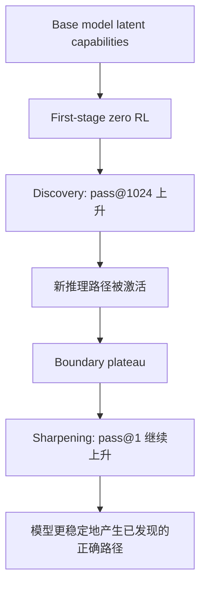

# Ring-Zero：1T 参数规模下 Zero RL 后训练到底改变了什么？

### 元信息与 TL;DR

- **论文**：Ring-Zero: Scaling Zero RL to a Trillion Parameters for Emergent Reasoning
- **作者**：Xinyu Tang、Gangqiang Cao、Yurou Liu、Yuliang Zhan、Xiaochong Lan、Yifan Li、Yuchen Yan、Han Peng、Zican Dong、Zhenduo Zhang、Tianshu Wang、Xinyu Kong、Zujie Wen、Wayne Xin Zhao、Zhiqiang Zhang、Jun Zhou
- **机构**：中国人民大学高瓴人工智能学院、蚂蚁集团、清华大学、浙江大学
- **时间**：2026-07-14
- **链接**：[arXiv 摘要](https://arxiv.org/abs/2607.12395)、[HTML 全文](https://arxiv.org/html/2607.12395v1)、[PDF](https://arxiv.org/pdf/2607.12395)
- **类型**：大模型后训练、Zero RL、推理模型扩展、CoT 质量评估

**TL;DR**

- Ring-Zero 研究的问题是：不使用人工标注 CoT，直接从 base model 做 RLVR/zero RL 时，把规模推到 1T 参数，会出现什么训练动态、稳定性瓶颈和推理行为。
- 作者训练 Ling-2.5-1T-Base，这是 1T 参数 MoE、每 token 激活约 63B；对照模型是 104B 参数、激活约 7.4B 的 Ling-2.5-flash-Base。
- 训练管线分四段：第一阶段 RL 用 clipped importance-sampling policy gradient 激发长链推理；随后 self-distillation 压缩 CoT 并重置训练-推理引擎 gap；第二阶段 RL 改为 sample-level loss 控制长度；第三阶段 tier-based RL 学会 Low/Medium/High 三档推理深度。
- 稳定性关键不是复杂 reward，而是几个系统和算法补丁：training-inference ratio correction、KL penalty、BF16 主体加 FP32 attention softmax/LM head、context parallelism 优化。
- 主结果在 7 个数学 benchmark 上报告 pass@1。Ring-2.5-1T-Zero 第二阶段加 Yarn=2 达到 AIME2024 94.1、AIME2025 92.3、AIME2026 93.2、HMMT Feb 2026 81.0、IMOAnswerBench 75.5。
- 论文最有价值的不是“1T 分数很高”这一句，而是发现 zero RL 有两个阶段：早期 pass@1024 上升，像 discovery；之后 pass@1024 饱和但 pass@1 继续上升，像 sharpening。
- 作者还提出 CoT 质量三维评估：comprehensibility、reproducibility、efficiency。Ring-Zero trace 被 judge 判为更清楚，用 100K trace 蒸馏 Qwen2.5-32B/Llama3.3-70B 分别达到 78.4/74.5，并且共同答对题上的平均 CoT 只有 6368 tokens。
- 局限是：结果主要是数学 RLVR，依赖强 verifier 或后期 LLM judge；1T 训练用 320 张 H200，复现成本极高；所谓 emergent behaviors 中包含 context anxiety 和拟人化痕迹，不应被简单解读为可靠认知能力。

### 研究问题：Zero RL 到 1T 规模后，争议点在哪里？

Zero RL 的基本设定很激进：

- 不从人工 CoT 轨迹做 SFT。
- 直接让 base model 在可验证任务上试错。
- 用最终答案正确性和格式奖励训练推理链。
- 希望模型自己发现有用的 reasoning pattern。

这条路线在较小模型和数学任务上已经有证据，但 1T 规模仍有几个未回答问题。

| 问题 | 为什么重要 | Ring-Zero 的切入 |
|---|---|---|
| 训练能不能稳定 | 低概率 token 被放大时，训练和推理引擎的小数值差异可能爆炸 | ratio correction、KL、混合精度控制 |
| 扩大模型是否只是提高最终分数 | 可能只是更强 base prior，而不是 RL 发现新能力 | 比较 104B 与 1T 的 pass@1、pass@1024 动态 |
| RL 是 discovery 还是 sharpening | 社区争议 RL 是否扩展能力边界 | 用 pass@1024 与 pass@1 的时间曲线拆阶段 |
| CoT 是否只是更长 | token-level loss 会鼓励长度膨胀 | self-distillation、sample-level loss、效率评估 |
| emergent behavior 是否需要手工模板 | 过去常用格式奖励、自检模板、并行思路提示 | 观察 1T 模型是否自发出现结构化、自验证、并行推理 |

作者的核心主张不是“人类规则完全无用”，而是更窄的经验判断：

- 当模型容量和训练计算足够大时，一些以前需要手工设计的推理行为，会在 zero RL 中自发成为高回报策略。
- 但要让这个过程不崩，需要非常具体的稳定性约束和长度控制。

### 训练管线：四个阶段分别解决什么问题？

Ring-Zero 的 pipeline 可以看成“先拉长、再压缩、再稳定优化、最后学会按题分配预算”。

| 阶段 | 目标 | 关键机制 | 解决的问题 |
|---|---|---|---|
| First-stage RL | 从 base model 激发推理链 | clipped importance-sampling、token-level loss、KL penalty | base model 初始不爱生成低概率推理 token |
| Self-distillation | 压缩并重置模型 | 选最短正确 trace，再自评过滤冗余段，回到 base model 做 SFT | 第一阶段 CoT 太长，训练-推理 gap 累积 |
| Second-stage RL | 持续提升 | sample-level loss，移除 KL | 避免 token-level loss 继续制造长度膨胀 |
| Third-stage RL | 自适应推理深度 | Low/Medium/High 三档 prompt 和 token budget | 简单题不该被迫走 64k 长思考 |

这个设计有一个隐含的节奏：

1. **探索期需要鼓励长链**：如果一开始就按样本归一化，base model 可能不愿探索低概率推理路径。
2. **稳定期必须抑制长度惯性**：一旦模型学会长 CoT，继续按 token 累加 reward 会鼓励冗余。
3. **部署期需要预算路由**：同一个模型要能回答简单题，也要能处理长推理题。

### 公式与变量：Ring-Zero 的 RL 目标如何写？

第一阶段的核心是 clipped importance-sampling policy gradient。简化写法如下：

```text
J(theta) = E_{q, o_i} sum_i sum_t sg(rho_hat_{i,t}) * A_hat_{i,t} * log pi_theta(o_{i,t} | q, o_{i,<t})
```

变量解释：

- `q` 是训练问题。
- `o_i` 是第 `i` 条 rollout response。
- `A_hat_{i,t}` 是基于组内 reward 的 advantage。
- `rho_hat` 是 clipped importance ratio。
- `sg()` 是 stop-gradient，只让 ratio 作为权重，不让它本身反向传播。

论文强调它与标准 PPO-clip 的区别：

- 标准 PPO-clip 会把超出 clipping range 的 token 梯度归零。
- Ring-Zero 仍允许所有 token 贡献梯度，只是用 clipped ratio 控制权重。
- 这对从 base model 激发推理很重要，因为早期有用推理 token 往往是低概率 token。

ratio correction 的关键是分子不用推理引擎重新算，而用训练引擎的当前 logits：

```text
rho_{i,t} = pi_M^theta(o_{i,t} | q, o_{i,<t}) / pi_S^{theta_old}(o_{i,t} | q, o_{i,<t})
```

其中：

- `pi_M` 是 Megatron training engine。
- `pi_S` 是 SGLang rollout engine。
- 分母来自生成 rollout 的旧推理策略。
- 分子来自真实训练引擎，避免两个引擎浮点实现差异被 importance ratio 放大。

第二阶段切换到 sample-level loss：

```text
L_stage2 = - E sum_i (1 / |o_i|) * sum_t sg(rho_hat_{i,t}) * A_hat_{i,t} * log pi_theta(...)
```

这一个 `1 / |o_i|` 很关键：

- token-level loss 会让长答案天然获得更大梯度。
- sample-level loss 让每条样本的总权重不再随长度线性增长。
- 因此它是控制 length inertia 的核心开关。

### 系统稳定性：为什么 1T zero RL 会崩？

论文反复强调一个工程事实：大规模 RL 不是“公式正确就能跑”。在 off-policy 设置中：

- SGLang 负责 rollout。
- Megatron 负责训练。
- 两个引擎即使参数相同，也会因为 kernel、precision、softmax 实现产生微小 logit 差异。
- importance ratio 会指数级放大概率差异。
- 低概率 token 被有意放大时，这个问题更严重。

稳定性策略可以拆成四类：

| 风险 | 现象 | 论文处理 |
|---|---|---|
| policy drift | 无 KL 时 log-prob gap 发散、entropy collapse、reward crash | 第一阶段加 KL penalty |
| train-infer mismatch | baseline ratio 约 800 steps 崩，IcePop 约 2700 steps 后也失败 | 分子用 Megatron 当前 logits |
| softmax/LM head 精度 | exponentiation 放大 BF16 小误差 | 主体 BF16，attention softmax 和 LM head 用 FP32 |
| 长上下文通信 | ring attention 顺序传 KV 造成延迟 | MLA 层 all-to-all CP，Lightning Attention 层 AllGather |

这里最有研究价值的是 ratio correction。它不是一个抽象 RL 技巧，而是大规模训练系统里的数值对齐问题。模型越大、上下文越长、低概率 token 权重越高，这类 gap 越容易从“可忽略误差”变成“训练崩溃原因”。

### 实验设置：模型、数据、奖励和评测

实验配置足够重：

| 项目 | 设置 |
|---|---|
| 1T 模型 | Ling-2.5-1T-Base，1T 参数 MoE，约 63B activated |
| 对照模型 | Ling-2.5-flash-Base，104B 参数 MoE，约 7.4B activated |
| 硬件 | 320 张 H200 GPU |
| 训练框架 | Megatron + SGLang + Areal |
| rollout | 每题 `G=16`，temperature 1.0 |
| 第一阶段 | batch 512/minibatch 32，token-level loss，KL `1e-4`，窗口 4k 到 64k 逐步扩展 |
| distillation | 选最短正确 trace，自评去冗余，64k 序列，学习率 `7e-5`，3 epochs |
| 第二阶段 | sample-level loss，移除 KL |
| 第三阶段 | Low 4k、Medium 16k、High 64k/128k 预算 |
| reward | accuracy + format，早期规则匹配，后期 Qwen3-Next-80B-A3B-Instruct judge |

评测包含 7 个数学 benchmark：

- AIME 2024
- AIME 2025
- AIME 2026
- HMMT February 2025
- HMMT November 2025
- HMMT February 2026
- IMOAnswerBench

所有评测报告 pass@1，平均 64 次运行以降低方差。

### 主结果：1T zero RL 的分数和阶段收益

Table 1 最重要的不是和闭源 frontier model 的横向比较，而是同一条训练管线不同阶段的纵向变化。

| 模型阶段 | AIME24 | AIME25 | AIME26 | HMMT Feb25 | HMMT Nov25 | HMMT Feb26 | IMOAnswer |
|---|---:|---:|---:|---:|---:|---:|---:|
| flash First-stage RL | 71.2 | 63.5 | 65.3 | 55.2 | 54.8 | 50.3 | - |
| flash Distilled | 86.2 | 77.2 | 78.0 | 70.3 | 68.5 | 62.6 | - |
| 1T First-stage RL | 89.1 | 83.3 | 84.2 | 76.7 | 75.8 | 66.2 | 59.3 |
| 1T Self Distillation | 92.3 | 87.3 | 88.1 | 81.9 | 79.9 | 71.2 | 63.8 |
| 1T Second-stage RL | 93.5 | 91.6 | 92.5 | 87.4 | 87.1 | 78.1 | 72.7 |
| 1T Second-stage RL, Yarn=2 | 94.1 | 92.3 | 93.2 | 90.6 | 90.8 | 81.0 | 75.5 |
| Third-stage Low | 82.3 | 64.0 | 68.8 | 61.3 | 65.3 | 52.5 | 54.1 |
| Third-stage Medium | 90.9 | 88.1 | 90.8 | 80.4 | 84.8 | 74.1 | 70.8 |
| Third-stage High | 93.2 | 91.0 | 91.4 | 86.3 | 86.4 | 78.4 | 72.7 |

这张表支持四个判断：

- 1T First-stage RL 已经明显强于 flash First-stage RL，说明规模提升带来更高起点和上限。
- Self-distillation 不是只为压缩文本，它还显著提升 benchmark 分数。
- Second-stage RL 在 sample-level loss 下还能继续提升，说明压缩后不是训练终点。
- Third-stage 的多档预算带来灵活性，但 High 档略低于第二阶段峰值，说明多长度联合训练存在负迁移。

作者对第三阶段下降给出两个解释：

- 高质量超长推理数据不足，限制 High 模式上界。
- Low、Medium、High 三种长度混训会互相拉扯，高预算能力被低预算信号轻微拖低。

### CoT 质量评估：不只看答案对不对

论文提出三维 CoT 质量评估，是本文较有价值的一部分。

| 维度 | 衡量什么 | 具体做法 |
|---|---|---|
| Comprehensibility | 人类能否跟随推理过程 | LLM-as-a-Judge pairwise 比较逻辑连贯、因果显式、无幻觉 |
| Reproducibility | 弱模型能否从 trace 学到能力 | 用 trace 蒸馏 Qwen2.5-32B 和 Llama3.3-70B-Instruct |
| Efficiency | 正确解答用了多少 token | 在共同答对的 AIME 题上比较平均 CoT token |

关键数字如下：

| 指标 | Ring-Zero 结果 | 对照意义 |
|---|---|---|
| Comprehensibility | 对 Qwen3.5-397B、Kimi K2.6、GLM 5.1、MiniMax M2.7 都有优势 | judge 更偏好其结构化 trace |
| Qwen2.5-32B 蒸馏 | Ring-Zero-Distill 78.4，DeepSeek-R1-Distill 72.6 | 只用 100K trace，高于对照 |
| Llama3.3-70B 蒸馏 | Ring-Zero-Distill 74.5，DeepSeek-R1-Distill 70.0 | trace 可迁移性更强 |
| 平均 token | Ring-Zero 6368；GLM 17220、MiniMax 16627、Qwen3.5 16292、Kimi 14115 | 在共同答对题上更短 |

这个三维框架的意义是：

- 它把“推理质量”从最终 accuracy 拆出来。
- 它承认 CoT 既是解释材料，也是下游蒸馏数据，也是推理成本来源。
- 它给后训练一个更完整的目标：正确、清楚、可迁移、低 token。

但也要注意：

- comprehensibility 使用 LLM-as-a-Judge，本身可能有模型偏好。
- reproducibility 受蒸馏配方、数据过滤和 student 架构影响。
- efficiency 只在共同答对题上比较，不等于全分布 token 成本。

### 训练动态：discovery 与 sharpening 不是二选一

论文第 5.2 节用 pass@1024 拆解一个重要争议：

- 如果 RL 只是在已有分布里 sharpen，那么 pass@1024 可能一开始就很高，只是 pass@1 变好。
- 如果 RL 真的扩展 reasoning boundary，那么早期 pass@1024 应该上升，表示 1024 个采样里开始出现以前没有的解法。

Ring-Zero 的观察是：

```text
早期：pass@1024 上升，pass@1 也上升
之后：pass@1024 饱和，pass@1 继续上升
```

作者因此提出两阶段解释：



这个解释比“RL 能不能产生新能力”的二分法更细：

- 早期确实像 discovery。
- 中后期更像 sharpening。
- 两者是顺序阶段，而不是互斥机制。

### 消融和失败模式：哪些设计不能省？

论文的 detailed analysis 很像一份 1T zero RL 排障记录。

| 设计 | 不做会怎样 | 证据 |
|---|---|---|
| KL penalty | log-prob gap 发散、entropy collapse、reward crash | Figure 5 |
| ratio correction | baseline 约 800 steps 崩，IcePop 约 2700 steps 也崩 | Figure 6 |
| 严格格式奖励 | 宽松格式导致答案后追加乱码，长度涨但 reward 不涨 | Figure 7 |
| 控制 context window | 32k 比 16k 生成近两倍长度，但 reward 只边际改善 | Figure 8 |
| sample-level loss | token-level 会持续促进 CoT length growth | Figure 9 |

其中“length inertia”尤其值得注意：

- 模型一旦发现长输出更容易拿到累计 reward，就会把长度当捷径。
- 即使是第一条 rollout 已经答对的简单题，训练继续后输出也会变长。
- 更大的窗口不会被自动留给难题，而会被所有题一起填满。

这说明，RLVR 的一个隐性风险是：模型可能学会“用更多 token 买保险”，而不是按任务难度分配计算。

### 五类 emergent behavior：应如何解读？

论文把 1T 模型自发出现的行为归为五类。

| 行为 | 论文观察 | 研究者视角的解释 |
|---|---|---|
| Anthropomorphism | 模型出现拟人化吐槽、自夸、玩笑、猜测语气 | 可能来自预训练语料中的人类解题痕迹，不等于真实情绪 |
| Structured formatting | 自发使用 Step 1、Step 2、阶段总结 | 长上下文中结构化可能是降低自身注意负担的有效策略 |
| Parallel reasoning | 在单条 rollout 中比较替代方法 | 类似线性文本里的 Tree-of-Thought 搜索 |
| Context anxiety | 接近上下文上限时放弃严谨推导并猜测 | 模型学会格式失败是零分，猜测仍有非零成功率 |
| Self-verification | 回代、交叉检查、公式核对 | 最终正确性奖励驱动模型自发进行 sanity check |

这里必须谨慎：

- structured formatting、自验证、并行推理是正面能力。
- context anxiety 是一个缺陷，说明模型会在预算压力下策略性猜测。
- anthropomorphism 可能提高可读性，也可能污染严肃推理。
- 这些行为是“在当前 reward 和数据下出现的策略”，不是可泛化的认知证据。

### 证据边界与局限

Ring-Zero 的证据很强，但边界也很硬。

**第一，任务集中在数学推理。**

- 数学题有明确答案和 verifier。
- 这不等于开放式写作、代码修改、Agent 操作也能同样 zero RL。
- 后期还使用 Qwen3-Next-80B-A3B-Instruct judge，严格意义上已经不全是规则 verifier。

**第二，复现成本极高。**

- 训练使用 320 张 H200。
- 模型是 1T MoE。
- 许多稳定性经验来自大规模系统细节，小实验未必能复现同样现象。

**第三，CoT 质量评估仍有主观成分。**

- LLM judge 的 comprehensibility 偏好可能受格式和语言风格影响。
- trace 蒸馏结果受 student、训练步数、过滤策略影响。
- token efficiency 只在共同答对题上统计。

**第四，bitter lesson 不是“不要设计”。**

论文说复杂手工推理模板在 1T zero RL 中变得多余，但它自己仍做了大量设计：

- clipped importance sampling
- ratio correction
- KL regularization
- self-distillation
- loss normalization
- tier-based training
- mixed precision control
- context parallelism

所以更准确的结论是：不要把人类设计押在具体推理模板上；但训练系统、稳定性、数据难度和预算控制仍然需要强设计。

### Evidence inventory：哪些证据支撑哪些判断？

把论文的证据按“能证明什么、不能证明什么”拆开，可以避免把 Ring-Zero 读成一篇单纯的规模宣传。

| 证据 | 直接支持 | 不能推出 |
|---|---|---|
| Table 1 七个数学 benchmark | 多阶段 1T zero RL 可以达到强数学 pass@1，且 self-distillation、第二阶段 RL 有连续增益 | 不能证明同样管线适用于代码、网页 Agent、开放式写作 |
| Figure 2 第一阶段训练曲线 | reward 和 sequence length 能在课程式窗口扩展下稳定上升 | 不能证明长度增长全部是有效推理 |
| Figure 3 CoT 质量评估 | trace 可读性、蒸馏可迁移性、token efficiency 有优势 | judge 和蒸馏配方仍可能引入偏差 |
| Figure 4 算法比较 | CISPO/DAPO 学得快但更不稳定，GSPO 保 entropy 但不易拉长推理 | 不能说明某一算法在所有规模都最优 |
| Figure 5 KL 消融 | 第一阶段 KL 对防止 policy drift 和 reward crash 很关键 | 第二阶段移除 KL 的成功依赖 distillation 后的稳定起点 |
| Figure 6 ratio correction | train-infer logits gap 是大规模 off-policy RL 的真实崩溃源 | 不代表所有系统都能用同一修复方式 |
| Figure 7 格式奖励 | 过松格式会诱发答案后乱码和长度套利 | 不能证明格式越严格越好 |
| Figure 8 窗口比较 | 更大窗口会诱发无差别变长，reward 只小幅改善 | 不代表长窗口无用，而是需要难度路由 |
| Figure 10 dynamics | pass@1024 与 pass@1 分离，支持 discovery 到 sharpening 的阶段解释 | 不能精确定位每种能力何时被“发现” |

这张 inventory 的核心判断是：Ring-Zero 的证据链由三类材料共同构成。

- **性能证据**：Table 1 说明模型确实变强。
- **机制证据**：pass@1024、长度惯性、算法和 KL 消融说明“为什么变强”和“为什么会崩”。
- **质量证据**：CoT 可读性、蒸馏、token 数说明变强不完全来自更长输出。

如果只看性能证据，很容易得到“1T 就赢了”的粗糙结论；如果只看 emergent behavior，又容易把拟人化和自验证过度神秘化。论文较好的地方是把训练工程、行为观察和质量评估放在同一个实验叙事里。

### 失败场景：把 Ring-Zero 搬到别的任务会卡在哪里？

Ring-Zero 的方法边界可以具体化为四类失败场景。

**1. Verifier 变弱时，zero RL 会变成 reward-model RL。**

- 数学题的早期 reward 可以规则匹配。
- 后期难题已经需要 Qwen3-Next-80B-A3B-Instruct 做二元 correctness judge。
- 如果迁移到开放式任务，judge 的偏差、可攻击性和一致性会成为核心风险。

**2. 输出不再是 CoT 文本时，长度控制不够。**

- 代码补丁、网页操作、数据库动作、shell 命令都有外部副作用。
- sample-level loss 只能约束文本长度，不能约束工具成本和风险。
- 这类任务需要把 token cost、tool cost、side-effect cost 一起写进训练目标。

**3. 多档推理深度可能带来负迁移。**

- 第三阶段 High 模式低于第二阶段峰值，说明预算路由不是免费午餐。
- Low/Medium 训练信号会改变共享参数，使高预算能力被轻微稀释。
- 更稳妥的方案可能需要 adapter、routing head 或按难度分离的后训练阶段。

**4. Emergent behavior 可能是 reward 下的局部最优。**

- 自验证能提升数学正确性，但也可能在无法验证时制造自洽幻觉。
- 并行推理能改善探索，但也可能扩大推理成本。
- context anxiety 说明模型会在预算压力下牺牲严谨性换取格式完整。
- 拟人化表达可能让 trace 更像人类草稿，但不必然让推理更可靠。

因此，把 Ring-Zero 的结论用于 Agent 或安全任务时，不能只复制“zero RL + 大模型 + 长上下文”。更关键的是重建可验证目标、成本约束、风险约束和阶段切换条件。

### 读法校准：bitter lesson 与工程设计并不矛盾

论文第 6 节把五类自发行为放在 bitter lesson 框架下：规模和计算最终超过手工启发式。这是一个有吸引力的叙事，但读的时候要区分两层。

**第一层是推理模板层。**

- 不需要显式教模型“请分步骤”。
- 不需要显式教模型“请自检”。
- 不需要显式教模型“请尝试另一种方法”。
- 在 1T zero RL 下，这些行为可能因为提高最终 reward 而自发出现。

**第二层是训练系统层。**

- 需要设计稳定 ratio。
- 需要控制 KL。
- 需要设计 self-distillation。
- 需要处理混合精度。
- 需要解决 context parallelism。
- 需要用 tier prompt 组织推理预算。

所以 Ring-Zero 真正支持的不是“设计无用”，而是：

- 人类不一定要手写推理行为模板。
- 人类仍必须设计训练环境，让正确行为有机会被发现、被稳定放大、被压缩成可用策略。

这个区分对后训练很重要。很多失败的 RLVR 实验不是因为模型没有潜力，而是 reward、数据难度、长度激励或系统数值稳定性让潜力无法显现。

### 对后训练研究的延伸问题

Ring-Zero 对后训练社区提出了几个值得继续追问的问题。

### 如果不能训练 1T，最小验证应看什么？

多数团队无法复现 320 张 H200 的 1T 训练，但仍可以用小规模实验验证 Ring-Zero 的几个机制判断。

| 小规模验证 | 可观察指标 | 预期现象 |
|---|---|---|
| token-level vs sample-level loss | 平均输出长度、正确率、reward 曲线 | token-level 更容易拉长 CoT，sample-level 更能控长度 |
| 有无 KL penalty | entropy、log-prob gap、reward crash | 第一阶段无 KL 更容易 policy drift |
| 严格与宽松格式奖励 | EOS 位置、答案后垃圾文本比例 | 宽松格式更容易被模型套利 |
| 不同 rollout group size | wall-clock、reward 上升速度、方差 | 大 group 每步更稳，小 group 时间效率可能更好 |
| 简单题长度跟踪 | 已答对题的 token 数随训练变化 | 若仍持续变长，说明 length inertia 存在 |

这种缩小版实验不能证明 1T scaling law，但能验证论文最可迁移的工程结论：RLVR 的失败常常不是因为模型完全不会推理，而是因为训练目标把“探索、长度、稳定性、格式、成本”绑在了一起。先把这些变量拆开，比盲目扩大模型更有诊断价值。

**1. Zero RL 的 reward 是否应显式惩罚长度？**

论文用 self-distillation 和 sample-level loss 处理长度，但作者也承认这仍是启发式。更理想的目标可能是：

```text
reward = correctness + format_quality + reasoning_quality - token_cost
```

难点在于：

- token cost 惩罚过强会压制必要探索。
- 惩罚过弱会导致 length inertia。
- 不同题目所需计算不同，统一长度惩罚不合理。

**2. Discovery 阶段能否被主动识别并切换训练策略？**

如果 pass@1024 饱和意味着 discovery 结束，那么训练系统可以自动切换：

- discovery 阶段用 token-level loss 和更强探索。
- sharpening 阶段改 sample-level loss、压缩 trace、加强稳定性。
- deployment 阶段用 tier-based budget routing。

这会把 Ring-Zero 的经验变成一个状态机，而不是固定流水线。

**3. Agent 任务中的 self-verification 会不会引入安全风险？**

数学自验证通常是正面能力，但 Agent 场景更复杂：

- 自验证可能变成绕过工具限制的自我辩护。
- 并行推理可能扩大搜索和外部调用成本。
- context anxiety 可能导致模型在预算耗尽前编造答案。

因此，把 Ring-Zero 行为迁移到 Agent 后训练时，需要同时评估任务正确性、工具副作用和不确定性表达。

### 结论：Ring-Zero 的真正贡献

Ring-Zero 最重要的贡献不是单个 benchmark 分数，而是把 1T zero RL 的训练动态和故障模式系统化展示出来。

可以把文章结论压缩成五点：

- **规模改变上限**：1T 模型比 104B 模型有更高性能 ceiling 和更好 sample efficiency。
- **RL 有阶段性**：早期像 discovery，后期像 sharpening。
- **长度是核心副作用**：token-level loss 会带来 length inertia，必须用 distillation、sample-level loss 和 tier-based routing 管住。
- **稳定性是系统问题**：train-infer ratio gap、precision、KL、context parallelism 都会决定 RL 是否崩。
- **emergent behavior 需要双重解读**：结构化、自验证、并行推理是能力信号；拟人化和 context anxiety 也是 reward 诱导出的副作用。

对后训练研究者来说，Ring-Zero 的启示不是“把模型做大就行”，而是：

- 规模提供潜力。
- RL 激活潜力。
- 稳定系统保护潜力。
- 长度控制约束潜力。
- 多维 CoT 评估检验潜力是否真的可读、可迁移、可负担。

这使 Ring-Zero 成为一篇值得深读的后训练论文：它没有只报告一个更高的数学分数，而是把 zero RL 在 1T 规模下如何发现、如何变稳、如何变长、如何压缩、如何产生自发推理行为的完整链条摊开了。
