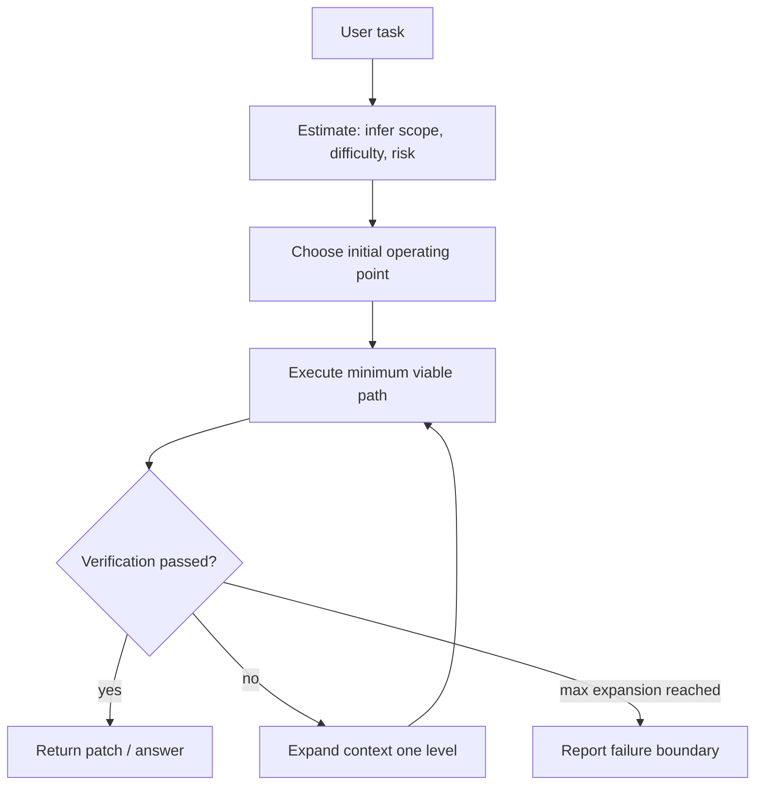

# Do AI Agents Know When a Task Is Simple?：让 Agent 先判断“这题到底有多简单”

## 元信息与 TL;DR

- **论文**：Do AI Agents Know When a Task Is Simple? Toward Complexity-Aware Reasoning and Execution
- **作者**：Junjie Yin, Xinyu Feng
- **日期**：2026-07-14 提交到 arXiv
- **原始链接**：https://arxiv.org/abs/2607.13034
- **代码与数据**：https://github.com/eejyin/Do-AI-Agents-Know-When-a-Task-Is-Simple-Toward-Complexity-Aware-Reasoning-and-Execution
- **领域归类**：大模型 Agent；更具体地说，是工具调用 Agent 的执行范围估计、上下文预算和验证驱动扩展。

### TL;DR

- **这篇文章要解决的问题**：很多 LLM Agent 在简单任务上不会先判断“最少需要读多少上下文”，而是默认走最大上下文优先路径，把一行替换任务做成小型代码审计。
- **核心方法**：作者定义 _minimum-sufficient execution_ 和 **Agent Cognitive Redundancy Ratio, ACRR**，再提出 **E3 = Estimate, Execute, Expand**：先估计任务难度与初始操作点，先走最小可行路径，只有验证失败才逐步扩展范围。
- **主实验**：在 **MSE-Bench** 上构造 121 个确定性代码编辑任务，分为单文件、跨文件、仓库级三档；每个任务都有 oracle 最小轨迹，所以可以精确计算冗余。
- **关键数字**：E3 保持 **100% success**，均值成本 **18.551**，比 Max-Context-First 的 **122.851** 低约 **85%**；tokens 少约 **91%**，完整读入文件少约 **92%**。相对强自适应检索基线 Adaptive Retrieval，E3 仍把成本从 **22.076** 降到 **18.551**。
- **不是只打稻草人**：论文加入 Adaptive Retrieval、E3-NoEstimate、E3-NoExpand、held-out wording、4000 组 cost weights 和真实 gpt-4o 工具调用 LLM-Case。结果显示，估计阶段负责降本，Expand 阶段负责保成功。
- **最重要的边界**：MSE-Bench 是能力不变量模拟器，不等于真实 SWE-bench；真实 LLM-Case 只有 5 个 toml 任务、3 次重复，说明现象接触真实模型后仍存在，但还不是大规模线上 Agent 度量。
- **研究意义**：这篇论文把“Agent 过度读上下文”从主观体验变成可测指标，提醒我们设计 Agent loop 时要把 _任务范围估计_ 放到工具调用之前，而不是只堆 retrieval、long context 或更强模型。

## 这篇论文真正关心什么？

### 问题不是“Agent 会不会做题”，而是“Agent 知不知道这题很简单”

- 作者开头举的例子非常工程化：
  - 一个个人网站里有两个 email icon。
  - 第一个已经使用本地 `gmail-icon.svg`。
  - 第二个还是 Font Awesome 的 `fa-brands fa-google`。
  - 用户只要求把第二个替换成第一个的同款 markup。

- 这类任务对人类工程师来说是“定位字符串，替换两行，必要时看一眼页面”的工作。

- 但许多 Agent 会走另一条路径：
  - 重新遍历目录。
  - 重读依赖和样式。
  - 分析项目架构。
  - 重复确认此前已经知道的上下文。
  - 最后仍然只做一个很小的替换。

- 作者的判断是：
  - 这不是知识不足。
  - 也不只是检索失败。
  - 更不是“模型不会推理”。
  - 它缺的是一种执行前判断：**当前任务到底需要多大范围的证据，最短可靠路径是什么？**

### 三个研究问题

| 研究问题 | 作者要量化的对象 | 对 Agent 系统的含义 |
|---|---:|---|
| RQ1 | 一个任务 _本来_ 最少需要多少执行成本 | 需要 oracle 或可近似 oracle 的最小充分轨迹 |
| RQ2 | Agent 能否低成本估计任务范围 | 估计必须发生在大规模读上下文之前 |
| RQ3 | 先最小执行、失败再扩展能否不牺牲成功率 | 验证是“敢少读”的安全阀 |

### 为什么这点重要？

- 在长上下文和强工具使用成为默认之后，Agent 的失败不只表现为“做错”。

- 还有一种更隐蔽的失败：
  - 输出正确。
  - 但读取了过多文件。
  - 花了过多 token。
  - 触发了过多工具。
  - 把简单任务的反馈周期拉长。

- 对 coding agent、数据分析 agent、科研 agent 来说，这种失败会带来三类成本：
  - **延迟成本**：一个小修改变成数分钟等待。
  - **上下文污染**：无关文件进入上下文后，反而提高误判概率。
  - **安全成本**：读得越广，越容易碰到不该碰的文件、凭据、用户隐私或攻击载荷。

## 作者的概念贡献：最小充分执行与 ACRR

### 最小充分执行是什么？

作者把 Agent 轨迹写成一组动作序列：

```text
trajectory = [search, read_range, inspect_file, edit, verify, ...]
```

每个动作都有成本向量：

```text
CostVector = (latency, tokens, tool_calls, files)
```

论文和代码里使用的标量成本是：

```text
C = alpha * latency + beta * tokens + gamma * tool_calls + delta * files

默认权重：
alpha = 1.0      # 每秒延迟
beta  = 0.02     # 每个 token
gamma = 0.5      # 每次工具调用
delta = 1.5      # 每个完整读入文件
```

变量解释：

| 变量 | 含义 | 为什么重要 |
|---|---|---|
| `latency` | 墙钟时间 | 用户等待与交互速度 |
| `tokens` | 推理与上下文 token | 成本、上下文预算、长上下文噪声 |
| `tool_calls` | 离散工具调用数 | 外部副作用、执行复杂度 |
| `files` | 完整读入上下文的文件数 | 作者认为这是认知冗余的核心单位 |

### ACRR 怎么定义？

作者把 oracle 最小充分成本写成 `C_min(tau)`，把真实 Agent 成本写成 `C_act(tau)`。

```text
ACRR(tau) = (C_act(tau) - C_min(tau)) / C_min(tau)
```

直观解释：

| ACRR | 含义 |
|---:|---|
| 0 | 刚好等于 oracle 最小充分执行 |
| 1 | 多花了 100% 成本，也就是花了两倍 |
| 4 | 多花了 400% 成本，也就是花了五倍 |
| 10.13 | Gmail icon 案例里 Max-Context-First 的冗余，约等于多花十倍以上 |

### 这个指标的价值在哪里？

- 它不是单纯统计 token，也不是单纯统计工具数。

- 它关心的是：
  - 一个任务有自己的最小需要。
  - 同样 1000 token，对简单任务可能是巨大浪费，对复杂任务可能是必要成本。
  - 所以冗余要相对 oracle 归一化。

- 这让不同难度任务可以放在同一个坐标系里比较。

## E3 方法：Estimate, Execute, Expand

### 总体控制流



### Estimate 阶段

- 输入：
  - 用户指令。
  - 可选的一次轻量搜索结果。
  - 任务是否看起来是局部、跨文件或仓库级。

- 输出：
  - `difficulty`：估计的难度级别。
  - `scope_files`：初始范围。
  - `risk`：是否需要重验证。
  - `confidence`：估计置信度。
  - `hits`：如果估计阶段已经搜索过，就复用搜索结果。

- 关键点：
  - Estimate 不是让模型先大段推理。
  - 它要像工程师一样快速定一个初始操作点。
  - 它不要求一次估准；后面有 Expand 兜底。

### Execute 阶段

伪代码可以这样理解：

```text
Input:
  task, estimated_level, search_hits

State:
  observed_files
  inspected_files
  edited_sites
  cost_ledger

Loop:
  1. spend small reasoning budget proportional to estimated_level
  2. if level >= 3:
       trace dependencies from search_hits
       inspect dependency files
  3. read direct hit ranges, not necessarily full files
  4. edit every currently reachable required site
  5. verify with light or heavy check

Output:
  success or failed verification signal
```

### Expand 阶段

- 如果验证失败，E3 不直接放弃。

- 它做的是逐级扩展：
  - Level 1 失败，扩到 Level 2。
  - Level 2 失败，扩到 Level 3。
  - Level 3 仍失败，才说明当前策略或能力不足。

- 这正是论文里的关键设计：
  - **少读不是盲目省成本**。
  - **少读必须和可执行验证绑定**。

### 与常见 retrieval/router 的区别

| 方法 | 决策时机 | 成本控制方式 | 失败时怎样处理 |
|---|---|---|---|
| Max-Context-First | 执行前直接最大化上下文 | 几乎不控成本 | 最后重试 |
| Adaptive Retrieval | 先检索，再读相关上下文 | 不读全仓库，但完整读检索命中文件 | 验证失败后保守补读 |
| E3 | 先估计任务范围 | 从最小可行路径开始 | 只在验证失败时扩展 |

作者强调，E3 的贡献不是“会检索”，而是把 **execution scope estimation** 放到一开始。

## MSE-Bench：为什么要做一个能力不变量模拟器？

### 设计动机

- 如果直接测真实 Agent，很难分清：
  - 是模型不会做。
  - 是工具接口不好。
  - 是上下文不够。
  - 还是上下文读太多。

- 所以作者构造了一个确定性、离线、能力不变量 benchmark。

- 在 MSE-Bench 里：
  - 所有 policy 都有同样底层编辑能力。
  - 差异只来自“读了多少、何时扩展、验证如何触发”。
  - 每个任务有 oracle 最小轨迹。

### 任务结构

| 等级 | 任务类型 | 最小充分路径 | 失败风险 |
|---:|---|---|---|
| Level 1 | 单文件局部替换 | 定位一个 site，编辑，验证 | 过度读上下文 |
| Level 2 | 跨文件符号重命名 | 搜索命中多个直接 site，逐个编辑 | 漏掉直接引用 |
| Level 3 obvious | 仓库级重构 | 搜索、依赖追踪、编辑直接与间接 site | 需要依赖图 |
| Level 3 deceptive | 看似局部但隐藏间接依赖 | 必须从验证失败或依赖追踪发现 | 最能考验 Expand |

### Gmail motivating case

| Policy | Success | Cost | Files | ACRR |
|---|---:|---:|---:|---:|
| MaxContextFirst | 1 | 66.78 | 7 | 10.13 |
| FixedReAct | 1 | 15.80 | 0 | 1.63 |
| AdaptiveRetrieval | 1 | 19.595 | 1 | 2.27 |
| E3 | 1 | 9.51 | 0 | 0.585 |

这个表很能说明论文的主张：

- Max-Context-First 能做对，但代价是把 1 个局部替换扩成 7 个文件的上下文扫描。
- Adaptive Retrieval 比全仓库读好，但对局部任务仍完整读入命中文件。
- E3 用最小路径解决，ACRR 接近 oracle。

## 主结果：E3 保持成功率，同时显著降本

### 总体结果

| Policy | Success | Mean cost C | Mean ACRR | Files / task |
|---|---:|---:|---:|---:|
| Max-Context-First | 100.0% | 122.851 | 12.905 | 8.455 |
| Fixed ReAct | 66.942% | 17.158 | 1.286 | 0.000 |
| Adaptive Retrieval | 100.0% | 22.076 | 1.210 | 1.992 |
| **E3** | **100.0%** | **18.551** | **0.545** | **0.661** |

几个判断：

- Fixed ReAct 成本低，但 Level 3 全失败，所以不能拿低成本当胜利。
- Max-Context-First 成功率满分，但 ACRR 高达 12.905。
- Adaptive Retrieval 是更强的比较对象，因为它不是全仓库乱读，也能 100% 成功。
- E3 相比 Adaptive Retrieval 仍降本，说明 Estimate 的贡献不是打稻草人。

### 分层结果

| Level | MaxContextFirst cost | Adaptive Retrieval cost | E3 cost | E3 success |
|---:|---:|---:|---:|---:|
| 1 | 116.551 | 15.033 | 8.324 | 100.0% |
| 2 | 123.532 | 22.870 | 12.995 | 100.0% |
| 3 | 128.627 | 28.500 | 34.590 | 100.0% |

这组数字有一个细节：

- E3 在 Level 3 的成本高于 Adaptive Retrieval。
- 但总体仍胜出，因为它在 Level 1 和 Level 2 避免了大量过度读取。
- 这符合方法定位：E3 不是永远最省，而是让成本更贴近任务范围。

### 论文主结论如何成立？

```text
E3 vs Max-Context-First:
  success: 100% vs 100%
  mean cost: 18.551 vs 122.851
  reduction: about 85%
  files: 0.661 vs 8.455
  token reduction: about 91%
  file reduction: about 92%

E3 vs Adaptive Retrieval:
  success: 100% vs 100%
  mean cost: 18.551 vs 22.076
  reduction: about 16%
```

作者想证明的不是“E3 永远更聪明”，而是：

- 先估计任务范围可以显著减少简单任务上的浪费。
- 验证驱动扩展可以避免局部路径带来的可靠性崩塌。
- 对强自适应 baseline 仍有增益，说明问题不只是“别读全仓库”。

## 消融实验：Estimate 和 Expand 分别负责什么？

### 消融表

| Policy | Success | Mean cost | Expanded frac | ACRR |
|---|---:|---:|---:|---:|
| E3 | 100.0% | 18.551 | 0.149 | 0.545 |
| E3-NoEstimate | 100.0% | 22.210 | 0.331 | 0.707 |
| E3-NoExpand | 85.124% | 14.877 | 0.000 | 0.471 |

### 怎么读这个消融？

- **NoEstimate**：
  - 仍然保留 Expand。
  - 所以成功率还是 100%。
  - 但它更常低估任务，扩展比例从 0.149 升到 0.331。
  - 成本从 18.551 升到 22.210。

- **NoExpand**：
  - 成本最低。
  - 但 success 只剩 85.124%。
  - 论文指出它会丢掉 18 个 deceptive Level-3 任务。

- **完整 E3**：
  - Estimate 降低不必要扩展。
  - Expand 保护复杂任务可靠性。
  - 两者缺一不可。

### 这个消融对 Agent 设计的启发

| 设计冲动 | 风险 | E3 给出的修正 |
|---|---|---|
| 只做便宜路径 | 会漏掉隐藏依赖 | 必须绑定验证与扩展 |
| 只做保守路径 | 简单任务成本爆炸 | 必须先估计初始范围 |
| 只做 retrieval | 检索后仍可能过度完整读文件 | 要区分 range read、full inspect 和 dependency trace |
| 只做 router | 选择模型不等于选择执行范围 | 需要 trajectory-level cost accounting |

## 稳健性：不是靠关键词，也不是靠权重调参

### Held-out wording

作者把 benchmark 指令改写为与 estimator 关键词列表 disjoint 的 paraphrase。

| Wording | Estimator accuracy | Under-scoped | E3 success | E3 cost | Expanded frac |
|---|---:|---:|---:|---:|---:|
| original | 0.851 | 0.149 | 100.0% | 18.551 | 0.149 |
| paraphrased | 0.669 | 0.331 | 100.0% | 20.169 | 0.331 |

这说明：

- estimator 的精确级别准确率从 85.1% 降到 66.9%。
- E3 的 success 仍是 100%。
- 成本只升 8.7%。
- 真正兜底的是 Expand 机制，不是关键词模板匹配。

### Cost weight sensitivity

作者又做了 4000 组随机 cost weights，包括把 `files` 权重关掉的 `delta=0` 情况。

| 对比对象 | E3 更便宜比例 | 中位降幅 | 5% 分位降幅 | `delta=0` 时更便宜比例 |
|---|---:|---:|---:|---:|
| Adaptive Retrieval | 0.9982 | 9.3% | 3.5% | 0.9667 |
| MaxContextFirst | 1.0000 | 86.6% | 74.0% | 1.0000 |

解读：

- 结论不只依赖“读文件很贵”这个权重假设。
- 即使不给文件数惩罚，E3 对 Adaptive Retrieval 仍在 96.67% 权重抽样中更便宜。
- 原因是 E3 不只少读文件，也少花延迟、token 和完整动作成本。

## LLM-Case：接触真实模型后发生了什么？

### 为什么需要 LLM-Case？

MSE-Bench 的最大质疑是：

- policy 是手写 Python 函数。
- benchmark 是作者自建。
- oracle 是作者定义。
- MaxContextFirst 按构造会读很多文件。

LLM-Case 用真实模型、真实工具和真实代码来回应这些质疑。

### LLM-Case 设置

| 组件 | 具体设置 |
|---|---|
| 模型 | gpt-4o 真实工具调用 |
| 代码库 | vendored `toml` 0.10.2，MIT 许可证 |
| 任务数 | 5 个 rename/version 编辑任务 |
| 复杂度 | Level 1 两个，Level 2 两个，Level 3 一个 deceptive refactor |
| 成功判定 | 运行 hidden pytest acceptance tests |
| oracle | 用 gold patch 通过同一套 instrumented tools 测量 `C_min` |
| policy 差异 | 只换 system prompt：MCF_Thorough、ReAct、E3 |

### 三次重复的总体结果

| Policy | Success | Tokens | Files | Scalar cost | ACRR |
|---|---:|---:|---:|---:|---:|
| E3 | 93.333% | 80,503.2 | 1.667 | 1775.417 | 12.725 |
| MCF_Thorough | 80.0% | 98,611.4 | 2.000 | 2173.570 | 10.666 |
| ReAct | 100.0% | 83,878.067 | 2.000 | 1851.795 | 13.843 |

这组结果比模拟器更复杂：

- 真实模型并没有像模拟 MaxContextFirst 那样读 8 个以上文件。
- 真实 frontier model 已经相对节制。
- E3 的 success 不是最高，三次重复里 Level 3 有失败。
- 但 E3 的平均 token、files 和 scalar cost 仍是最低。

### LLM-Case 的真实意义

| 观察 | 含义 |
|---|---|
| Level 1 上 E3 估计步骤会带来轻微 overhead | 对极简单任务，估计本身不是免费 |
| Level 2 上 E3 成本低于两个基线 | 范围估计开始体现价值 |
| Level 3 上所有策略都昂贵且有随机性 | 真实复杂任务里可靠性不只由范围估计决定 |
| ReAct 在三次重复中 100% 成功但成本高于 E3 | E3 不是唯一可靠路径，但更强调预算 |
| MCF_Thorough 在 Level 3 三次均失败 | “读更多”并不保证真实可靠性 |

### 这里不能过度解读

- 5 个任务太少。
- 只测一个 vendored `toml` 库。
- 任务多是 rename/version edits，不是开放式 bug fixing。
- token 和 latency 受 provider 波动影响。
- ACRR 的绝对值因真实系统 prompt 和多轮工具调用 overhead 被放大。

但它仍提供了一个重要信号：

- E3 的研究问题不是纯模拟器幻觉。
- 在真实工具调用里，“先估计范围，再最小执行，验证失败再扩展”仍是一个可实现的控制 loop。

## Figure/Table 证据应该怎么读？

### Table：overall summary

- 证明对象：
  - E3 在 121 个模拟任务上成功率不掉。
  - 成本显著低于全上下文与强自适应基线。

- 不能证明：
  - 所有真实 coding agent 都会节省 85%。
  - 所有复杂任务都适合先走最小路径。

### Table：ablation

- 证明对象：
  - Estimate 主要负责减少扩展次数和成本。
  - Expand 主要负责让 deceptive Level-3 不掉成功率。

- 不能证明：
  - 这个具体 heuristic estimator 是最优 estimator。
  - 换成更开放任务后仍然只需三个 level。

### Table：paraphrase robustness

- 证明对象：
  - 即便 estimator 被同义改写削弱，E3 仍靠 Expand 保持成功。

- 不能证明：
  - estimator 对 adversarial prompt 或恶意任务描述鲁棒。
  - 估计错误不会带来安全风险；它只说明 benchmark 中验证能兜底。

### Table：LLM-Case

- 证明对象：
  - 真模型 + 真工具 + 真代码下，范围估计仍影响成本。
  - “读更多”不天然保证成功。

- 不能证明：
  - E3 已经是 SWE-bench 级最佳 coding-agent 策略。
  - system prompt 足以稳定复制三阶段控制流。

## 与相关工作的关系

### 和 adaptive computation 的关系

- FrugalGPT、RouteLLM、Ares 一类工作关心：
  - 何时用便宜模型。
  - 何时用贵模型。
  - 如何按输入路由推理成本。

- E3 关心的是：
  - 同一个 Agent 在同一个任务里，应该读多少环境、做多少工具动作。
  - 这是 trajectory-level effort allocation。

### 和 ReAct / tool-use agent 的关系

- ReAct 让模型边想边行动。
- 但 ReAct 本身不一定回答：
  - 一开始需要多大范围？
  - 哪些文件只需 range read？
  - 哪些文件必须 full inspect？
  - 验证失败后扩展到哪一级？

- E3 更像在 ReAct 外层加一个执行预算控制器。

### 和长上下文 agent 的关系

- 长上下文降低了“拿不到信息”的概率。
- 但长上下文也提高了“拿太多信息”的诱惑。
- E3 提醒我们：
  - 上下文窗口变大后，仍要有上下文选择策略。
  - 不是能塞进去就应该塞进去。

## 对 Agent 系统构建的启发

### 控制 loop 应该显式记录范围估计

一个更工程化的 Agent loop 可以长这样：

```text
State:
  task_id
  estimated_scope
  estimated_risk
  observed_files
  inspected_files
  verification_status
  cost_ledger
  expansion_level

Policy:
  1. estimate before broad retrieval
  2. execute smallest verifiable plan
  3. verify with task-appropriate checks
  4. expand only on failed or inconclusive verification
  5. stop when success or expansion budget exhausted
```

### Memory 应该服务“少读”，而不是鼓励“再读一遍”

- 如果 Agent 记得以前已经看过仓库结构，它不应该每次都重读所有文件。
- 但 memory 不能直接替代验证。
- 合理做法是：
  - memory 给出 prior。
  - Estimate 用 prior 定初始范围。
  - Execute 只读取当前任务必要证据。
  - Verify 失败再扩展。

### 安全系统也可以借用 ACRR

ACRR 不只是效率指标，也可以成为安全审计信号：

| 异常模式 | 可能风险 |
|---|---|
| 简单任务读入大量无关文件 | 隐私暴露或 prompt injection 面扩大 |
| verification 前执行高副作用工具 | 工具权限边界过宽 |
| 多次扩展仍无验证收益 | Agent 可能陷入无效探索 |
| ACRR 长期高于同类任务基线 | planner 或 retrieval 策略退化 |

## 结论与局限

### 最值得带走的判断

- 这篇论文把一个常见体验变成可测问题：**Agent 不只要会解决难题，还要知道什么时候不该把简单题当难题。**

- 它的贡献主要有三层：
  - 定义最小充分执行和 ACRR。
  - 给出 E3 这种估计、执行、扩展的控制框架。
  - 用模拟器、消融、稳健性和真实 LLM-Case 说明这种框架不是纯口号。

### 主要局限

- MSE-Bench 是受控模拟器：
  - 适合隔离执行冗余。
  - 不适合直接代表真实线上 Agent。

- estimator 仍是手写规则：
  - 能说明机制。
  - 不能说明 learned estimator 已经可用。

- LLM-Case 规模很小：
  - 只有 5 个任务。
  - 只有一个小型真实库。
  - 主要是 rename/version edits。

- 验证前提很强：
  - 如果任务缺少可靠测试或 oracle，Expand 触发会更难。
  - 如果验证本身很贵，最小执行策略要重新平衡。

### 下一步值得追问

- 能否训练一个 calibrated task-state estimator，而不是依赖规则？
- 在 SWE-bench、真实 issue、数据分析 notebook、MCP 工具链中，ACRR 如何定义 oracle？
- 对安全敏感 Agent，是否应该把“可读文件范围”作为权限预算的一部分？
- 当验证有副作用或成本很高时，E3 的 Expand 应该如何设置停止条件？
- 多 Agent 系统里，是否可以让 planner 负责 Estimate，executor 负责 Execute，critic 负责 Verify 和 Expand？

### 研究者视角的最后判断

- 这篇论文的价值不在于给出一个最终 Agent 框架，而在于把“执行范围”变成了 Agent 研究的一等对象。

- 过去很多工作把 Agent 能力提升理解为：
  - 更长上下文。
  - 更多工具。
  - 更强 planner。
  - 更复杂 memory。

- 这篇文章提醒我们还缺一个方向：
  - **更准的初始操作点。**
  - **更少但足够的证据读取。**
  - **更明确的验证驱动扩展。**

- 对实际系统来说，E3 可以被看作一个朴素但重要的安全阀：先别急着读全世界，先判断这件事到底需要多少世界。
