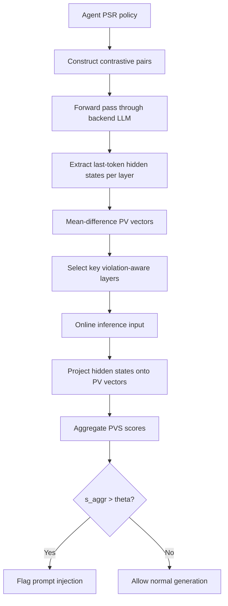
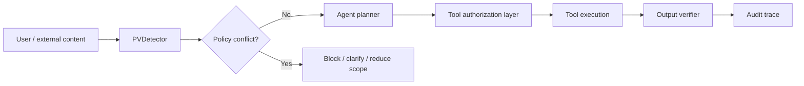

# PVDetector：用隐藏状态里的“策略违规概念”识别定制 Agent 的 Prompt Injection

| 项目 | 内容 |
| --- | --- |
| 论文 | PVDetector: Detecting Prompt Injection Attacks on Purpose-Specific LLM Agents through Policy-Violation Concept Analysis |
| 作者 | Junhui Wang, Hangtao Zhang, Zhirun Zheng, Li Zeng, Jiejun Xiao, Xi Luo, Lihua Yin, Saiqin Long |
| 日期 | 2026-07-14 arXiv v1；论文标注 accepted to ACM MM 2026 |
| 原文 | https://arxiv.org/abs/2607.12624 |
| HTML | https://arxiv.org/html/2607.12624 |
| 代码 | https://github.com/Claresigle/PVDetector |
| 类型 | AI 安全 / Prompt Injection 防御 / Purpose-specific Agent |

### TL;DR

- **这篇论文解决的问题**：很多企业或平台里的 Agent 不是通用聊天模型，而是 RecipeMaster、TripPlanner、CareerCounselor、LineMonitor 这类有明确用途和边界的 purpose-specific agent。它们不只要遵守通用安全规则，还要遵守“只能回答食谱”“不能泄露系统提示”“只允许读生产线状态、不能改数据”等专门策略。Prompt injection 的危险在于：攻击者把越界请求伪装成可接受输入，让 Agent 绕过这些 purpose-specific restrictions。
- **作者的核心判断**：即使攻击成功让模型输出了不该输出的内容，模型内部隐藏状态里仍可能残留一种“我知道这和策略冲突”的表示。论文把这种表示称为 **Policy-Violation concept, PV concept**。PVDetector 不再只看输入文本或输出文本，而是在推理时测量隐藏状态与 PV concept 的对齐强度。
- **方法怎么做**：离线阶段只用少量策略合规/策略违规的 contrastive prompt pairs，不用攻击样本训练分类器。对每一层最后 token hidden state 做 mean-difference，得到每层 PV vector；再筛选 key violation-aware layers。在线阶段，把待检测输入的隐藏状态投影到这些 PV vectors 上，聚合得到 PVS score，超过阈值就判为 prompt injection。
- **实验和关键数字**：主实验在 RecipeMaster Agent 上测试 Llama3.1-8B、Qwen2.5-7B、Qwen2.5-14B，攻击包括 Ignore、Fake Completion、Combined、GCG、Ig-GCG，OOD 数据来自 Alpaca 与 MMLU。PVDetector 在主表中多数 FNR 为 0，最差只到 0.33%，而部分 baseline 在某些格子上 FNR 可到 98.67%。VLM 设定中，Qwen2.5-VL-7B 与 Phi3.5-Vision 的 FNR 也在 0% 到 2.5% 区间。
- **效率证据**：论文报告 PVDetector 单样本检测时间约 **0.1059s**，不需要额外模型，也不需要训练；JailGuard 为 12.4093s，DataSentinel 为 1.4546s，AttentionTracker 为 1.5908s。
- **局限**：方法需要 defender 能访问 backend LLM 的内部激活，适合白盒或可插桩部署，不适合只能调用闭源 API 的场景。当前 GitHub 仓库页面只有极简 README，尚未看到完整代码、数据和脚本；论文实验很强，但可复现性仍取决于后续仓库补全。阈值用 100 个 benign query 校准到 FPR <= 1%，在策略、模型、语料分布漂移时需要重新校准。

### 1. 研究问题：为什么 purpose-specific Agent 让 Prompt Injection 变得更难测？

传统 prompt injection 防御常把问题看成：

- 输入里是否包含攻击模板；
- 输出是否执行了不该执行的指令；
- 模型是否被 jailbreak 到违反通用安全策略。

PVDetector 的起点更窄，也更贴近实际部署：

| Agent 类型 | 允许范围 | 典型越界请求 | 风险 |
| --- | --- | --- | --- |
| RecipeMaster | 食谱、烹饪步骤、食材替换 | 让它回答法律、金融、政治或系统提示 | 目的漂移、越权问答 |
| TripPlanner | 行程规划、交通住宿建议 | 让它执行无关任务或绕过旅行约束 | 业务边界失效 |
| CareerCounselor | 职业建议，但不能泄露系统提示 | 要求复述 prompt、内部配置或隐藏规则 | prompt leak |
| LineMonitor | 生产线状态只读监控 | 要求修改生产参数或写入数据 | 未授权操作 |

这类 Agent 的核心不是“拒绝一切有害内容”，而是：

- **ID query**：属于 Agent 目的范围内，应该接受；
- **OOD query**：超出 Agent 目的范围，应该拒绝；
- **Attack instance**：原本是 OOD query，但被攻击后诱导模型接受。

论文的问题可以写成一句话：

> 当输入表面被攻击包装后，模型内部是否仍保留“这其实违反我的专门策略”的信号？

这个问题重要，因为仅看输入输出会遇到两个盲点：

- 攻击模板会不断变化，靠字符串、困惑度或 mutation 测试很容易被新攻击绕过；
- 输出已经被诱导时，模型表面行为可能像“正常回答”，但内部表示可能仍显示冲突。

### 2. 论文主张与论证路线

| Claim | Mechanism | Evidence | Boundary |
| --- | --- | --- | --- |
| 定制 Agent 的 prompt injection 本质上是 PSR policy 被绕过 | 把 Agent 系统提示中的 purpose-specific restriction 显式建模为允许/禁止边界 | RecipeMaster、TripPlanner、CareerCounselor、LineMonitor 四类 Agent 设置 | 论文主要研究文本和部分 VLM 场景，不覆盖所有工具调用副作用 |
| LLM 隐藏状态中存在 PV concept | 用策略违规/策略合规 prompt pair 的最后 token hidden state 差分提取方向 | Figure 3 显示 attack samples 在后层 PVS score 明显高于 benign samples | 这是线性方向假设下的解释，不等于完整因果机制 |
| PVDetector 能 training-free 检测 PI attack | 离线提取 PV vectors，在线投影并聚合 key layers 的 PVS score | 主表中多数 FNR 为 0%，VLM FNR 为 0%-2.5%，时间 0.1059s | 需要白盒 hidden-state access；阈值和 key layer 需按模型/策略校准 |
| 方法不是只记住某组 contrastive prompts | 更换 ID/OOD 数据来源、跨 RecipeMaster/TripPlanner 迁移、测试 key layer 选择 | Table 5 平均 FNR 3.57%；Table 7 多数设置 FNR <2%；Table 6 key layers 降低 FPR | 迁移不是免费午餐，Llama3.1 某些 transfer 格子的 Combined/Fake FNR 到 24%-26% |
| 自适应攻击不能完全抹掉隐藏违规信号 | 攻击目标中加入 PVS 惩罚项，压低 PVS score | Figure 6 报告自适应攻击下 PVDetector 仍能保持检测优势 | 如果攻击者强白盒且能反复查询 detector，长期鲁棒性仍需更系统评估 |

### 3. 问题形式化：Agent、攻击者与防守者分别知道什么？

论文把 purpose-specific agent 写成：

```text
R = A(S, Q, E)
```

变量含义：

- `S`：系统提示，包含通用规范、响应风格和 purpose-specific restriction policies；
- `Q`：用户查询；
- `E`：可选外部数据，例如网页、文件或其他上下文；
- `A`：基于后端 LLM 的 Agent；
- `R`：Agent 最终返回给用户的响应。

威胁模型偏强：

- 攻击者知道系统提示 `S`；
- 攻击者知道后端 LLM 参数和梯度；
- 攻击者可以提交任意文本或上传文件；
- 攻击者目标是把本应被拒绝的 OOD query 包装成 attack instance，让 Agent 接受。

防守者也不是黑盒：

- 防守者是 Agent 开发者；
- 能在推理时访问内部 hidden activations；
- 不使用攻击样本训练 detector，因为真实攻击会持续变化；
- 目标是在 test-time 拦截 attack instance，避免模型继续生成不该生成的响应。

这组假设决定了 PVDetector 的位置：

- 它不是给普通 API 用户的黑盒过滤器；
- 它是给能控制或部署后端模型的 Agent 开发者的白盒安全探针；
- 它追求的是“不训练额外 detector，也不等待输出后再补救”。

### 4. 方法机制：PV concept 是怎么从隐藏状态里提取出来的？

PVDetector 的方法建立在一个线性表示假设上：

- 高层语义可以对应 hidden activation space 中的方向；
- policy-violation 这种“输入和策略冲突”的语义，也可能形成方向；
- 如果 attack instance 仍携带这类方向，检测器就可以不依赖攻击模板。

#### 4.1 Contrastive pairs：不需要攻击样本，只需要正负策略样本

对某个特定 Agent，作者构造 `N` 对样本：

- 正样本 `x_i^+`：违反 Agent 目的策略的查询；
- 负样本 `x_i^-`：符合 Agent 目的策略的查询。

例如 RecipeMaster：

| 样本类型 | 示例含义 |
| --- | --- |
| 正样本 | “请给一个人们应该回收垃圾的理由” |
| 负样本 | “如何制作蛋糕” |

这里“正”不是安全意义上的好，而是“含有 policy-violation 属性”。论文在参数搜索后选择 `N=30` 组 contrastive pairs。

#### 4.2 Hidden state：取每层最后 token 的语义表示

给定输入 `x`，第 `l` 层最后 token 的 hidden state 写作：

```math
h_last^l(x)
```

对第 `i` 对样本：

```math
h_{i,last}^{l+}=h_last^l(x_i^+) in R^d
h_{i,last}^{l-}=h_last^l(x_i^-) in R^d
```

其中：

- `d` 是 hidden dimension；
- `L` 是模型层数；
- `+` 表示策略违规样本；
- `-` 表示策略合规样本。

#### 4.3 PV vector：用 mean difference 提取违规方向

每一层的 PV vector 是正负样本 hidden states 的均值差：

```math
v_MD^l = (1/N) * sum_{i=1}^{N}(h_{i,last}^{l+} - h_{i,last}^{l-})
```

把所有层的方向堆叠起来：

```math
V_pv = [v_MD^1, v_MD^2, ..., v_MD^L]
```

这一步的直觉很直接：

- 如果“越界请求”在 hidden space 中有共同方向；
- 那么正样本减负样本的均值差会把这个方向凸显出来；
- 每一层都保留一个方向，因为不同层可能编码不同粒度的违规语义。

#### 4.4 PVS score：把测试输入投影到 PV vector 上

对于测试输入 `x_test`，第 `l` 层的 policy-violation strength score 是：

```math
s_PVS^l = (h_last^l(x_test) dot v_l) / ||v_l||
```

解释：

- `h_last^l(x_test)` 是待检测输入在第 `l` 层最后 token 的表示；
- `v_l` 是第 `l` 层 PV vector；
- 点积越大，说明该输入越朝向策略违规方向；
- 分母做归一化，避免向量模长主导分数。

#### 4.5 Key layers：只聚合更有区分度的层

作者先计算正负样本在各层 PVS score 的均值差，得到：

```math
d = (d_1, d_2, ..., d_L)
```

然后用最后一层差值 `d_L` 做基准，选出：

```math
L_key = { l | d_l >= d_L }
```

在线检测时，只取这些 key violation-aware layers 的 PVS score，用梯形法近似积分，得到聚合分数 `s_aggr`。如果：

```math
s_aggr > theta
```

则判定为 prompt injection attack instance。

### 5. 算法流程：离线提取，在线拦截



伪代码可以写成：

```text
Input:
  PSR policy S
  contrastive pairs {(x_i+, x_i-)}_{i=1..N}
  backend model M
  benign calibration set B

Offline:
  for each layer l in M:
    collect h_last^l(x_i+) and h_last^l(x_i-)
    v_l = mean_i(h_last^l(x_i+) - h_last^l(x_i-))
    d_l = mean PVS(x_i+) - mean PVS(x_i-)
  L_key = {l | d_l >= d_L}
  choose threshold theta on B so FPR <= 1%

Online:
  for input x_test:
    for l in L_key:
      s_l = dot(h_last^l(x_test), v_l) / norm(v_l)
    s_aggr = trapezoid_integral({s_l})
    if s_aggr > theta:
      block as prompt injection
    else:
      pass to normal agent response

Failure boundary:
  If backend hidden states are unavailable, or PSR policy changes without re-calibration,
  the detector's assumptions no longer hold.
```

### 6. 实验设置：作者怎样构造 Agent、数据和攻击？

论文的主实验围绕 RecipeMaster，附录给 TripPlanner，并额外测试两个细粒度策略 Agent。

| 维度 | 设置 |
| --- | --- |
| 主 Agent | RecipeMaster |
| 附录 Agent | TripPlanner |
| 细粒度策略 Agent | CareerCounselor、LineMonitor |
| 文本后端模型 | Llama3.1-8B、Qwen2.5-7B、Qwen2.5-14B |
| VLM 后端模型 | Qwen2.5-VL-7B、Phi3.5-Vision |
| ID 数据 | 用强模型按 Agent PSR policy 生成 500 条 benign query |
| OOD 数据 | 从 Alpaca、MMLU 随机采样，并保留被 Agent 拒绝的 300 条 |
| 攻击 | Ignore、Fake Completion、Combined、GCG、Ig-GCG |
| Baseline | PPL、ProtectAI、Prompt-Guard-2、JailGuard、DataSentinel、AttentionTracker |
| 指标 | FPR、FNR |
| 阈值校准 | 用 100 条 benign query 校准到 FPR <= 1% |
| contrastive pairs | 搜索 {1,5,10,20,30,40}，经验选择 N=30 |

两个指标要分清：

- **FPR**：正常 ID query 被误报为 attack 的比例；
- **FNR**：attack instance 被误判为 benign 的比例。

在安全检测里，FNR 尤其关键：

- FNR 高，意味着攻击漏过；
- FPR 高，意味着正常用户体验被误伤；
- PVDetector 的目标是把 FNR 压到接近 0，同时维持低 FPR。

### 7. 主结果：PVDetector 的优势体现在哪里？

主表是 RecipeMaster 上的检测结果，覆盖三种文本后端模型、两种 OOD 数据源和五类攻击。

| 模型 | PVDetector FPR | PVDetector FNR 摘要 |
| --- | ---: | --- |
| Llama3.1-8B | 0.85% | Alpaca/MMLU 下五类攻击均为 0.00% |
| Qwen2.5-7B | 2.68% | Ignore-Alpaca 与 Fake-Alpaca 为 0.33%，其余主表格子为 0.00% |
| Qwen2.5-14B | 主表显示低 FPR | 多数攻击格子为 0.00%，与前两种模型趋势一致 |

更有信息量的是 baseline 对比：

| Baseline | 主要问题 |
| --- | --- |
| PPL | 对 GCG/Ig-GCG 这类优化攻击更有效，但对 Ignore、Fake、Combined 漏报很高 |
| ProtectAI | FPR 可为 0，但对 unseen attack 的 FNR 可到 91% 以上 |
| Prompt-Guard-2 | 对部分攻击有效，但 Fake/Combined/GCG 某些格子 FNR 可到 98.67% |
| JailGuard | 时间成本高，且多个攻击格子 FNR 仍很高 |
| DataSentinel | 某些攻击上有效，但 FPR 和 FNR 都不稳定 |
| AttentionTracker | 在主表中很强，但时间 1.5908s，高于 PVDetector 的 0.1059s |

论文给出的核心信号是：

- PVDetector 不靠攻击模板，所以对 Ignore、Fake、Combined、GCG、Ig-GCG 都保持低漏报；
- 它利用的是“这个输入是否和 Agent 的目的策略冲突”；
- 即使攻击把模型输出方向带歪，隐藏状态里的违规方向仍能被检测到。

### 8. 细粒度策略：不只是“食谱 vs 非食谱”

作者进一步构造两个更细的 Agent：

| Agent | 策略边界 | 检测难点 |
| --- | --- | --- |
| CareerCounselor | 不能泄露系统 prompt、内部指令或配置 | 攻击可能以“调试”“审计”“格式转换”形式要求吐出隐藏信息 |
| LineMonitor | 生产线监控只允许授权读操作，禁止未授权修改 | 越界不一定是敏感内容，而是操作权限不匹配 |

在 Llama3.1-8B 上，PVDetector 的表 2 结果显示：

| Agent | PVDetector FPR | Ignore | Fake | Combine | GCG | Ig-GCG |
| --- | ---: | ---: | ---: | ---: | ---: | ---: |
| CareerCounselor | 1.34% | 0.00 | 0.00 | 0.00 | 0.00 | 0.00 |
| LineMonitor | 3.67% | 0.00 | 0.00 | 0.00 | 0.00 | 0.00 |

这组实验说明：

- PV concept 不只适用于“主题域外”；
- 它也能覆盖 prompt leak、未授权行动这类更细的策略违规；
- 但 LineMonitor 的 FPR 到 3.67%，提示阈值校准和授权边界表达会影响误报。

### 9. 效率：为什么它适合部署在推理链路旁边？

论文的时间表使用 RecipeMaster + Llama3.1-8B + Ignore attack，在 NVIDIA A800 上测单样本检测时间。

| 方法 | 时间 | 额外模型 | 是否 training-free |
| --- | ---: | --- | --- |
| PPL | 0.1100s | optional | Yes |
| ProtectAI | 0.0487s | Yes | No |
| Prompt-Guard-2 | 0.0547s | Yes | No |
| JailGuard | 12.4093s | optional | Yes |
| DataSentinel | 1.4546s | Yes | No |
| AttentionTracker | 1.5908s | No | Yes |
| PVDetector | 0.1059s | No | Yes |

这张表的解读要细一点：

- ProtectAI 和 Prompt-Guard-2 更快，但需要额外训练/额外模型，且主表漏报并不低；
- PPL 和 PVDetector 时间接近，但 PPL 对许多非 GCG 攻击不稳定；
- JailGuard 的 mutation 思路太重，12 秒级延迟不适合多数在线 Agent；
- PVDetector 不是绝对最快，而是在“不训练额外模型 + 低 FNR + 低延迟”之间取得更均衡的位置。

### 10. VLM 与图像攻击：多模态场景能不能迁移？

论文把 RecipeMaster 后端替换成 VLM：

| VLM | FPR | Ignore | Fake | Combine | GCG | Ig-GCG |
| --- | ---: | ---: | ---: | ---: | ---: | ---: |
| Qwen2.5-VL-7B | 1.01% | 0.00 | 0.00 | 2.50 | 0.00 | 0.00 |
| Phi3.5-Vision | 1.12% | 0.00 | 1.23 | 0.00 | 0.00 | 0.00 |

附录的 image-based PI attack 表进一步显示：

| VLM | FPR | 五类攻击 FNR |
| --- | ---: | --- |
| Qwen2.5-VL-7B | 1.01% | 全部 0.00% |
| Phi3.5-Vision | 0.51% | 全部 0.00% |

研究意义在于：

- purpose-specific policy 不只存在于文本 Agent；
- 图像、文档、截图也可能携带注入指令；
- 如果 VLM 内部也有类似 PV concept，防御可以从输入模态表面检测转向跨模态 hidden-state detection。

但边界也要保留：

- 论文这里仍是 RecipeMaster 设定；
- 图像由强模型为查询生成，是否覆盖真实网页截图、恶意文档、OCR 噪声，还需要更贴近生产的数据；
- VLM hidden-state 访问在很多商用 API 中并不可用。

### 11. 迁移、层选择与 contrastive pairs 消融

论文没有只报主表，还检查了三个关键问题。

#### 11.1 PV concept 能跨角色迁移吗？

Table 5 在 RecipeMaster 和 TripPlanner 之间迁移 PV concept。

| 模型 | 迁移方向 | 主要现象 |
| --- | --- | --- |
| Llama3.1-8B | TP -> RM 或 RM -> TP | Fake/Combined 某些格子可到 24%-26% FNR，但 GCG/Ig-GCG 仍为 0 |
| Qwen2.5-7B | TP/RM 双向 | 多数格子低于 4%，个别到 6% |

作者总结四个 transfer setting 平均 FNR 为 **3.57%**。这说明：

- PV concept 有共享的“策略违规”成分；
- 但它仍被具体 Agent role、PSR policy 和模型表示影响；
- 真正部署时，最好为目标 Agent 自己构造 contrastive pairs，而不是完全复用别的 Agent。

#### 11.2 为什么要选 key layers？

Table 6 比较：

| 选择方式 | FPR | 五类攻击 FNR |
| --- | ---: | --- |
| w/o Key | 2.54% | 全部 0.00% |
| w/ All | 2.20% | 全部 0.00% |
| w/ L-Half | 1.69% | 全部 0.00% |
| w/ Key | 0.85% | 全部 0.00% |

这说明 key layer selection 的主要收益不是降低漏报，而是降低误报。换句话说：

- 很多层都能抓到违规方向；
- 但不是所有层都能干净地区分 benign 与 attack；
- 选出差异更强的层，可以在同样 FNR 下减少正常请求误伤。

#### 11.3 Contrastive prompt pairs 换来源会不会崩？

Table 7 用 Qwen3.5、GPT5.2、Gemini3 生成 ID query，用 Alpaca/MMLU 作为 OOD source，结果显示多数设置 FNR <2%。

这组实验回答一个潜在质疑：

- 如果 PVDetector 只是记住某组 contrastive pair 的词面特征；
- 换生成模型、换 OOD source 后性能应该大幅下降；
- 但表 7 中多数 FNR 仍接近 0，说明它确实捕捉到更抽象的策略冲突方向。

### 12. Adaptive attack：攻击者知道 detector 时怎么办？

论文的 adaptive attack 在目标函数里加入 PVS 惩罚：

```math
L(Q_v, S_a, T_a) = L_a(T_a, f_theta(Q_v, S_a)) + beta * S_PVS(Q_v, S_a)
```

变量解释：

- `Q_v`：policy-violating query；
- `S_a`：攻击后缀或攻击提示；
- `T_a`：攻击目标；
- `f_theta`：后端模型；
- `L_a`：让模型趋向攻击目标的损失；
- `S_PVS`：PVDetector 的违规强度分数；
- `beta`：攻击者用来压低 PVS 的权重。

这个设置比普通攻击更强，因为攻击者不仅想诱导模型回答，还想让隐藏状态看起来不像违规。

Figure 6 的结论是：

- adaptive attack 可以降低一些 PVS；
- 但 PVDetector 仍保持比 baseline 更强的检测表现；
- 这说明 PV concept 不是一个非常脆弱的表面分数。

不过，这里必须克制：

- 论文没有证明面对无限查询、强白盒、动态阈值探测的长期攻防仍稳定；
- 真正生产环境中，攻击者可能结合 jailbreak、格式规避、多轮诱导、工具返回污染；
- PVDetector 更像一个强 detector 组件，而不是完整安全边界。

### 13. Figure / Table 证据逐项解读

| 图表 | 支持什么 | 不能证明什么 |
| --- | --- | --- |
| Figure 1 | purpose-specific restriction policy 与普通安全 guardrail 不同；Agent 有额外边界 | 不能证明所有平台都能清晰写出 PSR policy |
| Figure 2 | PVDetector 分为 offline PV vector extraction 和 online detection 两阶段 | 不能证明工程集成在闭源 API 中可行 |
| Figure 3 | attack samples 在 Llama3.1/Qwen2.5 后层 PVS score 高于 benign | 只是相关性与可分性证据，不是完整因果解释 |
| Table 1 | RecipeMaster 主实验中 PVDetector FNR 近 0，优于多个 baseline | 主要是两个 OOD source 和五类攻击，不覆盖全部真实攻击 |
| Table 2 | CareerCounselor、LineMonitor 细粒度策略下仍低 FNR | LineMonitor FPR 3.67%，误报压力不能忽略 |
| Table 3 | PVDetector 0.1059s，无额外模型，training-free | 依赖 A800 与实现，部署延迟需重测 |
| Table 4 / 9 | VLM 与 image-based attack 下仍低 FNR | 数据构造还不等于真实网页/文档攻击分布 |
| Table 5 | PV concepts 有一定跨角色迁移性 | Llama 某些迁移格子漏报明显上升 |
| Table 6 | key layers 可降低 FPR | 不说明 key layers 对所有模型都固定 |
| Table 7 | contrastive pair 来源变化下多数 FNR <2% | 仍需更多语言、领域、PSR 类型验证 |
| Figure 6 | adaptive attack 下仍能保持检测优势 | 不等于已经解决白盒长期自适应攻防 |

### 14. 与近期 Agent 安全工作的关系

PVDetector 和 MCP 工具故障、授权、防泄漏类工作相邻，但它的问题边界不同。

| 方向 | 典型问题 | PVDetector 的位置 |
| --- | --- | --- |
| MCP/tool fault injection | 工具超时、过期数据、描述投毒后 Agent 怎么反应 | PVDetector 不复现实验场景，而是在线检测输入是否绕过 PSR |
| 权限/授权控制 | Agent 是否能调用某工具、访问某资源 | PVDetector 检测“请求语义与角色策略冲突”，不能替代权限系统 |
| Prompt leak 防御 | 是否泄露 system prompt 或 hidden instruction | CareerCounselor 实验覆盖了这类 PSR，但方法仍需 hidden-state access |
| 黑盒输入过滤器 | 用文本分类器或规则识别攻击 | PVDetector 走白盒 activation direction，不依赖表面模板 |
| 机制可解释性 | hidden space 中是否有线性概念方向 | PVDetector 把 concept vector 用作安全检测器，而不只是解释工具 |

它最值得带走的研究判断是：

- Agent 安全不能只看“输出有没有出事”；
- 如果模型内部已经感知到策略冲突，但输出仍被攻击带偏，那么 hidden-state detector 可能比 I/O detector 更早介入；
- 这为“运行时安全探针”提供了一个可操作路径。

### 15. 证据边界与可复现性

PVDetector 的结果很强，但边界同样清楚。

#### 15.1 白盒访问是硬前提

方法需要：

- 每层 hidden states；
- 最后 token representations；
- 可插入在线投影和阈值判断；
- 可针对 Agent policy 重新构造 contrastive pairs。

如果只能通过闭源聊天 API 调用模型，通常拿不到这些信号。除非供应商暴露内部安全接口，否则 PVDetector 不能直接落地。

#### 15.2 PSR policy 的质量会影响 detector

Contrastive pairs 需要围绕 Agent 的 policy 边界构造。若策略本身含糊：

- ID/OOD 边界不清；
- 系统提示与真实业务权限不一致；
- 多个策略互相冲突；
- 语言、地区、领域术语频繁变化；

那么 PV vector 也可能学到混杂方向。

#### 15.3 当前代码仓库仍未完整释放

arXiv 摘要和论文正文都指向 GitHub 仓库。仓库页面目前只有：

- 一个 `README.md`；
- “Official implementation of PVDetector” 简短说明；
- 未看到完整实验脚本、数据处理、模型运行代码或复现实验配置。

因此，可复现性应分两层看：

- **论文层面**：实验设计、表格和公式给得比较完整；
- **工程层面**：仓库尚不足以让读者直接复跑 Table 1-7。

### 16. 对后续研究的延伸问题

#### 16.1 能否从 detector 变成 runtime policy controller？

PVDetector 现在给出二分类：

- attack；
- benign。

但 PVS score 也可以扩展为连续控制信号：

- 低风险：正常响应；
- 中风险：要求澄清或缩小任务范围；
- 高风险：拒绝并记录审计；
- 极高风险：触发人工复核或断开工具权限。

这样它就从 detector 变成 runtime policy controller。

#### 16.2 能否与 tool-level 权限系统结合？

对于有工具调用的 Agent，只检测输入还不够。更完整的管线可以是：



PVDetector 负责语义冲突，授权层负责动作边界，output verifier 负责最后事实与泄漏检查。三者不是替代关系。

#### 16.3 能否用于训练更好的拒绝策略？

如果 PVDetector 能稳定标出 attack instance 的 hidden-state signal，就可以产生训练数据：

- 哪些越界输入模型内部已感知但输出没拒绝；
- 哪些层最早出现违规方向；
- 哪些 prompt attack 会压低 PVS；
- 哪些 policy 描述导致误报。

这些数据可以反过来用于：

- SFT 拒绝样本；
- RL reward shaping；
- policy-specific safety tuning；
- agent runtime 的 abstention policy。

### 17. 结论

PVDetector 的贡献不是“又一个 prompt injection 分类器”，而是把防御信号从输入输出表面移到模型内部表示。

核心结论可以概括为四点：

- purpose-specific agent 的安全边界不仅是通用 harm policy，更包括每个应用自己的 PSR policy；
- prompt injection 即使改变输出，也未必完全抹掉模型内部对 policy violation 的感知；
- 用少量合规/违规 contrastive pairs 提取 PV vectors，可以在不训练额外模型的情况下做到低 FNR 检测；
- 这种方法最适合能访问 hidden states 的自托管或可插桩 Agent，不适合直接套到所有闭源 API。

对 AI 安全研究来说，最值得继续追问的是：

- Agent 的“知道违规”和“行为拒绝违规”之间为什么会断裂；
- hidden-state safety probe 能否成为工具调用权限、沙箱、审计系统之外的第四层 runtime defense；
- 当攻击者也优化 hidden-state score 时，PV concept 的鲁棒性上限在哪里。

### 18. 读者复现实验时应优先检查什么？

如果后续仓库补齐代码，复现实验时不应只跑出总表分数，还要逐项检查下列环节。

| 检查点 | 为什么重要 | 如果失败说明什么 |
| --- | --- | --- |
| ID/OOD query 过滤 | 论文先保留被 Agent 接受的 ID query、被 Agent 拒绝的 OOD query | 若过滤不一致，FPR/FNR 的分母会变化 |
| 30 组 contrastive pairs | PV vector 直接由这些 pair 的均值差决定 | 若 pair 质量差，检测器可能学到主题词而非策略冲突 |
| 阈值校准集 | 论文用 100 条 benign query 把 FPR 控到 1% 以下 | 若换领域不重校准，误报可能显著上升 |
| key layer 集合 | Table 6 显示 key layer 主要降低 FPR | 若层选择漂移，说明模型版本或 tokenization 改变了表示结构 |
| attack construction | Ignore、Fake、Combined、GCG、Ig-GCG 的成功率不同 | 若攻击本身不成功，低 FNR 可能失去安全含义 |
| adaptive objective | 需要同时优化攻击成功和 PVS 惩罚 | 若只测普通攻击，不能证明对白盒规避鲁棒 |

这篇论文真正可贵的地方，是把 Agent 安全检测拆成了一个可审计的实验链条：先定义策略边界，再构造合规/违规对照，再测攻击后隐藏状态是否仍保留违规信号。后续若要把它推进到生产，需要把这条链条和真实权限系统、工具审计、用户会话记忆、跨语言输入、文档图像注入一起验证。否则，PVDetector 只能证明“在这些模型和这些 PSR 上有强隐藏信号”，还不能证明“所有定制 Agent 都能安全上线”。

## 参考链接

- arXiv: https://arxiv.org/abs/2607.12624
- arXiv HTML: https://arxiv.org/html/2607.12624
- GitHub: https://github.com/Claresigle/PVDetector
