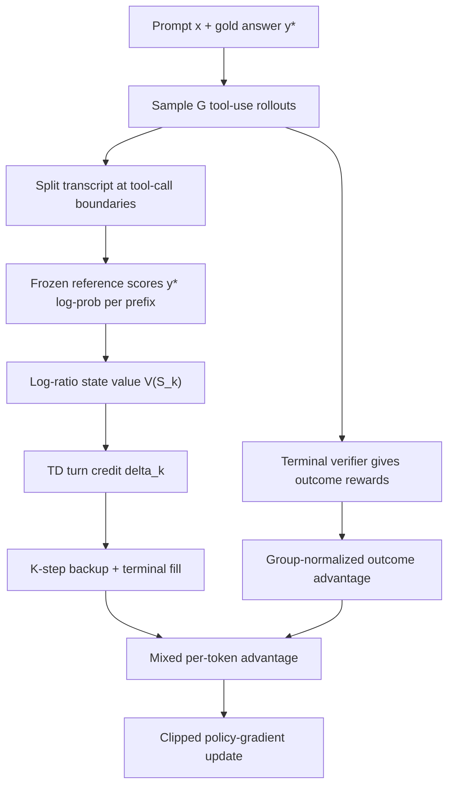

# TRACE：把长程 Agent RL 的奖励拆到每一次工具调用

**原始论文**：[TRACE: Turn-level Reward Assignment via Credit Estimation for Long-Horizon Agents](https://arxiv.org/abs/2607.13988)

**元信息**

| 项目 | 内容 |
| --- | --- |
| arXiv | `2607.13988v1` |
| 发布时间 | 2026-07-15 16:16:42 UTC |
| 作者 | Leitian Tao、Baolin Peng、Wenlin Yao、Tao Ge、Hao Cheng、Mike Hang Wang、Jianfeng Gao、Sharon Li |
| 机构 | University of Wisconsin-Madison、Microsoft Research |
| 方向 | 大模型后训练、Agentic RL、长程工具调用 |
| 可复现材料 | arXiv PDF/HTML/TeX source；本轮未找到官方代码仓库 |

## TL;DR

- **这篇文章解决什么问题**：长程 Agent 往往要经过几十次 `search/open/find` 或其他工具调用才给出最终答案；只用最终正确/错误奖励训练，会把同一个轨迹里的有用搜索、冗余打开、误导分支全部绑定到同一个 advantage 上。
- **核心方法 TRACE**：在每个工具调用边界切分轨迹，用冻结参考模型评估“当前 transcript 让 gold answer 变得多可预测”，再把平均 log-probability 转成 log-ratio state value，用相邻 state value 的 TD 差分给每个工具 turn 分配 dense credit。
- **为什么不是另训 critic**：作者不训练过程奖励模型、不用强 LLM judge、不做 step label，也不要求 Monte Carlo continuation；冻结参考模型只作为稳定探针，最终正确性仍由可验证 outcome reward 约束。
- **关键数字**：在 closed-web BrowseComp-Plus 上，Qwen3-4B 从 `7.2` 提到 `35.6`，Qwen3-30B-A3B 从 `8.4` 提到 `42.6`；四个 benchmark 平均分分别达到 `34.0` 和 `38.1`，高于 outcome-only GRPO 的 `29.5` 与 `32.5`。
- **训练设置**：纯 RL；没有 cold-start SFT、agentic mid-training、live-web 训练数据；global batch `128`，每 prompt `8` 条 rollout，最多 `60` 个工具 turn，学习率 `1e-6`，TD horizon `K=3`，折扣 `0.8`，turn reward 权重 `0.2`。
- **证据边界**：实验集中在 short-answer deep search，gold answer 可用于训练期 prefix scoring；代码补丁、多文件产物、开放式用户偏好这类长输出任务，不能直接假设同一个 gold-answer log-probability proxy 仍可靠。

## 研究问题：长程 Agent 的“功劳”到底在哪里？

作者从一个很具体的训练困境切入：

1. 多轮 Agent 不是一次性生成答案。
2. 它要先搜索、打开页面、定位证据、修正查询。
3. 最后才把答案写进 `<answer>`。
4. 最终 verifier 只能告诉我们答案对不对。
5. verifier 不告诉我们第几步搜索真正带来了证据。

这会制造三类错配：

| 轨迹内部动作 | outcome-only 奖励的问题 | TRACE 想恢复的信号 |
| --- | --- | --- |
| 失败轨迹里的正确早期搜索 | 因最终失败而一起被惩罚 | 早期动作仍应得到正 credit |
| 成功轨迹里的冗余打开 | 因最终成功而一起被奖励 | 冗余动作应接近零 credit |
| 后期误导性查询 | 只看到整条轨迹失败 | 应标记为负的局部转移 |

作者的中心问题可以重写成一句训练系统问题：

> 如何在不引入 step label、强 judge、额外 critic 的情况下，识别哪个工具调用让 Agent 更接近 gold answer？

这个问题对后训练很关键。单轮数学或代码题的 RLVR 可以依赖终局 checker；长程工具调用把 reward delay 拉长到几十步以后，策略梯度的方差和错误归因都会被放大。

## 论证路线：final verifier 仍是锚点，prefix value 只负责拆账

TRACE 的论证不是“过程奖励替代最终奖励”，而是四步：

| Claim | Mechanism | Evidence | Boundary |
| --- | --- | --- | --- |
| 终局奖励太稀疏 | 按工具调用边界切分状态转移 | Figure 1 展示失败轨迹中早期有用动作也被终局惩罚 | 只处理可记录工具边界的 Agent |
| prefix progress 可由 gold answer predictability 近似 | 冻结参考模型计算 gold answer 平均 log-prob | 方法节给出 `\bar{ell}_k` 和 log-ratio value | 需要训练期知道 gold answer |
| 局部 credit 应是相邻 value 差 | 用 TD 差分 `V(S_{k+1}) - V(S_k)` | telescoping 性质避免冗余 turn 累积刷分 | K-step backup 会放弃严格 endpoint-only |
| dense credit 能改善纯 RL | 与 outcome advantage 混合更新策略 | BrowseComp-Plus 与开放 web benchmark 提升 | 当前是 single-run controlled ablation，方差证据有限 |

最重要的边界是：TRACE 并没有把冻结参考模型当裁判。参考模型只回答一个训练期问题：

- 这个 prefix 是否让标准答案更容易被一个固定模型生成？

最终答案是否正确，仍由 terminal verifier 给出。这样保留了 RLVR 的可验证锚点，也避免把过程奖励模型训练成另一个漂移源。

## 方法机制：从 rollout 到 turn-level reward

### 轨迹切分

论文把一次 Agent rollout 写成：

```text
rho = (x, a_1, o_1, a_2, o_2, ..., a_T, o_T, y_hat)
```

变量含义：

| 变量 | 含义 |
| --- | --- |
| `x` | 问题或任务 prompt |
| `a_k` | 第 `k` 次 assistant action，例如 `browser.search` |
| `o_k` | 工具返回的 observation |
| `T` | 工具交互次数 |
| `y_hat` | Agent 最终答案 |
| `y*` | 训练样本的 gold answer |
| `R(y_hat, y*)` | terminal verifier 的 outcome reward |

状态 `S_k` 是“到第 `k` 个工具 observation 为止”的 transcript prefix。TRACE 要给 `S_k -> S_{k+1}` 这次转移分配 credit，也就是给动作 `a_{k+1}` 及其 observation 造成的信息增量打分。

### 冻结参考模型的 answer readiness

对每个 prefix `S_k`，TRACE 用冻结参考模型 `pi_ref` 计算 gold answer token 的平均 log-probability：

```text
bar_ell_k = (1 / |y*|) * sum_t log pi_ref(y*_t | S_k, y*_<t)
```

这里 `bar_ell_k <= 0`。它越接近 0，表示当前 transcript 已经包含更多能推出 gold answer 的证据。

这一步的设计含义：

- `pi_ref` 是初始化策略的冻结副本，不随训练更新。
- scoring 可以 batched forward 完成，不训练 critic。
- 它利用 gold answer，但只在训练期做 credit estimation。
- verifier 仍负责最终正确性，不让 log-prob proxy 单独决定任务成败。

### 从 raw log-prob 到 log-ratio state value

作者没有直接用 `bar_ell_{k+1} - bar_ell_k`，因为绝对 log-prob 提升会误判“离答案很远”和“接近答案”时的同等变化。

TRACE 先定义剩余 gap：

```text
d_k = -bar_ell_k + epsilon
```

再定义 state value：

```text
V(S_k) = log(d_0 / d_k)
```

解释方式：

| 情况 | `d_k` 变化 | `V(S_k)` 含义 |
| --- | --- | --- |
| prefix 没提供新证据 | `d_k` 接近 `d_0` | value 接近 0 |
| prefix 让答案更可预测 | `d_k` 变小 | value 上升 |
| prefix 引入误导信息 | `d_k` 变大 | value 下降 |

这个 log-ratio 不是装饰性公式。它让“关闭了多少剩余 gap”成为奖励单位，避免早期大 gap 的同等绝对提升被过度看重，也避免近终局小 gap 的关键证据被低估。

### 一步 TD credit：工具调用的局部功劳

TRACE 给第 `k+1` 次工具交互的 one-step credit 是：

```text
delta_k = V(S_{k+1}) - V(S_k)
        = log(d_k / d_{k+1})
```

它有三个直接解释：

| `delta_k` | 解释 | 对工具行为的含义 |
| --- | --- | --- |
| `> 0` | observation 让 gold answer 更可预测 | 这一步提供了有用证据 |
| `= 0` | answer readiness 没变 | 可能是冗余搜索或确认 |
| `< 0` | prefix 更远离答案 | 这一步引入噪声或错误分支 |

one-step credit 还有 telescoping 性质：

```text
sum_k delta_k = V(S_T) - V(S_0)
              = log((-bar_ell_0 + epsilon) / (-bar_ell_T + epsilon))
```

这意味着重复打开同一类信息不能无限累积奖励。总 credit 由起点和终点决定，冗余中间步骤不会凭空制造额外收益。

### K-step backup：给延迟证据一点传导空间

搜索任务里，`browser.search` 可能只返回候选链接；真正让答案概率跳升的是下一次 `browser.open`。如果只给 open 加分，早期 search 的探索价值会被低估。

作者因此加入 truncated `K`-step TD backup：

```text
h_{g,k} = min(k + K - 1, T_g - 1)

c^{(K)}_{g,k} =
  (1 / Z_{g,k}) * sum_{u=k}^{h_{g,k}} gamma_td^(u-k) * delta_{g,u}
```

默认设置：

| 参数 | 值 | 作用 |
| --- | --- | --- |
| `K` | `3` | 当前 turn 最多看未来 3 个 TD 变化 |
| `gamma_td` | `0.8` | 延迟证据折扣 |
| `epsilon_train` | `0.1` | 训练期 gap offset |
| terminal fill scale | `2.0` | 当 backup 到达轨迹末尾时接入 outcome anchor |

这里要注意一个细节：one-step `delta` 有严格 telescoping；K-step backup 与 terminal fill 是工程化折中，它们牺牲完全 endpoint-only 形式，换取延迟 credit propagation 和终局正确性的锚定。

## 算法流程：TRACE 如何进入策略更新

下面把 Algorithm 1 改写成训练系统伪代码：

```text
Input:
  prompt x
  gold answer y*
  current policy pi_theta
  behavior snapshot pi_old
  frozen reference pi_ref
  group size G
  TD horizon K
  weights alpha_out, alpha_turn

State:
  rollout group {rho_g}
  terminal rewards {R_g}
  prefix states {S_{g,k}}
  frozen-reference values {V_{g,k}}

Loop:
  1. Sample G trajectories from pi_old.
  2. Verify final answers and compute outcome rewards R_g.
  3. Group-normalize R_g into A_out_g.
  4. For every trajectory prefix:
       compute average gold-answer log-prob bar_ell_{g,k}
       convert it into d_{g,k}
       convert d into V_{g,k}
  5. For every tool transition:
       compute delta_{g,k} = V_{g,k+1} - V_{g,k}
       aggregate K-step turn credit c^{(K)}_{g,k}
       add terminal outcome fill when the window reaches the end
  6. For each assistant token inside a tool-action turn:
       A_hat = alpha_out * A_out_g
             + alpha_turn * r_turn_{g,turn(t)}
  7. Apply clipped policy-gradient update.

Output:
  updated policy pi_theta

Failure boundary:
  If gold-answer likelihood is a poor proxy for task progress,
  the turn credit may reward misleading prefix changes.
```

这里的混合 advantage 是：

```text
A_hat_{g,t} =
  alpha_out  * A_out_g
  + alpha_turn * r_turn_{g, turn(t)}
```

默认 `alpha_out = 1.0`、`alpha_turn = 0.2`。这说明 turn credit 是辅助信号，不是把终局 verifier 移除。



## 实验设置：为什么选择 deep search？

作者没有在普通 multi-hop QA 上做主实验，因为很多样本一两次搜索就能解出，无法体现长程 credit assignment。

训练任务是 synthetic multi-document search：

- 基于 OpenResearcher offline corpus。
- 用 Qwen3-Embedding-8B 建 FAISS 检索索引。
- 生成需要多个不可替代证据文档的问题。
- 问题模板包括 bridge entity、intersection、counting filtered、comparative、reverse lookup。
- 通过程序检查和 LLM verifier 过滤单文档可解、答案泄漏、直接关键词查找、证据冗余等样本。

Agent harness 是 ReAct 风格：

| 组件 | 设置 |
| --- | --- |
| 工具 | `browser.search`、`browser.open`、`browser.find` |
| 最终答案 | 必须放进 `<answer>` 标签 |
| outcome reward | normalized exact match，加少量格式分 |
| 最大工具 turn | 训练 `60`，评测 `80` |
| 最大轨迹长度 | `48,000` tokens |
| rollout timeout | `240s` |

### 数据合成的作用：让 reward delay 真的出现

论文的 synthetic data pipeline 不是简单扩数据，而是为了构造“最终答案很晚才可验证”的训练场景。作者把一个 anchor document 和相关文档集合放进生成器，让生成器提出必须跨文档连接的问题，再用独立 verifier 从问题和源文档重新推导答案。这个流程的意义有三层：

1. **避免单跳饱和**  
   如果训练题大多是直接查表，Agent 学会一次搜索和一次打开后，后续 RL 很快失去压力。TRACE 要证明的是长程 credit，所以训练分布必须迫使模型维护中间实体和跨文档约束。

2. **让早期动作有真实价值**  
   bridge entity、intersection、reverse lookup 这类模板会让第一步搜索只暴露中间线索，而不是直接给答案。这样 `K=3` 的 TD backup 才有用武之地：早期搜索可以因为未来几步打开关键文档而获得折扣后的 credit。

3. **控制“投机答案”**  
   过滤规则会丢弃答案泄漏、单文档可解、平凡 query 可搜到、引用文档冗余的样本。否则 outcome reward 很可能奖励 shortcut，而 TRACE 的 prefix likelihood 也会被 shortcut 污染。

这说明论文把数据构造、harness、reward shaping 当成一个整体系统。只复刻公式而不复刻训练题难度，很可能看不到同样收益。

模型与训练：

| 项目 | Qwen3-4B | Qwen3-30B-A3B |
| --- | --- | --- |
| backbone | Qwen3-4B-Thinking-2507 | Qwen3-30B-A3B-Thinking-2507 |
| 起点 | base search policy | base search policy |
| cold-start SFT | 无 | 无 |
| agentic mid-training | 无 | 无 |
| live-web training data | 无 | 无 |
| optimizer | Adam | Adam |
| learning rate | `1e-6` | `1e-6` |
| samples per prompt | `8` | `8` |

评测分两类：

| 评测 | 环境 | 用途 |
| --- | --- | --- |
| BrowseComp-Plus | closed-web offline corpus | 检查训练接口内的长程 search 能力 |
| BrowseComp | open-web via Serper API | 检查跨检索环境迁移 |
| GAIA | open-web via Serper API | 检查通用多步任务迁移 |
| xbench-DeepSearch | open-web Chinese QA | 检查跨语言 deep search 迁移 |

## 主结果：dense turn credit 比 outcome-only 更有效

论文 Table 1 的核心数字如下：

| Model | BrowseComp-Plus | BrowseComp | GAIA | xbench-DeepSearch | Avg |
| --- | ---: | ---: | ---: | ---: | ---: |
| Qwen3-4B Base | 7.2 | 3.3 | 24.2 | 19.0 | 13.4 |
| Qwen3-4B GRPO | 30.0 | 5.1 | 38.8 | 44.0 | 29.5 |
| Qwen3-4B GSPO | 29.7 | 5.4 | 36.7 | 41.0 | 28.2 |
| Qwen3-4B GiGRPO | 27.7 | 4.4 | 37.9 | 36.0 | 26.5 |
| **Qwen3-4B TRACE** | **35.6** | **6.7** | **44.6** | **49.0** | **34.0** |
| Qwen3-30B-A3B Base | 8.4 | 4.4 | 34.1 | 20.0 | 16.7 |
| Qwen3-30B-A3B GRPO | 36.4 | 10.8 | 45.6 | 37.0 | 32.5 |
| Qwen3-30B-A3B GSPO | 39.7 | 11.8 | 46.6 | 35.0 | 33.3 |
| Qwen3-30B-A3B GiGRPO | 33.0 | 10.1 | 44.7 | 31.0 | 29.7 |
| **Qwen3-30B-A3B TRACE** | **42.6** | **12.9** | **52.0** | **45.0** | **38.1** |

可以拆出三个判断：

1. **base model 不是没有能力，而是不知道该强化哪几步**  
   Qwen3-4B 在 BrowseComp-Plus 从 `7.2` 到 `35.6`，说明长程工具使用的能力可以用纯 RL 激活，不一定要先做专门的 agentic SFT。

2. **TRACE 的增益不是来自环境或模型变动**  
   controlled baselines 固定 backbone、工具、训练数据、terminal reward、评测协议。TRACE 相对 GRPO 的差异主要来自 turn-level credit。

3. **closed training 不只是在闭卷 corpus 上过拟合**  
   30B-A3B 在开放 web BrowseComp、GAIA、中文 xbench-DeepSearch 上也提升，说明学到的至少部分是搜索-阅读-修正策略，而不是特定语料记忆。

### 从表格看不同 benchmark 的含义

各 benchmark 的改善幅度不完全一样，这能反推出 TRACE 学到的东西：

| Benchmark | 结果特征 | 可解释含义 |
| --- | --- | --- |
| BrowseComp-Plus | 两个尺度提升最大 | closed-web 环境最贴近训练 harness，turn credit 与检索动作边界高度对齐 |
| BrowseComp | 分数较低但仍提升 | open-web 搜索噪声更高，训练得到的策略可迁移但受外部搜索质量限制 |
| GAIA | 4B 与 30B 都明显提升 | 复杂任务中的证据定位和多步行动确实受益于 dense credit |
| xbench-DeepSearch | 4B 从 44.0 GRPO 到 49.0 TRACE | 跨语言迁移存在，但不是压倒性，说明中文开放 web 仍有工具和语料差异 |

这张表也提醒我们不要只看 BrowseComp-Plus。最强 claim 是“closed long-horizon training 里的 credit assignment 被改善”；更保守的外推是“改善后的行为能部分迁移到开放 web”。如果把它说成“TRACE 已经解决 deep research Agent”，就超出了证据范围。

不过，外部 deep-research agent 的比较不能过度解读。ASearcher、WebDancer、CutBill、TongyiDS 的训练数据、模型、harness 都不同，论文也明确把它们当 reference points，而不是严格 controlled baseline。

## 学习动态：TRACE 更早学会“多走几步”

Figure 3 和 Figure 4 的证据重点不是最终分数，而是学习曲线：

| 现象 | 作者解释 | 训练含义 |
| --- | --- | --- |
| TRACE reward 曲线更早上升 | dense signal 减少早期失败轨迹的错误惩罚 | 有用探索不用等最终答案完全正确才被强化 |
| TRACE plateau 更高 | 更快优化没有牺牲最终策略质量 | 不是 transient acceleration |
| 30B-A3B 的 160-step TRACE 超过 200-step outcome baseline | turn credit 提高样本效率 | 长程任务的 reward delay 被缓解 |
| Qwen3-4B 轨迹长度更早变长 | 局部正 credit 鼓励继续搜索和打开证据 | outcome-only 难区分“有用探索”和“无效拖长” |

这点对 Agent 后训练很有启发。很多系统只看最终答案，会天然偏好短轨迹：早期长轨迹失败时，整条路径被负 advantage 覆盖，模型学不到“哪些中间探索其实该保留”。TRACE 给了一个更细粒度的梯度方向，让策略敢于先增加有效交互长度，再逐步把终局答案做对。

### 为什么“轨迹变长”必须和准确率一起读？

长程 Agent 训练里，轨迹长度是一个危险指标。它既可能表示模型愿意搜索更多证据，也可能只是模型开始拖延、循环或打开无关页面。TRACE 的学习动态之所以有说服力，是因为作者同时展示了：

- reward/accuracy 更早上升；
- 交互长度更早扩展；
- 最终 plateau 更高；
- 定性案例里冗余确认接近零 credit。

如果只有轨迹长度上升，而准确率没有上升，那可能是“多走错路”。如果只有准确率上升，而轨迹长度不变，那说明任务也许不需要长程 credit。TRACE 的证据组合更接近“模型学会了何时多走几步，并把多走的步骤用于找证据”。

## 消融：log-ratio、turn weight、K 和参考模型

### 为什么用 log-ratio 而不是 raw delta？

附录比较了三种 transition credit：

| 方法 | 定义 | 优点 | 问题 |
| --- | --- | --- | --- |
| Raw delta | `bar_ell_{k+1} - bar_ell_k` | 简单、稳定、共享初始状态时保序 | 看的是绝对提升，不看剩余 gap 比例 |
| Linear remaining gap | `(bar_ell_{k+1} - bar_ell_k) / d_k` | 奖励相对 gap reduction | `d_k` 很小时可能 spike，且无 endpoint-only telescoping |
| Log-ratio TD | `log(d_k / d_{k+1})` | 相对 gap reduction + endpoint-only telescoping | 依赖 offset 与 gold-answer proxy |

附录的 held-out diagnostic 用 `830` 条 rollout、`3742` 个工具 turn 比较累计分数：

| 指标 | Raw | Linear | Log-ratio |
| --- | ---: | ---: | ---: |
| 与最终 `bar_ell_T` 的相关 | 0.425 | 0.721 | **0.751** |
| 与正 outcome reward 的相关 | 0.603 | 0.680 | **0.713** |
| pairwise ranking accuracy | 97.34% | 93.13% | **98.24%** |

作者还给出一个直观例子：

- 转移 A：`bar_ell` 从 `-5.1187` 到 `-1.5712`，raw gain `3.5475`，log-ratio credit `1.1806`。
- 转移 B：`bar_ell` 从 `-10.6570` 到 `-7.1061`，raw gain `3.5509`，log-ratio credit `0.4052`。

Raw delta 几乎认为二者相等；log-ratio 认为 A 更关键，因为 A 关闭了更大比例的剩余 gap。

### turn reward 权重不是越大越好

论文的 ablation 图显示，turn-level reward coefficient 需要和 outcome anchor 平衡。默认 `alpha_turn=0.2`。如果 turn signal 太弱，它只是噪声级辅助；如果太强，策略可能过度追逐参考模型可预测性，而偏离最终 verifier。

这里的研究含义是：

- TRACE 不是“过程奖励越密越好”。
- dense credit 必须被 terminal correctness 约束。
- Agent RL 的 reward shaping 需要同时防止稀疏和代理目标过强。

从训练目标看，这个权重实际上在回答一个对齐问题：

```text
目标 = 最终正确性 + 局部可解释进展
```

其中“局部可解释进展”只应该帮助模型更快找到正确轨迹，而不应该定义任务本身。`alpha_turn=0.2` 的默认值体现了作者的保守选择：让 turn credit 改变工具动作的梯度细节，但不让它淹没 outcome advantage。

### K-step horizon 处理“搜索先导，打开后证据”的延迟

默认 `K=3`，是一个折中：

| K | 风险 | 适用解释 |
| --- | --- | --- |
| `0` | 禁用 dense TD，退回 outcome-dominant | 用来验证 turn credit 是否必要 |
| `1` | 只看立即变化，低估 search 这类先导动作 | 适合 observation 立即给证据的任务 |
| `3` | 覆盖短延迟证据链 | 论文默认设置 |
| 太大 | credit 变得模糊，接近轨迹级广播 | 可能重新引入错误归因 |

## 定性案例：TRACE 能区分“找到答案”和“确认答案”

附录分析了成功与失败轨迹。它们展示的不是新 benchmark，而是 credit 的语义是否符合直觉。

成功轨迹里的典型模式：

| 案例 | credit 分布 | 解释 |
| --- | --- | --- |
| P1 | `[+6.39, +0.59, +0.10, +0.05]` | 第一次 search 直接暴露非显然 answer entity，后续确认只有小 credit |
| P2 | `[+1.63, -1.03, -1.04, +6.05, +0.03]` | 两个 plausible 但无答案页面被负向标记，答案页面 open 获得大正 credit |
| P3 | `[+0.88, +5.86, +0.00, -0.00]` | open 报道后已经 secured answer，后续 literal find 不再刷分 |

失败轨迹里的意义更大：某些 trajectory 先达到 answer-secured prefix，后来被诊断性工具调用带偏。Outcome-only 只能说整条轨迹失败；TRACE 能把“丢掉答案”的 turn 标成负。

这解释了为什么论文强调工具边界，而不是普通 token 边界。Agent 的错误常常发生在“下一步查什么、打开什么、信什么 observation”上；如果 reward 只在答案尾部出现，就很难纠正这些决策。

### 失败模式：answer-secured prefix 之后仍会走偏

附录里最值得深读的不是成功案例，而是失败案例的结构。它们说明长程 Agent 的错误有时不是“不知道答案”，而是“曾经知道答案，后来被新工具调用冲掉了上下文判断”。

这类失败对训练很棘手：

| 失败阶段 | outcome-only 看到什么 | TRACE 额外看到什么 |
| --- | --- | --- |
| 早期找到关键页面 | 最终失败，整条轨迹偏负 | prefix value 快速上升 |
| 中途确认或扩展搜索 | 仍只知道最终失败 | 某些 turn 可能接近零 |
| 后期打开误导材料 | 最终失败 | value 明显下降，turn credit 为负 |
| 最终回答错误 | 负 outcome | 终局 anchor 约束整条轨迹 |

这对真实 Agent 系统很常见。模型可能先找到正确 issue、正确文件、正确证据，随后因为过度搜索或错误类比改变答案。一个只看最终状态的训练器无法告诉模型“你错在丢掉了已确认的中间状态”，而 TRACE 至少给了这种诊断一个 reward-level 表达。

## Figure 与 Table 逐项证据

| 图表 | 支持的结论 | 不能证明什么 |
| --- | --- | --- |
| Figure 1 | outcome reward 会把同一轨迹内的有用/冗余/有害动作混在一起 | 只是机制示意，不是统计证据 |
| Figure 2 | TRACE 的 reward construction 是 prefix scoring -> log-ratio value -> TD turn credit -> mixed advantage | 不证明参考模型 proxy 对所有 Agent 任务都可靠 |
| Table 1 | controlled RL 设置下 TRACE 高于 GRPO/GSPO/GiGRPO，且跨 closed/open web 提升 | 外部 agent block 不可视为公平模型对比 |
| Figure 3 | TRACE 曲线更早上升、收敛更快、plateau 更高 | 图中没有多 seed 方差带，不能精确评估稳定性 |
| Figure 4 | Qwen3-4B 的交互长度更早扩大 | 轨迹变长本身不是目标，必须和准确率一起看 |
| Ablation Figure | turn coefficient、K、reference checkpoint 会影响效果 | 主要是 BrowseComp-Plus/Qwen3-4B 单设置，泛化还需更多任务 |
| Appendix Tables | log-ratio 在 held-out trace 上相关性更好 | diagnostic 不是完整训练消融 |

## 相关工作位置：TRACE 站在 RLVR、process supervision 和 reward shaping 的中间

TRACE 的位置可以这样看：

| 方向 | 代表问题 | TRACE 的关系 |
| --- | --- | --- |
| RLVR | 最终答案可验证，但 reward 稀疏 | 保留 verifier 作为最终锚点 |
| Process supervision | 中间步骤需要细粒度反馈 | 不依赖人工/合成 step labels |
| Process reward model | 学一个模型给步骤打分 | 不训练额外 critic 或 PRM |
| TD / reward shaping | 延迟奖励如何回传到局部状态 | 用 reference answer likelihood 构造 state value |
| Agentic RL | 工具调用和 observation 造成长程状态转移 | 以工具边界作为 credit 单元 |

最接近的思想是：用某种“状态潜能”衡量一步动作是否让最终成功更可预测。TRACE 的特殊性在于，它把这个潜能定义成冻结 LLM 对 gold answer 的相对可预测性，并且把单位放在工具调用边界。

## 局限：short-answer deep search 不是所有 Agent

论文的局限写得很清楚，也应该被放在结论之前：

1. **gold answer 必须紧凑**  
   TRACE 当前验证的是短答案 deep search。`bar_ell_k` 对短答案比较自然；对多文件代码 patch、长报告、开放式偏好满足，gold-output log-probability 未必能代表 progress。

2. **训练期必须有 ground truth**  
   这适合 RLVR 数据构造，不适合无标准答案的生产交互。

3. **参考模型不是因果解释器**  
   它只是一个稳定探针。某个 prefix 让 gold answer 更可预测，不等于该工具调用在真实任务语义上唯一必要。

4. **评测主要是 deep search**  
   虽然 open-web 迁移很有价值，但还没有证明在 SWE-bench、OSWorld、长代码修改、数据库操作等 Agent 任务上同样成立。

5. **方差证据有限**  
   论文说明 controlled ablations 是 single training runs，小差异应按方向性结果看。

6. **代码仓库缺口**  
   本轮检索未找到官方代码仓库。TeX source 公开了算法、表格和超参，但复现实验仍需要训练脚本、数据构造细节和环境实现。

### 复现时最容易踩的坑

如果研究者想把 TRACE 迁移到自己的 Agent RL pipeline，至少要确认以下条件：

| 条件 | 为什么重要 |
| --- | --- |
| 轨迹必须能按工具边界稳定切分 | 否则 credit 无法对齐到 action-observation transition |
| 训练样本必须有可靠 gold answer 或可验证目标 | 否则 reference log-prob scoring 没有锚点 |
| 参考模型必须冻结 | 否则 value proxy 随训练漂移，credit 语义会改变 |
| observation token 要从 policy loss 中 mask | 工具返回不是模型行为，不应被当作可训练动作 |
| 需要记录每个 prefix 的 scoring 输入 | 否则很难审计某个 turn 为什么被奖励或惩罚 |
| 要监控轨迹长度和准确率 | 防止 dense credit 鼓励无效长轨迹 |

这些要求使 TRACE 更像一个训练基础设施方案，而不是单独的 loss function。它需要 rollout engine、reference scoring endpoint、verifier、masking、日志和审计格式共同配合。

## 研究者视角：这篇论文真正改变的是什么？

TRACE 值得关注，不只是因为分数高，而是因为它把 Agent 后训练里的 credit assignment 问题改成了一个可实现的系统接口。

### 对 Agent RL 的启发

- 轨迹日志不只是 debug artifact，而是 reward construction 的输入。
- 工具边界比 token 边界更贴合 Agent 的决策结构。
- final verifier 可以继续做锚点，但不必承担所有 credit assignment。
- 训练系统需要记录 prefix、tool call、observation、answer likelihood、terminal outcome 的可对齐视图。

### 对 coding agent 的未解问题

如果把 TRACE 搬到代码 Agent，不能简单用 gold patch log-probability。更合理的替代 state-value target 可能包括：

| 目标 | 可能的 prefix value | 风险 |
| --- | --- | --- |
| 修复测试 | 当前 patch 让 failing tests 通过的概率 | 测试反馈昂贵且离散 |
| 多文件编辑 | 与 reference patch 的结构相似度 | 可能奖励表面相似而非正确性 |
| 代码审查 | 静态分析 warning 减少量 | 容易优化工具盲点 |
| 需求满足 | spec checklist completion | checklist 本身需要可靠构造 |

换句话说，TRACE 提供的是 credit-assignment 模板，不是所有 Agent 的通用 reward proxy。

### 对安全与对齐的启发

长程 Agent 安全同样面临“最终事故才有信号”的问题。TRACE 说明可以在 trajectory 内找局部进展信号，但安全场景还要反过来问：

- 哪个工具调用让风险状态更接近不可逆？
- 哪个 observation 触发了越权或策略漂移？
- 能否用冻结安全模型估计 prefix risk，而不是 answer readiness？
- 如果 risk proxy 被攻击者操纵，会不会让 dense reward 反向鼓励规避行为？

这里不能直接把 TRACE 当 safety solution，但它提供了一个很有用的抽象：用稳定 proxy 在可审计边界上做差分，再用终局约束防止 proxy 独大。

## 结论

TRACE 的核心贡献可以压缩成一句话：

> 在长程 Agent RL 里，不要把最终成败广播给整条轨迹；把轨迹切到工具调用边界，用冻结参考模型估计每个 prefix 是否更接近 gold answer，再用 TD 差分把 credit 分给真正改变状态的 turn。

它的实验说明，在 short-answer deep search 这类可验证长程任务上，这个想法能显著改善纯 RL 后训练：不需要 SFT warm start、不需要过程标签、不需要额外 critic，也能让基础 Qwen3 模型学会更有效的搜索和证据利用。

但它的边界同样明确：gold-answer predictability 适合紧凑答案，不自动覆盖代码补丁、开放式任务和偏好满足。后续最值得追的问题，是如何为不同 Agent 任务设计可靠的 prefix value target，并证明 dense credit 不会被代理目标和环境捷径带偏。
