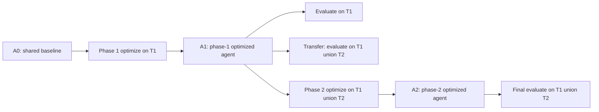

# Do Agent Optimizers Compound?：Agent 优化器能不能“复利”

## 元信息

| 项目 | 内容 |
| --- | --- |
| 原文 | [Do Agent Optimizers Compound? A Continual-Learning Evaluation on Terminal-Bench 2.0](https://arxiv.org/abs/2607.14004) |
| 版本 | arXiv:2607.14004v1，2026-07-15 提交 |
| 作者 | Wenxiao Wang、Priyatham Kattakinda、Soheil Feizi |
| 配套工件 | [relai-ai/Continual-Learning-Terminal-Bench](https://github.com/relai-ai/Continual-Learning-Terminal-Bench) |
| 方向 | 大模型 Agent、Agent harness 优化、持续学习评测 |
| 类型 | 技术报告 / 论文 |

## TL;DR

- **这篇文章问的不是“哪个 Agent 分数最高”**，而是：一个已经被优化过的 Agent，遇到新任务后再次优化，第一次优化得到的能力会不会保住，第二次优化的收益会不会继续累积。
- **作者把问题改写成两阶段持续学习评测**：Phase 1 在 12 个 Terminal-Bench 2.0 hard tasks 上优化；Transfer 阶段把同一个 Phase-1 Agent 放到 22 个任务联合集上，不再优化；Phase 2 再给每种方法 200 次 rollout 预算，在联合任务集上继续优化。
- **比较对象是三种 harness 优化器**：GEPA 只改 prompt；Meta Harness 直接改 harness code；RELAI-VCL 可改 prompt、tool、workflow、memory、skill 和 code，并在搜索循环内部拒绝会损害既有成功任务的候选。
- **关键数字很集中**：Baseline 的 lifelong average 为 58.7%；GEPA 为 66.0%；Meta Harness 为 64.6%；RELAI-VCL 为 76.4%。RELAI-VCL 同时在 Phase 1、Transfer、Final 和 lifelong average 四个视角领先。
- **最有解释力的不是单点胜负**：GEPA Phase 1 到 70.8%，但 Transfer 掉到 54.5%，低于 Baseline 的 56.8%；Meta Harness Transfer 到 68.2%，但 Phase 2 Final 掉到 59.1%；RELAI-VCL 则从 79.2% 到 72.7% 再到 77.3%。
- **作者的核心机制判断**：回归控制必须在搜索循环内部生效，而不是优化结束后再做事后评估；否则优化器容易找到对当前任务有用、但破坏旧能力或无法迁移的 shortcut。
- **局限也很重要**：Terminal-Bench 2.0 的任务之间关系较松，任务可重复执行并有 verifier；真实生产 Agent 的失败往往来自同一产品域、同一工具链、一次性轨迹和不完整反馈，因此本文证明的是“这个协议下的复利能力”，不是通用 Agent 自我改进定律。

## 研究问题：为什么静态 Agent benchmark 不够

### 问题从哪里来

- 许多 Agent 优化工作会做同一件事：
  - 固定一个 benchmark；
  - 固定一个 Agent harness；
  - 让优化器改 prompt、tool 描述、workflow 或代码；
  - 报告优化前后的 pass rate。
- 这个设置能回答：
  - “在同一批题上，优化器能不能提高分数？”
- 但它回答不了：
  - “优化后的 Agent 遇到新任务时是否泛化？”
  - “再次优化时会不会破坏第一次获得的能力？”
  - “收益是累积、停滞，还是来回覆盖？”

### 作者真正关心的“复利”

作者把复利拆成两个必要条件：

| 条件 | 评测含义 | 如果失败，说明什么 |
| --- | --- | --- |
| 正迁移 | Phase 1 优化后的 Agent 不经过新优化，也能在扩展任务集上保持或提升 | 第一次优化可能只是记住了旧题 shortcut |
| 可再优化 | Phase 2 从已优化 Agent 出发，在联合任务集上继续提高 | 优化器可能只会做一次性补丁，不能持续积累 |

用公式写，设初始任务为 `T1`，新到任务为 `T2`，初始 Agent 为 `A0`：

```text
Phase 1:      A1 = Optimizer(A0, T1, budget=200)
Transfer:     evaluate(A1, T1 union T2), no new optimization
Phase 2:      A2 = Optimizer(A1, T1 union T2, budget=200)
Final:        evaluate(A2, T1 union T2)

Compounding requires:
1. score(A1, T1 union T2) >= score(A0, T1 union T2)
2. score(A2, T1 union T2) > score(A1, T1 union T2)
3. no major regression on previously solved behavior
```

这比静态榜单更接近部署场景：生产 Agent 通常不是“一次性调好”，而是在新失败、新任务、新工具和新用户工作流出现后反复修补。

## 评测协议：两阶段持续学习如何落地

### 任务划分

论文选择 Terminal-Bench 2.0 的 hard tasks，因为它们有三个适合评测 Agent 优化器的性质：

- **终端环境可执行**：任务涉及文件、shell、服务、构建、测试、网络或系统配置。
- **结果可验证**：每个任务能通过 verifier 或自动检查给出 pass/fail。
- **harness 改动会真实影响行为**：prompt、工具调用、输出解析、完成判定和错误恢复都会改变成功率。

协议本身做了一个简化：

| 阶段 | 任务数 | 优化预算 | 评测对象 | 想测什么 |
| --- | ---: | ---: | --- | --- |
| Phase 1 | 12 | 200 rollouts | `A1` on `T1` | 静态优化能力 |
| Transfer | 22 | 0 | `A1` on `T1 union T2` | 未见任务迁移 |
| Phase 2 | 22 | 200 rollouts | `A2` on `T1 union T2` | 再优化与保留 |
| Lifelong Avg. | 12/22/22 | 汇总 | 三个阶段均值 | 是否真的复利 |

这里的关键不是任务数大，而是评测顺序改变了问题：

- 静态评测只看 `A1` 是否比 `A0` 更好；
- 持续评测还要看 `A1` 是否会在 `T2` 上崩；
- 最后再看 `A2` 是否能从 `A1` 继续进步。

### 为什么这个协议比单个分数更有诊断力



这个流程能区分三种常被混在一起的现象：

| 现象 | 静态榜单会怎么误读 | 两阶段协议会怎么暴露 |
| --- | --- | --- |
| 当前题过拟合 | 看起来分数提高 | Transfer 低于 baseline |
| 保守泛化但不可再改 | 看起来没有大问题 | Phase 2 继续优化失败 |
| 真实复利 | 分数提高 | Transfer 和 Phase 2 都保持优势 |

## 三种优化器：它们到底能改什么

### GEPA：prompt 进化，但容易写进任务记忆

GEPA 在本文中主要作为 prompt-only optimizer：

- 它读取 rollout trace；
- 用反思式进化搜索改 prompt；
- 只接受在当前任务集合上提高的 prompt；
- 配套仓库中 Phase 1 prompt 从初始 5 行增长到 103 行，Phase 2 prompt 增长到 195 行。

论文和工件都显示，GEPA 的 Phase 1 prompt 里出现了命名任务 lesson，例如围绕 `configure-git-webserver` 的具体建议。

这对 `T1` 很有用：

- 它把旧失败直接转成规则；
- 它告诉 Agent 先看 `/tests/verify.sh`；
- 它记录 web server、document root、expected file 等具体经验。

但这也解释了为什么它在 Transfer 中危险：

| GEPA 行为 | 短期收益 | 迁移风险 |
| --- | --- | --- |
| 把旧题失败写入 prompt | Phase 1 分数上升到 70.8% | 新任务分布变了，旧题 lesson 可能变成噪声 |
| 保留任务命名记忆 | 对重复结构有帮助 | 对未见任务可能诱导错误先验 |
| 只看当前集合接受候选 | 当前优化目标清晰 | 没有内生机制保护旧能力或泛化能力 |

### Meta Harness：改代码更通用，但第二轮停住

Meta Harness 的搜索空间不是 prompt，而是 harness code：

- Phase 1 接受的候选是 `io_boundary_hardening.py`；
- 配套工件中该文件约 1315 行；
- 改动主题是命令完成标记、malformed tool-call、边界输入输出处理。

Phase 2 接受的候选是 `output_noise_compaction.py`：

- 配套工件中该文件约 1474 行；
- 目标是把重复终端输出、包管理日志、构建进度、测试 boilerplate 压缩成短摘要；
- 这听起来是通用 harness 改进，而不是 task ID patch。

Meta Harness 的结果也符合这种性格：

- Phase 1 提升不如 GEPA 和 RELAI-VCL；
- Transfer 很好，达到 68.2%；
- 但 Phase 2 每个候选都比已有 Phase-1 Agent 差，最终 Final 为 59.1%。

也就是说：

> Meta Harness 的第一次代码改动更像“保守、通用的鲁棒性修补”，所以迁移不错；但它没有展示出继续从旧改动上叠加新收益的能力。

### RELAI-VCL：把回归控制放进搜索循环

RELAI-VCL 的不同点不只是“能改更多东西”：

- 它可搜索 prompt、tool、workflow、memory、skill、code；
- 更关键的是候选选择规则包含 no-regression constraint；
- 如果一个候选解决新任务但破坏旧任务，搜索循环内部就拒绝它。

从配套仓库看，RELAI-VCL 的 artifacts 是完整 agent package：

- `config.py`
- `harbor_harness.py`
- `kira_agent.py`
- `anthropic_caching.py`
- `prompt_templates/terminus-kira.txt`

它的 Phase 1 prompt/workflow note 不是记录具体任务答案，而是强化 verifier-shaped loop：

- 推断真实成功条件；
- 检查附近测试、verifier、任务文件；
- 不把 HTTP 200、端口打开、服务 running 当成最终证据；
- 对构建、脚本、模型、文件输出做运行时契约检查；
- 在结束前执行更接近 grader 的验证。

这类改动的泛化含义是：

| 改动类型 | 是否 task-specific | 对复利的作用 |
| --- | --- | --- |
| 任务类型分类 | 否 | 让代码编辑、服务运维、文件产物走不同验证路径 |
| verifier discovery | 否 | 避免“看起来完成”但不满足 hidden checker |
| runtime-contract check | 否 | 把最终验收从主观判断转成外部契约 |
| no-regression search | 否 | 防止新修补牺牲旧能力 |

## 主结果：表格比单点分数更重要

### Consolidated results

论文 Table 8 可以压缩成下面这张表：

| Agent | Phase 1 | Transfer | Final | Lifelong avg. |
| --- | ---: | ---: | ---: | ---: |
| Baseline | 62.5% | 56.8% | 56.8% | 58.7% |
| GEPA | 70.8% | 54.5% | 72.7% | 66.0% |
| Meta Harness | 66.6% | 68.2% | 59.1% | 64.6% |
| RELAI-VCL | 79.2% | 72.7% | 77.3% | 76.4% |

### 怎样读这张表

不要先看最高分，而要按阶段读：

1. **Phase 1：三种方法都能优化静态任务。**
   - Baseline 为 62.5%；
   - GEPA 到 70.8%；
   - Meta Harness 到 66.6%；
   - RELAI-VCL 到 79.2%。
2. **Transfer：静态优化收益不等于泛化。**
   - GEPA 从 70.8% 掉到 54.5%；
   - 这低于 Baseline 在联合任务集上的 56.8%；
   - Meta Harness 和 RELAI-VCL 都保持正迁移。
3. **Final：迁移好也不等于能继续复利。**
   - Meta Harness Transfer 为 68.2%，但 Phase 2 后降到 59.1%；
   - GEPA 重新把联合任务纳入目标后恢复到 72.7%；
   - RELAI-VCL 继续到 77.3%。
4. **Lifelong average：只有分解后才有意义。**
   - GEPA 和 Meta Harness 的均值接近；
   - 但失败模式完全相反；
   - RELAI-VCL 的 76.4% 同时来自静态、迁移和再优化三项。

## 失败模式：这篇论文最值得带走的部分

### GEPA：会优化，但可能把旧题写成 prompt folklore

GEPA 的失败不是“不会优化”。

相反，它在 Phase 1 和 Phase 2 都能涨：

- Phase 1：70.8%；
- Phase 2 Final：72.7%。

它的问题是：

- 只有当新任务进入优化目标后才恢复；
- 在不优化的 Transfer 阶段，旧 prompt 对新任务造成负迁移；
- 这说明第一轮收益里有相当部分可能来自 task-set-specific memory。

从研究视角看，这提醒我们：

| 常见 Agent 优化实践 | 风险 |
| --- | --- |
| 把失败案例总结成越来越长的 system prompt | 可能把短期经验变成长期偏置 |
| 只用当前 benchmark 接受候选 | 无法发现对未来任务的负迁移 |
| 用 post-hoc eval 看 regression | regression 已经写进候选，不再塑造搜索方向 |

### Meta Harness：通用修补能迁移，但不保证可叠加

Meta Harness 的失败更微妙。

它不是过拟合旧题，而是第二轮无法继续增长：

- Phase 1 只有 66.6%，但 Transfer 到 68.2%；
- 说明第一轮修补可能确实更通用；
- 但 Phase 2 搜索出的候选都更差，Final 掉到 59.1%。

这类失败在生产 Agent 中很常见：

- 第一轮把明显 I/O 边界、日志噪声、完成判定修好；
- 第二轮再改时，候选空间会开始碰到耦合问题；
- 没有严格回归门，代码级 harness search 很容易让一个场景更好、另一个场景更差。

### RELAI-VCL：复利来自“搜索时的约束”，不是事后 QA

RELAI-VCL 的论文解释是：

- no-regression constraint 先防止灾难性遗忘；
- 同时也像一个隐式 generalization filter；
- 候选必须在新任务上有收益，且不能破坏已解决任务；
- 因此更容易保留“真正通用”的小改动。

可以把它理解成一个约束优化问题：

```text
maximize   pass_rate(candidate, current_tasks)
subject to pass(candidate, previously_solved_tasks) >= pass(current_agent, previously_solved_tasks)
           candidate_change is accepted only inside the loop
```

和事后评估相比，区别在于：

| 位置 | 作用 |
| --- | --- |
| 搜索循环内 | 改变候选分布；坏候选不会继续成为下一轮搜索起点 |
| 搜索结束后 | 只能发现坏结果；无法阻止搜索已经围绕 shortcut 走远 |

## Figure/Table 证据怎么支撑论证

### Table 1 / Table 8：复利不是一个指标

表格把三件事拆开：

| 指标 | 直接回答的问题 |
| --- | --- |
| Phase 1 | 能不能在已知任务上优化 |
| Transfer | 优化结果能不能迁移 |
| Final | 再优化能不能继续进步 |
| Lifelong avg. | 三者均衡后总体表现 |

如果只看 Final：

- GEPA 72.7% 看起来不错；
- 但它的 Transfer 为 54.5%，说明第一轮就已经产生负迁移。

如果只看 Transfer：

- Meta Harness 68.2% 看起来稳；
- 但 Phase 2 Final 为 59.1%，说明它没能继续在旧修改上累积收益。

### Figure 1 / Figure 5：lifelong average 的正确用法

Figure 1 和 Figure 5 强调 lifelong average：

- RELAI-VCL：76.4%；
- GEPA：66.0%；
- Meta Harness：64.6%；
- Baseline：58.7%。

但这个平均值不能单独当榜单：

- GEPA 和 Meta Harness 均值接近；
- 失败路径完全不同；
- 所以 lifelong average 应该作为汇总，不应该替代阶段分解。

### Appendix C：从 artifacts 看“通用性”

附录和仓库 artifacts 给出一个很好的质检角度：

| 方法 | 工件形态 | 读到的证据 |
| --- | --- | --- |
| GEPA | prompt 文件 | prompt 变长，并出现命名任务 lesson |
| Meta Harness | 单个 Python harness 文件 | I/O 边界与输出压缩属于通用 harness 改动 |
| RELAI-VCL | 完整 agent package | workflow note 强调 verifier-shaped validation 和 runtime contract |

这让论文不只停在 pass rate：

- 它能解释为什么 GEPA 可能过拟合；
- 也能解释为什么 Meta Harness 迁移较好但继续搜索不稳；
- 更能解释为什么 RELAI-VCL 的回归控制有机制可信度。

## 伪代码：把论文协议写成可复现实验

```text
Input:
  T1 = initial hard Terminal-Bench tasks
  T2 = newly introduced hard Terminal-Bench tasks
  A0 = shared baseline agent
  Optimizers = {GEPA, MetaHarness, RELAI_VCL}
  Budget = 200 rollouts per phase

State:
  results = {}

for optimizer in Optimizers:
  A1 = optimizer.search(
         start_agent=A0,
         train_tasks=T1,
         budget=Budget,
         regression_set=empty_or_method_specific
       )

  phase1_score = evaluate(A1, T1)
  transfer_score = evaluate(A1, T1 union T2)

  A2 = optimizer.search(
         start_agent=A1,
         train_tasks=T1 union T2,
         budget=Budget,
         regression_set=tasks_solved_by_A1 if optimizer supports in_loop_regression_control
       )

  final_score = evaluate(A2, T1 union T2)
  lifelong_average = mean(phase1_score, transfer_score, final_score)

  results[optimizer] = {
    phase1_score,
    transfer_score,
    final_score,
    lifelong_average
  }

Output:
  Compare static optimization, transfer, re-optimization, and lifelong average separately.

Failure boundary:
  If tasks are not repeatable or verifiers are missing, this protocol cannot be run as written.
```

## 与相关工作的关系

### 它和 prompt optimization 的关系

本文不是否定 GEPA、MIPROv2、DSPy 这类静态优化路线。

更准确地说：

- 静态优化回答“当前任务集能不能变好”；
- 持续优化回答“变好后还经不经得起未来任务”；
- 二者不是同一个问题。

因此，本文对 prompt optimization 的挑战是：

> 如果优化过程允许把任务集细节写入 prompt，那么必须增加跨时间、跨任务的回归与迁移评测，否则高分可能只是当前任务集合的局部记忆。

### 它和 continual learning 的关系

论文把 agent harness optimization 类比到 continual learning：

- 传统 continual learning 担心模型权重更新后遗忘旧任务；
- 这里担心 harness 更新后遗忘旧行为；
- EWC 用参数正则保护重要权重；
- RELAI-VCL 用候选拒绝保护已解决任务。

这个类比有启发，但也有边界：

| 模型权重 continual learning | Agent harness continual learning |
| --- | --- |
| 更新对象是参数 | 更新对象可能是 prompt、工具、工作流、代码 |
| 遗忘来自梯度更新 | 遗忘可能来自规则覆盖、工具语义改变、完成判定改变 |
| 正则项可微 | harness 候选通常不可微，只能跑任务验收 |

### 它和生产 Agent 维护的关系

本文最接近真实维护的一点是：

- Agent 会反复被修；
- 每次修补都可能影响旧工作流；
- 仅靠一次 benchmark 不能描述长期风险。

但它和生产环境仍有距离：

- Terminal-Bench 任务可重复；
- verifier 相对明确；
- 任务之间相关性弱；
- 反馈是 pass/fail，不是用户投诉、日志片段或部分失败轨迹。

## Detail inventory：深读时应保留的细节

### 方法与变量

| 名称 | 在文中角色 | 解释重点 |
| --- | --- | --- |
| `A0` | 共享 baseline agent | 三个 optimizer 都从同一类 TerminusKira agent 出发，避免把初始 harness 差异误当成优化器能力 |
| `A1` | Phase 1 后 agent | 用来同时测静态收益和 transfer；这是论文最关键的中间状态 |
| `A2` | Phase 2 后 agent | 用来判断“在旧改动上继续改”是否还能提高 |
| `T1` | 初始任务集 | 12 个 hard Terminal-Bench 2.0 tasks，驱动第一轮搜索 |
| `T2` | 新任务集 | 第二阶段加入，和 `T1` 组成 22-task union |
| `Budget` | 优化预算 | 每个方法每阶段 200 rollouts，控制搜索成本 |
| no-regression constraint | RELAI-VCL 的核心约束 | 新候选不能用牺牲已解决任务来换取新任务收益 |

### 训练/优化设置

这篇论文没有训练底层 LLM 权重。

它优化的是 Agent 外层系统：

- **prompt 层**：任务说明、经验 lesson、完成前 checklist。
- **tool 层**：工具调用格式、错误处理、命令输出边界。
- **workflow 层**：先看 verifier、再修代码、最后做端到端验收。
- **memory/skill 层**：把可复用经验变成更稳定的策略片段。
- **harness code 层**：命令完成检测、输出压缩、completion confirmation。

因此，本文的“持续学习”不是模型参数持续学习，而是 harness 持续学习。

| 如果读成模型训练论文 | 会误解什么 |
| --- | --- |
| 以为 76.4% 来自权重更新 | 实际来自外层 agent harness/search policy 的候选选择 |
| 以为忘记发生在神经参数里 | 实际可能发生在 prompt lesson、工具边界、完成判定和代码补丁里 |
| 以为解决方案是 regularization loss | 实际解决方案更接近 regression-gated CI |

### Benchmark 与 baseline

Terminal-Bench 2.0 在这里的作用不是“又一个终端榜单”。

它提供的是可重复的环境：

- 每个任务可以执行多次；
- pass/fail 可自动判断；
- 任务足够难，baseline 不是全过；
- harness 改动会影响真实成功率；
- 失败轨迹能反馈给优化器。

Baseline 也不是弱到没有意义：

- Phase 1 为 62.5%；
- 在 22-task union 上为 56.8%；
- 这意味着负迁移可以被看见，而不是所有方法都天然碾压。

### 消融与反例

论文没有给传统意义上大量模块消融，但它提供了三组自然反例：

| 反例 | 说明 |
| --- | --- |
| GEPA Phase 1 高、Transfer 低 | 静态优化强不代表迁移强 |
| Meta Harness Transfer 高、Final 低 | 迁移好不代表继续优化强 |
| RELAI-VCL 四阶段都高 | 回归控制可能同时帮助迁移和再优化 |

这三组反例比单独做一个 ablation 更有诊断力。

原因是它们分别击穿了三个常见假设：

1. **“分数涨了就是好优化器”**：GEPA 证明未必。
2. **“泛化了就能继续改”**：Meta Harness 证明未必。
3. **“回归检查可以最后再做”**：RELAI-VCL 的机制解释表明，最后检查太晚。

## 失败案例细读：为什么 shortcut 会被接受

### 当前任务集会奖励什么

如果 optimizer 只看当前任务集，它会偏好最短路径：

- 某个任务要求 web server 输出固定文件；
- prompt lesson 直接写“检查 `/tests/verify.sh` 和 document root”；
- 这个 lesson 对当前任务非常有效；
- 但未来任务可能不是 web server，也可能 verifier 的信号不同。

这种 shortcut 不一定是作弊。

它可能是合理经验，但问题在于：

- 经验被写成全局规则；
- 全局规则进入未来任务；
- 未来任务没有显式机制告诉 Agent “这条旧经验此刻不适用”。

### 回归控制为什么能过滤 shortcut

回归控制不是简单保守。

它实际做了一个筛选：

- 如果候选只解决新任务，但破坏旧任务，拒绝；
- 如果候选只记住旧题细节，但不能帮助新任务，Transfer 会暴露；
- 如果候选是更底层的验证流程改进，它更可能在旧任务和新任务上同时有收益。

可以把这个逻辑写成一张证据链：

| 观察 | 机制解释 | 边界 |
| --- | --- | --- |
| GEPA Transfer 低于 baseline | prompt 里混入 task-specific lesson | 只在这批任务和这次 prompt 工件中观察到 |
| Meta Harness Transfer 高 | I/O hardening 更通用 | Phase 2 搜索仍会产生坏候选 |
| RELAI-VCL Transfer 和 Final 都高 | no-regression gate 让候选更像通用修补 | 不能证明所有领域都成立 |

## 如果复现实验，我会重点检查什么

### 复现清单

1. **任务 split 是否固定**：
   - 12 个 Phase 1 tasks；
   - 10 个新任务；
   - 22-task union；
   - 每个任务 verifier 是否一致。
2. **rollout budget 是否严格一致**：
   - 每阶段 200 rollouts；
   - 三个 optimizer 不能使用不同搜索预算；
   - candidate rejection 也要计入成本。
3. **底层模型是否一致**：
   - baseline 和 proposer 都涉及 GPT-5.5；
   - 如果换模型，结果可能变。
4. **候选接受规则是否透明**：
   - GEPA prompt 候选如何保留；
   - Meta Harness code 候选如何验收；
   - RELAI-VCL 何时判定 regression。
5. **Phase 2 rejected candidates 是否可审计**：
   - Meta Harness 的停滞很关键；
   - 但仓库未完整释放所有 rejected candidates；
   - 独立复现时应该保留每个失败候选的分数和 diff。

### 最容易出错的复现点

| 风险 | 后果 |
| --- | --- |
| 把 Transfer 误写成“重新优化后评测” | 会掩盖 GEPA 的负迁移 |
| 不固定任务 split | Phase 1/Phase 2 分数不可比 |
| 没有记录 rejected candidate | 无法解释 Meta Harness 为什么回落 |
| 只报告 lifelong average | 会把 GEPA 和 Meta Harness 的相反失败模式混在一起 |
| 忽略 artifacts 内容 | 无法判断分数背后的机制是否可信 |

## 局限：这篇论文不能证明什么

### 任务相关性不足

作者明确指出，Terminal-Bench 2.0 的任务之间关系较松：

- 系统管理；
- ML infrastructure；
- 软件工程；
- 安全相关流程；
- 科学计算。

这有利于隔离评测，但不像真实产品：

- 同一企业搜索 Agent 的失败会共享索引、权限、cache、召回策略；
- 同一 coding Agent 的失败会共享 repo 结构、测试框架、依赖管理；
- 同一安全 Agent 的失败会共享 sandbox、扫描器、策略约束。

因此，本文的结果可能低估或高估 shortcut 风险。

### verifier 假设偏强

协议依赖可重复执行和可靠 verifier。

真实部署中常见情况是：

- 只有一次失败轨迹；
- 用户没有完整复现步骤；
- 环境状态已变化；
- 旧任务无法安全重跑；
- verifier 只能覆盖部分行为；
- 许多安全/权限失败没有简单 pass/fail。

所以 no-regression search 在生产中要落地，不能只复制本文协议，还需要：

- 轨迹重放；
- 合成回归测试；
- shadow evaluation；
- 人工验收样本；
- 风险分级；
- 线上遥测。

### 方法比较仍是小规模技术报告

还要注意几个实验边界：

| 边界 | 影响 |
| --- | --- |
| 只有两个阶段 | 不能证明长期多轮复利 |
| 任务数为 12 + 10 | 统计稳定性有限 |
| underlying LLM 固定为 GPT-5.5 | 不能直接外推到其他模型族 |
| RELAI.ai 自家方法参与比较 | 需要独立复现实验确认 |
| Meta Harness rejected candidates 未完整释放 | 难以完全复盘 Phase 2 停滞原因 |

这些边界不削弱论文提出的问题，但提醒我们不要把 76.4% 读成普遍定律。

## 对 Agent 研究的启发

### 1. Agent benchmark 应该报告“时间维度”

未来评测不应只报告：

- optimized pass rate；
- final benchmark score；
- 单轮 best-of-N。

更应该报告：

| 维度 | 为什么重要 |
| --- | --- |
| 第一次优化收益 | 判断 optimizer 是否有效 |
| 未见任务迁移 | 判断是否过拟合当前题集 |
| 再优化收益 | 判断收益能否叠加 |
| 旧任务回归率 | 判断维护成本 |
| 候选拒绝原因 | 判断搜索是否靠 shortcut |

### 2. Harness 改动需要 regression ledger

生产 Agent 的每次 harness 改动都应该像软件工程中的测试套件一样维护回归账本：

- 哪些任务以前能过；
- 哪些失败被修过；
- 哪些 verifier 是强证据；
- 哪些检查只是弱信号；
- 哪些改动触发过负迁移。

如果没有这类 ledger，Agent 优化会变成：

- 新 failure 进来；
- prompt 加一条规则；
- 旧规则越堆越多；
- 新任务越来越容易被旧经验误导。

### 3. “会自我改进”必须拆成更窄的问题

本文把一个模糊说法拆得更清楚：

| 模糊说法 | 更可测的问题 |
| --- | --- |
| Agent 会自我改进 | 优化器能否在固定预算下提高当前任务 |
| Agent 能持续学习 | 第一次优化能否迁移到新任务 |
| Agent 能复利 | 第二次优化能否继续提高且不回归 |
| Agent 更可靠 | 候选是否经过 verifier-shaped no-regression gate |

这个拆分比“自进化 Agent”口号更有研究价值。

## 结论

这篇技术报告的价值在于，它把 Agent harness optimization 从静态分数问题推进到持续维护问题。

最值得记住的不是 RELAI-VCL 赢了，而是三种失败/成功形态：

- **GEPA**：能在当前任务上涨分，但第一轮 prompt 经验可能对新任务负迁移。
- **Meta Harness**：第一次代码改动更通用，迁移好，但第二轮继续优化时停滞并回落。
- **RELAI-VCL**：把 no-regression constraint 放进搜索循环，因此同时获得正迁移和再优化收益。

如果要把这篇论文变成下一步研究计划，我会优先追问：

1. 在更强相关性的同域任务流中，no-regression 约束会更有用，还是会过度保守？
2. 当 verifier 不完整、只能看一次失败轨迹时，如何构造足够可靠的 regression set？
3. 多于两轮的优化中，RELAI-VCL 是否仍能保持复利，还是会被回归约束卡住？
4. 不同底层模型、不同 harness、不同工具权限下，GEPA 的 task-specific prompt 记忆是否总是负迁移？
5. Agent 优化器的报告标准，是否应该强制包含 Phase 1、Transfer、Final 和 rejected-candidate analysis？

这篇文章给出的答案是有限的，但它提出了一个更正确的问题：Agent 优化不能只问“这次改完分数涨没涨”，还要问“下一次再改时，旧能力还在不在，收益能不能继续叠加”。
