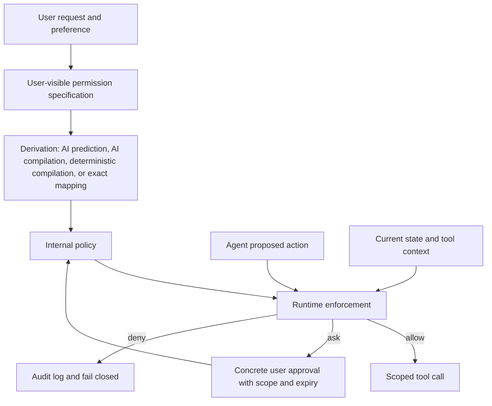

# How Agents Ask for Permission：AI Agent 权限应从“弹窗同意”走向可验证执行

## 元信息与 TL;DR

- **论文**：How Agents Ask for Permission: User Permissions for AI Agents, from Interfaces to Enforcement
- **作者**：Alexandra E. Michael, Franziska Roesner
- **机构**：University of Washington
- **时间**：arXiv v1, 2026-07-15 11:36:22 UTC
- **链接**：[arXiv 摘要](https://arxiv.org/abs/2607.13718)，[HTML 全文](https://arxiv.org/html/2607.13718v1)
- **类型**：AI 安全综述与商业系统 walkthrough

### TL;DR

- 这篇论文问的是一个很具体的问题：**AI Agent 代表用户调用工具时，权限到底应该由谁定义、如何表达、怎样从 UI 变成内部策略、最后由什么机制执行**。
- 作者调研了 **21 个 2024-2026 年的 Agent 权限系统/提案**，再 walkthrough 了 **5 个商业 Agent**：Claude、ChatGPT chat mode、Claude Cowork、Codex、ChatGPT agent mode。
- 核心 taxonomy 分成四层：**威胁模型、用户可见规格、内部策略规格、UI 到策略的派生方式、运行时 enforcement**。
- 文献里最常见的三个目标是：**降低用户负担、形式化策略、确定性执行**；但作者判断没有一个系统同时做到三者。
- 商业系统的方向几乎反过来：它们通常提供持续用户控制，例如会话内批准、权限模式切换或撤销；但透明度、可验证策略和低负担之间仍然断裂。
- 关键数字包括：综述池从 26 个系统筛到 21 个；商业 walkthrough 覆盖 2 家公司、3 类形态；12/21 个文献系统追求低用户负担，11/21 采用形式化策略基础，12/21 采用确定性 enforcement。
- 论文不是新 benchmark，也没有证明某个权限模型优于所有方案；它的价值在于把“问用户一下”拆成一个可审计管线：**用户意图 -> 权限规格 -> 内部策略 -> 执行拦截 -> 事后可修改**。
- 最大局限是商业 Agent 只能黑盒观察，论文没有评测真实用户长期使用时的授权疲劳，也没有给出形式化验证的 reference implementation。

## 研究问题：为什么 Agent 权限不同于传统 App 权限？

传统权限系统通常处理的是比较稳定的关系：

- App 要访问相机、通讯录、文件夹或某个 OAuth scope。
- 用户在安装时或运行时批准。
- 后续执行路径主要由程序代码决定。

AI Agent 的难点不是“有没有权限弹窗”，而是三件事同时发生：

1. **任务目标是自然语言**：用户说“帮我整理合同”，不一定逐项列出可读文件、可写路径、可发送对象。
2. **执行计划可变**：Agent 会先读、再检索、再调用工具，甚至根据中间结果改计划。
3. **数据和指令混在一起**：网页、邮件、issue、README 里的文字既是上下文，也可能包含恶意指令。

因此，作者把权限问题重新定义成：

> Agent 在代表用户执行任务时，系统如何把用户偏好和安全边界转换为可执行、可解释、可更新的策略？

这个定义比“是否弹窗确认”更宽，因为弹窗只是一个 UI 机制。真正的权限系统还必须回答：

- 用户看到的是自然语言说明、固定开关、结构化规则，还是任意策略？
- 系统内部保存的是自然语言、标签、固定 policy、Datalog/DSL，还是代码？
- 用户输入如何被编译成内部策略：靠 LLM 猜测、AI 编译、确定性编译，还是原样使用？
- 运行时靠什么挡住越权：LLM guardrail、第三方工具、用户实时审批、非 AI 自动机制，还是生成的 enforcement code？

## 方法：21 个文献系统 + 5 个商业 Agent

作者的方法不是提出一个新 runtime，而是做系统化整理。

| 环节 | 做法 | 证据边界 |
|---|---|---|
| 文献搜索 | 从少数有影响力论文出发，递归跟踪引用 | 初始池 26 个系统 |
| 筛选 | 去掉非 Agent、无权限机制、只支持全局策略的系统 | 最终 21 个系统/提案 |
| Taxonomization | 反复调整分类：UI、内部规格、派生、执行 | 主要由第一作者完成，第二作者反馈 |
| 商业 walkthrough | 观察 5 个商业 Agent 的权限 UI 与执行表现 | 闭源系统，只能黑盒判断 |
| 对比 | 把商业 Agent 放回同一张 taxonomy | 不推断未公开内部实现 |

商业 walkthrough 覆盖三类 Agent：

- **带 OAuth 连接的网页聊天 Agent**：Claude、ChatGPT chat mode。
- **桌面/编码 Agent**：Claude Cowork、Codex。
- **Agentic browser**：ChatGPT agent mode。

作者的 walkthrough 步骤很接近安全产品评测：

1. 在干净环境安装或设置 Agent。
2. 找到初始权限设置 UI。
3. 授予少量权限，例如 Gmail 或本地文件夹。
4. 让 Agent 执行应该允许和不应该允许的任务。
5. 如果可行，撤销权限，再测试需要被撤销权限的任务。

这里需要注意：论文没有声称完全逆向商业系统内部策略。它只报告“用户可见设置”和“输出/UI 行为”能支持的判断。

## Taxonomy：权限系统不是一个开关，而是一条管线

作者的 Table 1 是全文核心。它把用户级权限拆成五类问题。

| 分类维度 | 典型选项 | 研究意义 |
|---|---|---|
| 威胁模型：攻击者 | 外部数据源、第三方工具、Agent provider、被 prompt injection 或 hallucination 影响的 benign agent | 先说清“谁可能让 Agent 越权” |
| 威胁模型：目标 | 数据外泄、一般 task flow 越权 | 区分只防泄露，还是防所有数据/控制流错配 |
| 用户可见规格 | 无 UI、自然语言、权限标签、固定选项、结构化约束、任意规则 | 决定用户能表达多少偏好 |
| 内部规格 | 自然语言、标签、固定 policy、结构化约束、任意规则 | 决定策略能否被检查、组合和验证 |
| 派生方式 | 无派生、AI 预测、AI 编译、确定性编译、原样使用 | 决定 UI 到 enforcement 之间是否可解释 |
| Enforcement | 无、第三方工具、LLM guardrail、AI 生成代码、非 AI 自动机制、user-in-the-loop | 决定最终是否能稳定挡住越权 |

可以把论文的抽象写成一个权限管线：

```text
User intent U
  -> visible specification S_ui
  -> derivation function D(S_ui, context)
  -> internal policy P
  -> enforcement E(action, state, P)
  -> allow / deny / ask / modify
```

更形式化地看：

```text
P = D(S_ui, C_task, C_user, C_system)
A_t = planner(history_t, tools, data)
decision_t = E(A_t, State_t, P)
```

变量解释：

- `S_ui`：用户看到并操作的权限表达，例如“每次询问”“允许读取 Gmail”“不要发邮件”。
- `D`：派生函数，可以是 LLM 预测、LLM 编译、确定性编译或简单映射。
- `P`：内部 policy，例如 privilege label、structured constraints、Datalog 规则或可执行函数。
- `A_t`：Agent 在第 `t` 步准备执行的动作。
- `E`：运行时 enforcement，输出允许、拒绝、继续问用户或修改动作。

这个视角很重要：如果 `D` 不透明，用户以为自己设置了 A，系统内部可能执行的是 B；如果 `E` 不确定，内部 policy 再清晰也可能挡不住真实工具调用。

## 关键发现一：低用户负担、形式化、确定性执行很难同时满足

论文把文献系统的目标压缩成三个主线。

### 目标 A：低用户负担

作者发现 **12/21 个系统**在设计上试图减少用户直接写 policy 的负担。

常见路径有两类：

- 让用户用自然语言描述权限，例如“不要把个人文件发给外部网站”。
- 从 query 或上下文推断 policy，尽量不打断用户。

这类设计解决的是 usability：

- 用户不需要学习 DSL。
- 每次工具调用都弹窗的频率下降。
- Agent 的自动化体验更完整。

但风险也很明显：

- 自然语言策略容易歧义。
- LLM 推断可能把“这次可以”误读成“以后都可以”。
- 用户看不到内部策略到底如何落地。

### 目标 B：形式化策略

作者统计 **11/21 个系统**把 policy 绑定到某种形式化基础。

这些基础包括：

- information flow control 的高/低安全标签；
- typed DSL 或 Datalog；
- linear temporal logic；
- integer linear programming；
- 对 Agent 生成代码做信息流分析。

形式化策略的优势在于：

- policy 可以被机器检查。
- 多条规则可以组合。
- 策略能更接近“可验证安全边界”，而不是提示词建议。

但作者指出，形式化不等于已证明正确：

- 有些系统只是暗示有资源类型或策略结构，但没有完整形式语义。
- 有些系统有安全分析，却没有对实现级 enforcement 做形式化验证。
- 最接近的方向仍然只是 run-time 分析或架构级论证，而不是完整 verified monitor。

### 目标 C：确定性 enforcement

作者认为 **12/21 个系统**采用某种确定性 enforcement。

这里的“确定性”有两个来源：

- 不调用 LLM 的自动 violation detection。
- user-in-the-loop：先让用户做决定，而不是让模型判断策略是否违规。

确定性 enforcement 的价值在于：

- 同一动作、同一状态、同一 policy 不应因为模型采样而得到不同结果。
- 安全边界不应暴露给未受信任的中间上下文。
- 对高风险动作，失败模式更容易审计。

但代价是：

- 纯用户实时审批会带来授权疲劳。
- 纯静态规则可能过度保守，损失 Agent 的灵活性。
- 对自然语言任务意图的理解仍可能需要模型参与。

论文最重要的判断是：**文献里没有一个系统同时实现低用户负担、形式化策略和确定性 enforcement**。少数系统接近其中两项，但三角形很难闭合。

## 关键发现二：商业 Agent 更重视持续控制，但透明度不足

作者的商业 walkthrough 得出一个有意思的反差。

文献系统通常强调：

- 怎么自动推断权限；
- 怎么形式化 policy；
- 怎么确定性执行；
- 怎么从架构上防 prompt injection 或工具越权。

商业 Agent 则更常见：

- 让用户在会话中持续批准；
- 提供权限模式切换；
- 让用户修改或撤销部分权限；
- 用 UI 提醒高风险动作。

这说明商业系统更贴近实际产品体验：用户需要在工作过程中动态调整授权，而不是只在初始化阶段选一次。

但论文也指出两个缺口。

### 缺口 1：用户控制通常伴随高开销

如果每次动作都问用户，系统看起来安全，但会出现两个问题：

- 用户为了完成任务而机械批准，授权信号质量下降。
- Agent 的自动化价值被打断，尤其是长程任务。

这和移动 App 的权限疲劳类似，但在 Agent 中更严重，因为 Agent 的动作序列更长、动作语义更复杂。

### 缺口 2：内部策略不透明

商业系统通常不会告诉用户：

- 你刚才点的“允许”被保存成什么内部 policy？
- 这个 policy 是会话级、任务级、工具级，还是全局级？
- 撤销后，旧任务、旧子进程、旧记忆是否仍然保留能力？
- LLM guardrail 是建议层，还是实际工具调用前的强制 gate？

论文中 Figure 1-4 的作用正是说明这些 UI/执行细节。

| 图 | 证据点 | 论文用它支持什么 |
|---|---|---|
| Figure 1 | Claude 中选择 Gmail 权限 | 商业系统有用户可见 policy 设置 |
| Figure 2 | Claude MCP request 显示某邮件草稿动作不需要 approval | UI 设置和底层工具调用日志可能不完全一致 |
| Figure 3 | Claude Cowork 删除文件权限提示 | 权限可能跨任务保留，用户提示语需要更精确 |
| Figure 4 | Codex enforcement settings | Codex 的权限设置更像 session 级 enforcement mode |

这些图不是 benchmark 结果，但它们提醒研究者：权限设计不能只看“有无按钮”，还要看按钮背后是否有清晰边界。

## 一个可执行的权限检查伪代码

把作者的 taxonomy 放到工程系统里，可以得到一个最小权限检查循环。

```text
Input:
  user_request
  user_visible_policy
  agent_state
  proposed_action

State:
  policy_store
  approval_history
  revocation_log
  tool_capability_map

Loop:
  1. internal_policy = derive(user_visible_policy, user_request, policy_store)
  2. action_claim = summarize(proposed_action, required_resources, side_effects)
  3. if action_claim violates deterministic rules:
       deny and log violation
  4. else if action_claim is covered by internal_policy:
       allow with least privilege token
  5. else if risk is explainable to user:
       ask user with concrete payload preview
       store decision with scope and expiry
  6. else:
       fail closed

Output:
  allow / deny / ask
  scoped credential or no credential
  audit event
```

这个伪代码对应论文里的四个关键要求：

- 用户可见：ask 时必须展示具体动作和影响，而不是泛泛说“允许访问数据”。
- 可派生：用户选择要变成内部 policy，不能只停留在 UI。
- 可执行：每个工具调用前都检查，而不是让 LLM 自觉遵守。
- 可更新：approval、revocation 和 expiry 必须进入状态。

## Mermaid：从用户意图到工具调用的安全边界



这里最危险的边是 `D -> P` 和 `E -> T`：

- `D -> P` 如果不可解释，用户无法知道自己的选择被怎样理解。
- `E -> T` 如果只是模型建议，工具调用仍可能绕过真正边界。

## 与外部讨论的关系：delegated access 还不够

外部工程博客通常会强调三类实践：

- 不要给 Agent 长期 root credential。
- 尽量使用 delegated access，让 Agent 继承用户身份。
- 对高风险动作使用 just-in-time approval 和更短 token。

这些建议是正确的，但论文提醒它们仍不完整。

原因是 delegated access 解决的是“Agent 能不能代表用户访问资源”，没有完全解决“这一次任务是否应该代表用户执行这个动作”。

举例：

- 用户本人有权限删除生产数据库，不代表 Agent 在“清理旧资源”任务中应该删除它。
- 用户本人有权限读取全公司 CRM，不代表 Agent 给某个客户写邮件时可以把任意记录放进 prompt。
- 用户本人可以手动发邮件，不代表 Agent 可以根据被网页注入的指令自动发送邮件。

因此更合理的模型是“双重授权”：

```text
Allowed(action) =
  UserHasResourcePermission(user, resource, operation)
  AND
  AgentPolicyAllows(task, action, context, risk)
```

第一项来自传统 IAM/OAuth/ACL；第二项来自 Agent-specific policy。少任何一项都不应该执行。

## 细读 Table 1：最值得带走的三个分类

### 1. 用户 UI 不等于内部 policy

论文把 UI 和 internal specification 分开，是非常关键的设计。

同样是“允许读取 Gmail”，内部可能有多种表达：

- 一个自然语言字符串；
- 一个 OAuth scope；
- 一个资源标签；
- 一个结构化规则；
- 一个 typed DSL 函数；
- 一个用户审批历史条目。

这些内部表达的安全性差异很大。

| 内部表达 | 优点 | 风险 |
|---|---|---|
| 自然语言 | 易生成、易展示 | 难以稳定执行 |
| 固定 policy | 易理解、易产品化 | 表达力有限 |
| privilege labels | 可做信息流控制 | 用户难以理解标签传播 |
| structured constraints | 可检查、可组合 | 需要设计 schema |
| arbitrary rules | 表达力最高 | 用户负担和安全审计成本高 |

### 2. AI 派生 policy 是便利点，也是攻击面

如果系统让 LLM 从用户 query 推断权限，它能减少交互负担；但这种派生过程必须被看作安全关键组件。

失败模式包括：

- 把一次性许可泛化成长期许可。
- 把低风险读操作误归类成可写操作。
- 被 prompt injection 影响，生成过宽 policy。
- 对含糊用户请求给出过度自信解释。

因此，AI 派生更适合作为候选 policy 生成器，而不是最终 enforcement。

一个较稳的结构是：

```text
LLM proposes policy candidate
  -> deterministic type/schema check
  -> least-privilege reduction
  -> user-readable diff
  -> runtime monitor enforces checked policy
```

### 3. User-in-the-loop 不是万能答案

论文把 user-in-the-loop 归入确定性 enforcement，因为用户实时做决定确实避免了模型随机判断。

但它也引出两个安全悖论：

- 问得越频繁，用户越可能自动批准。
- 问得越少，系统越需要自动判断，而自动判断又可能不透明。

更好的方向不是“所有敏感动作都问”，而是：

- 对可形式化低风险动作自动执行。
- 对高风险且可解释动作展示具体 payload。
- 对不可解释或上下文污染严重的动作 fail closed。
- 把用户决策保存为带 scope、expiry、revocation 的 policy update。

## 失败案例：权限系统最容易在四个地方失真

论文没有构造攻击 benchmark，但它的 taxonomy 可以推导出四类常见失败。它们也是工程系统做安全评审时最应该检查的点。

| 失败位置 | 表面现象 | 根因 | 更稳的设计判据 |
|---|---|---|---|
| UI 规格 | 用户点了“允许本次”，系统后来像“长期允许”一样使用 | UI 文案没有绑定 scope、expiry 和 task id | 每次授权都生成可审计 policy diff |
| 派生函数 | Agent 根据自然语言请求自动推断过宽权限 | `D(S_ui, context)` 混入未受信任上下文或模型过度泛化 | LLM 只能生成候选，确定性检查负责收窄 |
| Enforcement | LLM 判断“看起来没问题”后直接调用工具 | 安全判断和执行权在同一个不确定组件里 | 工具调用前必须经过独立 monitor |
| 撤销状态 | 用户撤销权限后，暂停任务恢复时仍可继续旧能力 | token、计划、记忆或子任务没有同步失效 | revocation 要传播到所有 runtime state |

### 失败一：把“批准动作”误当成“批准能力”

用户批准“发送这封邮件”与批准“以后可以发邮件”完全不同。

Agent 系统如果只保存工具级布尔值，就会丢失上下文：

- 这封邮件的收件人是谁？
- 正文是否已经预览？
- 是否包含附件？
- 是否由用户原始请求触发，还是由网页内容触发？
- 这次批准是一次性、会话级，还是永久？

因此，权限记录至少应保存：

```text
approval = {
  action_type,
  resource,
  concrete_payload_hash,
  task_id,
  expires_at,
  source_of_request,
  user_visible_explanation
}
```

只保存 `email.send = true` 这种状态，会把用户具体授权扩张成抽象能力。

### 失败二：让模型同时当律师和执行员

LLM 适合做语义解释，例如把“帮我回复客户”拆成可能需要读取邮件、生成草稿、请求发送确认。

但它不适合独自做最终权限仲裁，因为同一个模型同时看见：

- 用户的自然语言目标；
- 工具返回的未受信任数据；
- 可能被注入的网页或邮件；
- 系统提示中的安全规则；
- 即将执行的工具参数。

这些信息混在上下文里时，模型既是 planner，又是 policy interpreter，还可能是被攻击对象。论文因此强调确定性 enforcement：真正有副作用的调用，最好由模型外部的机制拦截。

### 失败三：把商业 UI 当成安全证明

商业系统展示了很多有价值的设计：权限模式、审批弹窗、会话设置、撤销入口。

但研究者不能只看 UI，因为 UI 只说明用户能操作什么，不说明底层如何执行。

安全证明需要回答：

- 工具调用是否真的走同一个 approval gate？
- 子任务和恢复任务是否继承旧权限？
- 通过 MCP、浏览器、shell 或 OAuth 的能力是否统一记录？
- 如果 LLM guardrail 判断和 deterministic monitor 冲突，谁优先？

这也是论文把 Figure 1-4 当作 walkthrough 证据，而不是把它们当成商业系统完整安全结论的原因。

## 论文局限：它整理了地图，但没有给出导航系统

这篇论文的边界很清楚。

| 局限 | 影响 |
|---|---|
| 商业 Agent 是闭源黑盒 | 只能观察 UI 和行为，不能证明内部 enforcement |
| 文献 taxonomy 主要由作者人工分类 | 分类有主观性，虽然经过迭代校验 |
| 没有统一 benchmark | 无法比较不同系统在同一任务上的安全/可用性曲线 |
| 没有长期用户研究 | 授权疲劳、撤销习惯、误批准行为仍需实证 |
| 没有 verified implementation | “形式化 + 确定性 enforcement”仍是研究缺口 |

这也解释了为什么作者的结论不是“某个 commercial agent 最安全”，而是指出未来研究应该补齐什么。

## 对 Agent 安全研究的延伸

从研究者视角看，这篇论文把 Agent 安全从 prompt injection 扩展到了 **授权语义**。

过去很多 Agent 安全论文关注：

- 输入是否恶意；
- 工具调用是否危险；
- LLM 是否会遵守系统提示；
- sandbox 是否能隔离副作用。

这篇论文强调另一个同样基础的问题：

- 即使输入不恶意，Agent 是否理解用户授权边界？
- 即使工具调用技术上合法，该动作是否属于当前任务？
- 即使用户曾经批准，是否仍然适用于新上下文？
- 即使商业 UI 提示“需要批准”，底层调用是否真的被强制阻断？

这会推动三类后续工作。

### 方向一：权限策略的可验证中间表示

Agent 系统需要一种 IR，把自然语言、UI 开关和内部 policy 接起来。

这个 IR 至少应包含：

- `actor`：用户、Agent、子 Agent、工具。
- `resource`：文件、邮箱、浏览器、API、凭据、记忆。
- `operation`：读、写、发送、删除、外传、修改配置。
- `scope`：会话、任务、一次动作、时间窗口。
- `risk`：是否不可逆、是否外部可见、是否包含敏感数据。
- `derivation_trace`：这个 policy 来自哪个用户动作或系统默认。

### 方向二：Agent-specific least privilege

传统 least privilege 常按身份和资源定义。

Agent 需要加上任务语义：

```text
Privilege(agent, action) <=
  min(
    user_resource_permission,
    task_required_permission,
    context_trust_budget,
    current_approval_scope
  )
```

这意味着 Agent 不应自动获得用户的全部能力，而应获得当前任务必要的最小能力。

### 方向三：撤销和记忆清理

论文提到商业系统比文献更重视持续控制，但撤销仍然复杂。

真正的撤销应覆盖：

- future tool calls；
- paused/resumed tasks；
- cached tokens；
- retrieved context；
- Agent memory；
- 子任务和子 Agent；
- 已生成但未执行的计划。

否则用户点了“撤销”，系统只是阻止新的 UI 入口，旧状态仍可能带着权限继续运行。

## 结论：权限系统要回答“谁批准了什么、持续多久、由谁强制执行”

这篇论文的贡献不是提供某个新模型分数，而是把 AI Agent 权限问题从产品按钮提升为安全系统设计问题。

最值得记住的判断有五个：

1. **用户级权限是 Agent 安全的核心层**，不能被全局 product policy 替代。
2. **权限不是 UI 文案**，而是从 UI 到内部 policy 再到 runtime enforcement 的完整链条。
3. **LLM 可以帮助理解意图，但不应独自承担最终 enforcement**。
4. **商业系统重视持续控制，学术系统重视形式化和确定性，两边还没有合流**。
5. **下一代 Agent 权限系统需要同时支持低负担、可解释派生、形式化策略、确定性执行和可撤销状态**。

如果把 Agent 看成“代表用户行动的软件主体”，那权限问题最终不是“问不问用户”，而是：

- 用户到底授权了哪个主体？
- 授权覆盖哪些资源和动作？
- 授权在什么上下文和时间范围内有效？
- 授权如何被编译成机器可检查策略？
- 每个工具调用前是谁在强制执行？
- 用户撤销后旧任务、旧记忆、旧 token 如何失效？

只有这些问题被系统化回答，Agent 才能从“聪明但靠自觉”的助手，变成可审计、可限制、可恢复的执行系统。
