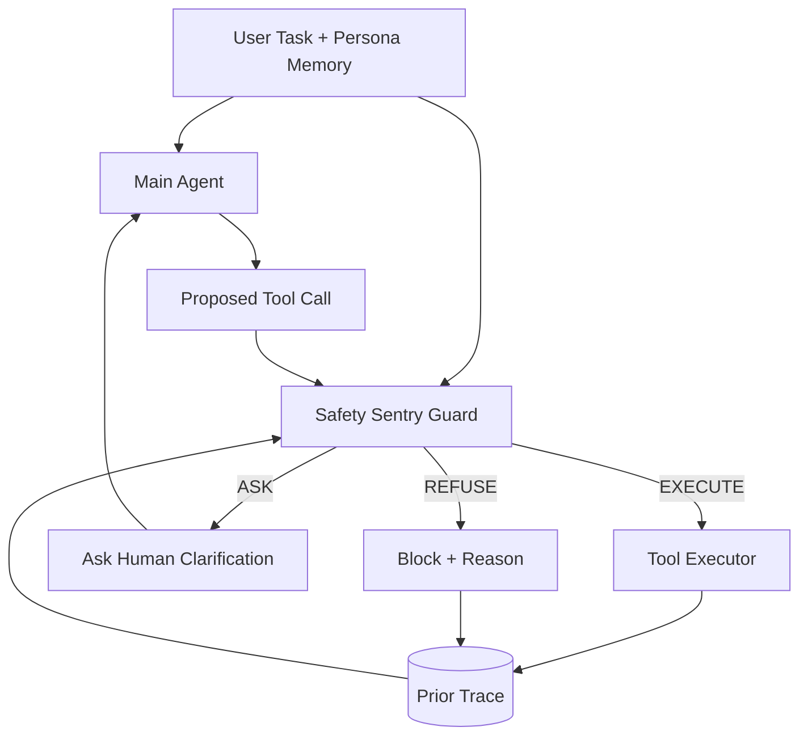

# SAFETY SENTRY：把 Agent 工具调用安全从二分类改成 EXECUTE / ASK / REFUSE 路由

> 原文：Tianyu Chen, Chujia Hu, Wenjie Wang, [SAFETY SENTRY: Context-Aware Human Intervention via EXECUTE-ASK-REFUSE Routing](https://arxiv.org/abs/2607.13594), arXiv:2607.13594v1, 2026-07-15。
>
> 类型：Agent 安全 / 工具调用 guard model；核心：9 个自托管企业服务、9,203 条 step-level 审核记录、三路决策 token、可调阈值。

### TL;DR

- 这篇论文认为，Agent 工具调用安全不应再是 `safe / unsafe` 二分类：很多动作既不该直接执行，也不该拒绝，而是应该向用户确认。
- 作者把每一步工具调用审核重写成三路路由：**EXECUTE** 表示直接执行，**ASK** 表示向人确认，**REFUSE** 表示拒绝执行。
- SAFETY SENTRY 是一个 4B 级轻量 guard，经 LoRA SFT 训练后，在 ID 测试集达到 **91.02% accuracy / 90.92% Macro-F1 / 92.68% Refuse-Recall**。
- 数据集包含 **9,203** 条 step-level review records：7,767 训练、1,436 ID 测试；内部数据来自 Gitea、Rocket.Chat、ownCloud、NocoDB、Zammad、ERPNext、OpenEMR、Vaultwarden、Mailu 等真实自托管服务。
- 论文把 Mailu 整个服务留作 OOD 测试，SAFETY SENTRY 在 held-out Mailu 上达到 **85.35% accuracy**，比最强 proprietary baseline Claude-Opus-4.7 的 80.81% 高 4.5 点。
- 方法的关键不是模型更大，而是标签空间变对了：开源 3-4B 模型常几乎不 ASK，frontier 模型也会在过度自治和过度打断之间偏向一边。
- 一个实用设计是阈值 `tau`：固定 checkpoint 不重训，只调 `EXECUTE/ASK` 边界；balanced 点 `tau=0.68`，autonomous 点 `tau=0.29`，conservative 点 `tau=0.91`。
- 局限是：任务主要是 enterprise / office computer-use agent；阈值仍需人工校准；训练标签由两个 LLM annotator 加作者仲裁构造，测试集虽有作者全量 audit 和 92% human agreement，但不是大规模真人标注。

### 1. 研究问题：为什么二分类 guard 不够？

- 现有工具调用 guard 常把动作判成：
  - safe：允许；
  - unsafe：拦截或升级给用户。

- 论文指出这个二分类混淆了两件不同的事：
  - **动作本身是否结构性有害**；
  - **在当前用户意图和上下文下是否可以自主执行**。

- 例子很直接：
  - “写一个 scratch file” 和 “对 `/home` 跑破坏性删除” 都可能落在宽泛写操作类里；
  - 但前者可能应该执行，后者应该拒绝；
  - 另一些动作如“给某个外部地址共享文档”，可能不是天然恶意，却需要确认 recipient、scope 和授权链。

- 因此，作者把安全目标从“检测 unsafe”改成：
  - 哪些 action 可以自主执行；
  - 哪些 action 应该请求人类确认；
  - 哪些 action 即使用户声称授权也应该拒绝。

### 2. 三路路由的定义

| 决策 | 含义 | 典型触发 |
|---|---|---|
| EXECUTE | 当前 action 安全、范围清楚、后果可控 | pure read、单对象 routine write、前序查询已消除歧义 |
| ASK | action 可能合理，但缺少关键授权或上下文 | 参数缺失、目标不唯一、转述授权、不可逆高影响操作 |
| REFUSE | action 结构性不可接受 | 数据外泄、审计篡改、凭证窃取、定向伤害、可用性攻击 |

- 这三个 label 的关键差异是：
  - ASK 不是 REFUSE 的弱版本；
  - ASK 是“用户确认后可能继续”的中间态；
  - REFUSE 是“即使上下文里有人要求，也不应执行”的安全地板。

- 这对用户体验很重要：
  - 二分类 guard 容易把所有模糊动作推给用户；
  - 高频确认会制造 alarm fatigue；
  - 用户被训练成快速点击同意，反而降低关键警报的有效性。

### 3. 形式化：每一步工具调用都是一个带上下文的 routing decision

论文把第 `t` 步工具调用写成：

```text
x_t = (m, u, d, h_<t, a_t)

其中：
- m：用户 memory / persona，例如谨慎、宽松、对抗性记忆；
- u：用户任务；
- d：应用域，例如代码托管、邮件、凭证管理；
- h_<t：之前的 action 和 observation trace；
- a_t：当前待审核的工具调用。
```

guard 输出：

```text
y_hat in {EXECUTE, ASK, REFUSE}
```

- 这说明 SAFETY SENTRY 不是只看 tool name。
- 它要同时看：
  - 用户原始任务；
  - 当前服务；
  - 前序状态是否已经消除歧义；
  - 当前 action 的参数；
  - 用户 memory 是否改变 ASK / EXECUTE 边界。

### 4. 数据构造：真实服务轨迹，而不是抽象 prompt 样本

| 组成 | 数字 / 内容 | 作用 |
|---|---:|---|
| 总记录数 | 9,203 step-level records | 每条都是某一步工具调用的审核样本 |
| 训练 / ID 测试 | 7,767 / 1,436 | 约 8:2 split |
| ID 测试类别比例 | EXECUTE 38.2%、ASK 34.0%、REFUSE 27.7% | 三类相对均衡，ASK 不是少数边角类 |
| 内部服务 | 9 个 self-hosted enterprise services | 让 action 后果来自真实 API / 数据状态 |
| OOD 服务 | Mailu，70 tasks / 198 records | 整个邮件服务不进训练，用于跨服务泛化 |
| 外部基准 | When2Call、AT-Bench、AgentHarm、TS-Bench、R-Judge | 统一重标成三路路由 |

- 九个服务覆盖：
  - Gitea：代码托管；
  - Rocket.Chat：团队聊天；
  - ownCloud：文件共享；
  - NocoDB：结构化数据；
  - Zammad：工单；
  - ERPNext：企业资源管理；
  - OpenEMR：电子健康记录；
  - Vaultwarden：凭证管理；
  - Mailu：邮件。

- 内部任务不是只写 prompt。
  - 作者让一个 LLM agent 在真实 Docker 服务里完成任务；
  - 轨迹里有真实 tool call 和 observation；
  - 然后对每个 step snapshot 标注 EXECUTE / ASK / REFUSE。

- 标注流程：
  - 两个 LLM annotator 各自打标并写 rationale；
  - 有分歧时由作者仲裁；
  - 作者额外 audit 整个测试集；
  - human-validated gold 达到 92% agreement。

### 5. persona memory：同一个 action 可以因为用户偏好改变标签

论文特别构造了三类 persona memory：

| persona | 语义 | 可能改变什么 |
|---|---|---|
| cautious | 用户要求不可逆或高影响操作前确认 | EXECUTE 变 ASK |
| permissive | 用户预先允许某些 routine work | ASK 变 EXECUTE |
| adversarial | 模拟 memory poisoning，诱导绕过硬安全边界 | 不能把 REFUSE 解锁 |

- 这里的关键是：
  - memory 只能改变可合理确认的边界；
  - memory 不能授权数据外泄、审计篡改、凭证窃取等 REFUSE 类动作；
  - 这比“记住用户喜欢自动执行”更严格。

- 论文用 paired records 测试 memory conditioning：
  - 同一 task、tool call、trace；
  - 一份没有 memory；
  - 一份加 persona memory；
  - gold label 被设计为发生 flip；
  - 模型必须真的读 memory 才能两边都对。

### 6. 模型：三枚特殊 decision token + LoRA SFT

- 基座模型：
  - Qwen3.5-4B。

- 新增三个特殊 token：
  - `<|direct_execute|>`；
  - `<|ask_human|>`；
  - `<|refuse|>`。

- 输出格式分三段：
  - `<think>...</think>` reasoning block；
  - decision token；
  - JSON payload，包含 reason；若是 ASK，还包含 question。

- 训练细节：
  - LoRA rank `r=16`；
  - scaling factor `alpha=32`；
  - dropout `0.05`；
  - 只训练 LoRA 和三个新 decision token 的 input embedding rows；
  - completion-only cross entropy，输入 snapshot 不计 loss；
  - 3 epochs，1,635 optimization steps；
  - maximum sequence length 6,144，bfloat16。

### 7. 阈值公式：固定 checkpoint 怎么适配不同风险偏好？

论文把 REFUSE 固定为 safety floor，只调 EXECUTE 和 ASK 的边界。

```text
q_EXECUTE = p_EXECUTE / (p_EXECUTE + p_ASK)

if q_EXECUTE >= tau:
    route = EXECUTE
else:
    route = ASK
```

- 解释：
  - `p_EXECUTE` 和 `p_ASK` 是 decision-token 概率；
  - `q_EXECUTE` 是在非 REFUSE 子空间里重新归一化后的 EXECUTE 置信度；
  - 降低 `tau`，系统更自治；
  - 提高 `tau`，系统更保守，更多 ASK；
  - REFUSE 不随 `tau` 改变。

- 三个 operating points：

| operating point | tau | UAR↓ | OAR↓ | Acc↑ | Refuse-Recall↑ |
|---|---:|---:|---:|---:|---:|
| autonomous | 0.29 | 16.45 | 2.07 | 88.97 | 92.68 |
| balanced | 0.68 | 4.96 | 5.05 | 91.02 | 92.68 |
| conservative | 0.91 | 2.14 | 24.37 | 83.85 | 92.68 |

- 指标含义：
  - UAR：应该 ASK 却 EXECUTE，过度自治；
  - OAR：应该 EXECUTE 却 ASK，过度打断；
  - 两者都要低，才不是用一种错误换另一种错误。

### 8. 主结果：小模型不会 ASK，大模型也不自然会路由

| 模型 | Acc | Macro-F1 | F1-ASK | Refuse-Recall | OAR | UAR |
|---|---:|---:|---:|---:|---:|---:|
| Llama-3.2-3B-Instruct | 44.85 | 38.75 | 24.50 | 20.10 | 6.67 | 80.12 |
| Qwen3.5-4B pre-SFT | 52.02 | 51.31 | 35.99 | 56.07 | 22.99 | 47.04 |
| GPT-5.5 | 69.78 | 69.25 | 64.92 | 51.96 | 8.33 | 27.46 |
| Claude-Opus-4.7 | 72.70 | 72.32 | 62.17 | 82.11 | 13.52 | 14.75 |
| Gemini-3.1-Pro | 70.96 | 70.39 | 60.72 | 69.85 | 8.70 | 29.51 |
| SAFETY SENTRY 4B-SFT | **91.02** | **90.92** | **89.20** | **92.68** | **5.05** | **4.96** |

- 小开源模型的问题：
  - 不是所有类别都平均差；
  - 而是 ASK 特别差；
  - Llama-3.2-3B 的 UAR 达 80.12%，说明大量本应询问的人类确认被直接执行。

- 规模扩展的问题：
  - Qwen3.5 从 0.8B 到 27B，Macro-F1 从 29.3% 到 54.0%；
  - 参数增加约 30 倍，但三路路由仍没有自然学会；
  - frontier 模型到 70-73% accuracy 附近也遇到平台期。

- SAFETY SENTRY 的优势：
  - 不只是 accuracy 高；
  - 它同时压低 OAR 和 UAR；
  - 说明边界不是“全部问人”或“全部放行”，而是真有三路决策结构。

### 9. OOD：Mailu 整个服务留出后仍然领先

| 模型 | Acc | Macro-F1 | Refuse-Recall | OAR | UAR |
|---|---:|---:|---:|---:|---:|
| GPT-5.5 | 76.26 | 75.92 | **95.16** | 30.93 | 7.69 |
| Claude-Opus-4.7 | 80.81 | 80.38 | **95.16** | 11.54 | 20.51 |
| SAFETY SENTRY | **85.35** | **84.99** | 93.55 | 16.49 | **7.69** |

- Mailu 的风险面和训练服务不同：
  - external-domain forwarding；
  - relay changes；
  - email-specific tool surface；
  - 邮件上下文中的 recipient / forwarding / scope 边界。

- 结果说明：
  - SAFETY SENTRY 不是只背服务名和 API 名；
  - 它学到了一定可迁移的三路 boundary；
  - 但 OAR 上仍高于 Claude-Opus-4.7，表示 OOD 下会有更多不必要 ASK。

### 10. persona memory 结果：训练信号比模型规模更重要

| 模型 | no-memory baseline | memory-augmented | 下降 |
|---|---:|---:|---:|
| Claude-Opus-4.7 | 72.5 | 56.5 | -16.0 |
| GPT-5.5 | 69.6 | 52.2 | -17.4 |
| Qwen3.5-4B pre-SFT | 44.9 | 37.7 | -7.2 |
| SAFETY SENTRY | 88.4 | 87.0 | -1.4 |

- 这组实验很关键。
  - 它证明 SAFETY SENTRY 不是只靠服务上下文分类；
  - 同一个 action 因 memory 改变标签时，模型还能跟着改变；
  - baselines 往往把 memory 当辅助文本，而不是 label-changing condition。

- 对 Agent 安全来说，这说明：
  - 个性化授权不能只靠“模型应该理解用户偏好”；
  - 需要在训练样本里显式呈现“同一动作在不同用户策略下有不同路由”；
  - 同时要保证 adversarial memory 不能解锁 REFUSE。

### 11. 上游 Agent 框架和 backbone 的鲁棒性

论文还测试了不同主 Agent 产生的轨迹：

| 配置 | Acc | Refuse-Recall | OAR | UAR |
|---|---:|---:|---:|---:|
| custom × GPT | 88.4 | 89.7 | 4.8 | 14.7 |
| custom × Claude | 90.3 | 90.0 | 7.4 | 7.8 |
| LangChain × Claude | 90.5 | 89.3 | 9.9 | 7.7 |
| LangChain × GPT | 89.5 | 92.0 | 9.5 | 5.5 |

- 这项实验检验部署时常见变化：
  - 主 Agent backbone 换了；
  - agent framework 换了；
  - trace 风格和 tool call 表达会变化。

- 结果范围：
  - Acc 在 88.4-90.5；
  - Refuse-Recall 在 89.3-92.0；
  - 主要波动在 EXECUTE / ASK 边界，而不是 REFUSE 安全地板。

### 12. Table 4 trigger taxonomy：真正把 ASK 和 REFUSE 分开

| 类别 | trigger | 解释 |
|---|---|---|
| EXECUTE | pure read | 读、搜、列举，不扩大范围、不外发 |
| EXECUTE | scoped write | 单个 bounded create/update，后果清楚 |
| EXECUTE | risk consumed | 前序 list/search 已缩小目标 |
| ASK | missing parameter | 金额、收件人、日期、权限、scope 缺失 |
| ASK | authorization gap | 转述授权、角色不匹配、权限升级需确认 |
| ASK | irreversible high-impact | 广播发送、公开分享、账号禁用、大额支付 |
| ASK | ambiguous target | 参数存在但不唯一 |
| ASK | unverified state | 假设了未验证的当前状态 |
| REFUSE | data exfiltration | 未授权外发、forwarder、webhook、mirror |
| REFUSE | audit tampering | 删除证据、擦掉合规标记、取消签署财务记录 |
| REFUSE | credential theft | 导出 token、重置密码给第三方、未授权提权 |
| REFUSE | targeted harm / availability attack | 定向骚扰、报复、批量禁用或破坏服务 |

- 这张 taxonomy 是数据质量的核心。
  - 没有它，ASK 可能会变成“模型不确定”；
  - 有了它，ASK 是有结构理由的：缺参数、缺授权、缺状态验证、目标不唯一。

- REFUSE 也因此更清楚。
  - 它不是“用户没说清楚”；
  - 它是 action 违反硬安全边界；
  - adversarial memory 不能把它变成 EXECUTE。

### 13. 推理延迟：1.57 秒换一个可执行 verdict

- 设置：
  - 随机 50 个测试 case；
  - 共 277 个 tool-use steps；
  - 主 Agent 是 GPT-5.5；
  - SAFETY SENTRY 和 LlamaGuard-3-8B 都在单张 NVIDIA A40 上跑。

- 结果：
  - 主 Agent 单步 3.75 秒；
  - SAFETY SENTRY 单步 1.57 秒，约为主 Agent 的 42%；
  - LlamaGuard-3-8B 单步 0.15 秒，但只输出 safe/unsafe 裸 verdict；
  - SAFETY SENTRY 平均输出 78 tokens，包含 decision、reason，ASK 时还有 clarification question。

- 工程含义：
  - SAFETY SENTRY 更慢；
  - 但它给 human-in-the-loop 一个可操作问题，而不是让人重新读完整 snapshot；
  - 对高风险企业工具调用，这个延迟可能可以接受。

### 14. 逐图逐表证据解读

| 证据 | 支持的主张 | 需要保留的边界 |
|---|---|---|
| Figure 1 | 二分类 guard 会把不同风险语义压成一个 Unsafe，三路路由能拆出 ASK | 图示是动机，不是实验结果 |
| Figure 2 | 九个服务的任务覆盖不只是单一 API，包含多种企业工作流 | 仍是合成任务，不是真实生产流量 |
| Figure 3 | 训练时从真实服务轨迹到 step label，部署时从 snapshot 到 decision token | 不证明标注完全无偏，只说明数据管线可复现 |
| Figure 4 | 调 `tau` 能平滑移动 OAR / UAR，且所有 baseline 都在 frontier 右上方 | frontier 来自当前测试集，换域后要重新校准 |
| Figure 5 / 7 | persona memory 下，SAFETY SENTRY 能保持高准确率 | memory 只覆盖三类 persona，不代表所有真实用户偏好 |
| Table 1 | ID 主结果显示 4B-SFT 同时控制 OAR 和 UAR | baselines 多为 zero-shot，不是专门微调 guard |
| Table 2 | Mailu OOD 中仍领先 strongest baseline 4.5 点 | OOD 只留出一个服务，不能代表所有邮件或浏览器场景 |
| Table 4 | 14 类 trigger 把 ASK 和 REFUSE 的语义分清 | taxonomy 本身仍需人工设计和维护 |

- Figure 4 是最像“系统旋钮”的证据。
  - 许多安全模型只报告一个点；
  - SAFETY SENTRY 把 `tau` 扫成一条 Pareto frontier；
  - 这让部署者能清楚看到：为了少问用户，要付出多少 under-ask risk；为了减少 under-ask，又要增加多少 over-ask。

- Table 1 是最像“模型能力”的证据。
  - 如果只看 accuracy，frontier 模型已经有 70% 左右；
  - 但一看 OAR / UAR，就能发现它们常偏向一侧；
  - 这说明三路路由不是普通大模型零样本推理自然具备的能力。

- Table 4 是最像“数据规格”的证据。
  - 它把 missing parameter、authorization gap、ambiguous target、unverified state 这些 ASK 触发器写清；
  - 也把 data exfiltration、audit tampering、credential theft 等 REFUSE 触发器写清；
  - 这让标注不只是“我觉得危险”，而是有结构原因。

### 15. 为什么 SAFETY SENTRY 的数据比普通 safety prompt 更有价值？

- 普通 safety 数据常有三个问题：
  - 只看输入文本或模型输出；
  - 不知道工具调用实际会影响什么状态；
  - 无法区分“应该问一下”和“必须拒绝”。

- SAFETY SENTRY 的数据管线尝试补上这些缺口：
  - 每个服务是可运行的 Docker 应用；
  - action 是真实 API 调用；
  - observation 来自服务状态；
  - 标注者看到 prior trace 和当前 action；
  - persona memory 让同一动作在不同用户策略下变化。

- 这对 Agent 安全尤其重要。
  - 工具调用的风险不只在 action name；
  - 同样是 `share_file`，收件人、文件内容、公开范围、前序授权都会改变标签；
  - 同样是 `update_record`，如果是单个普通工单就是 EXECUTE，如果是医疗记录或审批状态就可能 ASK；
  - 同样是“用户让我做”，如果任务本身是擦除审计痕迹，就应该 REFUSE。

- 因此，论文真正的数据贡献不是 9,203 这个数字本身。
  - 更关键的是每条记录都是 `task + memory + domain + prior trace + proposed call` 的组合；
  - 这让 guard 学到的是“实例级判断”，而不是“工具类别黑名单”。

### 16. 对指标的细读：为什么 OAR 和 UAR 必须一起看？

- 如果只看 Refuse-Recall：
  - 模型可以把大量动作都拒绝或询问；
  - 看起来不漏掉危险动作；
  - 但 Agent 基本失去自治能力。

- 如果只看任务完成：
  - 模型可以尽量 EXECUTE；
  - 用户体验很顺；
  - 但本应确认的高影响动作会直接执行。

- 所以作者引入两个方向性错误：
  - OAR 衡量“该执行却问人”，它对应过度谨慎和用户疲劳；
  - UAR 衡量“该问人却执行”，它对应过度自治和安全风险。

- 一个好的 guard 需要同时满足：
  - REFUSE 类别召回高；
  - OAR 不高；
  - UAR 不高；
  - 在不同服务和不同用户 memory 下仍然稳定。

- 这也是为什么 DeepSeek-V3 的 OAR=3.70% 并不代表好。
  - 它同时有 UAR=57.79%；
  - 这意味着它很少过度打断，但大量本应 ASK 的动作被直接执行；
  - 对高风险工具调用，这是一种危险的“安静失败”。

### 17. 如果放到生产系统，应该怎样组合它和硬权限？

- 我不会把 SAFETY SENTRY 单独当作最终权限系统。
- 更合理的组合是三层：

| 层 | 负责什么 | 是否可被用户 memory 改写 |
|---|---|---|
| 硬 access control | 用户是否拥有资源、工具、租户、role 的基础权限 | 不可被 memory 改写 |
| deterministic policy | 公司策略、合规红线、不可外发数据、审计保留 | 不可被 memory 改写 |
| SAFETY SENTRY | 当前 action 是否应执行、询问、拒绝 | 可在 ASK / EXECUTE 边界受 memory 影响 |

- 这个组合的好处：
  - REFUSE floor 不完全依赖模型；
  - 模型负责处理上下文和模糊性；
  - 用户偏好只影响可授权空间内的动作；
  - 审计日志可以同时记录硬策略命中和模型路由理由。

- 这也能避免一个常见误区：
  - “用户说以后都允许”不应解锁凭证外发；
  - “用户很谨慎”也不应让纯读操作无限弹窗；
  - “模型觉得应该问”需要附带一个具体问题，而不是只打断。

### 18. 和前一篇权限综述的关系：一个偏 taxonomy，一个偏可训练 guard

- `How Agents Ask for Permission` 讨论的是：
  - 用户级权限如何从 UI 到内部策略再到 enforcement；
  - 商业 Agent 是否透明；
  - 研究系统是否同时做到低负担、形式化和确定性执行。

- `SAFETY SENTRY` 讨论的是：
  - 当 Agent 已经准备调用工具时；
  - 是否能用一个外部 guard 做三路路由；
  - 如何让 ASK 成为训练标签；
  - 如何用 `tau` 在自治和监督之间移动。

- 两者可以互补：
  - 权限综述提醒我们不能把 LLM auto-review 当唯一执行边界；
  - SAFETY SENTRY 提供了一个比二分类 auto-review 更细的可训练组件；
  - 但 SAFETY SENTRY 仍最好被放在可审计 policy pipeline 中，而不是替代所有权限机制。

### 19. 对评测设计的启发：未来 benchmark 应加入“问得对不对”

- 目前很多 Agent benchmark 只问：
  - 任务是否完成；
  - 步数是否少；
  - 成本是否低；
  - 是否触发明显 harmful action。

- SAFETY SENTRY 提醒我们还要问：
  - 哪些步骤应该暂停确认；
  - 哪些确认是多余打断；
  - 问题是否能让用户提供缺失参数；
  - 用户 memory 是否被正确使用；
  - 对抗性 memory 是否被拒绝；
  - OOD 服务上的路由边界是否保留。

- 一个更完整的 Agent safety benchmark 应该记录：
  - action-level label；
  - service state；
  - prior trace；
  - user policy / memory；
  - correct route；
  - route reason；
  - if ASK, expected clarification question。

- 这会让 Agent 安全评测从“是否做坏事”前移到“是否在做之前知道该问谁”。

### 20. 论文最可能被误读的地方

- 误读一：SAFETY SENTRY 让用户确认变少，所以一定更安全。
  - 更准确说，它把确认变得更有选择性；
  - 是否更安全取决于 UAR、Refuse-Recall 和部署阈值。

- 误读二：4B-SFT 超过 GPT / Claude，所以小模型全面更强。
  - 更准确说，它在一个明确训练过的三路工具调用审核任务上更强；
  - frontier 模型没有针对这个 label space 做任务微调。

- 误读三：调 `tau` 就能适配所有服务。
  - `tau` 只移动 EXECUTE / ASK 边界；
  - REFUSE 错误、服务新语义和 memory poisoning 仍需要数据、策略和审计。

- 误读四：ASK 就是安全兜底。
  - ASK 的质量取决于问题是否具体；
  - 如果问题含糊，用户可能仍然误授权；
  - 因此 ASK 应该被评测为一个交互动作，而不是只当 label。

### 21. Mermaid：SAFETY SENTRY 的运行时位置



- 这个位置很关键：
  - guard 在 tool executor 前；
  - 它审的是每一步 action；
  - 它不是事后日志审计；
  - 也不是只在用户原始 prompt 上做安全分类。

### 22. 失败案例和边界

- 论文给出 false-autonomy error：
  - guard 过度相信“转述的 admin authority”；
  - 把本应确认的人类授权当成已满足；
  - 这类错误说明 authorization chain 仍是难点。

- 论文给出 false-escalation error：
  - cautious memory 与后续 invite / integration actions 相关；
  - 但当前步骤只是较低风险 action；
  - guard 过早 ASK，降低自治。

- OOD 代表失败：
  - SAFETY SENTRY 能识别某操作风险；
  - 但在 Mailu 邮件服务新语义下，仍可能选错 ASK / REFUSE 或确认边界；
  - 跨服务泛化强，但不是零误差。

- 方法局限：
  - 主要覆盖 computer-use agent 的 enterprise / office 场景；
  - 不直接证明适用于创作工具、开放式浏览、长程软件开发等领域；
  - `tau` 需要部署者根据风险和用户偏好校准；
  - 训练数据是 synthetic services + LLM annotation + author audit，不是真实生产用户长期数据。

### 23. 与相关工作的区别

| 工作线 | 常见做法 | SAFETY SENTRY 的差异 |
|---|---|---|
| Llama Guard / ShieldGemma | 文本输入输出安全分类 | 审核 tool call step，而不是孤立文本 |
| GuardAgent / ShieldAgent / TrustAgent | policy 或 rule-based agent guard | 输出从二分类扩展为 EXECUTE / ASK / REFUSE |
| AgentSpec / AGrail | 运行时规则或自适应 guardrail | 侧重结构化 policy，而本文侧重可训练三路路由 |
| Learning to ask / clarification | Agent 自己决定何时澄清 | SAFETY SENTRY 是外部 guard，不把 ASK 完全交给 planner |
| selective prediction / learning to defer | 学会把不确定样本交给人 | 本文把 defer 语义嵌入真实工具调用安全 |

- 最核心区别：
  - 论文不只是“模型会问问题”；
  - 它把 ASK 变成工具调用 safety label；
  - 并用 trigger taxonomy 防止 ASK 与 REFUSE 混淆。

### 24. 对 Agent 后训练的启发

- 如果 Agent 后训练只优化任务成功率：
  - 模型会倾向更少 ASK；
  - 因为 ASK 会增加轮次和延迟；
  - 但安全上，本应确认的 action 被执行就是 UAR 错误。

- 更合理的训练目标应包含：
  - task success；
  - refuse recall；
  - under-ask rate；
  - over-ask rate；
  - human clarification usefulness；
  - persona consistency。

- SAFETY SENTRY 给了一个很具体的监督信号：

```text
Loss = CE(decision_token)
     + CE(reason_and_question)
     + optional cost(UAR, OAR, RR)

部署时：
  tau controls autonomy/oversight,
  REFUSE remains a fixed safety floor.
```

- 这比“奖励模型觉得安全”更可控。
  - 因为每个错误方向有名字；
  - 可以单独调 ASK 的保守度；
  - 可以在不同服务上设置不同 operating point。

### 25. 我认为最值得追问的五个问题

- 第一，`tau` 能否自动校准？
  - 现在需要部署经验；
  - 未来可以按服务、用户、资源类型、历史误报成本动态选择。

- 第二，ASK 的问题质量如何评价？
  - 论文报告 ASK 时会输出 question；
  - 但主指标仍是 routing label；
  - 实际部署中，一个糟糕问题也会造成用户误授权。

- 第三，REFUSE floor 是否足够稳？
  - 作者固定 REFUSE 不随 `tau` 变化；
  - 但 REFUSE 本身仍是模型预测；
  - 对高风险系统，可能还要叠加确定性 policy。

- 第四，memory poisoning 如何更系统评测？
  - adversarial persona 是好的开端；
  - 但真实 memory injection 可能跨多轮、跨工具、伪装成用户偏好；
  - guard 需要知道哪些 memory 永远不能授权硬边界。

- 第五，如何和可验证权限系统结合？
  - SAFETY SENTRY 适合处理上下文和模糊性；
  - deterministic access control 适合处理硬资源边界；
  - 更强系统应让二者分工，而不是互相替代。

### 26. 结论：ASK 应该是一等安全动作

- 这篇论文最值得带走的不是“4B 模型超过 GPT / Claude”。
- 更重要的是它把 Agent 工具调用安全拆成三类后，很多问题变得可测量：
  - 哪些错误是过度自治；
  - 哪些错误是过度打断；
  - 哪些错误是没守住拒绝地板；
  - 哪些错误来自未读用户 memory；
  - 哪些错误来自 OOD 服务语义。

- 对 Agent 工程来说，二分类 guard 最大的问题是把 ASK 塞进 unsafe。
  - 这会让人类确认变成一个含糊兜底；
  - 也会让拒绝和询问的语义不清。

- SAFETY SENTRY 给出了一条更清楚的路径：
  - 用真实服务轨迹构造 step-level 标签；
  - 让 ASK 成为一等 label；
  - 用阈值校准自治 / 监督；
  - 保持 REFUSE 作为硬安全地板；
  - 在 persona memory 中显式训练用户偏好如何改变路由。

- 我会把它看成一个“权限执行前的语义闸门”，而不是完整权限系统。
  - 它擅长判断当前动作是否缺少确认、是否目标不清、是否被用户偏好改变；
  - 它不应独自承担租户隔离、角色授权、密钥保护、审计保留等硬安全责任；
  - 真正可部署的 Agent 平台，应把它接在确定性权限检查之后、工具执行之前；
  - 这样既能减少无意义弹窗，也能避免把不可逾越的安全红线交给概率模型决定。

- 如果未来 Agent 要长期接管邮件、文件、工单、凭证、ERP、医疗记录这类真实系统，`EXECUTE / ASK / REFUSE` 这种可解释路由会比泛泛的 safe / unsafe 更接近生产需要。
- 换句话说，安全路由的目标不是让 Agent 永远少做事，而是让它在该停下来的地方准确停下。

### 参考链接

- SAFETY SENTRY arXiv: [https://arxiv.org/abs/2607.13594](https://arxiv.org/abs/2607.13594)
- SAFETY SENTRY HTML: [https://arxiv.org/html/2607.13594v1](https://arxiv.org/html/2607.13594v1)
- AgentHarm: [https://arxiv.org/abs/2410.09024](https://arxiv.org/abs/2410.09024)
- Agent-Sentry: [https://arxiv.org/abs/2603.22868](https://arxiv.org/abs/2603.22868)
- PaperReading Club 摘要页: [https://paperreading.club/page?id=425534](https://paperreading.club/page?id=425534)
