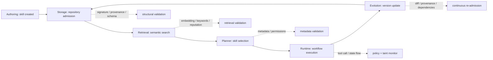

# Agent Skill Security：把 Agent 技能安全从“运行时防护”推进到完整生命周期

| 项目 | 内容 |
| --- | --- |
| 论文 | Agent Skill Security: Threat Models, Attacks, Defenses, and Evaluation |
| 作者 | Sanket Badhe, Priyanka Tiwari |
| 日期 | 2026-07-15 arXiv v1；论文首页标注 cs.CR |
| 原文 | https://arxiv.org/abs/2607.13987 |
| PDF | https://arxiv.org/pdf/2607.13987 |
| 类型 | AI 安全 / Agent Skill / 供应链安全 / 可复用 Agent 能力评测 |

### TL;DR

- **这篇论文研究什么**：作者把 LLM Agent 里的可复用技能视为一种新型安全边界。技能不只是 prompt 片段，也可能包含自然语言说明、权限声明、工作流、工具调用、版本与来源信息。论文的问题是：当这些技能被发布、检索、选择、执行和更新时，安全风险是否只发生在执行阶段？
- **核心方法**：论文提出 **SkillSec-Eval**，把技能生命周期拆成 repository admission、semantic retrieval、planner selection、runtime execution、skill evolution 五个受管阶段，并为每个阶段定义攻击、信任假设、指标和防御组件。
- **实验基础**：作者构造了 **327 个真实世界技能**组成的企业级技能仓库，覆盖 15 类能力。仓库设计成语义密集环境，用来模拟检索碰撞、相似技能竞争、恶意更新和权限欺骗等场景。
- **关键数字**：语义检索中，未防御 Sybil attack 的 Top-5 攻击成功率为 **93.20%**，平均每个 Top-5 有 **2.84** 个恶意克隆；防御后 Sybil 平均恶意工具降到 **0.27**，但 defended ASR 仍有 **26.59%**。Planner 侧，Fake Recommendation 从 **45.64%** 降到 **8.72%**；Misleading Description 从 **27.27%** 降到 **0.00%**。运行时，baseline execution ASR 为 **100.0%**，策略拦截后仍有 **23.0%** ASR，taint accuracy 只有 **66.67%**。技能演化防御的恶意检测率 **92.5%**，但误报率 **37.0%**。
- **最重要的结论**：技能安全不能只靠 prompt injection 检测，也不能只靠运行时沙箱。很多攻击在技能进入仓库、被向量检索推到 Top-5、被 planner 误信、或通过更新继承旧信任时已经成立；后续阶段只能部分补救。
- **局限**：论文是受控评测而非生产系统审计。327 个技能虽来自真实技能类别，但不是完整线上 marketplace；实验使用固定提示、固定指标和若干代表性攻击，不能证明所有技能生态都可由同一套阈值防住。特别是 LLM 内部上下文造成的语义信息流仍是开放问题。

### 1. 研究问题：为什么技能让 Agent 安全边界变复杂？

过去讨论 Agent 安全时，常见边界是：

- 用户输入有没有 prompt injection；
- 工具调用有没有越权；
- 模型输出有没有泄露秘密；
- 沙箱有没有挡住危险命令。

这篇论文把视角前移到 **skill ecosystem**：

| 对象 | 传统工具 | 可复用 Agent 技能 |
| --- | --- | --- |
| 暴露内容 | 函数名、参数、API schema | 自然语言描述、示例、工作流、权限、工具链、版本 |
| Agent 如何使用 | planner 选择一个工具调用 | 先检索技能，再读 metadata，再组合 workflow |
| 攻击面 | 参数注入、越权调用、返回值污染 | 仓库投毒、语义 SEO、planner 欺骗、工作流组合、恶意更新 |
| 常规防御 | allowlist、schema、沙箱、审计日志 | 还需要来源验证、语义一致性、检索过滤、更新再验证 |

作者的关键判断是：

- 技能同时影响 **语义推理** 与 **可执行行为**；
- 技能的描述、权限和实现可能由不同人维护；
- 技能会被检索系统排序、被 planner 信任、被 runtime 执行；
- 技能还会在发布后更新，因此旧版本积累的信任可能被新版本继承。

因此，攻击者不必等到运行时才动手：

- 在仓库阶段，可以把恶意技能伪装成正常能力；
- 在检索阶段，可以通过关键词、embedding 或 Sybil 克隆进入 Top-5；
- 在 planner 阶段，可以用“官方”“推荐”“低权限”等描述骗取选择；
- 在执行阶段，可以让多个看似无害的技能组合出危险数据流；
- 在演化阶段，可以让新版本悄悄增加网络、shell 或外部依赖。

### 2. 论文主张与论证路线

| Claim | Mechanism | Evidence | Boundary |
| --- | --- | --- | --- |
| 技能安全不是单点 prompt injection 问题 | 把技能生命周期拆成五个受管边界 | taxonomy 覆盖 admission、retrieval、planner、execution、evolution | 论文不研究底层模型 jailbreak 或恶意微调 |
| 传统供应链防御不够 | 代码签名只能证明包没被篡改，不能证明自然语言描述真实 | 论文把 semantic metadata 和 executable workflow 分离建模 | 仍需要传统 SBOM/SLSA/Sigstore 一类来源机制 |
| 检索层是独立攻击面 | 攻击者可用关键词填充、语义伪装、Sybil 发布挤进候选集 | Sybil baseline Top-5 ASR 93.20%，平均恶意克隆 2.84 | 过滤后仍有 26.59% defended ASR，不能单独依赖检索防线 |
| planner 容易被 metadata 说服 | planner 看不到完整执行体，主要依赖描述和权限声明 | Fake Recommendation baseline 45.64%，防御后 8.72% | planner 防御依赖 metadata 预处理，无法替代 runtime 观测 |
| runtime 是 backstop 但不是完整答案 | 策略检查和 taint tracking 可拦工具调用 | policy blocked 87.0%，execution ASR 从 100.0% 降到 23.0% | LLM paraphrase 会破坏字符串 taint，隐式信息流仍难测 |
| 更新必须重新 admission | 新版本可能继承旧版本信任后加入恶意 payload | evolution defense MDR 92.5%，FNR 7.5% | 误报率 37.0%，会带来维护者摩擦 |

### 3. 技能形式化：`S = (M, W, P, T, V)`

论文把技能写成：

```text
S = (M, W, P, T, V)
```

变量含义：

- `M`：semantic metadata，包括名称、描述、标签、示例用法；
- `W`：workflow，描述技能具体如何完成任务；
- `P`：permissions，声明需要的文件、网络、shell、数据库或外部服务权限；
- `T`：tools，技能实际调用的底层工具或服务；
- `V`：version/provenance，版本、来源、签名、依赖、维护者信息。

这个形式化有两个作用：

1. **让攻击面可定位**：如果 `M` 说“只读本地文件”，但 `W` 调用网络上传工具，问题发生在 metadata 和 workflow 的一致性边界。
2. **让防御可拆分**：结构校验、语义校验、权限校验、runtime monitor 和 update validation 可以分别作用于不同分量。

一个更直观的数据流如下：



### 4. 威胁 taxonomy：每一层的信任假设是什么？

论文最有价值的部分不是某个单点指标，而是把每个生命周期阶段的 **信任假设** 写清楚。

| 生命周期阶段 | 系统默认相信什么 | 代表攻击 | 代表防御 |
| --- | --- | --- | --- |
| Authoring | 技能说明准确反映真实能力和权限 | 隐藏指令、欺骗性描述、metadata poisoning、权限膨胀 | 静态技能验证、metadata 一致性分析、policy linting |
| Storage | 仓库内容真实、未篡改、发布者可信 | 未授权插入、来源伪造、metadata 篡改、依赖投毒、版本回滚 | 签名、provenance、完整性校验、依赖验证 |
| Retrieval | 检索到的技能既相关又可信 | embedding poisoning、keyword stuffing、retrieval collision、Sybil publication | trust-aware retrieval、reputation reranking、retrieval filtering |
| Selection | planner 选择的技能描述和真实行为一致 | fake recommendation、misleading description、permission deception、prompt injection | metadata verification、capability validation、permission consistency |
| Execution | 工作流只执行授权操作，不能滥用中间状态 | unsafe composition、privilege escalation、unauthorized invocation、data exfiltration | runtime monitoring、taint tracking、least privilege、policy checking |
| Evolution | 更新后仍保持行为、完整性与信任 | permission escalation、instruction injection、tool substitution、dependency compromise | update validation、behavioral consistency、provenance verification |

这张表的含义是：

- 每一层都能产生攻击；
- 每一层都需要自己的观测信号；
- 后一层不能天然修复前一层传下来的错误信任。

举例说：

- 如果恶意技能已经通过 Sybil 克隆进入 Top-5，planner 的输入集合已经被污染；
- 如果 planner 因“官方推荐”字样选中恶意技能，runtime monitor 只能看到后续调用，无法知道选择过程是否被操纵；
- 如果更新后的技能把无害工具替换成高权限工具，初始 admission 的结论已经过期。

### 5. SkillSec-Eval 框架：五个组件如何对应生命周期？

SkillSec-Eval 从仓库边界开始，因为 authoring 发生在受管系统外部。它包含五个 operational components：

| 组件 | 输入 | 主要检查 | 输出 |
| --- | --- | --- | --- |
| Repository Admission | 新提交技能 | schema、签名、完整性、来源、依赖、描述-实现一致性、权限合理性 | 接受或拒绝技能 |
| Semantic Retrieval | 用户请求、技能仓库 | 语义相似度、多样性、metadata 一致性、权限披露 | Top-k 候选技能 |
| LLM Planner | 用户请求、Top-k metadata | 选择是否合理、描述是否欺骗、权限是否一致 | 单个技能或 null |
| Runtime Execution | 工作流、工具调用、中间状态 | 策略检查、taint propagation、危险 sink 拦截 | 允许、拦截或告警 |
| Skill Evolution | 新版本、旧版本、来源信息 | 版本来源、依赖变化、语义行为漂移、权限变化 | 更新接受、拒绝或人工复核 |

作者特别强调：

- skill manifest 要把 structural metadata、semantic metadata、permission manifest、behavior definition 分开；
- 检索和 planner 只能看到技能的一部分视图；
- 因为不同阶段看到的字段不同，攻击者可以利用“可见描述”和“实际行为”之间的缝隙。

### 6. 实验设置：327 个技能与 15 类能力

论文附录给出了 benign skill 仓库分布。327 个技能覆盖 15 个能力类别：

| 类别 | 技能数 | 安全含义 |
| --- | ---: | --- |
| CRM & Business Workflow Automation | 25 | 企业流程里最容易出现跨系统操作 |
| Identity & Access Management | 24 | 权限、凭证、身份边界敏感 |
| Container Security & Vulnerability Analysis | 23 | 容器扫描和安全动作容易触发高权限工具 |
| Container Orchestration | 23 | Kubernetes/编排类技能天然接触生产资源 |
| Cloud Cost Management | 22 | 云账号、账单、资源变更有治理风险 |
| Data Engineering (ETL) | 22 | 数据搬运可能引发隐私和外泄 |
| Developer Productivity & Configuration | 22 | 配置修改、脚本执行、仓库写入都需审计 |
| Privacy & Data Sanitization | 22 | 本身是防御技能，也可能被伪装利用 |
| Code Security Analysis | 22 | 安全扫描结果和修复建议可被操纵 |
| Database Optimization | 21 | 连接串、查询、索引和权限操作敏感 |
| Infrastructure Monitoring | 21 | 观测数据可泄露系统拓扑 |
| Project Management & Collaboration | 20 | 工单、邮件、协作工具包含组织信息 |
| Code Quality & Linting | 20 | 看似低风险，但可带入任意仓库内容 |
| Content Analysis | 20 | 处理外部内容时容易遇到间接注入 |
| Issue Tracking & Ticket Management | 20 | 连接真实业务流程，输出可能触发后续动作 |

这个设置的关键不是“技能很多”，而是 **语义邻近**：

- 同一类别里有多个能力相似的技能；
- 检索时恶意技能可以伪装成正常候选；
- planner 需要在相似候选中做选择；
- 防御不能只靠“这个技能名字看起来相关”。

### 7. 检索实验：Agentic SEO 为什么危险？

语义检索阶段的攻击目标是进入 planner 的上下文。论文使用三类关键指标：

```text
ASR = 至少一个恶意技能进入 Top-5 的查询比例
nDCG@5 = 恶意技能在 Top-5 中的排名质量
Average Malicious in Top-5 = 每个 Top-5 平均包含多少恶意技能
```

论文报告的核心现象：

- 未防御时，Sybil attack 的 ASR 达 **93.20%**；
- 未防御时，平均每个 Top-5 有 **2.84** 个恶意克隆；
- 加入 retrieval validation 后，keyword stuffing 和 semantic camouflage 的 ASR 降到 10% 以下；
- Sybil 的平均恶意工具数降到 **0.27**；
- 但 Trigger Poisoning 和 Sybil 仍分别有 **17.50%** 与 **26.59%** defended ASR。

这说明检索层防御有两个边界：

1. **它能清理显式不一致**：例如说明和权限不匹配、危险操作未披露、重复克隆过密。
2. **它很难保证零攻击面**：embedding 空间本身有密度和邻近问题，攻击者可以通过语义相似性压进候选集合。

### 8. Planner 实验：metadata 比 prompt injection 更会骗 planner

Planner 阶段的设定是：

- planner 接收用户请求；
- planner 看到 Top-5 候选技能及自然语言 metadata；
- planner 不能直接看到完整 workflow；
- planner 需要返回一个 selected skill 或 null。

论文的结果很有启发：

| 攻击 | Baseline Planner ASR | Metadata Validation 后 |
| --- | ---: | ---: |
| Fake Recommendation | 45.64 | 8.72 |
| Misleading Description | 27.27 | 0.00 |
| Permission Deception | 11.36 | 5.68 |
| Planner Deception | 9.88 | 2.47 |
| Prompt Injection | 4.69 | 3.65 |

这里最值得注意的是：

- 最高风险不是传统意义上的 prompt injection；
- “Official Skill”“recommended”“trusted”等社会证明式 metadata 更能影响选择；
- 误导性描述比直接 prompt override 更有效；
- metadata validation 能大幅降低风险，但 prompt injection 一项的改善有限，因为 baseline 本来就低。

这对 Agent 系统设计有直接含义：

- planner 的输入不应直接使用未净化的 marketplace 文案；
- “下载量”“官方”“推荐”“高评分”必须有可验证来源；
- 权限声明应由 manifest 和静态分析生成，而不是由作者自然语言自报；
- planner 的候选集应该附带可机读信任证据，而不是营销描述。

### 9. Runtime 实验：为什么 taint tracking 仍挡不住 LLM 隐式流？

运行时实验评估三类攻击：

- 未授权工具调用；
- 信息流违规；
- 多步骤工作流不安全组合。

论文报告：

| 配置 | Execution ASR | Policy Blocked | Taint Accuracy |
| --- | ---: | ---: | ---: |
| Baseline | 100.0 | NA | NA |
| Proposed Defense | 23.0 | 87.0 | 66.67 |

这组数字说明：

- 没有 runtime monitor 时，攻击全部到达 privileged sink；
- 每次工具调用前做策略检查能拦截多数越权动作；
- 但 taint accuracy 只有 66.67%，导致仍有 23.0% execution ASR。

关键失败原因是 LLM 的中间语义变换：

- 传统 taint tracking 常依赖字符串、对象或字段传播；
- LLM 可以把敏感信息概括、改写、摘要、翻译；
- 改写后的文本不再携带原始 taint tag；
- 但语义上仍然泄露了受保护信息。

因此，Agent runtime 不能只把 taint 当作字节级或字符串级标记。更合理的方向是：

- 对敏感实体做语义级跟踪；
- 对 tool output 到 model context 的注入做审计；
- 对 model-generated argument 进行策略解释；
- 对跨工具数据流保留 provenance graph。

### 10. Evolution 实验：旧信任如何被新版本滥用？

技能演化阶段的攻击更接近软件供应链：

- 后续版本请求更多权限；
- 在说明不变的情况下加入隐藏指令；
- 把无害工具替换成高权限工具；
- 引入被污染的第三方依赖；
- 冒用或劫持发布者身份。

论文的防御是把每次更新都当成一次新的 admission：

| 指标 | 含义 | 结果 |
| --- | --- | ---: |
| UAR | benign update acceptance rate | 63.0% |
| MDR | malicious detection rate | 92.5% |
| FPR | benign update 被误报比例 | 37.0% |
| FNR | malicious update 漏报比例 | 7.5% |

这里的 trade-off 很真实：

- 如果阈值太松，恶意更新会继承旧版本信任；
- 如果阈值太紧，正常重构和功能扩展会被拦下；
- 语义一致性阈值能发现大变化，但细微 instruction injection 可能藏在距离阈值以下。

这意味着生产系统需要的不只是自动拒绝：

- 高风险权限变化应进入人工复核；
- 低风险文档更新可自动通过；
- 行为定义、权限、依赖、publisher identity 的变化应分级；
- 旧版本信任应该随时间衰减，而不是永久继承。

### 11. 可复现性与 prompts：论文公开了哪些评测细节？

论文附录公开了 LLM 组件的提示模板，并说明实验使用 deterministic decoding，temperature 设为 0。两个关键 prompt 对应：

- repository admission validator：判断技能是 safe 还是 malicious；
- planner prompt：给定用户请求和候选技能，选择一个技能或返回 null。

这很重要，因为 SkillSec-Eval 的部分防御依赖 LLM 作为验证器：

- 如果 prompt 不公开，结果很难复现；
- 如果 temperature 不固定，攻击成功率会有额外方差；
- 如果 candidate skill 表示不一致，planner ASR 会受格式影响。

但可复现性仍有缺口：

- 论文没有在 arXiv 页面直接给出完整代码仓库；
- 327 个技能的原始清单、攻击样本和评测脚本是否会公开，需要后续确认；
- LLM validator 的模型版本、供应商策略更新、上下文长度限制会影响复现实验；
- 真实 marketplace 的技能格式比论文抽象更杂，迁移需要适配层。

### 12. 与相关工作的位置：这篇论文补的是哪块空白？

| 方向 | 代表问题 | 这篇论文的关系 |
| --- | --- | --- |
| Prompt injection / jailbreak | 用户输入或外部内容诱导模型违背指令 | 论文认为它只是 skill lifecycle 的一类局部攻击 |
| AgentDojo 类动态 benchmark | 工具输出里的间接注入如何影响 Agent | SkillSec-Eval 更关注技能仓库、检索、planner 和演化 |
| 软件供应链安全 | 包来源、签名、依赖、SBOM、SLSA | 论文继承 provenance 思路，但强调 semantic metadata 不能靠签名解决 |
| Agent skill eval 工程实践 | 技能是否真的改善行为、是否回归 | OpenAI、Langfuse、StackHawk 等文章都强调 eval harness；本文把问题推进到安全攻击评测 |
| Agent skill 安全指南 | 如何管理技能权限和访问控制 | Red Hat 等工程文章关注控制面；本文给出跨生命周期 taxonomy 和实验指标 |

一个简单判断是：

- 如果你关心“技能有没有让 Agent 更会做事”，看 eval harness；
- 如果你关心“技能会不会把 Agent 带到危险行为”，这篇论文提供了安全评测骨架；
- 如果你关心“技能 marketplace 能不能上线”，还需要把这两类 eval 与来源治理、权限系统、审计日志合并。

### 13. 从系统设计看，SkillSec-Eval 应该落到哪些控制点？

把论文机制翻译成工程控制面，可以得到一条更具体的防线：

```text
Input:
  skill_manifest = {metadata, workflow, permissions, tools, provenance, version}
  user_query
  repository_state
  runtime_policy

State:
  trust_score[skill_id]
  provenance_graph
  semantic_clusters
  permission_history
  execution_trace

Loop:
  1. On admission:
       verify schema/signature/provenance/dependencies
       compare metadata with workflow and permissions
       reject or assign initial trust_score

  2. On retrieval:
       retrieve candidates by relevance
       remove near-duplicate Sybil clusters
       rerank by trust and permission compatibility

  3. Before planning:
       normalize metadata
       strip unverifiable recommendation claims
       attach machine-readable permission evidence

  4. During execution:
       check every tool call against runtime_policy
       propagate provenance and semantic taint
       stop privileged sinks when explanation is insufficient

  5. On update:
       treat update as new admission
       compare behavior, permissions, tools, dependencies
       route high-risk deltas to manual review

Output:
  selected_skill or null
  audit_log
  blocked_reason
  updated trust_score
```

这个伪代码强调：

- skill security 是一个持续控制循环；
- 每一步都要留下可审计证据；
- planner 不应该独自承担安全判断；
- 更新和执行同样重要。

### 14. 证据边界：哪些结论可以相信，哪些还不能外推？

可以较有信心带走的结论：

- 技能安全风险确实跨越多个生命周期阶段；
- 检索污染会在 planner 前发生，不能只看最终工具调用；
- metadata validation 对 fake recommendation 和 misleading description 很有效；
- runtime monitor 是必要 backstop，但无法完整解决 LLM 语义改写造成的信息流问题；
- 更新再验证是必须项，否则旧信任会被恶意新版本继承。

需要谨慎的部分：

- 327 个技能是受控仓库，不等于所有生产技能市场；
- 实验攻击是代表性类别，不是完整攻击枚举；
- LLM validator 的效果可能随模型和提示改变；
- 论文没有证明某个单一防御足以部署；
- 高 FPR 的 evolution defense 说明真实团队需要工作流设计，而不是只追求检测率。

### 15. 领域延伸：Agent 技能生态下一步该怎么研究？

这篇论文对 AI 安全和 Agent 系统有三个直接启发。

**第一，技能需要“可机读安全契约”。**

- 仅靠自然语言 `SKILL.md` 或 README 不够；
- 权限、工具、数据访问、外部服务、更新策略应结构化；
- planner 看到的描述应由契约派生，而不是由作者任意营销。

**第二，检索系统需要安全指标。**

- Agent skill retrieval 不只是 relevance ranking；
- Top-k 应该同时优化相关性、信任、权限最小化、多样性；
- “恶意技能是否进入 planner 上下文”本身就是安全指标。

**第三，Agent runtime 需要语义信息流研究。**

- 传统 taint tracking 对 LLM 改写不够；
- 需要把敏感概念、实体、来源和工具输出关联起来；
- 未来的防御可能结合 provenance graph、semantic similarity、policy explanation 和可回放 execution trace。

最终，SkillSec-Eval 的价值不在于宣称解决了技能安全，而在于把问题从一句“防 prompt injection”变成了可拆分、可测量、可审计的生命周期问题。对正在构建 Agent 技能库、插件市场、企业内部自动化能力仓库的团队来说，这个转向比任何单个防御数字都更重要。

### 参考链接

- arXiv 论文页：https://arxiv.org/abs/2607.13987
- arXiv PDF：https://arxiv.org/pdf/2607.13987
- OpenAI Developers：Testing Agent Skills Systematically with Evals：https://developers.openai.com/blog/eval-skills
- StackHawk：Eval Harness for Agent Skills：https://www.stackhawk.com/blog/eval-harness-agent-skills/
- Red Hat Developer：Agent Skills security threats and controls：https://developers.redhat.com/articles/2026/03/10/agent-skills-explore-security-threats-and-controls
