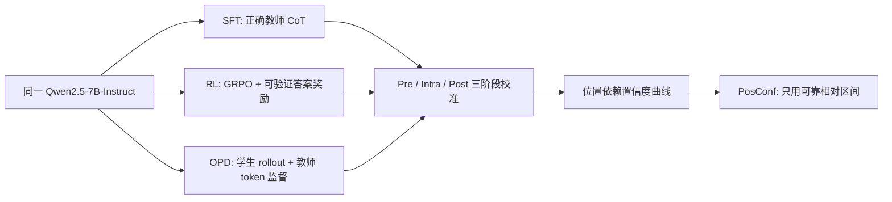
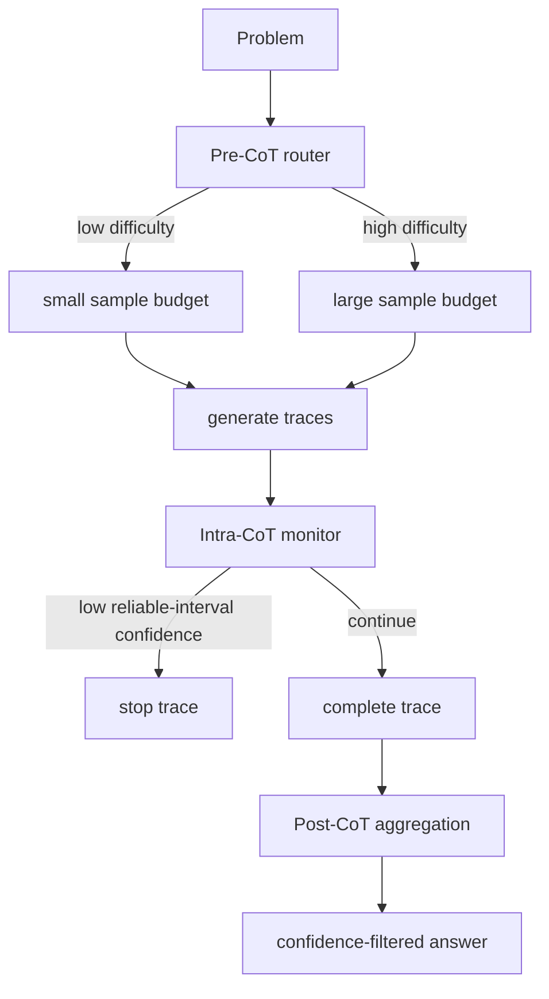

# Post-Training Shifts Confidence：后训练怎样移动推理模型的“可信位置”

## 元信息

| 字段 | 内容 |
|---|---|
| 论文 | Post-Training Shifts Confidence: A Three-Stage Analysis of How SFT, RL, and OPD Shape Pre-, Intra-, and Post-CoT Calibration |
| 链接 | https://arxiv.org/abs/2607.13753 |
| 版本 | arXiv:2607.13753v1，2026-07-15 提交 |
| 方向 | 大模型后训练、推理模型校准、测试时计算 |
| 作者 | Shuhao Li, Guodong Du, Anhao Zhao, Wanyu Lin, Tianyu Yuan, Xiaoyu Shen |
| 代码 | https://github.com/EIT-NLP/Post-Training-Calibration |

## TL;DR

- 这篇论文问的不是“哪种后训练让数学题准确率最高”，而是：SFT、RL、OPD 会把推理模型的置信度校准能力移动到 CoT 的哪个阶段。
- 作者提出三阶段框架：Pre-CoT 用生成前置信度估计题目难度，Intra-CoT 用生成中置信度做早停，Post-CoT 用完整轨迹置信度做多样本答案聚合。
- 控制变量是同一个 Qwen2.5-7B-Instruct 骨干、同一 DeepScaler 和 SimpleRL 混合数据，分别训练 Qwen-SFT、Qwen-RL、Qwen-OPD，再在 AIME 2024、AIME 2025、AMC 2023、MATH500 上测。
- 关键结论很具体：OPD 的 Pre-CoT 平均 AUROC 最高，为 0.644，平均 PRR 为 0.345；SFT 在 Intra-CoT 早停最稳定，例如 AIME 2024 从全预算 18.84 提升到 30% token 预算下 26.90；RL 在 Post-CoT 聚合最有用，PosConf 让 RL 聚合相对 majority voting 平均提升 6.1 点。
- 论文最值得带走的判断是：置信度不是模型全局属性，而是“训练目标 x 推理阶段 x 相对 token 位置”的交互信号；OPD 早期有用但后期可能反向校准，RL 早期不可靠但路径承诺后变得可用。
- 局限同样清楚：实验集中在数学推理、7B 级 Qwen 系列和内部 token 置信度；代码仓库当前 README 信息极少，复现仍要等待完整脚本、权重、数据切分和 figure 生成流程补齐。

## 研究问题：为什么最终准确率不够看？

### 作者真正想拆开的误区是什么？

- 常见后训练评估把模型看成一个最终答案机器：
  - 输入题目；
  - 生成一条或多条 CoT；
  - 抽取最终答案；
  - 看 accuracy、pass@k 或 majority voting。
- 这种视角漏掉一个重要问题：
  - 模型是否知道自己不会；
  - 模型在推理早期是否能估计题目难度；
  - 模型在推理中途是否能暴露错误轨迹；
  - 多条轨迹完成后，置信度能否帮助选出更可靠的答案。

### 这和后训练有什么关系？

| 后训练范式 | 常规直觉 | 论文追问 |
|---|---|---|
| SFT | 模仿正确长 CoT，提升格式和解题路径 | 模仿正确轨迹是否也让生成中置信度更稳定 |
| RL | 用可验证答案奖励优化结果 | 只奖励最终正确是否会牺牲前期难度感知 |
| OPD | 让学生在自己的 rollout 上吸收教师 token 分布 | dense token 监督是否保留早期不确定性 |

论文的研究空白在于：过去比较 SFT、RL、OPD 时，重点多放在最终准确率和训练效率；本文把“置信度在推理过程中的位置”拿出来单独研究。

## 论文主张与论证路线

### Claim → Mechanism → Evidence → Boundary

| 层次 | 论文怎么说服读者 |
|---|---|
| Claim | 后训练不会统一改善校准，而是把可用置信度移动到不同阶段 |
| Mechanism | 将 CoT 推理切成 Pre、Intra、Post 三个决策点，并从 token 分布构造内部置信度 |
| Evidence | 同骨干、同数据、不同后训练目标的四个 Qwen 变体，在四个数学 benchmark 上对比 |
| Boundary | 结论主要适用于数学推理和内部 log-prob 置信度，不等同于所有领域的自我认知 |

### 论文结构可以这样读

1. 先定义“置信度要服务什么决策”，而不是直接定义一个全局 calibration 分数。
2. 再用相同模型家族和相同训练数据把 SFT、RL、OPD 的差异收窄到后训练目标。
3. 然后分别看三个阶段：
   - Pre-CoT：还没开始想时，能不能判断题目难不难；
   - Intra-CoT：边想边生成时，能不能及时砍掉低质量轨迹；
   - Post-CoT：想完多条路径后，能不能用置信度辅助投票。
4. 最后发现置信度还要按相对 token 位置切片，于是提出 PosConf。



## 方法机制：三阶段框架到底测什么？

### 置信度信号来自哪里？

论文使用内部 token 预测统计，而不是让模型口头报告“我有多确定”。直觉上，如果下一 token 分布很尖，模型局部更确定；如果分布很平，模型局部更不确定。

```text
给定前缀 h_t：
  p_t = 模型对下一 token 的概率分布
  TopK_t = p_t 中概率最高的 k 个 token
  conf_t = concentration(TopK_t)

解释：
  conf_t 高：模型在当前位置有强烈 token 偏好
  conf_t 低：模型在当前位置选择分散，局部不确定性更高
```

论文还引入相对位置：

```text
r_t = t / L

变量：
  t：当前 token index
  L：该条推理轨迹总长度
  r_t 接近 0：推理开头
  r_t 接近 1：最终答案区域
```

这个相对位置很关键，因为不同轨迹长度差异很大，直接比较绝对 token index 会把短推理和长推理混在一起。

### Pre-CoT：生成前的难度估计

- 输入：
  - 题目 prompt；
  - 尚未生成任何 CoT token。
- 置信度：
  - 对 prompt 后第一步生成前的内部分布做统计。
- 标签：
  - 对同一题采样多条轨迹；
  - majority voting 答对则标为 solved；
  - majority voting 答错则标为 unsolved。
- 指标：
  - AUROC：置信度能否把 solved 排在 unsolved 前面；
  - PRR：选择性拒答时，按置信度排序是否优于随机拒答。

研究意义是：如果 Pre-CoT 可靠，系统可以在生成前做路由，比如简单题少采样、难题多采样、超难题交给更强模型。

### Intra-CoT：生成中的早停

- 输入：
  - 正在生成的部分推理轨迹；
  - 每个位置的 token 置信度。
- 处理：
  - 用滑动窗口平滑 token 置信度，减少单个 token 的格式噪声；
  - 当窗口置信度低于阈值时终止该条轨迹；
  - 被终止的轨迹不进入最终聚合。
- 指标：
  - 在不同 token 预算下的 accuracy frontier；
  - 重点看 100% 到 30% 预算之间，准确率是否保持或提升。

这个阶段不是为了“越早停越好”，而是为了验证置信度能否识别“继续生成也大概率没用”的路径。

### Post-CoT：完成后的答案聚合

- 输入：
  - 同一题的多条完整 reasoning trace；
  - 每条 trace 的平均置信度或区间置信度。
- baseline：
  - majority voting，所有有效答案等权投票。
- confidence-filtered voting：
  - 按 trace-level confidence 排序；
  - 保留 top 5% 或 top 10%；
  - 再对保留答案做投票。
- most-confident selection：
  - 直接取最高置信度轨迹的答案。

如果 Post-CoT 置信度可靠，它就可以替代一部分额外采样成本：不用盲目相信多数，而是优先相信更像正确路径的轨迹。

## 训练与实验设置：控制变量做得怎样？

### 模型和训练数据

| 模型 | 训练方式 | 监督信号 | 论文想观察的差异 |
|---|---|---|---|
| Qwen-Instruct | 原始 Qwen2.5-7B-Instruct | 无额外推理后训练 | baseline |
| Qwen-SFT | 全参数 SFT | DeepSeek-R1-Distill-Qwen-32B 生成且答案正确的长 CoT | 正确轨迹模仿是否稳定中途置信度 |
| Qwen-RL | GRPO | 可验证最终答案的二元 reward | outcome-only 奖励怎样改变置信度 |
| Qwen-OPD | on-policy distillation | 学生 rollout 上的教师 token-level dense supervision | dense 教师分布是否保留早期难度信号 |

共同点很重要：三种后训练都基于同一个 Qwen2.5-7B-Instruct，并使用 DeepScaler 与 SimpleRL 的混合数据。这样，论文可以把大量差异归因到训练目标，而不是模型家族或题库来源。

### 训练细节里的几个信号

- SFT：
  - 教师是 DeepSeek-R1-Distill-Qwen-32B；
  - 只保留 final answer 正确的教师响应；
  - cutoff length 为 16,384 tokens；
  - 使用 LlamaFactory，全参数训练，两轮。
- RL：
  - 使用 GRPO；
  - maximum response length 为 16,384；
  - train batch size 为 16；
  - rollout count 为 8；
  - 使用 8 张 H20 GPU；
  - reward 由抽取答案是否匹配 ground truth 决定。
- OPD：
  - 先让学生模型生成自己的 rollout；
  - 再让教师对学生 rollout 提供 dense token-level supervision；
  - 采用 GOLD 风格 on-policy 设置，并处理教师与学生 tokenizer 不同的问题。

### Benchmark 与推理协议

| 维度 | 设置 |
|---|---|
| Benchmark | AIME 2024、AIME 2025、AMC 2023、MATH500 |
| 生成 | temperature 0.6，top-p 0.95，最大 32,768 tokens |
| 离线轨迹预算 | 每题 320 条 trace |
| 聚合实验 | 固定每题 256 条 trace，公平比较 majority voting 与 confidence filtering |
| 重复次数 | 5 个随机种子重复，报告均值 |
| 答案抽取 | 优先数学等价检查，否则 normalized exact match；无效、缺失、不可解析答案计错 |

这个协议的价值在于：它把“置信度有没有用”放在相同采样预算下比较，而不是让某个方法通过更多 trace 获得额外优势。

## 主结果一：OPD 最会在推理前判断题目难度

### Table 1 支持了什么？

| 模型 | Avg AUROC | Avg PRR | 解读 |
|---|---:|---:|---|
| Qwen-Instruct | 0.594 | 0.146 | 原始 instruct 模型有一定题目难度感知 |
| Qwen-SFT | 0.526 | 0.095 | SFT 没有强化生成前难度判断 |
| Qwen-RL | 0.320 | -0.478 | RL 生成前置信度明显误排，甚至低于随机 |
| Qwen-OPD | 0.644 | 0.345 | OPD 的 Pre-CoT 置信度最可用 |

### 为什么这个结果有信息量？

- OPD 在 MATH500 上 AUROC 0.734、PRR 0.611，说明它不仅能粗略区分 solved/unsolved，还能支持选择性推理。
- RL 在四个 benchmark 上 AUROC 都低于 0.5，PRR 全为负，意味着生成前置信度可能把难题误判成简单题，或把简单题误判成难题。
- SFT 没有明显超过原始 Instruct，说明“学正确 CoT”不等于“保留题目级不确定性”。

### 机制解释

OPD 的 token-level teacher distribution 可能保留了更细的早期不确定性，因为学生在自己的 rollout 分布上学习教师偏好；而 RL 的 reward 只看最终答案，优化压力集中在结果上，未必保留生成前难度排序。

这里不能过度推断为“RL 让模型更自信但更错”。论文证明的是 Pre-CoT 的内部置信度排序在这些数学 benchmark 上不可靠，不是证明 RL 模型整体没有不确定性。

## 主结果二：SFT 的生成中置信度最适合早停

### Figure 2 的核心读法

论文把 early stopping 画成 token-budget frontier。每个点代表一个保留 token 比例，问题是：当预算从 100% 降到 30% 时，准确率是否更好。

| 模型 | Benchmark | 全预算 | 低预算结果 | 说明 |
|---|---|---:|---:|---|
| Qwen-SFT | AIME 2024 | 18.84 | 30% 预算下 26.90 | 早停去掉坏轨迹后反而更准 |
| Qwen-SFT | AIME 2025 | 15.14 | 30% 预算下 23.68 | 竞赛题上收益明显 |
| Qwen-SFT | AMC 2023 | 52.80 | 40% 预算下 61.63 | 中等难度题也受益 |
| Qwen-SFT | MATH500 | 68.54 | 30% 预算下 73.17 | 大集合上收益较小但仍正向 |

### 为什么 SFT 在中途更稳？

- SFT 的训练目标是模仿正确长 CoT；
- 被保留的教师轨迹都通过 final answer rejection sampling；
- 这种训练可能让正确路径和错误路径在生成过程中保持比较稳定的置信度 gap；
- 所以当局部窗口置信度下降时，它更可能对应一条将要失败的轨迹。

### RL 与 OPD 的早停结果更复杂

- Qwen-RL：
  - 在 AIME 2024 从 21.59 提到 50% 预算下 25.13；
  - 但进一步压到 30% 时掉回 22.88；
  - 说明 RL 也能早停，但过度激进会砍掉仍可能修正的路径。
- Qwen-OPD：
  - 30% 预算下 AIME 2024 从 20.78 提到 26.49；
  - AIME 2025 从 18.49 提到 23.46；
  - MATH500 从 72.62 提到 79.17；
  - 但 AMC 2023 上低于 SFT 和 RL。

这说明 OPD 的 early confidence 很强，但不是所有 benchmark 都能直接用全轨迹平均或简单阈值处理。

## 主结果三：RL 最适合推理后的答案聚合

### Post-CoT 为什么偏向 RL？

RL 训练只奖励最终正确答案，可能不保证开头或中途置信度好用，但会让成功轨迹在完成后呈现更强 trace-level 区分度。换句话说，RL 的置信度更像“这条路走完以后是否像正确路径”，而不是“刚开始时题目是否简单”。

### PosConf 做了什么？

朴素方法会把整条 CoT 的 token confidence 平均起来，问题是可靠区间和不可靠区间被混在一起。PosConf 的做法是：只在相对位置上取可靠区间。

```text
Input:
  traces = {y_1, ..., y_n}
  conf_t：每个 token 的局部置信度
  r_t：token 的相对位置
  I_m：针对模型 m 的可靠相对区间

State:
  selected_scores = []

For each trace y_i:
  keep tokens where r_t in I_m
  score_i = mean(conf_t over kept tokens)

If task is early stopping:
  only activate stop rule inside reliable interval

If task is answer aggregation:
  rank traces by score_i
  keep top q%
  majority vote on retained answers

Output:
  budget-aware stopped traces or confidence-filtered answer

Failure boundary:
  if I_m is estimated from a different domain or model family,
  score_i may encode the wrong interval and amplify miscalibration.
```

### 位置依赖的三个模式

| 模型 | 可靠区间模式 | 推理含义 |
|---|---|---|
| SFT | 正确与错误轨迹的置信度差距较稳定 | 适合在线早停 |
| RL | 早期不明显，路径承诺后更有用 | 适合完成后筛选和聚合 |
| OPD | 早期有用，后期可能反向校准 | 适合前段难度估计和低预算早停 |

论文报告 PosConf 对 RL answer aggregation 相比 majority voting 平均提升 6.1 点；对 OPD 的低预算 early stopping 也持续改善，最高提升 4.3 点。这个数字不是一个独立新模型的胜利，而是说明“同一个置信度信号如果按位置读取，会比全轨迹平均更可靠”。

## 公式与指标：AUROC、PRR 和预算前沿怎么理解？

### AUROC

```text
AUROC = P(score(correct) > score(incorrect))

直觉：
  0.5：和随机排序差不多
  > 0.5：置信度更常把正确轨迹排在错误轨迹前
  < 0.5：反向校准，置信度可能在误导排序
```

Pre-CoT 中，correct/incorrect 不是单条 trace，而是“该模型在该题上 majority voting 是否 solved”。Post-CoT 中，correct/incorrect 更接近单条完整 trace 的答案正确性。

### PRR

```text
PRR = (A_model - A_random) / (A_oracle - A_random)

变量：
  A_model：按模型置信度排序后，选择性保留曲线下面积
  A_random：随机拒绝样本的期望面积
  A_oracle：理想排序，所有正确样本排在错误样本前

解释：
  PRR > 0：置信度排序有用
  PRR = 0：与随机差不多
  PRR < 0：置信度排序比随机更差
```

这也是为什么 Qwen-RL 的 Pre-CoT PRR 为 -0.478 很重要：它不是“不够好”，而是在这个阶段可能主动误导 compute allocation。

### Token-budget frontier

```text
目标不是最少 token，而是在相同或更低 token 预算下保持更高准确率：

accuracy_after_stopping(budget = b)
  vs
accuracy_full_generation(budget = 100%)
```

如果早停策略能在 30% 或 40% token 预算下超过全预算，说明它砍掉的主要是低质量轨迹，而不是随机丢弃有效推理。

## 图表证据如何读？

### Figure 1：三阶段框架图

- Figure 1 的作用是把置信度从一个单点指标拆成三个决策接口：
  - 生成前：难度估计；
  - 生成中：早停；
  - 生成后：聚合。
- 它支持的是问题定义，不直接证明哪个训练方法更好。

### Table 1：Pre-CoT 的关键证据

- Table 1 是论文最直接的定量证据之一。
- 它显示 OPD 在平均 AUROC 和平均 PRR 上领先，RL 则在 Pre-CoT 阶段出现负 PRR。
- 这支撑“后训练目标会改变置信度位置”的第一段证据。

### Figure 2：Intra-CoT 的计算-准确率前沿

- Figure 2 不是单个最终分数，而是多预算曲线。
- 读图重点是：
  - 哪个模型能在更低 token 预算下提高 accuracy；
  - 过度压缩时是否失稳；
  - PosConf 是否把低预算区域抬高。

### 位置轨迹与 histogram 图

- 论文用 token trajectory 和 confidence histogram 展示：
  - RL 需要等待路径承诺后置信度才更有信息；
  - OPD 后段可能出现 inverse calibration；
  - SFT 的正确/错误轨迹差距较稳定。
- 这些图的作用是解释 PosConf 的来源，而不是单纯美化结果。

## 消融、失败案例与反例边界

### 论文实际给出的失败信号

| 失败信号 | 说明 |
|---|---|
| RL Pre-CoT AUROC 低于 0.5 | 生成前置信度不能做难度路由 |
| RL aggressive early stopping 不稳定 | 过早砍掉轨迹会误伤后期可能变好的推理 |
| OPD 后段 inverse calibration | 错误轨迹可能在后期表现得更自信 |
| 全轨迹平均置信度误导 | 把可靠区间和不可靠区间混合后，信号被污染 |

### 论文没有完全回答的问题

- PosConf 的可靠区间如何跨模型迁移？
  - 论文在同一模型族内估计并验证；
  - 换成不同架构、不同 tokenizer、不同训练数据时，区间可能变化。
- 数学 benchmark 外是否成立？
  - 代码生成、工具调用、长上下文问答的错误形态不同；
  - token-level confidence 可能更多反映格式熟悉度，而不是任务正确性。
- 置信度和 verbalized confidence 的关系是什么？
  - 本文主要用内部 log-prob；
  - 不能推出模型自然语言自评同样可靠。
- 复现材料是否足够？
  - 论文给出 GitHub 链接；
  - 但当前公开 README 只有标题，尚不足以独立复现实验。

## 相关工作位置：它补的是哪块拼图？

### CoT 与 self-consistency

- Self-consistency 证明了多路径采样加投票能提高推理可靠性。
- 本文不是替代 self-consistency，而是问：
  - 是否所有路径都应该等权投票；
  - 是否能提前终止明显低质量路径；
  - 是否能把 compute 分配给更值得继续推理的题目。

### 后训练比较

- SFT、RL、OPD 的常规比较多看 final accuracy。
- 本文把比较维度改成 calibration dynamics：
  - SFT 学到的是中途稳定性；
  - RL 学到的是完成后可分性；
  - OPD 保留的是早期难度感知。

### 校准研究

- 传统 calibration 多围绕分类概率、温度缩放或最终输出置信度。
- LLM 场景里，推理过程长且有多阶段决策，单点 ECE 或最终答案置信度不够解释测试时计算。
- 本文的贡献是把校准和 inference-time compute 绑定起来：置信度要落到路由、早停、聚合这些具体操作上。

## 对后训练研究的启发

### 不同训练目标会产生不同“可读区间”

这篇论文很有价值的一点是，它没有把置信度当作一个天然可信的模型属性。更合理的表述是：

- SFT 后的置信度适合在线监控；
- RL 后的置信度适合完成后筛选；
- OPD 后的置信度适合开头和早期预算控制；
- 任何一种置信度如果跨阶段乱用，都可能降低系统表现。

### 后训练评估应该增加“置信度可操作性”

未来比较后训练方法时，可以把下面几项作为辅助指标：

| 指标 | 对应系统决策 |
|---|---|
| Pre-CoT AUROC / PRR | 是否能做难度路由 |
| Intra-CoT budget frontier | 是否能做早停和 token 节省 |
| Post-CoT confidence-filtered voting | 是否能减少无效采样 |
| Position reliability map | 置信度应该在 CoT 哪些区间被读取 |

这样一来，后训练就不只是“让模型更会答题”，也包括“让推理过程更可调度”。

## 研究者视角的延伸追问

### 对 Agent 和安全评估有什么意义？

- Agent 的长任务也有阶段性：
  - 任务开始前的难度估计；
  - 工具调用过程中的中途失败识别；
  - 多个轨迹或多个 agent 输出后的聚合。
- 如果后训练会移动置信度可靠区间，那么 agent harness 不能简单拿平均 log-prob 当全局风险分。
- 更稳妥的做法是按任务阶段建立 calibrated monitor：
  - 规划前用 difficulty routing；
  - 执行中用 local uncertainty trigger；
  - 任务后用 trace-level evidence ranking。

### 对 RLVR 和推理扩展有什么意义？

- RLVR 很适合把最终答案推高，但本文显示它的早期置信度可能很差。
- 这意味着 RLVR 系统如果在生成前用模型自己的置信度决定 token budget，可能会错误分配计算。
- 更自然的方案是：
  - 用 OPD 或其他 dense-supervision 模型做前置路由；
  - 用 SFT-style 中途监控做早停；
  - 用 RL 模型的后段 confidence 做答案筛选。

### 一个组合式推理系统草图



这个草图并不是论文实验内容，而是从论文机制推出的系统设计方向：把置信度绑定到阶段，不把一个分数拿来解决所有问题。

## 结论与局限

### 最重要的结论

- 后训练改变的不只是最终准确率，也改变了推理过程里“什么时候可以相信模型的内部置信度”。
- OPD 更适合 Pre-CoT 难度估计，SFT 更适合 Intra-CoT 早停，RL 更适合 Post-CoT 答案聚合。
- PosConf 的价值在于把置信度从全轨迹平均改为可靠相对区间读取，避免 OPD 后期反向校准和 RL 前期无信息区间污染决策。

### 需要保留的证据边界

- 结论来自数学 reasoning benchmarks，不应直接外推到开放问答、代码 agent、web agent 或安全攻防任务。
- 模型规模集中在 Qwen2.5-7B 派生变体，不代表更大模型或非 Qwen 架构。
- 置信度定义依赖 token log-prob，实际部署若拿不到 logits，就需要替代信号或额外校准器。
- 代码仓库当前公开信息不足，文章读者可以理解方法和结果，但独立复现实验仍依赖作者后续补全脚本与数据说明。

### 复现时最该盯住的检查项

| 检查项 | 为什么重要 |
|---|---|
| solved/unsolved 标签是否按模型分别生成 | 如果所有模型共用同一难度标签，Pre-CoT 评估会混入模型能力差异 |
| warmup traces 是否和 online traces 分离 | 如果阈值调参偷看评估轨迹，early stopping 前沿会被高估 |
| invalid answer 是否统一计错 | 数学抽取规则不一致会改变 majority voting 和 confidence filtering 的相对优势 |
| PosConf 区间是否只从训练外诊断得到 | 如果区间直接按测试集最优结果挑选，6.1 点或 4.3 点收益可能包含调参偏差 |

这也是本文最值得谨慎使用的地方：它给出了一个很好的评估坐标系，但真正部署时还要把“可靠区间估计”本身变成可审计流程。否则 PosConf 可能从一个校准策略退化成针对当前 benchmark 的区间搜索。

### 我会怎样继续读这条线

- 第一，看 PosConf 的可靠区间是否能从小样本 warmup 自动估计，而不是人工或离线分析后指定。
- 第二，把相同框架迁移到代码生成与工具使用，检查“路径承诺后 RL confidence 才可靠”是否仍成立。
- 第三，把 token confidence 与过程奖励模型结合，比较 dense verifier 和内部 log-prob 哪个更适合 Intra-CoT 早停。
- 第四，研究多模型组合：让 OPD 模型负责路由，SFT 模型负责中途监控，RL 模型负责最终聚合，是否比单一后训练范式更稳。
