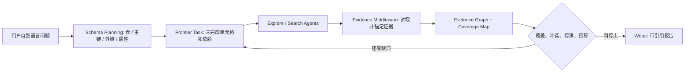

# SearchOS-V1：把开放域搜索 Agent 变成有状态、有证据、有调度的系统

## 元信息

| 字段 | 内容 |
|---|---|
| 论文 | SearchOS-V1: Towards Robust Open-Domain Information-Seeking Agent Collaboration |
| 链接 | https://arxiv.org/abs/2607.15257 |
| 版本 | arXiv:2607.15257v1，2026-07-16 提交 |
| 方向 | 大模型 Agent、开放域信息搜索、多 Agent 协作、Agent Harness |
| 作者 | Yuyao Zhang, Junjie Gao, Zhengxian Wu, Jiaming Fan, Jin Zhang, Shihan Ma, Yao Yao, Weiran Qi, Chuyan Jin, Guiyu Ma, Xingzhong Xu, Kai Yang, Ji-Rong Wen, Zhicheng Dou |
| 代码 | https://github.com/antins-labs/SearchOS，主分支 HEAD `361373bfc7196697a9bcd4731dfc34880790f4aa` |
| 官方项目状态 | README 在 2026-07-17 标记论文上线；仓库提供 CLI/TUI/Web、数据集、评测与技能库目录 |

## TL;DR

- 这篇论文讨论的不是“再加几个搜索 Agent”，而是：长程开放域搜索为什么会丢进度、重复检索、遗漏字段、无法追溯证据，以及这些失败为什么不能只靠 prompt 修补。
- SearchOS 把开放域问题形式化为“带引用的关系模式补全”：系统先把自然语言请求变成表、主键、外键和属性，再让 Agent 发现实体、填单元格，并为每个值保留 URL 和原文片段。
- 核心机制是 Search-Oriented Context Management，简称 SOCM：把 Frontier Task、Evidence Graph、Coverage Map、Failure Memory 作为系统状态维护在对话外，并按角色投影给 Orchestrator、Explore、Search、Writer。
- 论文的第二个关键点是 Harness：Search Tool Middleware 在模型调用和工具调用边界接管上下文、证据抽取、停滞检测和预算控制，让“记录证据”和“发现循环”成为系统行为，而不是依赖 Agent 自觉。
- 实验在 WideSearch 和 GISA 上比较 ReAct、Plan-and-Solve、Table-as-Search、A-MapReduce、Web2BigTable；SearchOS 在 WideSearch Item F1 达到 80.3，比最强 baseline 高 4.3 点，在 GISA Set F1 达到 76.5，比最强 baseline 高 13.4 点。
- 消融显示：动态 schema planning 比固定单表/多表更强；continuous dispatch 相比 batch 平均时间从 629.13 秒降到 476.34 秒，slot utilization 从 34.6% 到 41.7%，Item F1 从 79.66 到 86.75；技能库带来 Item F1 +2.0、Row F1 +3.4。
- 局限同样明显：论文主结果使用 Max@3，agent backbone 是 GLM-5，证据抽取模型是 Qwen3.5-35B-A3B；系统复杂度、技能质量、网页访问失败、schema 生成偏差和可复现实验成本仍是关键边界。

## 研究问题：为什么“搜索更强”仍然不够？

### 论文真正反对的默认假设是什么？

- 常见开放域搜索 Agent 的默认设计是：
  - 把问题交给一个会搜索、会浏览、会总结的模型；
  - 或者并行启动多个子 Agent，让它们分别找资料；
  - 最后让一个汇总者从对话历史里归纳答案。
- 论文认为这个模式在短任务上能工作，但在长程任务上会暴露四类系统性失败：
  - **进度丢失**：证据和计划埋在多轮对话里，context 一压缩就看不清哪些字段已完成。
  - **重复探索**：一个 Agent 已经查过无效路径，另一个 Agent 仍然换个说法重搜。
  - **覆盖缺口**：最终答案看起来完整，但表格里某些实体、属性或行集其实没填。
  - **证据不可审计**：页面摘要和最终结论之间缺少单元格级 provenance，错误难以定位。

### 这篇论文的研究空白在哪里？

| 既有方向 | 常见解决办法 | SearchOS 认为还缺什么 |
|---|---|---|
| 单 Agent 搜索 | ReAct、Plan-and-Solve、边搜边想 | 没有外部化的覆盖状态，容易在长历史中遗忘目标 |
| 多 Agent 协作 | MapReduce、角色分工、并行子任务 | 协作状态仍常在消息里流动，重复和 idle slot 难控制 |
| Agent memory | 反思、长期记忆、压缩上下文 | 记忆不一定绑定到具体 schema cell 和证据片段 |
| Agent harness | 工具中间件、运行时约束、可观测性 | 需要面向开放域信息搜索的证据抽取和停滞治理 |

论文的主张可以压缩成一句话：**开放域信息搜索不是一个聊天问题，而是一个系统状态管理问题。**

## 论文主张与论证路线

### Claim -> Mechanism -> Evidence -> Boundary

| 层次 | 论文如何展开 |
|---|---|
| Claim | 长程搜索失败来自隐式状态，系统应维护任务、证据、覆盖和失败记忆 |
| Mechanism | 用关系模式补全定义目标，用 SOCM 外部化状态，用 middleware 接管工具边界 |
| Evidence | 在 WideSearch/GISA 上领先所有 headline F1，并用 schema、pipeline、skill 消融解释机制 |
| Boundary | 结果依赖固定 benchmark、Max@3、特定模型配置和技能库质量，不等于所有开放网页任务都稳健 |

### 论文结构可以这样读

1. 先把“开放域搜索”改写成关系数据补全问题。
2. 再说明状态应该放在系统里，而不是放在 Agent 对话历史里。
3. 接着把多 Agent 协作变成 pipeline-parallel 调度问题。
4. 然后用 middleware 让证据抽取、context 组合、停滞检测成为可复用 harness。
5. 最后用 benchmark、消融和轨迹案例证明：提升主要来自覆盖率、调度效率和错误恢复。



## 方法机制一：关系模式补全把“找资料”变成可度量目标

### 形式化对象是什么？

论文给定自然语言请求 `q`，让系统构造一个关系搜索 schema：

```text
S = ({T_m}_{m=1..M}, R)
T_m = (A_m, P_m)
T = (q, S)
```

变量解释：

| 符号 | 含义 | 为什么重要 |
|---|---|---|
| `T_m` | 第 m 张表 | 一个复杂问题可能需要多张表，而不是强压成单表 |
| `A_m` | 表属性集合 | 决定每个实体需要被填哪些字段 |
| `P_m` | 主键属性 | 防止同一实体被重复建行 |
| `R` | 外键关系 | 表示跨实体、跨表的依赖关系 |
| `q` | 用户请求 | 原始自然语言目标 |

这一步的意义是：系统不再追问“答案写得像不像完整”，而是追问“哪些表、哪些行、哪些单元格已经有证据”。

### 输出为什么必须带 citation matrix？

论文把每张表的输出写成：

```text
O = {(E_m, Y_m, C_m)}_{m=1..M}
```

其中：

- `E_m = {e_{m,i}}`：第 m 张表发现到的实体行。
- `Y_m`：实体 x 属性的值矩阵。
- `C_m`：和 `Y_m` 同形状的引用矩阵，每个值都映射到来源 URL 和 anchored excerpt。

这个设计解决两个常见问题：

- **证据粒度**：不是“这页可能相关”，而是“这个单元格的值由这个页面的这段话支撑”。
- **审计粒度**：当最终报告出错，可以追到具体 entity、attribute、source、span，而不是重读全部轨迹。

### 这个 formulation 的代价是什么？

- 它要求系统先做 schema planning，schema 错了会影响后续搜索。
- 开放集问题会持续发现新行，coverage 只能衡量“已知行”的填充程度，不能自动证明“全集已穷尽”。
- 对非结构化、主观判断型问题，表格化目标可能压扁原问题，需要 writer 和 orchestrator 保留边界说明。

## 方法机制二：SOCM 把搜索状态搬出对话历史

### 四类状态分别负责什么？

SOCM 被定义为：

```text
M_t = (F_t, G_t, C_t, W_t)
```

| 状态 | 中文解释 | 关键字段或行为 |
|---|---|---|
| `F_t` Frontier Task | 任务前沿 | 任务类型、状态、优先级、依赖、目标单元格、分配 Agent、尝试次数 |
| `G_t` Evidence Graph | 证据图 | value、source、supporting span、schema binding、confidence、provenance tier、status |
| `C_t` Coverage Map | 覆盖图 | 每个 schema cell 的 missing/filled/uncertain/unreachable 状态和冲突标记 |
| `W_t` Failure Memory | 失败记忆 | 无效查询、不可访问来源、失败 skill、被丢弃分支、拒绝 claim |

Agent 不直接读取全部状态，而是按角色拿到投影：

```text
x_t^(r) = phi_r(M_t; z_t)
```

这意味着：

- Orchestrator 看到全局缺口和调度状态。
- Search Agent 看到自己负责的目标 cell、相关证据和相关失败模式。
- Writer 看到压缩后的全局状态，用于写带引用报告。

### Frontier Task 为什么不是普通 todo list？

Frontier Task 中每个任务写作：

```text
f_j = (kappa_j, s_j, p_j, B_j, Z_j, a_j, n_j)
R_t = {f_j in F_t | s_j = Pending and B_j subset T_t}
```

变量解释：

| 符号 | 含义 |
|---|---|
| `kappa_j` | 任务类型 |
| `s_j` | 任务状态 |
| `p_j` | 优先级 |
| `B_j` | 依赖任务集合 |
| `Z_j` | 目标单元格集合 |
| `a_j` | 被分配的 Agent |
| `n_j` | 尝试次数 |
| `R_t` | 当前 ready task 集合 |

这让调度器可以做三件事：

- **依赖控制**：前置任务没结束，不派发后续任务。
- **目标去重**：如果两个活跃任务覆盖同一 cell，就拒绝重叠工作。
- **重新验证**：任务被 dispatch 前再检查目标 cell 是否已填，避免晚到任务重复采集。

### Evidence Graph 如何避免“页面摘要就是证据”的误判？

Evidence Graph 节点写作：

```text
g_i = (v_i, u_i, x_i, b_i, gamma_i, tau_i, s_i)
b_i = (m_i, e_i, a_i)
```

| 字段 | 含义 | 约束意义 |
|---|---|---|
| `v_i` | 候选值 | 必须是某个单元格的值 |
| `u_i` | 来源 URL | 支撑 provenance |
| `x_i` | 支撑 span | 避免只存整页摘要 |
| `b_i` | schema binding | 绑定到表、实体、属性 |
| `gamma_i` | 置信度 | 支持排序和冲突处理 |
| `tau_i` | provenance tier | anchored span 优先于页面级摘要 |
| `s_i` | 节点状态 | 被拒绝或 superseded 的证据仍留作审计 |

这比“把网页塞进 context 后让模型总结”更严格，因为证据接受条件至少包含 schema binding 和 span anchoring。

## 方法机制三：Coverage Map 和 Failure Memory 让停止条件更具体

### Coverage Map 怎样选主证据？

当多个 findings 支撑同一个 cell，系统选择：

```text
g_c* = argmax_{g in H_c} (tau(g), alpha(g), gamma(g))
```

变量解释：

- `H_c`：单元格 `c` 的支持证据集合。
- `tau(g)`：provenance tier，锚定片段优先。
- `alpha(g)`：schema alignment，证据和目标字段越贴合越好。
- `gamma(g)`：authority-adjusted confidence，综合来源权威性和抽取置信度。

这个排序是 lexicographic 的：先看 provenance，再看 schema 对齐，再看置信度。它的保守点在于：冲突不会简单覆盖旧值，而是标记 conflict。

### 覆盖率公式为什么有一个特殊分母？

论文定义：

```text
Cov(C_t) =
  sum_{c in Omega_t} 1[s(c)=Filled]
  /
  (|Omega_t| + sum_{m: |E_m(t)|=0} |A_m|)
```

解释：

- `Omega_t` 是当前已物化的 cell。
- `E_m(t)` 是第 m 张表当前发现的行。
- 如果某张表声明存在但还没有发现任何行，分母会加上这张表的属性数。

这个小设计很关键：否则一个“应该有表但暂时没行”的任务可能因为没有 cell 而被错误视为完成。

### Failure Memory 的价值是什么？

失败记录写作：

```text
w_k = (eta_k, sigma_k, chi_k, n_k, t_k)
```

| 字段 | 含义 |
|---|---|
| `eta_k` | 失败类型 |
| `sigma_k` | task-scoped signature |
| `chi_k` | 纠正指导 |
| `n_k` | 重复次数 |
| `t_k` | 最近发生时间 |

这类记忆不是泛泛的“反思”，而是控制搜索行为的负反馈：

- 同一站点不可访问，就暴露给相关 Agent，避免继续撞墙。
- 同一查询无结果，就提升“不要再试”的强度。
- 某个 branch 被 budget 或质量原因停止，就保留原因，避免 writer 把缺口写成已完成。

## 方法机制四：Pipeline-parallel orchestration 解决多 Agent 空转

### 为什么 batch parallel 不够？

普通多 Agent 并行常见做法是：

1. 拆一批任务。
2. 一次性派给多个 Agent。
3. 等全部返回。
4. 再决定下一批。

问题在于：

- 快 Agent 会等慢 Agent，slot 空闲。
- 慢任务可能阻塞后续缺口。
- 已经被其他 Agent 填好的 cell 仍可能继续被搜索。

SearchOS 使用 continuous dispatch：

```text
D_t = Top_{min(b_t, |R_t|)}(R_t; p)
```

变量解释：

- `b_t`：当前空闲执行槽数量。
- `R_t`：ready task 集合。
- `p`：frontier priority。
- `D_t`：本轮派发任务。

每当一个 Agent 完成，系统就更新 SOCM、重新计算 ready set，并立刻填补释放出来的 slot。

### 实验上这带来了什么？

| 调度策略 | 平均时间 | Slot utilization | Tasks/min | LLM Calls | Item F1 |
|---|---:|---:|---:|---:|---:|
| Batch control | 629.13s | 34.6% | 2.99 | 341.4 | 79.66 |
| Continuous | 476.34s | 41.7% | 3.37 | 296.6 | 86.75 |

作者还报告了三轮 paired results：

| Round | Time Delta | Tokens Delta | Item F1 Delta |
|---|---:|---:|---:|
| 1 | -32.6% | -27.7% | +2.35 |
| 2 | -32.3% | -31.2% | +15.00 |
| 3 | -28.6% | -10.8% | +1.85 |

这说明 pipeline 不是只省 wall-clock；由于减少重复和 idle 后的补救搜索，它还可能提升质量。不过这里也要注意：该消融是在 10 个 WideSearch case、同查询和同并发 K=8 的设置下做的，不能直接外推到所有搜索任务。

## 方法机制五：Search Tool Middleware Harness 把证据和治理放在工具边界

### 三个 middleware 组件如何串起来？

论文把 harness 写成：

```text
h_tilde_t^(r) = H_ctx(h_t, M_t)
M_{t+1}       = H_evidence(o_t, M_t)
a_{t+1}       = H_sensor(M_t, M_{t+1}, xi_t)
```

| 组件 | 输入 | 输出 | 作用 |
|---|---|---|---|
| Context Middleware | 近期历史、共享状态、角色 | 角色专属上下文 | 注入目标、证据、缺口、失败和技能 |
| Evidence Middleware | 工具观测、schema、coverage | 更新后的证据图和覆盖图 | 把页面观测转成 schema-bound evidence |
| Sensor Middleware | 状态变化、运行计数 | continue/correct/stop | 发现停滞、预算压力和循环 |

这个设计的核心是：Agent 可以专心做局部搜索决策，系统负责维护全局 invariant。

### 停滞检测具体看什么？

Sensor Middleware 定义两个增量：

```text
Delta_cov_t = Cov(C_t) - Cov(C_{t-1})
Delta_ev_t  = |G_t| - |G_{t-1}|
```

在窗口 `w` 内，如果 coverage 和 evidence 都没有增长：

```text
s_t = I[
  sum_{j=t-w+1..t} Delta_cov_j = 0
  and
  sum_{j=t-w+1..t} Delta_ev_j = 0
]
```

预算压力写成：

```text
rho_t = max(
  n_iter_t / B_iter,
  n_search_t / B_search,
  tau_t / B_time
)
```

这使系统可以区分三种状态：

- **有进展但慢**：继续或轻微调整。
- **无证据增长**：注入 correction 或换策略。
- **预算压力过高**：进入 drain-only 或停止分支。

### 为什么这比 prompt 规则更可靠？

- prompt 规则要求每个 Agent 在长上下文中持续记住约束。
- middleware 规则在工具调用后统一执行，不依赖模型是否“想起来”。
- 不同 post-trained 模型、不同角色、不同搜索 backend 可以共享同一治理逻辑。

## 技能系统：把“怎么搜”和“去哪搜”拆开

### 三层技能分别是什么？

| 技能层 | 数量/性质 | 作用 |
|---|---|---|
| Orchestrator skills | 少量全局 playbook | 任务分解、schema/row 对齐、综合验证 |
| Strategy skills | 40+ | 查询改写、实体枚举、消歧、多跳、时间推理、聚合、停滞恢复 |
| Access skills | 248 | 针对政府门户、百科、公司站、媒体目录等来源的站点级检索和抽取 |

README 还说明运行时会用 LLM router 预筛 access catalog；每个子任务最多携带少量技能，未匹配来源则退回通用抽取 middleware。

### 技能消融支持什么结论？

| 设置 | Item P | Item R | Item F1 | Row P | Row R | Row F1 |
|---|---:|---:|---:|---:|---:|---:|
| Without Skills | 82.2 | 78.5 | 78.3 | 56.0 | 52.4 | 53.1 |
| With Skills | 83.9 | 79.7 | 80.3 | 59.0 | 55.8 | 56.5 |
| Delta | +1.7 | +1.2 | +2.0 | +3.0 | +3.4 | +3.4 |

论文还报告技能让同 100 个 WideSearch 问题的 session time 降低 36.6%，search calls 降低 39.1%，page calls 降低 42.7%。

这里的合理解释是：

- 技能减少了“试错式浏览”，不是简单增加搜索次数。
- Row-level 提升更大，说明技能帮助的是整行一致性，而不只是孤立 cell。
- 因为消融一次关闭所有技能层，无法单独分辨 access skill、strategy skill、orchestrator skill 各自贡献。

## 实验设置：benchmark、baseline 和指标

### 两个 benchmark 测什么？

| Benchmark | 规模与任务 | 评价重点 |
|---|---|---|
| WideSearch | 200 个 manually curated questions，100 英文、100 中文，覆盖 15+ domain | 大规模 wide information collection，要求收集可验证原子事实并组织为完整表 |
| GISA | 373 个 human-crafted queries，答案格式包括 item、set、list、table | 深度多跳推理和跨来源聚合，支持 deterministic scoring |

### baseline 覆盖哪些类型？

| 类型 | Baseline |
|---|---|
| Single-agent | ReAct、Plan-and-Solve |
| Multi-agent | Table-as-Search、A-MapReduce、Web2BigTable |

### 实验配置有哪些硬条件？

- Agent roles backbone：`GLM-5`。
- Evidence Extraction：`Qwen3.5-35B-A3B`。
- 每个 case 跑 3 次，报告 Max@3。
- 默认上限：
  - 50 orchestrator iterations；
  - 8 parallel sub-agents；
  - 每个 sub-agent 20 次 search；
  - 1800 秒 wall-clock budget。

这些条件很重要，因为 Max@3 和较高并发会提高最佳表现，但也让实际部署成本与单次稳定性需要另行评估。

## 主结果：提升主要来自 recall 和完整枚举

### WideSearch 主表

| Metric | ReAct | Plan-and-Solve | Table-as-Search | A-MapReduce | Web2BigTable | SearchOS | Delta |
|---|---:|---:|---:|---:|---:|---:|---:|
| Item Precision | 82.9 | 83.8 | 82.4 | 83.1 | 78.3 | 83.9 | +0.1 |
| Item Recall | 70.2 | 72.9 | 73.5 | 74.2 | 73.4 | 79.7 | +5.5 |
| Item F1 | 72.9 | 75.2 | 75.4 | 76.0 | 73.8 | 80.3 | +4.3 |
| Row Precision | 58.0 | 58.7 | 57.1 | 56.9 | 57.5 | 59.0 | +0.3 |
| Row Recall | 48.8 | 50.2 | 51.6 | 49.8 | 54.0 | 55.8 | +1.8 |
| Row F1 | 50.9 | 52.2 | 52.7 | 51.4 | 54.5 | 56.5 | +2.0 |

最值得注意的是 Item Recall +5.5，而 Precision 只小幅领先。这支持作者的机制解释：Coverage Map 和 frontier dispatch 主要减少遗漏，而不是靠更激进的猜测提高覆盖。

### GISA 主表

| Metric | ReAct | Plan-and-Solve | Table-as-Search | A-MapReduce | Web2BigTable | SearchOS | Delta |
|---|---:|---:|---:|---:|---:|---:|---:|
| Table Item F1 | 74.8 | 71.2 | 73.4 | 72.5 | 68.1 | 76.9 | +2.1 |
| Table Row F1 | 58.1 | 50.7 | 54.1 | 52.1 | 45.3 | 59.7 | +1.6 |
| Set F1 | 61.6 | 63.1 | 60.9 | 62.5 | 56.7 | 76.5 | +13.4 |
| List F1 | 67.1 | 53.8 | 54.2 | 57.4 | 65.5 | 68.1 | +1.0 |
| Item EM | 0.0 | 16.7 | 16.7 | 33.3 | 50.0 | 50.0 | 0.0 |

GISA Set F1 +13.4 是最强信号。Set 问题通常要求枚举完整集合，最怕“看起来答了几个，但漏掉很多”。SearchOS 的 coverage-driven completeness check 正好对准这个失败模式。

## 消融一：schema 应该在搜索中规划，而不是提前固定

### 固定单表、多表和动态规划的对比

| Setting | Item P | Item R | Item F1 | Row P | Row R | Row F1 |
|---|---:|---:|---:|---:|---:|---:|
| Fixed Single-Table | 54.7 | 46.7 | 47.9 | 33.5 | 28.2 | 29.2 |
| Fixed Multi-Table | 66.9 | 55.7 | 58.3 | 37.4 | 32.6 | 34.2 |
| Oracle Single/Multi | 70.3 | 60.7 | 62.4 | 44.8 | 39.7 | 41.2 |
| SearchOS | 76.3 | 68.3 | 70.6 | 52.7 | 47.3 | 48.9 |

作者选择 40 个可拆成多表 schema 的问题，让 GPT-5.5 构造语义匹配的固定单表和固定多表，再和 SearchOS 自主 schema planning 比较。

关键结论：

- 固定多表平均强于固定单表，但只在 21 个 case 赢，17 个 case 输，2 个 case 持平。
- 即使用 oracle 对每个 case 选择更好的固定 schema，仍比 SearchOS 低 8.2 Item F1 和 7.7 Row F1。
- SearchOS 在这 40 个任务中选择单表 35 次、多表 5 次，说明“多表更高级”不是普适规则。

### 这说明什么？

- Schema 本身是搜索过程的一部分。
- 有些问题的实体和属性集中，单表减少 join 和对齐成本。
- 有些问题存在一对多关系、多实体类型或共享属性，多表才更自然。
- 真正重要的是让 schema 能随搜索发现的信息拓扑调整，而不是预设一种结构。

## 消融二：Middleware 轨迹案例证明停滞治理有实际作用

### Loop Sensor 观察的不是“Agent 看起来困惑”，而是状态不增长

论文的 middleware-governance 分析展示了 early、mid-run、late 三类干预轨迹。每个案例都看两条曲线：

- table coverage；
- discovered entities 累计数。

当 Loop Sensor 判断低进展循环时，系统触发 strategy switch。作者给出的机制级证据是：干预后 coverage 或 entity discovery 重新增长。

### 这个证据的边界

- 这是 representative trajectories，不是大规模统计检验。
- 它能证明 sensor 干预有合理机制，但不能单独证明每次干预都优于让 Agent 自行恢复。
- 更强的后续实验应报告：
  - sensor false positive；
  - strategy switch 成功率；
  - 不同停滞类型下的收益；
  - 干预造成的额外成本。

## 轨迹案例：论文怎样展示系统行为？

### Case 1：Spotify 2024 Rankings

| 阶段 | 系统动作 | 状态变化 |
|---|---|---|
| Explore | 先找权威来源，固定 Global 和 U.S. 两个 Top-10 list | 尚未建 schema，coverage 0% |
| Structure | 建一个 20 x 8 表，主键是 Category + Rank | 40/160 cells known，coverage 25% |
| Parallelize | 把 20 首歌分成四个五歌任务，并行查 metadata | 四个 Agent 同时运行 |
| Monitor | 合并已完成 shard，不等最慢 Agent | coverage 25.0 -> 68.8 -> 89.4 -> 100.0% |
| Audit | 100% known-cell coverage 后仍检查 row set | 确认 20 个 expected rows |
| Repair | 修两个 release date 分隔符不一致问题 | 20 行完整，221 evidence nodes |

这说明 SearchOS 的“完成”不是单一按钮，而是 coverage、row-set audit、格式一致性共同决定。

### Case 2：Michael Phelps medal events

- 系统一度看到 16 行全部填满，即 known-cell coverage 100%。
- 但 Agent 报告暗示 eligible events 大约 31 个。
- Orchestrator 没有直接 synthesis，而是触发 row scope audit。
- 后续 backfill 让表增长到 33 行、35 行。
- 最终还修复了一个 2003 World Championships 400m individual-medley 重复记录。

这个案例强调：**coverage over known rows 不等于 open-set recall**。

### Case 3：Migration-related journal articles

- 任务要求枚举 2020-2024 三本 journal 的 migration-related articles。
- Wiley 和 JSTOR 多次返回 access checks 或 HTTP 402。
- Agent 转向 Crossref、OpenAlex 和 academic-paper skills。
- Loop Sensor 对一个 stalled agent 记录两次 strategy switch。
- 剩余来源和预算耗尽后，系统保留 unresolved cells，而不是编造 metadata。
- 最终返回 57 行，coverage 96.3%，Item 和 Row F1 都是 93.8。

这个案例的边界判断很重要：SearchOS 不是保证所有网页都能进，而是把不可达和未完成显式保留下来。

## 代码与工程结构：论文系统如何落地？

### README 暴露的运行方式

官方 README 给出的快速运行流程是：

```bash
./install.sh
source .venv/bin/activate
searchos "Top-5 universities per subject in the 2025 QS rankings, with application deadlines"
```

项目还支持：

- `python -m searchos "<query>"`：单次查询，输出到 `searchos_workspace/<timestamp>/output/report.md`。
- `python -m searchos`：Textual TUI，可看 live dashboard、mid-run steering、follow-up。
- `./web/start.sh`：启动 REST/WS API 和 Web frontend。
- `python -m eval.run --benchmark widesearch --range 1-50`：运行评测。

### 项目布局说明了哪些工程边界？

| 目录 | 责任 |
|---|---|
| `searchos/agents` | Orchestrator、Explore、Search、Writer 等 Agent 定义 |
| `searchos/harness` | SearchSession、Context/Sensor/Evidence Intake middleware、repair planning、telemetry |
| `searchos/socm` | Frontier、Evidence Graph、Coverage Map、Strategy 等共享状态 |
| `searchos/tools` | schema、tasks、writer、simple_browser 等角色工具 |
| `searchos/skills` | 技能合约、manifest、routing、隔离运行时、技能库 |
| `web/api` | FastAPI REST/WS 服务 |
| `web/frontend` | Next.js research workspace |
| `eval` / `datasets` | 评测框架与 WideSearch/GISA 数据 |

工程上最值得注意的是：论文的 SOCM 和 harness 不是纯概念图，而是对应到仓库的 `socm/` 和 `harness/` 模块边界。

### CONTEXT.md 里的安全边界

项目的 `CONTEXT.md` 特别区分了 Access Skill、Executor、Skill Execution 和 Execution Policy：

- 一个 Access Skill 恰好包含一个 Executor。
- 每次 Skill Execution 恰好运行一个 Executor。
- 每次 Skill Execution 受一份 Execution Policy 约束。
- Generated Skill 只有通过隔离 smoke test 后才能晋升为 Bundled Skill 候选。
- Evidence Observation 只能在一次 Evidence Intake 生命周期中被预留一次。

这补充了论文的安全含义：技能不是“可信脚本”，而是带权限边界和证据生命周期的可执行检索能力。

## 相关工作位置：SearchOS 更像 Agent OS 还是搜索算法？

### 它和 search-augmented reasoning 的区别

- Search-o1、Research-style RL、deep search agent 关注模型何时搜索、怎样把检索内容融入推理链。
- SearchOS 更关注系统层：
  - 搜索状态存哪里；
  - 多 Agent 怎样避免重复；
  - 证据怎样绑定到结构化目标；
  - 失败怎样跨 Agent 共享。

因此它不是单纯的 retrieval 方法，而是 search-agent harness。

### 它和多 Agent 框架的区别

- AutoGen、AgentVerse、Magentic-One 等强调角色、消息和协作流程。
- SearchOS 的差异在于：
  - 用 Coverage Map 明确表示完成度；
  - 用 Evidence Graph 约束证据；
  - 用 Frontier Task 处理依赖和调度；
  - 用 middleware 在工具边界治理行为。

### 它和 Agent memory 的区别

- 反思记忆、长期记忆、压缩上下文通常解决“模型以后记得什么”。
- SearchOS 的 Failure Memory 更偏运行控制：
  - 哪些查询不要再试；
  - 哪些来源不可达；
  - 哪些 claim 被拒绝；
  - 哪些 branch 因预算停止。

这类记忆必须和 task signature、schema binding、attempt count 绑定，否则很容易变成笼统建议。

## 证据边界与局限

### 论文已经证明了什么？

- 在两个结构化开放域信息搜索 benchmark 上，SearchOS 的 F1 指标领先单 Agent 和多 Agent baseline。
- 主要收益更像来自 recall 和完整性，而不是牺牲 precision。
- Continuous dispatch 在给定设置下降低时间和 token，同时提升 Item F1。
- 技能库提高 row-level coherence，并减少搜索和页面调用。
- 轨迹案例展示了覆盖、停滞、scope audit 和 source fallback 的具体控制流程。

### 论文还没有充分证明什么？

- **单次稳定性**：主结果是 Max@3，不等同于一次运行的平均稳定表现。
- **模型泛化**：实验 backbone 是 GLM-5，Evidence Extraction 是 Qwen3.5-35B-A3B；换成其他模型组合的行为未完全展开。
- **技能可维护性**：280 个预置技能很强，但技能更新、失效、冲突和权限治理会成为长期成本。
- **schema 生成失败**：如果初始 schema 漏掉关键实体类型，Coverage Map 可能在错误空间内达到高覆盖。
- **开放网页访问**：access checks、HTTP 402、反爬和登录墙仍然存在，系统只能显式失败和 fallback，不能保证突破。
- **成本透明度**：论文给了 calls、time、budget 上限，但实际部署还需要按模型价格、搜索 API、页面抓取和并发资源算总成本。

## 对 Agent 系统构建的启发

### 可以迁移的设计原则

| SearchOS 机制 | 可迁移原则 |
|---|---|
| Relational schema completion | 先把开放目标转成可检查的结构化状态 |
| Citation matrix | 每个事实值都必须有可追溯证据 |
| Frontier Task | 调度目标应绑定到缺口，而不是只绑定到自然语言子任务 |
| Coverage Map | 停止条件应区分 cell coverage、row-set recall 和冲突状态 |
| Failure Memory | 失败路径要跨 Agent 共享，并影响未来调度 |
| Middleware Harness | 证据抽取、预算、循环检测应在系统边界执行 |

### 对深度研究 Agent 的直接问题

- Scout 阶段是否应该输出结构化 coverage target，而不只是候选列表？
- 深读阶段是否应该把 claim、mechanism、evidence、boundary 写成可审计表，而不只写长文？
- 去重和失败记忆是否应该成为跨运行状态，而不只在单次对话中口头提醒？
- 当候选 PDF 不可读、代码不可访问或指标缺失时，系统应该怎样记录 unreachable cell？
- 发布前验证是否应该检查“known rows 填满”与“scope 已审计”两个条件？

### 一个可执行的简化控制循环

```text
Input:
  q: 用户问题
  schema_policy: 允许的表/字段/证据类型
  budgets: 搜索、时间、Agent 并发预算

State:
  F: frontier tasks
  G: evidence graph
  C: coverage map
  W: failure memory

Loop:
  1. plan_or_update_schema(q, G, C)
  2. enqueue_missing_cells(C, W)
  3. dispatch ready tasks to free agent slots
  4. after each tool observation:
       candidates = extract_schema_bound_evidence(observation)
       accepted = require_binding_and_anchor(candidates)
       atomically_update(G, C)
       update_stall_and_budget_sensors()
  5. if coverage high but row scope uncertain:
       dispatch scope audit
  6. if budget exhausted:
       mark unresolved cells, do not hallucinate
  7. if enough coverage and audit passed:
       synthesize cited report

Output:
  report + unresolved cells + evidence index + failure log
```

## 结论：这篇论文的核心价值和最小可复用单元

SearchOS-V1 最有价值的地方，不是某个单独的搜索技巧，而是把开放域信息搜索拆成了一个可维护的系统问题：

- 目标是关系模式和 coverage；
- 事实是 evidence graph 节点；
- 协作是 frontier task 调度；
- 可靠性来自 middleware；
- 经验积累通过 skill 和 failure memory 跨运行保留。

如果只借一个思想，应该借“状态在系统里，而不是在对话里”。只要多 Agent 搜索还依赖对话历史来记住哪些字段完成、哪些来源失败、哪些证据冲突，长程任务就会自然滑向重复、遗漏和不可审计。

同时，SearchOS 的证据也提示了下一步研究问题：

- 如何评估一次运行而不是 Max@3 的稳定性？
- 如何把 schema planning 的错误显式暴露给用户？
- 如何让 generated access skill 在安全隔离、复现和权限最小化之间取得平衡？
- 如何把结构化 coverage 扩展到图像、视频、表格截图和动态网页？
- 如何在真实成本约束下选择并发度、技能路由 top-k 和 early stop 策略？

对 Agent 研究者来说，这篇论文提供的是一套控制面语言：任务、证据、覆盖、失败、调度和治理。它把“让模型更会搜索”的问题，推进到“让系统知道自己搜到了什么、没搜到什么、为什么不要再走某条路”的层面。
