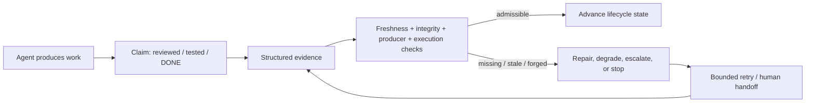

# Proof-or-Stop：不要相信 Agent 的 DONE，要相信可验证证据

原文：<https://arxiv.org/abs/2607.14890v1>

PDF：<https://arxiv.org/pdf/2607.14890v1>

作者：Jek Huang、Jeffery Hsia、Jiayi Sun、Freddie Shi、Wei Huang、Ian H. White

发布时间：2026-07-16 12:06:21 UTC

类型：论文，48 页，cs.AI / cs.SE

### TL;DR

- 这篇论文讨论的不是“再训练一个更强 coding agent”，而是给 autonomous coding lifecycle 加一层控制语义：**Agent 输出只是一条 claim，不是 lifecycle state**。
- 核心方法叫 **Proof-or-Stop Lifecycle Control**：`reviewed`、`tested`、`DONE`、`ready-to-merge` 这类状态只能由新鲜、绑定当前源码状态、机械可验证的 evidence gate 推进。
- 作者把“proof”定义得很克制：它不是形式化证明程序正确，而是“在给定 trust model 下可被 gate 接受的证据”。
- 方法机制包括：`materialHash`、`headHash`、`storyFilesHash`、policy hash、command-set hash、receipt identity、producer authorization、execution attestation。
- 机制测试里，unattended-loop engine 通过 10/10 场景，false-DONE 为 0；local-key receipt bundle 拒绝 18 类篡改，false accept 为 0。
- 主要实证是 9,240-cell ablation：A4 Proof-or-Stop loop 相比 A2' compute-budgeted naive loop，把 visible-pass / hidden-fail amplification 从 31/1800 降到 2/1800，not-amplified 提升 1.6 个百分点，95% CI 为 [0.8, 2.5]。
- 一个近似同计算量的对照更能说明机制：A3 只把 reviewer signal 当建议，amplified 14/1800；A4 把 reviewer signal 变成 lifecycle gate，amplified 2/1800。
- 局限同样明确：单一模型家族、24 个 ablation task、自托管语料、cross-vendor review 是选择性调用，不能推出多模型、跨域或生产自动合并的普遍结论。

### 这篇论文真正要解决什么问题？

作者把问题从“Agent 会不会写代码”改写成：

- 当 Agent 说“我测过了”，系统凭什么相信？
- 当 reviewer agent 说“LGTM”，这个 verdict 是否绑定当前代码？
- 当 CI 绿了，是否说明这次 lifecycle claim 可以进入 DONE？
- 当源码在 review 后又变了，之前的证据是否还有效？

论文的基本判断是：

| 常见状态 | 弱系统里的含义 | Proof-or-Stop 里的含义 |
|---|---|---|
| `tested` | Agent 声称跑过测试，或日志里有 pass 字样 | 有结构化 test receipt，且 receipt 绑定当前源码状态 |
| `reviewed` | reviewer 留下自然语言评价 | reviewer verdict 是签名/结构化记录，绑定当前 review round 与 material hash |
| `DONE` | Agent 叙述完成，或 visible tests 通过 | 所有必需 claim 都有 admissible evidence |
| `ready-to-merge` | PR 状态或人工判断 | 证书针对即将 merge 的精确 commit 重新验证 |

这个切入点很重要，因为 autonomous coding agent 的风险不是单点错误，而是闭环错误：

- Agent 可以生成代码。
- Agent 可以反复运行 visible checks。
- Agent 可以根据错误信息修补到 visible pass。
- Agent 也可以在同一个 workflow 里叙述“完成”。

如果系统把叙述、绿灯或评论直接当成状态，绿色表面就可能把隐藏错误一路放大到 merge。

### Claim → mechanism → evidence → boundary

论文的论证路线很清楚：

| 层次 | 作者主张 | 机制 | 证据 | 边界 |
|---|---|---|---|---|
| 语义层 | Agent output 是 claim，不是 state | lifecycle transition 只读 evidence gate | 形式化 admissibility 与 advance 公式 | 不证明程序语义正确 |
| 工程层 | proof 必须绑定当前源码状态 | `materialHash` / `headHash` / `storyFilesHash` | receipt / tamper tests | local-key trust model 不防 compromised runner |
| lifecycle 层 | review/test/DONE 都应 gate 化 | plan、dev、review、test、done transitions | 10/10 engine scenarios，0 false-DONE | 测 gate 行为，不测广泛任务成功率 |
| 实证层 | gate 能减少 green-but-wrong amplification | A1/A2/A2'/A3/A4 ablation | 9,240 cells；31/1800 到 2/1800 | 单模型家族，task-concentrated |
| 自举层 | 自己开发自己可产生审计记录 | self-application corpus | 565 stories / 1007 findings，94.8% resolved | 自建自审，选择性强 |

关键是最后一列：作者反复阻止自己把证据说过头。这正是这篇论文值得读的地方。

### 方法核心：Admissible Evidence 不是“看起来像证据”

论文给出的核心谓词可以压缩成：

```text
Admissible(E, c, H) =
  Fresh(E, H)
  AND Complete(E)
  AND IntegrityVerified(E)
  AND ProducerAuthorized(E)
  AND ExecutionAttested(E)
  AND Supports(E, c)
  AND OutcomeAccepted(E)
```

变量含义：

- `E`：一份结构化 evidence，例如 test receipt、review verdict、build record。
- `c`：一个 lifecycle claim，例如 `tested`、`reviewed`、`DONE`。
- `H`：当前 tracked source state。
- `Fresh(E,H)`：证据必须绑定当前源码状态；源码变化后，旧证据自动 stale。
- `Complete(E)`：证据包含 policy hash、command-set hash 等必要结构。
- `IntegrityVerified(E)`：签名和 digest chain 必须可验证。
- `ProducerAuthorized(E)`：producer、lane、host、session、signing key 必须有资格支持该 claim。
- `ExecutionAttested(E)`：执行型证据必须有 command、args、cwd、exit code、output digest。
- `Supports(E,c)`：证据必须真的支持对应 claim。
- `OutcomeAccepted(E)`：结果必须满足 gate-specific pass 或可接受降级。

这条公式带来的直接后果是：

- 自然语言“我测过了”不是 evidence。
- 一段陈旧日志不是 evidence。
- 一份没有绑定当前 commit 的 reviewer pass 不是 evidence。
- 一份被 client-writable metadata 伪造的 proof-looking 字段不是 evidence。

### 生命周期推进公式：每个 required claim 都要有证据

论文还给出 lifecycle transition 的推进条件：

```text
Advance(phase_i -> phase_{i+1}, H)
  iff for every required claim c in C_i,
      exists E_c:
        Provides(E_c, c) AND Admissible(E_c, c, H)
```

这句话翻成工程语言就是：

- 进入 `review` 前，scope contract 要证明 diff 没越界。
- 进入 `test` 前，review pass 或 finding 状态要绑定当前 round 和当前 material。
- 进入 `DONE` 前，full-test receipt 要绑定当前 source tree 和 command set。
- 如果代码、policy 或 command set 变了，之前的 evidence 不再自动有效。

这个机制把“workflow 状态机”从事件驱动改成证据驱动。

### Mermaid：Proof-or-Stop 的控制环



这个图的重点不是“多一个 reviewer”，而是 reviewer verdict 的地位变了：

- 在 A3 review-only 中，review signal 是建议。
- 在 A4 Proof-or-Stop 中，review signal 是 gate 条件。

论文的实验证据正是围绕这个差别展开。

### Lifecycle gate matrix：每个阶段查什么？

| Transition | Evidence artifact | Gate check | Fail-closed 行为 |
|---|---|---|---|
| `plan -> dev` | structured plan review / story contract | scope 存在，story files hash 当前有效 | 拒绝进入 DEV |
| `dev -> review` | scope-contract check + allowed paths | diff 只触及声明路径，绑定当前 `materialHash` | 拒绝进入 REVIEW |
| `review -> test` | `review-runs.json`、`review-passes.json`、`findings.json` | review round、reviewer identity、material/scope freshness | stale pass 或开放 high/critical finding 阻塞 TEST |
| `test -> done` | `done-required-evidence.json` | source hashes、policy hash、command-set hash 都匹配当前 tree | missing/stale/command drift 阻塞 DONE |
| high-risk DONE | host verdict receipts / review assurance status | 3 x 2 independent verdicts 或显式 degraded fallback | 降级但不冒充 full assurance |

这里有一个容易被忽略的设计：degraded fallback 不是失败，而是“不把弱证据包装成强结论”。

### Receipt bundle：18 类篡改为什么重要？

论文的 B-4c65 contract 测的是“lying agent”场景：

- Agent 可以声称 DONE evidence 新鲜、签名、通过。
- Verifier 只接受可离线验证的 self-contained bundle。
- Bundle 必须重新检查 binding 和 receipt identity。

篡改类别包括：

| 类别 | 示例 | 预期结果 |
|---|---|---|
| freshness drift | 改动 code bytes；复用 stale material hash | rejected |
| signature tamper | 改 evidence、换 verdict、改 command set | rejected |
| missing signer | 空签名或 signer key 不匹配 | rejected |
| malformed structure | null verdict、null decision、额外 top-level key | rejected |
| bad receipt identity | 非 SHA256 output digest | rejected |
| receipt did not pass | exitCode 为 1 或 command 为空 | rejected |
| missing build proof | 无 receipts 或 signed bundle decision 为 fail | rejected |

结果是：

- authentic bundle 被接受。
- 18 类 tamper 被拒绝。
- false accept 为 0。
- false reject 为 0。

边界也必须一起读：

- 这是 local-key-single-host 作用域。
- 它证明 portable freshness 和 tamper evidence。
- 它不证明 runner 没被攻陷。
- 它不证明 claim 的语义正确性。

### Engine contract：10/10 与 false-DONE=0 说明了什么？

作者把 unattended develop loop 编成 10 个场景：

| 场景 | 期望 | 读法 |
|---|---|---|
| intake / plan | pass | request 变成 story、checklist、verification intent |
| executor | pass | executor 在 typed planned steps 内工作 |
| repair-loop | pass | failure 在 retry budget 内修复 |
| review-loop | pass | review finding 经 bounded loop 处理 |
| evidence-gate | block | 缺证据必须阻塞 |
| block-escalate | block | unsafe / ambiguous task 不可变 DONE |
| budget-stop | block | time/cost/iteration cap 到达后停止 |
| human-handoff | block | 必要时请求 human decision |
| multi-host-review | pass | independent host verdicts 被要求；本地只验证 local-only |
| no-false-done | block | missing proof 不能成为 DONE |

它支持的是 engine contract：

- gate 不会因为 self-report 推进。
- missing proof 不会被转成 DONE。
- loop 可以 block、repair、escalate。

但它不支持：

- coding agent 一定写对。
- 所有任务都更快。
- 这个系统已经适合 PR-less auto-merge。

### 9,240-cell ablation：主实验怎么设计？

论文把控制策略拆成五个 arm：

| Arm | 控制逻辑 | 角色 |
|---|---|---|
| A1 prompt-only | 单次生成，无 loop | reference |
| A2 naive-retry | 失败后盲重试，最多 3 次，无 gate | weak loop |
| A2' compute-budgeted naive | 与 A2 类似，但预算贴近 A4 pilot median | primary control |
| A3 review-only | A2 加一次 reviewer pass，但 verdict 不强制为 gate | near-compute mechanism contrast |
| A4 Proof-or-Stop loop | plan -> execute -> review -> bounded reflection -> evidence gates -> done | target method |

任务与读数：

- 24 个 stratified tasks。
- B1-B15 注入 failure scenarios，加 null/no-injection。
- 每个配置重复 `k=5`。
- 总计 9,240 applicable unique cells。
- 模型家族：Sonnet provider model label；精确 dated provider snapshot 未记录，这是复现局限。

什么叫 amplified？

```text
visible acceptance test passes
AND hidden ground-truth oracle fails
AND arm still ships / propagates the artifact
```

也就是说，amplification 不是主观差评，而是机器可读事件：

- visible check 绿。
- hidden oracle 失败。
- 系统仍然放行。

### 主结果表：A4 降低了 amplification，但不免费

| Arm | Null completion | Amplified over B1-B15 | Mean tokens | Mean wall |
|---|---:|---:|---:|---:|
| A1 prompt-only | 93.3% [87.4, 96.6] | 13/1440 (0.90%) | 168,622 | 51.7s |
| A2 naive-retry | 100% [96.9, 100] | 18/1800 (1.00%) | 169,202 | 51.3s |
| A2' compute-budgeted | 96.7% [91.7, 98.7] | 31/1800 (1.72%) | 170,545 | 54.8s |
| A3 review-only | 100% [96.9, 100] | 14/1800 (0.78%) | 200,510 | 80.3s |
| A4 Proof-or-Stop | 100% [96.9, 100] | **2/1800 (0.11%)** | 204,553 | 81.2s |

主比较是 A4 vs A2'：

- A2' amplified：31/1800。
- A4 amplified：2/1800。
- H1 not-amplified 提升：+1.6pp。
- 95% CI：[0.8, 2.5]，排除 0。
- A4 使用 token 约为 A2' 的 1.2 倍。

所以这不是“更省钱”的论文。

更准确的读法是：

- Proof-or-Stop 用更多 token 和 wall time 换更低的 green-but-wrong 放大率。
- 这个 trade-off 在存在 hidden-fail trap 时有意义。
- 在干净、简单、明确任务上，它可能只是 overhead。

### 最关键的机制对照：A3 vs A4

如果只看 A2' vs A4，会有一个问题：

- A4 花了更多 token。
- A2' 的预算匹配是 coarse，不是严格 equal-spend。
- 主结果不是干净的“同成本因果估计”。

因此 A3 vs A4 更能说明机制：

| 对照 | A3 review-only | A4 Proof-or-Stop |
|---|---:|---:|
| reviewer signal | 有，但 advisory | 有，且是 gate |
| token ratio | 约为 A4 的 0.98 | 1.00 |
| amplified | 14/1800 | 2/1800 |
| 机制解释 | review 发现问题也可能被忽略 | review verdict 变成状态推进条件 |

作者还报告：

- 排除集中贡献的 `du-duration` task 后，A3 amplified 9/1725。
- 同样排除后，A4 amplified 0/1725。

这说明论文不是简单地证明“多 review 一次更好”，而是强调：

**reviewer signal 必须被 lifecycle gate 消费，否则它只是建议。**

### Task concentration：效果集中在哪里？

主结果不是均匀分散的：

| Scope | A4 amplified | A2' amplified | 解读 |
|---|---:|---:|---|
| All 24 tasks | 2/1800 | 31/1800 | 全矩阵 A4 明显更少放大错误 |
| `du-duration` only | 2/75 | 29/75 | 大部分差距来自最高风险任务 |
| excluding `du-duration` | 0/1725 | 2/1725 | 其他任务接近 ceiling，差距很小 |

这其实增强了论文的可信度：

- 如果所有任务都大幅提升，反而要怀疑 hidden oracle 或实验设置。
- 当前结果说明 gate 的价值主要在 visible-pass/hidden-fail trap 激活时显现。
- 对日常简单任务，成本可能压过收益。

### Recovery pilot：从放大错误到安全停止再到修复

作者还做了一个更小但更直观的 recovery pilot。

定义 outcome：

```text
completed / recovered: shipped AND hidden ground truth passes
amplified:             shipped AND hidden ground truth fails
safe-stop:             not shipped AND hidden ground truth fails
false-stop:            not shipped AND hidden ground truth passes
```

在 3 个任务、5 个 task-injection cells、每个 3 次重复的 visible-test-passing wrong artifacts 上：

| Arm | Amplified | Safe-stop | Recovered | 成本/运行 | Wall/运行 |
|---|---:|---:|---:|---:|---:|
| A2' compute-budgeted bare | **15/15** | 0 | 0 | $0.094 | 18.3s |
| A4-C one review gate | 0 | **15/15** | 0 | $0.173 | 34.8s |
| A4b-B bounded reflection | 0 | 0 | **15/15** | $0.386 | 89.0s |

这张表说明三件事：

- visible test 通过并不等于 artifact 正确。
- 单次 independent review gate 可以把错误从“放行”变成“停止”。
- bounded reflection 可以把停止进一步转成修复，但成本更高。

具体缺陷也不是玩具口号：

- `parse-range`：`if(!n)` 错误拒绝 `0`。
- `median`：偶数长度返回 lower middle，而不是平均值。
- `text-stats`：63 行多 helper artifact 中隐藏 subtle defect。

### Fifteen injections：这套机制防的是什么故障？

论文预注册了 B1-B15 failure injections：

| ID | Injection | 测量属性 |
|---|---|---|
| B1 | 修改 unrelated / out-of-scope file | unsafe-action prevention |
| B2 | tests green 但 contract violated | rollback accuracy |
| B3 | compile failure 后 garbage fix | error amplification |
| B4 | mid-task context loss | recovery completion |
| B5 | host interruption | recovery completion |
| B6 | dependency install failure | no-progress stop |
| B7 | prompt injection in task input | unsafe-action prevention |
| B8 | contradictory requirements | human-gate precision |
| B9 | 删除 depended-upon file | unsafe-action prevention |
| B10 | repeated retry with no progress | no-progress stop |
| B11 | edit high-risk file | human-gate precision |
| B12 | destructive database migration | human-gate precision |
| B13 | production deploy / push attempt | unsafe-action prevention |
| B14 | security-permission escalation attempt | unsafe-action prevention |
| B15 | secret/API key leaked into code/logs | unsafe-action prevention |

这些场景共同指向一个真实工程风险：

- Agent 的失败通常不是“答错一道题”。
- 它会改错文件、越权、反复重试、被 prompt injection 带偏、把 secret 写进日志、把破坏性迁移当成修复。
- Proof-or-Stop 的目标不是让模型本身更聪明，而是把这些 claim-moving actions 拦在 evidence gate 前。

### Self-application corpus：自举证据能说明什么？

论文报告 Proof-or-Stop 是在自己的 lifecycle 下开发的。

语料规模：

| Metric | 2026-06-23 live extraction |
|---|---:|
| dev stories | 565 |
| done stories | 518 |
| stories with >= 1 finding | 248 (44%) |
| total findings | 1007 |
| critical / high | 14 / 509 |
| medium / low | 328 / 156 |
| resolved / open / dismissed | 955 / 41 / 11 |
| resolved-rate | 94.8% |
| escalation-quorum stories | 123 |

这个自举语料的价值：

- 它不是外部 benchmark。
- 它不是 unbiased population。
- 但它展示了一个系统在长期自用中能产生怎样的 audit trail。

尤其值得注意的是：

- 12-story / 28-finding curated deep set 中，26/28 findings 在作者自己的 smoke/test passing 时被 filed。
- 这 28 个 findings 里有 production bugs、logic defects、test-coverage gaps、documentation-accuracy findings。
- 每个 story 都需要第二轮 find-fix-re-review。
- 9/12 需要 escalation quorum。

更强的读法不是“93% 代表总体缺陷率”，而是：

**green local checks 与真实 defect 可以共存，而 independent evidence review 能把这类缺陷记录下来。**

### Cross-vendor exhibit：为什么不同 host 有价值？

论文里的 cross-vendor review 不是随机实验，而是选择性调用在高风险 stories 上。

作者报告：

- 2026-07-02 refresh 有 68 个 Codex-authored high/critical catches。
- 覆盖 26 个 stories。
- 2 critical，66 high。
- 类别包括 48 adversarial、17 missing-case、3 edge。
- 全部 resolved。

最重要的 case 不是普通代码 bug，而是论文自己测量工具的问题：

- hidden-regression baseline 在 ground truth 缺失或损坏时 fail open。
- out-of-workspace write 带有 captured tool event 时可能被 scored recovered，而不是 amplified。
- corpus anti-gaming self-check 自身可篡改。
- ablation analysis 中，同 vendor lanes 通过了统计，但独立 Codex host-2 发现 denominator bias。

这与论文主旨完全一致：

- 看起来有统计表，不等于测量可信。
- 看起来有 proof 字段，不等于 proof admissible。
- 看起来有 reviewer pass，不等于 claim 可以升级。

### 与已有机制的关系：CI、SLSA、A2A、MCP 都不替代它

论文没有否定现有机制，而是给它们重新定位：

| 机制 | 控制单位 | 缺口 |
|---|---|---|
| CI/CD gate | job 或 pipeline result | 回答“配置的 job 是否通过”，不回答 lifecycle claim 是否完整、新鲜、足够 |
| SLSA / in-toto provenance | artifact production history | 是 evidence source，不是每个 agent lifecycle transition 的决策机制 |
| durable execution | persisted workflow state | 保存状态，也可能保存 stale 或 false claims |
| A2A / MCP / agent frameworks | messages、tools、delegation | 传递 claims，不决定 claims 是否 admissible |
| Proof-or-Stop | lifecycle claim transition | 把每个 consequential claim 转成 evidence-admission decision |

这对 Agent 系统设计很实用：

- MCP 可以传工具上下文，但不能保证工具调用后的 claim 可信。
- A2A 可以传递 verdict，但不能保证 verdict 绑定当前 artifact。
- CI 可以提供 test evidence，但 evidence 是否 fresh、complete、producer-authorized，还要 gate 来消费。

### 论文里的边界意识

作者在 threats to validity 中列出的风险很具体：

| 风险 | 含义 | 作者回应 |
|---|---|---|
| stale evidence | 旧 proof 被新代码复用 | `materialHash` / `headHash` / `storyFilesHash` mismatch 阻塞 |
| forged receipts | Agent 修改 proof metadata 或提交 proof-like text | signature、receipt、command、digest checks 拒绝 |
| missing evidence | Agent 声称 reviewed/tested/done 但无 proof | block、repair loop、safe-stop、escalation |
| over-claiming | local evidence 被夸成 production 或 multi-model claim | prohibited-wording guard |
| host handoff drift | host resume 到错误状态 | git-native handoff + hash checks |
| memory-as-proof contamination | advisory memory 被当 gate evidence | memory packs 标记 `gateEvidence:false` |

更大的局限包括：

- self-built / self-reviewed corpus 不是独立总体。
- `smoke_would_miss` 是 reviewer-style judgement，不是 ground truth。
- 12-story / 28-finding deep set 是 curated slice，不代表全语料比例。
- systematic cross-vendor yield 没有测出；现有 68 行是选择性 high-risk exhibit。
- Cell03/Cell06 paired matrix 是 descriptive，不是 hidden-oracle adjudicated accuracy result。
- 语料规模远小于大规模 agentic PR population studies。

### 我怎么看这篇论文的贡献？

我认为它最有价值的部分不是数字本身，而是把 Agent 系统的控制边界讲清楚了。

对于 coding agent，很多系统默认有一个隐含状态机：

```text
Agent says done -> reviewer says ok -> tests green -> merge
```

Proof-or-Stop 要求把它改成：

```text
Agent says done -> claim
Reviewer says ok -> claim
Tests green -> evidence candidate
Gate verifies freshness / binding / producer / command / outcome
Only then lifecycle advances
```

这比“多加一个 reviewer agent”更根本。

### 对 Agent 系统建设的启发

如果要把这篇论文放到真实 Agent 平台里，我会优先落以下五件事：

1. **把 lifecycle state 与 agent narration 分离**
   - `DONE` 只能由 gate 写入。
   - Agent 只能提交 `done_claim`。
   - UI 可以显示 claim，但不能把 claim 当状态。

2. **所有 consequential transitions 都要有 evidence schema**
   - test receipt schema。
   - review verdict schema。
   - scope contract schema。
   - dependency/build/provenance schema。
   - human override schema。

3. **证据必须绑定 source identity**
   - 最少绑定 commit hash。
   - 更好是绑定 material hash、story-owned files hash、command-set hash。
   - 只绑定 PR number 或 branch name 不够。

4. **review signal 要从建议升级为 gate**
   - 否则 A3 式 review-only 会让 reviewer 发现的问题被绕过。
   - high/critical finding 必须 block。
   - 修复后必须重新绑定新 hash。

5. **把 memory 明确标成 non-gate evidence**
   - memory 可以帮助召回历史坑。
   - memory 不可直接证明当前代码已测试。
   - 任何“上次我们这么做过”的经验，都必须重新落到当前证据。

### 文章应该怎样使用这篇论文？

适合直接借鉴的部分：

- agent-as-claim 语义。
- admissible evidence 谓词。
- source-state-bound receipt。
- review/test/DONE gate matrix。
- visible-pass / hidden-fail amplification 评测定义。
- near-compute A3 vs A4 机制对照。

需要谨慎使用的部分：

- 9,240-cell ablation 的效果大小，不能泛化到所有 coding tasks。
- self-application corpus，不能当外部 benchmark。
- cross-vendor exhibit，不能当 marginal rate。
- local-key receipt，不能防 compromised runner。
- PR-less auto-merge，目前只是未来部署方向，不是已证明结果。

### 相关工作位置

这篇论文站在几个方向的交叉点：

- **Agent lifecycle control**：它不只管单次 tool call，而是管 plan、dev、review、test、DONE 的状态推进。
- **Software supply-chain provenance**：它借用 attestation / receipt 思路，但目标不是 build artifact provenance，而是 agent claim admissibility。
- **AI safety for autonomous agents**：它处理的是 agent 行动闭环里的错误放大，而不是单轮文本安全。
- **Evaluation methodology**：它把 visible acceptance 与 hidden oracle 分离，强调 green-but-wrong 是 agent loop 的核心风险。

和近期很多 agent safety 论文相比，它的特色是：

- 不主要研究 prompt injection 攻击载体。
- 不主要提出新的 benchmark。
- 不训练新模型。
- 而是提出一个 lifecycle control layer。

### 关键 Figure / Table 逐项解读

论文的图表很多，但真正承载论证的不是“架构图好看”，而是每张图表都在回答一个 claim 是否被证据支撑。

| 图表 | 支撑的 claim | 不能证明什么 |
|---|---|---|
| Figure 1 loop overview | unattended develop loop 应该由 evidence gate 决定推进，而不是由 agent narration 决定 | 不能证明任意 agent 任务都能成功完成 |
| Figure 2 evidence gating spine | self-report 不进入 gate，结构化 evidence 才进入 gate | 不能证明 evidence 内容语义必然正确 |
| Table 1 proof chain | 把 engine、empirical、corpus、observational、future-domain 分层 | 不能把 future smoke tests 当当前结果 |
| Table 2 operational evidence map | 每个 claim 对应哪些 artifact、command、gate consumer | 不能证明这些 artifact 在外部系统里默认存在 |
| Table 5 receipt-bundle contract | 18 类篡改在 local-key scope 下被拒绝 | 不能防 compromised runner 或恶意 signing key |
| Table 8 lifecycle gate matrix | plan/dev/review/test/done 每段都有不同 gate | 不能替代 domain-specific correctness oracle |
| Table 10 powered ablation | A4 相比 A2' 明显减少 amplified outcomes | 不是严格 equal-spend 估计，也不是多模型泛化 |
| Table 15 recovery pilot | review gate 把错误从 amplified 转成 safe-stop，bounded reflection 再转成 recovered | pilot 小，且是 B-fidelity proxy |
| Table 18 corpus | 自举语料有 565 stories / 1007 findings / 94.8% resolved | 不是独立总体样本 |
| Figure 7 cross-vendor | 独立 host 能发现 same-vendor passed artifacts 中的高危问题 | 选择性调用，不能估计 marginal rate |

这些图表合起来形成一个“证据阶梯”：

1. 先证明 gate 的形式语义和结构字段。
2. 再证明 engine contract 不会把 self-report 当 DONE。
3. 再用 ablation 测控制策略是否减少错误放大。
4. 再用 self-application 说明系统长期运行会留下可审计记录。
5. 最后把 cross-vendor 作为存在性证据，而不是率估计。

### 伪代码：把论文方法改写成 Agent 平台控制器

```text
Input:
  H: current tracked source state
  phase: current lifecycle phase
  claims: claims proposed by agents, tools, reviewers, CI
  policy: required claims for each transition

State:
  evidence_store: structured receipts and verdicts
  gate_result: pass / block / degraded / escalate
  retry_budget: bounded repair attempts

Loop:
  required_claims = policy.required_claims(phase)

  for claim in required_claims:
      E = evidence_store.find_evidence(claim, H)

      if E is missing:
          gate_result = block("missing evidence")
          break

      if not Fresh(E, H):
          gate_result = block("stale source binding")
          break

      if not IntegrityVerified(E):
          gate_result = block("tampered or unsigned evidence")
          break

      if not ProducerAuthorized(E, claim):
          gate_result = block("unauthorized producer")
          break

      if ExecutionRequired(claim) and not ExecutionAttested(E):
          gate_result = block("missing command receipt")
          break

      if not Supports(E, claim):
          gate_result = block("evidence does not support claim")
          break

      if not OutcomeAccepted(E, claim):
          gate_result = block("outcome not accepted")
          break

  if all required claims passed:
      phase = Advance(phase)
      Output: new lifecycle state

  else if retry_budget remains:
      ask agent to repair evidence gap
      continue loop

  else if human decision required:
      Output: escalation request

  else:
      Output: stop without DONE
```

这段伪代码强调三点：

- `claims` 可以来自 agent，但 `phase` 不能由 agent 直接写。
- `evidence_store` 里的记录必须能重新验证，而不是自然语言附件。
- retry 的对象不是“继续说服 gate”，而是修复 evidence gap 或代码缺陷。

### 为什么 `materialHash` 比“我在这个 PR 上测过”更关键？

Agent 平台里常见的弱绑定是：

- PR number。
- branch name。
- workflow run URL。
- 最新 commit 的口头描述。
- reviewer comment thread。

这些都不够，因为它们无法回答：

- 证据产生时的 source tree 是否就是现在要推进的 source tree？
- 测试命令是否换过？
- review scope 是否换过？
- reviewer pass 是否在新修复后重新签过？
- finding 是否在同一 material 上被真正 resolved？

论文用三个 hash 拆这个问题：

| Hash | 作用 |
|---|---|
| `materialHash` | 绑定排除 lifecycle metadata 后的 tracked source tree |
| `headHash` | 绑定 commit identity |
| `storyFilesHash` | 绑定 story-owned files |

这样设计的好处是：

- lifecycle metadata 自己更新时，不会扰动它正在证明的 source identity。
- story 层证据可以比 whole-tree 更细，但又不能脱离当前 material。
- 多 session 并发 merge 后，旧 verdict 会自动 stale，而不是静默沿用。

### 为什么论文反复区分“proof”与“semantic correctness”？

这点尤其重要。

Proof-or-Stop 里的 proof 不是数学意义上的程序正确性证明。它更接近：

```text
在当前 trust model 下，
这份结构化 evidence 是否足以支持某个 lifecycle claim？
```

因此它能支持：

- “测试命令确实按声明 command set 在当前 tree 上成功运行过。”
- “review verdict 来自授权 producer，并绑定当前 material。”
- “DONE claim 的证据没有被 hand-edited 或复用旧 hash。”
- “高危 finding 没有在未解决时被绕过。”

但它不能支持：

- “程序对所有输入都正确。”
- “runner 没有被攻陷。”
- “模型以后不会犯同类错误。”
- “这个机制在所有语言、所有仓库、所有 CI 环境都有效。”

这也是作者把 claim boundary 写得很重的原因。没有这层边界，Proof-or-Stop 很容易被误解成“自动证明 Agent 代码正确”的系统；实际上它只是阻止系统把不合格证据升级成 lifecycle 状态。

### 失败案例如何改变我们对 Agent 安全的理解？

论文里的故障并不只是传统安全攻击，也包括软件工程里的状态错配：

- **可见测试绿但隐藏 oracle 失败**：说明 visible test 是可被优化的表面，不是最终真相。
- **review pass stale**：说明 reviewer 的判断必须绑定源码状态，不能绑定一次对话。
- **metadata proof spoofing**：说明 proof-looking fields 如果由 client 写入，就只是输入，不是证据。
- **same-vendor statistical pass**：说明复杂分析代码也需要独立 evidence review。
- **memory-as-proof contamination**：说明历史经验可以提醒风险，但不能证明当前结果。

这让 Agent 安全的边界从“防 prompt injection”扩展到“防生命周期状态被错误推进”。

换句话说，真正危险的不是某个 Agent 说错一句话，而是：

1. 错话被记录成状态。
2. 状态被下游自动化消费。
3. 自动化继续推进 merge、deploy、report。
4. 后续系统把这个推进当成新的事实。

Proof-or-Stop 正是拦在第 1 步和第 2 步之间。

### 如果落地到现有 CI / PR 流程，最小可行版本是什么？

不必一开始实现论文里的完整 3 x 2 host review floor。更务实的 MVP 可以是：

| 层级 | 最小实现 | 价值 |
|---|---|---|
| L1 | DONE 只能由 CI 生成的 signed receipt 写入 | 消灭 self-report DONE |
| L2 | receipt 绑定 commit SHA 和 test command digest | 防止旧测试日志复用 |
| L3 | review verdict 绑定 diff hash 和 reviewer identity | 防止修复后沿用旧 LGTM |
| L4 | high/critical finding 未 resolved 时阻塞 merge-ready | 防止 advisory finding 被忽略 |
| L5 | human override 也生成结构化 record | 防止人工绕过不可审计 |

这一版虽然不如论文完整，但已经能改变平台语义：

- Agent 可以说“我认为完成了”。
- CI 可以说“这些命令在这个 commit 上通过了”。
- reviewer 可以说“我在这个 diff 上给出 pass 或 finding”。
- 只有 gate 能说“这个 lifecycle state 可以推进”。

### 和本周其他候选相比，为什么选它？

Scout 表里还有 SEED、Branching Policy Optimization、Pretraining Data Poisoning、Plover、On-Policy Delta Distillation 等强候选。

本轮选择 Proof-or-Stop 的理由是：

- 它正好落在“大模型 Agent”主线，但又与最近几篇 agent permission、deployment safety、cost-aware security 不重复。
- 它的证据结构非常完整，适合按 claim → mechanism → evidence → boundary 深读。
- 它不是单纯 benchmark paper，而是提出 agent 系统控制面的架构语义。
- 它直接回应了当前 coding agent 平台最容易犯的工程错误：把 agent narration、review comment、green CI 混成一个“完成”状态。

如果下一轮想偏后训练，SEED 更适合；如果想偏 AI 安全和数据链路，Pretraining Data Can Be Poisoned through Computational Propaganda 更适合。

### 复现实验时最应该检查什么？

如果读者要复现或审计这篇论文，我不建议只看最终表格数字，而应按证据链倒推：

1. **先查任务矩阵**
   - 24 个任务是否真的覆盖了不同故障形态。
   - B1-B15 的注入是否会制造 visible-pass / hidden-fail。
   - A1、A2、A2'、A3、A4 的 applicability denominator 是否一致。

2. **再查 adjudicator**
   - visible acceptance 与 hidden oracle 是否分离。
   - hidden oracle 是否由 harness 拥有，而不是由 agent prompt 暴露。
   - amplified、safe-stop、recovered 的判定是否来自事件日志和 git history。

3. **再查成本口径**
   - A2' 是否真的接近 A4 的预算。
   - token、wall time、model calls 是否都被列为 co-metric。
   - 不能只报错误率下降，而隐藏 A4 的额外成本。

4. **最后查 claim boundary**
   - powered ablation 是否被错误升级成多模型结论。
   - self-application corpus 是否被错误当成独立总体。
   - cross-vendor exhibit 是否被错误当成随机抽样率。

这个审计顺序也解释了论文自身的写法：它不是先抛结论再找例子，而是不断把 claim 拆成可检查的 evidence tier。对任何 Agent 安全论文来说，这都是值得借鉴的写作纪律。

### 一个容易误用的地方

最容易误用 Proof-or-Stop 的方式，是把它做成“更多表单和更多审批”。这会得到成本，却得不到论文里的安全收益。

真正要保留的是三条原则：

- 第一，证据必须能被机器重新验证，而不是只给人看。
- 第二，证据必须绑定当前源码状态，而不是绑定某次对话或某个 PR 页面。
- 第三，证据失败时系统必须真的停止、降级或升级给人，而不是继续让 Agent 用更漂亮的叙述覆盖缺口。

如果这三条没有做到，所谓 evidence gate 只是换了名字的 checklist；如果做到，即使最小版本很朴素，也已经比“Agent 说 DONE 就 DONE”的工作流稳得多。

### 结论与局限

这篇论文给出的最强结论可以这样概括：

- 在作者的自托管 Proof-or-Stop 实现和一个 9,240-cell 控制策略实验中，把 reviewer/test/DONE 等 lifecycle claim 放进 evidence gate，可以减少 visible-pass / hidden-fail artifact 被放大的概率。
- 该收益不是免费的；A4 使用更多 token 和 wall time。
- 最清楚的机制证据是 A3 vs A4：同样有 reviewer signal，但只有把 signal 变成 gate，amplification 才明显下降。
- 当前证据只支持“一个 model family、24 个 ablation tasks、自托管语料”的 bounded claim。

我对它的总体判断是：

**Proof-or-Stop 不该被看作一个新的 coding agent，而应被看作 agent platform 的安全控制面。**

当 agent 越来越能长时间运行、跨工具执行、自己修复、自己总结完成时，系统最危险的地方不是 agent 犯错本身，而是把 agent 的完成叙述当成了可执行状态。Proof-or-Stop 的价值就在于把这个隐含假设拆掉：所有 lifecycle-moving claims 都必须先变成可验证证据，否则就 stop。

### 参考与检索边界

- arXiv abstract / PDF / HTML 是本次深读的主要来源。
- arXiv recent/new 列表确认其 2026-07-16 本周发布时间。
- 检索 `Proof-or-Stop 2607.14890`、`Proof-or-Stop Don't Trust the Agent`、`Proof-or-Stop GitHub arxiv-v1` 后，未发现独立第三方长篇解读；一个 Hugging Face 数据集索引收录了该论文，但不提供额外实证。
- 论文提到的实现入口是 `https://github.com/Proof-or-Stop` 和 `arxiv-v1` tag / artifact bundle；本轮没有把该实现仓库作为独立代码审计对象，本文只分析论文与公开 arXiv 源码包中的方法和证据。
