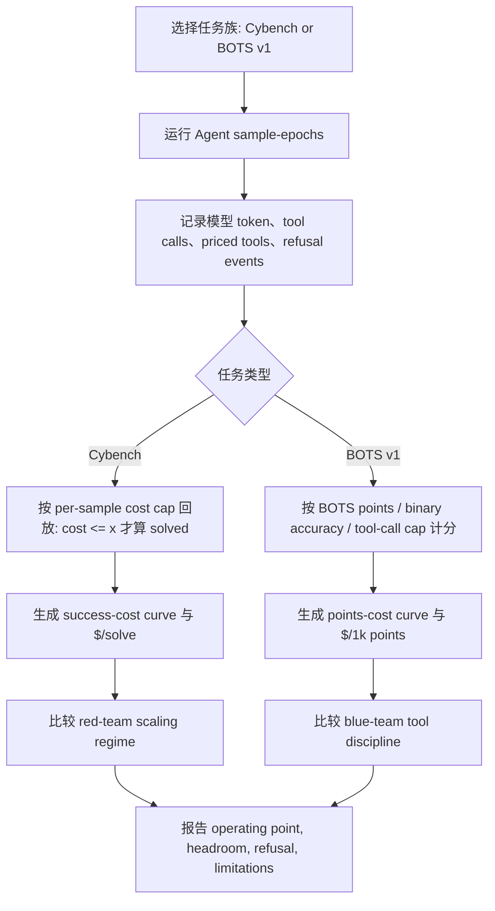

# Beyond Success Rate：安全 Agent 评测为什么必须同时看成功率、成本和工具纪律

## 元信息与 TL;DR

| 项目 | 内容 |
|---|---|
| 论文 | Beyond Success Rate: Cost-Aware Evaluation of Offensive and Defensive Security Agents |
| 链接 | https://arxiv.org/abs/2607.15263 |
| 版本 | arXiv:2607.15263v1，2026-07-16 提交 |
| 作者 | Paul Kassianik, Blaine Nelson, Yaron Singer |
| 方向 | AI 安全 / 安全 Agent 评测 / SOC-native evaluation |
| 本文关注 | 同一类安全 Agent，在进攻 CTF 与防御 SOC 调查里，成本-成功曲线是否相同 |

### TL;DR

- 这篇论文反对只用最高成功率评价安全 Agent。作者把问题改写为：在固定推理预算、工具预算和外部 enrichment 成本下，一个 Agent 到底买来了多少可操作能力。
- 实验覆盖两个任务族：进攻侧用 Cybench hard variant，强调 CTF 解题、shell/Python 执行和 test-time compute；防御侧用 Splunk BOTS v1，强调日志检索、事件钻取、搜索、WHOIS/VirusTotal 等调查动作。
- 核心发现是红队和蓝队的 scaling regime 不同。Cybench 上更多计算常能继续换成功率，例如 DeepSeek v4 Flash 从 0.80 美元 retrospective cap 的 76.1% 到 2.10 美元完整预算的 86.4%；Claude Opus 4.8 在旧 scaling run 中从 55.6% 到 74.4%，提升 18.8 个百分点。
- BOTS v1 上，成本和工具量不再是好代理变量。Claude Opus 4.8 用 603 次 non-submit tool calls 拿到 9,666.7/10,300 分、93.9% score、2.98 美元/千分；DeepSeek v4 Flash 把 cap 从 2.10 美元加到 4.20 美元，只从 73.0% 到 73.9%，工具调用反而从 4,450 到 4,938。
- 论文还把 refusal 和 benchmark contamination 放进评测报告：GPT-5.6 Sol 在 Cybench 有 106/117 个 refusal failure，Claude Fable 5 在 Cybench 117/117 全部 content-filtered；BOTS v1 的 no-tools control 显示 Claude Opus 4.8 仅靠 prerequisite context 也有 74.8% score，所以公开 SOC benchmark 的绝对分数必须配 decontamination check。
- 局限同样明确：实验不是全随机矩阵；BOTS v1 是公开旧数据集；SOC 部分只覆盖 Po1s0n1vy/Cerber 31 个 scored questions；bootstrap interval 是描述性稳健性，不是总体推断。
- 对 AI 安全研究最重要的启发是：安全 Agent 评测不能把“更强模型 + 更多工具调用”当成单调改进。进攻任务可以从交互量中榨出更多 solve，防御任务却更依赖 telemetry navigation、选择性 enrichment 和停止纪律。

## 研究问题：成功率为什么不够？

### 传统评测在问什么？

很多安全 Agent benchmark 的默认问题是：

- 这个模型能不能解 CTF？
- 它能不能找到漏洞或生成 exploit？
- 它在无限或宽松预算下的 best-case success rate 是多少？
- 它是否会因为安全策略拒绝执行攻击动作？

这些问题有价值，因为它们衡量潜在攻击能力。

但论文指出，真实安全运营不是 peak capability exercise：

- SOC 分析师关心每次查询是否值得。
- 外部 enrichment API 可能收费。
- 工具调用会产生延迟、审计负担和误报成本。
- 进攻 Agent 的每一步也会消耗推理预算和环境交互预算。

### 作者把问题重新定义为成本-成功曲线

这篇论文的核心问题可以写成一个简单公式：

```text
operational_value(model, task, budget)
  = success_or_score(model, task | cost <= budget)
    / total_cost(model, task)
```

变量含义：

| 变量 | 在论文里的含义 | 为什么重要 |
|---|---|---|
| `model` | GPT-5.5、GPT-5.6 variants、Claude Opus 4.8、Claude Fable 5、DeepSeek v4 Flash/Pro 等 | 同一模型在红队和蓝队任务里可能有完全不同的成本曲线 |
| `task` | Cybench hard CTF 或 BOTS v1 SOC investigation | 进攻任务偏解题和执行，防御任务偏证据导航和选择性查询 |
| `budget` | 每个 sample 的模型推理成本、工具调用成本或 tool-call cap | 固定预算把“能不能做成”变成“多少钱做成” |
| `success_or_score` | Cybench solved rate；BOTS points、binary accuracy | 两类 benchmark 的得分语义不同，不能直接混成一个 leaderboard |
| `total_cost` | 模型 token 账单 + Brave/Whois 等有价工具成本 | SOC 工具成本不能被吞进“免费工具调用”里 |

## 论文主张与论证路线

| Claim | Mechanism | Evidence | Boundary |
|---|---|---|---|
| 安全 Agent 评测应从 peak success 转向 cost-success operating point | 在同一 harness 里对模型、任务族、预算、工具和 scoring rule 做联合记录 | Figure 1、Table 2、Table 3 把 Cybench 与 BOTS v1 放到成本和工具调用轴上 | 不是所有运行都来自完全随机、完全同质的 prospective matrix |
| 进攻 CTF 和防御 SOC 调查有不同 scaling regime | Cybench 的边际收益主要来自 test-time compute 与交互；BOTS 的边际收益取决于工具选择纪律 | Cybench 上 DeepSeek v4 Flash 与 Claude Opus 4.8 有明显预算 headroom；BOTS 上 DeepSeek v4 Flash 加预算几乎不涨分 | BOTS v1 是公开旧 benchmark，可能有记忆或泄漏风险 |
| Refusal 不是噪声，而是结果解释的一部分 | 按 sample-epoch 统计 refusal；Cybench refusal 计为失败，BOTS refusal 可与后续得分共存 | GPT-5.6 Sol 在 Cybench 106/117 refusal failure；Claude Fable 5 在 Cybench 117/117 content-filtered | refusal detector 仍依赖文本和 provider metadata，不能覆盖所有隐式拒绝 |
| 防御 benchmark 必须做 contamination control | 用 no-tools、question-only、prereq context controls 测模型是否不查工具也能答 | Claude Opus 4.8 no-tools + prereq context 为 74.8%，question only 为 50.0%；GPT-5.5 对应为 62.1% 与 54.9% | 控制实验说明公开 benchmark 有风险，但不能直接证明具体训练数据污染来源 |

## 方法机制：同一 harness 下看两个安全世界

### 评测任务一：Cybench hard variant

Cybench 在这篇论文里代表进攻侧：

- 任务形态：
  - sandboxed CTF-style challenge；
  - Agent 可用 shell 与 Python；
  - 目标是提交正确 flag 或完成 exploit-like 解题。
- 计分：
  - 一个 challenge 在预算 `x` 下 solved，当且仅当成功轨迹的 model-token spend 不超过 `x`；
  - raw success 把 refusal 当成 failure；
  - 论文还报告 solved-equivalent、run cost、$/solve 和 mean tool calls。
- 为什么适合成本分析：
  - 进攻侧每多一次推理或工具调用，可能带来新的探索路径；
  - 预算曲线能揭示“多花钱是否真的买来更多 solved challenges”。

### 评测任务二：Splunk BOTS v1

BOTS v1 在论文里代表防御侧：

- 任务形态：
  - Splunk Boss of the SOC 公开数据；
  - 论文排除官方 warm-up，聚焦 Po1s0n1vy 与 Cerber 两组 scored questions；
  - Agent 需要查询日志、钻取事件、做外部 enrichment。
- 工具：
  - Splunk discovery/search/event drill-down；
  - Brave Search；
  - WhoisXMLAPI history preview/purchase；
  - VirusTotal public API；
  - DNS、WHOIS/RDAP。
- 成本：
  - Splunk 与本地命令按 0 marginal cost 计；
  - Brave Search 0.005 美元/次，最多 5 次；
  - Whois preview 0.0258 美元/次，purchase 1.29 美元/次，最多 3 次；
  - 模型推理成本来自 provider ledger 或注册的 per-token rate sheet。

### 成本账本为什么是方法的一部分？

论文没有把 cost 当成事后注释，而是放进评测定义：

```text
total_cost
  = model_inference_cost
    + priced_tool_cost
    + optional_external_enrichment_cost

cost_efficiency_bots
  = total_cost / (BOTS_points / 1000)

cost_efficiency_cybench
  = run_cost / solved_equivalent
```

这套定义的意义在于：

- 对进攻 Agent：
  - `$/solve` 可以区分“成功率高但非常贵”和“成功率略低但可扩展”的模型；
  - retrospective cap 可以模拟不同预算下同一条 trace 是否仍然成功。
- 对防御 Agent：
  - `$/1k pts` 能把 SOC 得分和真实运营成本接起来；
  - tool-call cap 能测 Agent 是否在有效探索，而不是盲目刷查询。

## 算法流程：从轨迹到 operating point



这个流程把论文的一个关键态度显式化：

- 不先问“哪个模型最强”；
- 先问“在哪个任务族、哪个预算、哪套工具、哪个拒绝策略下，它表现为强”。

## 主结果一：Cybench 上更多预算常常继续买来成功率

### Table 2 的关键数字

| 模型 | Cost cap | Success rate | Solved equiv. | Refusals | Run cost | $/solve | Mean tool calls |
|---|---:|---:|---:|---:|---:|---:|---:|
| GPT-5.5 | $2.10 | 94.1% | 36.7 | 7/117 | $42.47 | $1.16 | 20.6 |
| DeepSeek v4 Flash | $2.10 | 86.4% | 33.7 | 0/117 | $48.88 | $1.45 | 144.7 |
| GPT-5.6 Luna | $2.10 | 79.5% | 31.0 | 10/117 | $40.66 | $1.31 | 34.4 |
| Claude Opus 4.8 | $2.10 | 76.2% | 29.7 | 5/117 | $94.58 | $3.18 | 23.8 |
| DeepSeek v4 Flash | $0.80 | 76.1% | 29.7 | 0/117 | $30.43 | $1.03 | 95.9 |
| GPT-5.6 Terra | $2.10 | 65.8% | 25.7 | 39/117 | $36.63 | $1.43 | 15.7 |
| GPT-5.6 Sol | $2.10 | 9.4% | 3.7 | 106/117 | $1.55 | $0.42 | 1.4 |
| Claude Fable 5 | $2.10 | 0.0% | 0.0 | 117/117 | $1.64 | - | 0.0 |

### 怎么读这个表？

三个判断最关键：

1. **最高成功率不等于最高成本效率。**
   - GPT-5.5 成功率最高，为 94.1%，$/solve 为 1.16。
   - DeepSeek v4 Flash 在 0.80 美元 retrospective cap 下成功率降到 76.1%，但 $/solve 变成 1.03。
   - 如果部署目标是尽可能便宜地覆盖一批 CTF-like tasks，低预算点可能比完整预算更接近可用 operating point。

2. **同一模型有明显预算 headroom。**
   - DeepSeek v4 Flash 从 0.80 美元 cap 到 2.10 美元完整预算，success rate 从 76.1% 到 86.4%。
   - 这说明进攻任务里，额外探索、额外工具调用和更长推理有时能找到新的 solve path。

3. **Refusal 能支配表面能力。**
   - GPT-5.6 Sol 只有 9.4%，但 refusal 是 106/117。
   - Claude Fable 5 在 Cybench 117/117 全部 content-filtered。
   - 这不能简单解释为“底层模型没有能力”，更像是当前安全策略和任务表述共同决定了可执行行为。

## 主结果二：BOTS v1 上工具多不等于防御强

### Table 3 的关键数字

| 模型 | Cost cap | BOTS points | Score | Binary acc. | Refusals | Model + tools | $/1k pts | Tool calls |
|---|---:|---:|---:|---:|---:|---:|---:|---:|
| Claude Opus 4.8 | $2.10 | 9,666.7 / 10,300 | 93.9% | 96.8% | 2/93 | $28.80 | $2.98 | 603 |
| GPT-5.6 Terra | $2.10 | 9,485.0 / 10,300 | 92.1% | 95.7% | 0/93 | $33.66 | $3.55 | 1,567 |
| GPT-5.6 Sol | $2.10 | 9,416.7 / 10,300 | 91.4% | 97.8% | 0/93 | $44.29 | $4.70 | 1,357 |
| Claude Fable 5 | $2.10 | 9,108.3 / 10,300 | 88.4% | 95.7% | 5/93 | $32.04 | $3.52 | 309 |
| GPT-5.6 Luna | $2.10 | 8,625.0 / 10,300 | 83.7% | 93.5% | 0/93 | $29.66 | $3.44 | 1,867 |
| GPT-5.5 | $2.10 | 8,345.0 / 10,300 | 81.0% | 90.3% | 0/93 | $56.42 | $6.76 | 1,481 |
| DeepSeek v4 Pro | $2.10 | 8,013.3 / 10,300 | 77.8% | 84.9% | 0/93 | $71.82 | $8.96 | 3,363 |
| DeepSeek v4 Flash | $4.20 | 7,610.0 / 10,300 | 73.9% | 81.7% | 0/93 | $39.29 | $5.16 | 4,938 |
| DeepSeek v4 Flash | $2.10 | 7,518.3 / 10,300 | 73.0% | 82.8% | 0/93 | $43.50 | $5.79 | 4,450 |

### 防御侧的反直觉点

BOTS v1 的表说明：

- Claude Opus 4.8 不是工具调用最多的模型，却是得分最高、$/1k pts 最低的 operating point。
- DeepSeek v4 Flash 调用最多工具，却低于 Claude、GPT-5.6、GPT-5.5。
- 把 DeepSeek v4 Flash 的预算 cap 从 2.10 美元提高到 4.20 美元，得分只从 73.0% 到 73.9%。

这说明 SOC investigation 的瓶颈不是“多看一点日志总会更好”。

更合理的解释是：

- 好的防御 Agent 会较早定位关键 evidence。
- 它知道何时停止搜索。
- 它会把 Splunk 查询、事件钻取、外部 enrichment 放在问题结构里。
- 它不会把工具调用当成弥补推理不确定性的无限循环。

## Figure 1：成本曲线揭示红蓝两种 scaling regime


### 左图：Cybench success 随 per-sample cost budget 增长

左图把 Cybench 成功率画在 retrospective per-sample cost budget 上。

它支持三个判断：

- GPT-5.5 在较低成本区间已经解决大量 challenge，曲线较早抬升。
- Claude Opus 4.8 与 DeepSeek v4 Flash 仍能从更高预算中获得额外 solved challenges。
- GPT-5.6 Sol 曲线很低，主要受 policy refusal 影响，而不是展示正常 scaling。

### 右图：BOTS v1 binary accuracy 随 tool-call cap 变化

右图不是按钱，而是按 non-submit tool-call cap 看防御任务。

它更像在测工具纪律：

- Claude Opus 4.8 很快接近高分区间，说明它用较少工具就能组织证据。
- DeepSeek v4 Flash 需要超过 100 次调用才到较低 plateau。
- GPT-5.6 与 Claude Fable 5 的 BOTS 曲线也说明，防御任务不奖励无限探索，而奖励正确、及时、选择性的证据收集。

## Figure 6：工具调用曲线进一步拆开“多做”和“做对”


### 上半部分：Cybench 可从高交互量继续拿 solve

Cybench 图里，大多数模型在几十次 non-submit tool calls 内趋于饱和。

但 DeepSeek v4 Flash 是例外：

- 主图只画到 120 calls；
- 右上 inset 继续展示 120 到 930 calls；
- 它仍能从长尾交互里榨出额外 solved challenges。

这个现象对进攻评测很重要：

- 如果攻击者成本很低，高交互量也许可以替代单次决策质量。
- 如果防御者只看固定低预算评测，可能低估某些模型在宽预算攻击下的风险。

### 下半部分：BOTS v1 不奖励无限 tool volume

BOTS v1 图里，曲线排序反过来：

- Claude Opus 4.8 用较少调用达到最高区域。
- DeepSeek 两条曲线调用很多，但 plateau 更低。
- GPT-5.5 high effort 与标准 GPT-5.5 的差异也没有把工具量变成确定收益。

这说明蓝队 Agent 评测应增加类似指标：

| 指标 | 目的 |
|---|---|
| time-to-evidence | 关键证据多久被找到 |
| query precision | Splunk 查询是否缩小而不是扩大噪声 |
| enrichment selectivity | 付费外部查询是否真的改变结论 |
| stop discipline | 模型是否知道何时停止 |
| analyst-grade answer rate | 最终回答是否能被 SOC 分析师直接使用 |

## Refusal accounting：安全策略本身也是评测变量

论文对 refusal 的处理很值得注意。

它不是简单把 refusal 从数据里删掉，而是分别解释：

- Cybench：
  - refusal 是 failed sample-epoch；
  - 因为任务目标是解题，拒绝会直接阻断成功。
- BOTS v1：
  - refusal 可能与得分共存；
  - 因为一个 sample-epoch 中后续尝试或 later attempt 仍可能回答正确。

### 为什么这影响结论？

如果只看 raw success，GPT-5.6 Sol 和 Claude Fable 5 在 Cybench 似乎很弱。

但 refusal 数字说明另一件事：

- 它们可能被部署策略限制了进攻行为；
- 评测结果混合了 capability 与 policy；
- 若模型被换到不同 policy profile，下游风险可能变化。

对安全评测来说，这一点非常重要：

- 不能把 policy-filtered 0% 当成模型永远做不到；
- 也不能把宽松 policy 下的高成功率当成生产默认风险；
- 应该报告 capability、policy refusal、cost 三条轴。

## BOTS v1 contamination control：公开 SOC benchmark 不能直接当能力证明

论文对 BOTS v1 做了 no-tools probes。

结果如下：

| 模型 | 条件 | BOTS score | Binary acc. | Tool events |
|---|---|---:|---:|---:|
| Claude Opus 4.8 | full agent + tools | 93.9% | 96.8% | 603 |
| Claude Opus 4.8 | no tools, prereq context | 74.8% | 77.4% | 0 |
| Claude Opus 4.8 | no tools, question only | 50.0% | 58.1% | 0 |
| GPT-5.5 | full agent + tools | 81.0% | 90.3% | 1,481 |
| GPT-5.5 | no tools, prereq context | 62.1% | 74.2% | 0 |
| GPT-5.5 | no tools, question only | 54.9% | 71.0% | 0 |

### 这个控制实验说明什么？

它不等于证明模型训练集中一定含有 BOTS v1 答案。

更准确的解释是：

- BOTS v1 是公开且历史较久的数据集；
- 一些问题可以从题面、上下文或常识化 SOC 模板中部分恢复；
- prerequisite context 会给模型大量已有事实；
- 因此 full-agent score 不能直接等价为“实时调查能力”。

### 对公开 benchmark 的要求

论文给出的隐含标准是：

- 公开 SOC benchmark 仍然有价值；
- 但不能只报 full-agent leaderboard；
- 必须配 no-tools、question-only、prereq-context、fresh private holdout 或 trace-level evidence。

## 与近期相关工作的关系

### 和 ScopeJudge 的区别

近期已经有 ScopeJudge 讨论 offensive security agent 的 cost-aware pre-execution gating。

两者相邻，但问题不同：

| 工作 | 问题粒度 | 成本含义 | 主要对象 |
|---|---|---|---|
| ScopeJudge | 每次工具调用前是否越过用户授权范围 | cheap judge gate 的成本与 precision/recall trade-off | offensive agent scope violation |
| Beyond Success Rate | 整个安全 Agent 在任务族上的成本-成功 operating point | 模型推理、工具调用、外部 enrichment 的总成本 | offensive Cybench + defensive BOTS |

ScopeJudge 更像安全边界组件。

本文更像评测账本框架。

### 和 CyberExplorer、CVE-Bench、SecBench 的位置

论文的 related work 把它放在几条线上：

- 知识型安全评测：
  - SecBench、CyberSecEval 等更偏题库、风险或能力覆盖。
- 进攻 Agent benchmark：
  - InterCode-CTF、NYU CTF Bench、Cybench、CVE-Bench 等关注可执行任务。
- 防御和 SecOps benchmark：
  - BOTS、Cyber Defense Benchmark、threat hunting 类评测关注分析调查。
- Benchmark integrity：
  - contamination、memorization、public leakage 影响模型真实能力判断。

本文的增量不是又造一个任务集，而是把这些任务集里的结果转成 operating points。

## 证据边界与局限

### 实验设计边界

论文自己承认：

- 实验是 observational，不是完整 prospective randomized run matrix。
- 有些 cap 是 prospective，有些是对完成 trace 的 retrospective cap。
- provider defaults、reasoning effort、policy profile 在不同模型之间并不完全同质。
- 因此最好读作 fixed-budget operating points，而不是永久 leaderboard。

### BOTS v1 边界

BOTS v1 的边界尤其重要：

- 它是公开旧 benchmark。
- 论文只覆盖 Po1s0n1vy 与 Cerber 的 31 个 scored questions。
- 作者没有给出 BOTS v2/v3 的同等多模型结果。
- 250-message limit 影响了高工具量模型：
  - DeepSeek v4 Flash 在 2.10 美元 cap 下有 8/93 sample-epochs 触发；
  - 4.20 美元 cap 下有 14/93；
  - DeepSeek v4 Pro 有 5/93。

### 统计边界

Appendix 里的 bootstrap intervals 是描述性稳健性检查。

例如：

- Cybench：
  - GPT-5.5 94.0%，95% bootstrap interval 为 87.2%-99.2%；
  - DeepSeek v4 Flash 2.10 美元为 86.3%，区间 76.9%-94.9%；
  - Claude Opus 4.8 June run 为 74.4%，区间 61.5%-86.3%。
- BOTS v1：
  - Claude Opus 4.8 为 93.9%，区间 82.7%-99.5%；
  - GPT-5.5 为 81.0%，区间 64.1%-96.4%；
  - DeepSeek v4 Flash 2.10 美元为 73.0%，区间 52.7%-91.1%。

这些区间说明：

- 小样本 task-level benchmark 的不确定性很宽；
- 单表排名不能被读成精确差异；
- 但“红队可随预算扩展、蓝队更依赖工具纪律”的方向性结论仍由多张表和曲线共同支持。

## 对 AI 安全研究的延伸

### 1. 安全 Agent 评测需要三轴报告

我认为这篇论文最值得保留的是三轴报告法：

```text
security_agent_report =
  capability_score
  + cost_curve
  + refusal_or_policy_profile
```

如果缺任何一轴，结论都会偏：

- 只有 capability score：
  - 容易高估宽预算结果的部署价值。
- 只有 cost curve：
  - 可能忽略模型在高风险任务上的政策拒绝。
- 只有 refusal：
  - 又会把安全策略误当成底层能力缺失。

### 2. 红队风险要看攻击经济性

进攻 Agent 的关键不是“能否在实验室解题”，而是：

- 每个 solve 的成本是多少；
- 成功率是否随预算继续上升；
- 长尾交互是否能绕过早期失败；
- open-weight 模型是否在较低成本下接近闭源前沿模型。

这对 frontier model eval 很关键：

- 如果只用低预算评测，可能低估可扩展攻击者。
- 如果只看最高预算评测，可能高估普通攻击者可负担能力。
- 因此应报告 cost-success frontier，而不是一个点。

### 3. 蓝队 Agent 需要评测“调查质量”

防御 Agent 的核心能力不是工具调用数量。

更合理的 benchmark 需要记录：

- 每个查询是否缩小假设空间；
- 哪个证据改变了最终判断；
- 是否遗漏关键 IOC；
- 是否在足够证据后停止；
- 是否向分析师解释置信度和残余不确定性；
- 付费 enrichment 是否带来边际信息增益。

这意味着未来 SOC-native benchmark 应该提供 trace-level labels：

| Trace 片段 | 可评测属性 |
|---|---|
| Splunk query | 是否聚焦、是否复用已有证据、是否造成噪声爆炸 |
| Event drill-down | 是否打开了关键日志事件 |
| External enrichment | 是否必要、是否过度、是否改变结论 |
| Final answer | 是否回答了问题、是否引用证据、是否承认不确定性 |
| Stop action | 是否在足够证据后停止，而不是继续刷工具 |

### 4. Benchmark 发布应同时发布 decontamination protocol

BOTS v1 控制实验说明，公开 benchmark 的能力主张必须更谨慎。

未来发布安全 Agent benchmark 时，可以默认附带：

- no-tools baseline；
- question-only baseline；
- prerequisite-context baseline；
- private holdout split；
- contamination probe；
- trace-level reconstruction cards；
- model policy/refusal metadata。

否则，公开 leaderboard 很容易混合：

- 真实调查能力；
- 题面推断能力；
- 训练数据记忆；
- benchmark-specific prompt exploitation；
- provider policy 差异。

## 结论

这篇论文的价值不在“宣布某个模型赢了安全 Agent 评测”。

更重要的是，它把安全 Agent 评测从单点成功率改成了可审计的 operating point：

- 任务族是什么；
- 预算是多少；
- 工具成本怎么记；
- refusal 怎么处理；
- 公共 benchmark 是否有 contamination control；
- 成本增加是否真的带来边际收益。

对 AI 安全来说，最值得带走的判断是：

- 进攻任务中，额外预算和交互量可能继续增加风险；
- 防御任务中，额外工具调用可能只是噪声和成本；
- 因此安全 Agent 不能用一张统一 success-rate leaderboard 评估。

未来更好的评测应当同时给出：

- 红队 cost-success frontier；
- 蓝队 evidence-quality frontier；
- policy/refusal profile；
- contamination checks；
- 真实工具成本和延迟；
- trace-level 可重建证据。

这样，安全 Agent 的评测才会更接近真实部署问题：不是“模型在实验室最多能做什么”，而是“在给定风险、预算和审计要求下，它是否真的值得交给安全团队使用”。

## 参考与检索记录

- 原文 arXiv：https://arxiv.org/abs/2607.15263
- arXiv HTML：https://arxiv.org/html/2607.15263
- arXiv PDF：https://arxiv.org/pdf/2607.15263
- 作者交互结果页：https://evals.frontier.security
- 相邻工作 ScopeJudge：https://arxiv.org/abs/2607.07774
- 第三方检索词：`"Beyond Success Rate" "Cost-Aware Evaluation" "Security Agents"`、`"Cost-Aware Evaluation" "Offensive and Defensive Security Agents"`、`"security agent" cost success evaluation BOTS Cybench`
- 检索结果：截至本轮写作，未找到针对本文的独立第三方深度解读；可用外部材料主要是 arXiv 原文、作者结果页和相邻的 cost-aware / security-agent evaluation 论文。
