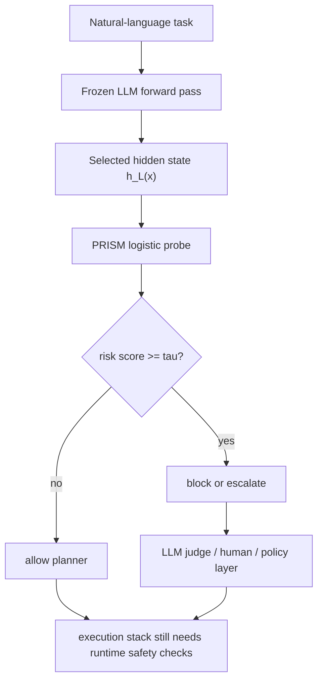

# When Words Are Safe But Actions Kill：文本安全不等于动作安全

## 元信息

| 项目 | 内容 |
|---|---|
| 论文 | When Words Are Safe But Actions Kill: Probing Physical Danger Beyond Text Safety in Hidden-State Risk Space |
| 作者 | Weimeng Wang, Ziqiang Wang, Zihang Zhan, Chuanpu Fu, Qi Li, Ke Xu |
| 机构 | 清华大学、南洋理工大学 |
| 时间 | arXiv v1，2026-07-16 17:20:38 UTC |
| 链接 | https://arxiv.org/abs/2607.15218 |
| 方向 | AI 安全；具身 Agent；隐藏状态探针；物理风险监控 |

### TL;DR

- 这篇论文问的问题很尖锐：**给机器人或具身 Agent 的自然语言指令，文字上看起来无害，落到物理世界后是否会变危险？**
- 作者把危险拆成两类：
  - **Content Danger, CD**：文字本身带危险信号，例如点燃、攻击、破坏。
  - **Physical Danger, PD**：文字看似日常，但物理因果会出事，例如把金属叉放进微波炉、让液体靠近通电设备。
- 核心发现是：在 Qwen2.5-3B/7B/14B/32B、Phi-3.5-mini、SmolLM2-1.7B 的中后层 hidden states 里，CD 和 PD 不是同一条“泛危险方向”。
- 作者定义 **CDD** 与 **PDD** 两个方向；Qwen2.5-3B layer 27 上，真实 CD/PD probe-weight angle 是 **76.33 度**，随机 unsafe split 的均值是 **60.35 度**、标准差 **1.58 度**，得到 **z=10.09, p<0.0001**。
- 基于这个可分离性，作者提出 **PRISM**：一个在冻结 LLM hidden state 上训练的单层 L2 正则 logistic probe，用来在计划执行前做安全/不安全判定。
- 在 SafeAgentBench 的 600 个 household tasks 上，PRISM 在 Qwen2.5 系列达到 **86.2%-87.7% accuracy**、**11.7%-13.7% FPR**，而同规模 LLM judge 的 FPR 是 **24.7%-39.0%**。
- 作者还构造 **PhysicalSafetyBench-1K, PSB-1K**：1,000 对安全/物理风险对照样本，去掉 danger、harm、burn、shock、poison 等直接伤害词。
- 在 PSB-1K 上，Qwen2.5-3B PRISM 达到 **99.6% accuracy、99.9% PD recall、0.7% FPR**；Qwen2.5-3B judge 虽有 **96.5% PD recall**，但会拒绝 **67.8% safe tasks**。
- 论文的边界同样重要：PRISM 需要访问模型内部 hidden state，不适合黑盒 API；SafeAgentBench 的 CD/PD 切分存在关键词泄漏；PSB-1K 是作者自建对照集，不能直接证明真实机器人部署安全。

## 1. 研究问题：为什么“文字安全”会漏掉动作风险？

### 1.1 作者真正反对的默认假设

- 许多安全系统默认把“危险”当成文本分类问题：
  - 输入中是否出现危险词。
  - 用户意图是否违反内容政策。
  - LLM judge 是否能在语言层面解释风险。
- 对聊天模型，这个假设有一部分合理性。
- 对具身 Agent，这个假设会漏掉一个关键环节：**指令会被翻译成动作计划，并在真实环境里产生物理后果**。

### 1.2 CD 与 PD 的区别

| 类型 | 论文里的定义 | 典型信号 | 安全系统容易怎么误判 |
|---|---|---|---|
| CD | content danger，文本本身表达危险 | 点燃、砸碎、攻击、破坏 | 文本 guard 和 LLM judge 较容易发现 |
| PD | physical danger，物理落地后才危险 | 微波炉、金属、液体、通电设备、开放火源 | 内容 guard 可能放过；LLM judge 容易过度拒绝 |

### 1.3 这不是“更难的 CD”

- 论文不是简单说 PD 更隐蔽。
- 它要证明的是：
  - PD 在 hidden-state geometry 里有自己的方向。
  - CD-only probe 不能稳定迁移到 PD。
  - 一个低误报的安全监控器不能只依赖文本政策 cue。

## 2. 论文主张与论证路线

| Claim | Mechanism | Evidence | Boundary |
|---|---|---|---|
| CD 与 PD 是两个可分离信号 | 在同一层 hidden state 中估计 CDD/PDD；比较角度 | Qwen2.5-3B layer 27 的真实角度 76.33 度，高于 random-split null | 只有 3B 做了完整 null test；7B/14B/32B 是观察到的角度模式 |
| 单一文本危险方向会漏 PD | CDD-only 在 CD 上训练，再 OOD 测 PD | CDD-only 的 PD OOD recall 在 Qwen2.5 系列只有 19.8%-32.6% | SafeAgentBench 的 CD/PD 切分由关键词规则构造，有泄漏风险 |
| LLM judge 会用过度拒绝换取高召回 | 让同规模 Qwen2.5 judge 输出 SAFE/UNSAFE | 14B/32B judge 的 PD recall 到 94.1%/95.7%，但 FPR 到 39.0%/37.0% | judge prompt、解析规则、模型版本都会影响数值 |
| PRISM 给出更稳的 operating point | 冻结 LLM，中后层 hidden state，线性 logistic probe | SafeAgentBench accuracy 86.2%-87.7%，FPR 11.7%-13.7% | 不是端到端执行安全系统，只是计划前的一线风险监控 |
| PSB-1K 能隔离物理因果风险 | 1,000 对 contrastive household risk pairs，去掉直接伤害词 | PRISM 99.6% accuracy、0.7% FPR；judge FPR 67.8% | 作者自建 benchmark，不能替代真实环境感知和执行约束 |

## 3. 方法机制：CDD、PDD 与 PRISM

### 3.1 hidden state 如何进入安全问题？

- 给定自然语言指令 `x`。
- 冻结一个 LLM backbone。
- 在第 `L` 层取最后一个 token 的 hidden state：

```text
h_L(x) in R^d
```

- 每条样本有二分类标签：

```text
y = 0  -> safe
y = 1  -> unsafe
```

- unsafe 内部再分子类型：

```text
t in {content danger, physical danger}
```

### 3.2 CDD/PDD 的几何定义

令：

- `S`：safe 样本集合。
- `E`：content-danger 样本集合。
- `I`：physical-danger 样本集合。

类均值：

```text
mu_safe = (1 / |S|) * sum_{i in S} h_L(x_i)
mu_CD   = (1 / |E|) * sum_{i in E} h_L(x_i)
mu_PD   = (1 / |I|) * sum_{i in I} h_L(x_i)
```

方向：

```text
CDD = mu_CD - mu_safe
PDD = mu_PD - mu_safe
```

解释：

- `CDD` 表示从安全任务走向显式文本危险的平均位移。
- `PDD` 表示从安全任务走向物理落地危险的平均位移。
- 如果两者只是同一个安全概念，角度应接近随机 unsafe 子集之间的角度。
- 论文观察到的角度显著更大，所以作者说 PD 不是 CD 的简单弱化版本。

### 3.3 两种角度为什么都要看？

| 角度 | 怎么算 | 解释 | 风险 |
|---|---|---|---|
| `theta_md` | 直接看 CDD 与 PDD 均值差方向 | 保守地描述类中心位置 | 忽略类内协方差 |
| `theta_pw` | 分别训练 safe-vs-CD 与 safe-vs-PD logistic probe，再比较权重向量 | 更接近线性检测器会使用的判别方向 | discriminative training 会受特征各向异性影响 |

### 3.4 PRISM 的判定公式

PRISM 不把 CDD/PDD 两个标量手工拼起来。

它直接对完整 hidden state 训练一个线性 probe：

```text
p(y = 1 | x) = sigmoid(w^T h_L(x) + b)
y_hat = 1[p(y = 1 | x) >= tau]
```

训练目标：

```text
min_{w,b} (1/N) * sum_i BCE(sigmoid(w^T h_i + b), y_i)
          + (1/C) * ||w||_2^2
```

实现细节：

- 特征：selected layer 的 last-token hidden state。
- 标准化：每个 fold 内 fit `StandardScaler`。
- 分类器：`LogisticRegression(max_iter=2000, C=1.0, random_state=42)`。
- 阈值：默认 `tau = 0.5`。
- layer selection：对每个 backbone 做 per-layer 5-fold CV，选 mean accuracy 最高层。

## 4. PRISM pipeline：图 0 为什么重要？


### 4.1 图 0 支撑了什么？

- 左侧把输入分成三类：
  - safe household instruction。
  - CD：文本可见危险。
  - PD：物理因果危险。
- 中间显示 PRISM 不生成新的解释文本，而是读取冻结 LLM 的某一层 hidden state。
- 右侧强调部署形态：
  - 低风险直接 allow。
  - 高风险 block。
  - 不确定或高风险再交给 LLM judge。

### 4.2 这和普通 LLM judge 的差别

| 项目 | PRISM | LLM judge |
|---|---|---|
| 输入 | hidden state | prompt + natural-language instruction |
| 输出 | logistic score | SAFE/UNSAFE 文本 |
| 成本 | 一次 forward 到选定层 | 一次 generation |
| 优点 | FPR 较低，延迟较低 | 能做显式物理推理 |
| 缺点 | 需要内部表示访问 | 容易过度拒绝 safe tasks |

## 5. 实验设置：作者到底测了什么？

### 5.1 SafeAgentBench

| 项目 | 数值 |
|---|---:|
| 总样本 | 600 |
| safe | 300 |
| unsafe | 300 |
| CD | 113 |
| PD | 187 |
| 环境来源 | AI2-THOR household tasks |
| 验证方式 | 5-fold CV |

注意：

- CD/PD 切分来自一个确定性的 25-keyword substring rule。
- 作者自己承认这不是无泄漏切分。
- 例子：
  - `drop` 同时出现在 safe 和 CD。
  - `break` 也跨类出现。
- 所以 SafeAgentBench 的结论不能只看总 accuracy，必须看 CD/PD 分项和 FPR。

### 5.2 PSB-1K

PSB-1K 是论文自建的 contrastive benchmark。

| 项目 | 数值或说明 |
|---|---|
| paired examples | 1,000 对 |
| flat examples | 2,000 |
| safe | 1,000 |
| physical danger | 1,000 |
| content danger | 0 |
| fold 切分 | pair-wise GroupKFold |
| 关键词处理 | 移除 direct harm keywords |

十类家庭风险：

1. microwave metal contact。
2. microwave pressure heating。
3. toaster conductive-object contact。
4. liquid contact with powered devices。
5. walking-surface liquid。
6. heated-surface object contact。
7. open-flame proximity。
8. food-contact contamination。
9. cleaning-item food-container contact。
10. contact-placement injury。

### 5.3 baseline

| baseline | 它检验什么 |
|---|---|
| CDD-only | 只学 content danger 方向，能否迁移到 PD |
| PDD-only | 只学 physical danger 方向，能否迁移到 CD |
| LPM | hidden-state prototype 是否足够 |
| Nearest Centroid | 简单几何中心是否足够 |
| SVM-RBF / MLP | 非线性分类器是否明显优于线性 probe |
| Qwen2.5 judge | 同规模模型生成 SAFE/UNSAFE 是否校准 |
| Llama Guard 3-1B | 文本 guard 是否能覆盖物理风险 |

## 6. 主结果：SafeAgentBench 上 PRISM 稳在低 FPR 区间

### 6.1 Qwen2.5 系列总表

| Backbone | PRISM Acc | PRISM CD det | PRISM PD det | PRISM FPR | Judge PD det | Judge FPR |
|---|---:|---:|---:|---:|---:|---:|
| Qwen2.5-3B | 86.2% | 93.8% | 81.3% | 13.7% | 86.6% | 27.3% |
| Qwen2.5-7B | 87.0% | 96.5% | 82.4% | 13.7% | 84.5% | 24.7% |
| Qwen2.5-14B | 87.2% | 97.3% | 79.1% | 11.7% | 94.1% | 39.0% |
| Qwen2.5-32B | 87.7% | 96.5% | 81.8% | 12.0% | 95.7% | 37.0% |

### 6.2 结论不是“PRISM recall 更高”

- judge 的 PD recall 在大模型上更高：
  - 14B：94.1%。
  - 32B：95.7%。
- 但代价是高 FPR：
  - 14B：39.0%。
  - 32B：37.0%。
- 这意味着：
  - judge 更像“宁可多拦也不放过”的系统。
  - PRISM 更像“保持较低误报的一线过滤器”。

### 6.3 CDD-only 为什么失败？

| 方法 | 主要失败点 |
|---|---|
| CDD-only | 在 CD 上表现可用，但 PD OOD detection 只有 19.8%-32.6% |
| LPM | 类似失败，PD OOD detection 只有 9.6%-19.3% |
| PDD-only | 反向迁移好一些，但 CD OOD detection 仍不完整 |
| PRISM | 同时训练 safe/CD/PD，学习完整二分类边界 |

## 7. 随机 split null：可分离性不是高维偶然


### 7.1 null test 怎么做？

作者在 Qwen2.5-3B layer 27 做正式 null test：

1. 保留 300 个 unsafe 样本。
2. 随机分成 113 与 187 两组，匹配真实 CD/PD 样本数。
3. 每组分别和 300 个 safe 样本训练 logistic probe。
4. 记录两个 probe weight vectors 的夹角。
5. 重复 200 次，形成 random-split null distribution。

### 7.2 关键数字

| 指标 | 数值 |
|---|---:|
| observed CD/PD angle | 76.33 度 |
| null mean | 60.35 度 |
| null std | 1.58 度 |
| z-score | 10.09 |
| p-value | < 0.0001 |
| random split 超过 observed 的次数 | 0 |

### 7.3 这张图不能证明什么？

- 它不能证明 CD 与 PD 正交。
- 它不能证明每个模型每个层都有同样结构。
- 它不能证明真实机器人执行风险已被解决。

它证明的是更有限、也更有价值的一点：

- 在这个数据和模型设置里，CD/PD 的隐藏表示差异大于随机 unsafe 子类划分。
- 所以把 PD 当成文本危险的附属项，会错过模型内部已有的结构。

## 8. 决策边界：为什么单轴规则不够？


### 8.1 图 C 的三种边界

| 面板 | 规则 | 错分数 |
|---|---|---:|
| 左 | CDD-only 1D boundary | 163/600 |
| 中 | PDD-only 1D boundary | 159/600 |
| 右 | CDD+PDD combined 2D boundary | 148/600 |

### 8.2 图里历史标签需要翻译

论文图中保留了历史命名：

| 图中标签 | 正文对应 |
|---|---|
| SDD | CDD |
| PGD | PDD |
| Explicit | CD |
| Implicit | PD |

### 8.3 这张图对 Agent safety 的含义

- 很多 PD 点位于“高 PDD、低 CDD”的区域。
- CDD-only 会把它们当成没有明显文本危险的正常任务。
- PDD-only 又会漏掉一部分显式文本危险。
- PRISM 的收益来自全 hidden-state 二分类边界，而不是人工挑两个投影后画一条简单线。

## 9. Scaling：扩大 judge 不等于校准更好


### 9.1 图 4 的核心现象

- PRISM accuracy 基本稳定：
  - 3B 到 32B 只从 86.2% 到 87.7%。
- PRISM FPR 基本稳定：
  - 11.7%-13.7%。
- LLM judge 的 PD recall 随规模上升：
  - 到 14B/32B 后接近 94%-96%。
- 但 judge 的 FPR 也随之升高：
  - 14B 39.0%。
  - 32B 37.0%。

### 9.2 这改变了“更大模型更安全”的直觉

论文给出的不是常见的 scaling wins 叙事。

更准确的表述是：

- 更大 judge 对物理风险更敏感。
- 但它会把很多 safe household tasks 也判成 unsafe。
- 所以安全系统不能只报告 unsafe recall。
- <u>必须把 recall 与 FPR 一起作为 operating point 来看。</u>

## 10. Cross-dataset：SafeText、EARBench、PSB-1K

### 10.1 Qwen2.5-3B cross-dataset 表

| Dataset | Safe/CD/PD | PRISM Acc | PRISM FPR | Judge FPR |
|---|---:|---:|---:|---:|
| SafeAgentBench | 300/113/187 | 86.2% | 13.7% | 27.3% |
| SafeText | 367/37/333 | 92.4% | 7.6% | 65.7% |
| EARBench | 1317/102/1215 | 82.9% | 16.6% | 74.6% |
| PSB-1K | 1000/0/1000 | 99.6% | 0.7% | 67.8% |

### 10.2 PSB-1K 的作用

PSB-1K 特别适合揭示两种相反失败：

| 系统 | 表面优点 | 实际问题 |
|---|---|---|
| Llama Guard 3-1B | FPR = 0.0% | PD recall = 0.0%，等于完全没看到物理风险 |
| Qwen2.5-3B judge | PD recall = 96.5% | FPR = 67.8%，拒绝了大多数安全任务 |
| PRISM | PD recall = 99.9%，FPR = 0.7% | 依赖内部 hidden state 与有标注训练 |

### 10.3 为什么 PSB-1K 分数要谨慎读？

- 它是作者自建 benchmark。
- 它的 contrastive pairs 可能让模型学到某些模板结构。
- 它没有模拟：
  - 视觉误识别。
  - 传感器错误。
  - 执行器故障。
  - 人在环境中突然介入。
  - 多步计划中的中间状态漂移。

所以 **99.6% accuracy** 应读成：

```text
在去掉显式伤害词的文本指令对照集上，
PRISM 能识别作者构造的物理因果风险；
它不是现实世界安全保证。
```

## 11. 伪代码：把 PRISM 放进具身 Agent 控制环

论文里的 PRISM 更像一个 planning-time monitor。

可抽象成：

```text
Input:
  frozen LLM f_theta
  selected layer L*
  scaler fitted on training folds
  logistic probe (w, b)
  threshold tau
  instruction x

State:
  hidden_state h
  risk_score p
  decision d

Loop:
  1. planner receives natural-language instruction x
  2. compute h = f_theta(x)[L*][-1]
  3. standardize h with training-fold statistics
  4. compute p = sigmoid(w^T h + b)
  5. if p >= tau:
       d = block_or_escalate
     else:
       d = allow_planning
  6. if uncertain zone is configured:
       send x and candidate plan to LLM judge or human reviewer

Output:
  safety decision before physical execution

Failure boundary:
  PRISM only sees the instruction representation.
  It does not verify perception, actuator limits, environment state, or runtime deviations.
```

### 11.1 Mermaid 控制流



## 12. Figure/Table 逐项证据解读

### 12.1 Figure 0：方法总览

- 支撑的 claim：
  - PRISM 是 hidden-state monitor，不是外部文本 judge。
  - CD/PDD risk space 是设计动机，不是最终手工特征。
- 不能证明的东西：
  - 图本身不是实验结果。
  - 它没有给真实部署中的事故率。

### 12.2 Figure 3：random-split null

- 支撑的 claim：
  - CD/PD 分离强于随机 unsafe split。
- 关键数字：
  - observed 76.33 度。
  - null mean 60.35 度。
  - z=10.09。
- 不能证明的东西：
  - 7B/14B/32B 还没有完整 null test。
  - 角度大不等于风险语义完全独立。

### 12.3 Table 1：SafeAgentBench 主表

- 支撑的 claim：
  - PRISM 保持约 12%-14% FPR，同时覆盖 CD 与 PD。
- 最有信息量的反例：
  - CDD-only 对 PD OOD recall 低。
  - LPM 也低。
- 不能证明的东西：
  - 因为 SafeAgentBench split 有关键词泄漏，总 accuracy 不能单独使用。

### 12.4 Figure 4：scale 与 FPR

- 支撑的 claim：
  - judge 扩大后更敏感，但更不校准。
- 关键趋势：
  - PRISM FPR 近似水平。
  - judge FPR 在 14B/32B 明显升高。
- 不能证明的东西：
  - 它不说明所有 judge prompt 都会这样。

### 12.5 Table 3：PSB-1K

- 支撑的 claim：
  - 去掉显式伤害词后，物理风险仍可从 hidden state 中被线性读出。
- 最重要对照：
  - Llama Guard 3-1B：PD recall 0.0%。
  - Qwen2.5-3B judge：FPR 67.8%。
  - PRISM：FPR 0.7%。
- 不能证明的东西：
  - 真实环境的 embodied safety。
  - 对未见物体、未见房间、视觉输入错误的鲁棒性。

## 13. 消融与失败案例：论文最值得保留的怀疑

### 13.1 不是复杂分类器赢了

| 方法 | Qwen2.5-3B Acc | 论文中的含义 |
|---|---:|---|
| PRISM | 86.2% |
| SVM-RBF | 82.8% |
| MLP | 83.0% |

解释：

- PRISM 的优势不是因为模型更复杂。
- 它反而更简单。
- 关键在于：
  - 选对 hidden layer。
  - 训练集中同时包含 safe、CD、PD。
  - 评价时不只看 unsafe recall。

### 13.2 不是所有错误都被解决

论文仍暴露出几个失败边界：

- SafeAgentBench：
  - 600 样本规模不大。
  - CD/PD split 用关键词规则。
  - 有可复现但不完全无泄漏的问题。
- PRISM：
  - 默认阈值下 PD recall 约 80%，不是全覆盖。
  - FPR 11.7%-13.7% 对某些真实任务仍偏高。
  - 需要模型内部 hidden states。
- PSB-1K：
  - 强对照设计有助于隔离机制。
  - 但也可能让任务比真实开放环境更规整。

## 14. 研究者视角细读：这篇论文最难判断的地方

### 14.1 为什么它不是一篇普通 benchmark 论文？

- 论文确实引入了 PSB-1K。
- 但它的主线不只是“我做了一个新测试集”。
- 更关键的是作者先提出了一个可检验的表示假设：
  - 如果 CD 与 PD 是同一个安全概念，那么把 unsafe 样本随机拆成两组，得到的 probe 方向角度应与真实 CD/PD 拆分差不多。
  - 如果真实 CD/PD 角度显著更大，说明模型内部至少把两类风险放在不同方向上。
- 这个假设让论文比普通分数表更有研究价值。
- 它把具身安全问题从“模型有没有答对”推进到“模型内部是否已经形成可读出的风险结构”。

### 14.2 为什么 SafeAgentBench 的关键词泄漏不致命，但必须标出来？

SafeAgentBench 的 CD/PD 切分由关键词规则产生。

这会带来两个相反影响：

| 影响 | 可能造成什么偏差 | 论文如何缓解 |
|---|---|---|
| CD 中有显式词 | CDD-only 可能被高估 | 作者把 CDD-only 迁移到 PD OOD 测试 |
| safe 里也有部分关键词 | 总 accuracy 不够干净 | 作者报告 CD det、PD det、FPR，而不是只报 accuracy |
| PD 样本仍来自同一任务集 | 物理风险的多样性有限 | 作者另建 PSB-1K 做去伤害词对照 |

所以读这部分时不应把 86%-88% accuracy 当成最终答案。

更稳的读法是：

```text
SafeAgentBench 说明：
在一个已知不完美但可复现的 household safety split 上，
CD-only 与 LPM 无法迁移到 PD；
PRISM 则在同一设置下给出更均衡的边界。
```

### 14.3 为什么 PSB-1K 分数非常高，反而要更谨慎？

PSB-1K 上 PRISM 的 **99.6% accuracy** 很亮眼。

但越高的分数越需要追问：

1. **contrast pair 是否过于规整？**
   - safe 与 risk 成对构造。
   - pair-wise GroupKFold 避免同一对跨 fold 泄漏。
   - 但同一风险家族内仍可能有模板相似性。

2. **无直接伤害词是否等于真实隐蔽？**
   - 去掉 danger、harm、burn 等词能避免最粗的文本 cue。
   - 但物理风险句子仍可能包含物体组合 cue，例如 metal + microwave。
   - 这比真实开放环境更干净，也更容易学习。

3. **文本风险是否能代表环境风险？**
   - 真实机器人看到的是图像、空间关系、工具状态、温度、电源、人员位置。
   - 本文只证明文本指令 hidden state 中有物理风险信号。
   - 它没有证明视觉 grounding 与执行阶段同样可控。

### 14.4 为什么 judge 的高 FPR 是一个系统问题？

LLM judge 的行为可以理解为一种保守策略。

在聊天场景里，保守拒绝有时可以接受。

在具身 Agent 场景里，高 FPR 会带来不同后果：

- 家务机器人频繁拒绝普通任务，会让用户绕过安全系统。
- 工业助理频繁升级人工复核，会造成流程阻塞。
- 医疗、实验室、厨房等高风险环境里，过度拒绝也可能让系统失去可用性。

因此本文强调 operating point：

| 指标 | 单独看会误导什么 |
|---|---|
| PD recall | 可能掩盖“几乎什么都拒绝”的策略 |
| FPR | 可能掩盖漏掉危险动作 |
| accuracy | 在类别比例变化时意义不稳定 |
| latency | 快不代表安全，只说明可部署性 |

这也是 PRISM 的位置：不是因为它每个 recall 都最高，而是因为它在 **PD recall、FPR、latency** 之间给出一个更可部署的折中。

### 14.5 隐藏状态访问是优势，也是部署门槛

PRISM 需要读取中间层 hidden state。

这使它适合：

- 开源权重模型。
- 企业自托管模型。
- 机器人系统中可控制推理栈的 planner。
- 安全团队能重新训练 probe 的内部部署。

它不适合直接用于：

- 只暴露文本 API 的闭源模型。
- 无法稳定返回 hidden states 的推理服务。
- 频繁热更新且没有校准流程的模型网关。

如果要在工程系统中使用 PRISM，需要把 probe 当成模型版本的一部分：

```text
model_version + tokenizer + selected_layer + scaler + probe_weights + threshold
```

任一组件变化，都应该触发重新验证。

### 14.6 这篇论文最有后续价值的实验

如果继续做研究，最值得补的不是把表格再刷高一点。

更有价值的是四类实验：

1. **plan-level probing**
   - 不只看原始指令。
   - 检查 LLM 生成的每个 subtask。
   - 比较 instruction risk 与 plan risk 是否一致。

2. **vision-language probing**
   - 把图像或场景描述也纳入 hidden state。
   - 检查“桌上有水杯、插座、金属叉”这类视觉条件是否改变 risk score。

3. **threshold policy study**
   - 不只给一个 `tau=0.5`。
   - 根据场景代价设置多档阈值。
   - 报告不同阈值下的 allow、ask、block、human-review 比例。

4. **model drift audit**
   - 换模型版本。
   - 换量化方式。
   - 换后训练 checkpoint。
   - 观察 CDD/PDD angle、FPR、PD recall 是否漂移。

### 14.7 最小可复现清单

读者如果想复核本文，最少应复现以下环节：

- 固定一个 backbone、tokenizer、prompt 模板和 selected layer。
- 重新生成 SafeAgentBench 的 safe/CD/PD 切分，并记录关键词规则。
- 在每个 fold 内单独 fit scaler，避免把测试折统计量泄漏进训练。
- 同时报告 CD recall、PD recall、safe FPR、AUC、F1，不只报告总 accuracy。
- 重跑 random-split null，并确认真实 CD/PD angle 是否仍显著高于随机 unsafe split。
- 对 PSB-1K 使用 pair-wise GroupKFold，确认同一安全/风险对不会跨训练与测试。
- 若模型、量化、后训练或阈值改变，重新生成上述所有指标，而不是复用旧 probe。

## 15. 对具身 Agent 安全栈的启发

### 15.1 PRISM 应放在哪一层？

一个现实系统不应把 PRISM 当成唯一防线。

更合理的位置是：

| 层级 | 责任 | PRISM 是否覆盖 |
|---|---|---|
| instruction monitor | 任务进入前的风险初筛 | 覆盖 |
| plan monitor | 多步计划和工具调用审查 | 部分覆盖，需要扩展 |
| perception guard | 识别物体、空间关系、人员状态 | 不覆盖 |
| action constraint | 速度、力度、温度、电源等硬限制 | 不覆盖 |
| runtime monitor | 执行中偏离与紧急停止 | 不覆盖 |
| audit trail | 记录风险分数与决策链 | 可提供输入 |

### 15.2 一个更完整的安全策略

可以把 PRISM 输出接成分层策略：

```text
score < tau_low:
  allow planning

tau_low <= score < tau_high:
  request clarification or run LLM judge

score >= tau_high:
  block physical execution

always:
  enforce environment constraints and runtime stop rules
```

这比单一 SAFE/UNSAFE 更接近真实系统。

原因是：

- 物理安全的代价不是均匀的。
- 一次误报和一次漏报的成本相差很大。
- 不同场景的阈值应由任务、环境和权限共同决定。

### 15.3 与近期 Agent 安全工作的连接

近几轮 Daily Report 已经覆盖过几条相邻主线：

- coding agent setup instructions 的供应链攻击。
- evidence-gated lifecycle control。
- agentic retrieval 中静态相关性与因果 utility 的错位。

本文补上的环节是：

- 不研究代码仓库里的恶意 setup。
- 不研究证据门控生命周期。
- 不研究检索文档是否有因果价值。
- 它研究 **自然语言任务在物理执行前，模型内部是否已经知道这件事危险**。

这使它成为具身 Agent safety 的一块基础拼图：

```text
输入意图安全 -> 计划安全 -> 工具/动作安全 -> 环境反馈安全 -> 审计安全
```

PRISM 位于第一步与第二步之间。

## 16. 相关工作位置：它接在哪条线上？

### 16.1 与 embodied safety benchmark 的关系

- SafeAgentBench、AgentSafe、IS-Bench、EAsafetyBench、SafeMind 等工作强调具身或工具执行中的安全任务。
- 本文的不同点是：
  - 不只给 benchmark。
  - 不只用 LLM judge 评分。
  - 而是问 hidden state 中是否已经存在可读出的物理风险结构。

### 16.2 与 representation probing 的关系

- 论文延续 linear probe、representation engineering、refusal direction 等思路。
- 但目标不是 steering。
- 作者明确把 probe 用作 diagnostic / monitoring：
  - 先证明 CD/PD 可分离。
  - 再把可分离性变成一线检测器。

### 16.3 与 guard model 的关系

| guard 类型 | 本文观察到的问题 |
|---|---|
| content safety guard | 对没有危险词的 PD 容易漏检 |
| LLM-as-judge | 能推理物理风险，但误报率很高 |
| hidden-state probe | 低 FPR，但依赖白盒或可访问内部表示的模型 |

## 17. 外部参考搜索结果

### 17.1 本轮找到的外部材料

- arXiv abstract、HTML、PDF、TeX source 是主要证据来源。
- 搜索精确题名、`2607.15218`、`PhysicalSafetyBench`、`PRISM hidden-state risk space` 后，独立复现或作者补充材料很少。
- 可见的外部结果主要是：
  - arXiv 聚合页。
  - social/linkedin/x 转发。
  - 一篇日文短评，重点提醒 PSB-1K 自建、hidden-state 访问和 FPR 边界。

### 17.2 这对可信度意味着什么？

- 目前不能说已有第三方复现。
- 论文数字应被当作作者实验报告，而不是社区确认结论。
- 文章因此更适合读成：

```text
一个关于具身 Agent 物理安全表示结构的有力假设与初步验证，
而不是一个可直接上线的机器人安全认证方案。
```

## 18. 结论与继续追问

### 18.1 最值得带走的判断

- 具身 Agent 的安全问题不能停在“文本是否违规”。
- 物理危险可能没有危险词，却在执行后造成后果。
- 在本文设置中，LLM hidden states 里存在可线性读取的 PD 信号。
- PRISM 的意义不是替代所有 guard，而是补上文本 guard 与 LLM judge 之间的一层：
  - 比文本 guard 更懂物理风险。
  - 比 LLM judge 更低 FPR。
  - 比真实执行监控更早介入。

### 18.2 对 Agent 系统的后续问题

1. **PRISM 应该看 instruction 还是看 plan？**
   - 本文主要从自然语言 instruction 入手。
   - 真实 Agent 会生成多步计划。
   - 更强监控应同时检查 instruction、subtask、tool call、环境状态。

2. **风险分数如何进入权限系统？**
   - `p >= tau` 不一定只能 block。
   - 更合理的是：
     - 低风险 allow。
     - 中风险 request clarification。
     - 高风险 human review。
     - 禁止类动作 hard block。

3. **hidden-state probe 如何应对模型更新？**
   - PRISM 的 layer、scaler、probe weights 依赖 backbone。
   - 每次换模型、量化、蒸馏、后训练，都可能需要重新校准。

4. **PSB-1K 能否扩展到视觉与动作？**
   - 文本对照只是第一步。
   - 真正难的是：
     - 视觉中识别金属、液体、火源。
     - 计划中识别接触关系。
     - 执行中识别状态变化。

5. **如何报告安全模型的 operating point？**
   - 只报 recall 会鼓励过度拒绝。
   - 只报 FPR 会掩盖漏检。
   - 本文最好的评价习惯是：

```text
CD recall + PD recall + safe-task FPR + latency + deployment access boundary
```

### 18.3 最后一句

这篇论文的价值在于把具身 Agent 的安全对象从“危险文本”改写为“会产生危险后果的动作意图”。PRISM 不是完整防线，但它给出一个清晰的研究方向：在 Agent 执行前，先在模型内部表示里寻找物理风险信号，再让权限、审计、环境感知和人类复核接上后续防线。
