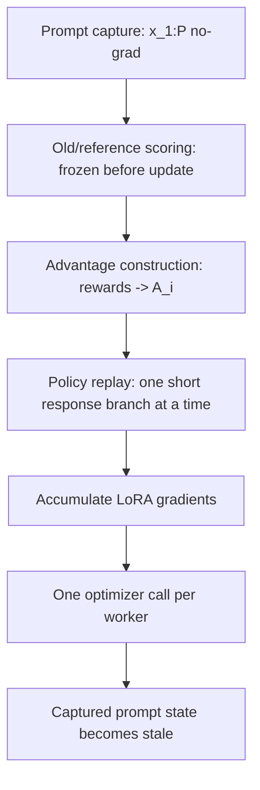

# LongStraw：在固定 GPU 预算下把 RL 后训练上下文推到 2M 以后

| 元信息 | 内容 |
| --- | --- |
| 论文 | LongStraw: Long-Context RL Beyond 2M Tokens under a Fixed GPU Budget |
| 链接 | https://arxiv.org/abs/2607.14952 |
| 版本 | arXiv:2607.14952v1，2026-07-16 提交 |
| 代码 | https://github.com/MindLab-Research/longstraw |
| 方向 | 大模型后训练；长上下文 RL；Agent 轨迹训练系统 |
| 结论先行 | 这篇文章最值得读的不是“又刷新了上下文长度”，而是把长上下文 RL 的瓶颈重新定位成 _状态生命周期、物理所有权、分布式梯度边界_ 的系统问题。 |

## TL;DR

- **它解决什么问题：** 推理系统已经接近百万 token 上下文，但 RL 后训练常停在 256K 或更短；Agent 的工具输出、文档、观察和历史决策会持续累积，训练阶段却必须对同一个长 prompt 下的多条 response 打分和反传。
- **核心方法：** LongStraw 把共享 prompt 先做一次 no-grad capture，保留模型后续 token 必需的紧凑状态；之后只对短 response 分支逐条 replay，在同一组 GRPO 成员上累积 LoRA 梯度，最后每个 worker 调一次 optimizer。
- **关键公式：** 它优化的是条件 response 梯度，不是完整 full-sequence 梯度；论文明确指出 `∇θℓ(θ, zP(θ))` 中经过 prompt state 的第二项被 stop-gradient 切掉，所以不能把结果称为完整数值等价训练。
- **Qwen 证据：** 在 8 张 H20、CP8 下，Qwen3.6-27B 以 2,088,960 prompt token 加 8,192 response input token 达到 2,097,152 positions；`G=2` 用时 5,198.780 秒、峰值 97.503 GB，`G=8` 用时 6,785.225 秒、峰值 97.711 GB，组大小从 2 到 8 只增加 0.208 GB。
- **GLM 证据：** 在 32 张 H20、TP1/CP32/EP32 下，GLM-5.2 对 2,097,152 prompt token 和两个三 token response 完成 2 次 78 层 backward 与 terminal optimizer call；但 DSA response attention 是 CP-local，且历史路径绕过了 Megatron gradient finalization。
- **更长 envelope：** Qwen 路径还报告 4,456,448 positions 的 `G=8` resident response replay，在 8 张 H20 上峰值 82.960 GB；prefix-frozen response-only 版本完成 8 轮 `G=8` optimizer steps，峰值 83.894 GB。
- **局限：** 这些是 execution-capacity receipts，不是完整训练正确性证明；未覆盖在线 rollout、reward model、重复 recapture、完整 gradient parity、optimizer delta parity，也没有证明 policy quality 提升。
- **为什么重要：** 对长程 Agent 后训练来说，本文给出一个比“买更多 GPU”更细的系统分解：什么时候保留 prompt 状态，谁物理拥有这些状态，哪些梯度必须跨 rank 合成，哪些证据只说明程序跑到了终点。

## 1. 研究问题：长上下文 RL 为什么比长上下文推理更难？

### 1.1 论文真正要回答的问题是什么？

- 推理时，系统可以：
  - 对长 prompt 做 prefill；
  - 缓存 decode 所需 KV 或模型特定状态；
  - 丢掉 forward graph；
  - 只为后续 token 做增量生成。
- RL 后训练时，系统不能只做这些：
  - 同一 prompt 下会有 `G` 条 response；
  - old policy、reference policy、current policy 都可能要打分；
  - GRPO 需要比较同组 response 的优势；
  - current policy 分支必须反向传播；
  - optimizer step 不能插在组内成员之间。

### 1.2 为什么这和 Agent 特别相关？

- Agent 任务的上下文不是静态长文，而是逐步变厚的轨迹：
  - 工具调用结果；
  - 网页、代码、日志和文档片段；
  - 先前动作、失败尝试和中间判断；
  - 环境反馈和约束。
- 如果后训练只在短上下文上完成，再希望模型部署时自然泛化到百万 token 轨迹，就会留下一个明显断层：
  - 训练没有暴露真实长轨迹里的状态生命周期；
  - reward 与 response 的条件依赖没有在同等长度下被检验；
  - 系统层的内存、通信、恢复和审计问题被推到部署阶段才爆。

### 1.3 LongStraw 的问题重写

| 常见表述 | LongStraw 的重写 |
| --- | --- |
| 怎样训练更长上下文？ | 固定 GPU 数量时，哪些状态必须跨 prompt 边界保留？ |
| 怎样减少注意力显存？ | 哪些 tensor 生命周期可以在 response backward 前结束？ |
| 怎样做 GRPO？ | 如何在不同时持有 `G` 条长序列图的情况下维持组内顺序？ |
| 跑到 2M 是否等于训练正确？ | 不等于；要拆成 execution、forward fidelity、distributed update、full-gradient parity 四级证据。 |

## 2. 论文主张：把 full-sequence 图切成 prompt capture 与 response replay

### 2.1 GRPO 依赖图

论文设定：

- `P`：prompt token 数；
- `Ri`：第 `i` 个 response 的 scored token 数；
- `G`：同一 prompt 下的 response 数；
- `πold`：old policy；
- `πθ`：当前 policy；
- `Ai`：组归一化后的 advantage；
- `ε`：PPO/GRPO clipped surrogate 的裁剪半径。

核心 ratio：

```text
ρ_i,t(θ) = exp(
  log π_θ(y_i,t | x_1:P, y_i,<t)
  - log π_old(y_i,t | x_1:P, y_i,<t)
)
```

策略项：

```text
L_policy =
  - 1/G * Σ_i 1/R_i * Σ_t
    min(ρ_i,t A_i, clip(ρ_i,t, 1-ε, 1+ε) A_i)
```

这里 LongStraw 没有改 GRPO 目标本身，它改的是 _如何执行这些条件 log-prob_。

### 2.2 五个必须保持顺序的阶段



- **Prompt capture：** 长 prompt 前向，但不保留完整 autograd graph。
- **Pre-step scoring：** old/reference log-prob 在参数更新前冻结。
- **Advantage construction：** reward 变成组内 advantage。
- **Policy replay：** 一次只重建一条短 response 的 current-policy 图。
- **Optimizer transaction：** `G` 条分支累积后再 step，不能组内中途 step。

### 2.3 最关键的证据边界：少了哪一项梯度？

论文把 conventional full-sequence loss 写成：

```text
∇θ ℓ(θ, z_P(θ))
  = (∂ℓ/∂θ)|z_P
  + (∂ℓ/∂z_P) (∂z_P/∂θ)
```

LongStraw 存的是：

```text
z_bar_P = stopgrad(z_P(θ))
```

所以它只计算第一项：

- `response` 条件在被保存的 prompt state 上；
- `prompt state` 对参数的依赖不再反传；
- optimizer step 后，captured state 对新参数 `θ_{k+1}` 已经 stale；
- 下一轮若要保持原目标语义，就要重新 capture prompt。

这就是本文最重要的诚实边界：

| 可以说 | 不能说 |
| --- | --- |
| 在固定设备数下，指定 execution graph 跑到 2M 以后。 | 完整 full-sequence GRPO 梯度已经等价。 |
| response-only 分支显存由 response 长度主导。 | 组大小 `G` 在算法上不重要。 |
| terminal optimizer call 被记录。 | 分布式参数更新一定是全局一致的。 |
| 某些 forward operator 在分片上被组合。 | 所有 LoRA 梯度都完成了正确 reduction。 |

## 3. LongStraw 的方法机制

### 3.1 一次 capture，多次 replay

LongStraw 的交易边界可以写成：

```text
Phase 1:
  run prompt x_1:P under θ_k with no autograd
  retain only architecture-specific prompt state

Phase 2:
  freeze old/reference log-probs before policy backward

Phase 3:
  for i in group members:
    rebuild short response graph under autograd
    backprop member loss
    free response graph

Phase 4:
  finalize accumulated local gradients
  call optimizer once per worker
  mark captured prompt state stale
```

### 3.2 内存与时间的近似账本

论文给出一个非常有用的系统公式：

```text
M_live ≈
  M_fixed
  + M_prompt(P)
  + M_grad
  + max_i M_branch(R_i)
  + M_score(Σ_i R_i)

T_update =
  T_prompt(P)
  + Σ_i T_score+replay(R_i)
```

变量解释：

| 符号 | 含义 | 对系统设计的启发 |
| --- | --- | --- |
| `M_fixed` | 模型、adapter、optimizer、runtime 固定开销 | 不随 prompt 或 response 线性变动，但会吃掉 H20 上限。 |
| `M_prompt(P)` | capture 后必须留下的 prompt 状态 | 要求按架构选择“真正需要留下”的状态。 |
| `M_grad` | trainable adapter 梯度与 optimizer 相关状态 | LoRA/QLoRA 缩小这里，但不能解决长 prompt graph。 |
| `max_i M_branch(R_i)` | 当前 response 分支的 live graph | serial replay 把 `G` 条分支压成最大单分支。 |
| `M_score(Σ_i R_i)` | old/reference score、label、report 等组内对象 | 这部分仍会随 `G` 或总 response 长度增长。 |
| `T_prompt(P)` | 长 prompt 一次性 capture 时间 | `G` 越大，越能摊薄这部分时间。 |
| `Σ_i T_score+replay(R_i)` | 每条 response 的串行打分和反传时间 | 显存换时间，吞吐不一定最优。 |

### 3.3 Qwen 与 GLM 为什么需要不同的状态库存？

| 路径 | 模型结构 | 保留什么 | 放在哪里 | replay 时怎么用 |
| --- | --- | --- | --- | --- |
| Qwen3.6-27B | 48 个 GDN recurrent layers + 16 个 full-attention layers；dense FFN | GDN boundary state、context-sharded KV pages | GPU，CP8 分布式持有 | response attention 需要跨 CP8 做 global LSE/output merge。 |
| GLM-5.2 | MLA、DSA、IndexShare、MoE；78 层 | MLA latent pages、DSA indexer-key pages、page metadata | CPU，CP32 shard；一层一层 stage 回 GPU | 每层恢复 CPU pages，执行短 response attention/MoE，再释放。 |

这个设计不是“稀疏注意力就够了”：

- Qwen 的瓶颈主要在长 prompt KV 与 response attention merge；
- GLM 的瓶颈会在 DSA scratch、expert LoRA、MoE concatenate 之间迁移；
- MoE 降低激活专家数，但会引入 routed rows、expert dispatch/combine 和 LoRA 中间态；
- checkpointing 必须落在完整层边界，attention-only checkpoint 仍会留下 MoE tail 的图。

## 4. 实验设置与 execution receipts

### 4.1 Qwen：8 张 H20 的 2.097M 与 4.456M envelope

Qwen 路径配置要点：

| 项目 | 数值 |
| --- | --- |
| 模型 | Qwen3.6-27B |
| 设备 | 8 张 NVIDIA H20 |
| 并行 | CP8 |
| prompt/response | 2,088,960 prompt token + 8,192 response input token |
| exact positions | 2,097,152 = `2^21` |
| adapter | NF4 QLoRA，rank 16，alpha 32 |
| response block | 4 个 2,048-token blocks |
| FFN microblock | 512 token |

主 receipts：

| 组大小 | wall time | peak allocated | 关键观察 |
| ---: | ---: | ---: | --- |
| `G=2` | 5,198.780 秒 | 97.503 GB | prefix capture 约 4,656.225 秒，占 89.6%。 |
| `G=8` | 6,785.225 秒 | 97.711 GB | 比 `G=2` 只多 0.208 GB，但多 1,586.445 秒。 |

从这张表读出的重点：

- group size 从 2 到 8，峰值显存只增加约 `0.213%`；
- post-prefix 每个 member 的时间接近稳定：
  - `G=2`：约 271.278 秒；
  - `G=8`：约 266.476 秒；
- prompt capture 被更多 response 分摊后，平均每条 response 的总 wall time 从 2,599.390 秒降到 848.153 秒；
- 这证明 serial replay 让 live autograd graph 不再随 `G` 线性膨胀；
- 但它没有证明更大 `G` 一定可行，因为 score、labels、reports 和 wall-time 仍然增长。

附录里的更长 envelope：

| context length | run type | 结果 | reported GB |
| ---: | --- | --- | ---: |
| 4,194,304 | train-block proxy | PASS | 136.717 |
| 4,456,448 | train-block proxy | PASS | 143.163 |
| 4,538,368 | train-block proxy | PASS | 145.176 |
| 4,542,464 | train-block proxy | OOM | 约 145.277 |
| 4,456,448 | resident response replay, `G=8` | PASS，8 个 member 全部完成 | 82.960 |
| 4,456,448 | prefix-frozen response-only, `G=8` | PASS，8 个 optimizer steps，64 个 member replays | 83.894 |

这里要小心：

- `4.456M` 是 exact positions，不是泛泛四百万上下文口号；
- resident replay 证明 response-replay receipt，不自动证明 coherent global adapter update；
- prefix-frozen response-only 是另一个参数化目标，不是 prompt-adapted QLoRA 的完整替代。

### 4.2 GLM：32 张 H20 的 2.097M grouped execution

GLM 路径配置要点：

| 项目 | 数值 |
| --- | --- |
| 模型 | GLM-5.2 |
| 设备 | 32 张 H20，4 节点，每节点 8 GPU |
| 并行 | TP1 / CP32 / EP32 / ETP1 / PP1 |
| prompt | 2,097,152 token |
| response | 两条三 token response，每条两个 scored next-token positions |
| 层数 | 78 decoder layers |
| 稀疏注意力 | 21 个 index-computing layers，57 个 IndexShare consumers，top-2048 |
| MoE | 前 3 层 dense，后 75 层 MoE；256 routed experts，top-8，一个 shared expert |
| adapter | LoRA rank 8，覆盖 attention projection、dense/routed/shared FFN、output head |

GLM 不是一步到位的，它按故障阶梯推进：

| 阶段 | 阻塞点 | 修改 | 通过的范围 |
| --- | --- | --- | --- |
| Full sequence | 32K 可过，2.097M OOM；瓶颈从 DSA scratch 迁移到 expert LoRA 与 MoE concatenate | 不再保留 full-context autograd graph | 证明必须切断 prompt boundary |
| Prefix capture | 没有 durable GLM state contract | capture MLA latent + DSA index-key pages | 128K、256K、512K、1M、2.097M prefix |
| Layer-0 replay | 1M unchunked MoE replay OOM | CPU pages、chunked staging、短 suffix recompute | layer-0 1M/2.097M backward + optimizer-call canaries |
| All-layer replay | IndexShare holder、CP guard、in-place views 问题 | complete-layer checkpoint、修复 layer tail | 32K/64K all-layer gates |
| Topology/state | all-layer working set 仍太大 | TP1/CP32/EP32、CPU pages、layer checkpointing | 约束 GPU residency |
| 2.097M canary | `G=1` 不构成 GRPO 组 | all 78 layers、one backward | 终端路径 canary |
| Fresh grouped run | old scores 与 local group gradients 的顺序问题 | freeze old scores，两条 serial backwards，DistOpt once/worker | `G=2`，32/32 ranks terminate |

最终 GLM receipt：

| 路径 | prompt / response | `G` | 硬件/layout | terminal evidence | wall time | peak |
| --- | --- | ---: | --- | --- | ---: | --- |
| GLM CP-local DSA | 2,097,152 prompt / 3 input token / 2 scored token | 2 | 32 H20，TP1/CP32/EP32 | two old scores + `2 × 78` layer backward + optimizer call | 2,975.138 秒 | n/r |

这张 receipt 的意义：

- 它证明 32 个 rank 都到达指定终点；
- 它证明 CPU resident prefix pages、one-layer staging、complete-layer checkpointing 可以让 2M prompt 下的短 response backward 跑通；
- 它没有提供 GLM whole-run peak；
- capture-window peak allocation 在 112.571 到 145.148 GB/rank 之间，rank spread 达 32.577 GB；
- 这个 spread 是负载均衡诊断，不是大于 2M 的容量上界证明。

## 5. 图表与证据边界：四级证据 ladder

论文最好的地方，是把“跑通”拆成四层：

| 证据层级 | 判定问题 | Qwen 状态 | GLM 状态 |
| --- | --- | --- | --- |
| Execution capacity | 请求的 scoring、backward、terminal optimizer call 是否完成？ | 是，8 H20 上 2.097M `G=2/8` 完成。 | 是，32 H20 上 2.097M `G=2` 32/32 ranks 终止。 |
| Global response forward | response token 是否使用预期的全 prompt operator？ | 基本是，CP8 有 global LSE/output merge，但 numerator 是 BF16。 | 否，历史 receipt 的 DSA top-2048 和 attention 只在本地 65,536-token CP shard 内。 |
| Distributed update | adapter gradients 和 parameter updates 是否按分布式 ownership 一致？ | 否，K/V adapter shard-local gradients 未 reduction，AdamW per rank。 | 否，历史 replay 绕过 `finalize_model_grads`，CP-replicated non-expert adapter gradients 未 reduction。 |
| Full-gradient parity | 每个 trainable gradient 是否匹配 conventional full-sequence reference？ | 否，prompt state detached，且没有完整数值比较。 | 否，prompt state detached，forward 语义也未全局化。 |

### 5.1 Figure 1 到 Figure 4：作者怎样建立“状态生命周期”的论证？

这几张图不是装饰图，而是在逐步排除一个误解：长上下文训练并不只是 attention kernel 的问题。

| 图 | 支撑的 claim | 不能证明的事 |
| --- | --- | --- |
| Figure 1 | Qwen 与 GLM 共享同一个宏观 schedule：long prompt 先 capture，short response 再 replay；但 retained state 与缺失 reduction 完全不同。 | 不能证明两个模型有相同训练语义，也不能比较吞吐。 |
| Figure 2 | 改的是 autograd graph boundary，不是 GRPO objective；组内成员仍按 GRPO 依赖排序。 | 不能恢复 prompt-state gradient，也不证明 repeated training loop。 |
| Figure 4 | durable prompt state、transient prompt work、response activations、trainable gradients 的生命周期不同；optimizer step 后 captured state stale。 | 不能证明 stale state 可以继续使用，也不能说明所有缓存都安全。 |
| Table 2 | 不同模型要跨边界保留的 state inventory 不一样；Qwen 保留 GDN/KV，GLM 保留 MLA/DSA pages 与 metadata。 | 不能证明 byte-level 正确性；物理 page 顺序仍要由 parity gate 检查。 |

更具体地说，Figure 2 的作用是把一个容易混淆的问题拆开：

- **目标函数层面：** 仍然是 group-relative policy objective；
- **执行图层面：** 不再让 prompt graph 留在 response backward 里；
- **数值正确性层面：** stop-gradient prompt state 让完整梯度少了一项；
- **系统资源层面：** 只让当前 response branch 的 graph 活着，换来串行时间成本。

这就是为什么本文的写法一直强调“execution path”而不是“training result”。它要先证明一个训练形状的程序能在固定设备数上跑过，再把未闭合的数学与分布式语义列出来。

### 5.2 Table 3：并行布局不是一个数字，而是所有权声明

Table 3 很关键，因为它说明 CP、EP、TP、PP 不是可替换的“并行倍数”。

- **Context parallelism 的对象是 token history：**
  - Qwen 的 KV pages 分在 CP8 上；
  - GLM 的 2,097,152 prompt 被 CP32 分成每 rank 65,536 token；
  - response token 若要看全局 prompt，就要跨 context ranks 做正确组合。
- **Expert parallelism 的对象是 FFN experts：**
  - GLM 的 256 个 routed experts 名义上每 rank 约 8 个；
  - EP all-to-all 处理 response rows 的 expert dispatch/combine；
  - 它不能替代 cross-CP sparse candidate merge。
- **Tensor/pipeline parallelism 在 GLM 配置中不是主角：**
  - TP1 与 PP1 说明这里没有再把每层或每个 tensor 切开；
  - 32 张 H20 同时承载 CP32 与 EP32 的两类责任。

因此，“32 卡”本身没有解释力。真正解释 GLM 能走到 terminal event 的，是：

1. 每个 CP rank 只长期持有本地 prompt pages；
2. 每层 replay 时才把所需 CPU pages stage 到 GPU；
3. MoE expert ownership 与 context ownership 折叠在同一批 ranks 上；
4. complete-layer checkpointing 避免 MoE tail 跨 backward 长时间驻留；
5. 但历史 receipt 的 DSA 仍是 CP-local，所以 forward semantics 未闭合。

### 5.3 Table 4 与 Figure 8：失败阶梯比成功数字更有信息量

GLM 路径最值得细读的是 failure ladder。它不是直接宣布“CPU offload 解决了问题”，而是把每个阶段新增的依赖类别分开验证：

- **先定位 full graph 不可行：**
  - 32K 可运行；
  - 2.097M 会 OOM；
  - OOM 位置不是固定的，优化一个峰值后会暴露下一个峰值。
- **再证明 prefix state 能覆盖 2M：**
  - no-grad capture 走完 78 层；
  - 但这只证明 storage，不证明 response backward。
- **再证明一层可微 replay：**
  - layer-0 backward 是最小训练切片；
  - 它暴露 CPU page staging、MoE chunking、optimizer-call canary 的必要性。
- **再做 all-layer closure：**
  - 32K/64K all-layer 发现 IndexShare holder、CP guard、in-place views；
  - 这些问题在 prefix-only 测试里根本不会出现。
- **最后才做 grouped execution：**
  - `G=2` 的 old score 冻结、两次 backward、一次 optimizer call 是 GRPO 形状；
  - 但 supplied responses 极短，不能外推到真实 Agent rollout。

这条阶梯对系统论文写作很有参考价值：把“规模做到”拆成一组窄门。每过一个窄门，只增加一个 dependency class，不把多个工程变量混在一次成功里。

### 5.4 Table 5 到 Table 8：怎么读 receipt？

Table 5 的表头故意写得保守：

- Qwen 与 GLM 的硬件数量不同；
- suffix workload 不同；
- wall time 不可直接横向排名；
- terminal evidence 是 worker-local event；
- peak GB 的读取方式也不完全相同。

这意味着读者应该这样读：

| 读法 | 是否合理 | 原因 |
| --- | --- | --- |
| “Qwen 在 8 卡上完成 2.097M response-only execution。” | 合理 | receipt 覆盖 old/ref/backward/local AdamW call。 |
| “GLM 在 32 卡上完成 2.097M prompt 下的 grouped execution path。” | 合理 | 32/32 ranks 到达两次 78 层 backward 与 optimizer call。 |
| “LongStraw 已证明 2M RL 后训练数值正确。” | 不合理 | full-gradient parity 与 distributed update 都没有闭合。 |
| “GLM 还可以轻松超过 2M。” | 不合理 | GLM 没有 whole-run peak，也没有大于 2M probe。 |
| “G=8 比 G=2 更高效，所以应该总是用大组。” | 不合理 | 这里只证明 prefix amortization，不证明 reward、吞吐、稳定性或 timeout。 |

Table 8 的价值在于给未来工作设置验收清单。后续任何声称“LongStraw 已完成正确训练”的版本，都应该能把表中三类 `No` 逐项改成证据明确的 `Yes`，并说明使用的是哪一个 source tree、runtime digest、fixture hash 和 model manifest。

### 5.5 公式与 receipt 的对应关系

论文里的公式不是纯理论铺垫，它们分别对应系统边界：

| 公式 | 对应边界 | 文章里的证据 |
| --- | --- | --- |
| ratio `ρ_i,t` | old/current policy log-prob 必须在同一 prompt 条件下比较 | old/reference scores 在 update 前冻结。 |
| clipped `L_policy` | replay 不能改变 GRPO 成员顺序 | response 分支串行，组内累积后一次 step。 |
| full gradient decomposition | stop-gradient prompt state 会丢失一项 | 作者明确不 claim full-sequence parity。 |
| `M_live` 近似账本 | `G` 不主导 live autograd graph，但仍有 score/report 增长 | Qwen `G=2 -> 8` 显存几乎不变，时间显著增长。 |
| Qwen gradient composition | K/V adapter replicated weights 需要跨 rank 汇总 | 当前缺 `dK/dV` adapter gradient reduction。 |

这一对应关系让 LongStraw 比普通“系统跑通报告”更可审计：每个数字都能落到一个条件，每个条件又能落到一个未完成的验证项。

### 5.6 为什么 terminal optimizer call 不等于训练正确？

- optimizer 被调用只说明：
  - worker 本地走到了相应生命周期事件；
  - 某些梯度对象存在；
  - runtime 没有在此路径上崩溃。
- 它不说明：
  - replicated LoRA 参数的所有 shard-local 梯度已经合并；
  - optimizer delta 与 conventional reference 一致；
  - post-step adapter hash 在各 rank 一致；
  - prompt-state detached 目标等价于 full-sequence 目标；
  - 连续多轮 recapture 与 online rollout 可行。

### 5.7 Qwen 的具体缺口

- Qwen response forward 有全局 CP8 注意力组合：
  - 对 query gradient `dQ` 做了 all-reduce；
  - 但 `dK` / `dV` 留在 page owner 本地。
- K/V projection LoRA 权重是 replicated 的，因此正确参数梯度需要：

```text
∇W_K = Σ_r ∇W_K^(r)
∇W_V = Σ_r ∇W_V^(r)
```

- 当前 audited runner 没有 DDP wrapper、parameter-gradient reducer 或 selective model-parallel composition；
- 每个 rank 拥有自己的 AdamW 并本地 step；
- 所以可支持说法应是：
  - global full-attention response forward；
  - response-shaped backward graphs；
  - eight terminal optimizer calls；
  - fixed eight-H20 envelope at 2.097M positions。
- 不应说：
  - coherent CP8 distributed update 已完成；
  - K/V adapter gradients 与 conventional full-sequence 参考一致。

### 5.8 GLM 的具体缺口

- 历史 GLM receipt 中，每个 rank 只从自己的 65,536-token prompt shard 选 top-2048；
- 没有跨 rank candidate merge；
- 没有 global top-2048 selection；
- 没有 selected-value exchange；
- 没有 sparse output composition；
- IndexShare 复用的也是这个 local schedule。

当前代码树实现了更完整的 global candidate / selected-value / output composition 路径，但还缺：

- 短上下文 full adapter-gradient parity；
- optimizer-delta parity；
- source-bound fresh 2M rerun；
- 32K/64K conventional reference 对照；
- 再接 repeated online rollout、reward、update、checkpoint、reload loop。

## 6. 代码仓库：公开版本为什么叫 review_only_not_runnable？

### 6.1 README 与 STATUS 的一致边界

代码仓库的 README 与 `STATUS.md` 都没有把当前树宣传成“可直接跑的 2M 训练发布版”。它们给出的状态是：

- `review_only_not_runnable`；
- candidate `megatron_backend.py` / direct-Ray lifecycle code 已在仓库中；
- candidate execution 以 `IMPLEMENTATION_COMPLETE=True` 开启；
- 但 immutable CUDA 13 image、execution/redistribution grant、approved fixtures、current-tree 32x H20 evidence 仍缺；
- checkout doctor 当前会输出 blocked 状态，implementation check 通过不等于 runtime release 通过。

### 6.2 几个关键段落怎样约束读者理解？

仓库文档最有价值的地方，是它反复把“实现已在树里”和“发布可运行”分开。这个区分对后训练系统尤其重要，因为用户常把开源代码、历史 receipt 和当前可复现实验混为一谈。

- **关于 release state：**
  - 文档说当前是 review-only；
  - 含义不是“代码没有实现”，而是“独立运行前提尚未被公共证据绑定”；
  - 这把工程实现、运行授权、镜像来源、fixture 输入和硬件 evidence 分成了五条线。
- **关于 doctor：**
  - checkout doctor 可以在不导入 Ray、Torch、Megatron 或真实模型的情况下聚合 blocker；
  - 它的作用是让失败尽早、明确、可机器读取；
  - 它不是训练正确性的替代测试。
- **关于 runtime image：**
  - direct Ray plan 要求 immutable OCI digest；
  - target workers 必须已经在同一个 digest 的镜像中运行；
  - actor 不靠 per-actor runtime override 临时换镜像；
  - 这避免了“计划绑定的是 A，实际执行的是 B”的复现漏洞。
- **关于 receipt：**
  - receipt validator 要绑定 plan、config、deployment、model revision、backend、execution package、source tree；
  - rank evidence 要记录 phase sequence；
  - checkpoint manifest 要被重新 hash；
  - cleanup 也被纳入验收，而不是程序退出后就默认成功。

这套边界说明作者知道当前结果最容易被误读在哪里：

| 容易误读 | 文档给出的防线 |
| --- | --- |
| 有仓库就能复现 2M 训练 | 标记 `review_only_not_runnable`，列出外部 gate。 |
| 有 optimizer call 就是正确更新 | receipt scope 写成 `2m_execution_only_not_numerical_correctness`。 |
| 历史 evidence 可替代当前树 evidence | evidence index 把 historical summaries 与 future current-tree chain 分开。 |
| JSON status passed 就能 promotion | 要求 doctor、kernel、NCCL、actor、32K、64K、2M 的有序 receipt chain。 |

对研究者来说，这种写法的意义很直接：当一个系统论文声称突破训练上下文时，最应追问的不是“仓库有没有代码”，而是“当前代码树、运行镜像、模型快照、输入 fixture、硬件拓扑和 receipt 是否被同一组 hash 绑定”。

另一个值得学习的细节是，文档没有把缺口藏在脚注里，而是把阻塞项放进 README、STATUS、limitations 和 receipt 校验代码的同一套语言中。这样读者即使只看仓库入口，也能知道当前成果停在什么证据层级，后续复现实验应该补哪一道门。

### 6.3 工程模块边界

| 模块或目录 | 责任 |
| --- | --- |
| `glm52/resident_replay_backend.py` | rank-local resident-prefix adapter；定义 `RankTrainingPort`、`PrefixCapture`、`ReplayBatch`、bounded gradient/optimizer witness。 |
| `glm52/direct_ray.py` | side-effect-free direct Ray plan；验证 node、GPU、runtime image digest、placement group、rank actor ownership。 |
| `glm52/training_receipt.py` | 训练 receipt 的 fail-closed 校验；claim scope 固定为 `2m_execution_only_not_numerical_correctness`。 |
| `configs/run/glm52_2m_grpo_cp32.json` | 2M GLM 配置；`prompt_tokens=2097152`、`group_size=2`、LoRA rank 8、Adam `1e-4`、CP32/EP32。 |
| `docs/limitations.md` | 明确列出 direct backend、licensing、CUDA 13 runtime、inputs、distributed validation、historical evidence 的未闭环。 |
| `evidence/README.md` | 把 historical summaries 与 future current-tree release chain 分开；要求 `doctor -> kernel -> nccl -> actor -> 32k -> 64k -> 2m` 固定顺序。 |

### 6.4 这个仓库的工程风格值得注意

- 它用 fail-closed 方式表达 release boundary：
  - 缺 digest；
  - 缺授权；
  - 缺 approved fixtures；
  - 缺 32x H20 当前证据；
  - 都不能 promotion。
- 它把 receipt scope 写进校验代码：
  - `2m_execution_only_not_numerical_correctness`；
  - 这避免把执行成功误解成完整数值正确。
- 它把 operator-managed Ray cluster 作为外部前提：
  - direct Ray actors 不启动 HTTP control plane；
  - worker 必须已运行相同 immutable image digest；
  - placement bundle 绑定 target node resource 与 digest resource。
- 它把 cleanup 与 ownership 纳入证据：
  - rank sessions；
  - checkpoint manifest；
  - planned/observed placement；
  - actor absence；
  - symlink 与文件漂移拒绝。

## 7. 和相关工作的关系

### 7.1 它不是“第一个百万上下文训练”

论文主动避免世界纪录式 claim：

| 工作方向 | 代表思路 | LongStraw 的区分 |
| --- | --- | --- |
| Ring Attention | 通过 ring 通信扩展长序列 attention | LongStraw 固定设备数，问状态生命周期如何改变可行 envelope。 |
| DeepSpeed-Ulysses | 大规模 sequence parallel，扩展到很多 GPU | LongStraw 不把扩设备作为主轴。 |
| ByteScale / USP | 更大 fabric 上的长上下文训练 | LongStraw 聚焦 8 H20 / 32 H20 的 fixed-budget execution。 |
| FlashAttention / memory-efficient attention | 降低 attention workspace 或数据搬运 | LongStraw 认为单个 kernel 优化不足以处理 prompt graph、MoE、optimizer、distributed state。 |
| LoRA / QLoRA | 降低可训练参数与存储 | 它们减少 adapter/optimizer 压力，但不能删除 prompt autograd graph。 |
| GRPO 系统 | 优化 RL 目标和采样训练流程 | LongStraw 处理的是同一长 prompt 下 response-only execution graph。 |

### 7.2 它与 MinT 的关系

- MinT 是更外层的训练系统：
  - 管理 model workers；
  - 管理 adapter revisions；
  - 管理 policy transaction。
- LongStraw 是内部长上下文 execution stack：
  - 管理 prompt state；
  - 管理 response replay；
  - 管理状态边界与 receipt。
- 因此 LongStraw 不解决完整 RL pipeline：
  - 不包括 sampling；
  - 不包括 reward computation；
  - 不包括 data filtering；
  - 不包括 checkpoint publication；
  - 不包括 repeated online updates 的质量评估。

## 8. 消融、失败与反例

### 8.1 最有价值的失败：GLM full-sequence 不是单点 OOM

GLM 2.097M full-sequence 路径失败时，瓶颈不是一个可以独立优化的 allocation：

- 先是 DSA attention scratch；
- 然后迁移到 expert LoRA scale/add；
- 最后迁移到 MoE output concatenate。

这说明：

- 稀疏注意力减少核心 attention 计算，不代表训练图就短；
- MoE 减少激活专家数，不代表 routed rows 与 adapter intermediates 没成本；
- 对 65,536-token CP shard，一个展开的 BF16 hidden buffer 就可达 6 GiB 量级；
- 只优化 DSA 或只 checkpoint attention 都会把峰值推到下一个组件。

### 8.2 Qwen 的组大小实验不是 throughput 胜利

`G=2 -> G=8` 的 0.208 GB 峰值增长很漂亮，但它的含义有限：

- 是单 run evidence，不是拟合出的 scaling law；
- 时间增加 1,586.445 秒；
- 更大 `G` 会继续增加 frozen scores、reports、输入标签和 timeout 风险；
- GRPO 的 reward normalization 与 advantage estimator 仍依赖 `G`；
- 只证明 group size 不是 live-autograd capacity 的主导轴。

### 8.3 prompt-frozen 多步不是 prompt-adapted 多步

4.456M prefix-frozen response-only 完成 8 个 `G=8` optimizer steps，很有工程价值，但要分清：

- 它保持 captured prefix invariant；
- 它显式冻结 prompt 位置的 adapter delta；
- 因而可以连续多步不用 recapture；
- 这不是原始 prompt-adapted QLoRA 目标；
- prompt-adapted 训练在每次 optimizer step 后需要 recapture，或者要明确定义 stale-state 近似。

## 9. 对后训练与 Agent 系统的启发

### 9.1 长轨迹后训练的瓶颈在“状态契约”

对 Agent 后训练来说，本文的启发不是直接拿 LongStraw 当通用框架，而是把训练系统拆成契约：

- 哪些观察、文档、工具输出必须影响 response？
- 哪些状态可以 no-grad capture？
- 哪些状态必须 byte-stable？
- 哪些状态只需要结构 witness，哪些需要数值 parity？
- optimizer step 后哪些 cache 必须作废？
- repeated loop 中什么时候 recapture？

### 9.2 评测也要分层

一个长上下文 RL 系统至少要分别报告：

| 层级 | 应该报告什么 |
| --- | --- |
| Execution | 多少 rank 到达终点、phase 顺序、wall time、显存、失败清理。 |
| Forward semantics | response token 是否看到了全局 prompt operator。 |
| Distributed update | 每个 adapter family 的 gradient ownership 与 reduction。 |
| Numerical parity | 32K/64K reference 下的 loss、log-prob、gradient、optimizer delta。 |
| Training quality | reward、online rollout、policy improvement、泛化和失败样例。 |
| Reproducibility | source tree、runtime digest、fixture hash、model manifest、checkpoint manifest。 |

如果只报“2M 跑完”，读者无法判断这是 capacity、forward、update 还是 policy-quality 结果。

### 9.3 对 Agent 研究的一个更具体追问

长程 Agent 的训练轨迹常包含外部工具结果。LongStraw 的思路会逼我们追问：

- 工具观察是否应该作为 prompt state 被 stop-gradient？
- 对工具输出的长上下文 replay，哪些 token 真的需要影响 adapter update？
- 如果 response 很短而观察很长，是否应把学习目标转向：
  - 选择关键 observation；
  - 压缩状态；
  - 对齐 planner 的引用边界；
  - 而不是简单让整个轨迹反传？
- 对 memory-augmented Agent，optimizer step 后哪些 memory cache 与 prompt cache 已经过期？

这些不是论文直接解决的问题，但它提供了一个分析语言：_state lifetime + ownership + evidence level_。

## 10. 结论与局限

### 10.1 可以带走的核心判断

- LongStraw 把长上下文 RL 的问题从“注意力怎么省显存”升级为“训练交易里什么状态什么时候活着”。
- 它用 no-grad prompt capture 和 serial response replay，把 live autograd graph 从 `P + R` 拉回到 response 分支尺度。
- 它对 Qwen 与 GLM 给出两套架构特定实现：
  - Qwen：GPU resident recurrent state + compact KV pages；
  - GLM：CPU resident MLA/DSA pages + one-layer staging + complete-layer checkpointing。
- 它的最大价值在证据边界：
  - execution capacity；
  - global response forward；
  - distributed update；
  - full-gradient parity；
  - 这四层不能混为一谈。

### 10.2 主要局限

- **Prompt-state gradient detached：** Equation 3 的第二项没有被恢复，完整 full-sequence parity 仍需短上下文 reference。
- **Distributed update incomplete：** Qwen 缺 K/V adapter gradient composition；历史 GLM 缺 CP-replicated non-expert adapter gradient finalization。
- **GLM historical receipt forward semantics CP-local：** DSA top-k 与 output composition 没有全球化到 2,097,152 prompt。
- **不是完整 RL pipeline：** supplied deterministic responses/rewards，不含在线采样、reward model、data filtering、重复 update、policy improvement。
- **公开仓库不可直接训练复现：** 当前是 `review_only_not_runnable`，缺 runtime digest、授权、approved fixtures、current-tree 32x H20 evidence。
- **成本与效率未完整比较：** wall time、allocated device count 是 receipts；不是 energy、utilization、monetary cost 或最优 throughput。

### 10.3 后续最值得看的验证顺序

1. 在 32K 完成 full adapter-gradient parity，覆盖所有 LoRA target family。
2. 验证 optimizer delta parity，而不是只看 loss 或单个 gradient norm。
3. 对 GLM current tree 做 global DSA response-logit parity。
4. 在 64K 重复 parity gate。
5. 绑定 source tree、runtime digest、model manifest、fixtures，fresh rerun 2M。
6. 加入 online rollout、reward、checkpoint、reload 与 repeated recapture loop。
7. 最后才评估 policy quality 和长程 Agent 任务收益。

LongStraw 的贡献可以概括成一句话：

> 它没有证明 2M 长上下文 RL 已经完整正确，但它把“在固定 GPU 预算下跑到 2M 以后”这件事拆成了可审计、可复现、可继续补证的系统边界。
