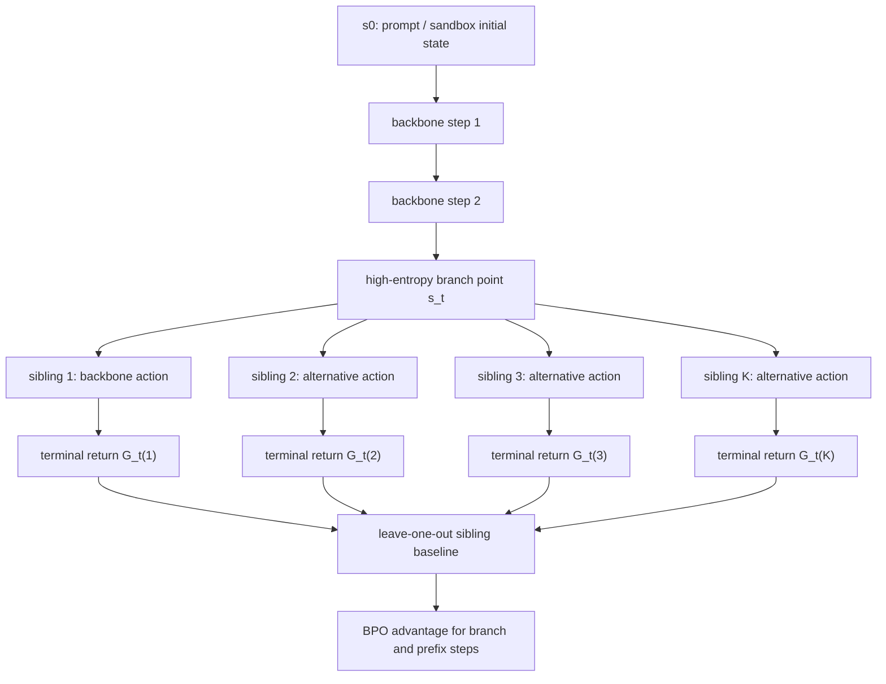

# Branching Policy Optimization：把 Agent 后训练从“独立重跑”改成“从关键分叉点学习”

### 元信息

| 项目 | 内容 |
| --- | --- |
| 论文 | Branching Policy Optimization: Sandbox-Native Language Agent Reinforcement Learning |
| 作者 | Bowei He, Yankai Chen, Xiaokun Zhang, Xue Liu |
| 日期 | 2026-07-15 提交，arXiv:2607.14171v1 |
| 方向 | 大模型后训练；Agent 强化学习；sandbox-native RL |
| 原文 | https://arxiv.org/abs/2607.14171 |
| 第三方参考 | Semantic Scholar 已收录但暂无引用；WAIC Academic 2026 accepted paper list 收录；Hugging Face daily papers 未发现独立深度解读 |

### TL;DR

- 这篇论文提出 **Branching Policy Optimization, BPO**：它不再像 PPO、RLOO、GRPO 那样从同一个初始 prompt 反复采样多条互不相干的完整轨迹，而是把可快照、可恢复的 Agent sandbox 当成训练原语。
- BPO 的核心动作是：先跑一条 backbone 轨迹，再在策略熵最高的若干决策点保存 sandbox 状态，从这些点 fork 出 sibling rollouts，最后用同一前缀下 sibling 的回报差来估计 advantage。
- 理论上，作者证明 sibling-baseline advantage 是无偏的；方差比 trajectory-level baseline 少掉一项由前缀状态价值解释的方差，形式上是 `K/(K-1) * Var(V^pi(s_t) | s_0)`。
- 实验覆盖 WebShop、ALFWorld、SWE-bench Verified，主干模型是 Qwen2.5-7B-Instruct 和 Llama-3.1-8B-Instruct；BPO 在匹配采样预算下比 GRPO/RLOO/PPO/VinePPO 高 3.6 到 6.1 个绝对点。
- 更关键的证据不是单纯涨点：BPO 的梯度范数方差约为 GRPO 的 0.42 到 0.58，并且达到 GRPO 最终表现只需约 1,840 步，而 GRPO 需要 3,000 步，约少 38.7% 更新。
- 局限也很明确：BPO 依赖 snapshot fidelity，依赖 sandbox 的可恢复成本足够低；对真实网页、联网工具、并发副作用、长链外部 API 调用的可复现实验还没有完全覆盖。

### 研究问题：为什么 Agent RL 不该继续照搬 RLHF 的 rollout 形状？

| 传统做法 | BPO 的质疑 | 关键后果 |
| --- | --- | --- |
| 对同一 prompt 从初始状态采样 `N` 条完整轨迹 | Agent 任务不是静态 prompt，而是状态不断变化的 sandbox MDP | 早期一步失误会支配整条 50 步轨迹的回报方差 |
| 用一组完整轨迹的平均回报做 baseline | baseline 只条件化在 `s_0`，没有利用中间状态 | 同一 prompt 下的成功/失败差异混入大量前缀噪声 |
| PPO/GRPO/RLOO 把终局 reward 传播到全轨迹 | 对工具调用、代码修复、网页导航这类任务，关键决策点通常出现在中途 | credit assignment 粗，训练信号容易退化成“这整条路好/坏” |
| 推理时已经使用树搜索或回溯 | 训练时仍把 rollout 当成扁平样本 | inference-time search 和 training-time RL 的结构不一致 |

作者的问题意识可以压成一句话：

> **如果 sandbox 能从任意中间状态恢复，为什么后训练还要每次从初始状态重新摇一整条轨迹？**

这不是工程小优化，而是把 Agent 后训练的基本采样单位从“prompt-level trajectory”改成“state-conditioned branch”。在 SWE-bench 这类任务里，环境本身就是 Docker 容器、文件系统、测试 harness 和 shell 历史；它天然有比静态文本 prompt 更丰富的可恢复状态。

### 论文主张与论证路线

| Claim | Mechanism | Evidence | Boundary |
| --- | --- | --- | --- |
| Agent sandbox 的可快照性应进入训练算法 | 定义 `snap(s)` 与 `rest(snapshot)`，把中间状态当成可分叉节点 | WebShop、ALFWorld、SWE-bench 都实现了 snapshot/restore | 需要恢复后转移分布等价；联网副作用和外部不可控状态未充分覆盖 |
| sibling baseline 比 prompt-level baseline 方差更低 | 同一前缀下 `K` 个 sibling rollouts 互作 leave-one-out baseline | Theorem 4.1 证明无偏；Theorem 4.3 给出方差减少项 | 方差收益依赖 `V^pi(s_t)` 在前缀间有差异；若中间状态价值几乎常数，收益会消失 |
| 高熵分叉比均匀分叉更有效 | 在 backbone 决策边界计算 token-level Shannon entropy，选 top-M 分叉点 | WebShop 消融：最低熵 60.8，随机 64.5，等距 65.2，最高熵 67.8 | 熵是策略不确定性的代理，不等于真实 value disparity |
| BPO 的收益不是只靠多采样 | 匹配 return sample budget，并报告 snapshot overhead | 主结果在匹配 compute 下提升 3.6 到 6.1 点，wall-clock 到达 GRPO 表现快 35% 到 40% | 文中 compute matching 有实现细节，`M,K,N` 的等价关系需要复现实验确认 |

### 方法机制：BPO 如何构造 rollout tree？

论文把一个 prompt `x` 对应的 rollout 从扁平集合改成一棵树：



BPO 的五个动作如下：

1. 对每个 prompt 采样一条 backbone 轨迹 `tau^(0)`。
2. 在每个 Agent 决策边界计算策略熵 `H_t`，不是每个 token 都分叉，而是在工具调用或 reasoning step 之前的动作级边界分叉。
3. 选择 top-M 个高熵分叉点，并要求分叉点之间至少相隔 `Delta_min=64` tokens，避免全部预算挤在一个不确定片段里。
4. 在分叉点 `s_t` 调用 `snap(s_t)` 保存状态，再恢复出 `K-1` 个 sibling，分别采样替代动作并 roll out 到终止。
5. 对每个 sibling 用其他 sibling 的平均回报做 leave-one-out baseline，并把局部 advantage 按 `lambda=0.95` 传播到共享前缀。

### 公式：sibling-baseline advantage 在减掉什么方差？

#### 1. GRPO/RLOO 的 trajectory-level baseline

给定同一个初始状态 `s_0`，GRPO/RLOO 采样 `K` 条独立完整轨迹，得到回报 `G^(1), ..., G^(K)`：

```text
A_k^GRPO = G^(k) - (1 / (K-1)) * sum_{j != k} G^(j)
```

这个 baseline 只知道“大家都来自同一个 prompt”，不知道第 `t` 步之前到底走到了什么中间状态。

#### 2. BPO 的 sibling baseline

给定同一个分叉状态 `s_t`，BPO 采样 `K` 个 sibling continuation：

```text
A_hat^BPO(s_t, a_t^(k))
  = G_t^(t,k) - (1 / (K-1)) * sum_{j != k} G_t^(t,j)
```

这里 baseline 条件化在 `s_t`。如果一个前缀已经把任务带进“几乎必败”的状态，所有 sibling 都会在这个局部上下文里比较；如果前缀把任务带进“仍可修复”的状态，比较也只在这个上下文里发生。

#### 3. 方差分解

作者用全方差公式给出核心结论：

```text
Var(A_k^BPO | s_0)
  = Var(A_k^GRPO | s_0)
    - K/(K-1) * Var_{tau_0:t | s_0}( V^pi(s_t) )
```

变量解释：

| 符号 | 含义 | 对训练的意义 |
| --- | --- | --- |
| `K` | 同一分叉点的 sibling 数 | `K` 越大，局部 baseline 越稳定，但分叉点覆盖数可能下降 |
| `s_t` | backbone 上第 `t` 步的 sandbox 状态 | 包含文件系统、DOM、shell 历史、任务进展 |
| `V^pi(s_t)` | 策略从状态 `s_t` 继续执行的期望回报 | 衡量前缀已经把任务带到多好或多坏的位置 |
| `Var(V^pi(s_t) | s_0)` | 同一 prompt 下不同前缀状态价值的波动 | 正是 GRPO 混入 advantage 的“前缀噪声” |
| `K/(K-1)` | leave-one-out baseline 的样本修正系数 | `K` 小时修正较大，`K` 大时趋近 1 |

这条式子的研究意义很强：BPO 不是声称“更多 rollout 总会更好”，而是指出 **同样的 return sample budget，放在中间状态的 sibling 比放在初始状态的独立轨迹更能解释掉前缀差异**。

### 伪代码：训练循环如何落地？

```text
Input:
  policy pi_theta, reference pi_ref
  sandbox environment E
  prompt batch {x_i}
  branch count M, branch width K
  propagation discount lambda
  PPO clip epsilon, KL weight beta

State:
  per-prompt backbone trajectory
  per-step entropy H_t
  sandbox snapshots sigma_t
  sibling returns G_t^(k)

Loop:
  for each prompt x_i in parallel:
    run pi_theta in E to sample one backbone trajectory
    compute action-boundary entropy H_t for each step
    choose branch points B_i = TopM(H_t, spacing = Delta_min)

    for each branch point t in B_i:
      sigma_t = snap(s_t)
      for k = 2 ... K in parallel:
        restore sigma_t
        sample alternative action a_t^(k)
        roll out to terminal reward
        record return G_t^(k)

    compute sibling leave-one-out advantages at branch points
    propagate local branch advantages to shared prefix with lambda

  update pi_theta with PPO-style clipped objective plus KL(pi_theta || pi_ref)

Output:
  updated policy with lower-variance state-conditioned advantage estimates

Failure boundary:
  if restore(snap(s)) does not preserve transition distribution,
  BPO can compare sibling returns that are not truly siblings.
```

### 实验设置：三个 sandbox 为什么有代表性？

| 环境 | 任务形态 | Snapshot 实现 | 规模与限制 | 为什么适合检验 BPO |
| --- | --- | --- | --- | --- |
| WebShop | 网页购物 Agent 按自然语言目标搜索、导航、购买 | 模拟网页状态可恢复 | 1.18M 商品，500 条测试指令，`T_max=50` | 早期搜索词和导航路径会强烈影响终局分数 |
| ALFWorld | 文本化家居环境中的具身任务 | pickle simulator state | 6 类任务，134 个 unseen test，`T_max=40` | 过程动作和空间状态决定后续可达性 |
| SWE-bench Verified | GitHub issue 修复 | Docker overlayfs | 500 个 verified issue，12 个 repo，`T_max=25` tool calls | 文件系统、测试状态和补丁历史天然可 snapshot |

训练细节如下：

- Baseline：SFT only、PPO、RLOO、GRPO、VinePPO。
- Backbone：主结果使用 Qwen2.5-7B-Instruct；扩展结果包含 Llama-3.1-8B-Instruct。
- 优化器：AdamW，学习率 `2e-6`，cosine decay，batch size 128，gradient accumulation 4。
- PPO 参数：clip `epsilon=0.2`，KL coefficient `beta=0.05`。
- BPO 默认：`lambda=0.95`，分叉点按高熵选取。
- 训练步数：WebShop 和 ALFWorld 为 3,000 gradient steps，SWE-bench 为 5,000 steps。
- 硬件：每个训练配置使用 `8 x A100-80GB`，sandbox worker 使用单独 32-core pool。

### 主结果：涨点来自哪里？

| 方法 | WebShop Qwen2.5-7B | ALFWorld Qwen2.5-7B | SWE-bench Verified Qwen2.5-7B | WebShop Llama-3.1-8B |
| --- | ---: | ---: | ---: | ---: |
| SFT only | 51.3 ± 1.2 | 44.6 ± 2.1 | 14.6 ± 1.0 | 48.7 ± 1.4 |
| PPO | 58.2 ± 1.8 | 54.7 ± 2.5 | 19.4 ± 1.3 | 55.0 ± 2.0 |
| RLOO | 60.4 ± 1.5 | 58.3 ± 2.2 | 22.8 ± 1.2 | 58.1 ± 1.7 |
| GRPO | 62.1 ± 1.4 | 60.5 ± 2.0 | 24.0 ± 1.1 | 60.4 ± 1.5 |
| VinePPO | 63.5 ± 1.6 | 61.2 ± 2.3 | 25.1 ± 1.2 | 61.0 ± 1.6 |
| **BPO** | **67.8 ± 1.3** | **66.4 ± 1.9** | **29.8 ± 1.0** | **65.2 ± 1.5** |

从表中可以看到三点：

- BPO 对 VinePPO 也有提升，说明它不是简单替代 value estimate，而是改变了 rollout topology 和 advantage baseline 的条件化方式。
- SWE-bench 的绝对提升最大：BPO 对最佳 baseline 提升 4.7 点，对 GRPO 提升 5.8 点；这符合“越长、越依赖中间状态的任务越受益”的主张。
- Llama-3.1-8B 上的 WebShop 结果也提升到 65.2，说明方法不是只适配 Qwen2.5-7B 的训练动态。

### Figure 与 Table 证据逐项解读

| 图表 | 作者想证明什么 | 关键数字 | 不能证明什么 |
| --- | --- | --- | --- |
| Figure 1 | BPO 的结构是 backbone + high-entropy branch + sibling baseline | 高熵点保存状态，`K-1` 个灰色 sibling forks | 只是机制示意，不证明高熵一定最优 |
| Figure 2 | BPO 学得更快且最终 plateau 更高 | 达到 GRPO 最终表现约 1,840 ± 90 步，GRPO 为 3,000 步 | 不说明所有任务都能省同样比例的 wall-clock |
| Figure 3 | 梯度方差确实下降 | `Var_BPO / Var_GRPO` 从 0.42 到 0.58 | 只用梯度范数方差代理，不等价于完整泛化稳定性 |
| Table 1 | 端到端任务成功率提升 | BPO 比 baseline 高 3.6 到 6.1 点 | 结果依赖作者复现的 baseline 和调参范围 |
| Table 2 | branch width 有饱和点 | WebShop 上 `K=4` 为 67.8，`K=8` 为 67.9，`K=16` 降到 66.5 | 不能推出任意环境都该选 `K=4/8` |
| Table 3 | 高熵分叉比低熵/随机/等距更好 | 低熵 60.8，随机 64.5，等距 65.2，高熵 67.8，oracle 68.4 | oracle 使用 held-out value disparity，不是训练时可直接用的无成本选择 |
| Table 4 | snapshot overhead 不吃掉训练收益 | WebShop 42ms、ALFWorld 138ms、SWE-bench 1.92s；总 wall-clock 快 35% 到 40% | 只覆盖这三类 sandbox；真实浏览器、云端 API、异步服务未覆盖 |

### 消融与失败边界

#### Branch width `K`

| K | M used | WebShop Success | Gradient variance ratio |
| ---: | ---: | ---: | ---: |
| 1 | 12 | 62.4 ± 1.5 | 1.02 |
| 2 | 12 | 64.8 ± 1.4 | 0.71 |
| 4 | 4 | 67.8 ± 1.3 | 0.47 |
| 8 | 1.7 avg | 67.9 ± 1.4 | 0.43 |
| 16 | 0.8 avg | 66.5 ± 1.6 | 0.55 |

解释：

- `K=1` 基本退化为无 branching，效果接近更大采样预算下的 GRPO-like baseline。
- `K=4` 和 `K=8` 是收益平台期：sibling 足够多，但仍覆盖多个分叉点。
- `K=16` 下降不是因为 sibling 本身坏，而是固定预算下 `M` 被挤压，覆盖的前缀点太少。

#### Branch schedule

| 分叉策略 | WebShop Success | 说明 |
| --- | ---: | --- |
| Lowest-entropy | 60.8 ± 1.7 | 分叉到策略已经很确定的地方，sibling 近似重复 |
| Uniform random | 64.5 ± 1.4 | 有时撞到关键点，但信号不稳定 |
| Equally spaced | 65.2 ± 1.5 | 覆盖全轨迹，但不关心策略不确定性 |
| Highest-entropy BPO | 67.8 ± 1.3 | 训练时可用、无需 value network |
| Oracle value disparity | 68.4 ± 1.2 | 上界参考，使用 held-out value signal |

#### `lambda` 传播

- `lambda=0` 只在 branch point 训练，少掉前缀 credit assignment，整体损失约 1.8 到 2.4 点。
- `lambda` 在 0.9 到 0.99 区间形成平台，说明优势信号需要向前传播，但不能无限制地把远端分叉结果等权压回所有早期 token。
- SWE-bench 上 `lambda=1` 略低于 `lambda=0.95`，符合长 horizon 任务里远端 credit 更嘈杂的直觉。

### 为什么这篇论文对 Agent 后训练重要？

可以把 BPO 放在三条研究线的交叉处：

| 研究线 | 既有路径 | BPO 的位置 |
| --- | --- | --- |
| RLHF / GRPO / RLOO | 简化 critic，保留 prompt-level 多轨迹 baseline | 继续无 critic，但把 baseline 条件化到中间 sandbox state |
| Process supervision / PRM | 用过程奖励或 value model densify reward | 不训练 PRM，利用 sibling return 得到局部 advantage |
| Tree search / MCTS / ToT | 推理时构造搜索树，寻找更好答案 | 训练时构造树，主要目标是方差降低和 credit assignment |

这个位置让 BPO 有一个清晰研究贡献：

- 它没有引入新的 reward model。
- 它没有要求 inference-time search。
- 它也没有要求人工标注过程监督。
- 它只要求环境能比较可靠地 checkpoint/restore。

这对 coding agent、browser agent、OS agent 特别关键，因为这些任务的昂贵部分不是“生成一句答案”，而是执行、观察、恢复、测试。BPO 直接把这个工程事实变成 RL 算法结构。

### 证据边界与可复现性问题

这篇论文的强点是 claim、mechanism、evidence 对得比较紧；但仍有几个边界需要谨慎：

1. **Snapshot fidelity 是前提，不是免费事实。**
   - Docker overlayfs、模拟器 pickle、可控 WebShop 都适合。
   - 真实浏览器 session、外部 API、时间相关页面、数据库副作用，未必能保证 `rest(snap(s))` 后转移分布相同。

2. **高熵不一定等于高价值分歧。**
   - 消融说明高熵比随机/等距好，并接近 oracle。
   - 但它仍是 proxy：有些低熵动作也可能是关键安全动作，有些高熵片段只是语言表述自由度高。

3. **Compute matching 需要更细复核。**
   - 文中报告匹配 return sample budget，并把 snapshot overhead 放到 Table 4。
   - 但不同环境的 rollout 长度、sandbox worker 并行度、失败提前终止策略，都会影响真实训练成本。

4. **只有 7B/8B 级别 backbone。**
   - 结果已经足够说明机制有效。
   - 但更大模型可能策略熵分布不同，sibling 的多样性和 snapshot 价值也可能改变。

5. **安全边界没有成为主实验。**
   - BPO 会更有效地强化能导致成功的分叉动作。
   - 如果 verifier 漏洞、单元测试不完备或 Web reward 可被 exploit，BPO 也可能更有效地强化 exploit 路径。

### 相关工作中的位置判断

| 方法族 | 与 BPO 的相同点 | 与 BPO 的差异 |
| --- | --- | --- |
| PPO | 都使用 clipped policy-gradient objective | PPO 依赖 value network；BPO 用 sibling returns 直接构造 advantage |
| RLOO / GRPO | 都是 baseline-only 的 LLM RL 路线 | RLOO/GRPO 的 baseline 在 trajectory/prompt 层；BPO 的 baseline 在 branch state 层 |
| VinePPO | 都从中间状态 rollout，试图改善 credit assignment | VinePPO 用 MC rollout 估 value 并接 GAE；BPO 用 sibling baseline，不训练 critic |
| Tree-of-Thoughts / RAP / AlphaZero-style decoding | 都利用树结构 | BPO 的树主要服务训练方差降低，不要求推理时继续搜索 |
| PRM / process reward | 都想缓解 sparse reward | BPO 不需要额外过程标注或 reward model |

最值得注意的是 VinePPO 对比。BPO 的论点不是“中间状态 rollout 第一次出现”，而是 **中间状态 rollout 不必变成 value oracle，它也可以构成局部对照组**。这让它更贴近 GRPO/RLOO 的 baseline-only 传统，同时更适合有恢复能力的 Agent 环境。

### 领域延伸：这会改变 Agent RL 系统怎么搭吗？

#### 1. 后训练框架需要暴露 snapshot API

如果 BPO 这条线成立，Agent RL harness 不应只提供：

- `reset(prompt)`
- `step(action)`
- `reward()`

它还应该提供：

- `snapshot(state)`
- `restore(snapshot)`
- `fork(action_sampler)`
- `lineage(trace_id, branch_id)`
- `side_effect_policy`

这会把后训练系统从“批量 rollout 服务”推向“可追踪分叉执行系统”。

#### 2. 数据记录要从 trajectory log 升级为 tree log

传统日志记录一条轨迹：

```text
prompt -> action_0 -> obs_1 -> action_1 -> ... -> reward
```

BPO 需要记录一棵树：

```text
root prompt
  backbone prefix
    branch t=7
      sibling k=1 -> reward 1
      sibling k=2 -> reward 0
      sibling k=3 -> reward 1
    branch t=13
      sibling k=1 -> reward 0
      sibling k=2 -> reward 0
      sibling k=3 -> reward 1
```

这对 audit 很重要：研究者能看到模型到底在哪个中间状态被纠正，而不是只看到整条任务成败。

#### 3. 安全训练要避免“更快强化 exploit”

BPO 对 verifier 的依赖很强。若安全评测里 reward 只看终局，模型可能学到：

- 绕过测试而非修复 bug。
- 利用网页 simulator 的边界条件。
- 在多工具环境中寻找未建模副作用。
- 在容器恢复假设里制造 state leakage。

因此 BPO 和安全 Agent 结合时，最好同步引入：

- verifier 多样化。
- branch-level anomaly detection。
- 对恢复后外部副作用的隔离检查。
- 对“成功 sibling”做因果回放，而不是只接受终局 reward。

### Detail inventory：把论文里的可复现信息拆成清单

#### 方法与状态

| 细节 | 论文中的定义 | 复现时要记录什么 |
| --- | --- | --- |
| Agent MDP | `M=(S,A,P,r,gamma,mu)` | prompt、观察文本、工具输出、文件系统差异、终止条件 |
| 状态 `s` | sandbox 的 token-encoded view | shell history、DOM、当前目录、测试结果、缓存文件 |
| 动作 `a` | 策略输出并由 sandbox 解析执行的 token 序列 | command、tool call、浏览器动作、自然语言子步骤 |
| 稀疏 reward | 多数中间步 `r_t=0`，终局 `r_T` 给成败 | 单元测试是否通过、网页目标是否匹配、家居任务是否完成 |
| snapshot | `snap:S -> Sigma` | snapshot id、大小、耗时、是否包含外部依赖状态 |
| restore | `rest:Sigma -> S` | 恢复后 hash、可见状态差异、随机种子和网络响应 |

#### 训练与比较

- **Return sample budget**：
  - 论文强调比较时要匹配采样回报的数量。
  - 这避免 BPO 被误读成“因为采得更多所以更好”。
  - 真正的比较点是：同样数量的终局回报，放在独立完整轨迹上，还是放在中间状态 sibling 上。

- **Gradient variance**：
  - 作者记录 mini-batch 内的梯度范数方差。
  - 这不是唯一稳定性指标，但能直接对应 Theorem 4.3 的方差主张。
  - 早期比例约 0.42，收敛附近约 0.58，说明收益会随策略变强而下降。

- **Non-degenerate advantage**：
  - GRPO 在全成功或全失败 batch 中容易 advantage 近零。
  - BPO 在同一分叉点产生成功/失败 sibling 时，两个方向都提供强信号。
  - SWE-bench 上非退化 advantage step 从 71% 升到 94%，这是比最终成功率更能说明机制的证据。

#### Benchmark 与 baseline

| 对照项 | 作者选择 | 研究意义 |
| --- | --- | --- |
| SFT only | 只用专家轨迹监督微调 | 判断 RL 是否真的带来额外 agent 能力 |
| PPO | 带 value network 的经典 RLHF 工具 | 检查 critic 方案在 Agent 稀疏 reward 下是否仍强 |
| RLOO | leave-one-out trajectory baseline | 与 BPO 的 leave-one-out sibling baseline 形成直接对照 |
| GRPO | group-relative baseline-only 方案 | 当前推理/Agent RL 论文常用比较对象 |
| VinePPO | 中间状态 MC value estimate | 最接近 BPO，但目标是估 value，不是构造 sibling 对照 |

### 研究者视角：哪些结论是“直接证明”，哪些只是“合理推论”？

| 命题 | 证据等级 | 说明 |
| --- | --- | --- |
| sibling baseline 无偏 | 直接证明 | Theorem 4.1 在 on-policy sibling sampling 和 snapshot fidelity 下成立 |
| sibling baseline 方差更低 | 直接证明 | Theorem 4.3 用全方差公式给出严格减少项 |
| 高熵分叉适合训练时调度 | 实验证据较强 | Table 3 显示高熵优于低熵、随机、等距，并接近 oracle |
| BPO 更省 wall-clock | 三个环境内成立 | Table 4 覆盖 WebShop、ALFWorld、SWE-bench，但不保证所有真实工具环境 |
| BPO 对安全训练一定更好 | 只能有限推论 | 如果 verifier 不完备，BPO 也可能更快强化漏洞利用路径 |
| BPO 能替代 PRM | 不成立 | 它解决方差和 credit assignment，不提供密集语义过程评价 |

### 复现时最容易踩的坑

1. **恢复后的状态不是同一个 MDP。**
   - 文件系统恢复了，但环境变量、时间、远端服务响应没有恢复。
   - 浏览器 DOM 恢复了，但页面背后的 session、cookie 过期或服务端状态变了。
   - Python simulator pickle 了对象，但随机数状态或外部资源句柄没有保存。

2. **分叉点粒度选错。**
   - 如果在 token 粒度上分叉，成本会爆炸，且很多 sibling 只是措辞差异。
   - 如果只在工具调用之后分叉，可能错过“选择哪个工具/参数”的真正关键点。
   - 论文选择 action boundary 上的 first-token distribution，是一个折中。

3. **把成功 sibling 当成天然正确。**
   - 终局 reward 只说明 verifier 满意。
   - 在代码任务里，成功可能来自过拟合测试；在网页任务里，成功可能来自模拟器漏洞。
   - 因此 BPO 的 tree log 应该保留 sibling 行为差异，供后续安全审计。

4. **忽略 worker pool 的瓶颈。**
   - BPO 假设 sibling rollout 能并行。
   - 如果 sandbox worker 不足，`K` 变大可能只增加排队时间。
   - 这也是为什么 Table 4 同时报告 snapshot cost、平均 rollout 和总 wall-clock。

### 对后训练研究的继续追问

#### 问题一：能否把分叉预算从“每个 prompt 固定”改成“跨 prompt 自适应”？

- 有些 prompt 的 backbone 很确定，分叉收益低。
- 有些 prompt 在早期就出现高价值分歧，应该获得更多 sibling。
- 未来可用 running reward variance、entropy plateau、历史失败率共同决定 `M` 和 `K`。

#### 问题二：BPO 能否和 process reward model 组合？

- PRM 可以给中间步骤语义评价。
- BPO 可以在中间状态制造局部对照组。
- 组合方式不应是简单相加 reward，而应比较：
  - PRM 是否帮助选择 branch point。
  - sibling return 是否校准 PRM 的过度自信。
  - 两者是否在 verifier 漏洞场景下互相纠偏。

#### 问题三：安全 Agent 的分叉应不应该优先覆盖“高风险动作”？

- 高熵代表策略不确定，但安全风险未必最高。
- 在工具调用 Agent 中，高风险动作可能是：
  - 写文件。
  - 执行 shell。
  - 发网络请求。
  - 修改权限。
  - 调用外部支付、邮件或数据库工具。
- 一个安全版 BPO 可以把 entropy scheduler 扩展成 risk-aware scheduler：

```text
branch_score(t)
  = alpha * entropy(action_t)
    + beta * risk(action_t)
    + gamma * verifier_uncertainty(state_t)
```

#### 问题四：tree log 能否成为新的 Agent 数据格式？

- 当前很多 Agent 数据集只存完整轨迹。
- BPO 需要存 branch lineage、snapshot metadata、sibling returns 和局部 advantage。
- 这类数据可以支持三种后续研究：
  - 训练：直接复用 sibling 对照。
  - 审计：追踪哪一步导致成败分流。
  - 诊断：统计哪些工具、状态、文件改动最常成为高价值分叉点。

### 更细的 Figure 阅读：为什么早期训练收益最大？

Figure 2 和 Figure 3 合在一起看，论文其实给出一个动态解释：

| 训练阶段 | 策略状态 | GRPO 的问题 | BPO 的作用 | 证据 |
| --- | --- | --- | --- | --- |
| 早期 | 动作分布高熵，成功率低且不稳定 | 多条完整轨迹经常全败，组内 baseline 没有区分度 | 高熵分叉更容易制造“同一前缀下的成败差异” | 方差比约 0.42，前 1,000 步加速最明显 |
| 中期 | 模型开始找到部分可行路径 | prompt-level 回报仍混合了前缀选择和后续执行 | sibling baseline 把比较范围收窄到同一个 `s_t` | 达到 GRPO 终局表现只需约 1,840 步 |
| 后期 | 成功轨迹变多，错误模式集中 | 中间状态价值差异变小，方差收益自然下降 | 仍能维持更低梯度噪声，但边际收益降低 | 方差比升到约 0.58，仍接近减半 |

这个解释比“BPO 更强”更重要：

- 它说明 BPO 主要解决的是 **训练早期和长 horizon 中的信用分配噪声**。
- 它也说明 BPO 不会无限制扩大优势；当策略已经稳定，`V^pi(s_t)` 的前缀差异变小，Theorem 4.3 里的可减方差项也会缩小。
- 因此，未来系统可以考虑阶段式训练：
  - 前期用 BPO 强化高熵分叉。
  - 中期减少 `K`，增加 prompt 覆盖。
  - 后期切换到更便宜的 GRPO/RLOO 或 SFT-style distillation。

### 失败案例应该怎样记录？

论文没有展开真实失败轨迹，但从方法可以推导出一套应该记录的失败分类：

| 失败类型 | 在 BPO tree 中的信号 | 后续处理 |
| --- | --- | --- |
| 前缀不可恢复 | 同一 snapshot 的 sibling 行为异常不一致 | 标记 snapshot fidelity failure，不用于训练 |
| 分叉点选早了 | sibling 都失败，但后续还有高熵步骤 | 调整 `Delta_min` 或引入 delayed branching |
| 分叉点选晚了 | 所有 sibling 都继承了不可逆错误 | 给前缀动作更强惩罚，或增加早期分叉预算 |
| verifier 被利用 | sibling 成功但行为明显偏离任务意图 | 引入审计器、额外测试、人工回放或安全规则 |
| sibling 太相似 | 回报一致且动作差异只在措辞 | 提高采样温度、改用多样性约束或降低该点权重 |

这张表也提示一个研究方向：BPO 产生的数据不只是训练样本，也是一种很适合 debug Agent 的实验日志。传统轨迹只能告诉我们“这次失败了”；BPO tree 可以告诉我们“从同一个状态出发，哪些选择把任务推向成功或失败”。

### 结论

BPO 这篇论文最有价值的地方，不是“又一个 RL 算法名字”，而是提出了一个很具体的后训练系统假设：

- Agent 训练的环境不是静态文本。
- sandbox 的可快照性不是运维细节。
- 中间状态可以成为 advantage estimator 的条件变量。
- 训练样本的拓扑结构会影响方差、credit assignment 和实际 wall-clock。

如果把 Agent 后训练看成未来几年最重要的工程研究方向之一，那么 BPO 给出的提示很直接：**不要只优化 loss，也要优化 rollout 的形状。**
