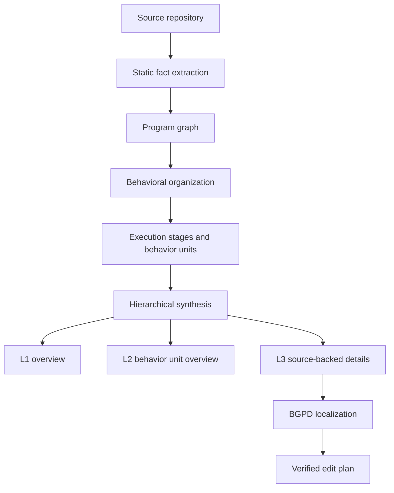

# Harness Handbook：把 Agent Harness 从“文件树”改写成“行为地图”

### 元信息与 TL;DR

- **论文**：[Harness Handbook: Making Evolving Agent Harnesses Readable, Navigable, and Editable](https://arxiv.org/abs/2607.13285)
- **作者**：Ruhan Wang、Yucheng Shi、Zongxia Li、Zhongzhi Li、Yue Yu、Junyao Yang、Kishan Panaganti、Haitao Mi、Dongruo Zhou、Leoweiliang
- **发布时间**：2026-07-14 21:39:55 UTC
- **项目页**：[Harness Handbook](https://ruhan-wang.github.io/Harness-Handbook/)
- **代码仓库**：[Ruhan-Wang/Harness_Handbook](https://github.com/Ruhan-Wang/Harness_Handbook)
- **类别**：大模型 Agent / agent harness / coding agent 软件工程

**TL;DR：**

- 这篇论文研究的不是“让模型更会写代码”，而是让 coding agent 在修改自己的外层 harness 之前，能先找到行为真正落在哪些代码位置。
- 作者把问题定义为 **behavior localization**：自然语言改动请求说的是行为，仓库结构给的是文件、函数和模块，两者之间缺少稳定映射。
- Harness Handbook 是一个由静态程序分析和 LLM 辅助结构化生成的三层行为手册：L1 讲系统执行流，L2 讲行为单元，L3 讲触发条件、状态变化、异常路径和源码证据。
- Behavior-Guided Progressive Disclosure（BGPD）是使用手册的定位流程：先从行为问题进入 L1/L2，再打开 L3 和真实源码验证候选位置，最后形成 edit plan。
- 实验在两个开源 agent harness 上做 plan-only 对比：Codex 和 Terminus-2；同一 planner LLM、同一工作流，只改变是否允许先读 Handbook。
- 关键数字是 planner token 成本下降而质量上升：Codex 平均从 0.102M 降到 0.089M，约少 12.7%；Terminus-2 从 0.058M 降到 0.053M，约少 8.6%。
- 论文声称最大收益出现在 scattered implementation sites、rarely executed paths 和 cross-module interactions，因为这些任务用关键词搜索最容易漏掉隐含路径。
- 局限同样清楚：实验衡量的是定位和计划质量，不是最终代码合并成功率；Handbook 依赖静态事实和 LLM 组织，若代码动态分派、生成代码或插件边界复杂，仍需要源码验证和 resync。

### 研究问题：为什么 Agent Harness 需要“行为定位”？

现代 Agent 的能力不只来自基础模型，还来自 harness：

- **Prompt construction**：把用户请求、系统规则、工具说明和历史状态拼成模型可用上下文。
- **State management**：记录会话、工具结果、权限选择、失败重试和中间计划。
- **Tool invocation**：把模型输出转成 shell、文件、浏览器、数据库、MCP 或远程 API 调用。
- **Execution coordination**：决定何时继续、何时停止、何时让用户确认、何时回退。

论文的核心观察是：用户提出的修改通常是行为级的，例如“删除文件前必须确认”或“单条命令允许传入临时环境变量”，但仓库只按文件和模块组织。

这会形成一个不对称问题：

| 用户请求语言 | 代码仓库语言 | 缺口 |
|---|---|---|
| 改一个行为 | 改若干文件、函数、状态和测试 | 不知道行为对应哪些实现点 |
| 审计一个规则 | 查 prompt、tool wrapper、permission、sandbox | 不知道是否覆盖旁路路径 |
| 扩展一个能力 | 改 schema、tool docs、runtime、tests | 不知道转发链是否完整 |
| 修复一个异常 | 找冷路径、fallback、状态清理 | 关键词可能完全搜不到 |

作者把这个缺口命名为 **behavior localization**：

> 找到一个行为请求所对应的全部实现位置。

这一定义很重要，因为它把 coding agent 的失败从“模型不够聪明”拆成一个更可操作的前置步骤：

- 如果定位错了，再强的 patch generator 也只是在错误范围内工作。
- 如果只找到主路径，安全确认、异常处理和状态复位仍可能漏改。
- 如果 edit plan 没有证据链，reviewer 要重新从文件树里追一遍。

### 论文主张与论证路线

作者不是简单提出一个新的代码索引，而是把“行为”作为代码理解的主索引。

| Claim | Mechanism | Evidence | Boundary |
|---|---|---|---|
| Harness 修改的瓶颈是行为到代码的映射 | 定义 behavior localization，并指出请求是行为级、仓库是实现级 | 引言分析大 harness 中行为跨文件、跨状态、跨执行阶段分布 | 只说明定位是必要前置，不说明所有失败都来自定位 |
| 行为地图比文件树更适合 harness 演进 | 用 L1/L2/L3 组织执行流、行为单元和源码证据 | Figure 1 展示三层 Handbook 和导航索引 | 行为边界仍由静态事实与 LLM 组织生成，可能受抽象粒度影响 |
| BGPD 能降低搜索成本并提升计划质量 | 从高层行为逐步披露到 L3，再验证真实源码 | Codex 和 Terminus-2 上 planner token 下降，judge 偏好上升 | 实验是 plan-only，不直接证明最终 patch pass rate |
| 收益来自更准的 localization，而非更多上下文 | 对比 file/symbol 级 recall、precision、F1 和 Wrong cases | 论文报告几乎所有设置下定位指标提升，Wrong cases 明显下降 | 参考答案由强模型计划构建，仍是评测代理指标 |
| Handbook 必须持续同步 | 修改后用 diff 和 plan 做 resynchronization | 附录描述 version alignment、scoped update、conservative handling | 对高度动态代码、插件系统和生成代码的同步质量还需更多证据 |

这条论证路线的关键是 **不把 LLM 摆在源代码之上**。论文反复强调：

- Handbook 的自然语言负责解释行为。
- 源码事实负责锚定每个行为声明。
- BGPD 的最后一步仍要打开当前源码验证候选位置。

这使它和“让模型总结整个仓库”有本质区别。后者容易生成漂亮但不可验证的文档；Harness Handbook 则试图让每条行为解释都能回到文件、函数、状态寄存器和调用关系。

### 方法机制：三层 Handbook 如何组织行为？

论文中的 Handbook 由三层组成，每层回答不同粒度的问题。

| 层级 | 主要问题 | 内容 | 读者动作 |
|---|---|---|---|
| L1 System Overview | 这个 harness 如何从请求跑到动作？ | 系统架构、执行阶段、设计原则、端到端数据流 | 建立全局执行模型 |
| L2 Behavior Unit Overview | 某类行为由哪些单元负责？ | 阶段列表、组件、输入输出、依赖、关键状态 | 缩小行为范围 |
| L3 Behavior Unit Detail | 某个行为具体由哪些代码证据支撑？ | 触发条件、处理步骤、状态读写、异常路径、源码链接 | 验证和形成 edit plan |

用论文项目页的例子，“删除文件前确认”并不是一个函数名，而是一条行为链：

- 模型发出删除文件的工具调用。
- harness 判断该操作是否属于高风险操作。
- 权限配置决定是否需要用户确认。
- 状态管理记录确认请求和用户回应。
- 工具 wrapper 决定继续、拒绝或返回错误。
- sandbox runner 执行被允许的真实操作。
- headless、auto-approval 或 fallback path 可能改变这条路径。

因此 L3 entry 不能只写“需要确认”，而要列出：

- **Trigger**：什么模型输出或工具调用进入该行为。
- **Permission rule**：哪个策略把它归为需确认操作。
- **State change**：确认请求和用户回应存在哪里。
- **Execution path**：同意、拒绝、无授权分别走向哪里。
- **Edge cases**：哪些模式或回退路径可能绕过主流程。
- **Evidence**：每个判断对应哪些文件、函数或行号。

这一设计把“理解、审计、修改”合并成同一条证据路径。理解时读 L1/L2；审计时下钻 L3 并核对源码；修改时把 L3 证据转成计划。

### Handbook 是怎样从代码生成的？

论文把生成过程拆成事实提取、行为组织和层次综合三类工作。



更具体地看，生成管线有两个关键约束。

**第一，静态事实先行。**

- 提取文件、函数、类、调用关系。
- 提取状态读写、配置边界、外部 API 调用。
- 形成 program graph，作为后续组织行为的事实底座。
- Phase 1 不依赖 LLM，因此可以先做 parser smoke test。

**第二，LLM 只做行为结构化。**

- 对函数或文件进行 stage assignment。
- 判断一个函数是否整体属于一个叙事单元，或是否需要切成 2 到 10 个连续 region。
- 在 proposer-reviewer 循环中修正 stage、unit boundary 和 code evidence。
- 最终渲染为 Markdown/HTML Handbook。

可以把目标写成一个简单公式：

```text
Handbook = Narrate( Organize_by_behavior( StaticFacts(repo) ) )

其中：
- StaticFacts(repo)：文件、符号、调用、状态读写、配置、外部调用
- Organize_by_behavior：把事实映射到执行阶段和行为单元
- Narrate：生成 L1/L2/L3 说明，但证据链接不能脱离 StaticFacts
```

这个公式的约束含义比形式本身重要：

- `Narrate` 不能凭空发明源码位置。
- `Organize_by_behavior` 不能只按目录树复制结构。
- `StaticFacts` 不解释行为，但限制解释必须落在真实代码上。

### BGPD：从行为问题到源码证据的渐进披露

Behavior-Guided Progressive Disclosure 解决的是使用时的上下文预算问题。coding agent 不能一次把大仓库读完，也不应该先打开所有可能文件。

论文中的 BGPD 可以写成伪代码：

```text
Input:
  Q: behavior-level change request
  H: generated Harness Handbook
  R: current source repository

State:
  candidates = []
  evidence = []
  open_questions = []

Loop:
  1. Read H.L1 to locate the execution stage related to Q.
  2. Read H.L2 entries under that stage to identify behavior units.
  3. Select L3 units whose triggers, states, or dependencies match Q.
  4. Expand call relations and state registers around those units.
  5. For every candidate source locator:
       open current source in R
       verify symbol, line range, state read/write, and downstream effect
       if locator is stale or unsupported:
           mark as rejected and continue search
  6. If coverage is incomplete:
       follow dependencies or registers back to L2/L3
  7. Stop when each required behavior link has source evidence.

Output:
  edit_plan with verified files, symbols, rationale, tests, and known failure boundaries
```

这段流程把“披露”拆成两个方向：

- **从上到下缩小范围**：先知道行为属于哪条执行链，再决定读哪些 stage 和 unit。
- **从下到上验证证据**：每个候选位置必须回到当前源码，不把 Handbook 当成最终真相。

这种设计也解释了为什么 token 可能下降。Baseline planner 要在文件树、关键词和上下文窗口之间反复试探；Handbook-assisted planner 先拿到行为路径，再只读路径上的证据。

### 实验设置：评测的是定位和计划，不是完整修复

论文实验使用两个开源 harness：

- **Codex**：真实生产级 coding agent harness，论文项目页称其有 2,267 个文件、超过 34,000 个函数、接近 160,000 条代码连接。
- **Terminus-2**：另一个真实 agent harness，包含多阶段控制流、工具调用、状态管理和模块交互。

评测条件保持一致：

| 维度 | Baseline | Handbook-Assisted |
|---|---|---|
| Coding agent | 相同 | 相同 |
| Planner LLM | 相同，论文项目页写为 DeepSeek-V4-Pro | 相同 |
| 输入请求 | 相同 modification requests | 相同 modification requests |
| 差异 | 不读 Handbook，直接探索仓库 | 先用 Handbook 做 BGPD，再验证源码 |
| 输出 | plan.md | plan.md |
| 是否执行 patch | 否 | 否 |

任务类型分为三类：

- **Q / Query**：调整已有行为，例如触发条件、执行时机、终止规则。
- **CF / Cross-file**：跨文件添加能力，需要连接 schema、pipeline、runtime 和外部接口。
- **SH / Search-hostile**：关键词不友好，关键逻辑隐藏在镜像实现、fallback 或冷路径里。

评测指标分三组：

| 指标 | 含义 | 论文想证明什么 |
|---|---|---|
| Preference rate | judge 更偏好哪一方的 plan | 计划整体质量是否更好 |
| Localization recall / precision / F1 | plan 找到的文件或符号与参考答案的匹配 | 是否找到了正确实现点 |
| Planner token cost | 每个 case 的 planner token 消耗 | 是否只是靠读更多上下文取胜 |

Judge 设置也很关键。论文使用 GPT-5.5、Opus 4.8、DeepSeek-V4-Pro 三个独立 judge，并让它们比较 plan localization、scope bloat 和 reasoning。

这说明作者尽量避免单一 judge 偏见，但也引入一个评测边界：

- 计划质量是模型评审结果，不是编译、测试或线上运行结果。
- 参考答案来自强模型 plan，而不是人工完整 patch ground truth。
- 因此结论应读成“更会找位置和写计划”，不是“自动修改必然成功”。

### 主要结果：更少 token，却更准地找到行为实现

论文报告的第一组硬数字是 token 成本：

| Harness | Baseline 平均 planner tokens | With Handbook 平均 planner tokens | 降幅 |
|---|---:|---:|---:|
| Codex | 0.102M | 0.089M | 12.7% |
| Terminus-2 | 0.058M | 0.053M | 8.6% |

这组结果支持一个重要判断：

- Handbook 不是简单把更多上下文塞给 planner。
- 它更像一个 routing layer，让 planner 更早进入相关行为区域。
- 质量提升和 token 下降同时出现，说明收益来自搜索路径改善，而不是预算扩张。

第二组结果关注 localization：

- 在 Opus 4.8 和 GPT-5.5 reference 下，file-level 与 symbol-level 的 recall、precision、F1 大多提升。
- Wrong cases 明显下降，也就是 planner 进入完全错误子系统的情况更少。
- 增益在复杂、分散、跨模块任务中更明显。

这对 agent harness 尤其重要，因为 harness bug 常常不是“某个函数写错”，而是“某条行为链漏了一个状态或旁路”。

例如项目页的临时环境变量例子看似只是在命令参数里加 `env`，但实际会扩展到：

- 命令 schema。
- 工具描述。
- 参数转换函数。
- 执行请求对象。
- process manager。
- 运行时环境合并点。
- 多个镜像测试。

作者给出的数字是 **14 个实现点，横跨 10 个文件**。这正是 file tree 和 keyword search 容易误导的地方：你可能搜到 schema，却漏掉 tool description；改了 runtime，却漏掉测试或参数转发。

### 消融、失败边界与 Figure/Table 证据解读

论文的 Figure 1 是方法图，也是全文最重要的概念图。它表达三点：

- Handbook 不是单层 README，而是从 system overview 到 stage/unit detail 的层级结构。
- 左侧导航不仅按组件，也按状态寄存器和执行阶段组织。
- 每个详细行为单元都要保留 source evidence，从而支持验证和修改。

实验图表则主要支撑三类 claim：

| 图表功能 | 支撑的结论 | 不能证明什么 |
|---|---|---|
| Preference rate | judge 更偏好 Handbook-assisted plan | 不能证明最终 patch 更容易合并 |
| Token cost | 搜索路径更短，planner 成本下降 | 不能单独说明定位更准 |
| Localization 指标 | file/symbol 级别更接近 reference | reference 本身仍可能不完美 |
| Request type/difficulty 拆分 | hard、cross-file、search-hostile 任务也有收益 | 样本是否覆盖所有工业 harness 仍未知 |
| Appendix E walkthrough | 展示 BGPD 如何从 completion gate 和 state register 找到真实位置 | 单例 walkthrough 不能替代统计证据 |

附录 E 的 Terminus-2 例子尤其有解释力。任务是把“完成确认”从一次确认提高到连续三次确认。自然语言请求没有给文件名，planner 先通过 Handbook 找到 Completion Gate stage，再关联到 `pending_completion` 这类状态寄存器，随后打开真实源码验证出现位置。

这个案例说明 BGPD 的关键不是“告诉 agent 答案”，而是把搜索空间压到一条有行为含义的路径上：

- 先定位负责终止和继续的阶段。
- 再定位负责确认状态的 register。
- 再检查初始化、循环、重置和非完成路径。
- 最后才写计划。

如果直接搜 “complete” 或 “submit”，很容易只改返回分支，漏掉 run start reset 或非完成 turn 的状态清理。

### 相关工作位置：它介于 repo map、memory 与 program analysis 之间

Harness Handbook 的位置可以这样理解：

| 方向 | 已有能力 | Harness Handbook 的差异 |
|---|---|---|
| Code search | 快速找到关键词、符号、文件 | 不知道多个位置如何共同实现一个行为 |
| Repository map | 压缩目录、文件和函数结构 | 仍以实现结构为中心 |
| Long-context coding | 一次读更多代码 | 不能保证读到的是行为相关路径 |
| Repository memory | 记住历史探索和修改 | 可能陈旧，且不一定覆盖行为链 |
| Static analysis | 给出调用、状态、依赖事实 | 本身不解释用户行为请求 |
| LLM summarization | 生成自然语言说明 | 若不绑定事实，容易不可验证 |

论文真正的贡献是把这些东西组合成一个 **behavior-first evidence index**：

- program graph 提供事实。
- LLM structuring 提供行为组织。
- L1/L2/L3 提供渐进导航。
- BGPD 提供使用协议。
- source verification 保持仓库为真相来源。

### 可复现性与工程边界

项目仓库给出两条生成路径：

- **large codebase pipeline**：file-as-leaf，自底向上读每个文件，适合不想手写 skeleton 的大仓库。
- **small codebase pipeline**：skeleton-driven，需要提供 stage lifecycle，更适合小型或结构清楚的项目。

仓库还提供 `handbook_as_helper/`：

- 把生成的 Handbook 构造成 agent planner 可读的 Skill。
- 用 map-reduce 形式让 parent planner 读小文件，让 locator sub-agent 读大 stage 或源码文件。
- 当前是 plan-only，不执行真实 diff。
- resync 独立于 planner，接收真实代码改动、plan 和可选 diff，把 Handbook 的派生层向前滚动。

这带来几个现实边界：

- 对大型私有仓库，静态分析能否处理宏、生成代码、插件加载和动态 import，需要单独验证。
- 对安全审计，Handbook 可以暴露候选路径，但不能替代运行时测试、权限模型验证和 adversarial review。
- 对频繁变动的 agent harness，resync 本身会成为一条新流水线，必须有版本对齐、保守更新和失败回退。
- 对 coding agent，Handbook 如果被当成权威文档而不回源验证，反而可能变成 stale documentation risk。

### 研究者视角：这篇论文改变了怎样的问题分解？

我认为这篇论文最值得带走的不是“给仓库生成一本文档”，而是它把 agent 系统维护拆成两个可测量阶段：

1. **Localization before editing**
   - 先问：这个行为到底由哪些 prompt、状态、工具包装、权限和 runtime 路径共同决定？
   - 再问：这些位置在当前源码里是否仍存在，是否有旁路，是否需要测试覆盖？

2. **Evidence before autonomy**
   - agent 可以提出计划，但每个计划项必须带行为证据和源码验证。
   - 对高风险操作，计划的 reviewability 可能比一次性 patch 成功更重要。

3. **Behavior map before repo memory**
   - 普通 memory 记录“上次看过什么”。
   - Handbook 记录“系统行为如何展开”。
   - 二者可以结合，但 Handbook 的强约束是每条行为描述要能回到代码事实。

这对后续 agent 研究提出了几个问题：

- 能否把 BGPD 和自动测试选择连接起来，让行为路径直接生成 regression tests？
- 能否把权限、安全确认、数据外发、secret handling 等安全行为做成专门的 audit handbook？
- 能否在 PR review 中要求 coding agent 输出 “behavior localization report”，而不是只输出 diff summary？
- 能否度量 resync 质量，发现 Handbook 已经和源码偏离的行为单元？
- 能否让 harness 自身在运行时记录 trace，再反向校准静态 Handbook？

### 进一步细读：它最适合解决哪几类 Agent 维护难题？

把 Harness Handbook 放回真实 agent 工程场景，可以看到它最适合处理的并不是所有代码修改，而是那些“需求一句话、实现一长串”的改动。

| 难题类型 | 典型请求 | 为什么文件树不够 | Handbook 应该提供什么 |
|---|---|---|---|
| 权限与确认 | 高风险命令必须询问用户 | 规则散在 prompt、policy、tool wrapper、sandbox | 从行为链列出所有允许、拒绝、旁路和状态记录点 |
| 状态生命周期 | 一次运行的临时变量不能泄漏到下一次 | 初始化、执行、清理、异常退出分布在不同阶段 | 把状态读写点按 register 串起来 |
| 工具参数转发 | 为 shell 命令新增一个字段 | schema、tool description、adapter、runtime、tests 都要改 | 找到字段从模型描述到进程创建的完整路径 |
| 冷路径修复 | 超时、解析失败、重试后要正确回退 | 相关代码很少执行，关键词也不稳定 | 从异常路径和 fallback 单元进入 |
| 多 agent 协调 | 子 agent 的结果要被父 agent 可靠合并 | 调度、消息格式、上下文压缩、错误处理交织 | 显示跨阶段依赖和状态边界 |

这几类难题有一个共同点：正确修改不取决于单个函数，而取决于行为链是否闭合。

更具体地说，行为链闭合至少包含四个检查：

- **入口闭合**：所有可能触发该行为的入口都被识别，包括主命令、快捷路径、自动模式和测试辅助入口。
- **状态闭合**：读写同一状态的地方被放在一张图里，包括初始化、正常更新、异常清理和跨轮次复位。
- **权限闭合**：允许、拒绝、升级确认和静默跳过都被列出，而不只看最常见路径。
- **验证闭合**：计划中的每个文件和符号都能在当前源码中打开，并能解释为什么缺它会造成行为不完整。

这也是论文对 coding agent 的隐含要求：agent 不应只回答“我会改这些文件”，而应回答“这些文件共同实现了哪条行为链，我怎样知道链条已经覆盖完整”。

如果把这个要求转成一个 review checklist，可以写成：

```text
For each requested behavior change:
  1. Identify all trigger paths.
  2. Identify all state registers read or written by the behavior.
  3. Identify all permission, policy, and sandbox gates.
  4. Identify all fallback and exceptional paths.
  5. Verify every candidate locator against current source.
  6. Attach tests to the behavior chain, not only to changed functions.
```

这份 checklist 解释了为什么 Handbook 对安全相关 harness 改动特别有意义。

- 安全规则经常不是一个布尔判断，而是一串控制点。
- 攻击者利用的往往不是主路径，而是未被文档覆盖的旁路。
- reviewer 需要看到行为证据，而不是只看 patch diff。
- 自动化 agent 如果不能证明定位覆盖范围，就不应被允许直接扩大权限或改写执行策略。

不过，这个方向也带来一个新的研究风险：Handbook 本身可能成为 agent 的高信任上下文。

因此使用时要保持三条约束：

- **手册不是权威，源码才是权威**：Handbook 只能缩小搜索范围，不能替代打开文件验证。
- **同步不是可选项**：每次非空 diff 后都要判断哪些 L3 单元、register 和 evidence link 需要更新。
- **安全行为要额外保守**：涉及文件删除、网络访问、secret、权限升级和数据外发时，BGPD 的输出应进入人工审查或强测试门禁。

从这个角度看，Harness Handbook 的长期价值可能不只是帮助 agent 写计划，而是给 agent 系统建立一种可审计的中间层：

- 对开发者，它是 onboarding 和 review 地图。
- 对 coding agent，它是定位和计划的压缩上下文。
- 对安全审计，它是从规则声明追到执行证据的索引。
- 对实验研究，它把“仓库理解能力”变成可分解、可度量的 localization 问题。

### 结论与局限

Harness Handbook 的核心价值，是把 Agent Harness 的理解单位从文件和函数提升到行为链。

它给 coding agent 的帮助不是“更多上下文”，而是更好的进入顺序：

- 从用户行为问题进入。
- 经过 L1/L2/L3 缩小范围。
- 打开真实源码验证。
- 生成带证据边界的 edit plan。

论文的实验证据支持这一点：在 Codex 和 Terminus-2 两个 harness 上，Handbook-assisted planner 被多个 judge 更常偏好，同时 planner token 成本下降。

但边界也必须保留：

- 当前实验主要评价定位和计划质量。
- 未直接报告最终 patch 成功率、测试通过率或线上回归率。
- 参考答案和评审仍依赖强模型。
- 动态执行、插件、生成代码和快速演进仓库会挑战静态事实与 resync。

因此，比较稳妥的结论是：

- 对复杂 agent harness，行为地图是代码搜索和 repo map 之上的必要路由层。
- 对 coding agent 自动修改，定位报告和证据链应当成为计划阶段的默认产物。
- 对 AI 安全和权限审计，Harness Handbook 提供了一种从“规则声明”追到“执行路径”的实用结构，但不能取代最终的源码、测试和运行时验证。

### 参考链接

- [arXiv 摘要页](https://arxiv.org/abs/2607.13285)
- [arXiv HTML 正文](https://arxiv.org/html/2607.13285)
- [项目页](https://ruhan-wang.github.io/Harness-Handbook/)
- [GitHub 仓库](https://github.com/Ruhan-Wang/Harness_Handbook)
- [Hugging Face Papers 页面](https://huggingface.co/papers/2607.13285)
