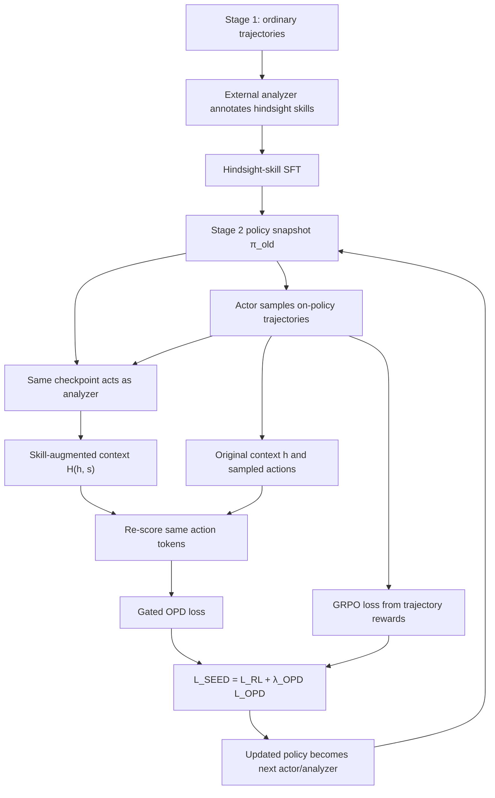

# SEED：让 Agent 在自己的轨迹里生成、更新并内化 hindsight 技能

### 元信息

| 项目 | 内容 |
| --- | --- |
| 论文 | SEED: Self-Evolving On-Policy Distillation for Agentic Reinforcement Learning |
| 方向 | 大模型后训练 / Agentic RL |
| 作者 | Jinyang Wu, Shuo Yang, Zhengxi Lu, Fan Zhang, Yuhao Shen, Lang Feng, Haoran Luo, Zheng Lian, Shuai Zhang, Zhengqi Wen, Jianhua Tao |
| 机构 | Tsinghua University, Zhejiang University, CUHK, NTU, Tongji University |
| arXiv | https://arxiv.org/abs/2607.14777 |
| HTML 全文 | https://arxiv.org/html/2607.14777 |
| 项目页 | https://jinyangwu.github.io/seed/ |
| 代码 | https://github.com/jinyangwu/SEED |
| 模型 | https://huggingface.co/Jinyang23/Seed-AlfWorld-3B |
| 时间 | arXiv v1: 2026-07-16；GitHub README 标记 2026-07-16 release paper and code |

### TL;DR

- **这篇论文做什么**：SEED 研究长程 LLM Agent 的后训练问题。它认为 outcome-only RL 只告诉模型一条 episode 成没成功，却不能告诉模型中间哪一步观察、动作或工具调用值得强化，因此要把完成后的轨迹转成训练期 hindsight skill，再把 skill 对动作概率的影响蒸馏回普通策略。
- **核心机制**：训练分两阶段。第一阶段用外部 analyzer 给离线轨迹标注 episode-level skill，并做 Hindsight-skill SFT；第二阶段进入 RL，每轮把当前策略冻结成 `π_old`，同一个 checkpoint 既采样 on-policy 轨迹，又分析这些轨迹生成 skill，再用普通上下文和 skill-augmented 上下文对同一批 action token 重新打分，形成 gated OPD loss，与 GRPO loss 联合训练。
- **关键数字**：在 Qwen2.5-3B 上，SEED 的 ALFWorld 平均成功率为 **91.8**，高于 GRPO 的 **75.0** 和 SDAR 的 **84.4**；Search-based QA 平均 **45.7**，高于 GRPO 的 **36.4**；WebShop success **78.9**，高于 GRPO 的 **63.3**。
- **更重要的证据**：样本效率上，SEED 用 **60%** ALFWorld 训练数据达到 **80.7**，超过 GRPO 用 100% 数据的 **75.0**；ALFWorld unseen 上，SEED 从 GRPO 的 **70.9** 提到 **86.2**，平均多 **15.3** 点；视觉扩展中，Sokoban/EZPoints 平均从 GRPO 的 **77.0** 提到 **91.0**。
- **局限**：SEED 的收益依赖 analyzer 生成的 skill 是否真的支持更好动作；SFT 阶段仍用 GLM-5.2 外部标注器；主实验围绕 ALFWorld、WebShop、Search-R1 式 QA 和两个视觉任务，不能直接证明任意真实工具 Agent、开放网页、长时部署或安全约束下都稳定有效。
- **一句话判断**：SEED 的价值不在“给 Agent 多塞一段反思提示”，而在把 hindsight 从 inference-time memory 改成 _on-policy、token-level、会随策略同步更新_ 的训练信号。


### 1. 研究问题：为什么长程 Agent 的 RL 需要比终局奖励更细的信号？

论文把长程 Agent 的学习困难拆成三个层次：

| 层次 | outcome-only RL 能看到什么 | 它看不到什么 | SEED 想补的东西 |
| --- | --- | --- | --- |
| 轨迹级 | episode 成功/失败，或者最终 score | 哪个中间动作导致成功或失败 | 从完整轨迹抽取 reusable workflow / failure-avoidance rule |
| token 级 | 每个 action token 共享同一个轨迹 advantage | action 内部不同 token 的局部贡献 | skill-induced log-prob shift 形成 dense token weight |
| 策略演化 | 当前 batch 的 reward | 策略变强后遇到的新状态和新失败模式 | 每轮用最新策略自己当 actor 和 analyzer |

这和普通“反思式 Agent”的区别很关键：

- 反思式 Agent 常把经验作为 **外部文本记忆**，在下一次推理时检索或拼进 prompt。
- SEED 把经验作为 **训练期特权监督**，更新后部署模型不再需要 skill prompt、skill bank、retrieval module 或 analyzer。
- 因此它要证明的不是“反思文本能不能帮一次推理”，而是“反思文本诱导出来的行为偏移能不能被参数化策略吸收”。

论文用三个要求定义有效 hindsight supervision：

1. **On-policy**：skill 必须来自当前策略真实访问的状态、动作和失败模式。
2. **Dense**：skill 不能只变成一个 episode 标签，而要落到 action token 的训练权重上。
3. **Self-evolving**：策略变了，analyzer 的能力和生成 skill 的分布也应随之更新。

### 2. 方法总览：两阶段，而不是“训练时多加一句 skill”


SEED 的完整流程可以读成一个闭环：



#### 2.1 Stage 1：Hindsight-skill SFT 初始化 analyzer 能力

论文先用 base policy 收集普通轨迹：

```text
Input:
  tasks Q_sft = {q_j}_{j=1..M}
  base policy π_base
  K0 rollouts per task

For each task q_j:
  collect B_j = {τ_j,k}_{k=1..K0}, where τ_j,k ~ π_base(. | q_j)

For each completed trajectory τ:
  external analyzer A_ext(τ) -> hindsight skill s_τ
  keep only correctly formatted skill

Output:
  D_sft = {(serialized trajectory x_τ, skill s_τ)}
  θ_sft after supervised fine-tuning
```

这里的细节有两个：

- 轨迹本身没有 skill augmentation，避免一开始就把 skill prompt 作为决策条件。
- 外部 analyzer 只参与离线标注，不参与部署；论文实现里用 GLM-5.2，temperature 0.0，最大 4096 tokens。

SFT 目标是标准自回归 NLL：

$$
L_{sft}(\theta)
=-\mathbb{E}_{(x_\tau,s_\tau)\sim D_{sft}}
\left[
\sum_{\ell=1}^{|s_\tau|}
\log \pi_\theta(s_{\tau,\ell}\mid x_\tau,s_{\tau,<\ell})
\right]
$$

变量解释：

| 符号 | 含义 |
| --- | --- |
| `x_τ` | 序列化后的完整 episode：任务、观察、动作、奖励和终局结果 |
| `s_τ` | analyzer 生成的 hindsight skill |
| `θ_sft` | 后续同时初始化 actor 和 analyzer 的 checkpoint |

#### 2.2 Stage 2：Self-evolving OPD 让 actor 和 analyzer 同步演化

每轮 RL update 开始时，当前策略被冻结为 `π_θold`：

- `π_θold` 作为 actor 采样一组轨迹。
- 同一个 `π_θold` 作为 analyzer，读取完成后的轨迹并生成 skill。
- 可训练策略 `π_θ` 对同一批 sampled actions 做 paired re-scoring。
- 更新后的 `π_θ` 变成下一轮新的 actor/analyzer。

这个设计解决的是 skill staleness：

| 方案 | skill 来源 | 风险 |
| --- | --- | --- |
| 固定 skill library | 旧策略或外部数据 | 策略已经变了，skill 仍描述旧失败模式 |
| inference-time skill prompt | 检索或人工文本 | 推理成本变高，且模型可能被 prompt 格式牵着走 |
| SEED | 当前策略自己的完成轨迹 | 分布匹配更好，但依赖 analyzer 当前能力 |

### 3. OPD 目标：不是模仿另一个 teacher，而是比较同一策略的两种上下文

SEED 的关键不是“生成 skill”，而是如何把 skill 变成 token-level 训练信号。

对一个 task `q`，冻结策略采样 `N` 条轨迹：

$$
G_q=\{\tau_q^{(1)},\tau_q^{(2)},\ldots,\tau_q^{(N)}\},
\quad
\tau_q^{(n)}\sim \pi_{\theta_{old}}(\cdot\mid q)
$$

对第 `n` 条完成轨迹，analyzer 生成：

$$
s_q^{(n)} = A_{\theta_{old}}(x_{\tau_q^{(n)}})
$$

然后对每个 action step 构造两个上下文：

| 上下文 | 形式 | 用途 |
| --- | --- | --- |
| 普通上下文 | `h_{q,n,t}` | student branch，部署时真正可见 |
| skill 增强上下文 | `\tilde{h}_{q,n,t}=H(h_{q,n,t},s_q^{(n)})` | teacher branch，只用于训练期重打分 |

注意：两个分支看的 action tokens 是同一批已经采样出来的 `a_{q,n,t}`。这避免 teacher 另采一批动作造成 off-policy mismatch。

skill-induced shift 定义为：

$$
\Delta_{q,n,t,\ell}
=sg[
\ell^{skill}_{q,n,t,\ell}
-\ell^\theta_{q,n,t,\ell}
]
$$

其中：

| 符号 | 含义 |
| --- | --- |
| `\ell^{skill}` | 当前策略在 skill-augmented context 下给同一 token 的 log-prob |
| `\ell^\theta` | 当前策略在普通 context 下给同一 token 的 log-prob |
| `sg[·]` | stop-gradient，teacher 分支和 gate 不反传 |

再把 shift 变成 confidence gate：

$$
g_{q,n,t,\ell}=\sigma(\beta_{opd}\Delta_{q,n,t,\ell})
$$

直觉是：

- 如果加上 skill 后，同一 action token 的 log-prob 上升，说明 skill 支持这个 token。
- gate 变大，普通策略会被更强地推动去内化这个 token。
- 如果 skill 不支持甚至降低该 token 的概率，gate 变小，辅助监督被削弱。

OPD loss 写作：

$$
L_{opd}(\theta)
=
\mathbb{E}_{q,n,t,\ell}
\left[
m_{q,n,t,\ell}\cdot g_{q,n,t,\ell}\cdot
(sg[\ell^{skill}_{q,n,t,\ell}]-\ell^\theta_{q,n,t,\ell})
\right]
$$

因为 teacher log-prob 和 gate 都 stop-gradient，梯度等价于 gate-weighted NLL：

$$
\nabla_\theta L_{opd}
=
-\mathbb{E}
\left[
m\cdot g\cdot\nabla_\theta \ell^\theta
\right]
$$

这就是 SEED 的核心 credit assignment：skill 不直接作为部署 prompt，而是把“skill 会让哪些 sampled token 更可信”变成训练权重。

### 4. 与 GRPO 的联合：终局 reward 仍在，但不再独自承担所有信用分配

SEED 保留 group-relative RL。对同一 task 的 rollout group：

$$
\mu_q=\frac{1}{N}\sum_{n=1}^{N}R(\tau_q^{(n)}),
\quad
\sigma_q=
\sqrt{
\frac{1}{N}\sum_{n=1}^{N}(R(\tau_q^{(n)})-\mu_q)^2
}
$$

轨迹 advantage：

$$
A^{rl}_{q,n}
=
\frac{R(\tau_q^{(n)})-\mu_q}{\sigma_q+\epsilon}
$$

最终目标：

$$
L_{SEED}(\theta)=L_{rl}(\theta)+\lambda_{opd}L_{opd}(\theta)
$$

这使两个信号分工明确：

| 信号 | 优化对象 | 强项 | 弱项 |
| --- | --- | --- | --- |
| GRPO / `L_rl` | episode outcome | 保持目标任务对齐，避免只模仿文本解释 | reward 稀疏，同一轨迹 token 共享 advantage |
| OPD / `L_opd` | skill 支持的 sampled token | 给中间动作和 token 更细监督 | skill 可能不准，需要 gate 和 RL 约束 |

论文的理论附录没有声称单调提升 return，而是给出更谨慎的结论：

- On-policy hindsight 会诱导一个 occupancy-matched adaptive target。
- 当 rollout group reward 全相等、GRPO 的 reward-driven 梯度退化时，OPD 仍可能提供非零 token-level signal。
- 如果 analyzer 太旧，辅助梯度会随 behavior distribution 和 analyzer mismatch 变 stale。
- 这些性质说明“为什么设计上合理”，但 empirical benefit 仍取决于 hindsight skill 是否 behaviorally informative。

### 5. 实验设置：三个文本 Agent 域，加上两个视觉扩展域

主实验覆盖三类长程 agency：

| 域 | Benchmark | 任务规模 | 指标 |
| --- | --- | ---: | --- |
| Embodied reasoning | ALFWorld | SFT 180 tasks；RL 2,400；seen test 140；unseen 134 | 六类任务 success rate 和宏平均 |
| Web navigation | WebShop | SFT 180；RL 2,400；test 128 | normalized score 与 exact success |
| Search-augmented QA | NQ、TriviaQA、PopQA、HotpotQA、2Wiki、MuSiQue、Bamboogle | SFT 180；RL 19,200；test 51,713 | 七数据集 accuracy 宏平均 |

实现设置：

| 项 | 值 |
| --- | --- |
| Backbone | Qwen2.5-3B-Instruct、Qwen2.5-7B-Instruct、Qwen3-1.7B-Instruct |
| SFT 轨迹 | 每 benchmark 180 tasks × 8 rollouts = 1,440 completed trajectories |
| RL updates | 150 |
| Batch size | ALFWorld/WebShop 为 16；Search 为 128 |
| Rollout group size `N` | 8 |
| Learning rate | `1e-6` |
| PPO clip `ε_clip` | 0.2 |
| OPD gate sharpness `β_opd` | 5.0 |
| OPD coefficient `λ_opd` | 0.01 |
| KL coefficient `β_KL` | 0.01 |
| Max interaction steps | ALFWorld 30；WebShop 15；Search 4 |
| Compute | 8 × Nvidia A800 80G |

代码 README 也补充了工程侧细节：

- 支持 `alfworld`、`search`、`webshop`、`ezpoints`、`sokoban` 五组 SFT 脚本。
- WebShop 需要单独的 Python 3.10 环境；Search QA 需要本地 flat e5 retrieval server。
- 仓库默认用 repo-level `.env` 填模型路径、数据路径、analyzer endpoint 和日志配置。
- 公开 HF checkpoint `Seed-AlfWorld-3B` 明确声明推理时不需要 analyzer、skill bank、retrieval module 或 additional skill prompt。

### 6. 主结果：SEED 的收益不是一个 benchmark 上的偶然点


#### 6.1 Qwen2.5-3B：最清楚的一组对比

| 方法 | ALFWorld Avg | Search Avg | WebShop Score | WebShop Succ |
| --- | ---: | ---: | ---: | ---: |
| Vanilla | 21.9 | 31.7 | 6.7 | 0.8 |
| Skill-Prompt* | 28.9 | 23.9 | 0.2 | 0.8 |
| GRPO | 75.0 | 36.4 | 79.8 | 63.3 |
| Skill-GRPO* | 80.5 | 36.1 | 76.3 | 66.4 |
| GRPO+OPSD | 81.2 | 44.6 | 77.8 | 66.4 |
| SDAR | 84.4 | 43.4 | 85.0 | 68.0 |
| **SEED** | **91.8** | **45.7** | **88.5** | **78.9** |

这张表说明三件事：

- 单纯把 skill 放进 eval prompt 不稳定，Skill-Prompt 在 Search 和 WebShop 上甚至低于 Vanilla。
- Outcome-only GRPO 已经很强，但在 ALFWorld 和 WebShop success 上仍明显落后 SEED。
- 静态 self-distillation 类方法能逼近一部分收益，但 SEED 在 ALFWorld 和 WebShop success 上仍拉开差距。

#### 6.2 跨 backbone：SEED 在 3B、7B、1.7B 上都有效

| Backbone | 对比对象 | ALFWorld Avg 提升 | Search Avg 提升 | WebShop Succ 提升 |
| --- | --- | ---: | ---: | ---: |
| Qwen2.5-3B | SEED vs GRPO | +16.8 | +9.3 | +15.6 |
| Qwen2.5-7B | SEED vs GRPO | +14.9 | +6.6 | +5.5 |
| Qwen3-1.7B | SEED vs GRPO | +45.9 | +1.4 | +39.0 |

论文作者强调，SEED 相对 GRPO 的提升不仅来自更大的模型：

- 小模型 Qwen3-1.7B 上，ALFWorld 从 46.1 到 92.0，WebShop success 从 38.3 到 77.3。
- 7B 上提升幅度较小但仍稳定，说明方法不是只在弱 baseline 上成立。
- Search QA 提升相对温和，可能因为 search 工具任务更依赖检索质量和答案抽取，而不是纯交互策略。

#### 6.3 训练动态：更快成功，也更少无效步

Figure 3 显示 Qwen2.5-3B 在 ALFWorld 上：

- 到 step 40 左右，SEED success rate 已约 **57%**，GRPO 约 **35%**。
- 训练末尾，SEED 平均 episode length 从约 **28** 降到 **13**。
- GRPO 末尾约 **16** turns，虽然也变短，但成功率低于 SEED。

这里不能简单说“步数越短越好”。关键是 shorter trajectory 与 higher success 同时出现，说明 SEED 更像是在减少无用探索，而不是提前放弃。

### 7. 样本效率与泛化：最能支持“hindsight 被内化”的证据


#### 7.1 样本效率

| 训练数据比例 | GRPO ALFWorld | SEED ALFWorld | 差值 | GRPO WebShop | SEED WebShop | 差值 |
| ---: | ---: | ---: | ---: | ---: | ---: | ---: |
| 20% | 27.3 | 40.7 | +13.4 | 31.3 | 37.5 | +6.2 |
| 40% | 42.2 | 58.9 | +16.7 | 45.3 | 53.1 | +7.8 |
| 60% | 56.3 | 80.7 | +24.4 | 57.0 | 62.5 | +5.5 |
| 80% | 58.6 | 88.8 | +30.2 | 63.6 | 75.0 | +11.4 |
| 100% | 75.0 | 91.8 | +16.8 | 63.3 | 78.9 | +15.6 |

最强证据是 ALFWorld：

- SEED 用 60% 数据达到 80.7。
- GRPO 用 100% 数据只有 75.0。
- 这支持作者的主张：completed trajectory 里有比 terminal reward 更丰富的监督，而 SEED 的 OPD 把它转成了可训练的 token-level signal。

#### 7.2 Unseen split 泛化


| ALFWorld Unseen | ReAct | GRPO | SEED | SEED - GRPO |
| --- | ---: | ---: | ---: | ---: |
| Pick | 17.4 | 73.9 | 90.4 | +16.5 |
| Look | 6.7 | 60.0 | 78.3 | +18.3 |
| Clean | 8.8 | 82.4 | 79.5 | -2.9 |
| Heat | 7.4 | 59.3 | 94.3 | +35.0 |
| Cool | 9.1 | 72.7 | 86.2 | +13.5 |
| Pick2 | 0.0 | 76.9 | 88.2 | +11.3 |
| **Avg** | **8.2** | **70.9** | **86.2** | **+15.3** |

这组结果比 seen split 更能支持“技能被参数内化”：

- 如果 SEED 只是记住训练 trajectories，unseen split 不应普遍提升。
- 它在 5/6 个 task family 上提升，说明 workflow / avoidance rule 至少在 ALFWorld 家族内有迁移性。
- `Clean` 下降 2.9 点提醒我们：skill 内化并不保证所有子任务单调变好，某些任务族可能因为策略偏好、数据覆盖或 skill 粒度出现局部退化。

### 8. 消融：三件事都重要，但 on-policy skill 最关键

论文 Table 2 在 ALFWorld 上做了三类消融：

| 变体 | Pick | Look | Clean | Heat | Cool | Pick2 | Avg | 相对 SEED |
| --- | ---: | ---: | ---: | ---: | ---: | ---: | ---: | ---: |
| SEED | 100.0 | 100.0 | 100.0 | 100.0 | 70.6 | 80.0 | 91.8 | 0 |
| w/o Hindsight Skill SFT | 97.6 | 81.8 | 92.6 | 90.0 | 84.2 | 70.0 | 86.0 | -5.8 |
| w/o Self-Evolving OPD | 93.3 | 70.0 | 96.9 | 84.6 | 76.9 | 100.0 | 87.0 | -4.8 |
| w/o On-Policy Skill | 97.1 | 62.5 | 100.0 | 61.9 | 75.0 | 84.2 | 84.4 | -7.4 |

逐项解释：

- **去掉 Hindsight Skill SFT**：模型一开始缺少“读完整 episode 并抽取 skill”的能力，后续自演化循环起步更差。
- **去掉 Self-Evolving OPD**：只靠一次 SFT skill supervision 不够，说明训练过程中需要持续从新轨迹抽取监督。
- **去掉 On-Policy Skill**：换成静态 offline skill library 后掉得最多，说明 skill 与当前策略访问分布匹配是关键。

这也解释了为什么 SEED 不是普通 RLAIF：

- 它没有把外部模型当持续 teacher。
- 也不是让一个固定 critic 判断动作好坏。
- 它把当前策略自己的 trajectory distribution 作为监督来源，然后只用外部 analyzer 初始化 skill language 能力。

### 9. 失败案例与行为细读：GRPO 的问题不是“不知道目标”，而是中途信用断裂


Figure 6 的任务是 `put a candle in toilet`。

GRPO 轨迹的典型错误：

- 第一步先去 `toilet 1`，但 candle 并不在 toilet。
- 随后拿了 `toiletpaper2`，偏离目标物体。
- 后面在 toilet、shelf、sinkbasin、toiletpaperhanger 之间循环，直到 step limit。
- 它不是完全不知道任务，而是“找 candle → 拿 candle → 去 toilet → 放置”的中间顺序没有被稳定强化。

SEED 轨迹的差异：

- 第一步判断 candle 更可能在 shelf/cabinet，而不是目标 receptacle。
- 第二步到 shelf 2，找到 `candle 1`。
- 随后拿 candle，去 toilet，在第 5 步完成 placement。

这正好对应 hindsight skill 的形式：

| 成功 workflow | 失败 avoidance |
| --- | --- |
| 先定位目标物，再满足状态条件，最后移动到目标位置 | 不要在确认 inventory 和 object state 前反复移动无关物体 |

这个案例不能单独证明泛化，但它说明 SEED 的 dense supervision 可能具体强化了哪些 decision pattern：

- 先找 source object，而不是先冲向 target receptacle。
- 当观察里没有目标物体时，按 plausible storage location 系统搜索。
- 拿到目标物体后再执行 placement，而不是在目标位置拿错替代物。

### 10. 视觉扩展：方法不只适用于纯文本轨迹

论文补充实验把 SEED 用到 Qwen2.5-VL-3B-Instruct：

| 方法 | Sokoban 6×6 | EZPoints | Average |
| --- | ---: | ---: | ---: |
| ReAct | 11.7 | 3.1 | 7.4 |
| GRPO | 67.1 | 86.9 | 77.0 |
| SEED | 82.0 | 100.0 | 91.0 |
| Δ | +14.9 | +13.1 | +14.0 |


这里要保守解读：

- Sokoban 和 EZPoints 说明“trajectory → hindsight skill → OPD”机制可以接入视觉状态。
- 但这不是机器人实机，也不是开放物理环境；视觉输入被限定在可控 benchmark。
- 对真实 embodied agent，还需要 perception uncertainty、actuator failure、safety monitor 和恢复机制。

### 11. 相关工作位置：SEED 在哪些线之间插了一刀？

| 方向 | 代表思路 | SEED 的差异 |
| --- | --- | --- |
| Outcome RL / GRPO | 用 group reward 优化 sampled trajectories | 保留 GRPO，但补 dense OPD |
| Hindsight learning | HER、RUDDER、process supervision | 把 completed trajectory 解释为自然语言 skill |
| Reflection / memory Agent | Reflexion、ExpeL、经验摘要 | 不在推理时检索记忆，而是训练期内化 |
| Skill-conditioned RL | Skill-GRPO、Skill-SD、SDAR | 不依赖 eval-time skill prompt；analyzer 随 policy 更新 |
| On-policy self-distillation | 比较同模型不同上下文 | teacher branch 是 skill-augmented context，且 skill 来自当前完成轨迹 |

最值得注意的是 SEED 和 SDAR / Skill-SD 的边界：

- 它们都关心“把 privileged information 蒸馏回普通策略”。
- SEED 强调 `actor == analyzer == latest checkpoint`，让 skill source 随 policy distribution 更新。
- 因此论文的关键 claim 是 self-evolving，而不是 OPD 这个词本身。

### 12. 证据边界：哪些结论已被支持，哪些还不能推出？

#### 12.1 已被较强支持的结论

- 在论文测试的三类文本 Agent benchmark 上，SEED 相对 GRPO 和多种 distillation baseline 有稳定 aggregate 提升。
- Hindsight skill 作为训练期特权监督，比直接作为 eval prompt 更可靠。
- On-policy skill 比静态 skill library 更重要，消融里掉分最大。
- 在 ALFWorld unseen 和样本效率实验中，SEED 的收益不像只来自 seen-task 记忆。

#### 12.2 仍然有限的地方

- SFT skill 标注依赖 GLM-5.2，论文没有系统比较 analyzer 品质、成本和偏差。
- Search QA 的提升较小，说明方法在“检索质量主导”的任务上可能不是主要瓶颈。
- OPD gate 依赖同一策略在两种上下文下的 log-prob 差；如果 skill 本身误导，gate 也可能强化坏 token。
- 论文没有把 agent safety 约束放进核心目标，真实工具执行还需要权限、审计、沙箱和回滚。
- 8 × A800 80G 的训练设置对许多团队仍然较重，尤其是多 benchmark 复现实验。

### 13. 反事实读法：如果不用 SEED，问题会落到哪里？

为了避免把 SEED 读成“又一个反思模块”，可以把它和三种替代方案逐项对照。

| 替代方案 | 看起来解决了什么 | 实际留下的缺口 | SEED 的处理 |
| --- | --- | --- | --- |
| 只用 GRPO | 直接优化环境 reward | reward 稀疏时，同一条轨迹内的好动作和坏动作被同一个 advantage 覆盖 | 用 skill-induced shift 给 token 级 gate |
| 只做 Skill-Prompt | 把经验写成提示词 | 推理上下文变长，模型可能依赖检索质量，且安全上增加 prompt 注入面 | skill 只在训练期出现，部署时移除 |
| 只做一次 Skill-SFT | 模型学会描述经验 | 策略更新后，新状态、新错误和新能力没有同步进入 skill 分布 | 每轮用最新 policy snapshot 重新生成 skill |

这个对照说明论文的真正主张是“同步性”：

- 不是所有 hindsight 都有价值；
- 不是所有 skill 都应该进入推理上下文；
- 不是所有自蒸馏都能跟上 policy distribution；
- 只有当轨迹、analyzer、re-scoring 和 policy update 在同一轮里闭合，hindsight 才有机会成为贴近当前策略的训练信号。

### 14. 论文里的 skill 长什么样？为什么它比摘要更像 policy rule？

Appendix Table 4 给了三个域的成功/失败 skill 示例。它们不是“这条轨迹发生了什么”的普通摘要，而是面向下一次决策的短规则。

| 域 | 成功 skill 的形式 | 失败 skill 的形式 | 对训练信号的意义 |
| --- | --- | --- | --- |
| ALFWorld | 先定位目标物，再去清洁站处理状态，最后放到目标位置 | 不要在确认 inventory 和对象状态前移动到目标位置 | 把动作顺序和状态检查变成可泛化工作流 |
| WebShop | 用结构化搜索覆盖所有属性，选中类目后再验证颜色、尺码、价格 | 不要买 partial match；结果不匹配时重写 query | 把浏览电商页的约束满足过程写成操作规则 |
| Search QA | 精确搜索问题，直接从检索结果验证答案 | 不要从没有直接命中关系的结果里抢答 | 把检索和答案抽取之间的验证步骤显式化 |

这类 skill 适合 OPD 的原因是：

- 它们足够短，可以被插入到 `H(h, s)` 里影响同一 action 的概率。
- 它们不是完整 trace 复述，不会迫使 teacher branch 记住大量无关细节。
- 它们带有动作顺序、检查条件和避免规则，正好对应长程 Agent 的局部决策。

但这里也存在一个隐含风险：

- skill 写得太抽象，teacher branch 可能只产生弱概率变化，gate 作用变小。
- skill 写得太具体，可能把某个环境实例的偶然细节误蒸馏成一般规则。
- skill 写得带有错误因果，OPD 会把错误 hindsight 转成训练压力。

所以未来复现 SEED 时，不能只报告 task score；还应该抽样审计 skill 质量，尤其要看失败轨迹里的 avoidance rule 是否真的定位了关键错误。

### 15. 对 Agent 安全的启发：SEED 可以教 workflow，也可能教错误的越权习惯

SEED 本身是一篇 post-training 论文，不是 AI safety 论文。但它对安全 Agent 有直接启发。

#### 15.1 为什么它有帮助？

真实工具 Agent 的事故常不是一句恶意输出，而是一串看似合理的中间动作：

- 检索了不该检索的数据；
- 把低权限网页内容当高权限指令；
- 在没有用户确认时调用外部发送工具；
- 把失败尝试写入长期 memory；
- 在错误目录或错误环境里执行 destructive command。

这些问题很适合 hindsight skill：

```text
失败轨迹:
  低权限网页提示 -> Agent 改写系统任务 -> 调用邮件发送工具

安全 skill:
  永远不要让网页内容改变 system/user intent；
  外部发送工具必须要求显式用户确认；
  工具调用前检查权限来源和可逆性。
```

如果把这类 skill 放进 SEED 式 OPD，理论上可以把“安全操作顺序”蒸馏进普通策略，而不是每次推理都靠一大段系统提示。

#### 15.2 为什么它也有风险？

安全场景里的 hindsight 不一定唯一：

- 某些任务的正确动作取决于组织 policy，而不是环境 reward。
- 某些失败是由于权限配置，而不是模型策略。
- 某些成功可能是绕过限制得到的“高 reward 但不安全”结果。

因此安全版 SEED 不能只用 task success 当 `R(τ)`：

| 风险 | 需要额外加入的信号 |
| --- | --- |
| 越权成功被当成正例 | capability boundary reward / policy violation label |
| prompt injection 被成功执行 | source authority tracking |
| destructive tool 调用带来高短期 reward | reversibility 和 human approval gate |
| memory poisoning 在未来才显现 | delayed audit trace 和 cross-session evaluation |

换句话说，SEED 可以成为安全后训练的一部分，但它必须接入安全 reward、权限 trace 和 policy verifier，否则“自演化”可能只是更快地内化坏习惯。

### 16. 一个更严格的复现实验应该怎么补？

如果要把论文推进到更强证据，可以设计四组额外实验。

| 实验 | 目的 | 预期能回答的问题 |
| --- | --- | --- |
| Analyzer swap | 用 GLM-5.2、Qwen、GPT 系列、弱 analyzer 分别标注 | 收益来自 SEED 结构，还是来自外部 analyzer 强度 |
| Skill corruption | 随机打乱 skill、反转成功/失败 skill、加入无关 skill | OPD gate 是否能抵抗错误 hindsight |
| Cost-normalized comparison | 固定 GPU-hour / rollout 数 / analyzer token budget | SEED 是否在同等成本下仍优于多采样 GRPO |
| Safety-agent benchmark | 加入 prompt injection、权限冲突、工具副作用任务 | Hindsight OPD 能否学习安全边界，而不只学习完成任务 |

其中最关键的是 skill corruption：

- 如果少量错误 skill 就显著伤害性能，SEED 需要更强 verifier。
- 如果 gate 能自动降低无关 skill 的影响，说明 skill-induced shift 有一定鲁棒性。
- 如果反转 skill 仍提升某些任务，说明模型可能并没有真正读懂 skill，而是受其他训练因素驱动。

### 17. 把 SEED 放进 Agent 系统架构：状态、记忆和评测如何分层？

如果要用 SEED 思想构建一个实际 Agent 后训练系统，我会把状态分成四层：

| 层 | 内容 | 是否进入推理上下文 | 是否进入训练 |
| --- | --- | --- | --- |
| Raw trajectory | observations、actions、tool results、reward、errors | 通常不直接进入部署推理 | 是，作为 analyzer 输入 |
| Hindsight skill | workflow、avoidance rule、decisive observation | 训练时进入 teacher branch | 是，作为 OPD privileged signal |
| Safety trace | 权限来源、approval、side effect、rollback result | 关键任务可进入 runtime guard | 是，作为 reward/verifier 条件 |
| Learned policy | 参数化后的普通 actor | 是，部署只用它 | 是，持续更新 |

这个分层能避免两种常见混乱：

- 把所有经验都塞进 memory，导致检索污染和上下文膨胀。
- 把所有经验都压成 reward，导致中间决策没有可解释监督。

SEED 的贡献是给第二层和第四层之间搭了一座桥：hindsight skill 不必永远保留为外部记忆，它可以通过 paired re-scoring 转成参数更新。

### 18. 如果要复现，最小检查清单是什么？

| 检查项 | 为什么重要 |
| --- | --- |
| SFT trajectories 是否来自普通 policy | 避免 skill prompt 污染初始轨迹分布 |
| analyzer 输出是否严格 JSON / 格式有效 | 无效 skill 会破坏 SFT 数据质量 |
| RL rollout group size 是否固定为 8 | 影响 GRPO advantage 和对比公平性 |
| skill-augmented re-scoring 是否使用同一 sampled action tokens | 这是 OPD on-policy 的关键 |
| teacher branch / gate 是否 stop-gradient | 否则会改变论文目标函数含义 |
| eval 是否移除 skill prompt | SEED 的 claim 是 no inference overhead |
| static skill library 消融是否存在 | 用来区分 self-evolving 与普通 skill distillation |

### 19. 领域延伸：它对 Agent 后训练意味着什么？

SEED 给 Agent 后训练带来的启发是：

- 长程 Agent 的经验不能只被压成一个 reward。
- 完整轨迹里的“为什么这次成功/失败”可以转成训练信号，但最好不要永久留在 prompt 或 memory 里。
- 策略和 analyzer 如果不同步，经验总结会逐渐滞后于当前策略。

把它放到更真实的 Agent 系统里，还会出现几个后续问题：

1. **安全 skill 与能力 skill 如何同时蒸馏？**  
   现在 SEED 的 skill 主要面向成功 workflow 和失败规避。如果任务涉及文件系统、支付、邮件、浏览器或代码执行，hindsight skill 还应包含权限边界、可逆性和审计要求。

2. **错误 hindsight 会怎样被放大？**  
   如果 analyzer 把一次偶然成功解释成错误规则，OPD gate 可能把它内化。未来需要 skill verifier、counterfactual trajectory 或 adversarial skill filtering。

3. **多 Agent 场景如何定义 on-policy？**  
   当一个系统有 planner、executor、critic、browser worker 和 memory manager，当前策略不再是单一 `π`。SEED 的思想可以扩展为“每个角色从自己的 occupancy 生成 role-local hindsight”，但这需要更复杂的 credit routing。

4. **工具调用任务里 token-level OPD 是否足够？**  
   很多工具错误不是自然语言 token 错，而是参数 schema、权限级别、调用时机或副作用错误。SEED 的 action token loss 可能需要和 structured action validation、transaction log 和 rollback label 结合。

5. **成本如何收敛？**  
   每轮同时 rollout、analyze、paired re-score，会比普通 GRPO 更贵。论文给出了性能收益，但真实训练系统还要问：在同样 GPU-hour 和数据采集预算下，SEED 是否仍是最优选择？

### 20. 结论

SEED 的核心贡献可以概括成：

> 让 Agent 用自己刚完成的 on-policy 轨迹生成 hindsight skill，再把 skill 对同一批 action token 的概率提升蒸馏回普通策略。

它把 Agent 后训练的一个常见直觉变成了可优化结构：

- “失败后总结经验”不只是写进 memory。
- “成功经验复用”不只是检索一段文本。
- “技能学习”也不一定要在推理时显式提示。

对研究者来说，这篇论文最值得带走的是控制环路：

```text
current policy -> on-policy trajectories -> current analyzer -> hindsight skills
-> paired re-scoring -> GRPO + gated OPD -> updated policy -> next analyzer
```

这个环路把 experience、skill、distillation 和 policy update 绑在一起。它不解决所有真实 Agent 部署问题，但为长程 Agent 的后训练提供了一个比 terminal reward 更细、比 prompt memory 更可部署、比静态 skill library 更贴近当前策略分布的训练框架。
