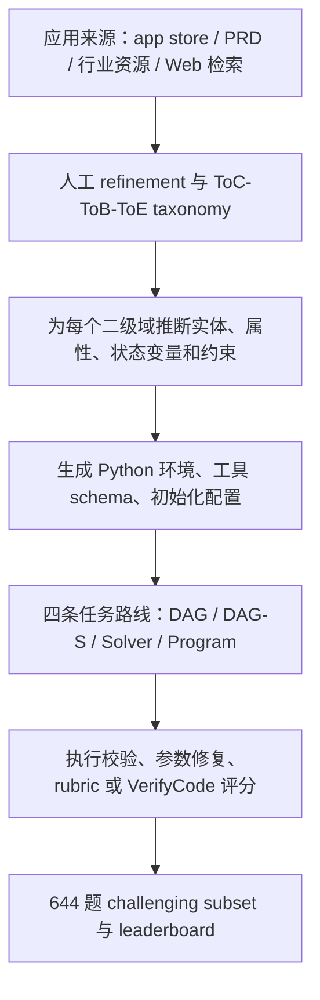

# OmniaBench：354 个应用域里的通用 Agent 基准，到底在测什么？

> 原文：Chengyu Shen, Yujie Fu, Gangtao Xin 等，**OmniaBench: Benchmarking General AI Agents Across Diverse Scenarios**, arXiv:2607.14989v1, 2026-07-16  
> 链接：<https://arxiv.org/abs/2607.14989v1>  
> 项目页：<https://scuuy.github.io/OmniaBench/>  
> 代码：<https://github.com/scuuy/OmniaBench>  
> 数据集：<https://huggingface.co/datasets/scuuy666/OmniaBench>  
> 类型：论文；方向：大模型 Agent / 通用 Agent 评测 / 工具调用与交互环境

### TL;DR

1. OmniaBench 研究的问题是：当 LLM 从文本生成器变成能多轮对话、调用工具、修改状态、处理文件和完成业务流程的通用 Agent 时，现有 benchmark 往往只覆盖单一工具生态、少数应用或固定交互格式，无法系统刻画“通用”边界。
2. 作者把通用 Agent 任务形式化为 POMDP：环境有隐藏状态 `S`、观测 `O`、动作 `A`、状态转移 `T`、观测函数 `Ω` 和初始分布 `ρ0`；Agent 只能基于历史 `h_t` 决策，因此评测重点不是最终答案文本，而是长期轨迹中的状态推断、工具选择、约束维护和反馈修正。
3. 数据构造从 app store、产品文档、行业资源、Web 检索和人工 refinement 出发，形成 ToC、ToB、ToE 三类场景 taxonomy，共 `90` 个一级域、`354` 个二级域；再为每个域生成可执行 Python 环境、实体表、工具 schema、初始化状态和任务请求。
4. OmniaBench 有四条任务路线：`DAG` 多轮状态工具链、`DAG-S` 由 DAG 精炼出的单轮任务、`Solver` 选择/排程/分配/优化任务、`Program` 带分支循环和代码验证的程序化任务。完整集 `1,431` 题，公开 leaderboard 主要用 `644` 题 challenging subset。
5. 主结果显示 frontier 模型仍只解决约一半任务：Claude-Sonnet-5 的 Overall Pass@1 为 `58.54%`，GPT-5.6-Sol 为 `57.14%`，GLM-5.2 为 `56.83%`，GPT-5.5 为 `56.52%`。这说明 benchmark 不是只在测工具调用语法，而是在压长期计划、约束和状态管理。
6. 细分结果比总分更重要：Claude-Sonnet-5 在 ToB/ToC 更强，GLM-5.2 在 ToE 细分上达到 `57.55%`；相近 Overall 分数背后可能是完全不同的 capability profile 和工具步数分布。
7. 论文报告的失败模式集中在推理而不是工具格式：reasoning-related failures 占 `53.8%`，其中 planning/decomposition 为 `36.7%`，constraint violations 为 `16.5%`；meta-cognitive errors 另占 `31.0%`，主要来自反思不足和过早放弃。
8. 局限很明确：任务和环境大量由模型辅助合成，rubric judge 和 user simulator 仍可能带来偏差；公开 challenging subset 虽用于降低成本和减少污染，但完整数据集一旦公开仍会被未来模型训练污染；数据集 license 也暂时标为 research-use only，不能直接当作无约束商用评测资产。

### 研究问题：为什么又需要一个 Agent benchmark？

OmniaBench 的出发点不是“再做一个更大的排行榜”，而是指出当前 Agent 评测的覆盖方式不够像真实使用：

1. **工具调用 benchmark** 能测函数选择、参数生成和调用格式，却常常弱化了长期状态变化。
2. **交互式客服类 benchmark** 能测多轮对话和用户反馈，但领域数量有限，通常围绕少数服务域。
3. **Web、电脑使用或文件系统 benchmark** 更接近真实执行，但常受限于特定应用、特定浏览器或特定工作流。
4. **专业任务 benchmark** 能覆盖真实工作场景，却不一定提供可执行环境、轨迹级评分或能力维度拆解。

作者想补上的缺口是：

| 缺口 | OmniaBench 的对应设计 | 仍然留下的边界 |
|---|---|---|
| 场景太窄 | 90 L1 / 354 L2 域，覆盖 ToC、ToB、ToE | taxonomy 的真实代表性仍依赖来源和人工筛选 |
| 任务形态单一 | DAG、DAG-S、Solver、Program 四条路线 | 四路线之间难度和评分机制不完全同质 |
| 只看最终 pass/fail | capability、domain、difficulty、tool steps、error modes 多视角分析 | 细分标签仍可能受标注策略影响 |
| 缺少执行状态 | 可实例化 Python 环境、实体表、工具、workspace sandbox | 合成环境和真实 SaaS/企业系统仍有差距 |
| 成本与污染冲突 | 公开 644 题 challenging subset，保留 full set 背景 | 公开后长期 contamination 无法彻底避免 |

这也是论文标题里 “General AI Agents Across Diverse Scenarios” 的真正含义：它不是单纯扩大题量，而是试图把“通用 Agent”拆成场景覆盖、状态空间、工具空间、交互协议和诊断维度的组合问题。

### 论文主张与论证路线

| Claim | Mechanism | Evidence | Boundary |
|---|---|---|---|
| 通用 Agent 评测应显式建模状态和轨迹 | 用 POMDP 表示隐藏状态、观测、动作和转移；以完整 trajectory 评分 | 正文给出 `P=(S,O,A,T,Ω,ρ0)`、`Γ=(o0,a0,...,oT,aT)` 和 `Eval_V(Γ,g)` | 形式化本身不保证每个合成环境都足够真实 |
| 广域 taxonomy 可以减少单一应用偏置 | 从 app stores、PRD、行业资源、Web agent 与人工 refinement 构造域空间 | ToC `22/101`、ToB `38/186`、ToE `30/67`，合计 `90/354` | 域覆盖广不等于每个域任务都深 |
| 多路线任务能覆盖不同 Agent 行为 | DAG 测多轮状态工具链，Solver 测约束优化，Program 测可执行验证，DAG-S 测单轮复杂请求 | challenging set 为 DAG `354`、DAG-S `200`、Solver `60`、Program `30` | route size 不均衡会影响 Overall 的解释 |
| 当前 frontier Agent 仍有明显能力边界 | Pass@1、domain split、capability radar、tool-step 分析、错误分布 | 最强 Claude-Sonnet-5 Overall `58.54%`，GPT-5.6-Sol `57.14%` | 模型版本和 API 设置是 2026-06-29 到 2026-07-15 的快照 |
| 单一总分不足以指导 Agent 改进 | 相近 Overall 可对应不同路线、领域、能力和效率曲线 | GLM-5.2、GPT-5.5、Claude-Opus-4.7 等模型在不同 split 上换位 | 细粒度图表需要结合任务样例解释，否则也会变成新排行榜 |

### 方法机制：把通用 Agent 任务写成 POMDP

论文最值得保留的形式化是这个：

```text
P = (S, O, A, T, Ω, ρ0)
```

变量含义如下：

| 符号 | 含义 | 在 Agent 任务里的例子 |
|---|---|---|
| `S` | latent state space | 用户资料、业务记录、文件内容、工具状态、工作区中间结果 |
| `O` | observation space | 用户消息、工具返回、检索文档、文件状态、环境反馈 |
| `A` | action space | 自然语言回复、澄清问题、结构化工具调用、代码执行、文件操作、最终提交 |
| `T` | transition function | 工具调用后数据库或文件系统如何变化 |
| `Ω` | observation function | 环境如何把新状态和动作转换成下一条观测 |
| `ρ0` | initial state distribution | 每个任务初始化出的用户、实体表、约束和文件 bundle |

Agent 不能直接看到 `s_t`，只能看到历史：

```text
h_t = (o_0, a_0, o_1, a_1, ..., o_t)
a_t ~ π_θ(. | h_t)
```

这个写法把真实难点说清楚了：

1. Agent 不是在回答静态问题，而是在不完全观测下维护一个信念状态。
2. 工具调用不是旁枝，而是动作空间的一部分，会改变环境。
3. 多轮用户反馈不是额外聊天，而是环境动态的一部分。
4. 最终评分不是“最后一句像不像”，而是整条轨迹是否满足目标和约束。

评价函数写成：

```text
Eval_V(Γ, g) -> (y, r)
```

其中：

| 输出 | 解释 |
|---|---|
| `Γ` | 完整执行轨迹，包括观测、动作、工具反馈和终止动作 |
| `g` | 任务目标 |
| `V` | 评价协议，可能是 rubric，也可能是 VerifyCode |
| `y` | 二元成功标签 |
| `r` | 细粒度 rubric 分数 |

这决定了 OmniaBench 的评测哲学：**测 Agent，不只测模型输出；测轨迹，不只测最终文本；测状态约束，不只测工具调用格式。**

### 数据构造：从场景 taxonomy 到可执行环境

论文的数据流水线可以拆成五步：




图中的关键不是“有很多任务”，而是任务背后带着可执行状态：

1. 每个环境有实体表，例如客户、订单、日程、工单、文档、库存、资产或文件。
2. 每个环境有工具，例如查询、过滤、更新、生成、审批、调度或代码运行。
3. 每个任务有初始化状态，避免只在自然语言里假装存在数据库。
4. 每条轨迹会触发环境变化，Agent 必须追踪前后状态。
5. 对文件系统和编码任务，作者额外提供 controlled sandbox，把文件操作和 Python executor 封装成同一类工具接口。

论文报告的 taxonomy 规模如下：

| View | 来源 / 基础 | 规模 |
|---|---|---|
| ToC | 多个 app store 与消费者应用类别 | 22 个 L1 / 101 个 L2 |
| ToB | GDPval-style 任务与行业分类 | 38 个 L1 / 186 个 L2 |
| ToE | 行业通用员工任务和模板 | 30 个 L1 / 67 个 L2 |
| Total | 标准化真实应用场景 taxonomy | 90 个 L1 / 354 个 L2 |
| Capability | 通用 Agent 执行需求 | 10 个维度 |
| Atomic Difficulty | 用户、环境、工具和交互侧挑战 | 8 个因素 |

### 四条任务路线：不是四个数据集，而是四种压力测试


| 路线 | 题量 | 交互模式 | 评分方式 | 主要测什么 |
|---|---:|---|---|---|
| DAG | 354 | 多轮 | rubric | 状态化工具链、用户反馈、长依赖、约束追踪 |
| DAG-S | 200 | 单轮 | rubric | 把复杂 DAG 任务压缩成一次请求后的规划和执行 |
| Solver | 60 | 单轮 | rubric | 选择、排程、分配、优化和可行性约束 |
| Program | 30 | 单轮 | VerifyCode | 分支、循环、程序化推理、执行调试和二元检查 |
| 合计 | 644 | both | mixed | cost-efficient leaderboard challenging set |

DAG 是 anchor 路线。作者从环境工具集中构造 dependency graph，采样可执行工具链或 DAG，再基于环境状态生成用户请求、参考轨迹和最终状态。这里真正困难的是：

1. 任务目标可能需要多步查询和更新。
2. 用户信息可能逐步披露。
3. 工具返回可能带来新约束。
4. Agent 需要在中途修正计划。
5. rubric 不只看是否说了正确结论，还看所有约束是否满足。

DAG-S 则把 DAG 任务通过 query refinement 变成单轮请求。它保留复杂目标和多条件约束，但不再给多轮用户反馈，因此更像“一个用户一次性给你复杂工作单”。

Solver 任务把复杂性集中在结构化决策：

1. 选择最合适对象。
2. 在时间、资源、优先级之间排程。
3. 满足一组硬约束。
4. 在多目标之间做分配或优化。

Program 路线最适合避免纯 rubric judge 的主观性，因为它用 `VerifyCode` 做二元验证。它的局限是题量只有 `30`，覆盖面较窄，但作为可执行检查的对照很有价值。

### 10 个能力维度与 8 个难度原子

论文的 capability taxonomy 不是装饰。它试图把“Agent 能力”拆到可诊断层：

| ID | 能力维度 | 评测含义 |
|---:|---|---|
| 1 | Task Understanding | 识别用户目标、隐含需求、优先级、领域约束和预期结果 |
| 2 | Information Gathering | 从环境状态、工具、文件、数据库和外部信息中检索并整合证据 |
| 3 | Planning & Decision Making | 分解目标、选择策略、尊重依赖、根据新观测修订计划 |
| 4 | State Management | 在实体、环境状态和长轨迹之间保持中间进度一致 |
| 5 | Tool Use | 选择工具、构造参数、解释输出、协调多工具调用 |
| 6 | Code & Programmatic Ops | 写代码、执行代码、做数据转换、自动化或文件操作 |
| 7 | Data Analysis | 过滤、聚合、比较、协调结构化和半结构化数据 |
| 8 | Office & Document Handling | 读写文档、表格、演示、合并与验证文件型产物 |
| 9 | Interactive Collaboration | 澄清目标、确认动作、纳入反馈、跨轮协作 |
| 10 | Reliability & Safety | 失败恢复、约束合规、避免无效或不安全动作 |

作者还给出任务覆盖统计。按表格，`Task Understanding` 覆盖 `764` 个任务，占 `97.45%`；`Tool Use` 覆盖 `630` 个任务，占 `80.36%`；`State Management` 覆盖 `545` 个任务，占 `69.52%`；`Reliability & Safety` 覆盖 `482` 个任务，占 `61.48%`。

这说明 OmniaBench 不想把工具调用孤立成“会不会 JSON function call”。它把工具调用放进更大的能力组合里：

```text
Agent 成功 = 理解目标 + 找到信息 + 制定计划 + 调工具 + 维护状态 + 校验约束 + 恢复错误
```

难度原子则解释“为什么同一能力会变难”：

| 难度原子 | 典型实例 |
|---|---|
| Ambiguous Goal and Contextual Constraints | 请求不完整、间接、带隐含偏好或职业约束 |
| Tool and Parameter Grounding | 相似工具很多，参数需要从上下文推断 |
| Structured-Information Complexity | 需要过滤、join、比较大量实体和记录 |
| Long-Context and Multi-Artifact Evidence | 证据分散在长输出、文档、附件、日志或多种 artifact |
| Dynamic Multi-Step Planning | 需要长依赖、条件分支、中间决策和重规划 |
| Multi-Source Inconsistency | 用户、工具、文件或环境状态互相冲突 |
| Progressive Disclosure and State Evolution | 关键信息随对话、工具或审批逐渐出现 |
| Risk, Reliability, and Clarification | 存在不可逆动作、证据不足或必须确认的操作 |

这个拆分对研究者有用：如果模型在 `Tool Use` 标签下失败，失败原因可能是参数 grounding，也可能是长上下文证据，也可能是多源冲突。单独看标签会误导改进方向。

### 评测协议：rubric、VerifyCode、user simulator 和工具预算

论文把评分分成两类：

| 任务类型 | 评分机制 | 成功定义 |
|---|---|---|
| DAG / DAG-S / Solver | 多个 rubric items，每项 1-3 分 | 所有 rubric items 都满足才算 pass |
| Program | `VerifyCode` 可执行检查 | 轨迹和最终观测通过二元 verifier |

主指标是 Pass@1：

```text
Overall Pass@1 = 成功完成的任务数 / challenging set 总任务数
```

另外还报告：

1. `DAG Pass@1`：多轮状态工具链成功率。
2. `Solver / Program / DAG-S`：路线级成功率。
3. `ToB / ToC / ToE`：按场景 split 的成功率。
4. `Capability score`：在含有某能力标签的任务上的平均 Pass@1。
5. `UserTurns`：DAG 多轮任务里的平均用户轮数。
6. `ToolSteps`：所有轨迹的平均工具调用步数，失败和提前终止也计入。
7. Kendall's `τ` 和 CV：替换 user simulator 后排名是否稳定。
8. Pass@8 和 Pass^8：多次独立运行时“至少一次成功”和“全部成功”的差距。

实验设置也很重要：

| 设置 | 论文中的选择 |
|---|---|
| 环境和任务合成模型 | Qwen3.5-397B-A17B |
| 多轮 user simulator | DeepSeek-V4-Pro，thinking disabled |
| rubric judge | DeepSeek-V4-Pro，thinking disabled |
| 终止信号 | 多轮用户模拟器输出 `###STOP###` |
| 工具预算 | 每条轨迹最多 200 个 tool-call steps |
| 工具 schema | 统一使用 OpenAI function-calling schema |
| 评测时间 | 2026-06-29 到 2026-07-15 的 provider API 快照 |

这里有一个应当保留的 skeptical point：OmniaBench 尽量检查 user simulator 和 judge 稳定性，但 user simulator 与 rubric judge 仍然是模型系统的一部分。它们的稳定不等于绝对客观，只能说明在作者的替换实验里相对排名没有大幅乱掉。

### 主结果：最强模型也只在 58% 左右

论文的 leaderboard 对 22 个模型评测。前几名如下：

| 模型 | Access | DAG Pass@1 | Solver | Program | DAG-S | ToB | ToC | ToE | ToolSteps | Overall |
|---|---|---:|---:|---:|---:|---:|---:|---:|---:|---:|
| Claude-Sonnet-5 | Closed | 57.34 | 56.67 | 63.33 | 60.50 | 60.68 | 60.47 | 48.11 | 64.16 | **58.54** |
| GPT-5.6-Sol | Closed | 55.37 | **65.00** | 50.00 | 59.00 | 57.59 | 59.07 | 51.89 | 38.73 | 57.14 |
| GLM-5.2 | Open | 54.80 | 26.67 | 60.00 | **69.00** | 57.28 | 55.81 | 57.55 | 57.08 | 56.83 |
| GPT-5.5 | Closed | 54.80 | 38.33 | 60.00 | 64.50 | 58.20 | 53.02 | **58.49** | 52.45 | 56.52 |
| DeepSeek-V4-Pro | Open | 52.54 | 36.67 | 53.33 | 63.50 | 54.18 | 54.88 | 54.72 | 58.08 | 54.50 |
| Claude-Opus-4.7 | Closed | 53.39 | 43.33 | 63.33 | 57.50 | 56.66 | 51.63 | 51.89 | 44.11 | 54.19 |

这个表有三层含义：

1. **绝对成功率仍低**：最强 Overall 只有 `58.54%`，说明 benchmark 对当前 frontier 模型不是饱和题。
2. **路线差异很大**：GPT-5.6-Sol 在 Solver 上 `65.00`，但 Program 是 `50.00`；GLM-5.2 在 DAG-S 上 `69.00`，但 Solver 只有 `26.67`。
3. **效率不是总分附属品**：Claude-Sonnet-5 Overall 第一，但 ToolSteps 为 `64.16`；GPT-5.6-Sol Overall 第二，ToolSteps 只有 `38.73`。如果评测生产环境的成本、延迟和操作风险，后者可能在某些场景更有吸引力。


论文还强调，同一 Overall 可以掩盖不同 capability profile。对 Agent 研究而言，这比榜单名次更关键，因为真实系统通常不是“我要最强模型”，而是“我要一个在我的工具、文档、审批和状态约束下不乱动的模型”。

### Figure 与 Table 证据逐项解读

| 证据 | 支持的结论 | 不能证明什么 |
|---|---|---|
| Figure 1 / leaderboard | 22 个模型在 challenging set 上仍显著未饱和 | 不能推出这些模型在所有真实企业应用里的绝对能力 |
| Figure 2 / pipeline | 数据从 taxonomy、环境、任务路线到评分形成闭环 | 不能保证每个合成环境都等同真实 SaaS |
| Table taxonomy overview | OmniaBench 的域覆盖确实远大于单一服务 benchmark | 不能证明 354 个 L2 域的采样权重合理 |
| Table challenging-set stats | 644 题包含工具、实体表、rubric 和 VerifyCode 统计 | route size 不均衡会影响 Overall 的解释 |
| Capability radar / score distribution | 总分相近模型的能力剖面不同，很多任务部分完成但未全过 | radar 依赖 capability 标签，不能替代样例级审计 |
| ToB/ToC/ToE split | 模型在企业、消费者、员工场景上出现 rank shift | 三个 split 内部仍有大量异质任务 |
| Step efficiency figure | 成功率相近时，工具步数和冗余探索差异明显 | 低工具步数不总是更安全，可能是过早停止 |
| Error distribution | 主要瓶颈是 reasoning 和 meta-cognition，不是纯工具格式 | 错误分析样本和分类口径会影响比例 |


其中错误分布最值得展开。论文报告 reasoning-related failures 占 `53.8%`，planning/decomposition 占 `36.7%`，constraint violations 占 `16.5%`，meta-cognitive errors 占 `31.0%`。这意味着很多失败并非来自不会调用工具，而是来自：

1. 没有正确分解目标。
2. 忘记前面已经确认过的约束。
3. 在工具返回冲突时没有重新建模状态。
4. 遇到中间失败后过早放弃。
5. 做了多余探索，却没有把新证据转成正确行动。

### 消融与稳定性：这篇论文的“防质疑”部分

论文没有传统模型训练消融，但有评测稳定性和多次运行分析。可以理解为 benchmark 论文里的方法学消融：

| 检查 | 结果 | 含义 |
|---|---|---|
| user simulator 替换 | GPT-4.1、DeepSeek-V4-Flash、DeepSeek-V4-Pro 下三模型相对排名不变，Kendall's `τ=1.0`，平均 CV `7.24%` | 多轮用户模拟会改变绝对分，但核心排序在小样本替换中稳定 |
| rubric judge robustness | trajectory-level ICC(A,1) 为 `0.780`，平均 Spearman `0.821`，最小 pairwise `0.756` | judge 间分数和相对排序大体一致，但不是完美一致 |
| rubric item decision | `86.3%` trajectory-item 单元五个 judges 全一致，`9.3%` 为 4-vs-1，`4.4%` 为 3-vs-2 | 大多数 rubric 项稳定，少数仍有主观边界 |
| Pass@k vs Pass^k | Pass@k 上升，Pass^k 快速下降 | 多次重跑能撞出成功，但可靠性和可重复性仍弱 |
| DeepSeek-V4-Flash / Qwen3.6-27B 重复运行 | Pass@1 标准差分别为 `1.07` 和 `2.68` 个百分点 | aggregate 结果有一定可复现性，但单题轨迹仍可能摇摆 |

这组分析的意义是：OmniaBench 不只发布一个榜单，而是在回应“这个榜单是不是被 user simulator 或 judge 随机性主导”的问题。

但它也暴露边界：

1. Kendall's `τ=1.0` 是在三模型用户模拟替换上的结果，不代表所有模型和所有领域都稳定。
2. judge 一致率高于随机，但 `4.4%` 的近均分歧说明某些 rubric 边界确实模糊。
3. Pass@k 提升意味着模型有机会成功；Pass^k 下降意味着这些成功不稳定，生产系统不能只靠“多跑几次”。

### 相关工作中的位置：OmniaBench 新在哪里？

论文把 OmniaBench 和 Toolathlon、VitaBench、GAIA2、ToolSandbox、ACEBench、τ²-Bench、BFCL、MCP-Atlas、DeepPlanning、GDPval、Vending-Bench、Claw-Eval、ClawMark 等 benchmark 对比。

可以概括为：

| 维度 | 早期或相邻 benchmark 的优势 | OmniaBench 的差异化 |
|---|---|---|
| 函数调用 | BFCL、ACEBench 更系统测工具选择和参数格式 | OmniaBench 把工具调用放进状态环境和多轮轨迹 |
| 服务交互 | τ²-Bench、ToolSandbox 等有动态状态和用户模拟 | OmniaBench 扩到 90/354 域，不局限少数服务 |
| 真实应用 | GAIA2、VitaBench、DeepPlanning 更强调开放任务和现实服务 | OmniaBench 增加统一 capability/difficulty taxonomy |
| 工作空间 | Claw-Eval、ClawMark、QwenClawBench 关注文件、文档、电脑使用 | OmniaBench 同时纳入 workspace、tool-use、single/multi-turn |
| 专业任务 | GDPval 更贴近职业工作成果 | OmniaBench 提供可执行环境、轨迹和细分错误分析 |

论文的定位不是替代这些 benchmark，而是补一个“广域通用 Agent 诊断基准”。这对研究者的启发是：Agent 评测不应该只沿着一个方向扩展，例如更多工具、更多网页、更多任务或更长上下文；真正困难的是把这些维度组合后仍能保持评分可执行、可解释、可复现。

### 复现与开放边界

项目仓库提供了 evaluation harness，数据集在 Hugging Face 上以四个 route JSON 发布：

| 文件 | 路线 | 任务数 | 模式 | scorer |
|---|---|---:|---|---|
| `route1.json` | DAG | 354 | multi-turn | rubric |
| `route2.json` | Solver | 60 | single-turn | rubric |
| `route3.json` | Program | 30 | single-turn | verifier |
| `route4.json` | DAG-S | 200 | single-turn | rubric |

运行方式大致是：

```text
python evaluation/scripts/orchestrate_eval.py \
  --profile openai_compatible \
  --routes route1 route2 route3 route4 \
  --pass-k 1 \
  --max-task-workers 8
```

复现边界需要单独说清：

1. 数据集 card 标明 license 仍在 finalize，当前应视作 research-use only，不能默认商用再分发。
2. `profiles.json` 只保存环境变量名，真实 API key 放 `.env`；这对安全是好设计，但复现实验需要多个 provider API。
3. Route 1 的 filesystem sandbox bundle 在仓库里，四个 route 文件由 Hugging Face 自动下载；离线环境需要提前准备数据。
4. Rubric judge 和 user simulator 会消耗额外模型调用，成本不只是被测模型的 token。
5. 论文的模型版本包含未来式或 provider 快照标签，结果应看成 2026-06-29 到 2026-07-15 期间的 API 状态，而不是永恒排名。

### 核心判断：OmniaBench 的价值和误用方式

OmniaBench 最有价值的地方不是“Claude-Sonnet-5 第一”这类排名，而是给 Agent 评测提供了一个更完整的分析坐标系：

1. **任务来自哪里**：ToC、ToB、ToE 和 L1/L2 domain。
2. **任务怎样执行**：DAG、DAG-S、Solver、Program。
3. **Agent 需要什么能力**：十维 capability。
4. **任务为什么难**：八个 difficulty atoms。
5. **轨迹怎样失败**：工具步数、错误类别、用户模拟鲁棒性、judge 稳定性。

最容易误用它的方式，是只拿 Overall Pass@1 排模型。这样会丢掉论文最关心的诊断信息：

| 错误用法 | 为什么不够 |
|---|---|
| “谁 Overall 高就用谁” | 相同 Overall 可对应不同领域强弱、路线强弱和工具成本 |
| “Pass@1 低说明模型不行” | 部分任务可能是合成环境或 rubric 边界过硬，需要样例审计 |
| “多跑几次就能解决” | Pass@k 上升但 Pass^k 下降，说明不稳定性仍在 |
| “工具调用错误是主要问题” | 论文错误分布显示 reasoning 与 meta-cognition 更突出 |
| “公开数据等于长期安全 benchmark” | 公开后 contamination 风险会持续上升 |

### 领域延伸：对 Agent 系统研究意味着什么？

从 Agent 系统角度看，OmniaBench 推动了三个问题。

第一，未来 Agent 评测需要从“单模型能力”转向“模型-环境-控制层”联合评估：

```text
Agent 结果 = 模型策略 + 工具 schema + 环境状态 + 用户模拟 + 评分协议 + 执行预算
```

如果只比较模型，不比较工具 schema、状态观测、恢复策略和终止条件，很多结论会漂移。

第二，Agent 后训练数据应该更重视轨迹失败类型。论文的失败分布暗示：

1. 只训练 function call 格式不够。
2. 需要训练约束维护和状态追踪。
3. 需要训练“中间失败后如何重规划”。
4. 需要训练何时澄清、何时停止、何时拒绝风险操作。
5. 需要把 rubric item 或 verifier failure 变成可学习的过程反馈。

第三，AI 安全里的 Agent containment 不能只靠权限沙箱。OmniaBench 的任务本身不以安全为主题，但它揭示了一个安全事实：Agent 会在长轨迹中不断累积小偏差。一次多余工具调用、一次状态误读、一次约束遗忘，在真实系统里可能变成错误更新、错误审批、错误文件修改或错误消息发送。

更好的后续 benchmark 应该把 OmniaBench 这类广域任务和安全约束结合起来：

| 后续问题 | 为什么重要 |
|---|---|
| 能否把 irreversible action 单独 gate 化？ | 通用 Agent 常会修改状态，不只是读信息 |
| 能否把 rubric failure 映射到训练信号？ | 失败类型比最终 0/1 更适合后训练 |
| 能否在公开数据污染后继续保持评测有效？ | 公开 benchmark 会被模型训练吸收 |
| 能否用真实企业日志构造 privacy-preserving 环境？ | 合成环境和生产系统仍有差距 |
| 能否比较 Agent harness 而不是只比较模型？ | 工具定义、权限和终止策略会改变安全性和效率 |

### 结论与局限

OmniaBench 的贡献可以压缩成一句话：

> 它把通用 Agent 评测从“做完没做完”推进到“在哪类场景、通过哪种轨迹、依赖哪些能力、在什么难度原子下失败”。

这篇论文足够值得深读，是因为它没有把 Agent benchmark 做成单一排行榜，而是把环境、任务、能力、难度、轨迹和错误分析连接起来。它给出的 `58.54%` 和 `57.14%` 不只是两个分数，而是在提醒：当前最强模型在广域状态化任务里仍然经常只完成一半左右的 hard requirements。

同时，边界也必须保留：

1. 任务环境大量合成，真实业务系统的权限、延迟、脏数据和组织流程更复杂。
2. rubric judge 与 user simulator 仍由模型驱动，稳定性检查不能完全消除评价偏差。
3. Program 路线题量较小，VerifyCode 覆盖不到多数开放式任务。
4. challenging subset 公开后会逐步失去抗污染性。
5. license 仍未最终确定，数据集 card 明确建议按 research-use only 处理。

因此，OmniaBench 最合理的用法不是把它当成“谁是最强 Agent”的最终裁判，而是把它作为一个诊断框架：看模型在哪些路线、领域、能力和失败类型上掉链子，再反向设计更好的 Agent 控制环、后训练数据、工具 schema、权限边界和人工审查点。
