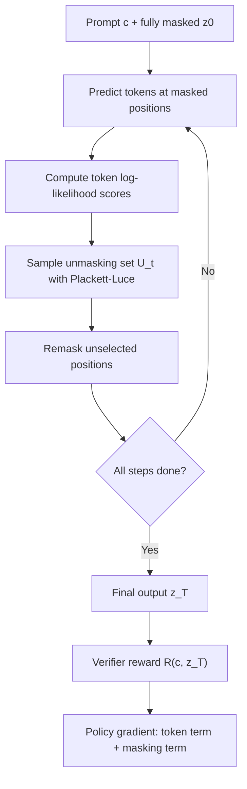

# Mask-Aware Policy Gradients：把扩散语言模型里的“先填哪里”也纳入后训练

### 元信息与 TL;DR

- **论文**：Mask-Aware Policy Gradients for Diffusion Language Models
- **作者**：Haran Raajesh、Kulin Shah、Adam Klivans、Philipp Krahenbuhl
- **机构**：The University of Texas at Austin
- **状态**：COLM 2026 conference paper；arXiv v1 提交于 2026-07-16
- **原文**：https://arxiv.org/abs/2607.15200
- **代码**：https://github.com/Haran71/mask-aware-policy-gradients

**TL;DR**

- 这篇论文研究一个很窄但关键的后训练问题：**Masked Diffusion Language Models, MDLMs, 做 RL 时，policy gradient 不能只优化“填什么 token”，还应优化“哪些位置先被保留、不再 remask”**。
- 作者指出，MDLM 生成不是自回归模型那样固定从左到右；每个 denoising step 先在所有 masked 位置预测 token，再选择一部分位置保留下来，其余位置重新变回 `[MASK]`。这个位置选择顺序本身就是策略的一部分。
- 方法上，论文把 MDLM 生成形式化为 **two-stage action MDP**：第一阶段采样 token，第二阶段采样 unmasking set。由此得到的轨迹 log-probability 分解为 **token term + unmasking term**。
- 技术关键是把原先不可微的 greedy top-K remasking 改为基于 Plackett-Luce 的概率采样：位置得分来自模型自己的 token log-likelihood，不引入额外 head，也不增加额外 forward pass。
- 实验以 LLaDA-8B-Instruct 为主模型，在 GSM8K、MATH500、HumanEval、MBPP 上做 RL 微调；主表中方法在全部长度 128/256/512 配置上都拿到最优。
- 关键数字：在长度 512 下，GSM8K 达到 **87.1%**，MBPP 达到 **53.4%**；长度 128 下 GSM8K 为 **81.0%**、MATH500 为 **37.4%**，分别比 StepMerge 高 3.0 和 4.3 点。
- 消融说明位置项不是小修补：同样使用 StepMerge 框架时，唯一差别是是否加入 masking log-probability，论文报告跨数学和代码任务都有约 2 到 4 个点提升。
- 局限也很清楚：实验主要围绕 LLaDA-8B-Instruct 和 Dream-7B、验证式数学/代码/规划任务；对开放式写作、多轮对话、安全偏好、长上下文生成的收益仍需额外验证。

### 研究问题：为什么扩散语言模型的 RL 后训练不能照搬自回归公式？

自回归语言模型的 RL 后训练有一个便利前提：

- 输出序列按固定顺序生成。
- 第 k 个 token 的条件概率可以直接写成 `pi(x_k | x_<k, c)`。
- 整个序列 log-likelihood 是这些 token log-probability 的和。
- policy gradient 可以直接用 rollout reward 乘上每个 token action 的 score function。

对应公式是：

```text
pi_theta(x_1:n | c) = product_{k=1}^n pi_theta(x_k | x_<k, c)
grad J(theta) = E[R(c, x) grad log pi_theta(x | c)]
```

MDLM 的难点在于：

- 它不是从左到右生成，而是从一个全 `[MASK]` 序列开始。
- 每一步会对所有 masked 位置预测 token。
- 之后再根据置信度或策略选择哪些位置留下。
- 没留下的位置会被 remask，并在之后步骤重新预测。

所以 MDLM 的最终输出 `x` 并不对应唯一轨迹：

```text
pi_theta(x | c) = sum_{z: z_T = x} pi_theta(z | c)
```

这个边缘化不可 tractable。既有方法通常绕过它：

| 方法族 | 近似方式 | 论文指出的问题 |
|---|---|---|
| ELBO / evidence bound | 在完成序列的随机 mask 版本上估计 log-likelihood | 更像训练目标近似，不直接跟随真实生成轨迹 |
| trajectory-based / StepMerge | 沿 denoising 轨迹计算 token log-probability | 仍然把轨迹理解为 token 预测序列，忽略位置选择 |
| 学 unmasking order 的方法 | 额外训练 planner/head 或学习 unmasking policy | 有额外架构、训练成本或目标差异 |

本文的研究问题可以压缩成一句话：

> 如果 MDLM 生成每一步都同时决定“填什么”和“保留哪里”，那么 RL 后训练的 policy gradient 是否也必须同时包含这两个动作？

### 论文主张与论证路线

论文的论证路线是典型的 claim -> mechanism -> evidence -> boundary。

| 环节 | 作者要证明什么 | 用什么证明 |
|---|---|---|
| Claim | MDLM 的 remasking / unmasking order 是策略动作的一部分 | 把 denoising step 拆成 token prediction 和 position selection |
| Mechanism | 完整轨迹概率应包含 `pi(token)` 与 `p_unmask(position set)` | 推导扩展轨迹分布和 policy gradient 分解 |
| Evidence | 加入 masking gradient 后，数学、代码、规划任务都变好 | GSM8K、MATH500、HumanEval、MBPP、Sudoku、Countdown、Dream-7B |
| Boundary | 方法依赖概率 remasking、StepMerge 近似和 verifier reward | 附录分析 StepMerge 误差，实验集中在可验证任务 |

这条路线的重要性在于：

- 它没有把结果解释为“调参更好”。
- 它先指出旧 estimator 缺一个动作项。
- 再用同框架 ablation 证明这个动作项带来额外训练信号。
- 最后用 StepMerge 误差分析和 token-only counterexample 解释为什么理论上不能忽略它。

### 方法机制：two-stage action MDP

MDLM 的一个 denoising step 可以写成两阶段：

1. **Token prediction**
   - 输入：当前部分 masked 序列 `z_{t-1}` 与 prompt `c`
   - 动作：对 masked 位置采样候选 token，得到 `hat z_t`

2. **Position selection / remasking**
   - 输入：`z_{t-1}` 与 `hat z_t`
   - 动作：选择 unmasking set `U_t`
   - 输出：`z_t = f_remask(hat z_t, U_t)`

论文把扩展轨迹写成：

```text
hat z = (z_0, hat z_1, U_1, z_1, ..., z_T)
```

完整轨迹概率是：

```text
pi_theta(hat z | c)
= product_{t=1}^T
  pi_theta(hat z_t | z_{t-1}, c)
  p_unmask(U_t | hat z_t, z_{t-1}, c)
  p_remask(z_t | U_t, hat z_t, z_{t-1}, c)
```

其中：

- `pi_theta(hat z_t | z_{t-1}, c)` 是 token term。
- `p_unmask(U_t | ...)` 是位置选择 term。
- `p_remask` 是确定性 remasking operator，不对参数求导。

因此 policy gradient 变成：

```text
grad J(theta)
= E[
  R(c, z_T)
  sum_t (
    grad log p_unmask(U_t | hat z_t, z_{t-1}, c)
    + grad log pi_theta(hat z_t | z_{t-1}, c)
  )
]
```

这就是论文标题里的 **Mask-Aware Policy Gradients**。

### 概率 remasking：如何让“先保留哪里”可求梯度？

实际 MDLM 推理常用 greedy top-K：

- 计算每个 masked 位置的置信度。
- 选择置信度最高的 K 个位置保留。
- 其他位置 remask。

问题是 top-K 是 hard selection：

- 它依赖模型参数。
- 但选择动作本身不可微。
- 不能直接写进 policy gradient 的 log-probability。

作者的替代方案是 **probabilistic remasking**：

- 对每个 masked 位置 `k`，取模型对采样 token 的 log-likelihood：

```text
v_k^t = log pi_theta(hat z_k^t | z_{t-1})
```

- 用温度 `tau` 构造位置采样分布。
- 按 Plackett-Luce 模型无放回采样 K 个位置：

```text
p_unmask(u_i = x | u_<i, z_{t-1}, hat z_t)
= 1[x still masked and x not selected]
  exp(v_x^t / tau)
  / sum_j 1[j still masked and j not selected] exp(v_j^t / tau)
```

这个设计有三个工程含义：

- **不加参数**：位置得分来自模型已有 logits。
- **不加 forward pass**：token likelihood 和 position likelihood 用同一次计算。
- **可回到 greedy**：当 `tau -> 0` 时，概率选择逼近 top-K。

### 算法流程：从 rollout 到梯度更新

下面用伪代码表达论文方法，而不是照搬原文算法。

```text
Input:
  prompt c
  MDLM policy pi_theta
  denoising steps T
  unmask count K
  reward verifier R
  position temperature tau_pos

State:
  z_0 = [MASK]^n
  trajectory = []

Loop t = 1 ... T:
  1. token sampling:
     hat z_t ~ pi_theta(. | z_{t-1}, c)

  2. position scoring:
     for each still-masked position k:
       v_k = log pi_theta(hat z_t[k] | z_{t-1}, c)

  3. probabilistic unmasking:
     U_t ~ Plackett-Luce(exp(v_k / tau_pos), sample K without replacement)

  4. remasking:
     z_t = keep positions in U_t and previously unmasked positions
           set other uncommitted positions back to [MASK]

  5. record:
     save token log-prob and position log-prob

Output:
  final sequence z_T
  reward R(c, z_T)
  update theta with policy gradient over token term + position term

Failure boundary:
  If reward only depends on final text but generation quality depends on which positions
  become committed early, token-only gradients can miss useful update directions.
```

用 Mermaid 看，核心差别只有一处：把 unmask set 当作可学习 action。



### 实验设置：模型、训练、奖励与 baseline

主实验设置如下。

| 组件 | 设置 |
|---|---|
| 主模型 | LLaDA-8B-Instruct |
| 微调方式 | LoRA，rank 128，alpha 64，dropout 0.05 |
| 量化与算子 | NF4 4-bit base weights，bfloat16 LoRA，Flash Attention 2 |
| 优化器 | AdamW，learning rate `3e-6`，weight decay 0.1 |
| 分布式 | 8 NVIDIA H100-80GB，DeepSpeed ZeRO-2 |
| rollout | 最大 256 tokens，block size 32，128 diffusion steps per block |
| group sampling | 每个 prompt 采样 `G=6` completions |
| 位置温度 | `tau_pos = 0.5` |
| token 温度 | `tau_tok = 0.9` |
| 主 estimator | StepMerge，`N=32` segments，`K=12` sampled boundaries |
| RL 算法 | GSPO，token 和 position importance ratio 分开 clipping |

任务和奖励分为三类：

| 任务 | 训练/评测 | 奖励信号 |
|---|---|---|
| GSM8K | grade-school math | XML/format/integer/correctness 组合 reward |
| MATH500 | competition math | answer tag、boxed 格式、正确性 reward |
| HumanEval / MBPP | 代码生成 | Python code block 格式 + unit test pass ratio |

baseline 覆盖三类：

- **base / preference 模型**：LLaDA-8B-Instruct、LLaDA-1.5。
- **ELBO 或 diffusion RL 方法**：d1、wd1、UniGRPO、GDPO、SPG w/ Mixture。
- **直接 ablation**：StepMerge，同样使用 trajectory framework，但不加入 masking term。

这个 baseline 设计比较关键：

- 若只赢过 ELBO 方法，可能是 trajectory estimator 的功劳。
- 若赢过同配置 StepMerge，才说明 position term 本身有价值。
- 论文主结果正是围绕这个差异展开。

### 主结果：数学和代码任务的数字证据

主表报告 generation length 128、256、512 三档结果。下面摘出最关键对比。

| Benchmark | Length | StepMerge | SPG w/ Mixture | Ours | 相对最强对照的提升 |
|---|---:|---:|---:|---:|---:|
| GSM8K | 128 | 78.0 | 78.5 | **81.0** | +2.5 vs SPG |
| GSM8K | 256 | 83.3 | 83.9 | **85.9** | +2.0 vs SPG |
| GSM8K | 512 | 84.8 | 84.5 | **87.1** | +2.1 vs StepMerge |
| MATH500 | 128 | 33.1 | 33.4 | **37.4** | +4.0 vs SPG |
| MATH500 | 256 | 39.1 | 40.0 | **42.2** | +2.2 vs SPG |
| MATH500 | 512 | 41.2 | 41.8 | **44.2** | +2.4 vs SPG |
| HumanEval | 128 | 30.5 | 31.0 | **33.2** | +2.2 vs SPG |
| HumanEval | 512 | 40.7 | 41.1 | **44.0** | +2.9 vs SPG |
| MBPP | 128 | 44.9 | 44.3 | **47.1** | +2.2 vs StepMerge |
| MBPP | 512 | 50.9 | 50.8 | **53.4** | +2.5 vs StepMerge |

这些结果支持三点判断：

- **收益稳定**：四个 benchmark、三种长度配置全部提升。
- **复杂任务收益更明显**：MATH500 长度 128 提升 4.0 点，说明位置顺序对难推理任务更重要。
- **代码任务也受益**：HumanEval 和 MBPP 不是数学训练的同质任务，仍能看到 2 点以上提升。

### 训练效率：每步慢一点，但更快到达有效精度

论文还比较了 GSM8K 上与 SPG 的 wall-clock 训练效率。

| 指标 | SPG | Ours | 解读 |
|---|---:|---:|---|
| Throughput | 360 steps/h | 290 steps/h | 本方法每步更贵 |
| Convergence | 6500 steps | 6000 steps | 需要更少步数 |
| Final accuracy | 78.5% | 81.0% | 最终更高 |
| 达到 SPG final accuracy | 18 h | 15 h | 约提前 3 小时 |

固定目标精度的时间也说明同一趋势：

| Target accuracy | SPG 时间 | Ours 时间 | Speedup |
|---:|---:|---:|---:|
| 74% | 8.6 h | 4.5 h | 1.9x |
| 75% | 9.9 h | 5.8 h | 1.7x |
| 76% | 13.4 h | 10.0 h | 1.3x |
| 78% | 17.2 h | 14.0 h | 1.2x |
| 80% | 未达到 | 18.3 h | - |

这里要注意边界：

- 论文不是说 position term 没有计算成本。
- 它说额外信号让优化更有效，抵消了部分 per-step 开销。
- 这个结论来自 GSM8K、8 H100、长度 128 的设置，不能直接外推到所有任务。

### 消融：block 越大，位置选择越重要

Figure 5 / Table 6 的 block size 消融很有解释力。

| Block size | GSM8K StepMerge | GSM8K Ours | MATH500 StepMerge | MATH500 Ours |
|---:|---:|---:|---:|---:|
| 32 | 83.3 | **85.9** | 39.1 | **42.2** |
| 64 | 83.7 | **86.3** | 40.2 | **43.6** |
| Full sequence | 58.7 | **63.1** | 23.8 | **27.5** |

这个表说明：

- 当 block 小时，每步可选位置少，unmasking order 的自由度较低。
- 当 block 变大或 full sequence 解码时，每步候选 masked 位置更多。
- 位置选择错误会更早污染后续上下文，position-aware optimization 的优势放大。

这也是本文最有价值的机制证据之一：

- 不是所有提升都来自 general RL trick。
- 提升与 MDLM 独有的“并行位置选择”自由度相关。
- block 越大，作者提出的问题越不可忽略。

### 进一步泛化：规划任务与 Dream-7B

附录 B 把方法放到 Sudoku 和 Countdown 规划任务上。

| Benchmark | Length | SPG w/ Mixture | Ours | 最大观察 |
|---|---:|---:|---:|---|
| Sudoku | 128 | 82.9 | **84.5** | 小幅提升 |
| Sudoku | 256 | 94.0 | **94.9** | 接近饱和仍提升 |
| Sudoku | 512 | 93.1 | **96.2** | +3.1 |
| Countdown | 128 | 68.8 | **69.3** | 小幅提升 |
| Countdown | 256 | 70.7 | **71.4** | 小幅提升 |
| Countdown | 512 | 70.3 | **71.0** | 小幅提升 |

附录 C 换成 Dream-7B，也报告一致提升。

| Model family | Benchmark | 强 baseline | Ours |
|---|---|---:|---:|
| Dream-7B | GSM8K length 512 | 83.5 | **86.4** |
| Dream-7B | MATH500 length 512 | 50.7 | **52.9** |
| Dream-7B | Sudoku length 512 | 71.9 | **74.3** |

这说明：

- 方法不是只绑定 LLaDA。
- 位置项在另一个 MDLM base model 上也能工作。
- 但论文仍只验证了两个模型族，距离“大多数扩散语言模型都适用”还有距离。

### 关键 ablation：哪些选择真正重要？

论文附录 E 对实现选择做了几组消融。

| 消融项 | 最好设置 | 证据 | 解释 |
|---|---|---|---|
| RL algorithm | GSPO | GSM8K 81.0，MATH500 37.4 | sequence-level clipping 更适合 subsampled boundary 方差 |
| StepMerge segments | `N=32, K=12` | GSM8K 81.0，MATH500 37.4 | 更细分段降低近似误差，K 超过 12 边际收益小 |
| token temperature | `tau_tok=0.9` | 降到 0.5 后 GSM8K 79.1 | rollout 多样性不足会削弱 group advantage |
| position temperature | `tau_pos=0.5` | 升到 1.0 后 GSM8K 79.0 | 位置选择太随机会保留低置信 token |
| unmask set size | `|U_t|=2` | 从 2 到 8 最多降 1 点 | 每步提交太多位置会降低 rollout 质量 |

这组结果对复现者很有用：

- 方法不是“任意概率采样都好”。
- token 多样性和位置随机性要平衡。
- 主结果的 `N=32, K=12, tau_tok=0.9, tau_pos=0.5, |U_t|=2` 是经验选择，而不是理论唯一最优。

### 理论部分：为什么 token-only gradient 会漏掉方向？

论文给出两个理论补充。

第一，StepMerge 近似误差来自三部分：

```text
D_N <= n log(T / N + 1) + n epsilon_tok + n epsilon_unmask
```

变量解释：

- `T`：完整 denoising steps。
- `N`：StepMerge segments 数量。
- `n`：最终生成 token 数。
- `epsilon_tok`：用 segment boundary context 近似 token probability 的误差。
- `epsilon_unmask`：用 segment boundary context 近似 unmasking distribution 的误差。
- `n log(T / N + 1)`：macro-step 合并后丢失 within-segment timing 信息的熵上界。

这个式子的含义：

- `N` 越大，segment 越细，timing 信息损失越小。
- token 与 unmask 两个误差项都被显式计入。
- 这与主文“位置选择属于轨迹概率”保持一致。

第二，附录 G 构造了 token-only gradient 不完整的反例：

- 序列长度为 2。
- 词表为 `{a, b}`。
- reward 只看第一个位置是否生成 `a`。
- 位置选择概率由 token confidence 决定。
- 存在一个参数方向 `v`，token-only gradient 在该方向恒为 0。
- 但真实目标 `J(theta)` 沿这个方向并非 stationary，移动参数可以提高 reward。

这个反例的意义不是说真实大模型一定落在这个构造里。

更准确地说：

- 它说明“只算 token term 仍然完整”这个说法在理论上站不住。
- 如果 reward 依赖早期保留哪个位置，token-only estimator 可能完全看不见有用更新。
- 这给主实验中的 StepMerge vs Ours 差异提供了机制解释。

### Figure / Table 证据逐项解读

| 图表 | 承载的证据 | 不能证明什么 |
|---|---|---|
| Figure 1 | 四个任务上 Ours 相对 LLaDA、d1、GDPO、StepMerge、SPG 都更高 | 不能证明所有 MDLM 或所有开放式任务都受益 |
| Figure 2 | MDLM rollout 中 token prediction 与 remasking selection 同时存在 | 只是流程图，不是性能证据 |
| Figure 3 | Plackett-Luce 概率 remasking 如何替代 greedy top-K | 没证明温度和 K 的全局最优 |
| Table 1 | 主结果覆盖数学与代码、长度 128/256/512 | baseline 数字部分来自原论文，跨实现细节可能不同 |
| Table 2 / Figure 4 | GSM8K 上虽然 throughput 低，但更快达到高精度 | 只覆盖 GSM8K 与固定硬件设置 |
| Figure 5 / Table 6 | block 越大，position-aware 相对优势越明显 | full sequence 性能整体下降，说明推理设置本身也影响很大 |
| Table 7-9 | GSPO、StepMerge、温度、`|U_t|` 的具体选择 | 仍是有限网格，不是完整超参搜索 |

### 失败模式：旧方法到底漏掉了什么？

为了理解这篇论文，最容易误解的一点是：

- 不是说旧方法“完全不会学习顺序”。
- 也不是说 token 概率和位置顺序彼此独立。
- 真正的问题是，旧 estimator 没有把位置选择的 log-probability 作为受 reward 加权的动作项。

可以用一个简化例子说明。

| 步骤 | token-only 视角 | mask-aware 视角 |
|---|---|---|
| 看到 `[MASK] [MASK] [MASK]` | 只关心每个位置预测什么 token | 同时关心哪个位置应该先被 commit |
| 第一步预测多个候选 | 计算被采样 token 的概率 | 计算 token 概率和位置选择概率 |
| 低置信位置被 remask | 这只是生成 heuristic | 这是策略的一次动作结果 |
| 最终 reward 高 | 强化已出现 token | 强化 token 与位置路径 |
| 最终 reward 低 | 惩罚 token 路径 | 惩罚错误 commit / remask 顺序 |

在 MDLM 中，早期 commit 的位置会改变后续上下文：

- 一个高置信但语义上过早的 token 可能锁死后续推理路径。
- 一个低置信但关键的结构位置如果长期不保留，后续步骤只能在局部片段里反复修补。
- 代码生成里，函数签名、循环结构、边界条件的位置顺序会影响后续 token 的可用上下文。
- 数学推理里，答案格式、关键中间量、方程结构的 commit 顺序会影响 verifier reward。

所以，position term 的作用不是替代 token learning，而是告诉模型：

- 哪些位置的早期承诺有利于最终 reward。
- 哪些位置即使 token 概率高，也不应太早固定。
- 哪些 remasking 顺序会让后续 denoising 更容易。

### 与 StepMerge 的关系：本文不是抛弃近似，而是补齐近似里的动作项

StepMerge 的动机是计算成本。

- 完整 denoising 轨迹有 `T` 个步骤。
- 每个步骤都重新算 log-probability 成本很高。
- StepMerge 把连续步骤合并成 `N` 个 macro segments。
- 这样用 segment endpoints 近似多个中间步骤。

本文没有否定 StepMerge，而是继续使用它：

- token log-probability 用 StepMerge 近似。
- position log-probability 也在同一套 StepMerge 近似下计算。
- 主实验设定 `N=32, K=12`，就是成本和精度的折中。

这点对复现很重要：

| 问题 | 论文选择 |
|---|---|
| 是否要完整 replay 所有 denoising steps？ | 不需要，主实验使用 StepMerge |
| 是否为了位置项增加额外模型？ | 不需要，直接用已有 logits |
| 是否要额外 forward pass？ | 论文称 position term 无额外 forward overhead |
| 是否必须用 GSPO？ | 分解兼容多种 policy gradient，但消融里 GSPO 最好 |

因此，这篇工作的工程定位更接近：

- 在现有 MDLM RL 管线里，修正 trajectory likelihood 的定义。
- 保持 StepMerge 的加速思想。
- 用最小结构改动换取更完整的训练信号。

### 数据和 reward 细读：为什么这些 benchmark 适合验证本文？

论文选择数学、代码和规划任务并非偶然。

这些任务有共同特点：

- reward 可以相对自动化。
- 输出正确性比风格偏好更容易判定。
- 生成路径中的局部错误会影响最终可验证结果。
- 更长 generation length 会暴露顺序选择问题。

各任务的作用不同。

| 任务 | 它测试的位置选择问题 |
|---|---|
| GSM8K | 短到中等长度算术推理，检查方法是否能稳定提高基础 reasoning |
| MATH500 | 更复杂数学题，错误中间结构更容易导致最终失败 |
| HumanEval | 函数级程序合成，签名、控制流、返回值顺序都重要 |
| MBPP | 小规模 Python 任务，unit test reward 能抓到功能错误 |
| Sudoku | 约束满足规划，早期填入位置会影响后续可行性 |
| Countdown | 算术组合规划，选择中间表达式位置影响搜索路径 |

这也解释了为什么论文没有把开放式聊天作为主实验：

- 开放式聊天 reward 更难定义。
- remasking 顺序带来的收益不容易和偏好评分噪声区分。
- verifier reward 更适合测试 policy gradient estimator 是否补齐了动作项。

但反过来，这也是局限：

- 如果未来 MDLM 用于长文生成、摘要、翻译、对话，本文结论需要重新验证。
- 尤其是人类偏好 reward 下，position term 是否仍稳定、是否放大长度偏好、是否改变多样性，都还没有答案。

### 复现者应重点检查哪些细节？

如果复现这篇论文，不应只看主表数字。更应该检查下面几类风险。

| 检查项 | 为什么重要 |
|---|---|
| generation length 是否一致 | 128、256、512 的结果不能混读 |
| block size 是否一致 | block 32、64、full sequence 对收益影响很大 |
| StepMerge 的 `N` 与 `K` | 论文主结果用 `N=32, K=12`，K 太小会降分 |
| token 与 position clipping 是否分开 | 两个 ratio 混在一起可能改变 GSPO 行为 |
| reward extraction 是否一致 | GSM8K/MATH500 的格式 reward 会影响训练曲线 |
| code sandbox 是否一致 | unsafe module block list 会影响 HumanEval/MBPP reward |
| baseline 是否同一实现 | SPG 的代码任务结果由作者运行官方代码，跨环境可能波动 |

这里有一个容易忽略的点：

- 本文说 position term “无额外 forward overhead”，前提是已经计算 token likelihood。
- 但整体方法每小时 steps 数低于 SPG，说明 trajectory estimator 的管线仍然更重。
- 因此部署到不同训练框架时，要同时比较 accuracy、GPU hours、throughput 和达到目标分数的时间。

### 如何读这些分数：不要把“最优”误读成范式已胜出

主表里的数字很强，但研究判断要更谨慎。

首先，论文证明的是：

- 在 MDLM 已经作为 base model 的前提下，位置感知 policy gradient 比 token-only 或 ELBO 近似更好。
- 它没有证明 MDLM 在这些任务上已经超过最强自回归模型。
- 它也没有证明扩散语言模型一定是后训练 reasoning 的最终方向。

其次，分数提升的来源要拆开看：

| 来源 | 本文证据强度 | 说明 |
|---|---|---|
| 位置项本身 | 强 | StepMerge ablation 是同框架对比 |
| GSPO 选择 | 中 | 消融显示 GSPO 最好，但算法空间有限 |
| 超参选择 | 中 | 温度、K、N 有网格，但不是全面搜索 |
| verifier reward | 中 | 数学/代码清晰，开放式任务未知 |
| 模型族泛化 | 初步 | 有 Dream-7B，但规模和类型仍有限 |

第三，长度 512 的高分不能只看最终准确率。

- 更长生成给模型更多修正空间。
- 也可能增加计算开销和无效 token。
- 对产品系统而言，延迟、成本、稳定性和准确率要一起算。

因此，本文更适合被读作：

- 一个针对 MDLM RL estimator 的关键修正。
- 一组说明位置顺序确实可被 reward 优化的实验证据。
- 一个提醒后训练研究者审查 action space 的案例。

而不是：

- “扩散语言模型全面替代自回归模型”的证据。
- “所有 RL 后训练都应该加位置项”的通用结论。
- “只要概率化 decoding 就一定提升”的经验规则。

### 对后训练研究的更深一层影响

后训练研究经常把问题写成：

```text
sample output -> score output -> update policy
```

但真实系统更像：

```text
sample hidden decisions -> sample visible output -> score final behavior -> update full trajectory
```

本文强调的是第二种写法。

对于自回归 LLM，隐藏决策少一些，因为 token 顺序固定，action space 接近输出 token 序列。

但对更复杂生成系统：

- diffusion model 有 denoising order。
- agent 有 tool schedule。
- RAG 有 retrieval path。
- 多模态模型有 attention / region / frame selection。
- 长上下文系统有 memory compression 和 context routing。

如果这些隐含动作影响最终 reward，却没有进入 log-probability，训练目标就会出现错位。

这篇论文在 MDLM 上给出一个可计算案例：

- 它不是泛泛说“过程很重要”。
- 它明确指出一个被漏掉的随机变量 `U_t`。
- 它写出 `p_unmask(U_t | ...)`。
- 它给出可求梯度的 Plackett-Luce 采样。
- 它用 StepMerge 和 GSPO 把这个项放进真实训练。

这种从系统过程回到概率图模型的做法，可能比具体分数更值得后训练研究者学习。

### 相关工作位置：这篇论文补在哪里？

这篇论文站在三个交叉点上。

| 方向 | 代表问题 | 本文的补位 |
|---|---|---|
| diffusion language models | 如何用 masked denoising 生成文本 | 把生成顺序纳入 RL 后训练目标 |
| RL for reasoning | 如何用 verifier reward 提升数学/代码能力 | 给 MDLM 推导更完整的 policy gradient |
| unmasking order learning | 如何选择下一步 reveal 的位置 | 不训练额外 planner，直接用模型 logits 构造位置策略 |

与 LLaDOU / DCoLT 的比较尤其重要：

- DCoLT 也把 position selection 视为策略的一部分。
- 但它训练额外 position-selection head。
- 本文直接复用模型 token log-likelihood 作为位置得分。
- 附录报告在 GSM8K 上，本文方法以约 `~160` GPU hours 达到或超过 DCoLT，而 DCoLT 设置约 `~800` GPU hours。

这让本文更像是一个 **estimator 修正**，而不是一个新架构。

### 结论与局限

这篇论文最值得带走的结论是：

- 对 MDLM 做 RL 后训练时，生成轨迹不只是 token 序列。
- unmasking order 也是 action。
- 如果 policy gradient 忽略位置选择，它就不是对实际生成策略的完整估计。

不过，证据边界也要明确：

- **任务边界**：主实验是数学、代码和规划，都是 verifier reward 比较清晰的任务。
- **模型边界**：主要是 LLaDA-8B-Instruct，附录扩到 Dream-7B，但还不是大规模模型族验证。
- **推理边界**：方法依赖概率 remasking；如果部署时使用完全不同的 deterministic decoding，训练-推理一致性需要重新评估。
- **成本边界**：训练效率对比显示 wall-clock 有优势，但前提是特定硬件、实现和任务；其他系统的瓶颈可能不同。
- **安全边界**：代码任务 reward 会阻断 unsafe modules，但这不是 AI safety 评测；不要把代码执行 reward 当成模型安全能力证明。

### 领域延伸：后训练研究应更关心“动作空间是否写全”

从研究者视角看，这篇论文的启发不止是“MDLM 多一个 masking loss”。

更一般的问题是：

- 当模型从文本生成器变成带复杂 decoding / tool / environment interaction 的系统时，RL 的 action space 是否被完整建模？
- 如果训练目标只覆盖最显眼的 action，比如 token，而忽略隐含 action，比如位置、工具调用顺序、缓存选择、检索路径，那么 policy gradient 可能优化的是代理目标。
- 对后训练来说，这类遗漏会在简单任务里不明显，在更长 horizon、更大 block、更复杂约束里放大。

可以把本文思想外推到几个研究问题：

| 场景 | 隐含 action | 类似风险 |
|---|---|---|
| tool-use agent | 选哪个工具、何时停止、是否澄清 | 只训练最终回答会忽略过程策略 |
| RAG 系统 | 检索 query、rerank、引用选择 | reward 只看答案可能漏掉证据路径 |
| 多模态 agent | 看哪个区域、何时调用视觉模型 | 文本 loss 不覆盖感知调度 |
| 长上下文推理 | 保留哪些摘要、压缩哪些记忆 | 最终 token reward 不等于记忆策略 reward |
| diffusion language model | 先 unmask 哪些位置 | token-only gradient 漏掉生成顺序 |

因此，本文最强的研究价值在于提醒后训练系统设计者：

- 先写清真实交互过程中的状态、动作和转移。
- 再决定 policy gradient 应该覆盖哪些 log-probability。
- 最后再谈算法名、reward shaping 和 benchmark 分数。

如果 action space 一开始就写漏，后面的 RL 工程再精细，也可能只是在优化一个被削弱的代理问题。
