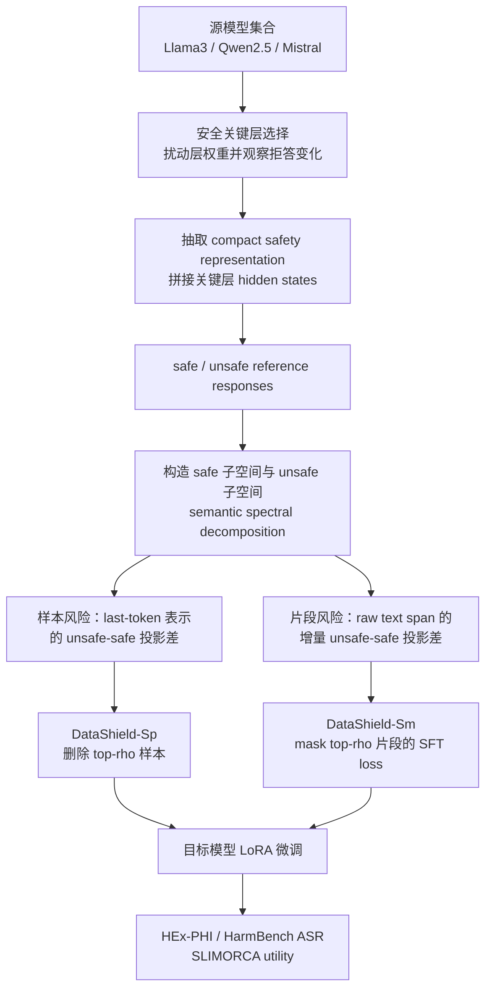

# DataShield：用共识子空间找出会削弱 LLM 安全性的微调数据

| 项目 | 信息 |
|---|---|
| 论文 | DataShield: Uncovering Risky Fine-Tuning Data Across LLMs Through Consensus Subspace Alignment |
| arXiv | https://arxiv.org/abs/2607.15081 |
| HTML 全文 | https://arxiv.org/html/2607.15081 |
| 代码 | https://github.com/ZJU-LLM-Safety/DataShield |
| 时间 | 2026-07-16 提交，arXiv v1 |
| 类型 | AI 安全 / 安全保持微调 / 数据风险评估 |

### TL;DR

- **研究问题**：对齐后的 LLM 在下游 SFT 中可能因为普通任务数据而安全性下降；DataShield 关心的不是“模型是否会被 jailbreak”，而是“哪些微调样本或回答片段会把模型推向更高的有害请求服从率”。
- **核心方法**：作者不用单一模型、单一平均向量或目标模型梯度来打分，而是从多个安全对齐源模型中选出安全关键层，构造 safe / unsafe 两组子空间，再用样本或片段对 unsafe 子空间与 safe 子空间的相对投影差估计风险。
- **两个干预粒度**：DataShield-Sp 删除风险最高的样本；DataShield-Sm 保留原文本但把风险最高的 response 片段从 SFT loss 中 mask 掉，因此既能减少危险监督信号，又尽量保留任务数据的有用上下文。
- **关键数字**：论文摘要报告，相比强过滤和 masking baseline，样本过滤平均降低 ASR 14.6%，片段 masking 平均降低 ASR 32.3%；主实验中默认干预预算是 top 20%。
- **跨模型证据**：源模型是 Llama3-8B-Instruct、Qwen2.5-7B-Instruct、Mistral-7B-Instruct-v0.3；目标模型是未参与风险计算的 Phi3-medium-4k-it、Qwen3-4B-it、Gemma2-27B-it、Gemma3-12B-it。
- **主表结果**：在 Dolly 上，标准 SFT 后 Phi3 的 HarmBench ASR 是 78.5%，DataShield-Sp 降到 25.2%，DataShield-Sm 降到 18.6%；Gemma3 的 HARM ASR 从 38.4% 分别降到 11.6% 和 18.1%。
- **效率证据**：在约 14K Dolly 样本上预处理 Gemma2-27B-it，DataShield-Sp 用 47.9 GB / 64 min，DataShield-Sm 用 58.1 GB / 118 min；Bi-Anchor、SEAL、TOSS 分别达到 168 GB / 503 min、291 GB / 835 min、242 GB / 675 min。
- **局限**：实验证据集中在监督微调、英文/通用安全 benchmark、LoRA 设置和若干 instruction-tuned 模型；风险分数是统计性数据预处理信号，不等于对每个训练样本给出可审计的因果证明。

### 1. 这篇论文真正要解决什么问题？

DataShield 的问题意识可以拆成三层：

1. **安全性不是只在推理时失效**。
   - 很多 AI 安全工作把注意力放在 jailbreak、prompt injection 或危险工具调用上。
   - DataShield 关注更早的一环：模型已经经过安全对齐，但下游团队用领域数据继续 SFT 后，拒答边界可能被普通数据悄悄磨掉。

2. **“良性任务数据”也可能携带危险监督信号**。
   - 一条样本未必是显式恶意指令。
   - 它可能包含隐私、欺骗、违法、物理风险、网络滥用或错误事实风格的回答片段。
   - SFT 不会知道这些片段只是训练噪声；它只会把 response 当成要模仿的目标。

3. **风险评估要能跨模型复用**。
   - 数据集通常会被不同模型、不同 tokenizer、不同版本反复使用。
   - 如果每换一个目标模型都要重新跑梯度、logits 或目标模型隐藏态，安全预处理会变得昂贵。
   - 作者希望风险分数来自源模型共识，目标模型只拿处理后的数据做微调。

<u>一句话概括</u>：DataShield 把“安全保持微调”从模型训练技巧转成数据预处理问题，问的是哪些样本或片段在多个安全模型的表示空间里更像 unsafe 行为。

### 2. 为什么已有方法不够？

作者批评的不是单个 baseline，而是三类结构性限制：

| 限制 | 典型做法 | 为什么会出问题 | DataShield 的替代 |
|---|---|---|---|
| 模型特异性 | 用一个目标模型的 hidden state、gradient、loss、logit 打分 | 分数反映该模型的几何结构，不一定能迁移到 Qwen、Phi、Gemma 等其他模型 | 多个源模型共同打分，目标模型不参与风险估计 |
| 单向量假设 | 用 safe/unsafe 的均值向量当安全方向 | 安全语义可能不是一条线，而是分布在多个方向和层里 | 对 safe/unsafe 表示做谱分解，保留多维子空间 |
| tokenizer 绑定 | token-level 风险或 mask 依赖某个 tokenizer | 同一文本片段在不同模型中会被切成不同 token | 先按原始 response 文本切 character span，再映射到各模型 token |

这里最关键的是第二点。

- 如果“安全”只是一条均值向量，模型内部的复杂安全语义会被压扁。
- 如果“危险”只由一个模型判断，低风险分数可能只是该模型没捕捉到某类危险。
- 如果 mask 绑定 tokenizer，换模型后同一个危险短语可能落到不同 token 边界，导致 mask 不稳定。

### 3. 问题形式化：作者要过滤什么？

论文把一个微调样本写成：

```text
z_i = (x_i, y_i)
```

变量含义：

| 符号 | 含义 |
|---|---|
| `x_i` | 指令或输入 |
| `y_i` | 目标回答 |
| `D_task` | 下游微调数据集 |
| `M_src^(k)` | 第 k 个安全对齐源模型 |
| `M_tgt^(j)` | 第 j 个目标模型 |
| `rho` | 干预预算，主实验默认为 0.2 |

目标不是训练一个通用安全分类器，而是：

- 给 `D_task` 中每个样本一个风险分数；
- 或给 response 中每个原始文本片段一个风险分数；
- 用这些分数删除高风险样本，或 mask 高风险片段的 SFT loss；
- 让处理后的数据在未见过的目标模型上仍能降低 ASR。

这个设定有一个重要边界：

> 目标模型不用于风险估计。

这使 DataShield 更像“数据发布前的安全清洗器”，而不是“每个训练任务重新定制的防护器”。

### 4. 方法总览：从层选择到安全子空间

DataShield 的流程可以用一张图表示：



流程里有三个设计点最值得看：

1. **安全关键层选择**。
   - 作者对每个候选层做对称扰动。
   - 扰动后在 over-refusal probing set 上看拒答行为变化。
   - 拒答变化越大，说明该层越可能承载安全相关信号。

2. **safe / unsafe 子空间不是跨模型硬对齐**。
   - 不把 Llama、Qwen、Mistral 的 hidden state 强行映射到同一个 embedding space。
   - 每个源模型在自己的表示空间里建立 safe / unsafe basis。
   - 最后只聚合“投影差分数”，而不是混合原始向量。

3. **片段级风险用增量分数**。
   - 自回归 hidden state 会包含前文。
   - 如果前面出现危险内容，后面普通句子的累计风险也可能被抬高。
   - 作者用 `Delta q_t` 近似“当前位置新增的风险”，避免把前文危险外溢到后文。

### 5. 公式：DataShield 到底怎样算风险？

#### 5.1 行为子空间怎样构造？

对第 `k` 个源模型和行为标签 `a`：

- `a` 可以是 `safe` 或 `unsafe`。
- `H_a^(k)` 是该行为下所有 reference 样本的 compact representation 集合。
- 每个 representation 记作 `h~`。

论文构造行为语义算子：

```math
S_a^{(k)}
=
\frac{1}{|\mathcal{H}_a^{(k)}|}
\sum_{\tilde h \in \mathcal{H}_a^{(k)}}
\tilde h \tilde h^\top
```

然后做谱分解：

```math
S_a^{(k)}
=
\sum_{j=1}^{D_k}
\lambda_{a,j}^{(k)}
v_{a,j}^{(k)}
v_{a,j}^{(k)\top}
```

保留前 `d` 个方向：

```math
U_a^{(k)}
=
[v_{a,1}^{(k)}, \ldots, v_{a,d}^{(k)}]
```

主实验里：

- 源模型数 `K = 3`；
- 安全关键层数 `N_crit = 3`；
- 子空间维度 `d = 16`；
- 干预预算 `rho = 0.2`。

#### 5.2 子空间 alignment 怎样定义？

给定 compact hidden representation `h~` 和正交基 `U`：

```math
\phi(\tilde h, U)
=
\frac{\|UU^\top \tilde h\|_2^2}{\|\tilde h\|_2^2}
```

解释：

- `UU^T h~` 是把表示投影到子空间；
- 分子是投影长度平方；
- 分母是原表示长度平方；
- 因此 `phi` 在 0 到 1 之间。

如果一个样本对 unsafe 子空间投影更强，对 safe 子空间投影更弱，它就更可疑。

#### 5.3 样本级风险：unsafe-safe gap

对样本 `z_i`，第 `k` 个源模型给出：

```math
s_{\mathrm{sample}}^{(k)}(z_i)
=
\phi(\tilde h_{\mathrm{seq}}^{(k)}(z_i), U_{\mathrm{unsafe}}^{(k)})
-
\phi(\tilde h_{\mathrm{seq}}^{(k)}(z_i), U_{\mathrm{safe}}^{(k)})
```

多个源模型取平均：

```math
\hat r_{\mathrm{sample}}(z_i)
=
\frac{1}{K}
\sum_{k=1}^{K}
s_{\mathrm{sample}}^{(k)}(z_i)
```

这个分数越高：

- 样本越像 unsafe 语义；
- 越不像 safe refusal / safe behavior 语义；
- 在 DataShield-Sp 中越可能被删除。

#### 5.4 片段级风险：不要让前文污染后文

DataShield-Sm 先把回答切成原始文本片段：

```text
C(y_i) = [c_{i,1}, c_{i,2}, ..., c_{i,m_i}]
```

然后每个源模型用自己的 tokenizer 把同一个 raw text span 映射到 token index set：

```text
T^(k)(c_{i,j})
```

对 token 位置 `t`，先算 unsafe-safe gap：

```text
q_t^(k)
```

但作者不直接汇总 `q_t`，而是使用增量项：

```math
\Delta q_t^{(k)}
=
\frac{1}{2}(q_t^{(k)} - q_{t-1}^{(k)}),
\quad q_0^{(k)} = 0
```

片段风险定义为：

```math
\hat r_{\mathrm{seg}}(c_{i,j}; x_i, y_i)
=
\frac{1}{K}
\sum_{k=1}^{K}
\max_{t \in \mathcal{T}^{(k)}(c_{i,j})}
\Delta q_t^{(k)}
```

这里用 `max` 而不是 `mean` 的理由很实际：

- 一个危险短语可能很短；
- 放进长句后，平均池化会稀释风险；
- 最大池化更容易抓住局部高风险片段。

### 6. 干预方式：删样本还是 mask loss？

DataShield 有两个版本：

| 版本 | 干预对象 | 训练文本是否保留 | SFT loss 如何变化 | 适用直觉 |
|---|---|---|---|---|
| DataShield-Sp | 样本 | 删除 top `rho` 高风险样本 | 只在剩余样本上训练 | 样本整体都偏危险或低质量 |
| DataShield-Sm | response 片段 | 保留完整输入输出文本 | 高风险片段不参与 loss | 样本有用，但局部回答带危险监督 |

片段 masking 的 loss 写作：

```math
\mathcal{L}_{\rm sm}(\theta)
=
-\sum_i \sum_{t \in \mathcal{K}_i}
\log p_\theta(y_{i,t} \mid x_i, y_{i,<t})
```

其中：

- `K_i` 是未被 mask 的 target-model token 位置；
- 被选中的高风险 raw span 会映射到目标模型 tokenizer；
- 这些 token 仍在上下文里，但不作为要拟合的答案目标。

这个设计很重要：

- 如果直接删除整个样本，可能损失大量有用任务监督。
- 如果只 mask 局部片段，模型仍能看到上下文结构、任务格式和安全回答附近的正常内容。
- 但这也带来风险：被 mask 的危险片段仍出现在上下文中，只是不被 loss 强化；如果上下文暴露本身有风险，DataShield-Sm 不是内容发布安全器。

### 7. 实验设置：证据链怎样搭起来？

#### 7.1 源模型与目标模型

| 角色 | 模型 |
|---|---|
| 源模型 | Llama3-8B-Instruct |
| 源模型 | Qwen2.5-7B-Instruct |
| 源模型 | Mistral-7B-Instruct-v0.3 |
| 目标模型 | Phi3-medium-4k-it |
| 目标模型 | Qwen3-4B-it |
| 目标模型 | Gemma2-27B-it |
| 目标模型 | Gemma3-12B-it |

关键点：

- 源模型负责风险打分。
- 目标模型只接受处理后的数据微调。
- 因此主实验验证的是 cross-architecture transfer，而不是同模型内自洽打分。

#### 7.2 数据、baseline 与指标

| 类别 | 设置 |
|---|---|
| 微调数据 | Alpaca、Dolly |
| 安全评测 | HEx-PHI、HarmBench |
| Utility 评测 | SLIMORCA win rate |
| 微调方式 | LoRA |
| 默认预算 | top 20% 样本删除或片段 masking |
| ASR judge | GPT-4o，附录用 Gemini-3.1-Pro 复核 |
| 样本级 baseline | Random-Sp、Bi-Anchor、SEAL、LARF、SOT |
| 片段级 baseline | Random-Sm、TOSS |

ASR 的含义：

- Attack Success Rate 越低越好。
- GPT-4o 按 1 到 5 分评估模型回答。
- 分数 4 或 5 被计为 unsafe success。

Utility 的含义：

- SLIMORCA win rate 衡量微调后回答相对原模型是否保持或改善通用 instruction following。
- 它不是领域任务性能的完整替代，只是通用有用性的一个控制指标。

### 8. 主结果：安全下降被压住了吗？

#### 8.1 跨目标模型迁移

论文主表显示，标准 SFT 会显著提高 PHI / HARM ASR；DataShield 两个版本通常能把 ASR 拉低，同时 utility 接近标准 SFT。

| 数据 | 方法 | 平均安全结论 | Utility 结论 |
|---|---|---|---|
| Alpaca / Dolly | Standard SFT | 安全退化明显 | 因为使用完整训练集，utility 略高 |
| Alpaca / Dolly | DataShield-Sp | 样本级删除降低 ASR | SLIMORCA 轻微下降 |
| Alpaca / Dolly | DataShield-Sm | 片段级 masking 通常降低更多 HARM ASR | 保留更多文本结构，但片段选择更依赖定位质量 |

论文给出的平均数尤其关键：

- DataShield-Sp 平均 ASR 降到 15.1%；
- DataShield-Sm 平均 ASR 降到 14.9%；
- SOT 是 23.7%；
- TOSS 是 43.8%；
- SLIMORCA 从标准 SFT 的 68.1% 降到 67.7% / 67.2%。

这组数字支撑了两个 claim：

1. 安全收益不是靠完全牺牲 utility 换来的。
2. tokenizer-independent 片段 masking 比 tokenizer-specific token masking 更容易迁移。

#### 8.2 Dolly 上与目标模型风险方法比较

更强的对照是 Table 2：

| 目标模型 | Standard SFT HARM | SOT HARM | TOSS HARM | DataShield-Sp HARM | DataShield-Sm HARM |
|---|---:|---:|---:|---:|---:|
| Qwen3-4B-it | 42.5 | 23.5 | 30.2 | 16.1 | 22.6 |
| Phi3-medium-4k-it | 78.5 | 25.7 | 29.8 | 25.2 | 18.6 |
| Gemma2-27B-it | 63.2 | 28.0 | 29.5 | 18.6 | 27.6 |
| Gemma3-12B-it | 38.4 | 20.4 | 32.5 | 11.6 | 18.1 |

这张表的意义不只是“DataShield 数字更好”。

- 一些 baseline 被允许使用目标模型信息。
- DataShield 不使用目标模型内部信号。
- 如果 DataShield 仍然胜出，说明共识子空间不只是省成本，还可能提取了更稳定的数据风险信号。

但也要保留边界：

- DataShield-Sm 不在每个模型每个指标上都优于 DataShield-Sp。
- 片段级方法更依赖风险定位、response 切分和 max pooling。
- 样本删除更粗糙，但在某些模型上反而更稳。

### 9. 效率结果：为什么它更便宜？

在约 14K Dolly 样本上，作者测了预处理 Gemma2-27B-it 前的内存与时间：

| 方法 | 粒度 | Peak Total Mem. | Time |
|---|---|---:|---:|
| Bi-Anchor | 样本 | 168 GB | 503 min |
| SEAL | 样本 | 291 GB | 835 min |
| LARF | 样本 | 65 GB | 133 min |
| DataShield-Sp | 样本 | 47.9 GB | 64 min |
| TOSS | token/片段 | 242 GB | 675 min |
| DataShield-Sm | 片段 | 58.1 GB | 118 min |

作者的解释是：

- DataShield 只在源模型上做 forward representation extraction；
- 不在 27B 目标模型上算 gradients；
- 不依赖目标模型 logits / losses；
- 打分后可以把处理后的数据复用于多个目标模型。

这个效率 claim 的真实含义是：

- 如果组织维护多个目标模型，源模型预处理的边际收益更大。
- 如果只训练一个很小的目标模型，DataShield 的工程优势会变弱。
- 如果源模型很难部署，预处理成本仍然不可忽略。

### 10. 消融：哪些设计真有贡献？

#### 10.1 自回归风险解耦

Figure 2 比较了累计风险和增量风险：

- 累计风险在危险 token 后会持续偏高；
- 这会让后续普通文本也被标成高风险；
- 增量风险在局部危险 span 附近尖峰更明显。

数字上：

- HarmBench ASR 从 14.1% 降到 9.4%；
- HEx-PHI ASR 从 11.9% 降到 7.7%。

这支持了一个机制判断：

> 片段级 safety filtering 不能只看当前位置 hidden state 是否 unsafe，还要区分“当前片段新增的危险”与“前文残留的危险”。

#### 10.2 源模型共识

作者测试源模型数量 `K` 的影响：

- 增加源模型通常降低 ASR；
- 从 `K=3` 到 `K=4` 的边际收益变小；
- HEx-PHI 平均 ASR 从 13.38% 小幅降到 13.08%。

这说明：

- 单一源模型确实有偏差；
- 共识有用；
- 但不是无限堆源模型越多越好，因为表示抽取和子空间构造都有成本。

#### 10.3 子空间维度 `d`

作者固定其他设置，只改变保留的 eigen-directions 数量。

观察：

- `d` 太小会漏掉安全相关方向；
- `d` 太大可能引入噪声或任务特异方向；
- Alpaca 和 Dolly 上 `d=16` 是测试范围内的最好折中。

这解释了为什么 DataShield 不把安全方向压成一个均值向量：

- 安全语义多方向；
- 但多方向也不能无限扩张；
- 子空间维度本身是一个 safety-utility trade-off。

#### 10.4 unsafe-only、safe-only、mean-gap、subspace-gap

论文比较了四种打分方式：

| 打分方式 | 含义 | 主要问题 |
|---|---|---|
| Unsafe-only | 只看是否像 unsafe | 可能误伤任务相关但非危险内容 |
| Safe-only | 只看是否不像 safe | 无法区分不安全与普通非拒答内容 |
| Mean-gap | unsafe mean 与 safe mean 的差 | 单向量表达能力不足 |
| Subspace-gap | unsafe 子空间与 safe 子空间投影差 | 作者主方法 |

在 Qwen3-4B-it 上，样本级 HEx-PHI ASR：

- Mean-gap：19.3%；
- Subspace-gap：7.6%。

在 Gemma3-12B-it 上，样本级 HARM ASR：

- Mean-gap：21.3%；
- Subspace-gap：11.6%。

这组消融是 DataShield 最核心的证据之一，因为它直接支撑“多维子空间优于单一均值方向”。

### 11. Figure 与 Table 证据逐项解读

| 图表 | 支撑的 claim | 不能证明什么 |
|---|---|---|
| Figure 1 | DataShield 是源模型子空间构造、样本/片段风险估计、SFT 前处理的完整流程 | 不能证明每一步都是最优，只是展示方法结构 |
| Table 1 | 处理后的数据能迁移到未见目标模型，并降低 PHI/HARM ASR | 不能覆盖所有模型家族、语言和领域任务 |
| Table 2 | 即使 baseline 使用目标模型信息，DataShield 仍有竞争力 | 不能排除更强目标模型专用方法未来超过它 |
| Table 3 | 源模型 forward + 子空间打分比若干 baseline 更省内存和时间 | 只在约 14K Dolly 与特定硬件设置下测量 |
| Figure 2 | 增量风险比累计风险更能定位局部危险片段 | 不能保证所有危险语义都是局部短 span |
| Figure 3 | 更多源模型通常提升迁移，`K=3` 后边际变小 | 不说明哪三个源模型对所有场景都最佳 |
| Figure 4 | `d=16` 在测试中平衡信息与噪声 | `d` 可能随模型、语言和安全类别变化 |
| Table 4 | subspace-gap 明显优于 one-sided 与 mean-gap | 仍是相关性风险分数，不是逐样本因果证明 |

### 12. 失败边界与复现风险

这篇论文的局限不只是作者最后一节里列出的范围问题，还包括几个方法内在边界。

#### 12.1 风险分数不是因果归因

DataShield 的分数来自表示空间 alignment。

- 它可以告诉我们某样本更像 unsafe 子空间。
- 它不能严格证明删除该样本一定导致目标模型 ASR 下降。
- 真正的因果归因需要逐样本训练干预，成本会高很多。

因此，DataShield 更适合作为高吞吐预处理器，而不是审计报告里的逐条定责工具。

#### 12.2 源模型共识仍然可能有盲区

如果三个源模型共享同一类安全盲点：

- 共识不会自动发现盲点；
- 甚至可能把盲点稳定化；
- 新领域、新语言或新政策类别需要重新验证 reference set 和源模型组合。

这对 AI 安全尤其重要：

- 多模型共识不等于真理；
- 它只是降低单模型偏差；
- 源模型的选择本身就是安全假设。

#### 12.3 片段 masking 不是内容删除

DataShield-Sm 保留完整 sequence，只是不对高风险片段计算 loss。

优点：

- 保留上下文；
- 减少有用监督损失；
- 对局部风险更细。

风险：

- 危险文本仍可能作为 context 被模型读到；
- 如果训练管线还有辅助 loss、packing、副任务或检索缓存，mask 是否完全阻断监督需要额外检查；
- 对高敏感内容，安全工程上可能仍要做数据层删除或脱敏。

#### 12.4 benchmark 与 judge 仍有范围

论文用 HEx-PHI、HarmBench、GPT-4o judge，并在附录用 Gemini-3.1-Pro 复核。

这比单一 judge 更强，但仍有限：

- ASR 取决于评测 prompt 分布；
- judge 的安全标准可能与部署政策不同；
- SLIMORCA win rate 不能代表法律、医疗、金融等专业任务 utility。

### 13. 和相关工作的关系

DataShield 放在文献脉络里，可以这样定位：

| 方向 | 关注点 | DataShield 的位置 |
|---|---|---|
| Jailbreak / red teaming | 推理时输入如何绕过安全 | DataShield 处理训练数据，不直接做推理时防护 |
| Safety alignment | 预训练/对齐阶段让模型拒绝危险请求 | DataShield 假设模型已对齐，解决后续 SFT 造成的退化 |
| 数据过滤 | 找出会降低安全的数据样本 | DataShield 是跨源模型、子空间化的数据过滤 |
| Token masking | 局部屏蔽危险 token loss | DataShield 改为 tokenizer-agnostic raw text segment |
| 表示空间安全方向 | 用 hidden state 方向解释安全行为 | DataShield 从单向量扩展到 safe/unsafe 多维子空间 |

它最值得带走的不是“又一个过滤器”，而是三个方法论判断：

1. 数据安全风险应该从模型特异信号走向可迁移信号。
2. 安全表示不应被压缩成单一方向。
3. 细粒度 mask 必须尊重原始文本语义，而不是绑定某个 tokenizer。

### 14. 研究者视角：这对 AI 安全有什么启发？

#### 14.1 安全退化需要进入数据治理流程

很多组织把微调数据治理理解成：

- 去重；
- 隐私清洗；
- 版权检查；
- 格式一致性；
- 明显违规内容过滤。

DataShield 提醒我们还要加一类检查：

> 这条数据会不会削弱模型已经学到的拒答边界？

这类风险未必由关键词触发。

- 一些回答可能表面是普通建议，却鼓励隐私侵犯或欺骗。
- 一些内容可能不是有害指令，却把模型训练成更愿意补全危险路径。
- 一些错误引用、伪事实或过度自信回答也可能破坏安全行为。

#### 14.2 后训练安全可以和数据中心方法结合

在后训练领域，常见路线是：

- 更好的 reward model；
- 更稳定的 RL；
- 更强的 preference data；
- 更可靠的 process supervision。

DataShield 走了另一条路：

- 先清洗或重权重监督数据；
- 再执行普通 SFT；
- 不要求目标训练算法大改。

这对工程落地很有吸引力：

- 许多团队没有能力改训练框架；
- 但可以在数据进入训练前增加预处理；
- 处理后的数据可以跨多个模型复用。

#### 14.3 Agent 和工具模型也会需要类似机制

虽然 DataShield 主要实验是 instruction SFT，但它对 Agent 安全有直接类比：

- Agent 轨迹数据中可能包含不该模仿的工具调用；
- 成功完成任务的轨迹也可能用了不安全捷径；
- response segment 可以类比为 action span、tool argument span 或 memory write span。

一个自然延伸是：

```text
样本级过滤 -> 删除整条危险轨迹
片段级 masking -> mask 某些 action/tool argument 的 loss
共识子空间 -> 多个安全 Agent 或审计模型的轨迹风险共识
```

但这需要新的验证：

- 工具调用风险不是纯文本风险；
- action 的危害依赖环境状态；
- 一个看似普通参数在特定上下文里可能危险；
- 因此 Agent 版 DataShield 需要状态感知的表示，而不是只看 response 文本。

### 15. 结论：DataShield 的贡献和边界

DataShield 的贡献可以压缩成四点：

1. **把微调安全退化定位为数据风险问题**。
   - 它不只问模型是否安全，而问哪些训练样本或片段在破坏安全。

2. **用多模型 safe/unsafe 子空间替代单模型单向量**。
   - 它从多个源模型中提取安全关键表示，再用谱分解保留多维安全语义。

3. **用 tokenizer-agnostic segment masking 做细粒度干预**。
   - 它避免把风险边界绑定到某个 tokenizer，并用增量风险减少自回归前文污染。

4. **用跨目标模型实验支撑迁移性**。
   - 在 Phi、Qwen、Gemma 系列目标模型上，DataShield 通常显著降低 PHI / HARM ASR，并保持 SLIMORCA utility 接近标准 SFT。

最终判断：

- 这篇论文的价值在于把“安全保持”前移到数据处理阶段，并用表示子空间给出可复用风险信号。
- 它不是对 SFT 安全退化的最终解法，因为风险分数不是因果证明，源模型共识也会有盲区。
- 但对任何需要复用微调数据集、同时维护多个对齐模型的团队，DataShield 提供了一个值得认真评估的安全数据管线形态。

