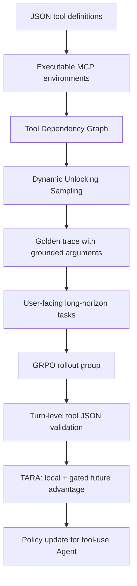

# ToolVerse：把 Agentic RL 的工具环境、长程任务和回合级 credit assignment 放到同一个训练闭环里

### 元信息与 TL;DR

- **论文**：ToolVerse: Unlocking Massive Environments and Long-Horizon Tasks for Agentic Reinforcement Learning
- **链接**：https://arxiv.org/abs/2607.15660
- **日期**：2026-07-17 提交到 arXiv，本轮按当前周内容采集。
- **类型**：大模型后训练 / Agentic RL / 工具调用环境扩展。
- **一句话**：ToolVerse 试图回答一个很具体的问题：如果 Agentic RL 继续只在少量玩具工具、短轨迹和最终成败奖励上训练，模型很难学会真实 MCP 工具生态里的长程依赖；作者于是构造 422 个可执行环境、4438 个工具和 2987 条 GUST 数据项，再用 Turn-Aware Relative Advantage 把奖励拆到每个对话回合。

**TL;DR**

- **做什么**：论文提出 ToolVerse，把真实或类真实的 JSON 工具定义转换成可执行 MCP 工具环境，并用这些环境训练 LLM Agent 的长程工具调用能力。
- **怎么做**：系统先筛出 5 到 20 个工具规模的 toolset，构造 Tool Dependency Graph，再用 Dynamic Unlocking Sampling 生成满足拓扑依赖的多回合工具轨迹，最后把 golden trace 改写为用户任务。
- **训练机制**：作者在 GRPO 框架上加入 TARA，把每条轨迹拆成 turn，对每个 turn 做工具 JSON 覆盖校验；局部 advantage 衡量当前 turn 是否比同组 rollout 好，未来 advantage 只在当前 turn 有效时传播后续奖励。
- **关键数据**：GUST 最终包含 422 个环境、4438 个可执行工具、2987 个数据项，平均每个数据项 3.8 个任务，平均每个环境 12.2 个工具。
- **实验结论**：在 Qwen3-8B 上，TARA 让 BFCL-v3 overall 从 28.88% 到 37.50%，ACEBench-Agent overall 从 46.51% 到 61.66%；在 Qwen2.5-14B-Instruct 上，ACEBench-Agent overall 从 47.78% 到 61.66%。
- **消融证据**：只做 turn-local credit 在 Qwen3-8B 上 BFCL-v3 为 33.75%、tau2-Bench 为 27.33%，弱于完整 TARA 的 37.50% 和 32.37%；去掉 consistency gate 后也低于完整版本。
- **规模证据**：环境从 100 个扩到 422 个时，Qwen3-8B 的 BFCL-v3 从 35.00% 到 37.50%，tau2-Bench 从 27.33% 到 32.37%，说明环境多样性不是可有可无的采样噪声。
- **局限**：环境依赖预定义工具协议和 LLM 生成的依赖图；奖励仍是 turn 级规则校验；训练用 32 张 A100、DeepSeek-V3.2 用户模拟器和改造后的 Verl/MCP 环境，复现成本高，且结果不等价于开放互联网 Agent 的安全性或可靠性证明。

### 研究问题：为什么 Agentic RL 不能只靠更多 rollout？

这篇论文的核心不是“又做一个工具调用 benchmark”，而是把 Agentic RL 的三个瓶颈并排放在一起：

| 瓶颈 | 旧设置里的常见做法 | ToolVerse 的对应处理 | 仍然没有解决的部分 |
|---|---|---|---|
| Scope | 单工具、少数 benchmark 工具、固定领域 API | 扩到 422 个 MCP 环境和 4438 个工具 | 工具生态仍来自可结构化的协议，不等于任意真实 SaaS 或浏览器状态 |
| Tool Use Complexity | 短链、单轮、浅层参数填充 | TDG + DUS 生成依赖锁定的长程任务 | 依赖图由 LLM 辅助推断，错误边会影响任务语义 |
| Credit Assignment | 最终结果或整条轨迹奖励 | TARA 对每个 turn 计算相对 advantage | turn reward 仍需 golden trace，可观测性和 reward 设计是前提 |

作者在 Table 1 中把 ToolVerse 与 ZeroTIR、SimpleTIR、AgentFlow、ToolRL、SALT、FTRL 放在一起比较，想强调两点：

- 只训练代码解释器或搜索工具，不能覆盖多工具现实环境中的参数依赖、权限顺序和状态更新。
- 只用 outcome reward，会把一次长程轨迹里的早期正确选择、后期错误选择和冗余工具调用混在同一个标量里。

这也是论文最值得深读的地方：它把“环境扩展”和“奖励密集化”绑定起来。没有可执行环境，细粒度奖励只能停留在 LLM judge 标签；没有 turn-level credit，大规模环境又会变成更嘈杂的 sparse reward 问题。

### 论证路线：从工具环境到任务，再到训练信号

作者的论证可以拆成四个 claim：

1. **Claim 1：Agentic RL 的环境规模太小。**
   - 证据是现有方法通常只覆盖单工具或少数 benchmark 工具。
   - 机制回应是把 JSON tool definition 转成可执行 MCP 环境。

2. **Claim 2：环境变大后，任务必须有显式依赖结构。**
   - 如果只随机拼接工具，轨迹可能合法但没有语义。
   - Tool Dependency Graph 用边表示“前一工具输出是后一工具输入”或“后一工具必须在前一工具之后调用”。

3. **Claim 3：长程轨迹需要比 GRPO 更细的 credit。**
   - 整条 trajectory 的 relative advantage 会把所有 token 同奖同罚。
   - TARA 把 reward、normalization 和 token-level assignment 限定在对应 turn。

4. **Claim 4：规模、依赖任务和 turn-aware credit 共同产生收益。**
   - 主表展示多模型、多 benchmark 的提升。
   - 消融表说明 local-only、future-without-gate、环境数量缩减都会损失性能。

用流程图表示如下：



### 方法一：从静态工具定义到可执行 MCP 环境

ToolVerse 的第一步是环境工程，而不是训练算法。

- 作者收集开源和专有来源里的 JSON 工具定义。
- 系统把这些定义转换成可执行 MCP 工具。
- 只保留通过语法验证和单元测试、能形成闭环的 toolset。
- 为了避免任务过短或过宽，筛选工具数量在 5 到 20 之间的环境。
- 最终形成超过 400 个可执行环境；附录统计表给出的最终数是 422 个环境和 4438 个工具。

这个设置有一个重要含义：

| 设计选择 | 训练上的好处 | 研究边界 |
|---|---|---|
| 转成 MCP 环境 | rollout 时可以真实执行工具，而不是只预测函数名 | MCP 抽象会弱化真实应用中的权限、网络、UI 和隐藏状态 |
| 过滤 5-20 工具 | 任务复杂度足够，但仍可控 | 不能证明对上百工具的大型工作区仍稳定 |
| 单元测试闭环 | golden trace 可被回放验证 | 通过测试不代表任务覆盖了真实异常路径 |
| 多 macro-domain | 减少对单一 benchmark 的过拟合 | 论文没有逐域给出完整失败分布 |

这也是为什么本文比纯 benchmark 更接近“训练基础设施”论文。它不是只问模型在某个固定测试集上会不会调用工具，而是先问：训练时到底有没有足够多、足够可执行、足够有依赖关系的工具世界。

### 方法二：TDG 和 DUS 如何制造长程工具任务？

论文把每个场景表示为 Tool Dependency Graph：

- **节点 V**：工具。
- **边 E**：依赖关系。
- **边的含义**：
  - 工具 A 的输出会成为工具 B 的输入。
  - 或者工具 B 在逻辑上必须等工具 A 完成之后才能调用。

Dynamic Unlocking Sampling 的直觉很简单：一开始只能用入度为 0 的工具；当某个工具被采样进轨迹后，它会解锁后继工具。这样生成的轨迹天然满足因果顺序。

```text
Input:
  G = (V, E)  # 工具依赖图
  N           # 每个阶段最多采样多少个 ready tools

State:
  D[v] = indegree(v)
  Q = {v | D[v] = 0}
  T = []

Loop:
  while Q is not empty:
    k = min(|Q|, N)
    S_t = sample(Q, k)
    append S_t to T
    remove S_t from Q
    for each u in S_t:
      for each successor v of u:
        D[v] = D[v] - 1
        if D[v] == 0:
          add v to Q

Output:
  T = [S_1, S_2, ..., S_m]
```

这段算法的意义不是复杂，而是把“长程”从自然语言口号变成可验证结构：

- 早期阶段通常是查询、检索、认证、读取上下文。
- 中间阶段开始把前面输出转成参数。
- 后期阶段才执行强依赖操作，例如预订、提交、更新、生成最终结果。

随后作者做 Inverse Context Reconstruction：

- 先按拓扑顺序把工具参数落到 mock database 的真实状态里。
- 依赖型参数来自前序工具输出。
- 上下文型参数来自当前数据库状态。
- 再让 LLM 把 golden trace 改写成用户可见任务。
- 最后用 LangGraph 回放，确认在状态更新后 golden trace 仍可执行。
- 还用 teacher-agent Pass@8 过滤，去掉高级模型也难以完成或语义不稳的样本。

这一步给后训练带来一个关键资产：每个 turn 都有可比对的 golden tool JSON，因此后面才能做 turn-level reward，而不必完全依赖 LLM judge。

### 方法三：TARA 如何修补 GRPO 的长程 credit assignment？

标准 GRPO 的问题在长程工具轨迹里会被放大：

- 一条轨迹最后成功，不代表每个中间工具调用都值得强化。
- 一条轨迹最后失败，也不代表所有早期探索都是坏的。
- 如果 reward 只在轨迹末端出现，前面多个 turn 的参数填充、信息询问和状态维护会被同一个 advantage 粗暴广播。

TARA 的做法是把 reward 拆到 turn。

**turn-level binary reward**

设：

- `G_t`：第 t 个 turn 需要覆盖的 golden tool JSON 集合。
- `A_{i,t}`：第 i 条 rollout 在第 t 个 turn 生成的 tool-call JSON 序列。
- `r_{i,t}`：该 rollout 在该 turn 的二元奖励。

公式为：

```text
r_{i,t} =
  1.0, if G_t is covered by A_{i,t} under dictionary-level matching
  0.0, otherwise
```

这里不是字符串完全匹配，而是 dictionary-level 的工具名和参数匹配；同一 turn 内只要满足依赖约束，顺序不必固定。

**local advantage**

同一任务会采样 K 条 rollout。对第 t 个 turn，计算这一组 reward 的均值和标准差：

```text
A_local(i,t) = (r_{i,t} - mean_t) / (std_t + epsilon)
```

如果这一组在该 turn 全都成功或全都失败，标准差为 0，论文把该 turn 的相对 advantage 设为 0。这个处理合理：组内没有偏好信号时，不应该人为制造梯度。

**gated future advantage**

长程任务的关键在未来，但未来奖励不能无条件回传。否则当前 turn 已经错了，后面偶然成功的部分还会错误奖励当前决策。

作者引入 consistency gate：

```text
V_{i,t} = delta_{i,t} * sum_{k=0}^{T-t} gamma^k * r_{i,t+k+1}
```

通常 `delta_{i,t} = r_{i,t}`。也就是说，只有当前 turn 先做对，后续奖励才有资格向当前 turn 传递。

再把 `V_{i,t}` 在同组 rollout 的第 t 个 turn 上标准化：

```text
A_future(i,t) = (V_{i,t} - mean_future_t) / (std_future_t + epsilon)
```

**total advantage**

最终用于策略更新的是：

```text
A_total(i,t) = A_local(i,t) + lambda * A_future(i,t)
```

论文默认 `lambda = 0.5`，附录超参还给出 `gamma = 0.5`。

这个机制的研究价值在于：

- 它比 outcome-only reward 更细。
- 它比纯 process reward 更可执行，因为 golden trace 已经由环境生成。
- 它不会让错误的当前工具调用直接吃到未来成功的 credit。
- 它仍然保持 GRPO 的 group-relative 风格，不需要单独训练 reward model。

### 数据集与训练设置：GUST 到底有多大？

论文最终构造的 GUST 统计如下：

| 指标 | 数值 |
|---|---:|
| Total Environments | 422 |
| Total Executable Tools | 4438 |
| Total Data Items | 2987 |
| Avg. Tasks per data item | 3.8 |
| Avg. Tools per environment | 12.2 |

训练设置也值得注意：

| 项目 | 设置 |
|---|---|
| 训练模型 | Qwen2.5-14B-Instruct、Qwen3-4B、Qwen3-8B |
| RL 算法底座 | GRPO |
| 用户模拟器 | DeepSeek-V3.2 |
| 训练框架 | 改造 Verl 以集成 MCP tool environment |
| GPU | 32 张 NVIDIA A100 |
| Global batch size | 128 |
| Learning rate | 1e-6 |
| Mini-batch size | 32 |
| Max prompt length | 8192 |
| Max response length | 24000 |
| Single-turn response length | 1024 |
| KL loss | False |
| lambda_mix | 0.5 |
| gamma | 0.5 |

这组设置说明 ToolVerse 的证据不是轻量脚本可复现级别：

- 需要较大 GPU 集群。
- 需要环境模拟、用户模拟和工具执行框架稳定配合。
- 最大 response length 到 24000，表明任务确实面向长交互，而不是短 prompt function calling。

从 Daily Report 的研究者视角看，这个复现边界很重要：我们可以相信论文对“训练方向”的证据，但不能把结果直接外推成普通开发者可以低成本复刻的 recipe。

### 主结果：ToolVerse 和 TARA 在哪些 benchmark 上提升？

论文用三个多回合工具 benchmark 评估：

| Benchmark | 关注点 | 论文里的处理 |
|---|---|---|
| BFCL-v3 Multi-Turn | Python API 交互，含 Base、Miss Param、Miss Func、Long Context | 报告各子项和 overall |
| tau2-Bench | Airline、Retail、Telecom 等对话式用户-Agent 任务 | 用 DeepSeek-V3.2 作为用户模拟器 |
| ACEBench-Agent | 动态环境中的 multi-step 和 multi-turn reasoning | 修改官方实现以支持模型原生 function-calling interface |

主表里最重要的数字可以压缩成下面几组：

| 模型 | 设置 | BFCL overall | tau2 overall | ACEBench overall |
|---|---|---:|---:|---:|
| Qwen3-4B Thinking | Base | 25.38 | 21.06 | 41.28 |
| Qwen3-4B Thinking | ToolVerse + GRPO | 28.50 | 25.77 | 48.34 |
| Qwen3-4B Thinking | ToolVerse + TARA | 28.25 | 26.83 | 55.00 |
| Qwen3-8B Thinking | Base | 28.88 | 27.87 | 46.51 |
| Qwen3-8B Thinking | ToolVerse + GRPO | 35.25 | 30.10 | 56.66 |
| Qwen3-8B Thinking | ToolVerse + TARA | 37.50 | 32.37 | 61.66 |
| Qwen2.5-14B-Instruct | Base | 17.88 | 24.38 | 47.78 |
| Qwen2.5-14B-Instruct | ToolVerse + GRPO | 22.50 | 30.17 | 50.84 |
| Qwen2.5-14B-Instruct | ToolVerse + TARA | 24.12 | 32.40 | 61.66 |

几个读法：

- Qwen3-8B 上，TARA 相对 base 的 ACEBench overall 提升是 `61.66 - 46.51 = 15.15`。
- Qwen2.5-14B-Instruct 上，TARA 相对 base 的 tau2 overall 提升是 `32.40 - 24.38 = 8.02`。
- Qwen3-4B 上，BFCL overall 的 TARA 略低于 GRPO，分别是 28.25 和 28.50；这说明 TARA 不是每个指标都单调压过 GRPO，但在更长程的 tau2 与 ACEBench 上更明显。

论文还与可复现公开 baseline 比较：

| 方法 | BFCL-v3 Acc. | tau2-Bench Avg. |
|---|---:|---:|
| Qwen2.5-7B-Instruct | 12.88% | 16.00% |
| ToolRL | 15.25% | 16.37% |
| agentflow | 11.25% | 17.03% |
| SimpleTIR | 11.75% | 13.53% |
| TARA (Ours) | 20.00% | 29.87% |

但这张表也有边界：作者明确说 SALT 和 FTRL 因关键实验 artifacts 不公开，无法做 faithful head-to-head。也就是说，公开 baseline 这部分能说明“在可复现候选里 TARA 强”，不能说明它已经完整击败所有同类方法。

### 消融：收益来自 turn-aware、future gate，还是环境规模？

消融表对判断论文贡献很关键。

| 设置 | BFCL-v3 | tau2-Bench |
|---|---:|---:|
| Qwen3-8B | 28.88% | 27.87% |
| Qwen3-8B + GRPO | 35.25% | 30.10% |
| Turn-local only | 33.75% | 27.33% |
| Turn-local + future w/o gate | 35.00% | 28.17% |
| Full TARA | 37.50% | 32.37% |

这张表支持三个判断：

- **只给局部 turn reward 不够**：Turn-local only 在 BFCL 上有提升，但 tau2 反而低于 base 的 27.87%，说明长程对话环境不能只看当前回合是否命中工具。
- **future credit 必须有 gate**：无 gate 的 future credit 在 BFCL 到 35.00%，但 tau2 只有 28.17%，说明后续奖励如果从错误当前步骤回流，会引入噪声。
- **完整 TARA 最稳**：37.50% 和 32.37% 同时是该表最高，支持 local + gated future 的组合。

环境规模消融如下：

| 训练环境 | BFCL-v3 | tau2-Bench |
|---|---:|---:|
| Qwen3-8B | 28.88% | 27.87% |
| ToolVerse-100 | 35.00% | 27.33% |
| ToolVerse-200 | 35.75% | 27.57% |
| ToolVerse-300 | 36.00% | 32.12% |
| ToolVerse-Full (422) | 37.50% | 32.37% |

这里的细节比“越大越好”更有意思：

- BFCL 从 100 到 422 是缓慢爬升，35.00 到 37.50。
- tau2 从 100 到 200 几乎没动，27.33 到 27.57。
- tau2 从 200 到 300 突然到 32.12，说明某些环境多样性可能正好覆盖了对话域泛化所需结构。
- Full 422 相对 300 的边际提升很小，32.12 到 32.37。

这提醒我们：环境扩展不是简单堆数量，关键是覆盖哪些工具依赖模式、状态转换和用户澄清行为。

### Figure 与案例证据：论文图表支持了什么？

本文没有必要在正文里直接贴图，因为关键证据可以用表格和伪代码复述；但 Figure 的功能仍需解释。

| Figure / Table | 支持的结论 | 不能证明的结论 |
|---|---|---|
| Figure 1 | Agentic RL 被 scope、complexity、credit assignment 三维限制 | 不能证明这三维已经穷尽所有瓶颈 |
| Figure 2 | TARA 是 turn-level validation、normalization、token assignment 的流程 | 不能证明 turn reward 本身无噪声 |
| Figure 3 | 工具覆盖多个 macro-domain | 不能证明每个域有相同质量或真实业务难度 |
| Figure 4 | GUST 在 Pass@K、graph complexity、turn length 等维度有统计分布 | 不能证明测试集和训练集无结构泄漏 |
| Figure 5 | lambda 和 gamma 在 0.5 附近较好，过小过大都会降 | 不能证明其他模型尺度最优超参也相同 |
| Figure 6 | TARA 的 trace score 和 validation score 比 naive GRPO 更稳定上升 | 不能证明最终线上 Agent 行为一定更安全 |
| Figure 7 | 酒店预订案例展示跨回合参数维护和缺失信息询问 | 单个 case study 不能替代大规模失败分析 |

Figure 7 的案例尤其贴近 Agent 系统：

- Agent 先从用户意图中识别活动、日期、地点。
- 某些参数缺失时，需要向用户询问预算等约束。
- 后续 Book_Hotel 工具调用要合并前面 Search_Event 的输出和用户补充信息。
- 这类任务失败常常不是“不会调用工具”，而是“忘了前序工具输出如何绑定后序参数”。

这就是 TARA 的适用点：如果第 2 个 turn 询问信息是对的，但第 5 个 turn 预订错了，训练信号不应该把第 2 个 turn 一起全盘惩罚；如果第 2 个 turn 已经问错或取错参数，未来成功信号也不应该无条件奖励它。

### 和近期 Agentic RL 工作的位置关系

ToolVerse 与近期几条方向有明显连接：

| 方向 | 典型问题 | ToolVerse 的差异 |
|---|---|---|
| Outcome-only GRPO | 最终答案对了就奖励整条轨迹 | TARA 在 turn 内做 group-relative advantage |
| Dense reward / process reward | 需要 judge 或人工标签给步骤打分 | ToolVerse 用 golden trace 的工具 JSON 覆盖做规则校验 |
| 环境模拟器 | 让模型在模拟环境中练习 | ToolVerse 强调 MCP 工具可执行化和依赖图生成 |
| 多工具 benchmark | 评估模型是否会调用工具 | ToolVerse 把环境用于训练，并报告跨 benchmark 泛化 |
| Agent 安全/权限 | 限制工具调用副作用 | 本文主要是能力训练，不直接给安全约束机制 |

对后训练研究来说，最值得带走的是“credit assignment 必须匹配环境结构”。如果环境能给出 turn-level golden trace，就没有必要把整条轨迹压成一个 reward；如果环境只能给最终成败，那么再复杂的优化器也会面临信号混杂。

### 失败边界与复现风险

这篇论文的局限需要认真读，因为它的系统跨度很大。

**1. 依赖图不是自然生成的世界模型**

- TDG 由 LLM 基于工具定义和场景原则辅助推断。
- 如果边漏了，DUS 可能生成表面可执行但语义不足的轨迹。
- 如果边多了，任务可能变得过于线性，低估真实 Agent 的探索空间。

**2. turn-level reward 仍是规则化覆盖**

- 工具名和参数覆盖可以验证很多 function calling 任务。
- 但真实任务常有等价工具、冗余工具、替代计划和用户偏好变化。
- 二元 reward 对“部分正确但需修复”的情况仍然粗。

**3. 用户模拟器会影响结果**

- tau2-Bench 和 ACEBench-Agent 使用 DeepSeek-V3.2 作为 conversational user。
- 这让评估更可控，但用户行为风格可能影响模型表现。
- 如果换成人类用户或更 adversarial 的用户模拟器，长程稳定性可能变化。

**4. 工程复现门槛很高**

- 训练需要 32 张 A100。
- 需要改造 Verl 以接 MCP 环境。
- 需要可执行工具、mock database、LangGraph 回放和 Pass@8 过滤。
- 论文还没有把所有同类 baseline 做完整公平比较，部分原因是 artifacts 不公开。

**5. 能力提升不是安全保证**

- Agent 更会长程调用工具，可能提升生产力，也可能提升错误动作的可达性。
- TARA 优化的是 golden trace 覆盖，不是权限最小化、敏感数据保护或 prompt-injection 抵抗。
- 如果环境里的工具权限过宽，能力训练本身不会自动给出 containment。

**6. 论文证据更强在“结构化工具调用”，弱在“开放世界策略”**

- BFCL、tau2-Bench 和 ACEBench-Agent 都比单轮 function calling 更接近真实 Agent，但它们仍有明确任务边界、可模拟用户和可评分终点。
- ToolVerse 的 golden trace 假设正确路径可以被写成工具 JSON 序列；真实工作流常常存在多个等价路径，例如先查日历再查邮件，或先读 issue 再读测试日志。
- 如果同一目标存在多条合法轨迹，二元覆盖 reward 可能把合理替代方案当成错误；这会鼓励模型贴近数据生成器，而不一定鼓励最稳健的策略搜索。
- 论文用 average@4 降低评估波动，但没有系统报告不同随机种子、不同用户模拟器或不同工具失败率下的方差；因此主表应解读为受控设置下的强证据，而不是部署鲁棒性上限。

**7. 第三方材料缺口本身也是信号**

- 本轮检索了论文标题、arXiv 编号、GUST、TARA 和 ToolVerse 组合关键词，未找到足以补充主文的独立第三方复现或代码仓库说明。
- 这意味着当前最可靠证据仍来自 arXiv 正文、PDF 表格和附录超参；本文没有把社媒转述或未验证宣传当作证据。
- 对读者来说，下一步最值得关注的不是摘要转述，而是作者是否公开环境构建脚本、MCP toolset、GUST 数据、Verl 改造补丁和评估 harness。
- 如果这些 artifacts 不公开，ToolVerse 的概念价值仍然成立，但数字复现、baseline 公平性和真实成本估算都会打折。

### 对 Agent 系统设计的启发：状态、验证和 credit 必须同构

从构建 Agent 系统的角度，ToolVerse 的真正价值不是“用了 422 个环境”，而是它展示了一个同构原则：

```text
训练环境里的状态结构
  必须能生成任务依赖结构；

任务依赖结构
  必须能生成可回放的 golden trace；

golden trace
  必须能产生 turn-level 验证信号；

turn-level 验证信号
  才能支持更细的 advantage assignment。
```

如果把这个原则放到实际 Agent 平台，至少有四个工程问题：

- **工具注册**：每个工具不能只有自然语言说明，还要有输入输出 schema、可观测副作用和失败码。
- **状态记录**：每个 turn 要记录用户消息、工具调用、工具返回、环境状态差异和依赖来源。
- **验证器**：不能只在最终 answer 上判分，要能判断当前工具调用是否满足前置条件和参数约束。
- **训练日志**：rollout 日志要能回放、切片和归因，否则后训练只能继续用整条轨迹奖励。

ToolVerse 提供的是研究版闭环。生产版还需要把安全策略并入这个闭环：

| ToolVerse 当前关注 | 生产 Agent 还要补的层 |
|---|---|
| 工具是否可执行 | 工具是否被授权、是否最小权限 |
| 参数是否覆盖 golden trace | 参数是否包含敏感数据、是否越权 |
| turn 是否完成依赖 | turn 是否违反组织策略或用户意图 |
| 长程任务是否成功 | 成功是否通过不可接受副作用达成 |

### 结论：ToolVerse 把后训练问题推向“环境-任务-奖励”联合设计

ToolVerse 的贡献可以浓缩为三个判断：

1. **Agentic RL 的上限不只取决于算法，也取决于环境规模。**
   - 422 个环境和 4438 个工具让训练覆盖更多工具依赖模式。
   - Table 7 说明环境多样性对跨 benchmark 泛化有实证帮助。

2. **长程任务不能靠随机工具拼接。**
   - TDG 和 DUS 让轨迹具备拓扑约束。
   - Inverse Context Reconstruction 和 LangGraph 回放保证任务不是只在文本上合理。

3. **回合级 credit assignment 是 Agent 后训练的核心方向。**
   - TARA 用 local advantage 处理当前 turn。
   - 用 gated future advantage 处理后续影响。
   - 用 consistency gate 避免错误当前步骤吃到未来奖励。

但它也留下了清晰的继续追问：

- 真实工具生态里，依赖图能否自动从日志中学习，而不是由 LLM 静态推断？
- turn reward 能否从二元覆盖扩展到“可恢复错误、冗余但无害、权限违规、有害成功”等更细标签？
- 环境扩展是否会让 Agent 获得更强越权组合能力，需要怎样的 safety RL 或 runtime policy 同步加入？
- 如果 MCP 工具执行涉及真实账号、支付、邮件、文件系统和代码仓库，TARA 的 credit 是否应同时纳入副作用成本？
- 能否把 ToolVerse 这类训练环境与 VIGIL、trace policy、least-privilege harness 结合，让能力提升和安全约束共享同一套 trace？

我的判断是：这篇论文不是终点式 benchmark，而是把 Agentic RL 后训练推进到更工程化的阶段。它提醒我们，下一代 Agent 训练不应只争论 GRPO、DPO 或 reward model，而要同时设计可执行环境、依赖任务、可回放 trace、turn-level verifier 和安全策略。否则，模型越会使用工具，系统越难知道它到底在哪一步学对了、在哪一步只是碰巧成功。
