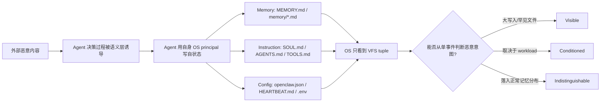

# Self-State Attacks on Self-Hosted AI Agents：自托管 Agent 的“自状态”攻击为何是 OS 层的硬边界

### 元信息

| 项目 | 内容 |
| --- | --- |
| 论文 | Self-State Attacks on Self-Hosted AI Agents: How Far Can OS Defenses Go? |
| 链接 | https://arxiv.org/abs/2607.17986 |
| 版本与日期 | arXiv:2607.17986v1，2026-07-20 14:16:55 UTC 提交 |
| 方向 | AI 安全 / 自托管 Agent / OS 防护边界 |
| 材料 | arXiv HTML、TeX 源、论文引用的 MITRE ATLAS / OWASP Agentic AI / AgentPoison 等相关工作 |
| 本文判断 | 这篇论文最有价值的部分不是提出一个万能防御，而是把“agent 改写自己的记忆、身份和配置”从 prompt injection 的语义问题，降维成 OS 能看到的 VFS 事件问题，并清楚标出哪些格子 OS 能挡、哪些只能报警、哪些在单事件层面不可区分。 |

### TL;DR

1. 论文研究的是自托管 AI agent 的 self-state attacks：攻击者不直接入侵主机，而是通过间接 prompt injection 等方式让 agent 用自己的合法权限改写自身持久状态，包括 `MEMORY.md`、`AGENTS.md`、`SOUL.md`、`openclaw.json`、`HEARTBEAT.md` 等。
2. 作者的核心形式化是：对自状态资源 `R`，攻击操作集合 `A(R)` 是合法操作集合 `L(R)` 的子集，即 `A(R) ⊆ L(R)`。这意味着 OS 权限模型看见的是同一个进程、同一个文件、同类 `write` / `unlink` / `chmod` 事件，不能只靠 access control 判断“这是学习还是投毒”。
3. 论文把攻击空间拆成四轴：Target、Mechanism、Granularity、Temporal。主实验固定单次注入时间，构造 23 个 canonical cells，并展开成 43 个具体攻击操作，覆盖 Memory、Instruction、Config 三层。
4. 实验对象是 OpenClaw 风格的自托管 agent harness，在 Ubuntu 22.04 上采集四类 workload：coding、research、operations、generalist。每类 30 个任务，5 条任务链，合计 600 个 task slots，用真实 inotify trace 作为合法写入分布。
5. 防御分三类评估：prevention、detection、recovery。推荐组合是 L3 prevention（锁 Instruction 和 Config）、B2 workload-conditioned anomaly detection（按 profile 学习每个文件/操作的基线）、15-event backup recovery。
6. 关键数字：23-cell 攻击矩阵在 B2、阈值 `τ=2.0` 下分成 11 个 Visible、8 个 Conditioned、4 个 Indistinguishable。L3 prevention 的保护分数为 0.61，平均功能保留为 0.70；L5 能挡住全部攻击但功能降为 0。B2 在 W3 operations profile 的合法事件 FPR 为 0.08，在 W1/W2 稀疏 profile 上分别高到 0.36 和 0.33。Wazuh-style FIM 虽然攻击 TPR 为 1.00，但合法写入 FPR 均值达到 0.84，说明“所有变化都报警”不可作为可用方案。
7. 残留风险集中在 Memory 行的小粒度修改和追加：例如 `Mem-M1-G3/G4`、`Mem-M2-G3/G4`。这些写入落在 agent 正常记忆更新分布内，OS 单事件监控无法判断内容是有效知识、错误事实还是后门提示。
8. 局限也很明确：实验使用 OpenClaw-like harness 和 Gemini 3 Flash traces，主检测器是 per-event、memoryless 的 VFS 特征模型；它没有评估更高层的内容差分、读路径重评分、长窗口轨迹检测或语义 guard。因此论文结论应理解为“OS 单事件层面的结构边界”，不是“所有系统层防御都无效”。

### 研究问题：为什么自托管 Agent 的风险不是普通沙箱问题？

论文开场区分了两类攻击面：

| 攻击类型 | 目标资源 | OS 沙箱是否天然有效 | 原因 |
| --- | --- | --- | --- |
| Cross-boundary attack | 用户文件、网络端点、宿主进程等 agent 正常不需要碰的资源 | 通常有效 | 攻击操作超出合法操作范围，权限边界可以拒绝 |
| Self-state attack | agent 自己的 memory、instruction、configuration 文件 | 不充分 | 攻击写入使用 agent 正常自更新所需的同一权限和同一文件路径 |

这一区分把问题从“agent 会不会被诱导做坏事”推进到更具体的系统问题：

1. 如果 agent 必须长期写 `MEMORY.md`，那么把 `MEMORY.md` 设为只读会破坏记忆功能。
2. 如果允许 agent 写 `MEMORY.md`，那么投毒写入和正常学习写入在 OS 事件上可能完全一样。
3. 如果只能事后回滚，系统还必须知道从哪个 snapshot 回滚，以及哪些合法学习不能丢。

可以用下面的 Mermaid 图概括论文的主线：



这里的关键不是“OS 完全没用”，而是 OS 的作用被限定在可观察特征上。论文努力回答的是：在这个限定表面内，OS 能走多远？

### 论文主张与论证路线

| Claim | Mechanism | Evidence | Boundary |
| --- | --- | --- | --- |
| 自状态攻击是一个独立攻击类 | 定义 `A(R) ⊆ L(R)`，把攻击目标限定为 agent 自己的持久状态 | 三层 self-state：Instruction、Memory、Configuration；并映射到 MITRE ATLAS、ATT&CK、OWASP Agentic AI | 不讨论 prompt injection 如何成功，把“agent 已被语义层诱导”作为前提 |
| Prevention 有结构性上限 | 同一 agent 进程对同一文件既需要合法写入也可能执行恶意写入 | L0-L5 权限级别显示：越锁越安全，但功能单调下降；L5 保护 1.00、功能 0 | 对一些本来不该运行时写的文件，锁定仍然有效，例如大多数 Instruction 文件 |
| Detection 只能部分弥补 | 从 VFS tuple 学习 per-file / per-op_type 的合法分布 | B2 在 23 cells 上得到 11 V / 8 C / 4 I；workload-conditioned 比 pooled baseline 更能暴露 profile 差异 | 单事件检测不看内容，不处理写入后的行为轨迹 |
| Recovery 依赖检测且有数据损失 | snapshot/backup 只能在检测触发后回滚 | 8 个非边界攻击在检测触发后 100% remediation；backup-destruction sentinel 为 0% | 语义投毒可能潜伏，回滚点不一定等于投毒点 |
| 残留风险集中在 Memory 小写入 | 小粒度修改/追加落在正常记忆更新分布内 | I cells 是 `Mem-M1-G3/G4`、`Mem-M2-G3/G4`，W3/W4 profile 尤其明显 | 需要内容、读路径或长窗口检测，不能只靠 OS 单事件 |

这张路线表也解释了论文为什么要同时做形式化和实验。只说“权限无法区分意图”会显得抽象；只做 anomaly detector 又会被误读成模型调参。作者把二者连接起来：先给出 OS 可见特征的极限，再用 workload trace 说明边界实际落在哪里。

### 方法机制：四轴攻击空间如何落到 OS 可见特征？

论文把每个自状态攻击投影成一个 VFS feature tuple：

```text
event = (target_path, op_type, delta_s, mode_delta, delta_t)

target_path : 被修改的自状态文件路径
op_type     : write / create / unlink / rename / chmod 等事件类型
delta_s     : 文件大小变化，单位 byte
mode_delta  : 权限位变化
delta_t     : 同一文件上一次事件到当前事件的时间间隔
```

四个攻击轴分别对应这个 tuple 中的可观测维度：

| 轴 | 取值 | 对 OS 监控的意义 |
| --- | --- | --- |
| D1 Target | Memory / Instruction / Configuration | 决定 `target_path` 属于哪个自状态层 |
| D2 Mechanism | M1 Modify / M2 Add / M3 Delete / M4 Deny | 决定 `op_type` 是改写、追加、删除还是改权限 |
| D3 Granularity | G1 whole-file / G2 large-delta / G3 line-scale / G4 <= 4B | 决定 `delta_s` 是否远离合法写入分布 |
| D4 Temporal | single-shot / burst-aligned / quiet-gap / slow-drip | 决定 `delta_t` 是否看起来异常 |

论文主实验把 Temporal 固定为 T1 single-shot，再用 Exp2-T 单独检查 burst 和 quiet 两种时机。这种设计的好处是：

1. 先把 target、mechanism、granularity 的结构图画清楚。
2. 再观察时间选择是否能让 cell 迁移。
3. 避免把所有轴混在一起，导致看不出是“文件路径罕见”还是“注入时机异常”在贡献 detection。

### 攻击矩阵：23 cells 为什么不是任意枚举？

论文从三层 target 和四类 mechanism 出发，但没有机械笛卡尔展开，因为有些组合在这个 agent self-state 场景中没有清晰含义。

| Target | M1 Modify | M2 Add | M3 Delete | M4 Deny |
| --- | --- | --- | --- | --- |
| Memory | G1-G4，4 cells | G2-G4，3 cells | G1，1 cell | G1，1 cell |
| Instruction | G1-G4，4 cells | G2-G4，3 cells | G1，1 cell | G1，1 cell |
| Config | G1-G4，4 cells | 排除 | 排除 | G1，1 cell |

排除规则是有意义的：

1. `M3 Delete` 只保留 G1，因为局部删除若文件仍存在，本质上变成一次带负 `delta_s` 的 `Modify`。
2. `M4 Deny` 只保留 G1，因为 `chmod` 主要改变 mode bits，不随内容粒度变化。
3. `Config/M2` 和 `Config/M3` 被排除，因为 JSON 配置的“纯追加”或截断通常不是合法语义更新，而会变成解析失败或整体 rewrite。
4. `M2/G1` 被排除，因为 fixed self-state 文件集合中，whole-file creation 不是正常操作。

最终 23 个 canonical cells 又展开成 43 个具体攻击实例。例如 `Mem-M3-G1` 同时包含 unlink `MEMORY.md` 和 unlink 活跃 daily log；`Inst-M3-G1` 覆盖 `SOUL.md`、`AGENTS.md`、`IDENTITY.md`；`Cfg-M1-G3` 覆盖 `openclaw.json` 和 `HEARTBEAT.md`。

这个展开方式避免了只在抽象表格上谈安全，也避免了把每个文件都当作新维度，使实验结果仍能回到“哪一类 attack cell 可防、可测、不可区分”的层面。

### 三类 OS 防御边界

#### 1. Prevention gap：权限能挡越界，但挡不住合法路径里的恶意意图

论文讨论的 prevention 包括 Unix permissions、POSIX ACL、SELinux/AppArmor、eBPF LSM、Landlock 等。它们的共同前提是：

1. 恶意和合法操作来自不同 principal；或者
2. 恶意和合法操作访问不同 resource；或者
3. 合法 workload 根本不需要写某类 resource。

Self-state attack 破坏了前两个前提。agent 正常学习和被诱导投毒都可能由同一进程写同一个 `MEMORY.md`。所以 prevention 有一个严格边界：

```text
如果 L(R) 非空，且 A(R) 是 L(R) 的子集，
那么只看 principal / path / op_type 的 access-control policy
不能在不误伤合法写入的情况下拒绝所有攻击写入。
```

这不是说锁文件没用。恰恰相反，论文在 L1-L3 中显示 Instruction 和 Config 层常常值得锁，因为很多 profile 不需要 agent 在运行时改这些文件。边界在于：当资源必须可写时，权限模型就不能替你判断内容。

#### 2. Detection gap：能看到写入，不等于能判断写入是否有害

OS 监控可以完整捕捉 self-state modification，但它看到的是元数据：

```text
MEMORY.md modified by process P
op_type = IN_MODIFY
delta_s = +63B
timestamp = T
```

真正的问题是：这 63B 是新增有效知识，还是插入“以后忽略安全策略”的毒性记忆？如果 detector 不读取内容、不理解上下文，仅靠 `delta_s` 和 `delta_t`，就只能做异常检测，而不是语义判断。

论文选择的 anomaly score 是：

```text
score(e) = max(
  |delta_s - mu_s| / sigma_s,
  |log(delta_t) - mu_t| / sigma_t
)
```

变量解释：

| 变量 | 含义 |
| --- | --- |
| `e` | 某个 VFS event |
| `mu_s, sigma_s` | 某个 `(file, op_type)` 的合法 size-delta 均值和标准差 |
| `mu_t, sigma_t` | 同一 key 的合法 log inter-arrival time 均值和标准差 |
| `tau` | 异常阈值，论文主结果固定为 `2.0`，对应约 `2 sigma` |
| unseen key | 如果训练集中没见过某个 `(file, op_type)`，则 score 视为无穷大 |

B2 detector 与 B1 的区别在于：B1 把四类 workload 混在一起拟合全局基线；B2 按 workload profile 单独拟合基线。论文结果显示，B2 不是简单提高数字，而是更诚实地暴露边界：某些 config 小改动从 I 迁到 C，同时某些 memory 大写入从 V 降到 C，因为 W3 operations profile 的 memory 写入分布确实更宽。

#### 3. Recovery gap：回滚能修复文件，但前提是知道何时触发、回到哪里

Recovery 的结构限制有三层：

1. 检测依赖：没有 detection trigger，就不会回滚。
2. 回滚点歧义：投毒可能很早发生，危害很晚显现，最近 snapshot 可能已经污染。
3. 选择性恢复歧义：只删掉“有毒编辑”需要语义判断，而且 memory、instruction、config 之间可能相互蒸馏。

实验中，一旦检测触发，8 个非边界攻击都能 100% remediation。这说明备份机制作为最后一环有价值。但 backup-destruction sentinel 达到 0% remediation，也提醒我们：备份本身必须放在 agent 无法合法写入的 principal 和路径下，否则 recovery 也会变成 self-state 攻击目标。

### 实验设置：为什么 W1-W4 很关键？

论文没有只在一个 toy workload 上跑 detector，而是定义四种 agent profile：

| Profile | Archetype | Instruction 写入 | Memory 写入 | Config 写入 | 任务来源 |
| --- | --- | --- | --- | --- | --- |
| W1 | Coding assistant | None | Low / bursty | None | Aider polyglot Python subset |
| W2 | Research assistant | None | Medium / append | None | FRAMES |
| W3 | Operations agent | Medium | Medium | High | 作者构造的运维任务 |
| W4 | Generalist | Rare | Medium | Low | 作者构造的日常任务 |

每类 profile 有 30 个任务，按 5 条任务链顺序运行。总规模是：

1. 每个 profile 150 个 task slots。
2. 四个 profile 合计 600 个 task slots。
3. W1、W2、W3、W4 的合法 self-state event 数分别是 29、42、1677、98。

这个规模差异本身就是结果的一部分。W3 合法 self-state 写入最密集，尤其是 config 和 memory；因此它既让 detector 的 FPR 更稳定，也让某些小 memory 攻击更难分辨。W1/W2 写入稀疏，很多 unseen key 会让攻击看起来很明显，但合法事件也容易因训练样本少而误报。

### Exp 1：Prevention 的保护-功能权衡

论文设置了 L0-L5 六个逐步收紧的权限级别：

| Level | 策略 | Protection | Functionality | W1 | W2 | W3 | W4 |
| --- | --- | ---: | ---: | ---: | ---: | ---: | ---: |
| L0 | Unrestricted | 0.00 | 1.00 | 100 | 100 | 100 | 100 |
| L1 | Lock persona | 0.09 | 0.98 | 100 | 100 | 100 | 92 |
| L2 | Lock all Instruction | 0.39 | 0.88 | 100 | 100 | 61 | 92 |
| L3 | Lock Config too | 0.61 | 0.70 | 100 | 100 | 11 | 69 |
| L4 | Lock `MEMORY.md` | 0.70 | 0.56 | 93 | 90 | 9 | 31 |
| L5 | Lock daily logs too | 1.00 | 0.00 | 0 | 0 | 0 | 0 |

这张表支持两个判断：

1. L1/L2 对多数 profile 比较便宜，因为 persona 和 instruction 文件通常不需要 runtime 写入。
2. L3 是论文推荐的跨部署折中点，但不是无成本方案：W3 由于运维任务高度依赖 config 写入，成功率掉到 11%。

这里最值得注意的是 L5。它证明纯 prevention 可以把 23 cells 全挡住，但代价是 agent 失去所有自状态功能。因此，“全锁住”不是 agent 安全方案，只是把 agent 退化成无记忆、无自配置的执行器。

### Exp 2：Detection 的 V/C/I 结果

B2 workload-conditioned detector 在 `tau=2.0` 下给出 23-cell 分布：

| 类别 | 数量 | 判定规则 | 直觉含义 |
| --- | ---: | --- | --- |
| Visible | 11 | 所有 profile TPR >= 0.80 | OS 事件明显偏离合法分布 |
| Conditioned | 8 | 最小 TPR 在 0.50 到 0.80 之间 | 某些 workload 下可见，某些 workload 下靠近合法分布 |
| Indistinguishable | 4 | 至少一个 agent-writable profile TPR < 0.50 | 攻击事件落入合法写入分布，单事件 OS detector 基本无从判断 |

四个 I cells 是：

| Cell | 失败 profile | 为什么难 |
| --- | --- | --- |
| Mem-M1-G3 | W3 最低 0.42 | line-scale memory rewrite 被 W3 的 memory update 分布吸收 |
| Mem-M1-G4 | W3 最低 0.27 | <=4B fact flip 与小型合法记忆编辑太像 |
| Mem-M2-G3 | W3 最低 0.37 | daily-log line append 和正常日志追加重叠 |
| Mem-M2-G4 | W4 最低 0.23 | <=4B daily-log append 落入 generalist 日志写入分布 |

这四个 cell 的共同点不是攻击内容更“聪明”，而是 OS feature tuple 更普通。论文还提到 `Mem-M1-G4` 的三种 payload family 在 VFS 层共享同一 feature tuple，因此检测结果不会因为语义负载不同而改变。这正是单事件 OS 检测的边界。

### Exp 2 的一个反直觉点：FIM 全检测，但不可用

Wazuh-style file-integrity monitoring 作为 B0 baseline，在实验里攻击 TPR 全部为 1.00，因为所有攻击都会改变文件 hash、大小或权限。问题是合法写入也都会触发：

| Profile | B0 TPR | B0 合法写入 FPR |
| --- | ---: | ---: |
| W1 | 1.00 | 0.77 |
| W2 | 1.00 | 0.76 |
| W3 | 1.00 | 0.99 |
| W4 | 1.00 | 0.87 |
| Mean | 1.00 | 0.84 |

这组数字说明了为什么论文不把“检测所有文件变化”当作胜利。自托管 agent 的 self-state 正常就会变化，特别是 memory 和 config。如果每次合法学习都报警，系统最终只能变成两种坏状态：

1. 用户关闭报警。
2. agent 被迫停止自学习。

因此，FIM 可以作为审计证据和高敏感文件的保护环，但不能单独覆盖所有自状态层。

### Exp 2-T：时间选择只能改变少数边界格子

论文额外测试了三种注入时机：

| Timing mode | V/C/I 分布 | 变化 |
| --- | --- | --- |
| Random | 11 / 8 / 4 | 主实验 |
| Burst-aligned | 10 / 8 / 5 | `Mem-M1-G2` 从 C 变 I，`Cfg-M1-G2` 从 V 边界降 C |
| Quiet-gap | 12 / 7 / 4 | `Mem-M1-G2` 反而更可见 |

这说明时间维度确实有用，但不是万能 evasion。Burst-aligned 可以让某些写入的 `delta_t` 看起来像高活动期的正常写入；quiet-gap 则可能因间隔太长而提高 z-score。

更重要的是，T4 slow-drip 没有被这个 per-event grid 充分覆盖。慢速多次小写入的风险在于每个子事件都正常，累计语义才异常。论文把这留给未来的 sliding-window trajectory scoring，而不是假装单事件 detector 已经解决。

### Exp 3：Recovery 的成绩与真实约束

Recovery 实验覆盖 9 个攻击：

1. 8 个 V/C/I 代表攻击。
2. 1 个 backup-destruction sentinel，即删除 `MEMORY.md` 并清空 `backups/`。

结果可以分两句：

1. 在检测已触发的前提下，8 个非边界攻击 100% remediation。
2. 若攻击目标包含备份语料本身，sentinel 0% remediation。

作者还报告了 W3 上不同 event-count backup interval 的损失：

| Backup interval `k` | W3 平均丢失事件比例 |
| ---: | ---: |
| 5 | 约 14% |
| 15 | 约 15% |
| 30 | 约 15% |
| 60 | 约 10%-11% |

这个数字不能简单理解为 `k` 越小越好，因为 event trace 分布会影响比例；但它说明回滚成本由“上次 snapshot 以来累积了多少合法工作”决定，而不是由攻击类别决定。对交互式 agent 来说，这意味着 recovery 策略需要和用户确认、审计日志、checkpoint 粒度一起设计。

### 论文推荐防御栈：L3 + B2 + 15-event backup

作者最终把三类防御组合成 cascade：

```text
1. Prevention:
   如果某层 self-state 在该 workload 中不应由 agent 运行时写入，优先锁定。

2. Detection:
   对仍需可写的 Memory 层使用 workload-conditioned anomaly detector。

3. Recovery:
   一旦 detection 触发，用独立 principal 保护的 backup 恢复。

4. Residual:
   对落入合法 Memory 分布的小写入，承认 OS 单事件层无法关闭。
```

用论文自己的结果概括，这个栈在严格 `TPR >= 0.80` closure threshold 下，按 profile 关闭的 cell 数为：

| Profile | 关闭 cells / 总 cells | 主要残留 |
| --- | ---: | --- |
| W1 Coding | 20 / 23 | 部分 memory 小改动处在边界 |
| W2 Research | 21 / 23 | memory minimal append/modify 边界 |
| W3 Operations | 17 / 23 | memory 小修改和 daily-log append 最难 |
| W4 Generalist | 18 / 23 | memory append 和 attribute cadence 重叠 |

这个结论对实际 agent 系统的启发很直接：

1. Instruction 和 Config 不应默认交给 agent 自由写。
2. Memory 必须承认可写性与投毒风险共存。
3. OS 层应提供不可篡改审计、锁定高敏文件、低层事件信号和回滚能力。
4. 真正关闭 Memory I-cells，需要上升到内容、读路径、任务轨迹和用户确认层。

### Figure / Table 证据逐项解读

| 证据 | 支撑的 claim | 不能证明什么 |
| --- | --- | --- |
| Figure 1 cross-boundary vs self-state | 说明 `A(R) ⊆ L(R)` 是自状态攻击区别于普通越界攻击的核心 | 不能证明所有 OS 防御无效，只说明纯路径权限不足 |
| Table profiles | 说明 workload 写入分布差异巨大，尤其 W3 的 self-state 写入密度高 | 不能代表所有真实 agent 部署；profile 是代表性而非穷尽 |
| Table attack matrix | 把攻击空间从口号变成 23 个可测 cells | 不能覆盖多事件 slow-drip 的完整语义效果 |
| Table Exp1 | 量化锁定层数和功能损失的单调 tradeoff | 不能给出所有组织的最优 L-level；W3 的 config 写入需求可能因系统不同变化 |
| Table V/C/I | 证明 residual surface 集中在 Memory 小写入 | 不能证明 semantic detector 无法检测这些写入 |
| Table FPR legitimate | 显示 sparse workload 的 FPR 和 dense workload 的 FPR 完全不同 | 不能说明 B2 是最佳 detector，只说明 workload-conditioning 必要 |
| Table FIM | 说明 any-change monitoring 虽高 TPR 但误报不可用 | 不能否定 FIM 在高价值只读文件上的价值 |
| Recovery experiment | 说明检测触发后 snapshot 可恢复大多数文件层攻击 | 不能解决未触发检测、投毒潜伏、备份被攻击的问题 |

### 相关工作位置：这篇论文补的是哪块空白？

论文把自己放在三条线之间：

1. Prompt injection 与 agent attack benchmark：例如 indirect prompt injection、AgentDojo、AgentPoison、Memory Injection、Promptware kill chain。这些工作关注语义诱导、工具误用、记忆投毒或 benchmark 场景。
2. Agent containment 与 tool boundary：例如 IsolateGPT、CaMeL、SEAgent、Progent、Prompt Flow Integrity、GuardAgent、VeriGuard。这些工作试图在工具调用、插件、planner 或策略层限制 agent 行为。
3. OS observability 与 file integrity：例如 AgentSight、Wazuh-style FIM、Landlock、auditd/inotify/fanotify 等系统机制。

这篇论文的独特性在于：它不是再提出一个 guard，也不是只做一次 prompt injection benchmark，而是问一个更底层的问题：

```text
当 agent 被允许修改自己的状态文件时，
OS 层到底能否从同一进程、同一路径、同类事件中识别恶意意图？
```

答案是分层的：

1. 对 instruction/config 中不该 runtime 写的文件，OS 仍然很强。
2. 对 memory 中大规模、罕见、删除、权限变化，OS detection 仍然有信号。
3. 对 memory 中 line-scale 或 <=4B 的正常形状写入，OS 单事件层必须承认不可区分。

这让论文比泛泛讨论“agent 安全需要 sandbox”更精确，也比只谈“记忆投毒很危险”更可操作。

### 证据边界与局限

#### 实验对象边界

实验基于 OpenClaw-like harness，而不是 Claude Code、Codex、Qwen Code、Aider 等真实产品的完整闭源实现。作者保留了核心 agent loop 和 self-state I/O path，但移除了 channel、plugin、gateway 组件以获得干净 VFS events。

这让实验更可复现，也让结论更偏向结构性分析。但真实 agent 可能有：

1. 更复杂的 memory sharding。
2. 更严格的 tool approval。
3. 云端同步状态。
4. 插件级权限隔离。
5. 人类确认与策略层日志。

这些设计会改变每个 profile 的 `L(R)`，进而让某些 V/C/I cell 迁移。

#### 检测器边界

B2 是 per-event、memoryless detector。它不读取 diff 内容，也不评估后续行为轨迹。因此它不能捕捉：

1. 多次 slow-drip 写入的累计语义变化。
2. 写入后 agent 行为分布是否变了。
3. 读路径加载 memory 时是否出现可疑指令。
4. 内容级语义冲突，例如“事实变更”和“策略绕过”的区别。

这不是论文缺陷，而是论文刻意划出的 OS 单事件边界。未来工作如果加入 sliding-window trajectory scoring、content-diff audit、read-time memory re-scoring，可能回收一部分 I-cells。

#### 安全结论边界

论文不证明“OS 防御没用”。更准确的结论是：

1. OS prevention 对空合法写集的 self-state 文件很有用。
2. OS detection 对罕见路径、大粒度变化、删除、权限变化很有用。
3. OS recovery 在检测触发后很有用。
4. OS 单事件层无法对正常形状的 memory 写入作语义判决。

如果把这四点混成“sandbox 无效”，就误读了论文；如果把高 TPR FIM 当成“已经解决”，也同样误读。

### 研究者视角的延伸问题

#### 1. Agent memory 应该从“可写文件”变成“可提交日志”

论文的 I-cells 说明：直接让 agent 覆写 `MEMORY.md` 风险很高。一个自然延伸是把 memory 写入改造成 append-only proposal：

```text
Input:
  candidate_memory_delta
  source_context
  task_id
  previous_memory_snapshot

State:
  immutable_event_log
  pending_memory_queue
  reviewer_policy

Loop:
  1. agent 只能写 pending proposal，不能直接改 canonical memory。
  2. system 对 proposal 做来源标注、diff、语义冲突检测。
  3. 高风险 proposal 进入 human approval。
  4. 通过后生成新的 signed memory snapshot。

Output:
  canonical memory snapshot
  audit trail
  rejected deltas

Failure boundary:
  如果 reviewer_policy 仍由同一 agent 修改，问题会递归回 self-state attack。
```

这个设计把 OS 的不可区分问题上移到“谁能提交 canonical memory”的控制面。

#### 2. Read-path 防御可能比 write-path 防御更适合 Memory I-cells

对于小粒度投毒，写入当下很像正常更新。但在 agent 读取 memory 并把它拼入 prompt 时，系统有更多上下文：

1. 这条 memory 的来源是什么？
2. 它和当前任务是否相关？
3. 它是否包含指令性语言而不是事实性摘要？
4. 它是否试图修改 tool approval、权限、身份、目标函数？
5. 它是否和高优先级 instruction 冲突？

因此，I-cells 的防御重点可能不是“阻止写入”，而是“限制消费”。这也解释了为什么 agent 安全不应只依赖文件权限；memory retrieval pipeline 本身需要安全类型系统。

#### 3. Workload-conditioned baseline 应该成为部署资产

论文显示 B1 全局 baseline 会隐藏真实风险。实际部署中，agent 不应共享一个“通用异常阈值”，而应按角色建立 profile：

| Agent 类型 | 可能的 profile policy |
| --- | --- |
| Coding agent | Instruction locked，Memory append 低频，Config 只读 |
| Research agent | Memory append 正常，Instruction/Config 只读，读路径严格过滤指令性 memory |
| Operations agent | Config 写入必须走 approval，memory/config 分别建 baseline |
| Generalist agent | Memory 和 schedule 类状态要分层，低风险事实与高风险策略分离 |

这也说明安全评测不能只问“detector 在平均 workload 上 TPR 多少”。更有意义的问题是：在目标部署 profile 中，哪些 self-state cells 从 V 迁到了 C 或 I？

#### 4. 后训练与 agent 安全的连接点：不要只训练“拒绝恶意指令”

这篇论文对后训练也有启发。很多安全训练关注模型能否识别恶意 prompt，但 self-state attack 的难点在于：

1. 恶意写入可能是合法任务的一部分。
2. 毒性可能通过记忆持久化而非即时工具调用体现。
3. 小粒度事实翻转在单轮对话中不一定显得危险。

因此，后训练数据应包含“状态更新审计”任务，而不是只包含“是否执行危险命令”：

1. 给模型一段候选 memory delta，要求判断它是事实、偏好、策略还是指令注入。
2. 给模型一个 diff，要求生成最小风险解释和是否需要人审。
3. 给模型一组 memory、instruction、config 的跨层变化，要求找出 inconsistent cut。
4. 对 slow-drip 序列训练长窗口风险识别，而不是只看单条写入。

这类数据能补论文中 OS 层无法解决的语义空白。

### 结论

这篇论文的贡献可以压缩成一句话：自托管 agent 的 memory、instruction、config 是 agent 能力的一部分，也是攻击面的一部分；当攻击写入和合法自更新共用同一路径时，OS 层只能在权限、事件异常和回滚三个表面上工作，不能替系统理解“这次写入是否改变了 agent 的未来意图”。

最值得带走的不是某个 detector，而是三条工程原则：

1. 把 self-state 分层：Instruction、Config 默认不可写，Memory 可写但要审计。
2. 把 OS 防御当作 deterministic substrate：锁定、监控、备份、隔离防御工件，但不要要求它判断语义。
3. 把 Memory I-cells 交给更高层机制：append-only proposal、read-path gating、内容 diff、轨迹检测和人类确认。

从 agent 系统设计看，这篇论文提醒我们：只讨论 tool sandbox 会漏掉 agent 改写自身的风险；只讨论 prompt injection 会漏掉持久状态的系统边界。真正可靠的自托管 agent 需要把“谁能写状态、谁能提交状态、谁能消费状态、谁能回滚状态”做成一条明确的控制链。
