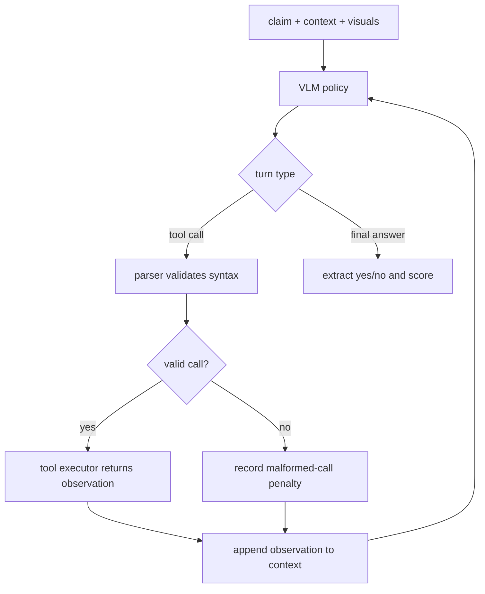

# ToolSciVer：把科学论文图表变成可验证证据的视觉工具强化学习

### 元信息与 TL;DR

| 项目 | 内容 |
| --- | --- |
| 论文 | ToolSciVer: Multimodal Scientific Claim Verification with Visual Tool Augmented Reinforcement Learning |
| arXiv | https://arxiv.org/abs/2607.16131 |
| HTML | https://arxiv.org/html/2607.16131 |
| 代码 | https://github.com/psunlpgroup/Tool-Sciver |
| 日期 | arXiv v1 于 2026-07-17 17:11:50 UTC 提交，本轮按当前周内容采集 |
| 方向 | 大模型后训练 / 多模态工具使用 / 科学 claim verification |

**TL;DR**

- **这篇论文做什么**：ToolSciVer 研究多模态科学声明验证。输入不是普通图片问答，而是一个科学 claim、论文里的图表或多面板 figure、caption 与上下文；模型要判断 claim 是否被证据支持。
- **核心问题**：现有 VLM 往往不是完全不会推理，而是在观察阶段就错了：找不到关键图表区域、读不准表格行列、无法把 chart 数值或局部图像变成可比较证据。
- **方法怎么做**：作者把视觉证据获取做成三类 type-aware tools：`focus_row/focus_column` 读取表格局部，`parse_content` 把 chart/plot 解析成结构化文本，`image_zoom_in` 放大普通 scientific figure 的关键区域。
- **训练机制**：模型用 GRPO 学会是否调用工具、调用哪一类工具、参数怎么填，以及何时停止并输出 yes/no；奖励由答案正确性、格式有效性、长度控制、工具效率和工具交互失败惩罚组成。
- **实验设置**：训练集混合 SciVer 2,000 条与 MuSciClaims 1,010 条，共 3,010 条；测试集共 2,505 条，其中 SciVer 2,000 条、MuSciClaims 505 条。
- **关键数字**：在 Qwen3.5-4B 上，ToolSciVer 的 SciVer overall 为 78.70，高于 non-tool CoT 的 76.35；MuSciClaims overall 为 78.61，高于 non-tool CoT 的 60.99。
- **更强证据**：在 InternVL3.5-4B 上，ToolSciVer 的 MuSciClaims overall 为 64.36，高于 prompt-only tool 的 51.09；说明“给工具”不等于“会用工具”。
- **局限**：评测是 closed-context，不允许开放检索；工具依赖预先 OCR、chart parsing 和裁剪接口；任务标签是二分类 yes/no，不能直接推出开放科学问答或真实实验复核已经可靠。

### 1. 研究问题：科学 claim verification 的错误到底发生在哪一层？

这篇论文的切入点不是“多模态模型能否看图”，而是更细的证据链问题：

1. 一个 claim 可能只被表格中的一行、一列或一个指标值支持。
2. 一个 chart 的支持关系可能来自趋势、相对排序、阈值或具体数值。
3. 一个多面板 figure 的关键证据可能只在局部区域。
4. 文本 caption 可能不足以判断 claim，需要把视觉证据转换为可推理的中间表示。

因此，作者把 MSCV 拆成两个阶段：

| 阶段 | 模型要做的事 | 常见失败 | ToolSciVer 的处理 |
| --- | --- | --- | --- |
| 证据获取 | 找到并读出 claim-relevant visual evidence | 看完整图却漏掉关键行列、趋势或局部 | 使用表格、chart、局部放大三类工具 |
| 证据整合 | 把观察结果与 claim 对齐 | 有工具输出但没有用于最终判断 | 在多轮轨迹里把 tool observation 追加到上下文 |
| 最终判定 | 输出 normalized yes/no | 输出格式不可解析或 reasoning 超长 | 用格式奖励、长度奖励和终止规则约束 |

<u>论文最重要的观点是：科学声明验证里的“看图”不是一个单步感知问题，而是一个 claim-conditioned evidence acquisition 问题。</u>

这和一般 VQA 不同。普通 VQA 可以问“图中有几根柱子”，但科学验证往往问“某方法是否在特定 dataset 上优于 baseline”或“图中趋势是否支持机制解释”。这类问题需要先把图像压缩成证据对象，再做逻辑比较。

### 2. 论文主张与论证路线

| Claim | Mechanism | Evidence | Boundary |
| --- | --- | --- | --- |
| MSCV 的瓶颈在观察阶段 | 把表格、chart、figure 分成不同证据结构 | Table 1 对比显示 ToolSciVer 同时覆盖表格、chart、region inspection 与 structured observation | 不证明所有视觉任务都需要同样工具 |
| Prompt-only tool access 不够 | 模型必须学会何时调用、选哪类工具、如何填参数 | 多个 backbone 上 ToolSciVer 高于 prompt-only tool-use CoT | 工具质量仍受 OCR、chart parser 与裁剪结果限制 |
| GRPO 可以训练选择性工具使用 | 用 group-relative reward 比较同一输入下不同 rollout | Qwen、InternVL、Gemma 三个家族均有增益 | 训练规模较小，只有 MSCV 任务 |
| 工具效率需要显式奖励 | 用 OTC 风格系数偏好正确且少工具的轨迹 | Table 7 显示 OTC 后工具调用数和输出长度下降 | 少工具不是绝对目标，复杂样本仍可能需要多步观察 |
| 类型感知比泛用视觉工具更贴近科学证据 | 表格、chart、figure 分别设计接口 | REAR、routing share、subset accuracy 都支持该方向 | 论文没有证明工具族已经完备 |

这条论证路线有一个清晰的顺序：

1. 先说明 MSCV 需要“视觉证据定位 + 多步推理”。
2. 再指出通用视觉工具大多只做 crop、zoom、OCR 或编辑，不直接面向科学 claim。
3. 接着设计三个窄工具，把观察变成可比较证据。
4. 最后用 GRPO 学出选择性调用策略，而不是靠 prompt 让模型临场猜。

### 3. 任务形式：输入、状态、动作、输出

论文把每个样本表示为一个 claim verification instance：

```text
Input:
  claim c
  visual evidence set V = {v_1, ..., v_k}
  optional textual context x

Policy state:
  original claim/context/visuals
  accumulated tool observations o_1, ..., o_t
  previous tool-call metadata

Action:
  either call exactly one visual tool
  or output a final normalized answer

Output:
  y in {yes, no}
```

这个形式化有两个好处：

- **动作空间窄**：每个 turn 只能是一个工具调用或最终答案，不允许任意开放式 agent 行动。
- **证据链可审计**：工具调用参数、执行状态、失败类型、调用次数和最终答案都能记录到 rollout metadata。

这也是论文和开放 Web Agent 的边界：

- ToolSciVer 的 agentic 部分只发生在证据获取阶段。
- 它没有浏览互联网、写文件、调用外部 API 或执行任意代码。
- 所以它更像“受控工具化 VLM 后训练”，不是通用 autonomous agent。

### 4. 三类视觉工具：为什么要按 evidence type 分开？

| 工具 | 面向对象 | 典型参数 | 返回内容 | 对 claim verification 的意义 |
| --- | --- | --- | --- | --- |
| `focus_row` / `focus_column` | 科学表格 | `image_path`, `row_number` 或 column 参数 | OCR 后的局部行/列文本 | 减少整表噪声，把比较范围缩到指标、方法或数据集 |
| `parse_content` | chart / plot | `image_path` | JSON-like chart elements、axis、series、values | 把趋势、阈值、相对大小变成显式文本证据 |
| `image_zoom_in` | 普通 figure、多面板图、局部机制图 | `image_path`, normalized bbox | 放大后的 crop image | 让模型重看关键区域，而不是被整图低分辨率平均掉 |

这三个工具不是随便拼的。它们分别对应科学视觉证据的三种结构：

1. **表格证据**：claim 常常依赖某一行、某一列或某个交叉单元格。
2. **图表证据**：claim 常常依赖趋势、排序、峰值、阈值或曲线比较。
3. **普通 figure 证据**：claim 常常依赖多面板图中的一个局部标记或结构关系。

作者没有把工具设计成“请描述图片”，原因也很直接：

- 描述会引入多余文本。
- 多余文本会让后续 reasoning 更难做精确比较。
- 科学 claim verification 更需要 claim-facing evidence，而不是泛化 caption。

### 5. Scheduler：工具调用为什么必须被严格约束？

论文和代码仓库都显示，ToolSciVer 的工具交互不是让模型自由输出 JSON。它使用 scheduler 做三件事：

1. 解析模型输出里的工具调用。
2. 验证工具名、参数类型、bbox 范围和最终答案格式。
3. 执行工具并把 observation 追加回下一轮上下文。

可以把流程理解为：



这个 scheduler 是论文能做 RL 的前提：

- 没有解析器，无法稳定判断 tool call 是否有效。
- 没有执行日志，无法给 malformed call 或 failed execution 分配惩罚。
- 没有统一终止格式，最终 accuracy 会被 answer extraction 噪声污染。

### 6. 奖励设计：ToolSciVer 不是只奖励最终答对

论文的奖励可以写成一个组合目标：

```text
R(trajectory) =
  answer_reward
  + format_reward
  + length_reward
  + tool_efficiency_term
  + tool_interaction_penalty
```

其中最值得注意的是 tool-efficiency coefficient。直觉上，它不是简单惩罚所有工具调用，而是在同一 prompt 的 GRPO group 里寻找“答对且工具更少”的轨迹。

```text
For each prompt group:
  S = strict-correct rollouts
  if S is not empty:
    n = min(tool_call_count(r) for r in S)
    reward each correct rollout by closeness(tool_call_count, n)
  else:
    keep conservative base reward
```

变量含义：

- `strict-correct rollout`：答案正确，并且最终答案格式可解析。
- `n`：同组中正确轨迹的最小工具调用数。
- `m`：当前 rollout 的工具调用数。
- `c`：最大工具预算相关常数。

这个设计解决一个实际矛盾：

- 如果只奖励最终正确，模型可能学会“能调就调”，输出长而慢。
- 如果固定惩罚每次工具调用，模型可能在需要证据时也不调工具。
- 组内最优工具预算提供了一个局部参照：同题里已经有人少工具答对，就鼓励其他 rollout 向它靠近。

### 7. GRPO 训练：学的是选择性证据获取策略

ToolSciVer 使用 GRPO，而不是只做 SFT 或 prompt engineering。训练时，同一输入会采样一组 rollout：

1. 有些 rollout 直接回答。
2. 有些 rollout 调表格工具。
3. 有些 rollout 调 chart parser。
4. 有些 rollout 可能调用失败、格式错误或过长。

GRPO 比较这些 rollout 的相对奖励，让高奖励轨迹更可能出现。这里学到的不是“看到图就调工具”，而是四个条件判断：

- **need**：原始输入是否足够？
- **route**：视觉证据是 table、chart 还是 general figure？
- **argument**：该选哪一行、哪一列、哪个 bbox？
- **stop**：工具 observation 已经足够时，是否及时输出答案？

这解释了为什么论文反复比较 prompt-only tool use。prompt-only 也能看到同样工具接口，但它没有被奖励塑形过的调用策略，容易出现两类错误：

- 明明需要精确证据，却直接用整图直觉判断。
- 明明证据已经足够，却继续调用工具或输出不可解析内容。

### 8. 实验设置：数据、模型、baseline 和评测协议

| 维度 | 设置 |
| --- | --- |
| 数据集 | SciVer 与 MuSciClaims |
| 训练规模 | SciVer 2,000 条 + MuSciClaims 1,010 条，共 3,010 条 |
| 测试规模 | SciVer 2,000 条 + MuSciClaims 505 条，共 2,505 条 |
| 任务形式 | 二分类 yes/no scientific claim verification |
| 开源 backbone | Qwen3.5-4B、Qwen3.5-9B、InternVL3.5-4B、InternVL3.5-8B、Gemma4-E4B |
| baseline | non-tool CoT、prompt-only tool-use CoT、dataset-adapted VTool-R1、dataset-adapted OpenThinkIMG |
| 外部参考 | GPT-4o、GPT-5.4、Claude Sonnet 4.6 的 non-tool CoT |
| 评测限制 | closed-context，只用 benchmark 提供的 claim、visual input、caption 与 text context |

closed-context 很关键：

- 它避免把开放检索能力混进结果。
- 它让工具增益更能归因到视觉证据获取。
- 但它也意味着论文没有测试真实科学事实核查里最困难的检索、版本、引用链和跨论文冲突。

### 9. 主结果：增益主要出现在需要视觉证据的地方

论文最直观的结果来自 main table。下面列几个对理解方法最有帮助的数字：

| Backbone | 方法 | SciVer overall | MuSciClaims overall | 解读 |
| --- | --- | ---: | ---: | --- |
| Qwen3.5-4B | Non-tool CoT | 76.35 | 60.99 | 直接看图推理，MuSciClaims 上短板明显 |
| Qwen3.5-4B | Prompt-only tool CoT | 76.95 | 73.47 | 给工具已经有明显帮助 |
| Qwen3.5-4B | ToolSciVer | 78.70 | 78.61 | 训练后的选择性工具使用继续提升 |
| InternVL3.5-4B | Prompt-only tool CoT | 76.30 | 51.09 | 工具可见但不会稳定调度 |
| InternVL3.5-4B | ToolSciVer | 79.35 | 64.36 | 说明训练策略而非工具本身贡献很大 |

这些数字支持一个更细的判断：

- SciVer 的增益相对温和，因为部分样本可能可以从 caption/context 和整图中直接判断。
- MuSciClaims 的增益更大，因为它更偏 figure-centric，视觉证据定位更像瓶颈。
- 训练后工具策略不是只对某个模型有效，Qwen、InternVL、Gemma 家族都有提升。

但数字也有边界：

- proprietary models 只是 non-tool 外部参考，不是同条件 tool-training baseline。
- 各 benchmark 的 domain/subset 分布不同，所以 overall 是 sample-weighted。
- 论文没有把工具训练后的模型放进开放科学检索系统里端到端评测。

### 10. 证据获取质量：REAR 为什么比 accuracy 更能解释机制？

论文还使用 Relevant Evidence Acquisition Rate，简称 REAR，衡量工具 observation 是否真的抓到了 claim-relevant evidence。

可以把它理解为：

```text
REAR =
  count(tool observations judged relevant to the claim)
  / count(samples where visual evidence acquisition is needed)
```

这个指标比最终 accuracy 更接近机制层，因为它区分了两种情况：

| 情况 | Accuracy 可能怎样 | REAR 能看到什么 |
| --- | --- | --- |
| 模型蒙对 | 可能为正确 | 没有获取相关证据 |
| 模型调错工具但推理凑对 | 可能为正确 | 路由或参数失败 |
| 模型拿到证据但最终判断错 | 可能为错误 | 观察阶段成功，推理阶段失败 |
| 模型拿到证据并答对 | 正确 | 观察与推理都成功 |

这对后训练很重要。只看最终 yes/no，会把观察错误、工具错误、推理错误混在一起；REAR 让作者能说明 ToolSciVer 的增益至少部分来自“更会拿证据”，而不是只学会了某个答案 prior。

### 11. 工具路由：type-aware 的价值在哪里？

论文的工具路由分析关注模型是否把视觉类型和工具族匹配起来：

- 表格样本应更多使用 `focus_row` 或 `focus_column`。
- chart/plot 样本应更多使用 `parse_content`。
- 普通 figure 或多面板图应更多使用 `image_zoom_in`。

这个分析对应一个关键设计判断：

| 泛用视觉工具路线 | Type-aware tool 路线 |
| --- | --- |
| 让模型自己决定如何 crop、OCR、描述 | 先承认科学视觉对象有结构类型 |
| 工具输出可能很开放 | 工具输出尽量是 claim-facing evidence |
| 适合通用 VQA | 更适合 scientific verification |
| 路由错误难诊断 | 可以按 table/chart/figure 统计路由 share |

如果只看最终 accuracy，读者会以为论文只是“多加了几个视觉工具”。但路由分析说明，真正重要的是工具族与证据类型之间的对应关系。

### 12. 消融：工具效率奖励为什么不是装饰项？

论文的 Table 7 讨论了 tool-interaction penalty / OTC reward 的训练动态。作者关注三个可观察量：

1. Accuracy 是否下降。
2. 平均工具调用数是否下降。
3. 平均响应长度是否下降。

这个消融的意义在于：

- 一个 claim verifier 不能只追求最高准确率而无限调用工具。
- 现实系统里，工具调用意味着延迟、成本、失败面和可攻击面。
- 如果奖励设计能在保持性能的同时减少无效调用，就说明模型学到的是 selective use。

我更看重这里的研究含义：

- 工具调用本身不是能力。
- **知道什么时候不用工具**也是后训练目标的一部分。
- 对 agentic RL 来说，成本感知不应该只在部署层做 rate limit，而应进入训练信号。

### 13. Figure/Table 证据逐项解读

| 图表 | 支持的结论 | 不能证明什么 |
| --- | --- | --- |
| Figure 1 | 展示 claim、visual evidence、tool calls、observations 和 final answer 的闭环 | 只是框架图，不证明每个模块都有独立贡献 |
| Table 1 | 对比代表性方法，突出 ToolSciVer 同时覆盖 table、chart、region inspection、structured observation、RL reward | 表格是方法属性对比，不是实验结果 |
| Main results table | 多个 backbone 和两个 benchmark 上 ToolSciVer 超过 prompt-only 与 RL-based tool baselines | 不证明开放检索环境或更大模型中同等增益 |
| REAR / routing / efficiency tables | 解释准确率提升来自证据获取、工具选择和调用效率变化 | 仍依赖作者的相关证据判定和 benchmark 切分 |
| Appendix split tables | 说明训练 3,010 条、测试 2,505 条，以及 overall 为什么要 sample-weighted | 不说明数据是否覆盖全部科学领域 |

这篇论文的图表证据比较完整，但要注意证据层级：

- 方法图解释机制。
- 属性表解释和 prior tool-use work 的差异。
- 主结果表证明 controlled benchmark 上有效。
- 诊断表解释可能的因果路径。
- appendix 表说明实验分布和评测协议。

### 14. 代码仓库：可复现性看到哪里？

官方仓库提供了训练与评测代码，目录划分比较贴合论文：

| 路径 | 作用 |
| --- | --- |
| `vlm_sciver/data.py` | benchmark 到 GRPO 训练 JSONL 的转换与 prompt 处理 |
| `vlm_sciver/parser.py` | 工具调用解析与格式校验 |
| `vlm_sciver/executor.py` | 表格、chart、zoom 三类工具执行 |
| `vlm_sciver/ms_swift_plugin.py` | scheduler、rollout metadata、GRPO reward 接入 |
| `vlm_sciver/inference.py` | 多轮工具增强推理 |
| `vlm_sciver/metrics.py` | 二分类 accuracy 评测 |
| `scripts/train.sh` | Qwen3.5-4B 代表性训练入口 |
| `scripts/evaluate.sh` | 端到端评测入口 |

仓库 README 给出的 reference environment 也说明复现并不轻：

- Python 3.11
- CUDA 12.8
- PyTorch 2.10.0
- vLLM 0.17.1
- vendored `ms-swift` 4.2.0.dev0
- 训练示例使用一个 rollout GPU 和两个训练 GPU

这里有两个复现边界：

1. 代码开源不等于数据和预处理产物都能一键获得。
2. 表格和 chart 工具依赖外部 extraction results，README 要求分别提供 table 与 chart extraction JSONL。

### 15. 失败案例应该怎么理解？

论文没有把失败案例写成一个单独的大故事，但从方法和诊断指标可以推断出主要失败类型：

| 失败类型 | 发生位置 | 可能后果 | 对后训练的启示 |
| --- | --- | --- | --- |
| 证据定位失败 | 工具选择或参数阶段 | 找不到关键行列、曲线或局部区域 | 需要 REAR 和 routing 指标，而不只看 accuracy |
| 工具执行失败 | scheduler / executor | 返回错误 observation 或进入无效 turn | malformed call 和 execution failure 要有 dense penalty |
| 证据整合失败 | reasoning 阶段 | 拿到证据但判断 yes/no 错误 | 工具训练不能替代多步逻辑推理 |
| 过度调用工具 | 行动策略阶段 | 成本、延迟、上下文噪声上升 | OTC 奖励要鼓励正确且简洁的轨迹 |
| 格式不可解析 | 终止阶段 | 正确 reasoning 也无法计分 | final answer format 必须纳入奖励 |

这些失败类型让 ToolSciVer 的价值更清楚：

- 它不是声称工具能解决所有科学推理。
- 它是在把失败面拆开，让观察、执行、推理、终止分别可训练、可记录、可诊断。

### 16. 相关工作位置：它和 ReAct、VTool-R1、OpenThinkIMG 的区别

论文把自己放在三条线的交叉处：

| 研究线 | 代表方向 | ToolSciVer 的差异 |
| --- | --- | --- |
| 文本/科学事实核查 | SciFact、SciTab、多模态 fact verification | 更关注视觉证据获取，而不是只检索文本证据 |
| 通用视觉工具使用 | VisProg、ViperGPT、MM-ReAct、Visual Sketchpad | 工具不是通用编辑或程序接口，而是科学证据接口 |
| RL 训练视觉工具模型 | VTool-R1、OpenThinkIMG | 任务专门化到 MSCV，奖励包含格式、效率和工具错误惩罚 |

这说明论文的贡献不是单点 SOTA，而是一个组合命题：

- claim verification 需要 evidence-facing tools；
- tools 需要 type awareness；
- tool use 需要 RL 学习；
- RL 奖励必须包括效率和交互有效性。

### 17. 证据边界与局限

这篇论文最容易被误读成“VLM 用工具就能可靠验证科学论文”。这个说法太强，论文证据还到不了那里。

更准确的边界是：

1. **任务边界**：二分类 yes/no，不覆盖开放式解释、证据冲突调解或事实更新。
2. **上下文边界**：closed-context，不允许开放 Web 或跨论文检索。
3. **工具边界**：工具是预定义的，表格 OCR、chart parsing、crop quality 都会影响上限。
4. **数据边界**：训练 3,010 条、测试 2,505 条，规模适合机制验证，但不足以覆盖全部科学图表生态。
5. **模型边界**：实验集中在开源 VLM backbone；proprietary models 只是 non-tool reference，不是同样训练后的可比系统。
6. **安全边界**：论文没有讨论 adversarial figures、恶意 chart、prompt injection in captions 或 tool observation poisoning。

这些局限不削弱论文主张，反而帮助定位它：

- 它证明的是“在受控 MSCV benchmark 中，类型感知工具 + GRPO 能改进证据获取与验证”。
- 它没有证明“自动科学事实核查系统已经可上线替代人工复核”。

### 18. 对后训练和 Agent 研究的延伸思考

我认为 ToolSciVer 对后训练和 Agent 研究有三个值得继续追问的点。

**第一，工具调用奖励应该从 success-only 走向 evidence-quality。**

- 许多 agentic RL 只奖励任务完成。
- ToolSciVer 把 evidence acquisition 单独诊断出来。
- 这提示我们：工具轨迹质量不只看最终答对，还要看中间 observation 是否相关、可比较、可复用。

**第二，工具接口应该贴近任务证据结构，而不是贴近工程 API 形状。**

- 科学图表需要 row、column、series、bbox。
- 代码 agent 可能需要 stack trace、test diff、symbol graph。
- Web agent 可能需要 DOM role、state transition、citation span。

如果接口只暴露“截图”“文本”“搜索结果”，模型会把太多结构化工作塞进隐式 reasoning，训练信号也更难定位。

**第三，效率奖励其实是安全奖励的一部分。**

- 少调用工具意味着更小攻击面。
- 更短输出意味着更少无关上下文污染。
- 格式和 scheduler 约束意味着更容易审计和复现。

对 AI 安全来说，ToolSciVer 的启发不是“再加一个视觉工具”，而是：

```text
agent safety = controlled action space
             + typed tool interface
             + execution metadata
             + reward on validity and efficiency
             + diagnosis beyond final success
```

**第四，科学类 Agent 的核心日志不应只保存最终答案。**

- 如果只保存 yes/no，研究者无法区分“模型真的读到了证据”和“模型碰巧猜对”。
- 如果只保存完整 chain，又会引入隐私、版权、长度和不可验证推理的问题。
- ToolSciVer 更值得借鉴的是中间层日志：工具名、参数、成功状态、返回 observation、调用次数、失败类型和最终格式。

这类日志有三个用途：

| 用途 | 需要记录什么 | 对训练或审计的意义 |
| --- | --- | --- |
| 错误归因 | 调错工具、参数越界、执行失败、证据无关 | 把错分到观察、行动、推理或终止环节 |
| 奖励塑形 | 工具次数、严格正确轨迹、response length | 让奖励关注最小必要行动，而不是盲目鼓励工具调用 |
| 安全审计 | observation 来源、执行错误、异常长轨迹 | 发现恶意图表、工具污染或格式逃逸的早期信号 |

这也给后续工作留下一个很现实的问题：

- 什么时候应该让模型继续调用工具？
- 什么时候应该因为证据不足而拒绝判断？
- 什么时候工具 observation 本身需要被二次验证？

ToolSciVer 目前选择的是二分类 verification，因此缺少“证据不足”这个第三种终止状态。未来如果把它放进真实科学助手，输出空间可能需要从 `{yes, no}` 扩成 `{support, refute, insufficient evidence, tool failure}`。这样做会让任务更难，但也更接近科学复核的真实工作流。

### 结论

ToolSciVer 的贡献可以概括为一句话：

> 它把多模态科学声明验证从“让 VLM 看图回答”改写成“让 VLM 学会按证据类型获取局部视觉证据，再在受控 scheduler 中完成验证”。

这篇论文的实验还不够大，工具也不够开放，但它把一个关键研究方向讲清楚了：

- 后训练不应该只教模型得出正确答案。
- Agentic tool use 不应该只统计工具调用成功。
- 对科学、代码、安全这类高风险任务，真正值得训练和评测的是“模型是否拿到了能支撑结论的证据，以及是否用最小必要行动完成判断”。
