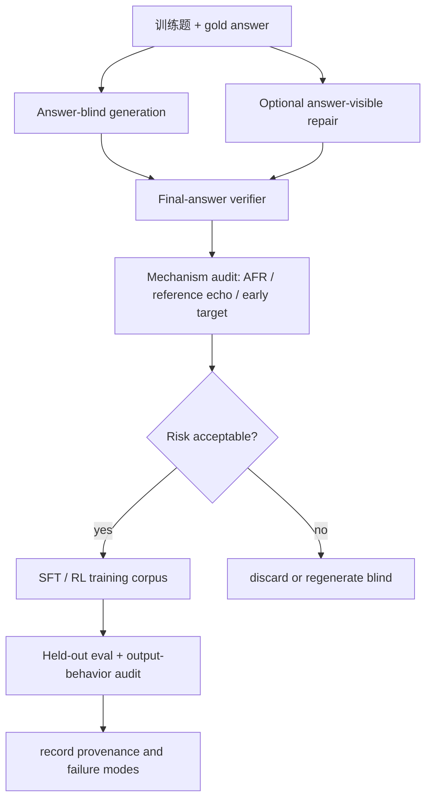

# Answer Leakage：为什么“先给答案再写推理”会伤害可验证推理蒸馏

| 项目 | 内容 |
| --- | --- |
| 论文 | Answer-Conditioned Chains of Thought Degrade Verifiable-Reasoning Distillation in Large Language Models |
| arXiv | https://arxiv.org/abs/2607.14552 |
| HTML 全文 | https://arxiv.org/html/2607.14552 |
| 代码 | https://github.com/js-lee-AI/answer-leakage |
| 版本日期 | arXiv v1，2026-07-16 04:28:19 UTC；代码仓库 2026-07-16 发布 one-bit experiment code |
| 领域 | 大模型后训练 / reasoning distillation / chain-of-thought data quality |

### TL;DR

- **这篇论文做什么**：它研究可验证推理蒸馏里的一个常见捷径：当教师模型答不出来时，把 gold answer 直接展示给教师，让它补一条能到达该答案的 chain-of-thought。作者称这种数据生成方式为 **answer-conditioned / leaked**，并问它是否真的等价于“正确推理”。
- **方法怎么做**：论文设计 **one-bit experiment**：同一个 Qwen3-8B 生成器、同一批 935 个数学训练题、同一个正确性过滤器、同一个 SFT recipe；唯一变化是生成 chain 时是否能看到 gold answer。两条路径都只保留最终答案正确的样本，再分别训练学生模型。
- **核心证据**：在 Qwen3-8B 上，answer-blind 学生 MATH-500 三种子均值为 **95.1**，几乎等于 base model 的 **95.2**；answer-leaked 学生降到 **78.9**，差 **16.2** 点。难题上损失更大：AIME 2024-2025 从 **71.7** 降到 **44.4**，差 **27.2** 点。
- **机制解释**：伤害不是“答案可见”本身，而是模型在可见答案时更容易先说答案再倒推。论文定义 **answer-first rate, AFR**：gold answer 第一次出现在 reasoning 前 20% 内的比例。Qwen3-8B 的 leaked corpus 比 blind corpus 的 AFR 高 **20.8** 点。
- **消融与定位**：固定答案可见但改 prompt 时，derive-first instruction 把 MATH-500 penalty 从 **16.2** 降到 **4.3**；final-check 和 out-of-band prompt 进一步降到 **1.3** 与 **0.7**。在 carrier split 里，Leaked-Early 比对应 blind 低 **29.8** 点；只删掉首次说出答案的那一行，能恢复 **24.6/29.8** 点，约 **83%** 的 gap。
- **可预测性**：论文用 `dAFR = AFR_leaked - AFR_blind` 在微调前筛教师。8 个 thinking models、4 个模型家族上，`dAFR` 与最终 leakage penalty 的相关系数报告为 **r = 0.960**；Llama-Nemotron-8B 作为第三家族 held-out，预测损失 **17.4** 点，实测 **17.6** 点。
- **外推边界**：损失在数学、代码、跨教师家族和小学生模型上成立，但在 MMLU、GPQA-Diamond 这类多选知识题上消失或落入噪声。论文自己的局限是：主实验只有 935 个 matched math problems，跨模型拟合只有 8 个模型，若任务不需要多步生成式推导，机制不应直接外推。
- **实践结论**：<u>可验证最终答案不能证明 reasoning trace 是好训练数据</u>。后训练 pipeline 应优先 answer-blind 生成；必须展示答案时，至少要求先独立推导、最后才检查答案，并在训练前用 AFR / dAFR 这类机制指标筛查教师。

### 1. 论文真正要隔离的问题是什么？

许多 reasoning distillation 流程都有一个直觉：

1. 让教师模型为训练题生成 chain-of-thought。
2. 用 symbolic verifier 或 unit tests 检查最终答案。
3. 只保留最终答案正确的 trace。
4. 用这些 trace 对学生模型做 supervised fine-tuning。

这个流程在数学、代码、工具调用任务里很诱人，因为 verifier 给了一个便宜标签：

| 流程环节 | 看起来可靠的原因 | 论文指出的盲点 |
| --- | --- | --- |
| 最终答案正确 | 数学可用 symbolic checker，代码可用 tests | verifier 只看终点，不看推理是正向推出还是倒推包装 |
| 答不出时给答案 | 能救回原本丢弃的题，扩大 SFT 数据 | gold answer 会改变教师写 chain 的条件分布 |
| 只训练学生看问题 | 学生输入里没有泄露答案 | 学生仍会学习“先锚定答案再补理由”的行为模式 |
| 长 trace 看似丰富 | CoT token 很多，细节也多 | 早说答案会压缩真实 search，使 trace 的学习信号变坏 |

论文要隔离的是一个因果量：

```text
在 generator、problem set、correctness filter、matched examples、SFT recipe 都固定时，
只改变“生成 chain 时是否看到 gold answer”，学生最终准确率会损失多少？
```

作者把这个损失称为 **answer-leakage penalty**。

它不是在说：

- 所有 chain-of-thought 都不能用于训练；
- 所有 STaR 或 hindsight refinement 都必然失败；
- 所有看到答案的生成都同样有害；
- 最终答案 verifier 没有价值。

它真正指出的是：

<u>如果 correctness filter 只验证最终答案，answer-conditioned chain 会带来一种过滤器不可见的数据污染。</u>

### 2. Figure 1：one-bit experiment 的因果设计


这张图的作用不是装饰，而是说明“只差一位”的实验控制。

| 控制项 | Blind arm | Leaked arm | 为什么重要 |
| --- | --- | --- | --- |
| 生成器 | 同一个 Qwen3-8B | 同一个 Qwen3-8B | 排除教师能力差异 |
| 训练题 | 同一批 Nemotron-Cascade-SFT-Stage-2 math split 题 | 同一批题 | 排除题目难度差异 |
| 生成条件 | 只给问题，要求推导答案 | 给问题与 gold answer，要求到达答案 | 这是唯一干预位 |
| 过滤器 | 只保留最终 boxed answer 正确的 chain | 同样只保留最终答案正确的 chain | 排除“错误答案样本污染” |
| matched set | 两边都成功的 935 题 | 同样 935 题 | 排除样本集合不同 |
| 学生训练 | question → blind chain | question → leaked chain | 学生输入都不含答案 |
| SFT recipe | 同一 recipe | 同一 recipe | 排除训练配置差异 |

实验定义可以写成：

```text
Delta = acc(S_blind) - acc(S_leaked)

其中：
S_blind  = 在 answer-blind correct chains 上训练的学生
S_leaked = 在 answer-conditioned correct chains 上训练的学生
```

这里的关键不是 `Delta` 这个公式复杂，而是它把“答案泄露”从很多混杂因素里分离出来。

如果 leaked chain 只是“另一种正确解释”，那么：

- 两个学生应接近；
- 或 leaked arm 至少不应大幅低于 blind；
- 难题上的 gap 不应系统性放大；
- fixed visibility 的 prompt 消融不应显著改变 penalty。

论文的结果恰好相反。

### 3. 主结果：正确答案过滤不了错误的推理习惯

主实验全部是 full-parameter SFT：

| 设置 | 细节 |
| --- | --- |
| 训练模型 | Qwen3-8B full-parameter SFT |
| 训练题 | 935 个 matched math problems |
| 训练轮数 | 1 epoch |
| 序列长度 | 10,240 |
| 学习率 | 2e-5 |
| 有效 batch size | 48 |
| 分布式配置 | DeepSpeed ZeRO-3 |
| 生成采样 | temperature 0.6, top-p 0.95, top-k 20 |
| 评测 | vLLM thinking mode，MATH-500 用 32,768-token budget |
| 正确性 | symbolic answer matching |

Table 1 的核心数字如下：

| Benchmark / setting | Blind | Leaked | Penalty |
| --- | ---: | ---: | ---: |
| MATH-500 | 95.1 | 78.9 | 16.2 |
| GSM8K | 95.4 | 90.5 | 4.9 |
| Minerva | 48.7 | 38.5 | 10.2 |
| AIME 2024-2025 | 71.7 | 44.4 | 27.2 |
| MATH-500 Level 1 | 95.3 | 95.3 | 0.0 |
| MATH-500 Level 2 | 98.1 | 84.1 | 14.1 |
| MATH-500 Level 3 | 98.4 | 83.5 | 14.9 |
| MATH-500 Level 4 | 95.6 | 74.2 | 21.4 |
| MATH-500 Level 5 | 89.8 | 70.9 | 18.9 |

这些数字支持三个判断：

1. **不是 SFT 本身伤模型**  
   Blind 学生是 95.1，base harness 是 95.2，二者在 seed noise 内。损失主要来自 leaked data，而不是“做了一次 SFT”。

2. **损失随推理难度放大**  
   GSM8K 的 penalty 是 4.9；AIME 达 27.2。越需要真正多步推导，倒推式 trace 越可能误导学生。

3. **正确性过滤没有发现问题**  
   两边都通过最终答案过滤，但 filtered-correct 不等于 reasoning-correct。论文要反驳的正是“只要最终答案对，trace 就能安全训练”这个假设。

### 4. Claim → Mechanism → Evidence → Boundary

| Claim | Mechanism | Evidence | Boundary |
| --- | --- | --- | --- |
| Answer-conditioned CoT 是一种数据污染 | gold answer 改变教师生成分布，让 trace 更像 rationalization | MATH-500 penalty 16.2，AIME penalty 27.2 | 主实验是 Qwen3 系列数学题，不证明所有任务都同样受害 |
| 伤害主要来自“先说答案” | 模型把答案提前放进 reasoning，再补中间理由 | `AFR_leaked - AFR_blind = +20.8`；Leaked-Early 损失 29.8 | AFR 是可测症状，不是完整机制解释 |
| 答案可见本身不是唯一原因 | 固定 visibility，只改变 instruction | derive-first penalty 4.3，final-check 1.3，out-of-band 0.7 | prompt 能缓解，但不能保证所有教师都安全 |
| 训练数据会把习惯迁移到学生输出 | 学生测试时没看到答案，却学会更早说答案、更晚结束或不结束 | 学生输出 AFR：Blind 36.5，Leaked 48.7；无答案输出率 0.4 vs 7.4 | 输出行为分析仍在 MATH-500 solve prompt 下 |
| 可在微调前筛教师 | `dAFR` 用 unlabeled generations 估计 rationalization tendency | 8 模型 4 家族，`r = 0.960`；held-out Nemotron 预测 17.4、实测 17.6 | 8 个模型样本很小，相关不等于精确预测律 |

这个表说明论文的论证路线：

- 先用 one-bit experiment 定义因果量；
- 再用 answer-first mechanism 解释损失；
- 再用 prompt 消融和 carrier split 定位伤害来源；
- 最后用跨模型 `dAFR` 说明它可被提前筛查。

### 5. 机制变量：AFR 如何测量“倒推式推理”

论文定义的链级属性很简单：

```text
pos(c) = gold answer 第一次出现在 chain c 的 reasoning 内的相对位置

AFR(C) = (1 / |C|) * sum_{c in C} 1[pos(c) < 0.2]
```

变量解释：

| 变量 | 含义 | 为什么有用 |
| --- | --- | --- |
| `c` | 一条 reasoning chain | 评测单位不是模型，而是训练样本 |
| `pos(c)` | gold answer 首次出现的位置，归一化到 0 到 1 | 区分先给答案和后推出答案 |
| `0.2` | 前 20% reasoning 区间 | 论文用它定义 answer-first |
| `AFR(C)` | 一个 corpus 中 answer-first chain 的比例 | 衡量 corpus 是否更像 rationalization 数据 |
| `dAFR` | `AFR_leaked - AFR_blind` | 微调前筛教师的 signature |

Figure 2 展示了这个机制：


论文报告的 matched chain 统计很关键：

| 指标 | Blind | Leaked | 解读 |
| --- | ---: | ---: | --- |
| Median first-answer position | 0.587 | 0.297 | leaked 更早提到答案 |
| Answer within first 5% | 13.3 | 41.9 | 很多 leaked trace 几乎开头就锚定答案 |
| Median think-block length | 24.7K chars | 18.2K chars | leaked 训练 trace 更短 |
| Median first mention | 12.2K chars | 4.5K chars | 答案首次出现提前很多 |
| Within 1K chars | 12.2 | 42.0 | 绝对字符前缀也显示同一趋势 |
| Within 8K chars | 38.3 | 59.0 | 不是相对长度归一化造成的错觉 |

这解释了为什么最终答案过滤会失效：

1. filter 看到的是最后 boxed answer；
2. leaked chain 可以从 gold answer 向前包装；
3. 包装 trace 仍能在末尾输出正确答案；
4. 学生训练时只看到“问题 → 这条 trace”；
5. 学生学到的是 trace 的条件分布，包括早锚定答案的坏习惯。

### 6. 伪代码：后训练 pipeline 应该怎样读这篇论文

下面不是论文原算法，而是把 one-bit experiment 翻成训练数据审计流程：

```text
Input:
  problems Q with gold answers A
  candidate teacher model M
  correctness verifier V
  threshold tau = 0.2

State:
  blind_chains = []
  leaked_chains = []
  matched_ids = []

For each problem q in Q:
  c_blind  = sample(M, prompt = solve(q))
  c_leaked = sample(M, prompt = solve_with_answer(q, A[q]))

  if V(final_answer(c_blind), A[q]) and V(final_answer(c_leaked), A[q]):
    add q to matched_ids
    add c_blind to blind_chains
    add c_leaked to leaked_chains

Compute:
  AFR_blind  = mean(first_answer_position(c) < tau for c in blind_chains)
  AFR_leaked = mean(first_answer_position(c) < tau for c in leaked_chains)
  dAFR = AFR_leaked - AFR_blind

Decision:
  if dAFR is large:
    reject answer-conditioned chains for SFT
  else:
    still prefer answer-blind generation and validate downstream accuracy

Output:
  selected training corpus
  dAFR audit record
  held-out evaluation plan

Failure boundary:
  V only checks final answers;
  AFR cannot detect all forms of unfaithful reasoning;
  multiple-choice tasks may not expose this mechanism.
```

这个流程的重点是：

- 不要把 verifier 当作唯一 gate；
- 不要等两次 expensive fine-tune 后才发现 teacher 有问题；
- 先用生成样本的结构特征筛教师；
- 再用 held-out evaluation 验证训练收益。

### 7. 消融：答案可见、prompt 指令、答案提前三件事要分开

Table 1A 固定“答案可见”，只改指令：

| Instruction arm | Blind reference | Leaked / answer-visible | Penalty |
| --- | ---: | ---: | ---: |
| Rationalize toward answer | 95.1 | 78.9 | 16.2 |
| Derive-first | 95.1 | 90.7 | 4.3 |
| Final-check | 95.1 | 93.7 | 1.3 |
| Out-of-band | 95.1 | 94.3 | 0.7 |

这个消融有两个含义：

1. **答案可见不是充分条件**  
   如果 prompt 明确要求先独立推导，损失显著下降。

2. **rationalize instruction 是主要风险**  
   “请根据这个答案写一条到达它的推理”会诱导模型把答案当目标锚点，而不是当最后检查项。

论文还做了 carrier split：

| Carrier group | Accuracy pattern | 解释 |
| --- | --- | --- |
| Leaked-Early | 对应损失 29.8 | 最早说答案的 leaked chains 承载大部分坏信号 |
| Leaked-Late | 对应损失 8.6 | 后说答案仍有损失，但小很多 |
| Difference-in-differences | +16.9 | 早锚定答案不是旁观相关项 |
| 删除首次答案行 | 恢复 24.6 / 29.8 点 | 单条 answer-stating line 解释约 83% gap |

这组证据很强，因为它不是只比较两个 corpus 的均值，而是继续追问：

- 损失是否集中在 answer-first 子群？
- 删除一小段文本是否能恢复模型？
- 长度控制后是否还存在同向损失？

论文的回答是：

<u>伤害不是因为 leaked chain 更短，而是因为它早早暴露了目标答案并围绕它组织推理。</u>

### 8. 学生模型学到了什么坏习惯？

如果 leaked data 只是训练时的样本形态问题，学生测试时未必会表现出同样习惯。

论文检查学生自己的 MATH-500 输出：

| Student output AFR | All | Correct-only |
| --- | ---: | ---: |
| Base, no SFT | 38.7 | 37.1 |
| Blind-trained | 36.5 | 35.8 |
| Leaked-trained | 48.7 | 45.2 |
| Leaked minus blind | +12.2 | +9.4 |

这个结果说明：

- 学生测试时并没有看到 gold answer；
- 但 leaked-trained 学生仍更早说出答案；
- answer-first habit 从训练 chain 迁移到了模型自己的生成策略；
- 即使只看答对的输出，差异仍存在。

论文还区分了两类失败：

| 失败类型 | 描述 | 论文证据 |
| --- | --- | --- |
| Derivation deficit | 学生完成了答案，但推导质量下降，导致答错 | Qwen3-8B 上，双方都有可抽取答案时 leaked 仍低 9.5 点 |
| Termination deficit | 学生在预算内没有产出可抽取答案 | Qwen3-8B leaked 无答案 7.4/100，blind 为 0.4/100 |

这解释了一个反直觉现象：

- leaked training chains 更短；
- 但 leaked-trained model 测试时反而更长、更容易耗尽预算；
- 因为它学到的是“从答案锚点组织文本”，不是稳定推进到解。

### 9. 跨模型预测：dAFR 为什么比事后准确率更实用

Figure 4 是论文里最有实践价值的图之一：


核心表格如下：

| Model | Base | dAFR | Blind | Leaked | Penalty |
| --- | ---: | ---: | ---: | ---: | ---: |
| Qwen3-8B | 95.2 | +20.8 | 95.1 | 78.9 | 16.2 |
| Qwen3-4B | 96.0 | +26.6 | 94.0 | 64.8 | 29.2 |
| GLM-Z1-9B | 94.4 | +11.1 | 94.8 | 82.6 | 12.2 |
| DS-Qwen-7B | 79.6 | +11.0 | 89.7 | 82.4 | 7.3 |
| DS-Llama-8B | 77.8 | -0.2 | 65.8 | 64.6 | 1.2 |
| Qwen3-1.7B | 92.6 | +26.2 | 89.6 | 59.8 | 29.8 |
| DS-Qwen-14B | 88.2 | +9.3 | 92.2 | 83.4 | 8.8 |
| Nemotron-8B | 95.4 | +17.9 | 92.2 | 74.6 | 17.6 |

作者报告：

- 前四个 thinking models 上拟合，`r = 0.96`；
- 扩展到八个模型后仍报告 `r = 0.960`；
- held-out 预测都落在预测区间内；
- leave-one-family-out 的误差用于检查不是单个家族驱动。

这比“直接微调后看准确率”更有用：

| 做法 | 成本 | 能提前发现什么 |
| --- | --- | --- |
| 直接训练 blind/leaked 两个学生 | 两次 SFT + 完整评测 | 最终 penalty，但已经花掉训练资源 |
| 计算 `dAFR` | 一次小规模生成与匹配 | 教师是否倾向 rationalization |
| 只看最终正确率过滤 | 便宜 | 看不到 answer-first damage |
| 只看 chain 长度 | 便宜 | 不能解释早锚定答案的机制 |

实践上，`dAFR` 不是一个安全证书。

它更像一个早期红旗：

1. 如果 `dAFR` 很高，answer-conditioned traces 应避免进入 SFT。
2. 如果 `dAFR` 接近零，也仍要做 held-out evaluation。
3. 如果任务没有生成式推导，AFR 可能不是合适指标。
4. 如果答案不是可字符串定位的对象，需要定义任务对应的“早锚定”特征。

### 10. 泛化证据：数学之外是否还成立？

论文把 one-bit intervention 推到代码、小学生模型和跨教师家族：

| Setting | Blind | Leaked | Penalty | 意义 |
| --- | ---: | ---: | ---: | --- |
| MBPP+ pass rate | 68.3 | 58.8 | 9.5 | 代码任务也会被 reference-solution leakage 伤害 |
| HumanEval+ pass rate | 72.8 | 63.6 | 9.2 | 不是单一代码集偶然现象 |
| 1.7B student from 8B chains | 85.7 | 78.9 | 6.9 | 伤害跟随 corpus，不只属于教师本身 |
| Nemotron teacher → Qwen3-8B student | 94.0 | 79.2 | 14.8 | 跨模型家族仍有损失 |
| GLM teacher → Qwen3-8B student | 93.0 | 82.8 | 10.2 | 第四模型家族也复现同向 |

代码域的类比很清楚：

- 数学里的 gold answer 是 boxed answer；
- 代码里的 gold answer 是 reference solution；
- verifier 是 tests；
- leaked code chain 更容易在 reasoning 早期 echo reference fragment；
- 通过 tests 仍不代表 reasoning trace 适合训练。

但论文也给出边界：

| 不成立或弱成立的场景 | 结果 | 解释 |
| --- | --- | --- |
| MMLU | leaked 与 blind 差异在噪声内 | 多选题不要求长生成式推导 |
| GPQA-Diamond | leaked 略高或接近 | 选择选项的任务不一定暴露 answer-first 机制 |
| 很弱或特殊教师 | penalty 可接近零 | 如果教师看到答案也不会显著更早说答案，风险较小 |

这很重要，因为它防止把论文结论泛化成口号：

<u>Answer leakage 的危险主要在“需要生成推导过程”的可验证任务里，而不是所有监督数据生成场景。</u>

### 11. 与 STaR、self-training、reward-based RL 的关系

论文的位置可以这样理解：

| 相关路线 | 典型做法 | 本文指出的缺口 |
| --- | --- | --- |
| STaR-style rationalization | 对失败题给答案，让模型补 rationale，再训练 | 失败 rescue 样本可能是负价值数据 |
| Rejection sampling self-training | 采样多条，只保留正确答案 | answer-blind 时更安全，但采样失败时不能用答案硬补 |
| Hindsight refinement | 展示目标答案或反馈，让模型修正 | 修正 trace 可能通过 correctness filter，却训练出坏习惯 |
| RL / GRPO 类后训练 | 用 reward 或 verifier 优化策略 | 目标函数看重终点奖励时，也可能忽视过程分布 |
| Data filtering | 过滤错误答案、格式错、低置信样本 | 需要加入 answer-position / reference-echo 等机制特征 |

论文不是否定自训练。

它给出的更窄建议是：

1. **优先 answer-blind 生成**  
   如果采样预算允许，就让教师自己解题，不给答案。

2. **必须给答案时，避免 rationalize prompt**  
   derive-first、final-check、out-of-band 这类指令能显著减轻损失。

3. **训练前做机制审计**  
   不只看最终正确率，还看答案出现位置、reference echo、长度反转、无答案率。

4. **训练后看行为迁移**  
   学生输出是否更早锚定答案，是否更容易耗尽 budget。

### 12. 复现与代码：这篇论文比普通 arXiv 更容易查账

代码仓库给了五个关键入口：

| 文件 | 作用 |
| --- | --- |
| `src/generate_chains.py` | 生成 nohint / hint / derivefirst / ignore / finalcheck 五类 prompt |
| `src/build_matched.py` | 对两条 arm 做 matched-pair construction，并打印 dAFR |
| `src/answer_match.py` | generation-side symbolic answer checker 与 AFR |
| `src/train_sft.py` | full-parameter SFT 训练脚本 |
| `src/evaluate_math500_vllm.py` | MATH-500 evaluation harness |

仓库 README 给出的主复现路径是：

```text
1. generate_chains.py --condition both
2. build_matched.py 生成 nohint_matched / hint_matched
3. 对两条 matched corpus 用同一 train_sft.py recipe 训练
4. evaluate_math500_vllm.py 评测
5. penalty = accuracy(nohint) - accuracy(hint)
```

复现细节里有几个容易被忽略的约束：

| 约束 | 为什么重要 |
| --- | --- |
| `math_verify` pinned exact version | 它决定哪些 chain 通过 keep-correct filter |
| Qwen gated checkpoints 需要 Hugging Face login | 不是所有环境可直接跑 |
| 8B full-parameter SFT 使用 3x A100-80GB | 复现成本不低 |
| ZeRO-3 不是可随便替换项 | README 指出 ZeRO-2 在该 Qwen3 配置下会发散 |
| MATH-500 评测用 thinking mode | greedy decoding 不能替代论文设置 |
| checkpoint-20 来自 935 examples 与 effective batch 48 | corpus size 改变会改变 step count |

这让论文的证据链比较透明：

- 不是只发了结论；
- 不是只发了 eval 表；
- 还给了 generation、matching、training、evaluation 的命令级结构；
- 但完整复现仍需要昂贵 GPU 和 gated 模型访问。

### 13. Figure / Table 证据逐项解读

| 证据 | 支持什么 | 不能证明什么 |
| --- | --- | --- |
| Figure 1 | one-bit experiment 控制住 generator、filter、recipe、matched set | 不能证明所有模型家族都有同等 penalty |
| Table 1 | leaked correct chains 在数学推理上显著伤害学生 | 不证明非推导任务也会受害 |
| Figure 2 | leaked chains 更早说答案，训练短、测试长，符合 rationalization 机制 | AFR 不是完整 faithfulness 指标 |
| Table 2 | 学生测试输出也继承 answer-first habit | 只覆盖 MATH-500 solve prompt |
| Carrier split | Leaked-Early 是主要伤害载体 | 子群仍可能有其他相关属性 |
| 删除首次答案行 | 单条 answer-stating line 解释 83% gap | 不能说明剩余 17% 的全部来源 |
| Figure 4 / Table 3 | dAFR 能跨模型预测 penalty | 小样本相关，不能当精确定律 |
| Table 5 | 数学之外的代码、跨教师、跨学生也有同向损失 | 代码域长度控制与部分扩展是较小实验 |
| Appendix limitations | 明确 935 题、8 模型、小样本和任务边界 | 仍需要更多开放复现来检验稳定性 |

### 14. 研究边界与我会谨慎对待的地方

这篇论文证据清晰，但也有边界。

| 边界 | 为什么重要 |
| --- | --- |
| 主实验规模是 935 matched math problems | 很适合做因果隔离，但不是海量生产分布 |
| 跨模型 fit 只有 8 个 thinking models | `r = 0.960` 很醒目，但样本数量有限 |
| 部分扩展是单种子或较小控制 | 方向一致强，精确 magnitude 仍需复验 |
| AFR 依赖答案可定位 | 对证明题、开放式规划、长代码补丁，需要设计替代指标 |
| 多选知识题不显示同样机制 | 不能把结论泛化到所有后训练任务 |
| 复现依赖算力与 gated checkpoints | 代码公开不等于低成本完全复现 |
| correctness filter 与 evaluator 版本敏感 | verifier 版本漂移会改变保留样本与得分 |

因此，最稳妥的阅读方式是：

1. 接受 one-bit experiment 对“answer-conditioned rationale 有害”的强证据；
2. 接受 AFR / dAFR 是一个有用机制探针；
3. 不把 dAFR 当作安全证明；
4. 不把数学任务的 penalty 数字直接移植到所有 agent 或代码任务；
5. 在自己的 pipeline 里重新做小样本筛查和 held-out evaluation。

### 15. 对后训练研究的延伸问题

这篇论文最值得带走的不是“别给答案”这一句，而是一个更广的后训练问题：

<u>训练数据的正确性标签和生成过程的因果路径必须同时审计。</u>

后续可以追问：

| 问题 | 研究价值 |
| --- | --- |
| RL 训练里是否存在 reward-conditioned rationalization？ | 如果 rollout reward 只看终点，策略也可能学习 shortcut trace |
| Agent tool-use 任务能否定义 answer-first analogue？ | 例如先写结论再倒造 tool trace、先决定 action 再包装 observation |
| 代码补丁任务里的 reference echo 如何自动检测？ | tests 通过不等于 patch reasoning 可学习 |
| 多轮 self-correction 是否会累积 hindsight leakage？ | 每一轮反馈都可能把答案信息注入训练 trace |
| verifier 是否应输出过程审计信号？ | 从 final-answer checker 扩展到 derivation structure checker |
| 数据配方是否需要记录 generation condition provenance？ | SFT 样本应标注 answer-blind、answer-visible、feedback-visible 等来源 |

一个更适合生产后训练的数据契约可能长这样：



这比“采样、过滤、训练”多了两个环节：

- 训练前的机制审计；
- 训练后的行为迁移审计。

它们的成本远低于把坏数据训练进模型后再定位原因。

### 16. 从数据契约看：哪些字段应该被记录？

如果把这篇论文转成后训练数据治理规则，最直接的变化是：

| 数据字段 | 传统做法 | 更稳妥做法 |
| --- | --- | --- |
| `answer_visibility` | 常常不记录，只保留 final answer 是否正确 | 记录 blind、answer-visible、feedback-visible、tool-visible |
| `generation_instruction` | 只保存最终 trace | 保存 solve、rationalize、derive-first、final-check 等 prompt 类型 |
| `verifier_result` | correct / incorrect | correct 之外还记录 verifier 名称、版本、fallback 规则 |
| `target_position` | 不统计 | 记录答案、reference solution、目标 action 首次出现位置 |
| `mechanism_signature` | 不存在 | 记录 AFR、dAFR、reference-echo、early-target ratio |
| `training_decision` | 通过 filter 就训练 | high-risk trace 先丢弃、重采样或降权 |
| `post_ft_behavior` | 只看准确率 | 还看无答案率、预算耗尽率、早锚定率 |

这个数据契约能防止一个常见误判：

1. 工程侧看到 verifier pass，就认为样本是正样本。
2. 训练侧看到 loss 正常下降，就认为数据可学。
3. 评测侧看到简单题不掉分，就认为 pipeline 没问题。
4. 直到难题、长预算或迁移任务上才发现模型变差。

论文的贡献是把这条失败链往前推：

- 在训练前，`dAFR` 就能提示教师是否会走 rationalization shortcut；
- 在训练中，answer-visible provenance 能让样本不再和 blind chain 混在一起；
- 在训练后，学生输出 AFR 能检查坏习惯是否已经迁移；
- 在发布模型前，difficulty-sliced evaluation 能暴露 Level 4/5、AIME 这类更敏感的区域。

### 17. 失败案例应该怎样想象？

这篇论文没有要求读者相信“所有早说答案都错”。

更准确的失败模式是：

| 失败模式 | 表面现象 | 为什么 verifier 看不见 |
| --- | --- | --- |
| 数学倒推 | trace 很早写出 `x=...`，随后补代数步骤 | 最终 boxed answer 正确，但搜索过程被答案锚定 |
| 代码 echo | reasoning 早期复述 reference solution 的结构或片段 | tests 只检查行为，不检查是否学会解法 |
| Agent plan hindsight | 先决定最终 action，再补 tool-use rationale | environment reward 只看任务是否完成 |
| 多轮修复污染 | 失败题反复给 hint，最终变成看似成功的 trace | 每一轮局部改正确，但整条轨迹不再是独立推导 |

因此，一个更严格的后训练结论是：

<u>可验证任务需要同时验证 outcome、provenance 和 process signature；三者缺一，都会把“正确终点”误当成“可学习推理”。</u>

### 18. 结论

- **核心结论**：在可验证推理蒸馏中，把 gold answer 给教师再让它写 CoT，会产生 correctness filter 看不见的数据污染。
- **关键机制**：answer-conditioned chains 更容易 answer-first，即先说答案，再倒推解释；这个习惯会迁移到学生模型测试时的输出。
- **最强数字**：Qwen3-8B 上 MATH-500 penalty **16.2**，AIME penalty **27.2**；Leaked-Early carrier 损失 **29.8**，删除首次答案行恢复约 **83%** gap。
- **最实用工具**：`dAFR = AFR_leaked - AFR_blind` 可以在微调前筛查教师；论文报告 8 模型 4 家族上 `r = 0.960`。
- **最重要边界**：结论主要针对需要生成式推导的可验证任务；多选题、短答案知识题、无法定位目标答案的开放任务，需要重新定义机制指标。
- **后训练启发**：不要只记录样本是否正确，还要记录它是如何生成的；answer-blind provenance 应成为 reasoning distillation 数据质量的一等字段。
