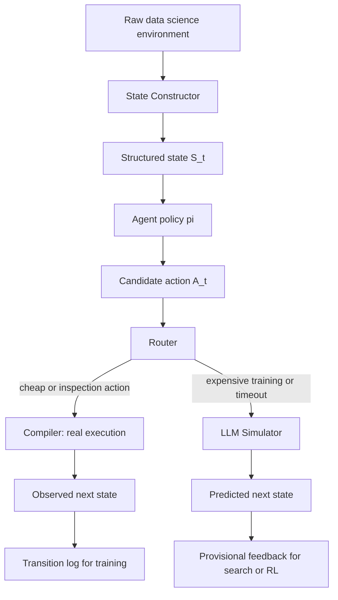

# DSWorld：给数据科学 Agent 一个可学习的执行世界模型

- **论文**：DSWorld: A Data Science World Model for Efficient Autonomous Agents
- **作者**：Zherui Yang、Fan Liu、Hao Liu
- **机构**：The Hong Kong University of Science and Technology (Guangzhou)
- **发布日期**：2026-07-17
- **原文**：[arXiv](https://arxiv.org/abs/2607.15901) / [HTML](https://arxiv.org/html/2607.15901) / [PDF](https://arxiv.org/pdf/2607.15901)
- **代码状态**：论文给出匿名仓库链接 `https://anonymous.4open.science/r/DSWorld`；本轮访问该仓库时 API 返回 401，因此本文只把它作为“代码链接存在但暂不可复核”的复现边界。
- **类型**：大模型 Agent / Agent 后训练 / 数据科学自动化

## TL;DR

- DSWorld 研究的是一个很具体的瓶颈：数据科学 Agent 在搜索特征工程、训练模型、评估提交方案时，真正耗时的不是推理 token，而是一次次真实执行数据处理、模型训练和评测。
- 论文把数据科学工作流写成状态转移问题：给定当前状态 `S_t` 和候选操作 `A_t`，世界模型 `W` 预测下一状态 `S_{t+1}`，让 Agent 在部分重计算之前先“想象”执行后果。
- 方法由四个组件组成：`State Constructor` 把 notebook / 数据集 / 环境 / 日志压成结构化状态，`Router` 判断动作该真实执行还是模拟，`Compiler` 负责轻量真实执行，`Simulator` 用 Qwen3-8B 预测重计算动作的结果。
- 训练上，作者构造 DSWorld-8K：真实数据科学任务轨迹加上基于 MMTU 表格数据合成并经真实执行验证的转移样本，再用 SFT 初始化和 Reflective World Model Optimization 进一步训练。
- 关键证据是三组实验：转移预测平均分 `0.781`，比最强训练免费 baseline `o4-mini=0.576` 高约 `35.6%`；用于 RL 训练时，DSWorld 把训练时间从 Compiler 的 `335` 分钟降到 `277` 分钟，并维持接近的 MLE-Bench Lite 分数；用于搜索推理时，多个 Agent 的执行时间约有 `3-6x` 加速。
- 局限同样明确：它主要建模数据科学内部状态转移，不覆盖一般外部工具调用；模拟器仍会受底层 LLM 能力约束；合成轨迹和真实长期工作流之间存在分布差距；代码仓库本轮不可访问，复现还需要等待公开入口稳定。


## 研究问题：数据科学 Agent 为什么需要世界模型？

### 现有 Agent 的主要成本在哪里？

- 数据科学 Agent 的任务不是单步问答，而是一串可执行实验：
  - 读取数据集；
  - 做特征统计；
  - 写预处理代码；
  - 训练候选模型；
  - 调参；
  - 生成提交文件；
  - 根据 leaderboard 或验证集结果继续搜索。
- 这类任务中，LLM 生成代码只是链路的一部分。
- 论文特别强调：已有系统常依赖 test-time scaling，也就是让 Agent 多生成、多执行、多比较。
- 这种策略会把性能提升绑定到真实执行次数，导致训练和推理都被昂贵计算拖住。

### 论文提出的核心问题

> 能不能为数据科学工作流学习一个转移模型，让 Agent 在真实执行之前预测操作后果？

这个问题的意义不只是“省时间”。

- 如果世界模型能预测状态转移，Agent 训练就可以获得更便宜的交互环境。
- 如果世界模型能预测失败类型，Agent 推理时就可以提前避开明显无效的代码路径。
- 如果世界模型能预测性能变化，搜索式 Agent 就可以减少大量候选方案的真实训练。
- 如果世界模型预测不准，Agent 反而会被虚假的环境反馈带偏。

因此，DSWorld 的真正目标是把数据科学 Agent 从“每一步都必须执行后才知道结果”推进到“部分步骤可由可评估的模拟器先验判断”。

## 论文主张与论证路线

| Claim | Mechanism | Evidence | Boundary |
|---|---|---|---|
| 数据科学工作流可以被建模为状态转移 | `S_{t+1}=W(S_t,A_t)`，状态包含任务、数据、环境和日志 | 论文定义 Data Science Workflow State、Action、World Model | 只覆盖数据科学环境，不等于任意外部工具世界模型 |
| 混合执行比纯模拟更可靠 | Router 把轻量动作交给 Compiler，把重计算动作交给 Simulator | Figure 2 展示 execute / simulate 路由；Table 2/3 显示性能和时间折中 | Router 错误会影响反馈质量，论文用 timeout 缓解但未证明最优 |
| 转移模型需要专门数据训练 | DSWorld-8K 结合真实轨迹和合成轨迹，并保留 verified transition | Table 1 中 SFT/GRPO 模型显著强于原始 backbone | 合成轨迹可能和真实长期数据科学任务有分布差距 |
| 反思式 RL 能进一步改进世界模型 | 先预测，再和真实下一状态比较，生成 reflection feedback，再优化 refined prediction | DSWorld 平均分 `0.781` 高于 Qwen3-8B-grpo 的 `0.771` | 增益约 `1.3%`，不是主要性能来源；主增益仍来自转移数据 |
| 世界模型能加速 Agent 训练与推理 | 训练时替代部分真实环境，推理时作为 search executer | Table 2 训练时间 `335 -> 277` 分钟；Table 3 多个设置显著降时 | 性能并非总是超过真实 Compiler，尤其要看任务和搜索器 |

## 方法机制：DSWorld 到底在模拟什么？


### 状态定义

论文把第 `t` 步的数据科学工作流状态写成：

```text
S_t = {T_t, D_t, P_t, L_t}
```

变量含义如下：

| 符号 | 含义 | 为什么重要 |
|---|---|---|
| `T_t` | 当前任务描述 | 决定目标指标、预测目标、约束条件 |
| `D_t` | 数据状态 | 包括数据预览、统计、列类型、缺失、分布 |
| `P_t` | 执行环境 | 包括库版本、runtime 配置、可用文件 |
| `L_t` | 执行日志和中间输出 | 包括报错、训练日志、提交文件、任务进度 |

这个定义的关键在于：它没有把 Agent 历史当成普通对话上下文，而是把环境可观测状态显式结构化。

- 对普通聊天模型来说，一段 pandas 代码只是文本。
- 对 DSWorld 来说，同一段代码是动作 `A_t`，必须映射到数据状态、运行状态和性能信号的变化。
- 这让世界模型的评价也更具体：不是问回答是否流畅，而是问它能否预测“代码会不会跑通、会报什么错、输出像不像、性能会怎样”。

### 世界模型公式

核心转移写法是：

```text
S_{t+1} = W(S_t, A_t)
```

其中：

- `S_t`：当前结构化工作流状态；
- `A_t`：Agent 生成的数据科学操作，例如特征工程、模型训练、评估；
- `W`：数据科学世界模型；
- `S_{t+1}`：预测的下一环境状态。

这个公式看起来简单，但它把 Agent 训练的交互成本问题变成了模型学习问题。

- 原来要真实执行 `A_t` 才知道 `S_{t+1}`。
- 现在可以先用 `W` 预测结果，只有必要时再执行。
- 如果预测能覆盖错误、输出和性能，Agent 就能在更便宜的反馈上训练或搜索。

### 四个组件如何分工？

| 组件 | 输入 | 输出 | 作用 |
|---|---|---|---|
| `State Constructor` | 原始执行环境 `E_t` | 结构化状态 `S_t` | 把任务、数据、环境、日志整理成模型可读状态 |
| `Router` | 当前状态和动作 | `execute` 或 `simulate` | 判断动作是否需要昂贵计算 |
| `Compiler` | 状态和动作 | 真实下一状态 | 对轻量动作直接执行，保证准确性 |
| `Simulator` | 状态和动作 | 模拟下一状态 | 对重计算动作预测结果，节省执行成本 |

执行链路可以画成：



路由公式可以写成：

```text
m_t = R(S_t, A_t),  m_t in {execute, simulate}

if m_t == execute:
    S_hat_{t+1} = C(S_t, A_t)
else:
    S_hat_{t+1} = S(S_t, A_t)
```

论文还加入 timeout 规则：

- 如果某个动作本来被 Router 判为可执行；
- 但 Compiler 运行超过阈值；
- 则该动作会被重定向到 Simulator。

这说明 DSWorld 不是纯粹“相信模型”，而是在精确性和效率之间做一个动态折中。

## 训练数据：DSWorld-8K 为什么不是普通指令数据？

### 真实转移轨迹

作者先从已有自主数据科学任务中收集真实环境转移。

- Agent 在真实 benchmark 中行动。
- 系统记录 `(S, A, S')`。
- 高级 LLM 再为每个转移合成解释轨迹 `tau`。

这部分数据的价值在于贴近真实 Agent 行为，但规模天然受限。

- 真实运行成本高。
- 任务覆盖有限。
- 失败样本不一定均匀出现。
- 很难系统性覆盖各种 pandas、NumPy、模型训练错误。

### 合成转移轨迹

为扩大规模，作者设计了合成 pipeline。

流程可以概括为：

```text
Input: MMTU tables, operation library, error library
State:
  choose a real table
  construct task description, data preview, statistics, environment
Loop:
  sample operation o
  sample error type e
  sample execution status r
  ask LLM to synthesize executable action A
  run Compiler to obtain ground-truth next state S'
  verify that S, A, S' match intended status/error constraints
  synthesize CoT trajectory tau for transition reasoning
Output: verified transition tuple (S, A, S', tau)
```

这和普通 SFT 数据的差别很大。

- 普通指令数据只要求“给出答案”。
- DSWorld 数据要求动作可执行。
- 普通 reasoning 数据往往没有真实环境状态。
- DSWorld 的 ground truth 来自 Compiler 真实执行。
- 普通代码数据常关注最终代码。
- DSWorld 关注“这一步之后环境如何变化”。

### 数据覆盖与实现细节

论文给出的关键设置如下：

| 项目 | 设置 |
|---|---|
| 训练集 | DSWorld-8K，约 8K 转移样本 |
| 合成数据来源 | MMTU，`61,763` 张真实表，`25` 类任务 |
| 真实轨迹来源 | DACode 任务 + ReAct 框架 |
| Simulator backbone | Qwen3-8B |
| Action encoder | Harrier OSS v1 0.6B |
| Router | 两层 MLP，隐藏维度 `256` 和 `64` |
| SFT | 5 epochs，batch size `32`，learning rate `1e-5` |
| RL | rollout size `8`，learning rate `1e-6`，`200` steps |
| 训练框架 | VeRL |
| 硬件 | 4 张 NVIDIA A800 |

## Reflective World Model Optimization：反思式 RL 怎么起作用？

### 从 SFT 到反思优化

SFT 阶段先让 Simulator 学会基本转移：

```text
L_SFT = -log S_theta(S' | S, A)
```

含义是：

- 给定当前状态 `S`；
- 给定动作 `A`；
- 最大化真实下一状态 `S'` 的生成概率。

但 SFT 只模仿训练样本，不直接惩罚“哪里错了、错后如何修正”。

因此作者引入反思流程：

1. Simulator 先预测一个下一状态 `S_hat'`。
2. 把 `S_hat'` 和真实 `S'` 比较。
3. 生成 reflection feedback `f`，指出缺失、错误或不一致。
4. Simulator 基于 `(S, A, f)` 再生成 refined prediction。
5. 原始预测和修正预测一起进入 GRPO 优化。

### GRPO 目标的作用

论文把每个样本做 `n` 次 rollout，构造原始预测和反思后预测集合：

```text
P = {S_hat'_i, S_hat'_{r,i}} for i = 1..n
```

再用 group-relative advantage：

```text
A_i = (R_i - mean(R)) / (std(R) + epsilon)
```

这里的奖励 `R_i` 不只是文本相似。

- 执行预测任务的奖励平均四项：
  - execution success prediction；
  - error type prediction；
  - execution result similarity；
  - execution keyword matching。
- 性能预测任务的奖励是：
  - `R_perf = 1 - (s_hat - s)^2`。

这使得优化目标更贴近数据科学转移本身。

- 如果模型只写出看似合理的解释，但执行状态错了，会被惩罚。
- 如果模型猜对成功/失败，却漏掉关键输出，也会扣分。
- 如果模型预测性能偏离真实分数，性能奖励会下降。

### 这个设计解决了什么？

反思优化的价值不在于让模型“多想一步”这么泛泛。

它真正改变的是监督信号的形态：

- SFT：只告诉模型正确答案是什么。
- Reflection：告诉模型错误预测和真实状态之间差在哪里。
- GRPO：在一组候选预测中强化相对更好的转移解释。
- Reward：把成功、错误类型、输出相似度、关键词、性能分数拆开评分。

这与 Agent 后训练里的一个核心问题相通：环境反馈往往复杂、稀疏、昂贵，不能只靠最终成功率训练。

## 实验设置：作者验证了哪些问题？

### RQ1：转移预测能力

作者评估六类能力：

| 指标 | 任务 | 分数含义 |
|---|---|---|
| PR | Predict-before-Execute | 不执行代码，预测候选方案性能排序 |
| ESP | Execution Success Prediction | 预测动作能否成功执行 |
| ETP | Error Type Prediction | 预测失败动作的错误类型 |
| ERS | Execution Result Similarity | 预测输出与真实输出的语义相似度 |
| EKM | Execution Keyword Matching | 预测输出是否覆盖真实输出关键词 |
| PP | Performance Prediction | 预测机器学习方案性能，使用 `1 - RMSE` |

评测数据包括：

- Predict-before-Execute：原始有 `28` 个 ML 问题和 `18,438` 个 ranking tasks，作者每个问题采样 `20` 个，共 `471` 个评测任务。
- Synthetic Evaluation Tasks：作者构造 `540` 个任务，覆盖 ESP、ETP、ERS、EKM、PP。
- MLE-Bench Lite：用于 Agent 训练和推理评估，移除一个超过 `100GB` 数据集的任务后，最终 `21` 个任务。

### RQ2：能否支撑 Agent 训练与推理？

训练实验：

- 用 `105` 个 MLE-Dojo 机器学习任务训练 ReAct Agent。
- 训练 `10` 个 RL steps。
- 比较三类环境：
  - DeepSeek 3.2 simulator；
  - Compiler 真实执行；
  - DSWorld。

推理实验：

- 把 Compiler、DeepSeek 3.2、DSWorld 分别作为 search-based Agent 的 executer。
- Agent 包括：
  - AIDE；
  - ML-Master；
  - AutoMLGen。
- Backbone 包括 Qwen3-8B 和 DeepSeek-3.2。

### RQ3/RQ4：训练策略和扩展性

作者还检查：

- SFT 是否有用；
- GRPO 是否有用；
- Reflective World Model Optimization 是否有用；
- 数据从 `0.1K` 到 `6.4K` 时是否持续提升；
- Qwen3 backbone 从 `0.6B` 到 `14B` 时是否持续提升；
- Ubuntu、CentOS、Windows 三种环境是否稳定。

## 主结果一：转移预测比强 LLM baseline 更准

Table 1 的核心数字如下：

| 方法 | ESP | ETP | ERS | EKM | PP | PR | AVG |
|---|---:|---:|---:|---:|---:|---:|---:|
| Llama-3.1-8B | 0.480 | 0.322 | 0.318 | 0.043 | 0.622 | 0.492 | 0.379 |
| Qwen3-8B | 0.710 | 0.573 | 0.508 | 0.193 | 0.840 | 0.507 | 0.555 |
| DeepSeek-3.2 | 0.628 | 0.403 | 0.420 | 0.250 | 0.851 | 0.539 | 0.516 |
| GPT-4o | 0.712 | 0.502 | 0.472 | 0.173 | 0.757 | 0.492 | 0.518 |
| o4-mini | 0.680 | 0.585 | 0.489 | 0.382 | 0.789 | 0.514 | 0.576 |
| Qwen3-8B-sft | 0.917 | 0.885 | 0.843 | 0.574 | 0.849 | 0.509 | 0.763 |
| Qwen3-8B-grpo | 0.937 | 0.912 | 0.859 | 0.556 | 0.848 | 0.513 | 0.771 |
| DSWorld | **0.950** | **0.922** | **0.871** | **0.575** | **0.856** | **0.518** | **0.781** |

最值得注意的是：

- DSWorld 平均分 `0.781`。
- 最强 training-free baseline 是 `o4-mini=0.576`。
- 相对提升约 `35.6%`。
- SFT 已经把 Qwen3-8B 从 `0.555` 推到 `0.763`。
- GRPO 再推到 `0.771`。
- 完整 DSWorld 推到 `0.781`。

这说明主要收益来自“转移数据 + 监督微调”，反思式 RL 是进一步校准和精炼，而不是唯一核心。

### 指标分布说明了什么？

执行相关任务收益最大。

- ESP：Qwen3-8B `0.710` 到 DSWorld `0.950`。
- ETP：`0.573` 到 `0.922`。
- ERS：`0.508` 到 `0.871`。
- EKM：`0.193` 到 `0.575`。

这说明 DSWorld 学到的不是抽象“数据科学常识”而已，而是更具体的执行动态。

性能相关任务提升较小。

- PP 从 Qwen3-8B 的 `0.840` 到 DSWorld `0.856`。
- PR 从 `0.507` 到 `0.518`。

这符合直觉：

- 判断代码会不会报错相对局部；
- 预测最终模型性能涉及数据分布、特征工程、模型选择、指标波动；
- 性能排序更接近真实 AutoML 搜索，难度高于执行状态预测。

## 主结果二：作为训练环境，DSWorld 接近真实执行但更快

Table 2 比较了用不同 simulator 训练 Qwen3-8B Agent 后的 MLE-Bench Lite 结果：

| Backbone | Simulator | Any | Median | Score | Time |
|---|---|---:|---:|---:|---:|
| Qwen3-8B | 无训练 | 4.76 | 7.94 | 13.80 | - |
| Qwen3-14B | 无训练 | 7.94 | 7.94 | 16.50 | - |
| Qwen3-8B | DeepSeek 3.2 | 1.59 | 6.35 | 10.86 | 3854 min |
| Qwen3-8B | Compiler | **11.11** | **12.70** | **18.11** | 335 min |
| Qwen3-8B | DSWorld | 9.52 | 11.11 | 17.67 | **277 min** |


这个结果的读法要谨慎。

- DSWorld 的 `Score=17.67` 略低于 Compiler 的 `18.11`。
- DSWorld 的 `Any=9.52` 也低于 Compiler 的 `11.11`。
- 但 DSWorld 时间是 `277` 分钟，低于 Compiler 的 `335` 分钟。
- DeepSeek 3.2 simulator 虽然也是模型模拟，却用了 `3854` 分钟且分数更差，说明“用强 LLM 直接猜执行结果”不是可靠替代。

这里最重要的不是 DSWorld 绝对超过真实执行。

更准确的结论是：

- 如果真实执行是黄金反馈，DSWorld 用较低成本取得接近反馈质量。
- 如果用普通 LLM 代替环境，可能既慢又错。
- 训练 Agent 时，世界模型必须经过专门转移数据训练，不能把通用推理模型直接当环境。

## 主结果三：作为推理 executer，DSWorld 加速搜索

Table 3 更贴近日常数据科学 Agent 的部署问题：推理时能不能少跑一些昂贵实验？

几个代表性数字：

| Backbone | Agent | Executer | Score | Time |
|---|---|---|---:|---:|
| Qwen3-8B | AIDE | Compiler | 10.70 | 4102 s |
| Qwen3-8B | AIDE | DSWorld | 10.58 | 676 s |
| Qwen3-8B | ML-Master | Compiler | 12.39 | 1421 s |
| Qwen3-8B | ML-Master | DSWorld | 10.34 | 371 s |
| DeepSeek-3.2 | AIDE | Compiler | 17.41 | 4344 s |
| DeepSeek-3.2 | AIDE | DSWorld | **20.49** | 1199 s |
| DeepSeek-3.2 | ML-Master | Compiler | 31.61 | 3232 s |
| DeepSeek-3.2 | ML-Master | DSWorld | 29.26 | 1065 s |

这些数字支撑论文摘要里的 `3-6x` 推理加速说法。

- Qwen3-8B + AIDE：`4102 -> 676` 秒，约 `6.1x`。
- Qwen3-8B + ML-Master：`1421 -> 371` 秒，约 `3.8x`。
- DeepSeek-3.2 + AIDE：`4344 -> 1199` 秒，约 `3.6x`。
- DeepSeek-3.2 + ML-Master：`3232 -> 1065` 秒，约 `3.0x`。

性能变化不完全一致。

- 有些设置几乎持平。
- 有些设置略降。
- DeepSeek-3.2 + AIDE 反而从 `17.41` 升到 `20.49`。

这提示 DSWorld 可能不仅仅是“快一点的执行器”。

- 当真实执行反馈噪声大、搜索预算有限时，世界模型可能帮助 Agent 更快聚焦候选。
- 当任务需要精确运行结果时，Compiler 仍然更可靠。
- 当世界模型误判时，搜索会沿着错误反馈走偏。

## 消融与扩展：哪些组件真正有用？

### SFT 是最大增益来源

从 Table 1 看：

- Qwen3-8B 原始平均分是 `0.555`。
- Qwen3-8B-sft 是 `0.763`。
- 提升 `0.208`。

这说明 DSWorld-8K 本身非常关键。

- 没有成体系的转移数据，模型很难仅靠预训练知识理解执行状态。
- 真实执行验证过的合成样本能大幅补齐失败类型和输出模式。
- 状态结构化后，SFT 才能把数据科学环境压成可学习的输入输出格式。

### GRPO 与反思优化提供小但稳定的增益

进一步比较：

- Qwen3-8B-sft：`0.763`。
- Qwen3-8B-grpo：`0.771`。
- DSWorld：`0.781`。

这支持两个判断：

- RL 后训练确实能提高转移预测质量。
- 但如果没有前面的数据构造和 SFT，RL 本身不可能凭空建立环境模型。

这对 Agent 后训练有普遍提醒：

- 先定义可验证转移和奖励；
- 再做 RL；
- 不要把 RL 当作替代任务建模的万能步骤。

### 跨环境泛化

Table 4 显示 DSWorld 在不同执行环境下平均分接近：

| 环境 | AVG |
|---|---:|
| Ubuntu | 0.781 |
| CentOS | 0.777 |
| Windows | 0.778 |

这说明 DSWorld 不只是记住了单一 Linux 环境里的错误模式。

但边界也要写清：

- 这仍然是论文构造的评测环境。
- OS 差异不等于真实企业数据科学栈差异。
- GPU、私有库、权限、网络、数据泄露防护等生产变量没有充分展开。

### 额外 DACode 实验

Appendix B 的 Table 5 显示：

| Backbone | Simulator | DACode |
|---|---|---:|
| Qwen3-8B | 无训练 | 0.200 |
| Qwen3-14B | 无训练 | 0.214 |
| Qwen3-8B | DeepSeek 3.2 | 0.158 |
| Qwen3-8B | Compiler | 0.231 |
| Qwen3-8B | DSWorld | **0.232** |

这个附录结果很重要，因为它说明 DSWorld 在额外 benchmark 上至少没有只过拟合 MLE-Bench Lite。

不过它仍不是完整复现证明：

- DACode 分数接近，不代表所有数据科学任务都可模拟。
- 论文没有展示长期项目级 notebook 的完整交互轨迹。
- 没有展示真实企业数据、权限和不可公开数据约束下的表现。

## Figure / Table 逐项证据解读

| 图表 | 支撑什么 | 不能证明什么 |
|---|---|---|
| Figure 1 | DSWorld 的问题设定：世界模型从物理预测迁移到数据科学执行预测，并给出训练/推理加速主张 | 不提供具体实验设置，只是概念和摘要图 |
| Figure 2 | DSWorld 的系统结构：状态构造、路由、Compiler、Simulator、反思优化、数据合成 | 不说明各组件在失败任务里的独立错误率 |
| Table 1 | DSWorld 在 ESP/ETP/ERS/EKM/PP/PR 上优于强 baseline，平均分 `0.781` | 评测任务仍由作者构造，真实长期工作流覆盖有限 |
| Table 2 | 用 DSWorld 训练 Agent 可接近 Compiler 分数并节省时间 | DSWorld 没有在主表中全面超过 Compiler |
| Figure 3 | 训练时间差异可视化，支撑效率 claim | 不展示成本、显存、吞吐和失败重试细节 |
| Table 3 | 推理阶段多个 Agent 使用 DSWorld 后显著降时，约 `3-6x` | 不保证每个 Agent / 每个数据集都保持性能 |
| Figure 4 | 数据规模和模型规模增大时性能提高 | 没给出更大规模后的饱和点和成本曲线 |
| Table 4 | Ubuntu/CentOS/Windows 环境下指标接近 | 不等于对所有生产环境、私有依赖、网络 I/O 泛化 |
| Table 5 | DACode 附加实验中 DSWorld 略高于 Compiler | 只是额外基准，不是开源复现 |

## 和相关工作的关系

### 与传统 world model 的关系

传统 world model 常见于：

- 视频或物理世界预测；
- 机器人控制；
- 自动驾驶；
- web / GUI agent 的页面状态转移。

DSWorld 的差异是把“世界”限定为数据科学执行环境。

- 它不预测图像下一帧。
- 它不预测机器人下一姿态。
- 它不预测网页 DOM 状态。
- 它预测代码操作之后的数据状态、错误、输出和性能。

这让它更像一种“可学习的执行缓存 + 任务模拟器 + 环境反馈模型”的组合。

### 与数据科学 Agent 的关系

已有数据科学 Agent 通常有两条路线：

- 训练 backbone，让模型更会写数据科学代码；
- test-time scaling，让模型多试候选方案。

DSWorld 不是直接替代这两条路线。

它更像插在两者之间：

- 训练阶段：给 RL 提供更便宜的环境交互。
- 推理阶段：给搜索策略提供更便宜的候选执行反馈。
- 评估阶段：把“预测执行后果”本身变成可测能力。

### 与 Agent 安全和工具使用的关系

这篇论文不主打安全，但对 Agent 安全有一个重要旁证。

如果未来 Agent 依赖世界模型替代真实执行，就必须回答：

- 世界模型预测错误时，哪些动作不能只靠模拟结果放行？
- Router 是否会把危险动作错误路由到模拟或真实执行？
- Simulator 是否会 hallucinate 一个安全结果，让 Agent 忽视真实失败？
- 数据科学环境中的隐私、凭证、外部网络访问是否进入状态表示？
- 训练数据里的合成轨迹是否会引入错误执行习惯？

因此，DSWorld 可以提高效率，但不自动提供安全隔离。

## 失败边界与可复现性

### 论文自己列出的局限

作者明确承认三点：

- DSWorld 当前聚焦数据科学转移，没有显式建模一般 Agent 工作流里的外部 tool-call transitions。
- 转移预测质量受底层 LLM Simulator 能力约束，复杂工作流里仍可能不准。
- 合成轨迹与真实自主工作流之间可能有分布差距，影响泛化。

这些局限不是小问题。

- 一旦世界模型被用于训练 Agent，错误反馈会进入策略学习。
- 一旦世界模型被用于推理搜索，错误预测会改变候选排序。
- 一旦世界模型被用于高成本任务，用户可能因为加速收益而降低真实验证频率。

### 本轮额外复核到的边界

本轮尝试访问论文给出的匿名代码仓库。

- 根路径重定向到 `/api/repo/DSWorld/file/`。
- 最终 HTTP 状态是 `401`。
- 因此无法复核代码目录、训练脚本、数据格式和复现实验入口。

这不影响论文作为当前候选的采集资格，但会影响可复现性判断。

本文因此只基于：

- arXiv abstract/API 日期；
- arXiv HTML 全文；
- arXiv PDF；
- Hugging Face paper page；
- arXiv HTML 中的图表和附录。

## 研究者视角的继续追问

### 问题一：世界模型什么时候必须回退真实执行？

DSWorld 已经有 Router 和 timeout，但更深的问题是校准。

一个可部署的数据科学世界模型应该输出：

- 预测下一状态；
- 预测置信度；
- 预测错误类型；
- 是否必须真实执行；
- 真实执行后是否应更新世界模型。

可写成一个保守策略：

```text
if risk(action) is high:
    execute with sandbox
elif uncertainty(world_model, state, action) is high:
    execute and log transition
elif action is cheap:
    execute directly
else:
    simulate and mark as provisional
```

关键是 `simulate` 的结果不能被当作最终真相。

它应该是 provisional feedback，直到被真实执行、用户确认或后续证据校验。

### 问题二：世界模型会不会放大数据科学捷径？

数据科学任务最容易出现代理目标。

- 模型可能预测验证集分数，而不是泛化能力。
- Agent 可能学会利用评测脚本漏洞。
- 合成轨迹可能偏向简单表格和常见错误。
- Simulator 可能把“看起来像合理 pipeline”的代码高估。

如果用 DSWorld 训练 Agent，必须防止策略学会取悦世界模型。

可以考虑：

- 周期性真实执行校准；
- holdout 环境和 unseen data source；
- 对世界模型预测做 adversarial audit；
- 让 Simulator 输出不确定性和证据片段；
- 在 reward 中惩罚无法被真实执行复核的高置信预测。

### 问题三：从数据科学世界模型到通用 Agent 世界模型还差什么？

DSWorld 的状态空间相对可结构化。

- 数据集可以采样。
- Python 错误可以分类。
- 模型性能可以打分。
- 输出相似度可以量化。

通用 Agent 环境更复杂。

- 邮件、浏览器、文件系统、日历、终端、数据库都有不同权限边界。
- 外部网页可能包含 prompt injection。
- 工具动作会产生不可逆副作用。
- 多 Agent 协作会引入 provenance 和责任归属。

因此，DSWorld 更像一个清晰子域里的世界模型样板，而不是通用 Agent 运行时的完整答案。

## 结论

- DSWorld 的核心贡献，是把数据科学 Agent 的昂贵执行问题重新表述为可训练的状态转移建模问题。
- 它的系统设计不是单纯“用 LLM 猜结果”，而是结构化状态、路由、真实执行、LLM 模拟和反思优化的混合机制。
- 它的证据链比较完整：转移预测 Table 1、训练环境 Table 2 / Figure 3、推理 executer Table 3、跨环境 Table 4、DACode 附录 Table 5 都支撑主要 claim。
- 它的最大现实价值，是为 Agent RL 和 test-time search 提供更便宜的环境反馈。
- 它的最大风险，是模拟反馈一旦不准，会被训练和搜索流程系统性放大。
- 因此，DSWorld 最适合被理解为“可校验执行系统的一层加速模型”，而不是替代真实执行、权限控制和安全沙箱的最终环境。

一句话总结：

> DSWorld 说明，数据科学 Agent 的下一步扩展不只是更强的代码模型，而是可学习、可路由、可反思、可回退真实执行的环境转移模型。
