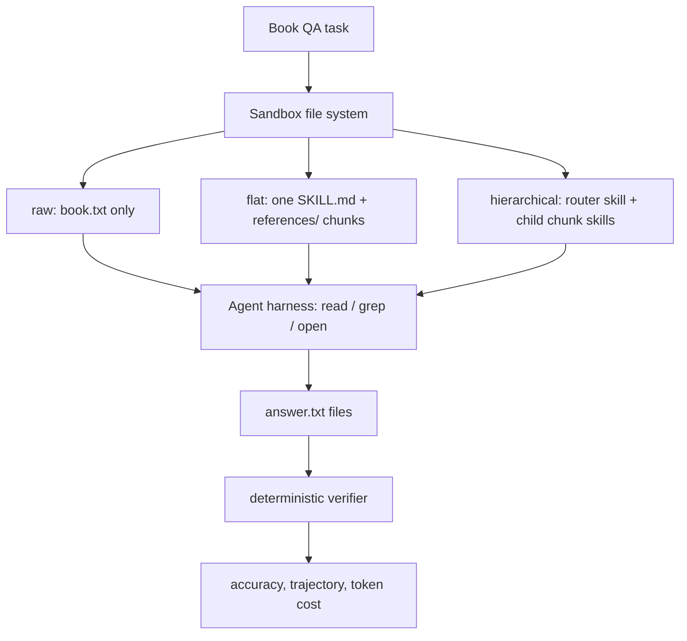

# Is Progressive Disclosure All You Need for Long-Context Agents?

## 元信息与 TL;DR

- 原文标题：Is Progressive Disclosure All You Need for Long-Context Agents?
- 作者：Yifeng He、Yinzhe Zhao、Jicheng Wang、Hao Chen。
- 来源：[arXiv:2607.17598v1](https://arxiv.org/abs/2607.17598)，2026-07-20 06:35:32 UTC 提交。
- 类型：论文，主题属于大模型 Agent 与长上下文 Agent 评测。
- 本文判断：这篇论文不是在证明 “Agent Skills 一定比 RAG 强”，而是在拆开一个更窄但更关键的问题：当长文档以文件系统和 skill pack 形式交给 agent 时，progressive disclosure 究竟是在增加推理能力，还是只是在控制上下文暴露成本。

### TL;DR

- 论文研究长文档问答中的三种 Agent 读取路径：`raw` 直接给原始书籍文件，`flat` 用一个 `SKILL.md` 做单层索引，`hierarchical` 把每个 chunk 都做成子 skill。
- 作者把 InfiniteBench 的书籍问答改造成 LoongDoc，一个基于 BenchFlow 与 Agent Client Protocol 的交互式环境；agent 通过文件系统读、搜、打开材料，最终答案由确定性 verifier 评分。
- 单书实验覆盖 Codex、Pi、Claude Code 三个 harness，模型包括 `gpt-5.4-mini`、`qwen3-coder-480b-a35b-instruct` 与 `claude-haiku-4.5`，任务包括英文选择、英文开放问答、中文开放问答。
- 核心数字显示：在 Codex + gpt-5.4-mini 单书设置中，`raw`、`flat`、`hierarchical` 基本打平，例如 En.QA 分别是 0.7412、0.7516、0.7377；原因是 Codex 的裸 agent 已经会 grep 实体并定位片段。
- 在 Pi + gpt-5.4-mini 单书设置中，`flat` 明显优于 `hierarchical`，En.MC 从 0.9126 掉到 0.6398，说明把每个 chunk 描述都常驻上下文会让路由器先被索引本身压垮。
- 多书实验把同一问题扩展到 `K=5,10,20` 本书；在 Codex + gpt-5.4-mini 的 English open QA 上，`K=20` 时 `flat` 达到 0.462，而 `raw` 只有 0.257，`hierarchical` 只有 0.267。
- 论文最值得带走的结论是：progressive disclosure <u>买到的是上下文路由预算，不是额外智能</u>；当 agent 本来会定位时它冗余，当语料库变大时它变得关键。
- 局限也很清楚：En.MC 可能有预训练记忆污染；扩展轴只覆盖 `K=1,5,10,20` 和书籍问答；中文开放问答上收益不稳定；chunking 与描述生成 recipe 固定，不能外推到所有代码库或技术文档。

## 研究问题：作者到底在问什么？

### 为什么这不是普通的长上下文论文？

- 传统长上下文问答常被描述成二选一：
  - 把整篇文档塞进模型上下文，让长注意力自己工作。
  - 用外部检索器召回若干 chunk，再把证据喂给模型。
- Agent 场景让问题变成第三种形式：
  - 把文档路径交给 agent。
  - 允许 agent 自己决定先 `ls`、`grep`、打开哪个文件、读多少段。
  - 把读取轨迹、工具调用、token 成本都记录下来。
- 论文因此问的不是 “长上下文模型有多强”，而是：
  - 当 agent 已经能自主导航文件系统时，skill pack 是否还带来增益？
  - 若有增益，来自 `description` 路由，还是来自把文本切 chunk？
  - progressive disclosure 需要递归多深，一层是否够用？

### 为什么 Agent Skills 是合适的研究对象？

- Agent Skills 的实践规则是分层加载：
  - discovery：启动时只暴露 skill 名称和 description。
  - activation：任务匹配后加载 `SKILL.md` 主体。
  - execution：再按需读取 `references/`、脚本或资源。
- 这套机制在工程实践中很自然：
  - 用很短的 description 让 agent 知道 “这里可能有答案”。
  - 只有命中后才加载正文索引。
  - 再按索引打开具体 chunk。
- 但实践直觉并不等于实验结论：
  - 如果 agent 自己已经会 grep，skill pack 可能只是重复它的工作。
  - 如果 description 常驻太多，路由层本身会变成上下文噪声。
  - 如果语料库从一本书变成二十本书，裸 agent 的文件遍历成本可能突然失控。

## 论文主张与论证路线

| Claim | Mechanism | Evidence | Boundary |
|---|---|---|---|
| 单书场景下，progressive disclosure 的收益依赖 harness | `flat` 预构建定位入口，但强 agent 会自己构造 locate-then-read | Codex 单书三种方法几乎打平；Pi 与 Claude Code 更受益 | 不能说 skill pack 普遍提升单书 QA |
| 一层 disclosure 通常够用 | `flat` 的 chunk 描述只在 skill 激活后进入上下文 | Pi + gpt-5.4-mini 单书 En.MC：`flat` 0.9126，`hierarchical` 0.6398 | 开放问答和更大规模下 depth 效果有任务差异 |
| 多书规模会击穿裸 agent | agent 必须先找目标书，再找答案片段 | Codex En.QA `K=20`：`raw` 0.257，`flat` 0.462 | 只测了书籍语料，不等于代码库必然同样 |
| disclosure 买的是上下文，不是智能 | 它减少无关文档进入上下文，不改变基础模型能力 | 中文 QA 上收益缺失或负向，说明 base model ceiling 仍重要 | 不能把它当成能力对齐或推理增强方法 |

### 论证路径可以压缩成四步

1. 定义三种读取路径，保证只改变 agent 到达证据的路线。
2. 构建 LoongDoc，把静态 InfiniteBench 变成文件系统中的 agent 任务。
3. 在单书设置下比较 `raw`、`flat`、`hierarchical` 与 `hybrid-rag`。
4. 把书籍数扩到 `K=5,10,20`，观察裸 agent 和 skill pack 的扩展曲线。



## 方法机制：三条路径到底差在哪里？

### `raw`：不给结构，只给原文

- 文件系统里有完整书籍文本。
- agent 可以自由导航：
  - 直接打开全文。
  - 搜实体名。
  - 读匹配片段。
  - 自己在运行时构造临时检索策略。
- 这个设置代表 “没有 skill pack 时 agent 默认怎么做”。

### `flat`：一个 skill，正文里放 chunk 索引

- 顶层是一个 `SKILL.md`。
- always-loaded 的只有 book-level description。
- activation 后，agent 读取 `SKILL.md` body：
  - 里面有每个 chunk 的路径。
  - 里面有每个 chunk 的短描述。
  - chunk 文件位于 `references/`。
- 关键点：
  - chunk 描述不是全局常驻。
  - 只有当这本书相关时，chunk 索引才进入上下文。

### `hierarchical`：每个 chunk 都是子 skill

- 顶层 meta-router 有 book-level description。
- 每个 chunk 都有自己的 `SKILL.md`。
- 子 skill 的 description 是 always-loaded。
- agent 可以少走一步：
  - 匹配子 skill description。
  - 直接读取该子 skill body，也就是 chunk 内容。
- 代价也明确：
  - 所有 chunk 的 description 提前进上下文。
  - 对一本书或多本书来说，路由索引本身可能膨胀。

### 用一个公式看 disclosure 的成本

```text
总上下文成本 C = C_task + C_discovery + C_activation + C_execution

raw:
  C_discovery 约为 0
  C_execution 取决于 agent 自己读多少原文

flat:
  C_discovery = book-level description
  C_activation = activated SKILL.md 中的 chunk table
  C_execution = selected chunk files

hierarchical:
  C_discovery = book-level description + all child chunk descriptions
  C_activation 约等于 selected child skill body
  风险 = C_discovery 在 K 或 chunk 数增长时提前膨胀
```

### book-to-skill pipeline

- Chunking：
  - 优先按书籍自己的章节标题切分。
  - 没有标题时，退回到约 4000 词的段落边界切分。
  - 每个 chunk 成为 `references/` 下的文件。
- Description：
  - 每个 chunk 用 LLM 生成 1 到 2 句摘要。
  - 同时抽取 named characters、locations、organizations、central topics。
  - 再基于 chunk 描述生成 book-level description。
- 控制变量：
  - `flat` 与 `hierarchical` 共享同一组 chunk。
  - 共享同一组描述。
  - 差别只在这些描述何时进入上下文。

## LoongDoc：把静态 benchmark 变成 agent 环境

### 环境为什么重要？

- 普通 benchmark 只看最终答案。
- 这篇论文需要知道 agent 如何到达答案：
  - 它读了哪些文件。
  - 它是否先 grep。
  - 它是否错误地打开了无关书。
  - 它花了多少 token。
- LoongDoc 因此把 InfiniteBench item 转成 BenchFlow task：
  - 题目和书籍放入 sandbox。
  - agent 通过 ACP-compatible harness 操作文件。
  - verifier 读取输出文件并评分。

### 评分方式

- Multiple choice：
  - 用正则抽取 A/B/C/D。
  - 与 gold label 匹配。
- English open QA 与 Chinese open QA：
  - 使用 InfiniteBench 的 normalized match 与 token-level F1。
  - 中文版本额外规范化中文标点和空白。
- 重要边界：
  - 没有 LLM judge 夹在中间。
  - reward 是每次 rollout 的确定性分数。
  - 轨迹可以被回看，所以能解释 “为什么某个 harness 好”。

### 多书任务如何构造？

- 单书任务只要找到一本书内的片段。
- 多书任务把 `K` 本书放进一个 library。
- 每个问题仍然只由其中一本书回答。
- agent 必须完成两个阶段：
  - 先定位目标书。
  - 再定位书内答案片段。
- 这正是真实 agent 知识库的难点：
  - 小语料下裸读可行。
  - 大语料下先找错库，后续推理再强也会失败。

## 实验设置与主结果

### 单书设置

| Harness | Model | 方法 | En.MC | En.QA | Zh.QA |
|---|---|---|---:|---:|---:|
| Codex | gpt-5.4-mini | raw | 0.8943 | 0.7412 | 0.8652 |
| Codex | gpt-5.4-mini | flat | 0.8977 | 0.7516 | 0.8390 |
| Codex | gpt-5.4-mini | hierarchical | 0.8874 | 0.7377 | 0.8525 |
| Pi | gpt-5.4-mini | raw | 0.8851 | 0.7161 | 0.6856 |
| Pi | gpt-5.4-mini | flat | 0.9126 | 0.7259 | 0.7007 |
| Pi | gpt-5.4-mini | hierarchical | 0.6398 | 0.5120 | 0.6510 |
| Pi | Qwen3-Coder | raw | 0.7865 | 0.6813 | 0.7563 |
| Pi | Qwen3-Coder | flat | 0.8023 | 0.6913 | 0.7479 |
| Pi | Qwen3-Coder | hierarchical | 0.6460 | 0.5933 | 0.3890 |
| Claude Code | Haiku 4.5 | raw | 0.7448 | 0.6892 | 0.8142 |
| Claude Code | Haiku 4.5 | flat | 0.8667 | 0.7173 | 0.8330 |
| Claude Code | Haiku 4.5 | hierarchical | 0.8687 | 0.7255 | 0.8295 |

### 如何读这张单书表？

- Codex 是最重要的反例：
  - `raw` 在 En.QA 上是 0.7412。
  - `flat` 是 0.7516。
  - 差距很小，且论文认为在误差内。
  - 轨迹解释是 Codex 裸 agent 会对问题中的实体做 grep，再打开命中片段。
- Pi 显示 disclosure 的正面作用：
  - `flat` 在三列都不低于 `raw`。
  - 但 `hierarchical` 大幅下滑。
  - 这说明多一层并不是 “更细粒度就更好”。
- Claude Code 处在中间：
  - `flat` 和 `hierarchical` 都比 `raw` 更高。
  - 但 hierarchical 没有形成稳定压倒性优势。
- Hybrid RAG 的基线意义：
  - 论文报告 Qwen 上 hybrid-rag 低于 raw 与 flat。
  - 这说明 “把证据召回给模型” 不等价于 “让 agent 通过文件系统读索引”。

### 多书设置：Codex 与 Claude Code

| Harness / Model | Task | 方法 | K=5 | K=10 | K=20 |
|---|---|---|---:|---:|---:|
| Codex / gpt-5.4-mini | En.MC | raw | 0.818 | 0.767 | 0.720 |
| Codex / gpt-5.4-mini | En.MC | flat | 0.752 | 0.790 | 0.760 |
| Codex / gpt-5.4-mini | En.MC | hierarchical | 0.777 | 0.791 | 0.746 |
| Codex / gpt-5.4-mini | En.QA | raw | 0.657 | 0.577 | 0.257 |
| Codex / gpt-5.4-mini | En.QA | flat | 0.708 | 0.582 | 0.462 |
| Codex / gpt-5.4-mini | En.QA | hierarchical | 0.667 | 0.606 | 0.267 |
| Codex / gpt-5.4-mini | Zh.QA | raw | 0.698 | 0.214 | 0.043 |
| Codex / gpt-5.4-mini | Zh.QA | flat | 0.738 | 0.178 | 0.095 |
| Claude Code / Haiku 4.5 | En.QA | raw | 0.582 | 0.413 | 0.301 |
| Claude Code / Haiku 4.5 | En.QA | flat | 0.642 | 0.480 | 0.354 |
| Claude Code / Haiku 4.5 | En.QA | hierarchical | 0.589 | 0.453 | 0.302 |

### 多书结果的关键读法

- `K=20` 是最能说明问题的点：
  - Codex 单书时不需要 skill pack。
  - 但二十本书时，En.QA 的 `raw` 掉到 0.257。
  - `flat` 保持在 0.462，约为 `raw` 的 1.80 倍。
- `hierarchical` 没有救回 open QA：
  - Codex En.QA `K=20` 下只有 0.267。
  - 它几乎回到 `raw` 的水平。
  - 原因不是 chunk 不够细，而是子 skill descriptions 常驻导致路由预算被提前消耗。
- Claude Code 复制了 English open QA 上的方向：
  - `K=5`：flat 0.642，高于 raw 0.582。
  - `K=10`：flat 0.480，高于 raw 0.413。
  - `K=20`：flat 0.354，高于 raw 0.301。
- 中文 QA 没有给出同样结论：
  - Codex Zh.QA 在 `K=20` 三种方法都很低。
  - Claude Code Zh.QA 上 `raw` 在 `K=20` 反而高于 flat。
  - 这支持作者的边界判断：skill pack 不能补齐基础模型的语言能力上限。

## Figure、Table 与证据边界

### Figure 1 / Figure 2：flat 与 hierarchical 的真正差异

- 两张图的作用不是展示 UI，而是把加载时机画出来。
- `flat` 的 per-chunk description 在 `SKILL.md` body 里：
  - 只有 book-level description 常驻。
  - 只有激活后才读 chunk table。
- `hierarchical` 的 per-chunk description 在每个子 skill frontmatter 里：
  - 它们被提前暴露给 agent。
  - 子 chunk body 更近，但 discovery 成本更高。
- 这解释了为什么 “更深 routing” 可能更差：
  - 它减少一步文件打开。
  - 同时增加大量常驻路由文本。
  - 当 K 或 chunk 数增大时，第二项压过第一项。

### Table 1：单书实验支持什么？

- 支持：
  - disclosure 对弱 native navigation harness 有帮助。
  - Codex 这类强 harness 可以自己恢复检索策略。
  - hierarchical 在多个 Pi 设置下明显有害。
- 不支持：
  - 不支持 “Agent Skills 总比 raw 好”。
  - 不支持 “hierarchy 越深越好”。
  - 不支持 “RAG 基线必然最稳”。

### Table 2：多书实验支持什么？

- 支持：
  - 语料规模增长会让裸 agent 的导航失败暴露出来。
  - flat skill pack 在 English open QA 上是最稳定的救援机制。
  - progressive disclosure 的收益是规模触发的，不是单书必然出现。
- 不支持：
  - 不支持把结论推广到所有语言。
  - 不支持把 `K=20` 外推到上千文档。
  - 不支持说 chunk skill hierarchy 一定无用；Pi 的附录表显示任务和语言会改变 depth 排序。

### 成本证据

- 附录报告 English open QA 的 cost frontier：
  - Codex `K=20` raw 约 68.3M tokens/question，未缓存上界约 52 美元。
  - Codex `K=20` flat 约 32.5M tokens/question，未缓存上界约 25 美元。
  - 同时 flat 的准确率几乎翻倍。
- 这点很重要：
  - disclosure 不只是 “更准”。
  - 它在大语料 open QA 上也可能更便宜。
  - 因为它避免了裸 agent 在错误书籍和无关片段上反复消耗上下文。

## 伪代码：如何复现论文中的核心控制变量？

```text
Input:
  corpus = {book_1, ..., book_K}
  questions = {q_1, ..., q_n}
  method in {raw, flat, hierarchical}
  harness in {Codex, Pi, ClaudeCode}

State:
  sandbox.files
  trajectory_log = []
  token_usage = 0
  answers = {}

Prepare:
  for each book:
    chunks = split_by_chapter_or_4000_words(book)
    chunk_descriptions = LLM_describe(chunks, temperature=0)
    book_description = LLM_summarize(chunk_descriptions, temperature=0)

  if method == raw:
    write book.txt files only

  if method == flat:
    write one SKILL.md per book
    put chunk table inside SKILL.md body
    write chunks under references/

  if method == hierarchical:
    write meta-router skill
    write one child skill per chunk
    put chunk description in child skill metadata

Loop:
  for each question q_i:
    agent receives task prompt
    while agent has not written answer:
      action = harness.next_action()
      execute read / grep / open / write
      append action to trajectory_log
      update token_usage
      if wrong book or wrong chunk is selected:
        error may propagate to final answer
    answers[q_i] = read answer.txt

Output:
  accuracy = deterministic_verifier(answers, gold)
  trajectory_log
  token_usage
  failure_cases
```

## 失败案例与消融意义

### 为什么 `flat` 的索引位置很关键？

- 论文的一个细节很容易被忽略：
  - `flat` 不是没有 chunk 描述。
  - 它只是把 chunk 描述放在 activated `SKILL.md` body 里。
  - agent 先用 book-level description 判断这本书是否相关。
  - 相关后再读取 chunk table。
- 这等于把 routing 拆成两个预算层：
  - 第一层只回答 “该不该打开这本书”。
  - 第二层才回答 “该读这本书的哪一段”。
- 这个安排比 hierarchical 更保守：
  - hierarchical 把所有 chunk 的 description 提前变成 discovery metadata。
  - 当一本书有很多 chunk，或者 library 有很多书时，agent 在做第一层决策前已经背上了第二层索引。
  - 这和 progressive disclosure 的初衷相反，因为本该按需暴露的信息被提前暴露。

### 为什么 `raw` 不是一个弱基线？

- 在很多长文档论文里，raw full-context 常被当成 “朴素塞全文”。
- 这篇论文的 `raw` 更强：
  - 它不是把全文一次性塞入 prompt。
  - 它把书籍作为文件交给 agent。
  - agent 可以使用系统工具搜索、读取、回退。
- 因此，`raw` 的强弱取决于 harness：
  - 如果 harness 鼓励或支持有效搜索，`raw` 会接近一个临时检索器。
  - 如果 harness 更倾向顺序阅读或误用上下文，`flat` 就会显示优势。
- 这解释了 Codex 与 Pi 的分歧：
  - Codex 的裸路径已经近似 “先定位后阅读”。
  - Pi 的裸路径没有稳定恢复这种策略。
  - disclosure 的贡献不是给所有 agent 增加同样能力，而是补齐某些 harness 的导航纪律。

### 为什么 hybrid RAG 没有压倒 skill pack？

- Hybrid RAG 的 pipeline 很完整：
  - BM25 保留词面匹配。
  - BGE-M3 做 dense embedding。
  - reciprocal rank fusion 合并稀疏与稠密排序。
  - BGE cross-encoder 重新排序。
  - top chunks 进入回答 prompt。
- 但它有一个结构性限制：
  - 检索器一次性决定证据集合。
  - answer model 只能基于被喂入的 chunk 作答。
  - 如果第一轮召回漏掉关键桥接片段，后续没有 agent 式追查。
- Agentic skill pack 的优势在这里：
  - `SKILL.md` table 不是最终证据，而是导航地图。
  - agent 可以读一个 chunk 后发现线索，再打开另一个 chunk。
  - 轨迹可记录，错误也能定位到 “找错书” 或 “找错段”。
- 所以论文不是否定 RAG：
  - 它说明在 agent 文件系统环境里，RAG 不是唯一合理基线。
  - 对需要多步定位的任务，结构化可读索引可能比一次性召回更适合 agent。

### hierarchical 的失败不是小问题

- Pi + gpt-5.4-mini 单书 En.MC：
  - `flat` = 0.9126。
  - `hierarchical` = 0.6398。
  - 下降 0.2728。
- Pi + Qwen3-Coder 单书 Zh.QA：
  - `flat` = 0.7479。
  - `hierarchical` = 0.3890。
  - 下降 0.3589。
- 这类下降说明：
  - 常驻 metadata 不一定是 “轻量索引”。
  - 当每个 chunk 都拿到 discovery 位置，agent 可能在选择前就被大量候选描述干扰。
  - routing depth 是需要消融的系统参数，不是天然改进。

### Codex raw 的强表现也是一种失败边界

- 如果只看 average score，会误以为 skill pack 没价值。
- 但轨迹解释显示：
  - Codex raw 会把问题里的实体名当查询词。
  - 通过 grep 找候选片段。
  - 再打开命中上下文。
- 这意味着：
  - skill pack 对强 agent 的主要价值可能不是 accuracy。
  - 它可能是可控性、审计性、可复用索引和成本上界。
  - 论文没有直接评价这些工程维度。

### En.MC 的预训练记忆污染

- 作者明确指出 En.MC 的书是经典英文小说。
- 模型可能已经知道部分情节和答案。
- 证据包括：
  - `K=20` 下 raw agent 有时用很少工具调用就答对。
  - 单书 Codex 轨迹显示 agent 能识别重命名后的 canonical work。
- 因此更可信的证据来自：
  - English open QA。
  - Chinese open QA。
  - 未来的 held-out 或 synthetic-book corpus。

## 相关工作位置

### 与 Corpus2Skill 和 skill survey 的区别

- 论文把 Corpus2Skill 放在相近位置：
  - 都把语料组织成 agent 可导航的 skill 结构。
  - 都关心分类、描述、层级和可复用知识包。
- 但本文的问题更窄：
  - 它不试图提出完整企业知识库构建方法。
  - 它只比较相同 chunk、相同 description 在不同加载时机下的效果。
- 这个窄问题反而重要：
  - 如果不先隔离加载时机，就无法判断层级结构的收益来自哪里。
  - 可能是 description 写得好。
  - 可能是 chunk 切得好。
  - 也可能只是 agent 更容易发现入口。
- 因此本文贡献更像是实验设计：
  - 把工程上混在一起的 “skill pack recipe” 拆成可测变量。
  - 让后续论文能分别测试 chunking、description、routing depth、harness policy。

### 与 RAG 的关系

- RAG 把查找封装在检索器里：
  - BM25。
  - dense embedding。
  - reranker。
  - top chunks 进入 answer prompt。
- Agentic reading 把查找暴露给 agent：
  - 文件系统是接口。
  - 读取动作可观察。
  - agent 可以根据中间发现调整下一步。
- 论文的关键比较是：
  - 不把 disclosure 简化成检索。
  - 也不把 RAG 当成唯一基线。
  - 而是比较 “外部检索器给证据” 与 “agent 自己导航结构化文件”。

### 与 Agent Skills 实践的关系

- 官方 Agent Skills 规范强调渐进加载：
  - metadata 常驻。
  - instructions 激活后加载。
  - resources 按需读取。
- 论文给这个实践补上了实验边界：
  - metadata 不是越多越好。
  - `SKILL.md` body 中的索引有时比子 skill metadata 更稳。
  - “一层足够” 是经验结论，不是规范自身给出的定理。

### 与长上下文模型的关系

- 长上下文窗口扩大不等于有效上下文等比例扩大。
- 论文把问题转向：
  - 模型是否能把上下文用在正确位置。
  - agent 是否能先找到正确文档。
  - 文件组织是否能降低搜索空间。
- 这个视角对代码库、规范库、企业知识库都更接近实际：
  - 真正稀缺的不是总窗口长度。
  - 而是 “下一步打开哪个文件” 的决策质量。

## 结论与局限

### detail inventory

| 维度 | 论文中可确认的细节 | 分析价值 |
|---|---|---|
| 方法名 | LoongDoc、raw-document navigation、flat disclosure、hierarchical disclosure、hybrid-rag | 明确比较的是读取路径，不是新模型 |
| 数据 | InfiniteBench 的 En.MC、En.QA、Zh.QA 书籍问答 | 支持长文档，但有经典小说记忆污染 |
| 结构 | 按章节切 chunk；无章节时约 4000 words；chunk 放在 `references/` | 让 `flat` 与 `hierarchical` 共享同一文本单元 |
| 描述生成 | chunk summary + key elements；book-level summary；temperature 0；固定 seed | 控制 routing metadata 的随机性 |
| Harness | Codex、Pi、Claude Code | 证明收益依赖 agent 外壳，而不只是模型 |
| 模型 | gpt-5.4-mini、Qwen3-Coder-480B-A35B-Instruct、Claude Haiku 4.5 | 覆盖闭源 API 与本地 vLLM 服务模型 |
| Baseline | hybrid-rag，BM25 + BGE-M3 + RRF + BGE reranker | 检验 disclosure 是否只是检索换皮 |
| 指标 | mean accuracy、standard deviation、standard error、token/cost frontier | 同时观察准确率和成本 |
| 失败案例 | hierarchical 在 Pi 单书 En.MC、Zh.QA 明显下降；Codex raw 在多书 open QA 下降 | 揭示路由深度和语料规模的相互作用 |
| 局限 | En.MC 预训练 confound、K 轴窄、中文收益不稳、recipe 固定、样本量有限 | 防止把结论泛化成 skill pack 神话 |

### 复现实验时最该检查什么？

- 检查任务文件：
  - 每个 question 是否独立成文件。
  - answer path 是否固定。
  - verifier 是否只读最终答案。
- 检查 skill pack：
  - `flat` 与 `hierarchical` 是否共享完全相同 chunk。
  - per-chunk description 是否逐字相同。
  - book-level description 是否没有泄露书名或作者。
- 检查 harness：
  - 是否允许相同工具集合。
  - 是否记录 read、grep、open、write。
  - 是否在不同 method 间使用相同模型和温度设置。
- 检查成本：
  - prompt caching 是否关闭或单独报告。
  - always-loaded metadata 是否计入。
  - index construction 成本是否和 per-query 成本分开。
- 检查统计：
  - 单书表用三次 seed 的标准差。
  - 多书表用 bundle 与 seed 的标准误。
  - 接近误差范围的点不应被写成确定胜负。

### 如果把它迁移到代码库 Agent，会遇到什么新问题？

- 书籍 chunk 通常是线性章节。
- 代码库 chunk 是图结构：
  - 文件 import。
  - 函数调用。
  - 配置入口。
  - 测试夹具。
  - 运行时生成文件。
- 因此，代码库版本的 `flat` pack 可能不应只列 chunk 摘要：
  - 应列入口点。
  - 应列调用边。
  - 应列状态读写。
  - 应列配置与环境变量。
- 这会把本文结论推进到一个更难的问题：
  - 单层 disclosure 仍然可能是默认。
  - 但 `SKILL.md` body 里的索引必须从 “章节表” 变成 “行为到源码证据的地图”。
  - 这与近期 Harness Handbook 一类工作可以形成互补。

### 可以相信的结论

- 对单本文档：
  - flat disclosure 对弱导航 harness 有帮助。
  - 对强导航 harness 未必提升准确率。
  - hierarchical depth 没有稳定收益，且可能显著伤害。
- 对多文档 library：
  - flat disclosure 在 English open QA 上收益最清楚。
  - 当 `K=20` 时，它同时改善准确率和 token 成本。
  - 它的收益来自先收窄目标书，再读目标片段。
- 对系统设计：
  - skill pack 是上下文治理工具。
  - 它不是模型能力增强器。
  - 它必须和 harness 的 native navigation 能力一起评估。

### 不能过度外推的部分

- 语料类型：
  - 论文使用书籍问答。
  - 代码库、API 文档、法规文本、日志库可能有不同结构。
- 语言：
  - 中文开放问答没有复现 English open QA 的稳定收益。
  - 这提示基础模型能力仍然是瓶颈。
- 规模：
  - 最大只测到 20 本书。
  - 真正企业知识库可能是数千文档。
- recipe：
  - chunking 固定为章节或 4000 词。
  - description 用固定 prompt、temperature 0、固定 seed。
  - 更好的摘要模型或不同粒度可能改变结果。

## 研究者视角的延伸问题

### 对 Agent 系统设计的直接启发

- 设计 skill registry 时，不应只问 “能不能被发现”。
- 还要问：
  - metadata 常驻成本是多少？
  - activation body 是否承担了必要索引？
  - 子 skill 数量增长时 discovery 层是否会失控？
  - harness 自己是否已有 grep、ripgrep、semantic search 或 planner memory？
- 一个更稳的默认策略是：
  - 先做单层 pack。
  - 把细粒度索引放在 activated body。
  - 把资源文件放在 `references/`。
  - 只有在任务证明需要时才引入更深 hierarchy。

### 对后训练的意义

- LoongDoc 的 verifier 输出 per-trajectory reward。
- 这使它不仅是评测环境，也可能成为后训练环境：
  - reward 来自答案正确性。
  - trajectory 暴露导航动作。
  - token usage 可作为成本惩罚。
- 一个自然目标函数可以写成：

```text
R_total = R_answer - λ * Cost_tokens - μ * Wrong_file_penalty

变量：
  R_answer：确定性 verifier 给出的答案分数
  Cost_tokens：本次轨迹消耗的 token
  Wrong_file_penalty：打开无关书或无关 chunk 的惩罚
  λ, μ：控制准确率、成本和导航纪律的权重
```

- 这会把 “会不会读长文档” 转换成可优化的 agent 行为问题。

### 对 AI 安全与治理的意义

- Progressive disclosure 的安全面不只在资源加载。
- 真正敏感的是 discovery metadata：
  - 它决定哪个 skill 被看见。
  - 它影响 agent 是否信任某个路径。
  - 它可能被恶意自然语言操纵。
- 这篇论文没有研究攻击，但它给出一个可测量框架：
  - 把 benign skill pack 与 adversarial skill pack 放入同一 LoongDoc 风格环境。
  - 观察 agent 是否被错误 description 路由。
  - 用确定性 verifier 和轨迹审计判定伤害。
- 因此，skill pack 未来不应只做性能评测：
  - 还应做 metadata poisoning 评测。
  - 做路由鲁棒性评测。
  - 做跨语言和跨任务的误触发评测。

### 最后判断

- 这篇论文最重要的贡献不是某个单点 SOTA。
- 它把一个工程上已经广泛采用的模式拆成可检验变量：
  - raw navigation。
  - flat disclosure。
  - hierarchical disclosure。
  - harness native navigation。
  - corpus scale。
- 对今天的 Agent 系统来说，最实用的结论是：
  - <u>先用一层 progressive disclosure 管住上下文暴露。</u>
  - <u>不要假设更深的 skill hierarchy 会自动更聪明。</u>
  - <u>当语料库增大时，优先测导航失败和 token frontier，而不只是看单题准确率。</u>
- 对研究复现者来说，最应该保留的是轨迹日志：
  - 没有轨迹，就只能看到分数。
  - 有了轨迹，才能判断 agent 是真正读到证据，还是靠记忆、猜测或错误路由碰巧答对。
  - 这也是本文相对普通长上下文评测更有价值的地方。
