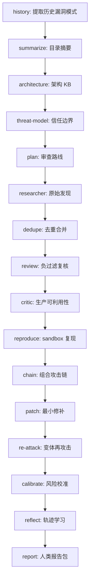
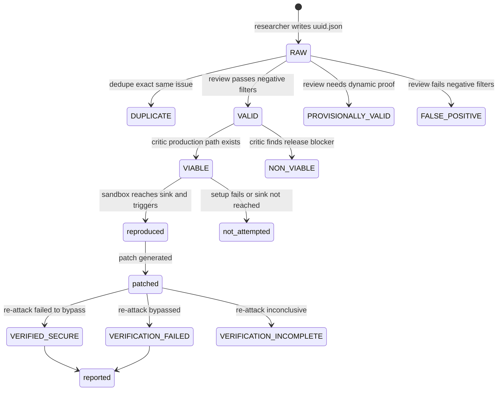

# Mantis Skills：把 Coding Agent 安全审查做成“有状态流水线”，而不是一次性漏洞摘要

### 元信息与 TL;DR

- **项目**：[google/mantis](https://github.com/google/mantis)
- **本轮依据**：仓库 `main` 最新提交
  [`8c991c0`](https://github.com/google/mantis/commit/8c991c0c2e74cc9c62cc7b97f17d1ca3d968778c)，提交时间
  `2026-07-20T21:35:23Z`，标题为 `Split patch rebasing to reference, fence Block F, add changed_files_pass gate`。
- **类型**：AI for Security / Coding Agent 安全审查技能库。
- **核心材料**：`README.md`、`README_AGENTS.md`、`schema.json`、`mantis-* / SKILL.md`、`mantis-calibrate/references/calibration_rules.md`。
- **图片取舍**：原项目没有承载关键证据的 Figure 或截图；本文不本地化图片，改用流程图、表格、公式和伪代码解释机制。

**TL;DR**

- Mantis 不是一个“让 LLM 看代码然后写漏洞报告”的提示词包，而是一套面向 coding agent 的安全审查 harness：它把审查拆成历史学习、架构知识库、威胁建模、计划、研究、去重、复核、可利用性批判、复现、链式攻击、修补、风险校准、反思和报告等阶段。
- 它的核心贡献是把不稳定的 LLM 判断包在一组磁盘状态契约里：`workspace/plan.json` 定义审查任务，`workspace/findings/<uuid>.json` 承载每个发现，`workspace/learnings.jsonl` 回收经验，`workspace/.mantis_state.json` 记录 pass 与 snapshot。
- 本周提交 `8c991c0` 一次性加入或更新约 9713 行，覆盖 27 个文件；提交信息显示它把 patch rebasing 拆到 reference、保护 Block F，并加入 `changed_files_pass` gate。这说明项目正在补强“跨 pass 复用状态时如何判断上下文新鲜度”的控制面。
- 最值得关注的机制是三重保守门禁：默认假设发现是误报；复现失败必须证明已经到达漏洞入口，不能把 build/setup 失败当成 `failed_to_reproduce`；补丁若要标记 `VERIFIED_SECURE`，必须满足 re-attack 结果为 `failed_to_bypass`。
- Mantis 也明确承认 LLM 安全审查的边界：模型会幻觉、会漏看、会生成危险代码；无人值守模式必须放在隔离 VM 或强 sandbox 中，并且所有报告在对外提交前都要由安全专家人工验证。
- 因此它的价值不在“自动发现所有漏洞”，而在把 agent 安全研究从一次性聊天，推进到可审计、可重试、可降级、能处理代码漂移的实验系统。局限是：它主要提供技能和契约，不是完整托管产品；覆盖率、误报率、复现成功率仍依赖 harness、目标环境、模型和人工校准。

### 这篇项目真正关心什么问题？

Mantis 面对的不是传统 SAST 问题，而是一个更难的控制问题：

- **输入不稳定**：目标仓库可能在扫描期间变化；某些 finding 来自旧 pass，行号和上下文会漂移。
- **执行不稳定**：coding agent 可能写出危险 PoC、误用 shell、忘记隔离，或把环境错误解释成安全结论。
- **判断不稳定**：LLM 容易把防御纵深缺失、理论风险、测试代码路径、不可达分支包装成“漏洞”。
- **修补不稳定**：一个补丁可能只挡住原始 PoC，却挡不住轻微变体；如果没有再攻击，就不能声称安全。
- **报告不稳定**：如果新一轮复现失败是因为快照漂移，旧的已确认漏洞不应该从最终报告里消失。

它的回答是把“agent 的自由推理”缩进阶段化系统：

1. 每个阶段只做一种事情。
2. 阶段之间只通过 JSON / Markdown 状态通信。
3. 所有高风险负结论都要满足更强证据门槛。
4. 所有跨轮复用都必须绑定 snapshot。
5. 所有最终报告都要保留 provenance 和人工验证边界。

### 作者的论证路线

Mantis 的 README 和 Agent Reference Guide 不是从模型能力开始论证，而是从风险开始：

| 论证层 | 作者给出的机制 | 解决的失败模式 | 边界 |
| --- | --- | --- | --- |
| 安全前提 | human-in-the-loop、isolated environment、no host-run | Agent 生成危险代码并在宿主机执行 | 说明仍非绝对保证 |
| 流水线结构 | `mantis-*` 技能顺序执行 | 一次性审查缺少可追踪状态 | 需要外部 CLI/harness 调度 |
| 状态契约 | `schema.json` 定义 finding、plan、state、learning | LLM 自由写报告导致字段漂移 | schema 只约束形状，不保证发现质量 |
| 快照模型 | `SNAPSHOT_ID`、sentinel、`discovery_commit` | 旧 finding 在新代码上被误判 | 默认关闭，需要 harness 实现 |
| 复现门禁 | reached-sink evidence gate | 把环境失败误当安全 | 某些漏洞只能静态确认 |
| 补丁门禁 | `VERIFIED_SECURE => reattack_status=failed_to_bypass` | 原 PoC 被挡住但变体绕过 | 需要再攻击 sub-agent 与 sandbox |
| 校准公式 | Hazard score 与 outrage commentary 分离 | 把声誉风险混进技术分 | 仍需要安全团队调参 |

这里的主张可以压缩成一句话：

> Coding agent 可以参与漏洞研究，但它不能单独拥有“安全结论”的最终写权限；结论必须穿过状态、证据、快照和人工审查的闸门。

### 顺序流水线：为什么要拆成这么多阶段？

README 给出的手动模式有 16 个阶段，核心不是“阶段越多越强”，而是把不同错误类型隔离：



按这个顺序看，Mantis 把审查拆成三类动作：

- **建模动作**：history、summarize、architecture、threat-model、plan。
  - 目的不是直接报 bug，而是建立“哪里值得看、什么算边界、哪些老错不要重复”的上下文。
  - 这些阶段降低 agent 在大仓库中随机游走的概率。

- **发现与过滤动作**：researcher、dedupe、review、critic。
  - researcher 可以更开放地提出候选问题。
  - review 和 critic 再把候选压回现实：是否真有 attacker control、是否在生产路径、是否只是测试或低价值 DoS。

- **证据与闭环动作**：reproduce、chain、patch、calibrate、reflect、report。
  - reproduce 要提供 reached-sink evidence。
  - patch 要经过 re-attack。
  - calibrate 把证据转成优先级。
  - reflect 把本轮误判写回 learnings。

这个设计接近“漏洞研究状态机”，而不是普通 agent workflow。它允许某个阶段有噪声，但不允许噪声未经约束地直接成为最终安全结论。

### 状态契约：每个 finding 是一条可演化记录

`schema.json` 的 finding 对象很长，说明 Mantis 不把漏洞当成一段自然语言描述，而是当成会被多个阶段逐步改写的实体。

| 字段族 | 示例字段 | 由谁写入或更新 | 为什么重要 |
| --- | --- | --- | --- |
| 身份 | `id`、`title`、`code_paths` | researcher / dedupe | UUID 让后续阶段引用稳定对象 |
| 攻击条件 | `privileges_required`、`attacker_position`、`user_interaction` | researcher / review | 防止把任意代码路径都当外部漏洞 |
| 有效性 | `status`、`reasoning`、`triage_checklist` | review | 记录为什么是 VALID、FALSE_POSITIVE 或 NEEDS_RESEARCH |
| 生产性 | `production_viability`、`critic_reasoning` | critic | 区分 release build、测试样例和条件可利用 |
| 复现 | `repro_status`、`repro_file_path`、`run_command`、`repro_output` | reproduce | 把“我认为能触发”变成可审计证据 |
| 修补 | `patch_status`、`patch_diff`、`reattack_status` | patch / reproduce --reattack | 把补丁正确性和绕过尝试绑定 |
| 风险 | `impact_score`、`likelihood_score`、`mantis_risk_score`、`priority` | calibrate | 让排序依赖证据，而不是标题恐怖程度 |
| 溯源 | `discovery_commit`、`repro_snapshot_id`、`patch_base_snapshot` | 多阶段 | 防止跨 snapshot 误复用结论 |

可以把 finding 的生命周期写成一个简化状态机：



这套字段让每个结论都带着“谁在什么时候以什么证据改写”的痕迹。对安全团队来说，这比一篇漂亮报告更关键，因为实际 triage 需要回答的是：

- 这是不是同一个 bug？
- 它在哪个代码版本上发现？
- 复现有没有到达真实入口？
- 补丁挡住的是原始 payload，还是也挡住了变体？
- 这条结论能不能在当前 snapshot 上继续相信？

### Snapshot Model：Mantis 最值得研究的设计

本周提交信息里的 `changed_files_pass gate` 指向一个关键问题：持续审查不是一次性扫描，代码会变，finding 也会跨轮流动。

Mantis 的快照模型把这个问题拆成三种模式：

| 模式 | 触发条件 | 允许的结论 | 设计意义 |
| --- | --- | --- | --- |
| MODE-OFF | 没有 `active_snapshot`，也没有传入 snapshot 参数 | 维持旧行为，所有 verdict 可发出 | 兼容手动交互用法 |
| PINNED | `active_snapshot.snapshot_pinned=true` 且 sentinel 匹配 | 可以发出权威负结论和修补结论 | 每个阶段读取同一个不可变副本 |
| HALT | 请求了 sync，但无法 pin，或目标是 live/uncopyable | 禁止权威负结论，降级为 provisional | 防止在漂移目标上声称“安全” |

`SNAPSHOT_ID` 的计算也不是单一 commit hash：

- 干净 git / hg：使用提交哈希。
- 脏 git / hg：使用 `commit_hash:content_hash`。
- multi-vcs：使用 `revision:content_hash`，避免把分支名当稳定身份。
- 无 VCS：使用 `content:<content_hash>`。
- live endpoint 或无法复制目标：使用 `live:<ISO8601>`，并进入 unpinned 降级模式。

这背后的判断很实用：

- 只看 commit hash 不能描述脏工作树。
- 只看 branch name 不能描述多仓库 manifest 的真实内容。
- 只要无法固定字节，就不能把“没复现出来”当作安全证据。

简化伪代码如下：

```text
Input:
  target_root, state_root, sync_enabled
State:
  active_snapshot, snapshot_history, findings

if sync_enabled:
  sync_target_only_at_pass_boundary()
  snapshot_id = compute_snapshot_id(target_root)
  snapshot_root = materialize_readonly_copy(target_root)
  write(snapshot_root/.mantis_snapshot_id, snapshot_id)
  append snapshot_history(pass, snapshot_id, pinned=true)
else:
  active_snapshot = absent

for each stage:
  resolve CODE_ROOT from target_root or snapshot_root
  if pinned:
    require sentinel == snapshot_id
  for each finding:
    if finding.discovery_commit != snapshot_id:
      route to NEEDS_RESEARCH
      forbid authoritative negative verdict
```

这个设计把 agent 容易忽视的“时间”变成了系统字段。对持续安全审查来说，这是 Mantis 比普通 prompt library 更有价值的地方。

### Review 与 Critic：默认把发现当误报

`mantis-review` 的系统目标很直接：独立复核 finding，过滤噪声和 false positive。它明确要求“默认假设每个 finding 是 false positive”，然后逐项确认：

- 是否有真实 attacker-controlled source。
- 是否到达安全敏感 sink。
- 是否只是缺少卫生措施或 defense-in-depth。
- 是否只是理论性 misuse。
- 是否依赖不可稳定复现的竞态。
- 是否位于测试、示例、低价值路径或不可达配置。

这种负过滤不是保守到不报漏洞，而是把“研究者提出候选”和“系统承认有效”分开。研究阶段可以多想，复核阶段必须少信。

`mantis-critic` 再进一步区分：

| critic 输出 | 含义 | 对后续阶段的影响 |
| --- | --- | --- |
| `VIABLE` | 生产 release 路径可触发 | 进入复现和风险校准 |
| `CONDITIONAL_VIABLE` | 需要特定配置或条件 | 可以保留，但风险应反映前提 |
| `NON_VIABLE` | release build、环境或控制面阻断 | 后续不应当高优先级处理 |
| `SAMPLE_OR_TEST` | 只在样例/测试路径 | 报告中应降权或排除 |

这对 AI 安全审查非常重要。很多 agent 发现看起来像漏洞，是因为它没有把代码路径和部署语义连起来。Mantis 让 critic 把这个语义补回来。

### Reproduce：不能把“没跑起来”说成“没漏洞”

Mantis 的复现阶段有一个强约束：任何负结论都必须先证明 reproducer 到达了漏洞入口。

可以把它写成公式化门禁：

```text
NegativeVerdictAllowed =
  snapshot_is_authoritative
  AND reached_sink_evidence_present
  AND baseline_execution_valid

if not NegativeVerdictAllowed:
  repro_status = not_attempted
else if trigger_observed:
  repro_status = reproduced
else:
  repro_status = failed_to_reproduce
```

其中 reached-sink evidence 可以来自：

- 插桩或 sidecar 文件证明代码走到目标 sink。
- binary / firmware 场景下捕获到崩溃、sanitizer、QEMU/unicorn trace 或等价证据。
- 对逻辑/授权漏洞，功能测试证明越权结果或状态转移发生。

这个设计修正了自动化安全测试中的常见错误：

- 依赖没装，不等于漏洞不存在。
- build 失败，不等于 PoC 无效。
- 命令 `exit 127`，不等于目标安全。
- HALT 模式下目标无法固定，不允许输出权威的 `failed_to_reproduce`。

这也是 Mantis 的安全观：自动化失败默认是“证据不足”，不是“系统安全”。

### 细节清单：Mantis 到底把哪些信息结构化了？

从深读材料看，Mantis 的 detail inventory 可以这样归纳：

| 维度 | 项目里的具体对象 | 对研究者的意义 |
| --- | --- | --- |
| 方法名 | `mantis-plan`、`mantis-researcher`、`mantis-review`、`mantis-reproduce`、`mantis-patch` | 把 agent 角色拆成有边界的 stage，而不是一个万能审查者 |
| 数据 | `workspace/findings/*.json`、`workspace/plan.json`、`workspace/learnings.jsonl`、`workspace/archive/.repro_attempts.json` | 让每条结论、每次失败、每次重试都有持久位置 |
| 训练/学习 | `mantis-reflect` 把工具失败、误设前提、成功路径写回 learnings | 不是模型参数训练，而是审查策略的外部记忆更新 |
| Benchmark | 文档没有给固定 benchmark；建议用 tiered evaluation、golden dataset、shadow eval | 项目承认端到端安全 eval 昂贵，主张从真实失败状态积累样本 |
| Baseline | MODE-OFF 保持旧手动行为；PINNED/HALT 是增强路径 | 方便比较“无快照”和“有快照”的结论可信度 |
| 指标 | tool error rate、trajectory efficiency、give-up rate、risk score | 关注过程质量，不只统计漏洞数量 |
| 消融项 | 轻模型做 triage/dedupe，强模型做 reproduce/patch；snapshot 开关；re-attack 开关 | 可以实验哪些控制面对误报、漏报和成本最敏感 |
| 失败案例 | snapshot drift、setup failed、sink 未到达、baseline changed、patch bypassed | 每种失败都映射到非权威状态，避免被误报成安全 |

这种 inventory 很像安全实验平台的元数据表。它没有声称“这些技能一定能发现更多漏洞”，而是先保证一件更基础的事：当 agent 说“发现、复现、修好、没问题”时，系统知道这句话来自哪个阶段、依赖哪个快照、是否有证据，以及什么时候必须降级。

### 失败案例拆解：几个状态为什么保守？

Mantis 的很多规则看起来繁琐，但它们都对应真实自动化失败。

| 失败场景 | 天真的 Agent 可能怎么说 | Mantis 要求怎么处理 | 保守性的收益 |
| --- | --- | --- | --- |
| 依赖缺失导致 PoC 没运行 | “复现失败，可能不是漏洞” | `not_attempted`，并记录 setup failure | 不把环境问题变成安全结论 |
| 旧 finding 行号漂移 | “这行代码现在没问题，所以误报” | `NEEDS_RESEARCH`，禁止当前 pass 复核通过 | 不用新代码否定旧证据 |
| 补丁挡住原 payload | “已修复” | 必须再攻击；无 re-attack 则 `VERIFICATION_INCOMPLETE` | 减少 PoC 过拟合补丁 |
| 再攻击绕过 | “补丁大体有效但有边界” | `VERIFICATION_FAILED`，不能保留 `VERIFIED_SECURE` | schema 层阻止矛盾状态 |
| live endpoint 无法 pin | “这轮没发现问题” | HALT，结果非权威，缺陷缺失不能证明安全 | 防止移动目标制造假阴性 |
| 旧报告里的已确认漏洞新轮 pending | “当前报告不再列出” | Reporter safe over-reporting，标注待复核 | 防止 confirmed bug 静默消失 |

这些失败处理体现了一个原则：在安全任务中，**假阴性比多一点待复核噪声更危险**。Mantis 宁愿把结论留在 `NEEDS_RESEARCH`、`not_attempted` 或 `VERIFICATION_INCOMPLETE`，也不愿让 agent 省略证据后输出确定性判断。

### 适合作为后续实验的最小评测设计

如果要评估 Mantis 是否真的改善了 coding-agent 安全审查，可以从小实验开始：

1. **构造目标仓库**
   - 选择 3 到 5 个小型真实漏洞仓库。
   - 每个仓库保留一个已知漏洞、一个容易误报的防御纵深问题、一个测试目录假漏洞。

2. **比较三种运行模式**
   - 普通单 agent 审查。
   - Mantis MODE-OFF 手动流水线。
   - Mantis PINNED snapshot + sandbox + re-attack harness。

3. **记录四类指标**
   - 有效漏洞召回：已知漏洞是否进入报告。
   - 误报过滤：测试路径和理论问题是否被压低。
   - 证据质量：reached-sink evidence、repro output、snapshot id 是否齐全。
   - 成本与失败：工具错误率、token/turn 数、`not_attempted` 比例。

4. **做一次关键消融**
   - 关掉 re-attack，看 `VERIFIED_SECURE` 是否变多。
   - 关掉 snapshot，看旧 finding 是否被错误复核。
   - 关掉 review negative filters，看误报是否进入报告。

这样的实验比“让它扫一个大仓库然后数报告条数”更可信，因为它把 Mantis 的核心控制面逐一暴露出来。项目真正值得验证的不是单轮发现数量，而是这些门禁是否能稳定减少错误结论。

### Patch 与 Re-attack：为什么 `VERIFIED_SECURE` 很难拿？

Mantis 的补丁阶段要求生成最小修复，并在 sandbox 中验证。更关键的是，它把 schema 规则写成单向约束：

```text
VERIFIED_SECURE => reattack_status == failed_to_bypass
```

这意味着：

- 如果再攻击绕过补丁，`patch_status` 必须降为 `VERIFICATION_FAILED`。
- 如果再攻击超时、环境失败、baseline 无法在当前 snapshot 触发，不能声称 `VERIFIED_SECURE`。
- 如果补丁只通过原始 PoC，但没有独立变体攻击检查，只能是 `VERIFICATION_INCOMPLETE`。
- 如果目标是二进制或无法 patch 的系统，可以给 `MITIGATION_PROPOSED`，但不能伪装成代码级验证安全。

这里的 re-attack 很关键。安全补丁经常有两类假成功：

1. **过拟合 PoC**：只拦住固定 payload，换编码、边界值或调用路径就绕过。
2. **baseline 漂移**：原始漏洞在当前 snapshot 已经触发不了，补丁验证没有意义。

Mantis 把这两类情况都压成非权威状态，避免报告里出现“看似已修，其实不可验证”的结论。

### 风险校准：Hazard 分数和 Outrage 分开

`mantis-calibrate` 把 finding 转成 1 到 10 的技术风险分。它显式使用：

```text
Hazard = (Impact + Likelihood) * Multiplier
Final Score = min(10.0, Hazard)
Risk = Hazard + Outrage
```

其中：

- `Impact` 取 1-5，关注机密性、完整性、可用性、权限边界、跨租户影响等。
- `Likelihood` 取 1-5，受复现状态、攻击前提、复杂度和可达性影响。
- `Multiplier` 反映暴露面、关键资产、链式影响等。
- `Outrage` 只写进 commentary，不直接改变技术分。

这种分离很有意思。现实安全排期中，舆论、合规、客户信任会影响处理顺序，但如果把它们直接混进漏洞技术分，后续模型会学到错误校准。Mantis 让报告可以解释 outrage，但保留 Hazard 的工程可比性。

校准规则还包含一些硬 cap：

- 复现失败或未尝试通常强制降到 LOW，但如果是 snapshot drift 导致证据陈旧，则不能用这个规则压低风险。
- 只有静态确认、没有 live reproduction 的 finding，通常限制 likelihood，并应用乘子折扣。
- 内部或高权限路径不应随便升到 CRITICAL，除非存在跨边界、持久控制或链式影响。

这说明 Mantis 不只是让 agent “打分”，而是把风险打分变成规则驱动的审计动作。

### 本周提交的意义：`changed_files_pass` 为什么不是小细节？

提交 `8c991c0` 的标题包含三件事：

| 变更提示 | 可能解决的问题 | 为什么重要 |
| --- | --- | --- |
| Split patch rebasing to reference | 把补丁 rebasing 细节从主技能中拆出 | 减少主安全不变量被格式化或编辑误伤 |
| fence Block F | 保护关键 block 字符级稳定 | 防止 Markdown 格式化破坏 prompt 契约 |
| add `changed_files_pass` gate | 记录 changed-files 计算属于哪一轮 pass | 防止旧 diff 被下游阶段当作当前上下文 |

这里最值得注意的是 `changed_files_pass`。在持续扫描系统里，“哪些文件变了”通常会被 plan、dedupe、review、critic 复用。如果这个列表来自上一轮，但状态没有标明 pass，下游可能发生两类错误：

- 把已经变化的文件当作未变化，从而错误复用旧 finding。
- 把未变化的文件当作变化，造成重复审查和噪声。

Mantis 通过给 changed-files 结果加 pass 绑定，把一个隐蔽的缓存一致性问题显性化。这种改动很工程化，也说明作者关注的是长跑系统，而不是一次性 demo。

### 与 Google SAIF 和 Agent 安全治理的关系

README 把 Mantis 放在 Google Secure AI Framework 的背景下。这里不能简单理解为“用了 SAIF 就安全”，更准确的对应关系是：

- SAIF 强调 AI 系统的安全生命周期、访问控制、监控、供应链和响应。
- Mantis 把这些原则落到 coding-agent security review 的操作层：
  - agent 生成代码必须 sandbox。
  - findings 必须人工验证。
  - 状态必须可审计。
  - prompt/skill 自我改写必须 human-gated。
  - 无人值守部署必须隔离网络、限制 IAM 和控制 egress。

这让 Mantis 更像安全团队内部的“agentic review lab”模板。它不是替代 AppSec 工程师，而是让工程师把重复审查、复现尝试、报告整理和经验回流交给 agent，同时保留最终判断权。

### 证据边界与局限

这篇项目值得关注，但它的限制同样清楚：

- **不是完整产品**：仓库主要是技能、schema、reference guide。真正的调度、权限、sandbox、CI 集成和数据库化状态，需要使用方自己实现或包装。
- **不是自动真实漏洞保证器**：README 明确说模型非确定，会幻觉，失败复现也不能证明误报。
- **覆盖率不可直接读出**：plan 阶段能爬目录和生成路线，但最终是否覆盖关键路径取决于 threat model、KB、模型和目标仓库形态。
- **动态复现成本高**：对复杂系统，sandbox 中重建生产环境很难；因此 `statically_confirmed` 和 `not_attempted` 会长期存在。
- **人工门禁不可省**：Mantis 的 responsible use 规则要求安全专家在对外报告前手工验证。跳过这一步，就会把 AI 误报转移给开源维护者。
- **安全边界依赖宿主环境**：技能会要求 `--network none`、gVisor、隔离 VM，但如果 harness 没有强制，agent 仍可能犯错。

### 领域延伸：从“会审代码的 Agent”到“可审计安全实验系统”

Mantis 给 AI 安全和 Agent 系统一个很明确的启发：未来的高风险 agent 不应该只比较“发现了几个漏洞”，而应该比较它们的控制系统是否能阻止错误结论扩散。

可以继续追问四个问题：

1. **覆盖率如何度量？**
   - Mantis 提到 trajectory analysis 和 proxy metrics。
   - 后续可以把每个 stage 的文件访问、sink 覆盖、finding lineage 和复现路径变成结构化 telemetry。

2. **多模型如何分工？**
   - 文档建议 triage / dedupe 用更轻模型，reproduce / patch 用强推理模型。
   - 真正的问题是如何设计 eval，证明便宜模型没有把关键漏洞过滤掉。

3. **Prompt injection 如何进入 threat model？**
   - 目标代码本身可能包含恶意提示，诱导 agent 忽略漏洞或执行危险命令。
   - 更强的 harness 应把“读取不可信源码”和“执行工具”分层隔离，LLM 不能直接决定宿主执行权限。

4. **安全报告如何保持保守？**
   - Mantis 的 Reporter 选择 safe over-reporting：旧的已确认漏洞不能因为新 snapshot 复现 pending 就消失。
   - 这对真实安全运营很重要，因为“静默消失”比“报告里标注待复核”危险得多。

最终看，Mantis 的研究价值不是提出一个新 benchmark，也不是发布一个更强模型，而是把 coding-agent 安全审查中的“状态、证据、漂移、复现、修补和人类责任”系统化。它提醒我们：在安全领域，Agent 的核心能力不只是推理，更是接受约束、保留证据、承认不确定性，并在证据不足时拒绝输出权威结论。
