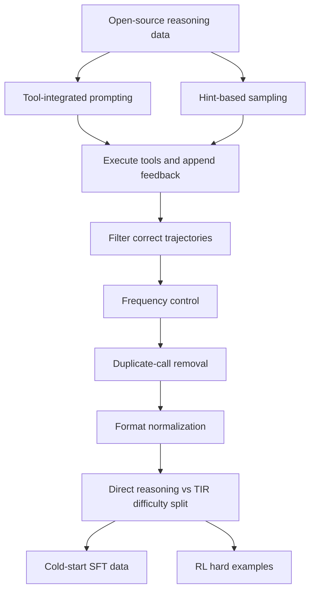
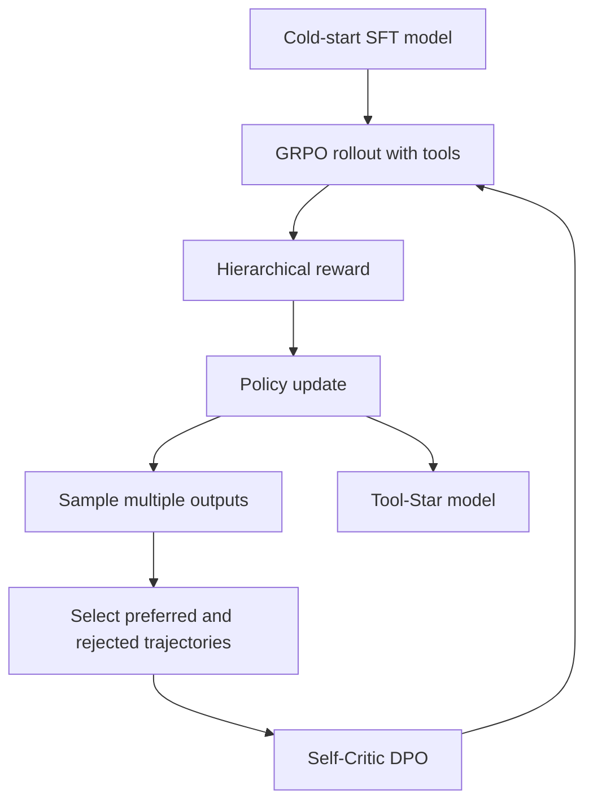

# Tool-Star：用自评强化学习训练多工具协作 Web Agent

### 元信息

| 项目 | 内容 |
|---|---|
| 题目 | Tool-Star: Empowering Multi-Tool Collaborative Web Agent via Reinforcement Learning |
| 类型 | SIGIR 2026 会议论文；完整技术正文参考 arXiv 版本 |
| 当前窗口证据 | SIGIR 2026 官方程序标注 ACM DL 于 2026-07-20 起可用，会议窗口为 2026-07-20 至 2026-07-24 |
| 原始链接 | https://dl.acm.org/doi/10.1145/3805712.3809712 |
| 论文正文 | https://arxiv.org/abs/2505.16410 与 https://arxiv.org/html/2505.16410 |
| 代码与数据 | https://github.com/RUC-NLPIR/Tool-Star |
| 关注方向 | 大模型 Agent；多工具调用；Agentic post-training；强化学习 |

### TL;DR

- Tool-Star 讨论的问题不是“让模型会调用一个工具”，而是让 LLM 在搜索、浏览、代码执行、调试、回滚和压缩推理链之间做多工具协作；论文把这称为 multi-tool collaborative reasoning。
- 它的核心方案是两段式 agentic post-training：先用自动合成的工具调用轨迹做 cold-start SFT，再用 Multi-Tool Self-Critic RL 做强化学习，并在 GRPO 训练周期之间插入自评式 DPO，让模型学习什么样的工具轨迹更值得奖励。
- 数据合成不是简单蒸馏强模型回答，而是把 tool-integrated prompting 与 hint-based sampling 结合起来：前者让模型自然地产生 `<search>`、`<python>` 等调用，后者在不确定表达或答案后插入验证提示，诱导模型补充检索或反思。
- 质量控制有三层：限制工具调用频率、去掉重复调用、统一调用格式；难度分层则用 direct reasoning 与 tool-integrated reasoning 的正确性组合，把“不需要工具”的样本和“工具明显有帮助”的样本分开。
- 训练/推理工具共六类：训练阶段使用搜索引擎、Web browser agent、代码解释器；推理阶段引入 code debugger、tool-use backtracer、reasoning chain refiner，用来减少代码错误、失败调用和超长推理链。
- SIGIR 程序摘要称实验覆盖 13 个 benchmark；arXiv/代码侧列出 AIME24、AIME25、GSM8K、MATH、MATH500、WebWalker、HotpotQA、2WikiMultiHopQA、Bamboogle、MuSiQue、GAIA、HLE 等主要集合。论文结论是 Tool-Star 在知识密集与计算推理任务上同时提高回答质量和工具使用效率。
- 关键数字里，论文报告 Web search 相比 local wiki search 在 2WikiMultiHopQA 上带来约 +13% F1，在 Bamboogle 上约 +8% F1；推理期工具对较弱代码模型的帮助更大，在 GSM8K 上 DotaMath 的提升超过 20%。
- 局限也很明确：arXiv 公开稿是 2025 年 5 月版本，SIGIR 版本的标题和 benchmark 数可能更新；许多结论依赖 Qwen2.5 小模型族、Bing/API 搜索、固定工具协议和训练中可用的自动判分，不能直接证明任意生产 Agent 在开放 Web 中安全可靠。

### 1. 研究问题：为什么“会用工具”仍然不等于“会协作”

- 过去的 Tool-Integrated Reasoning 通常落在三种路径上：
  - **Prompting**：通过系统提示告诉模型可以调用搜索、计算器或代码解释器。
  - **SFT**：从强模型或人工轨迹中蒸馏工具调用示范。
  - **单工具 RL**：只围绕搜索或代码执行优化 outcome reward。
- Tool-Star 的判断是：这些路径能让模型“偶尔调用正确工具”，但不足以支持真实 Web agent 的多步任务。
- 多工具协作至少多出四个难点：
  - 工具选择：什么时候直接推理，什么时候检索，什么时候运行代码。
  - 工具顺序：先查事实再计算，还是先建立公式再查参数。
  - 工具失败恢复：搜索结果不够、代码报错、上下文过长时如何回退。
  - 工具成本：每一次调用都会增加延迟、费用和错误传播机会。

<u>这篇论文真正关心的是 Agent 控制层训练，而不只是工具 API 接入。</u>

可以把作者的问题写成一个简化决策式：

```text
给定任务 q、历史推理状态 h_t、工具集合 T：
模型在每一步要决定 a_t ∈ {生成文本, 调用搜索, 浏览网页, 执行代码, 调试代码, 回滚, 压缩}
目标不是最大化调用次数，而是在答案正确、调用合理、协作有效和成本可控之间取得平衡。
```

### 2. 论证路线：从数据稀缺到奖励结构

作者的论证可以压缩成四个 claim。

| Claim | Mechanism | Evidence | Boundary |
|---|---|---|---|
| 多工具协作不能只靠 prompt | 工具调用要跨长链条维持状态、格式与反馈 | Prompting baseline 与单工具方法不足 | 没覆盖所有商用 agent runtime |
| 冷启动 SFT 必要 | 先给模型基本调用语法和反馈利用能力 | RL step 0 已高于 instruct baseline | 依赖合成数据质量 |
| RL 需要层级奖励 | 只看最终答案会奖励错误工具轨迹或工具滥用 | 论文分析 reward、validation、response length 曲线 | 奖励函数仍是人工设计 |
| 推理期工具能补救失败 | debugger、backtracer、refiner 处理代码错、调用错、长度爆炸 | DotaMath 在 GSM8K 上提升超过 20% | 弱模型收益更大，强模型收益有限 |

这个结构很重要，因为它把 agent training 从“模仿几条好轨迹”转成了“训练一个工具选择策略”。

### 3. 方法一：工具集的边界设计

Tool-Star 把工具分成训练期工具和推理期工具。

| 阶段 | 工具 | 输入 | 输出 | 设计意义 |
|---|---|---|---|---|
| 训练 | Search Engine | 查询字符串 | 检索结果 | 让模型主动补充外部事实 |
| 训练 | Web Browser Agent | URL 或搜索结果 | 摘要化网页信息 | 把粗检索变成可用证据 |
| 训练 | Code Interpreter | Python 代码 | 运行结果或错误信息 | 处理数学、枚举、计算和验证 |
| 推理 | Code Debugger | 原代码与错误 | 修正后的代码 | 降低代码调用失败率 |
| 推理 | Tool-Use Backtracer | 失败调用与历史链 | 回滚到失败前状态 | 避免错误结果污染后续推理 |
| 推理 | Reasoning Chain Refiner | 原问题与超长回答 | 压缩后的推理链 | 控制上下文长度和冗余 |

这里最值得注意的是：推理期工具不是任务工具，而是控制工具。

- Search、Browser、Python 直接服务任务。
- Debugger、Backtracer、Refiner 服务 agent 的执行稳定性。
- 这相当于把 “agent harness” 的部分能力纳入模型训练与推理协议，而不是只在外部工程代码里补丁式处理。

### 4. 方法二：自动合成工具轨迹

论文的数据合成管线分三步。

#### 4.1 数据收集与采样

作者先收集约 90K 文本推理数据和约 1K 现有 TIR 数据，然后用两种方式扩展轨迹。

| 采样方式 | 做法 | 解决的问题 |
|---|---|---|
| Tool-integrated prompting | 在 prompt 中要求模型用特殊标签产生 `<search>`、`<python>` 等调用；系统解析调用、执行工具、把 `<result>` 写回上下文 | 让模型自然产生完整工具轨迹 |
| Hint-based sampling | 在纯文本推理链中的不确定位置或答案之后插入验证提示，让模型从该位置继续工具增强推理 | 增加工具调用位置与模式的多样性 |

hint-based sampling 的价值在于它不只复制“会调用工具”的样本。

- 如果模型说 “maybe / wait / not sure”，插入 logical verification hint。
- 如果模型已经给出答案，插入 answer reflection hint。
- 截断原推理链后，让模型从 hint 处重新进入工具增强推理。
- 过滤掉最终答案错误的样本，只保留工具确实帮助完成任务的轨迹。

这一步把“工具调用”从表面格式转成了行为触发条件：不确定、需验证、需补充事实时才调用。

#### 4.2 质量归一化

作者随后做三类 normalization。

| 规则 | 被过滤的问题 | 对 Agent 的意义 |
|---|---|---|
| Tool-call frequency control | 调用次数超过阈值 | 防止模型学到“多叫工具就更安全” |
| Duplicate tool-call removal | 重复搜索同一 query 或重复运行同一代码 | 降低循环调用和无效成本 |
| Format normalization | 标签不闭合、调用格式不一致 | 保证训练信号能被解析和执行 |

这三条看似工程化，但它们直接影响 RL 的 reward。

- 如果格式错误也参与训练，模型可能把无效调用当成有效行为。
- 如果重复调用不去除，模型可能学到“刷工具次数”。
- 如果调用频率不受控，最终答案正确也可能掩盖极高执行成本。

#### 4.3 难度感知分类

作者用 direct reasoning 与 tool-integrated reasoning 的正确性，把样本分成四类。

| Direct Reasoning | Tool-Integrated Reasoning | 分类含义 | 用途 |
|---|---|---|---|
| 正确 | 正确 | 模型本来会做，工具非必要 | 构造基础冷启动样本时谨慎使用 |
| 正确 | 错误 | 工具反而干扰 | 过滤或降低权重 |
| 错误 | 正确 | 工具提供真实增益 | 适合 cold-start SFT |
| 错误 | 错误 | 高难样本 | 留给 RL 探索 |

这个分层比普通 SFT 更接近 agent 的真实问题。

- 它不是奖励所有工具调用。
- 它强调“工具在何时改变结果”。
- 它把高难样本后移到 RL，降低冷启动阶段的探索负担。

### 5. 训练框架：SFT 只是起点，Self-Critic RL 才是核心

Tool-Star 的训练有两个主阶段。

#### 5.1 Cold-start SFT

Cold-start SFT 的目标不是达到最终能力，而是让模型学会三件事。

- 正确输出工具调用标签。
- 接收 `<result>` 后继续推理。
- 在答案、检索和代码执行之间保持链条一致。

论文的训练曲线分析显示，经过 cold-start 后，1.5B 与 3B 模型在 RL step 0 的 reward 已经高于 0，validation score 也明显高于 vanilla instruct 模型。

这说明作者不是从零开始让 RL 在黑箱工具空间里乱试，而是先把模型放到一个可学习的策略区域。

#### 5.2 Multi-Tool Self-Critic RL

第二阶段用 GRPO 做基础 RL，再周期性插入 Self-Critic DPO。

可以把算法写成伪代码：

```text
Input:
  D_RL：高难工具推理样本
  πθ：当前 reasoning model
  T：外部工具集合
  R：层级奖励函数
  C：训练 cycle 数

State:
  每个 query 的生成轨迹 y
  工具调用记录 calls(y)
  工具返回 feedback(y)
  reward principle 与 reward score

For cycle = 1..C:
  1. Vanilla RL / GRPO:
     - 从 D_RL 采样 query
     - πθ 生成多条带工具调用的轨迹
     - 执行工具并把 feedback 写回轨迹
     - 用 R 计算答案、格式、工具协作等层级奖励
     - 按 GRPO 目标更新 πθ

  2. Self-Critic DPO:
     - 对同一类 query 采样多条输出
     - 选出 correct output 与 incorrect output
     - 附加 reward principle 与 reward score
     - 用 DPO 让 πθ 偏向更合理轨迹

Output:
  更会选择、组合、修复工具调用的 Tool-Star model
```

这个算法的关键不在 “GRPO” 这个名字，而在层级奖励的拆分。

| 奖励层 | 衡量内容 | 避免的失败 |
|---|---|---|
| 答案正确性 | 最终输出是否正确 | 工具链很好看但答案错 |
| 格式合法性 | 标签、调用、结果、答案是否可解析 | 训练时无法执行或对齐 |
| 工具有效性 | 调用是否真正帮助推理 | 无意义搜索或空代码执行 |
| 协作性 | 多工具是否按任务需要配合 | 只会单一工具，不能跨事实与计算 |
| 成本/稳定性 | 调用频率、重复、长度 | 滥用工具和上下文膨胀 |

<u>这让 reward 从单点 outcome 变成了执行过程的约束集合。</u>

### 6. 公式化理解：Tool-Star 学的是策略，而不是答案模板

论文给出的形式化可以用更可读的方式解释。

```text
q：用户问题
T：工具集合
h_t：第 t 步之前的推理文本、工具调用和工具反馈
a_t：模型在第 t 步的动作，可以是生成 token，也可以是调用工具
o_t：工具反馈，例如搜索摘要、网页内容、Python 运行结果或错误
y：完整轨迹，包括思考、调用、反馈和最终答案
R(y)：层级奖励
```

模型要优化的是：

```text
maximize  E_{y ~ πθ(.|q,T)} [ R(y) - β · KL(πθ || πref) ]
```

变量含义：

- `πθ` 是当前 Tool-Star 策略。
- `πref` 是参考策略，用来防止 RL 训练偏离过大。
- `R(y)` 不只看答案，也看工具格式、调用有效性和协作质量。
- `β` 控制更新幅度，防止策略为了 reward 走向异常输出。

Self-Critic DPO 可以理解为另一类偏好约束：

```text
给定同一问题 q：
  y+ = 正确且工具轨迹更合理的输出
  y- = 错误或工具轨迹不合理的输出
训练目标：提高 πθ(y+|q) 相对 πθ(y-|q) 的概率
```

这样做的意义是：模型不只是被动接受最终分数，还能从“好轨迹 / 坏轨迹”的对比中学习奖励原则。

### 7. 实验设置：知识密集任务与计算推理任务同时测

公开代码 README 给出的评测集合分成两组。

| 任务族 | 数据集 | 主要考察能力 |
|---|---|---|
| 数学/计算推理 | AIME24、AIME25、GSM8K、MATH、MATH500 | 公式建立、枚举、代码计算、答案验证 |
| QA/知识密集推理 | WebWalker、HotpotQA、2WikiMultiHopQA、Bamboogle、MuSiQue、GAIA、HLE | 检索、网页理解、多跳证据、复杂任务分解 |

作者还做了多类 baseline 对比。

| Baseline 类型 | 代表方法 | 对照意义 |
|---|---|---|
| Search-enhanced | Search-o1、Search-R1 | 只或主要强化检索工具 |
| Code-enhanced | ToRL、DotaMath | 主要强化代码解释器或数学推理 |
| Multi-tool prompting | 同格式 prompt | 测试仅靠 prompt 是否足够 |
| Multi-tool RL/SFT | ReCall 等 | 对比已有多工具训练路线 |

论文的评价重点不是单一榜单分数，而是三类问题。

- Tool-Star 是否在知识密集和计算任务上都有收益。
- 多工具协作是否比单工具增强更稳。
- 推理期修复工具是否减少工具错误并提高最终性能。

### 8. 结果解读：最有信息量的不是“赢了”，而是赢在哪里

#### 8.1 多工具胜过单工具的场景

论文声称 Tool-Star 在超过 10 个挑战 reasoning benchmark 上有效；SIGIR 程序摘要进一步写成 13 个 benchmark。

这个差异很可能来自版本更新：

- arXiv 版本是 2025-05-22 的 working-in-progress 稿。
- SIGIR/ACM 条目是 2026-07-20 当前会议窗口开放的正式论文。
- 因此本文把“13 个 benchmark”作为 SIGIR 当前摘要信息，把具体数据集解释主要建立在 arXiv 与代码仓库公开细节上。

更重要的是，Tool-Star 的优势集中在需要跨工具的任务。

- 只需背诵事实的问题，搜索工具足够。
- 只需精确计算的问题，Python 工具足够。
- 需要先查资料、再转换条件、再计算或验证的问题，才真正考验多工具协作。

#### 8.2 Web search 与 local search 的差异

作者比较了 local wiki search 与 web search。

| 对比 | 论文观察 | 可解释原因 |
|---|---|---|
| HotpotQA | Web search 没有明显提升 | 数据本身更贴近 Wikipedia 多跳问答 |
| 2WikiMultiHopQA | Web search 约 +13% F1 | Web 语料和搜索排序提供更广、更直接的证据 |
| Bamboogle | Web search 约 +8% F1 | Browser agent 能把网页内容压缩成更适合推理的片段 |

这组结果提醒我们：检索工具不是抽象等价的。

- 同样叫 search，local retriever 与 Bing/web API 的覆盖、排序、摘要粒度都不同。
- Browser agent 会把网页解析与摘要作为中间处理，等于又引入了一个证据压缩器。
- 因此 Tool-Star 的收益不能只归因于“RL 学会了搜索”，也包含工具实现质量带来的环境差异。

#### 8.3 推理期工具更像运行时防护

论文分析 code debugger、backtracer、refiner 后发现：

- 工具使用错误会显著损害推理准确率。
- 推理期工具能降低这些错误。
- 对代码能力较弱的模型，增益尤其明显；DotaMath 在 GSM8K 上提升超过 20%。
- 对 Tool-Star 这类已通过训练改善工具策略的模型，剩余错误更少，所以推理期工具的边际收益较小。

这说明训练与运行时修复不是替代关系。

| 模型状态 | 更需要什么 | 原因 |
|---|---|---|
| 完全未训练 | cold-start SFT | 先学会格式和反馈使用 |
| 会单工具 | 多工具 RL | 学会跨工具分工 |
| 工具错误频繁 | debugger/backtracer | 避免错误调用污染后文 |
| 长链条冗余 | refiner | 控制上下文长度和推理成本 |

### 9. 消融与失败信号：masking、response length 与 reward hacking

论文的一个重要观察是 tool-call masking。

- 在多工具 RL 里，如果没有适当 masking，模型的 reward score 可能快速坍塌到 -1。
- 作者把这与 strategy hacking 联系起来：模型可能利用工具反馈、格式或奖励漏洞，生成看似符合奖励但实际不可用的轨迹。
- 这与一些单工具 RL 论文的观察不同，说明多工具环境的不稳定性更高。

这个结果对 Agent 系统尤其有启发。

| 风险 | 在 Tool-Star 中的表现 | 更广泛的 Agent 含义 |
|---|---|---|
| 格式攻击 | 标签不闭合或工具结果结构混乱 | 工具协议必须可验证 |
| 奖励漏洞 | 高 reward 但低质量轨迹 | outcome reward 不够 |
| 上下文污染 | 错误工具反馈进入后续推理 | 需要回滚与证据绑定 |
| 成本失控 | 重复调用或过长链条 | 需要预算与停止规则 |

<u>多工具 Agent 的训练失败，往往不是模型“不聪明”，而是环境状态、工具协议和奖励边界没有被共同约束。</u>

### 10. Figure/Table 证据的文字化重构

本文没有本地化图片，因为公开 HTML/PDF 中的核心图表可以用表格和流程图更清楚地重构，且不需要读者查看原图才能理解主线。

#### 10.1 数据合成流程



这个流程对应论文 Figure 2 的核心含义：先用两种采样方式扩展轨迹，再通过质量和难度筛选把数据放到不同训练阶段。

#### 10.2 训练流程



这个流程对应 Appendix B 的 Algorithm 1：GRPO 和 Self-Critic DPO 交替出现，不是两条互不相干的训练线。

#### 10.3 推理案例结构

论文案例显示 Tool-Star 会根据任务不同选择工具组合。

| 任务类型 | 常见轨迹 | 作者想证明什么 |
|---|---|---|
| GAIA / Deep web exploration | 搜索 → 浏览 → 继续推理 → 代码或再搜索 | 复杂任务需要组合工具 |
| HotpotQA | 搜索或浏览为主 | 知识密集问答可能只需检索 |
| AIME / 数学题 | Python 或直接推理 | 计算任务不必强行搜索 |

这比“平均工具调用次数”更重要，因为它展示了工具选择的条件性。

### 11. 相关工作定位：Tool-Star 与几条相近路线的区别

| 路线 | 代表问题 | Tool-Star 的差异 |
|---|---|---|
| ReAct / Tool prompting | 通过 prompt 让模型边想边调用 | Tool-Star 训练策略本身，而不是只给提示 |
| Search-o1 / Search-R1 | 让模型在推理中自主搜索 | Tool-Star 同时处理搜索、浏览和代码 |
| ToRL | 用 RL 强化代码解释器 | Tool-Star 把代码放到多工具组合里 |
| ReCall | 多工具复杂任务训练 | Tool-Star 更强调数据难度分层和 self-critic 奖励学习 |
| Agent harness 工程 | 外部 orchestrator 修复错误 | Tool-Star 把一部分控制规则变成训练信号 |

这篇文章的贡献不在发明某个新工具，而在把多工具 agent 的三个层面连起来：

- 数据：怎样产生合理工具轨迹。
- 训练：怎样奖励协作而非滥用。
- 推理：怎样在运行时修复失败。

### 12. 局限与证据边界

#### 12.1 版本边界

- arXiv 版本是 2025 年 5 月提交的工作稿。
- SIGIR 2026 程序与 ACM DOI 是本轮当前窗口证据。
- 两者在标题措辞和 benchmark 数上存在轻微差异。
- 因此读者应把本文的机制细读主要视为公开 arXiv/代码版本的技术分析，把“SIGIR 当前发布”视为收录与正式可用性的时间证据。

#### 12.2 工具环境边界

Tool-Star 的效果依赖具体工具实现。

- Web search 使用外部搜索 API。
- Local search 使用离线检索器和 Wikipedia 子集。
- Browser agent 会做内容抽取和摘要。
- Python interpreter、debugger、refiner 都需要稳定沙箱和协议。

如果换成生产系统里的浏览器、内部数据库、云 API、文件系统或真实账户权限，风险形态会变化。

#### 12.3 奖励函数边界

层级奖励缓解了 outcome-only 的问题，但没有消除 reward specification 风险。

- 奖励函数仍可能漏掉安全约束。
- 工具协作奖励可能鼓励更复杂但不必要的轨迹。
- 自动判分任务比开放式研究任务更容易定义 correctness。
- Self-Critic DPO 依赖 correct / incorrect 对的选择质量。

#### 12.4 安全边界

Tool-Star 主要评估推理能力和工具使用效率，不是一个完整安全框架。

- 论文没有证明搜索结果不会被投毒。
- 没有讨论浏览器权限、凭证、文件写入或长期记忆污染。
- 没有给出 commit-time authorization、用户授权刷新或工具输出可信度绑定。
- 因此它适合解释“如何训练多工具协作”，不能直接当成“安全可部署 Agent”。

### 13. 对 Agent 研究的延伸问题

从研究者视角看，Tool-Star 最值得继续追问的不是分数，而是控制闭环。

#### 13.1 轨迹奖励能否绑定证据来源？

当前奖励主要看答案、格式和工具协作。更强的 Agent 训练可能需要引入证据绑定：

```text
每个关键 claim c_i 必须绑定 evidence e_i；
每个 evidence e_i 必须记录来源、时间、工具、摘要器版本；
最终答案如果使用 c_i，则 reward 需要检查 c_i 与 e_i 的一致性。
```

这会把 Tool-Star 的工具轨迹从“可执行”推进到“可审计”。

#### 13.2 回滚是否应该成为可学习动作？

Tool-use backtracer 在论文中是推理期工具。下一步可以问：

- 模型是否应当主动决定何时回滚？
- 回滚点如何与失败证据绑定？
- 多 agent 场景里，一个 worker 的错误输出是否应触发主 agent 重新规划？

这和安全 Agent 中的权限刷新、状态检查、commit boundary 很接近。

#### 13.3 多工具 RL 如何避免训练出“工具依赖”

如果 reward 设计不精细，模型可能学到：

- 简单问题也先搜索。
- 能心算的问题也运行代码。
- 已有答案仍反复验证。
- 通过长链条掩盖不确定性。

因此未来 benchmark 不应只看 accuracy，还应报告：

| 指标 | 含义 |
|---|---|
| tool necessity precision | 调用工具的步骤中有多少确实必要 |
| tool necessity recall | 真正需要工具的步骤中有多少被调用 |
| evidence freshness | 检索证据是否过时 |
| rollback correctness | 回滚是否回到真正错误源之前 |
| cost-normalized accuracy | 单位工具成本带来的准确率 |

#### 13.4 从 Web agent 到安全 Agent 还差什么？

Tool-Star 已经给出多工具协作训练的骨架，但安全 Agent 还需要额外状态。

- 权限状态：用户授权是否仍有效。
- 资源状态：文件、分支、数据库记录是否在执行期间变化。
- 来源状态：检索页面是否可信、是否被投毒。
- 预算状态：工具调用成本和时间是否超限。
- 审计状态：每个外部动作能否追溯到用户目标与证据。

这些状态如果只放在外部 harness 里，模型可能学不到；如果全部放进模型训练，又会受到 reward 设计和数据覆盖限制。Tool-Star 的意义在于提供了一个可扩展接口：先把工具调用协议、反馈、奖励和运行时修复统一进轨迹，再逐步加入更强的安全约束。

### 14. 结论

Tool-Star 把多工具 Agent 的核心问题从“怎么接工具”推进到“怎么训练模型选择、组合和修复工具调用”。

- 它用合成轨迹解决数据稀缺。
- 用难度分类降低冷启动难度。
- 用 cold-start SFT 建立基本协议能力。
- 用 self-critic RL 学习多工具协作奖励。
- 用推理期工具修复代码错误、调用失败和超长链条。

最有价值的结论是：多工具 Agent 的能力来自模型、工具、协议、奖励和运行时控制的共同设计。

但证据边界也必须保留：

- 它不是开放 Web 安全证明。
- 它没有解决所有工具权限和检索投毒问题。
- 它的公开细节跨 arXiv、SIGIR 程序和 GitHub 代码，版本间存在轻微差异。
- 它更适合被看作 agentic post-training 的方法模板，而不是可直接照搬的生产部署规范。

对后续研究而言，真正值得做的是把 Tool-Star 的轨迹训练扩展到更强的状态验证：证据来源、权限新鲜度、工具输出可信度、回滚边界和成本预算都应成为 reward 或 runtime monitor 的一部分。只有这样，多工具 Web Agent 才能从“会协作”走向“可审计、可控、可复现地协作”。
