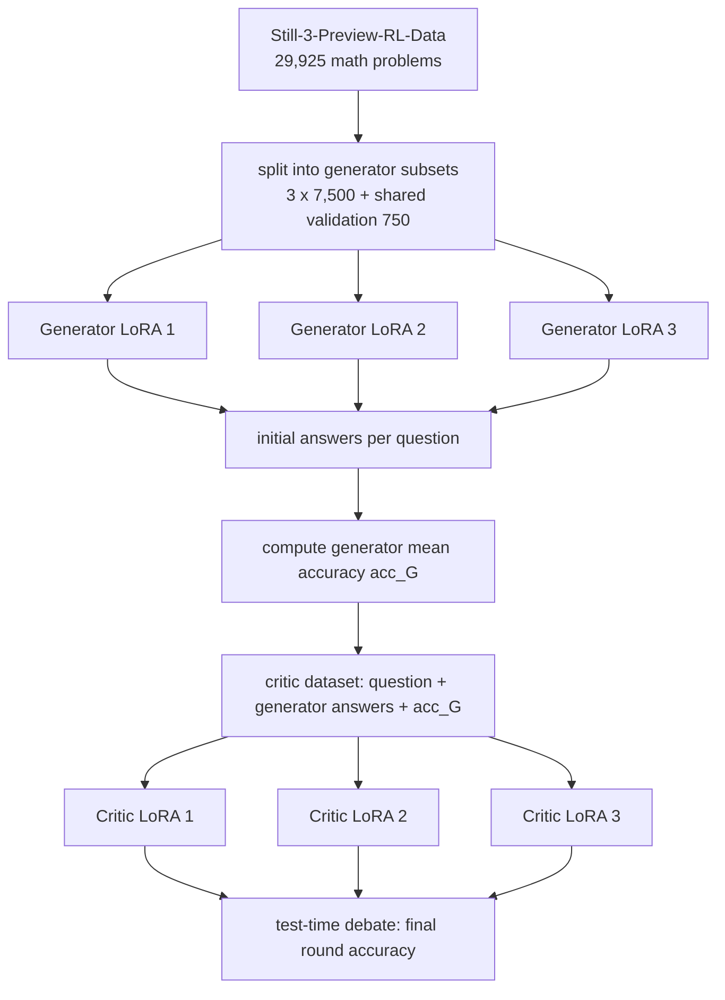

# MADA-RL：把多 Agent debate 变成小模型后训练里的反事实信用分配问题

### 元信息与 TL;DR

| 字段 | 内容 |
|---|---|
| 论文 | MADA-RL: Multi-Agent Debate-Aware Reinforcement Learning for Parameter-Efficient Reasoning in Compact Models |
| 作者 | Martino M. L. Pulici、Cuong Xuan Chu、Evgeny Kharlamov、Zifeng Ding、Volker Tresp、Yunpu Ma |
| 机构 | Bosch Center for Artificial Intelligence、LMU Munich、University of Oslo、University of Cambridge、Munich Center for Machine Learning |
| 类型 | arXiv 论文；大模型后训练；多 Agent debate；小模型数学推理 |
| 日期 | arXiv v1：2026-07-20 14:38:00 UTC |
| 原文 | <https://arxiv.org/abs/2607.18006> |
| PDF | <https://arxiv.org/pdf/2607.18006> |
| 篇幅 | 20 页，3 个 Figure，9 个 Table，2 个 Algorithm，TMLR under review |

**TL;DR：**

- **这篇文章解决的问题**：小模型（论文聚焦 1.5B、并把范围写成不超过 4B）做数学推理时，单纯扩大模型或全参数 RL 成本高，而普通 test-time debate 又只是在推理时多花算力，没有把 debate 里的纠错结构变成训练信号。
- **核心方法**：MADA-RL 把同一个基座模型拆成 3 个 generator 和 3 个 critic，所有角色只训练 LoRA adapter；generator 先独立用 GRPO 学会给初答，critic 再读“题目 + 多个 generator 初答”，用反事实 critic advantage 学会在 generator 共识错的时候纠正它。
- **关键公式**：critic 的 advantage 不是只看自己的奖励，而是 `A_C = R_C - 2 acc_G = 2(R_acc - acc_G) + R_len`；其中 `acc_G` 是同一道题上 generator ensemble 的平均正确率，所以 critic 被奖励的是“比生成器群体更会改错”。
- **主要证据**：在 Math-500、AIME 2024、AIME 2025、AMC-23、Minerva-Math 五个数学 benchmark 上，DeepSeek-R1-Distill-Qwen-1.5B 的平均准确率从 39.9% 提到 41.9%，提升 2.0 点，Welch 检验 `p < 0.001`。
- **成本画像**：MADA-RL 共训练约 `1.10e8` 个 LoRA 参数，约为 DeepScaleR/Still-3 全参数微调 `1.78e9` 的 1/16；但推理时每题要 3 个 generator 加 3 个 critic，平均 33,818 tokens/question，延迟和 token 成本是真限制。
- **边界判断**：MADA-RL 没有超过 DeepScaleR 的 44.3% 和 Still-3 的 43.1%；它证明的是“在训练参数受限时，debate-aware critic 训练有价值”，不是证明“多 Agent debate 一定比更强单模型或等预算 voting 更好”。

### 研究问题：为什么不是“再采样几次取多数票”？

论文把背景拆成两条路线：

- **后训练路线**：
  - RL、偏好学习、GRPO、DAPO 这类方法能提升推理；
  - 问题是全参数训练成本高、奖励设计脆弱、长链推理容易训练不稳；
  - 对 1.5B 到 4B 这类 compact model，这个成本更敏感。
- **测试时扩展路线**：
  - chain-of-thought、self-consistency、tree-of-thought、reflection、multi-agent debate 都能用更多推理计算换准确率；
  - 问题是它们通常不改变模型本身；
  - 多个相同模型互相看答案，未必自动学会“谁该纠错、什么时候该反对共识”。

作者的问题意识可以写成一个具体训练问题：

> 如果 debate 的收益来自“有人能发现共识错误”，训练目标就不该只奖励单个回答正确，而应该奖励 critic 在 generator 群体失败处给出正确修正。

这个设定把 MADA-RL 和普通 debate 区分开：

- 普通 debate 主要是 **inference-time composition**；
- MADA-RL 是 **post-training + inference-time composition**；
- 普通 critic 容易学习“重复正确答案”；
- MADA-RL 的 critic 被要求学习“在别人错时站出来”。

### 背景细读：作者到底在反对哪几种直觉？

论文不是简单提出一个新 acronym，而是在反对三种常见但不完整的直觉。

**直觉一：小模型推理不够强，继续扩大模型就好。**

- 这在研究上当然可行，但在 compact model 场景里成本不对称：
  - 训练预算更小；
  - 显存和部署预算更紧；
  - 很多应用只愿意承受 1.5B 到 4B 级别模型；
  - 因此“扩大模型”不是一个足够具体的后训练方案。
- MADA-RL 的回应是：
  - 不改变基座规模；
  - 只加 LoRA adapter；
  - 用多个角色化 adapter 形成系统级推理能力。

**直觉二：既然 self-consistency 有效，多采样再投票就好。**

- 投票方法隐含一个前提：
  - 多个样本的错误足够独立；
  - 正确答案能在多数中浮现；
  - 错误共识不是主要失败模式。
- 但数学推理的小模型常见问题是：
  - 多个样本共享同一误解；
  - 早期代数化简出错后后续推理一致错误；
  - 表面多数并不代表真正可靠。
- MADA-RL 的回应是：
  - 不只产生多个答案；
  - 还训练 critic 阅读多个答案；
  - 让 critic 的信用来自“超过 generator 群体”。

**直觉三：训练一个更强单模型，比多 Agent 复杂系统更稳。**

- 这也是论文承认的强基线：
  - DeepScaleR 和 Still-3 的确更高；
  - data-heavy full fine-tuning 仍是性能上界的重要路径。
- 但 MADA-RL 关心的是另一种预算约束：
  - 如果不能更新全部 1.78B 参数；
  - 如果只能训练少量 adapter；
  - 是否可以把不同 adapter 变成不同系统角色？
- 论文的答案是谨慎的：
  - 可以带来显著增益；
  - 但不能声称取代大数据全参训练；
  - 更不能忽略推理时多 agent 的成本。

### 逐段细读：每个设计在论证中承担什么功能？

| 论文段落/设计 | 表面内容 | 论证功能 |
|---|---|---|
| Introduction 的两条路线 | RL 后训练与 test-time scaling | 说明 MADA-RL 是两条路线的合成，而不是单纯 debate |
| Debate protocol | generator 初答，critic 读上一轮回答 | 定义 critic 的部署任务，为后面的训练信号服务 |
| Generator reward | 正确性加长度，正确性权重更高 | 建立可计算、低成本、不会奖励短错答案的基础奖励 |
| Critic dataset | `question + generator answers + acc_G` | 把 debate 执行轨迹转成监督/RL 可用的训练样本 |
| Counterfactual advantage | 用 generator 平均正确率做 baseline | 把“纠错”从事后观察变成训练目标 |
| Main results | MADA 高于 base 和轻量 fine-tune | 证明方法不只是 pipeline 复杂化 |
| Cost table | 参数、token、纠错率一起报 | 防止把训练参数效率误读成整体效率 |
| Ablation | rounds、agent 数、同质化、no counterfactual | 分离 debate 结构和 advantage 设计的证据强度 |
| Limitations | 等预算 baseline、理论、统计、任务范围 | 给出这篇论文不能证明的边界 |

这张表说明：

- 作者的贡献不是“发明一个新 debate 提示词”；
- 真正的中心是 **训练信号如何对应部署角色**；
- 所有实验都围绕这个中心展开：
  - 如果 critic 真的学到纠错，应看到 correction rate 提升；
  - 如果 debate 结构重要，去掉 round 或 agent 应显著掉分；
  - 如果只是 LoRA 有用，其他 LoRA baseline 应同样强，但事实不是。

### 论文主张与论证路线

| Claim | Mechanism | Evidence | Boundary |
|---|---|---|---|
| 小模型可以通过角色化 LoRA 获得推理增益 | 3 generator + 3 critic；每个角色用 disjoint split 训练 adapter | 平均准确率 39.9% -> 41.9%，`p < 0.001` | 不超过 DeepScaleR/Still-3 全参数大数据训练 |
| critic 的训练信号需要对齐 debate 任务 | 使用 `acc_G` 构造 counterfactual critic advantage | critic improvement rate 最高，为 19.6% | 去掉 counterfactual 后准确率降 0.8 点但 `p = 0.095`，单项消融不够强 |
| debate 结构本身是主要增益来源 | 多轮、多角色、多 agent 的推理协议 | 1 round 只有 36.7%，比主配置低 5.2 点；1 对 agent 低 2.6 点 | 3 round 提到 43.3%，但推理成本更高 |
| 参数效率成立，但推理效率不成立 | LoRA 只训练 `1.10e8` 参数 | gain/parameter 为 182，高于 DeepScaleR-LoRA 的 42 和 Still-3-LoRA 的 96 | tokens/question 达 33,818，延迟敏感场景难直接部署 |

这条论证的强处在于：

- 不把最高分包装成唯一目标；
- 直接承认强 baseline 仍然赢；
- 把贡献收窄到 **训练预算受限的小模型后训练**；
- 用消融把“训练出来的纠错行为”和“单纯多生成一些 tokens”分开。

### 方法机制：MADA-RL 的角色和数据流

MADA-RL 的系统可以分成两个阶段：

1. **训练 generator**：
   - 输入：数学题 `x` 和标准答案 `y`；
   - 训练目标：生成正确且不过度冗长的初始解答；
   - 训练方式：GRPO + LoRA；
   - 数据切分：3 个 generator 各拿 disjoint subset，制造 agent diversity。
2. **训练 critic**：
   - 先让 generator 对同一道题各自给出初答；
   - 构造 critic 输入 `x' = [x; y_hat_1; y_hat_2; ...; y_hat_N]`；
   - 同时记录 generator 平均正确率 `acc_G`；
   - critic 用 `x'`、标准答案 `y`、`acc_G` 学习纠错。

用流程图表示：



这个图里最重要的节点不是“多 Agent”本身，而是 `acc_G`：

- 如果 3 个 generator 都对了，critic 再对也只是跟随共识；
- 如果 3 个 generator 都错了，critic 对了才是强证据；
- 如果 generator 一半对一半错，critic 的信用应介于两者之间；
- 因此每个样本的 baseline 必须随 generator 在该样本上的表现变化。

### Debate 协议：轻量，但不等于真正争辩

作者很小心地区分了自己的 debate 含义：

- 不是 Irving-style 的 adversarial debate；
- 没有外部 judge 仲裁；
- 没有复杂 persuasion game；
- 只是多模型先并行生成，再让 critic 读上一轮回答并更新答案。

测试时协议可以写成伪代码：

```text
Input:
  base model A
  generator adapters L_G[1..N]
  critic adapters L_C[1..M]
  dataset D = {(x, y)}
  debate rounds R

State:
  G_i = A + L_G[i]
  C_j = A + L_C[j]
  success = 0

For each (x, y) in D:
  Round 1:
    for each generator G_i:
      answer[1][i] = G_i(x)

  For round r = 2..R:
    context = concatenate(x, answer[r-1][all agents])
    for each critic C_j:
      answer[r][j] = C_j(context)

  Final:
    success += count(answer[R][j] equivalent to y)

Output:
  accuracy = success / (M * |D|)
```

这个协议的设计取舍很明确：

- **保留**：
  - 多个 generator 的初始多样性；
  - critic 对前一轮答案的条件化修正；
  - 最后一轮 critic answer 的准确率评价。
- **省略**：
  - 摘要器；
  - 复杂 judge；
  - 多轮长辩论里的显式论点树；
  - 跨 agent 的联合梯度或集中式协调。

作者省略摘要器的原因也很实用：

- 当前只有少数 agent；
- 输出能放进 context window；
- 额外 summarizer 会增加模型、显存和错误传播；
- 因此先把方法收窄到一个可解释的轻量协议。

### 奖励函数：先让 generator 正确而简洁

generator 的奖励由两部分组成：

| 奖励项 | 定义 | 作用 |
|---|---|---|
| `R_acc(y_hat, y)` | 预测答案与标准答案符号等价时为 1，否则为 0 | 让模型解决数学题 |
| `R_len(y_hat, y)` | 正确答案里越短越好；错误答案不因短而得正奖励 | 防止 RL 后变成长篇冗余 |
| `R_G` | `2 R_acc + R_len` | 正确性权重是长度的两倍 |

公式写法：

```text
R_acc(y_hat, y) = 1(y_hat equivalent to y)

lambda = 0.5 - (len(y_hat) - min_i len(y_hat_i)) /
               (max_i len(y_hat_i) - min_i len(y_hat_i))

R_len(y_hat, y) =
  lambda,        if y_hat equivalent to y
  min(0,lambda), if y_hat not equivalent to y

R_G(y_hat, y) = 2 R_acc(y_hat, y) + R_len(y_hat, y)
```

这里有两个细节值得注意：

- “等价”不是字符串完全相同，而是用 LaTeX-to-SymPy 转换和数学验证做 symbolic equivalence；
- 错误答案不能靠变短拿正分，避免模型学到“输出一个短错答案也有奖励”的漏洞。

### 反事实 critic advantage：整篇最关键的训练信号

critic 的奖励也先用同样的正确性加长度：

```text
R_C(y_hat, y) = 2 R_acc(y_hat, y) + R_len(y_hat, y)
```

但 critic 的 advantage 不是直接用 `R_C`，而是减去 generator 群体在同一样本上的 baseline：

```text
A_C(y_hat, y, acc_G)
  = R_C(y_hat, y) - 2 acc_G
  = 2(R_acc(y_hat, y) - acc_G) + R_len(y_hat, y)
```

变量解释：

| 变量 | 含义 | 为什么重要 |
|---|---|---|
| `y_hat` | critic 最终输出 | 被训练的动作 |
| `y` | 标准答案 | 用于数学等价判断 |
| `acc_G` | 同题上 generator ensemble 的平均正确率 | 动态 baseline |
| `R_acc - acc_G` | critic 是否超过 generator 平均水平 | 体现“纠错”而不只是“答对” |
| `R_len` | 长度奖励 | 保持输出简洁 |

这个 advantage 产生三类不同训练信号：

- **generator 全错，critic 对**：
  - `acc_G = 0`；
  - critic 获得最高正向信用；
  - 这正是系统最需要学习的情形。
- **generator 全对，critic 也对**：
  - `acc_G = 1`；
  - critic 的额外信用很小；
  - 系统不把“复述共识”当作核心能力。
- **generator 部分正确，critic 错**：
  - critic 低于已有群体信号；
  - advantage 变差；
  - 训练会惩罚不必要的错误修正。

这就是“counterfactual”的含义：

- 比较对象不是一个固定均值；
- 而是“如果只依赖 generator 群体，这道题会做得怎样”；
- critic 的学习目标是超越这个样本级反事实基线。

### 反事实信号的潜在失败模式

这个公式很简洁，但它也带来几个值得警惕的失败模式。

**失败模式一：generator 相关性太高。**

- 如果 3 个 generator 虽然训练在 disjoint subset 上，但错误模式高度相似：
  - `acc_G` 会把一致错误当成强背景事实；
  - critic 的可用正样本集中在少量“generator 错、critic 可纠正”的题；
  - 训练信号可能变稀。
- 论文用 agent diversity 缓解这个问题：
  - 不同 generator 独立训练；
  - 不同 critic 也分开训练；
  - 但 homogeneous 消融没有显著差异，说明多样性证据仍偏弱。

**失败模式二：critic 学会反共识而不是纠错。**

- 如果奖励设计不稳，critic 可能形成一种错误策略：
  - generator 多数对时故意改答案；
  - generator 多数错时随机反驳；
  - 只追求不同而不是正确。
- MADA-RL 用 `R_acc` 防止这种偏移：
  - critic 必须最终答对才有核心奖励；
  - `R_acc - acc_G` 不是“与 generator 不同”，而是“正确性超过 generator 平均”。

**失败模式三：长度奖励与数学推理冲突。**

- 数学题需要足够步骤；
- 过强长度惩罚可能压缩推理；
- 过弱长度惩罚又会让 RL 输出膨胀。
- 论文的处理方式是：
  - 正确性权重为 2；
  - 长度奖励只在正确答案中区分简洁度；
  - 错误答案不会因为短而拿正向长度奖励。

**失败模式四：改错率指标可能掩盖题目难度。**

- critic improvement rate 说的是“修正 generator consensus 错误”的比例；
- 但如果某些题 generator 普遍做错且 critic 也做错，指标不会告诉我们为什么；
- 如果某些题太简单，generator 已经全对，critic 也没有展示纠错能力的机会。
- 因此后续最好补充：
  - 按题目难度分桶；
  - 按 generator agreement level 分桶；
  - 分析 critic 何时保持、何时修改、何时破坏正确答案。

这些失败模式也解释了为什么本文没有把 counterfactual advantage 说成完全闭环：

- 准确率消融还没有强显著；
- 机制指标更有说服力；
- 但真正的因果解释仍需要更细粒度的轨迹分析。

### 实验设置：模型、数据和 benchmark

| 维度 | 论文设置 |
|---|---|
| 基座模型 | DeepSeek-R1-Distill-Qwen-1.5B |
| 训练算法 | GRPO |
| 参数高效方法 | LoRA adapter |
| agent 数量 | 3 个 generator + 3 个 critic |
| 训练数据 | Still-3-Preview-RL-Data，29,925 个数学推理问题 |
| 数据切分 | 3 个 7,500 题 disjoint subset；共享验证集 750 题 |
| 评测指标 | simple accuracy，答案通过符号等价判断 |
| 统计检验 | 每个模型 10 seeds；对五个 benchmark 的 per-seed average accuracy 做 Welch two-sample t-test |
| 计算环境 | Red Hat Enterprise Linux 9.5，32GB RAM，单张 H200，141GB VRAM |

五个 benchmark：

- **Math-500**：MATH 的代表性子集，覆盖竞赛级数学题；
- **AIME 2024**：美国邀请数学考试题；
- **AIME 2025**：同类高难多步推理题；
- **AMC-23**：相对短一些，但仍需严谨数学推理；
- **Minerva-Math**：大学级数学和 STEM 符号推理。

主要 baseline：

- DeepSeek-R1-Distill-Qwen-1.5B；
- Still-3；
- DeepScaleR；
- Open-RS1、Open-RS2、Open-RS3；
- Tina；
- 作者还用 LoRA 复训了 DeepScaleR 和 Still-3，得到 DeepScaleR-LoRA 与 Still-3-LoRA，便于比较同等参数高效设定。

### 复现视角：如果要复做这篇，最容易漏掉什么？

从复现角度看，MADA-RL 的难点不在“能否跑一个 GRPO”，而在几个容易被省略的协议细节。

| 复现要点 | 容易出错的做法 | 为什么会影响结论 |
|---|---|---|
| disjoint data split | 让所有 generator 看到同一批训练题 | 会降低角色多样性，混淆多 agent 收益来源 |
| critic dataset construction | 只给 critic 原题，不给 generator 初答 | critic 不再学习部署时真实输入分布 |
| `acc_G` 记录 | 只记录最终正确/错误，不记录 generator 平均正确率 | 无法构造反事实 advantage |
| symbolic equivalence | 用字符串完全匹配数学答案 | 会把格式差异误判为错误，污染 RL reward |
| matched protocol baseline | baseline 只单次生成，MADA 多 agent 多轮 | 会把推理预算差异误读成训练方法优势 |
| seed-level statistics | 只报单次平均 | 无法判断 2 点提升是否稳定 |

一个更严格的复现计划应包括：

1. 固定基座模型、prompt、temperature、max tokens；
2. 对所有 baseline 使用同样的 generator/critic 数量和 rounds；
3. 同时报告 single-agent、multi-agent、matched-token voting；
4. 把每题的 generator agreement、critic 是否修改、修改后是否正确写入日志；
5. 对每个 benchmark 分别做 paired bootstrap；
6. 公开 adapter、训练脚本、评测脚本和 raw generations。

这也指出本文最有价值的开放数据并不是最终表格，而是轨迹级日志：

- 哪些题 generator 全错但 critic 修对；
- 哪些题 generator 已对但 critic 改错；
- 哪些题三轮 debate 才修正；
- 哪些题越辩越坏；
- 哪些错误类型被反事实 advantage 明显减少。

### 主结果：MADA 赢了哪些，没赢哪些？

Table 1 的平均准确率可以压缩成这张表：

| Model | Average accuracy | 与 MADA 的关系 |
|---|---:|---|
| DeepSeek-R1 | 39.9 ± 0.3 | MADA 高 2.0 点，`p < 0.001` |
| Still-3 | 43.1 ± 0.4 | MADA 低 1.3 点，`p = 0.020` |
| DeepScaleR | 44.3 ± 0.3 | MADA 低 2.4 点，`p < 0.001` |
| Open-RS1 | 40.4 ± 0.4 | MADA 高 1.5 点，`p = 0.011` |
| Open-RS2 | 39.4 ± 0.3 | MADA 高 2.5 点，`p < 0.001` |
| Open-RS3 | 40.4 ± 0.3 | MADA 高 1.4 点，`p = 0.006` |
| Tina | 39.8 ± 0.3 | MADA 高 2.1 点，`p < 0.001` |
| Still-3-LoRA | 41.3 ± 0.4 | MADA 高 0.6 点，但 `p = 0.280` |
| DeepScaleR-LoRA | 40.5 ± 0.4 | MADA 高 1.4 点，`p = 0.015` |
| MADA | 41.9 ± 0.3 | 主方法 |

逐 benchmark 的 MADA 分数：

| Benchmark | MADA accuracy |
|---|---:|
| Math-500 | 72.0 ± 0.2 |
| AIME 2024 | 26.2 ± 0.7 |
| AIME 2025 | 20.0 ± 0.9 |
| AMC-23 | 68.7 ± 1.2 |
| Minerva-Math | 22.5 ± 0.3 |
| Average | 41.9 ± 0.3 |

读这个结果要避免两个误读：

- **不是 SOTA 声明**：
  - DeepScaleR 和 Still-3 仍然更强；
  - 作者没有遮掩这个差距；
  - 这反而让论文的 claim 更可信。
- **不是普通 LoRA 都有效**：
  - Tina 也是 LoRA 变体，但平均 39.8；
  - DeepScaleR-LoRA 为 40.5；
  - Still-3-LoRA 为 41.3；
  - MADA 的优势来自角色训练和 debate-aware critic，而不只是“换成 LoRA”。

### 成本结果：参数效率和推理成本分开看

Table 3 的重点是把训练成本和推理成本拆开：

| Model | Trainable parameters | Gain/parameter | Tokens/question | Critic improvement rate |
|---|---:|---:|---:|---:|
| DeepSeek-R1 | - | - | 30,221 | 18.5 |
| DeepScaleR | `1.78e9` | 25 | 25,522 | 16.9 |
| DeepScaleR-LoRA | `1.48e8` | 42 | 30,763 | 18.3 |
| Still-3-LoRA | `1.48e8` | 96 | 33,865 | 18.8 |
| MADA | `1.10e8` | 182 | 33,818 | 19.6 |

这里的关键判断是：

- **训练参数效率强**：
  - 每个 agent 约 18.5M LoRA 参数；
  - 6 个 agent 合计约 110M；
  - 比全参数 baseline 少约 16 倍；
  - gain/parameter 在表中最高。
- **推理成本不轻**：
  - 每题要跑多个 agent；
  - 2 轮、3 generator、3 critic；
  - 平均 tokens/question 与 Still-3-LoRA 接近，且明显高于 DeepScaleR；
  - 论文的效率 claim 只能指训练参数，不应外推成端到端低成本。
- **critic improvement rate 是机制证据**：
  - MADA 的 19.6% 是所有模型里最高；
  - 这说明 critic 确实更常把 generator consensus 的错误修正回来；
  - 它支撑“反事实 advantage 学到纠错角色”，而不是只靠更多 token 搜索。

### 消融：哪一部分真的重要？

Table 4 给了主配置与若干消融：

| Setting | Accuracy | 相对主配置 | p 值 |
|---|---:|---:|---:|
| 主配置：2 rounds，3 generators + 3 critics | 41.9 ± 0.3 | - | - |
| 1 round | 36.7 ± 0.3 | -5.2 | `< 0.001` |
| 3 rounds | 43.3 ± 0.4 | +1.4 | 0.016 |
| 1 generator + 1 critic | 39.3 ± 0.3 | -2.6 | `< 0.001` |
| 2 generators + 2 critics | 41.0 ± 0.2 | -0.9 | 0.050 |
| Homogeneous checkpoints | 41.3 ± 0.2 | -0.6 | 0.166 |
| No counterfactual | 41.1 ± 0.3 | -0.8 | 0.095 |

从消融能得到四个层次的结论：

- **最稳的是 debate structure**：
  - 1 round 掉 5.2 点；
  - 1 对 agent 掉 2.6 点；
  - 这两个都是强显著。
- **更多轮数还能涨，但成本继续涨**：
  - 3 rounds 到 43.3；
  - 但这会进一步推高推理 token 和 latency。
- **agent diversity 可能有用，但证据不强**：
  - homogeneous 低 0.6 点；
  - `p = 0.166`，不能当成可靠结论。
- **counterfactual advantage 的准确率消融边界更细**：
  - no counterfactual 低 0.8 点；
  - `p = 0.095`，没有达到常规显著；
  - 作者因此没有只靠这项准确率消融立论，而是结合 critic improvement rate 作为机制证据。

这个写法很重要：

- 如果只看 end-task accuracy，反事实 advantage 的证据是方向一致但未充分显著；
- 如果看角色行为，MADA 的 critic correction 更强；
- 所以更稳的表述是“counterfactual advantage 支持了纠错机制”，而不是“单项消融已经证明它必不可少”。

### Figure 与 Table 证据怎么读？

| 证据对象 | 支撑什么 | 不能证明什么 |
|---|---|---|
| Figure 1 | 展示多 Agent debate：generator 初答，critic 多轮修正 | 不证明该协议本身优于 voting 或 LLM-as-judge |
| Figure 2 | 展示训练 pipeline：generator 先训，critic 用 generator outputs 与 `acc_G` 再训 | 不证明 disjoint split 是最佳数据分配 |
| Figure 3 | MADA 位于 trainable-parameter vs accuracy 的 Pareto front | 不证明端到端推理成本也高效 |
| Table 1 | MADA 对 base 和轻量 fine-tune 有稳定提升 | 不证明超过 data-heavy full fine-tuning |
| Table 2 | MADA 相对多 baseline 的 Welch 检验 | 多重比较未校正，作者也把完整 pairwise matrix 视为探索性 |
| Table 3 | 参数、token、critic improvement rate 的成本画像 | tokens/question 只是近似推理成本，不等于真实延迟/吞吐 |
| Table 4 | debate rounds、agent 数、homogeneous、no counterfactual 消融 | 不能完全分离数据多样性、role prompt、adapter 初始化等因素 |
| Table 5 | 去掉 debate 后所有模型下降，MADA 下降最大 | 说明 MADA 依赖 debate，但也意味着单模型部署收益有限 |

最有价值的证据组合不是单张表，而是：

1. Table 1/2 证明主结果确有提升；
2. Table 3 证明提升更像“训练参数效率”而不是“推理便宜”；
3. Table 4/5 证明 debate 结构是主要驱动；
4. critic improvement rate 证明 critic 的确学到更多纠错行为。

### 相关工作位置：MADA-RL 夹在 RL、debate 和小模型之间

论文把自己放在三条线的交汇处：

- **RL for reasoning**：
  - GRPO、DAPO、VAPO 等都在试图稳定长链推理 RL；
  - MADA-RL 不做 token-level value model，也不加复杂 verifier；
  - 它把 answer-level correctness 和 debate-derived statistic 合成 critic advantage。
- **multi-agent debate**：
  - Du et al. 式 debate 强调多实例互相暴露答案；
  - Irving 式 debate 更接近 scalable oversight；
  - MADA-RL 借用的是“多答案修正”结构，不声称做了强对抗审判。
- **compact-model efficient RL**：
  - Tina、Oreo、MARFT 等都在探索小模型或多 agent RL；
  - MADA-RL 的差异是角色独立、LoRA 轻量、局部 credit assignment；
  - 代价是推理时仍然需要多个 agent 调用。

因此它不是一个通用 Agent 编排框架，也不是数学推理最终模型，而是一个具体后训练范式：

```text
小模型 + LoRA + GRPO
  + generator/critic role specialization
  + per-instance generator accuracy baseline
  + lightweight debate deployment
= 训练参数受限时的纠错型多 Agent 推理系统
```

### 失败案例与局限：最值得继续追问的部分

作者在结论里列出的局限很直接，可以分成五类：

- **缺少等推理预算 baseline**：
  - 还没有和 training-free debate、voting、LLM-as-judge 在 matched inference budget 下比较；
  - 所以不能说 MADA-RL 优于“同样花这么多推理 tokens 的强单模型策略”。
- **缺少理论分析**：
  - 反事实 advantage 的收敛性质没有分析；
  - 与标准 GRPO 相比是否降低或增加 gradient variance，也没有理论证明。
- **统计检验仍可加强**：
  - 主文用 per-seed average accuracy 的 Welch test；
  - 未来还需要 per-benchmark paired tests、bootstrap intervals、多重比较校正。
- **任务范围很窄**：
  - 只测 1.5B 数学推理；
  - 没测 4B 附近模型；
  - 没测科学推理、规划、工具使用或真实 agent workflow。
- **推理延迟明显**：
  - 多轮多 agent 会放大 token 成本；
  - 作者提出可把 debate distilled 成单模型，但本文还没有实现。

这些局限不削弱论文的主要价值，反而定义了它的真实适用域：

- 适合训练预算紧、可以接受多模型推理的研究场景；
- 适合研究“critic 如何学会纠错”；
- 不适合直接宣称低延迟在线服务可用；
- 不适合用作“multi-agent debate 一定优于单模型扩展”的证据。

### 可迁移问题：从数学推理到 Agent 后训练

MADA-RL 虽然只做数学题，但它提出的训练形态可以迁移到更广义的 Agent 系统。

| 数学推理里的对象 | Agent 系统里的类比 | 需要替换的信号 |
|---|---|---|
| 标准答案 `y` | 单元测试、集成测试、安全策略、人工验收 | 从 symbolic equivalence 换成 verifier 或 judge |
| generator 初答 | 初始计划、代码补丁、工具调用序列 | 需要记录执行轨迹 |
| critic 修正 | reviewer、planner、security monitor、repair agent | 需要定义“修正成功” |
| `acc_G` | 初始方案的通过率、风险分、测试通过比例 | 从平均正确率换成任务级 baseline |
| critic improvement rate | reviewer 修复率、漏洞拦截率、失败恢复率 | 需要按失败类型分桶 |

迁移时最难的是 reward 设计：

- 数学题有明确答案；
- 代码任务有测试，但测试不完备；
- 安全任务有违规信号，但误报和漏报都重要；
- 工具调用任务有成功率，但还涉及成本、权限和副作用。

因此，真正可迁移的不是公式里的 `R_acc`，而是公式的结构：

```text
角色奖励 = 自身任务表现 - 当前系统默认方案的表现
```

换句话说：

- reviewer 不应因“同意一个本来就正确的补丁”拿满分；
- security monitor 不应只因“总是报警”拿高分；
- repair agent 不应只因“改动很多”被奖励；
- critic 的信用应来自它相对原方案带来的净改进。

这对 Agent 后训练很关键：

- 多 Agent 系统经常有 planner、executor、critic、memory、verifier；
- 如果所有角色都用同一奖励，系统会学出职责混淆；
- 如果奖励按部署角色分解，就能更清楚地训练“何时生成、何时质疑、何时保持沉默”。

### 对今天 Daily Report 主题谱系的位置判断

放在近期 Agent/安全/后训练论文里，MADA-RL 的位置比较独特：

- 它不像 FlashRT 那样关注 coding agent 的真实部署流程；
- 也不像 Adaptive Adversaries 那样关注多轮攻击者安全评测；
- 它更接近“后训练算法 + 多 Agent 推理协议”的交叉点；
- 对 Daily Report 的价值在于补齐本周主题中的 post-training 侧：
  - 不是 agent harness 如何部署；
  - 不是 agent 如何被攻击；
  - 而是 agent 角色如何通过反事实训练信号被塑形。

如果把本周相关主题放在一条线里：

```text
Agent 部署复杂性
  -> Agent 安全与攻击面
  -> Agent harness/trajectory 质量
  -> MADA-RL: 角色化后训练与纠错 credit assignment
```

MADA-RL 回答的是最后一个问题：

- 当系统里已经有多个角色时；
- 怎样让每个角色不是靠 prompt 扮演职责；
- 而是在训练目标上真正学习自己的职责。

### 研究者视角：这篇对后训练和 Agent 系统的启发

**第一，后训练目标要匹配系统角色。**

- 如果一个模型部署时承担 generator，就奖励它给出正确、简洁的初答；
- 如果一个模型部署时承担 critic，就奖励它在其他 agent 错时纠正；
- 同一个 base model 加不同 adapter，可以对应不同系统职责。

**第二，多 Agent 的关键不只是“多样性”，而是信用分配。**

- 多个 agent 给出不同答案只是表面；
- 真正难的是判断哪个角色在什么样本上应该获得训练信用；
- `acc_G` 是一个非常便宜但有效的 role-conditioned baseline。

**第三，参数效率和推理效率必须分开报告。**

- MADA-RL 在训练参数上很省；
- 但推理时用 6 个 agent，token 成本高；
- 这提示后训练论文不能只写“parameter-efficient”，还要写清 deployment cost。

**第四，critic improvement rate 是一个值得保留的诊断指标。**

- 只看最终准确率会掩盖 critic 是否真的在纠错；
- improvement rate 直接问：critic 是否把 generator consensus 的错题修回来；
- 对 Agent 安全、代码审查、工具调用纠偏，也可以设计类似指标。

**第五，下一步最关键的实验不是再堆一个 benchmark。**

更有价值的问题是：

- 在同样 33k tokens/question 预算下，MADA-RL 是否优于 self-consistency？
- 如果把 critic 的纠错轨迹蒸馏回一个模型，能否保留 19.6% 的 correction 行为？
- 对工具调用、规划、代码修复这类非数学任务，`acc_G` 能否替换成 verifier score、test pass rate、human rubric 或 security violation score？
- 如果 generator 本身很强，critic 的反事实 baseline 会不会让训练信号过稀？
- 如果 generator 输出高度相关，`acc_G` 是否会高估共识可靠性？

### 结论

MADA-RL 的贡献可以压缩成一句话：

> 它把 multi-agent debate 从“测试时多叫几个模型”推进到“用 generator 群体表现构造 critic 的反事实训练信号”。

最稳的结论是：

- 对 DeepSeek-R1-Distill-Qwen-1.5B，MADA-RL 在五个数学 benchmark 上从 39.9% 提到 41.9%；
- 它用约 1.10e8 个 LoRA 参数进入 accuracy-trainable-parameter Pareto front；
- 它没有超过 DeepScaleR/Still-3 这类 data-heavy full fine-tuning；
- 它的主要机制证据来自 debate 消融和 19.6% critic improvement rate；
- 它的主要工程边界是 33,818 tokens/question 的推理成本。

对后训练研究来说，这篇最值得带走的不是“多 Agent 一定更强”，而是：

- 角色化 adapter 可以让同一个小模型承担不同推理职责；
- 训练信号可以直接利用系统执行过程中的反事实统计；
- debate 的价值应通过纠错率、成本和消融一起评价，而不是只看最终平均准确率。
