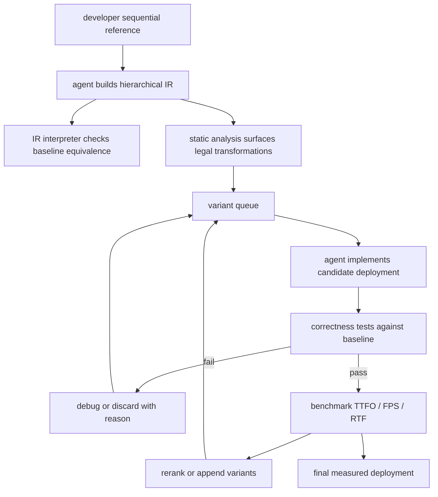

# FlashRT：把 coding agent 变成实时多模态服务系统的部署工程师

### 元信息

| 字段 | 内容 |
|---|---|
| 论文 | FlashRT: Agent Harness for Guiding Agents to Deploy Real-Time Multimodal Applications |
| 作者 | Krish Agarwal, Zhuoming Chen, Yanyuan Qin, Zhenyu Gu, Atri Rudra, Beidi Chen |
| 机构 | Carnegie Mellon University, AMD, University at Buffalo |
| 日期 | arXiv v1 提交于 2026-07-20 17:12:28 UTC |
| 原始链接 | https://arxiv.org/abs/2607.18171 |
| PDF | https://arxiv.org/pdf/2607.18171 |
| 项目页 | https://infini-ai-lab.github.io/flashrt-blog |
| 代码状态 | 论文给出 `https://github.com/Infini-AI-Lab/FlashRT`，本轮访问返回 repository not found，因此复现性需要等待仓库公开或作者补充 |

### TL;DR

- **FlashRT 研究的问题**：实时语音 Agent、视频世界模型、实时视频编辑这类多模态应用，不是一个普通 LLM serving 问题。它们由 ASR、LLM、TTS、DiT、VAE、Vocoder、SAM 等异构模块组成，部署时要同时决定 **GPU 放置、模块拆分、流式边、跨 batch pipeline、模型内部并行**，固定框架很难覆盖每个应用的最佳粒度。
- **核心方法**：作者把 coding agent 包进一个专门的 agent harness。它不让 agent 一步把参考实现改成优化实现，而是先把顺序单 GPU 程序降成层次化 IR，再用静态分析和顺序解释器验证 IR，最后进入 measurement-gated optimization loop：提出变体、实现、对齐 baseline 输出、跑 benchmark、根据测量结果重排候选队列。
- **关键机制**：IR 明确三类信息：层次化 graph、节点持久状态读写、边的 blocking/streaming 属性。这样 agent 才能看见“DiT 与 VAE 无共享状态，可拆到不同 GPU 并跨 batch pipeline”“TTS 输出 chunk 可流入 S2V”“某些路径应该 co-locate 降低首帧延迟”等部署机会。
- **实验设置**：每个任务给 agent 一个同步、单 GPU、无跨组件 streaming 的参考实现和 GPU budget；agent 使用 Claude Code + Claude Opus 4.8，adaptive thinking effort=max，Auto permission mode，隔离 workspace；每个 session 从零开始，没有跨应用记忆，也没有硬件专属提示。
- **关键数字**：在 NVIDIA B200 上，面对面 LiveAvatar conversational agent 从 107.92 秒顺序 baseline 降到约 1.57-1.66 秒，接近 **70x latency reduction**；视频背景编辑的 frame rate 从 6.82 FPS 到 19.41 FPS，约 **2.8x throughput improvement**。在 AMD MI355X 上，峰值吞吐提升到 **3.6x**；Qwen3-Omni 上 FlashRT 为 0.276 秒，vLLM-Omni 为 0.779 秒，论文口径是 **65% latency reduction**，同时 RTF < 1。
- **最值得关注的结论**：FlashRT 把“agent 是否会写高性能系统代码”改写成“harness 是否能把搜索空间显式化，并用真实应用测量约束 agent”。这比直接 prompt coding agent 更接近可审计的系统工程。
- **局限**：论文只测试一个 agent 配置，未集成 LLM kernel optimization agents；代码仓库本轮不可访问；实验依赖 B200/MI355X 大节点、作者提供的参考实现和 benchmark harness，外部复现成本高；agent 使用 Auto permission mode 的安全边界也没有作为主要实验对象。

### 研究问题：为什么实时多模态部署不是普通 serving？

- 普通文本 LLM serving 的核心负载通常围绕 prefill、decode、KV cache、batching、scheduler 和显存占用展开。
- FlashRT 关注的实时多模态应用更像一个异构流水线：
  - 语音输入可能先经过 ASR。
  - 文本响应可能由 LLM 生成。
  - 音频输出可能由 TTS 或 Talker/Vocoder 生成。
  - 视频输出可能由 DiT、VAE 或 avatar 模型生成。
  - 实时编辑还可能并行跑 SAM 3 这类 segmentation path。
- 这些模块的计算形态不同：
  - LLM 是 autoregressive token generation。
  - DiT 可能有扩散步、sequence parallelism 和 chunk-level pipeline。
  - VAE/Vocoder 更像后处理 stage。
  - ASR、SAM、composition path 可能与主生成路径异步。
- 因此，一个“固定 stage graph + 固定 disaggregation policy”的系统不一定能覆盖所有目标：
  - 如果目标是首帧/首音频延迟，co-location 可能减少通信和同步。
  - 如果目标是持续 FPS 或 audio streaming，disaggregation 可能让不同 batch 在不同资源上重叠。
  - 如果模型内部没有共享 KV cache，pipeline parallelism 可能比简单 sequence parallelism 更有吞吐优势。

### 论文主张与论证路线

| 层次 | 作者主张 | 机制 | 证据 | 边界 |
|---|---|---|---|---|
| 问题层 | 多模态实时部署需要应用特定搜索 | 任务图、状态依赖、通信代价和 GPU 放置耦合 | 形式化为 deployment search，并给出 NP-hard 归约 | 形式化抽象仍简化了真实系统中的 runtime jitter、队列和网络 |
| Agent 层 | 直接让 agent 优化代码会漏掉优化轴 | naive agent 只找到 streaming 或只找到 model-level 并行，不会稳定组合 | LiveAvatar case study 展示两类失败 | case study 不是大规模统计，主要说明设计动机 |
| Harness 层 | chain-of-program 能让 agent 看见搜索空间 | 顺序参考实现 -> 层次 IR -> 静态分析 -> 候选部署 | IR 包含 graph hierarchy、state annotation、streaming annotation | IR 正确性依赖 agent 生成质量和解释器测试覆盖 |
| 验证层 | 测量门控循环能约束 agent 幻觉 | 实现变体后与 baseline 比输出，再测 TTFO/FPS/RTF | 每个变体都经过 correctness check 和 benchmark | benchmark 是否代表真实用户体验取决于模拟输入设计 |
| 实验层 | 同一 harness 可跨应用、跨硬件泛化 | 每个应用从零开始、同参考实现、同 GPU budget | 五类应用；B200 与 MI355X；最高约 70x latency reduction、3.6x throughput | 只测 Claude Code + Opus 4.8；代码仓库未验证 |

### 形式化：部署搜索到底在搜什么？

作者先把应用抽象成任务图：

```text
G = (V, E)

V: computation region，例如 ASR、LLM、TTS、DiT step、VAE、SAM path
E: data/state dependency edge
```

每条边写成：

```text
(u, v, lambda) in E
```

变量解释：

| 符号 | 含义 | 部署意义 |
|---|---|---|
| `u, v` | 两个 computation region | 表示模块或模块内部 stage |
| `lambda = 0` | 同一 batch 内的数据依赖 | `v` 必须等当前 batch 的 `u` 输出 |
| `lambda = 1` | 跨 batch 的状态依赖 | 例如 KV cache 或 streaming buffer 让 batch `j` 依赖 batch `j-1` |
| `rho: V -> R` | 把计算节点放到资源组 | 资源组可以是单 GPU 或多 GPU group |
| `tau_u(rho)` | 节点在该放置下的执行时间 | sequence parallelism、co-location 会改变它 |
| `kappa_uv(rho)` | 同步/传输成本 | co-location 通常降低它，disaggregation 可能增加它 |
| `S_j,v` | 第 `j` 个 batch 上节点 `v` 的开始时间 | 用来约束调度合法性 |

核心约束是：

```text
S[j, v] >= S[j - lambda, u] + tau_u(rho) + kappa_u,v(rho)
```

这条公式的直观意义：

- 如果 `lambda = 0`，当前 batch 的下游模块必须等当前 batch 的上游结果。
- 如果 `lambda = 1`，当前 batch 的某个状态依赖上一 batch，不能随意跨 batch 并发。
- 如果两个节点被 co-locate，通信成本可能低，但同一资源上的负载变重。
- 如果两个节点 disaggregate，吞吐可能上升，但同步路径可能拉长首帧延迟。

作者进一步给出两个关键 bound：

```text
Latency 由关键路径控制：
d0* >= w(P, rho) + (1 - Lambda(P))T - kDelta

Throughput 由最忙资源控制：
T >= Tmin(rho) = max_r W_r(rho)
W_r(rho) = sum_{v: rho(v)=r} tau_v(rho)
```

这两个公式解释了论文里的核心 tradeoff：

- **低延迟** 看关键路径，倾向把强依赖节点 co-locate，减少同步和传输。
- **高吞吐** 看最忙资源，倾向拆分资源，让多个 stage 跨 batch pipeline。
- **没有单一最优部署**，因为同一个放置选择可能同时缩短关键路径、却加重某个资源负载，或反过来。

作者还说明，即使去掉依赖、通信和 placement-dependent execution time，只保留多机器 makespan assignment，也已经包含经典 `P||Cmax` 非抢占调度问题，因此 deployment search 在受限情形下就是 NP-hard。

### naive agent 为什么不够？

论文用 face-to-face conversational agent 做 case study。

应用流水线是：


作者手工识别出两类优化轴：

- **应用级 streaming**：
  - TTS 不必等完整 response audio 生成完。
  - S2V 可以在中间 audio chunk 出现后开始。
  - display buffer 可以边生成边播放。
- **模型级 parallelism**：
  - LiveAvatar 的 S2V 模型包含 DiT 与 VAE。
  - VAE 不共享 DiT 的持久状态，因此可以与 DiT 拆到不同 GPU。
  - LiveAvatar 的不同 diffusion step 使用独立 KV cache，因此可以按 step pipeline parallel。

直接把顺序 baseline 交给 agent，会出现两类失败：

- agent 有时能发现 TTS -> S2V streaming，却漏掉 S2V 内部 pipeline parallelism。
- agent 有时只关注某一类优化，不稳定地组合 application-level streaming、DiT/VAE disaggregation 和 diffusion-step pipeline。

这里的关键不是 agent 完全不会写代码，而是它缺少一个强制自己枚举结构、状态和 streaming 边的中间工作面。

### Chain-of-Program：为什么先写 IR？

FlashRT 的核心设计叫 **chain-of-program**。

它对应的思想是：

- Chain-of-thought 让模型先写推理，再给答案。
- 编译器让程序先进入 IR，再逐步 lowering。
- FlashRT 让 coding agent 先把参考实现转成可分析 IR，再写优化部署。

IR 的三类字段承担不同功能：

| IR 字段 | 要求 agent 写什么 | 防止什么失败 |
|---|---|---|
| Graph hierarchy | 顶层应用图和模块内部 nested graph | 防止只看 ASR/LLM/TTS/S2V 这种粗粒度 stage，漏掉 DiT/VAE 或 diffusion step |
| Node-level state annotation | 每个节点读写哪些 persistent state | 防止把有共享 KV cache 的节点错误并行，也防止漏掉无共享状态节点的 pipeline 机会 |
| Edge-level streaming annotation | 每条数据边是 blocking 还是 streaming | 防止把可重叠的 chunk 流误判成全量阻塞，也防止为了吞吐破坏语义 |

FlashRT 还给 agent 提供静态分析工具和 IR interpreter：

- 静态分析工具读取 IR graph 与 data/state dependency，找出可并行节点和 streaming opportunities。
- 顺序解释器按拓扑顺序执行 IR，让 agent 用相同输入比较 baseline 输出与 IR 输出。
- 这一步不是最终优化，而是先确认“agent 理解的程序结构”没有偏离参考实现。

可以把它看成一个受约束的 agent planning 面板：



### Measurement-gated loop：它怎么约束 agent？

FlashRT 的 validation loop 有几个重要的工程细节：

- 每一轮开始前，agent 必须提出 hypothesis：
  - 它要说明采用哪个 transformation。
  - 它要指出该 transformation 的合法性来自哪条 IR analysis 结果。
  - 它要说明目标瓶颈是 latency、throughput、RTF 还是某个 stage 的资源负载。
- 实现必须在 isolated environment 中完成。
- 正确性不靠自然语言自评，而是用模拟输入驱动 backend input buffers。
- 输出比较以 baseline backend 为参照，论文写到 element-wise output equivalence。
- benchmark 也从 input/output buffer 的时间统计出发，尽量贴近真实用户体验。
- 变体队列不是静态 checklist，而是 self-evolving queue：
  - 初始候选来自 IR analysis。
  - 每次测量后追加新变体。
  - 根据 measured impact 重排优先级。
  - 每个未测变体要么被测量，要么因明确原因移除。

这套循环的意义在于：

- 它把 agent 的自由度留在代码合成和策略组合上。
- 它把接受标准收回到可执行测量上。
- 它让失败不再是“模型没有想到”，而是变成“某个候选没有通过 equivalence 或 benchmark”。

### 实验协议：作者如何避免提示泄漏？

实验设置值得单独看，因为它决定了结果能不能说明 harness 泛化。

| 项 | 论文设置 |
|---|---|
| 硬件 | 主要为单节点 8x NVIDIA B200；另在 8x AMD MI355X 上重跑 |
| 应用数量 | 5 类实时多模态应用 |
| Agent | Claude Code + Claude Opus 4.8 |
| 推理设置 | adaptive thinking, effort=max |
| 权限 | Claude Code Auto permission mode |
| 起点 | 每个 session 从零开始 |
| 输入 | 同步、单 GPU、无 inter-component streaming 的参考实现 |
| 提示 | 只指定应用和 GPU budget，不给部署策略提示 |
| 评估目标 | TTFO latency、frame rate、RTF、与 baseline 的输出等价 |

这个协议支持一个中等强度结论：

- 如果论文实现无误，FlashRT 不是靠人工把策略写进每个应用。
- 它至少能在五个作者选择的实时多模态任务上，让同一类 harness 引导 agent 自己发现相似的部署族。

但它不能支持过强结论：

- 它没有证明任意 coding agent 都可用。
- 它没有证明任意多模态应用都能自动优化。
- 它没有展示低 reasoning budget 或更弱模型下是否仍稳定。

### 主结果：五类应用分别证明什么？

| 应用 | 关键结构 | FlashRT 找到的部署族 | 主要证据 |
|---|---|---|---|
| Face-to-face conversational agent | ASR -> LLM -> TTS -> LiveAvatar S2V | TTS/S2V streaming、TTS 与 S2V disaggregation、S2V diffusion-step pipeline | B200 baseline 107.92s；3 GPU 1.57s；8 GPU 1.66s / 173.67 theoretical FPS |
| Qwen3-Omni | Thinker LLM -> Talker LLM -> Vocoder | 自动发现 disaggregation 与 streaming | B200 FlashRT 0.323s；vLLM-Omni 0.433s；RTF < 1 |
| Video background editor | Krea-Realtime V2V path + SAM 3 segmentation path | SAM 3 独立 GPU；DiT/VAE co-location 或 disaggregation | B200 baseline 1715ms / 6.82 FPS；frame-rate optimized 517ms / 19.41 FPS |
| WorldPlay | actions -> autoregressive DiT -> streaming VAE | latency 版 co-locate，frame-rate 版 disaggregate | B200 baseline 869ms / 20.4 FPS；2 GPU latency 493ms；2 GPU frame-rate 31.0 FPS |
| LongLive video narrator | ASR + autoregressive video model | ASR 异步；DiT/VAE co-location 或 pipeline | B200 baseline 674ms / 25.8 FPS；2 GPU 512ms / 36.5 FPS 或 630ms / 47.8 FPS |

### Table 1：LiveAvatar case study 的证据怎么读？

| GPUs | Deployment | Latency | Frame rate |
|---:|---|---:|---:|
| 1 | sequential baseline, no streaming | 107.92 s | - |
| 1 | FlashRT streaming | 3.94 s | 16.26 FPS |
| 3 | FlashRT streaming + disaggregation | 1.57 s | 40.88 FPS |
| 8 | FlashRT streaming + disaggregation + S2V pipeline parallelism | 1.66 s | 173.67 FPS theoretical |

这张表支持三层结论：

- **只做 streaming 已经很强**：1 GPU 从 107.92s 到 3.94s，说明顺序 baseline 最大问题是必须等完整音频和视频生成完。
- **拆 TTS 与 S2V 解决资源争用**：3 GPU 版本把 frame rate 从 16.26 提到 40.88，同时 latency 继续降到 1.57s。
- **S2V pipeline parallelism 主要服务吞吐**：8 GPU 版本理论 FPS 到 173.67，但 latency 从 1.57s 到 1.66s，说明该部署重点不是进一步缩短首帧，而是提高持续生产能力。

这里也暴露一个评价边界：

- 173.67 FPS 是 theoretical sustainable throughput，不等于用户需要以这个帧率观看。
- 对交互 avatar，更关键的可能是 TTFO、音画同步和输出稳定性；论文主要报告系统指标，没有深入主观体验质量。

### Figure 与 Table 证据逐项解读

论文中的图表不是装饰，它们分别承担不同论证任务：

| 图表 | 证明对象 | 该怎么读 | 不能证明什么 |
|---|---|---|---|
| Figure 1 | 多模态应用过去需要逐应用手工系统工程，FlashRT 试图把这部分交给 agent harness | 这是一张问题设定图，强调“应用数量增加时，人手写 serving system 不可扩展” | 它不是实验结果，不能证明 agent 一定能替代专家 |
| Figure 2a | 用户输入给 FlashRT 的是朴素顺序参考实现 | 参考程序先 ASR、再 LLM、再 TTS、再 S2V，说明输入不是已经优化过的 serving graph | 它不代表真实产品代码复杂度，只是实验 reference |
| Figure 2b | naive agent 会漏掉优化轴 | agent 可能找到 streaming，却没有系统枚举模型内部 pipeline 或组合策略 | 论文没有给出大量 naive runs 的统计分布 |
| Figure 2c | FlashRT 的 IR 与 validation loop 如何修复失败 | 先构图、再分析、再提出变体、再验证和 benchmark | 它展示流程，不等于每个模块都有独立消融 |
| Table 1 | LiveAvatar 上 streaming、disaggregation、S2V pipeline 的增量效果 | 107.92s 到 3.94s 主要来自 streaming；3.94s 到 1.57s 来自拆分 TTS/S2V；173.67 FPS 来自更强 pipeline | theoretical FPS 不是端到端用户体验分数 |
| Table 3 | FlashRT 与 vLLM-Omni 在 Qwen3-Omni 上对比 | FlashRT 从同步 baseline 自己恢复 disaggregation/streaming，并在 3 GPU 下低于 vLLM-Omni latency | 单个模型、单个硬件预算不能代表所有 any-to-any serving |
| Table 4-8 | 不同视频应用里的 latency/FPS tradeoff | 同一 harness 能在 Krea、WorldPlay、LongLive 中恢复 co-location 与 disaggregation 的取舍 | 应用数量仍只有五个，且都由作者准备 reference |
| Table 9 | MI355X 跨硬件重跑 | agent 没有看 B200 结果，仍找回相似部署族，说明流程对硬件测量有一定适应性 | 不能推出所有 ROCm 环境或所有 GPU 代际都稳定 |

这些图表合起来形成一条证据链：

- Figure 1 和 Figure 2 先说明为什么需要 harness，而不是裸 agent。
- Table 1 证明在一个复杂 case study 上，组合优化确实带来分阶段收益。
- Table 3 说明 FlashRT 至少能接近甚至超过一个专家服务系统的特定实现。
- Table 4-8 说明该模式不是只适用于 LiveAvatar。
- Table 9 说明同一方法不是只记住 B200 的配置，而能在 MI355X 上重新测量。

但证据链仍有缺口：

- 没有公开运行日志，外部读者无法看到 agent 每轮 hypothesis、失败修复和队列重排细节。
- 没有报告 agent 搜索成本，例如总 wall-clock、token、失败变体数量和 benchmark 次数。
- 没有报告输出质量退化风险，例如视频画质、音频自然度和长期漂移。
- 没有把安全审计纳入图表，例如 agent 是否可能修改测试、扩大权限或依赖不可信脚本。

### Qwen3-Omni：为什么能打过 vLLM-Omni？

Qwen3-Omni 的结构是：


论文对比：

| Deployment | GPUs | Latency | RTF < 1 |
|---|---:|---:|---|
| Sequential, no streaming | 1 | 42.713 s | yes |
| vLLM-Omni | 3 | 0.433 s | yes |
| FlashRT | 3 | 0.323 s | yes |

作者解释的机制是：

- vLLM-Omni 是手工系统，显式支持 disaggregation 和 inter-stage streaming。
- FlashRT 从同步 baseline 开始，也自动发现了类似结构。
- FlashRT 使用更轻量的 inter-component data transfer，因此在这个实验中 latency 更低。
- RTF < 1 表示生成速度快于音频播放速度，初始响应后可以实时输出。

这部分最重要的不是“FlashRT 全面替代 vLLM-Omni”，而是：

- 对一个已有专家系统覆盖的模型，agent harness 能重建同类部署结构。
- 在特定实现和硬件条件下，它还能通过更窄的应用特化减少通用系统开销。

### DiT 与 VAE：co-location / disaggregation 的公式直觉

作者在 Appendix A.3 用 `actions -> DiT -> VAE` 模板解释 WorldPlay、Krea-Realtime、LongLive 的共同结构。

两种部署族：

| 部署族 | 放置方式 | 优势 | 代价 |
|---|---|---|---|
| co-located sequence-parallel | DiT 与 VAE 共用一个多 GPU resource | 缩短 `DiT -> VAE` 关键路径，通常更低 latency | 同一资源必须承担两个 stage，吞吐受总负载限制 |
| disaggregated pipeline-parallel | DiT 与 VAE 放到不同资源 | 不同 batch 可并行，降低最忙资源负载，提高 FPS | 增加 stage 间同步/传输，首帧路径可能更长 |

作者给出的 latency 形式可以简化理解为：

```text
d0*(rho) = T + tau_D(rho) + kappa_D,V(rho) + tau_V(rho)
```

如果 co-location 不让任一 stage 变慢，并且 `kappa_D,V = 0`，它自然更适合降低 action-to-visible latency。

throughput 则看最忙资源：

```text
Tmin(co-located) = max{
  tau_D + tau_V,
  tau_D + state_lag_D,
  tau_V + state_lag_V
}

Tmin(disaggregated) = max{
  tau_D + state_lag_D,
  tau_V + state_lag_V
}
```

所以 disaggregation 把 `tau_D + tau_V` 拆开，可能提高 sustained frame rate。

这解释了实验中常见的选择：

- latency-optimized：DiT 与 VAE co-locate，压短关键路径。
- frame-rate-optimized：DiT 与 VAE disaggregate，跨 batch pipeline。

### AMD MI355X：跨硬件泛化证明了什么？

论文在 MI355X 上从零重跑同一套 agent pipeline：

| 应用 | MI355X baseline | MI355X FlashRT 结果 |
|---|---:|---:|
| LiveAvatar | 101.17s | 1.47s / 78.5 FPS at 8 GPUs |
| Qwen3-Omni | 29.66s sequential；0.779s vLLM-Omni | 0.276s，RTF < 1 |
| Video background editor | 2393ms / 5.40 FPS | 612ms / 7.93 FPS 或 646ms / 8.90 FPS |
| WorldPlay | 1102ms / 15.6 FPS | 320ms / 31.8 FPS 或 326ms / 56.8 FPS |
| LongLive | 784ms / 18.9 FPS | 343ms / 38.8 FPS 或 442ms / 56.5 FPS |

这部分支持两个判断：

- **部署族可迁移**：agent 在 MI355X 上仍恢复 co-location 降 latency、disaggregation 提 frame rate 的主模式。
- **具体选择会随硬件变化**：WorldPlay 和 LongLive 在 MI355X 上达到比 B200 更低的 best latency；但 video background editor 的 frame rate 没有像 B200 一样扩展，作者解释是 SAM 3 segmentation path 成为瓶颈。

这说明 FlashRT 的价值不只是“搜一次配置”，而是：

- 当硬件平台换掉时，agent 可以重新测量并调整。
- 对 ROCm 或生态尚未有同等专家优化沉淀的平台，agent-driven specialization 可能更有边际价值。

### 消融、失败与缺失证据

论文没有给出传统意义上很完整的 ablation table，例如：

- 去掉 IR interpreter 后成功率下降多少？
- 只保留 streaming annotation、不保留 state annotation 会怎样？
- variant queue 不重排时是否更差？
- Claude Code 改成其他 coding agent 后是否稳定？
- Auto permission mode 改成更严格权限后会不会显著影响优化速度？

但论文用 case study 给出了设计必要性证据：

- naive agent 会漏掉 LiveAvatar 的模型级 pipeline parallelism。
- naive agent 不稳定组合 application-level 与 model-level 优化。
- FlashRT 的 IR 和队列循环正是针对这两类失败。

这类证据的强度是：

- 足以解释 harness 设计动机。
- 不足以量化每个组件的独立贡献。

因此读这篇论文时，不应把 FlashRT 理解成“所有组件都已由消融证明必要”，而应理解成：

- 它给出了一套合理的 agent harness 结构。
- 它展示了这套结构在五个应用上的系统效果。
- 但组件级因果贡献还需要后续实验补齐。

### 与相关工作的关系

| 相关方向 | 代表思路 | FlashRT 的区别 |
|---|---|---|
| vLLM-Omni / Cornserve / ModServe | 为多模态 serving 提供 stage abstraction 和固定执行后端 | FlashRT 不预设固定 stage policy，而是让 agent 读参考实现并生成应用专属部署 |
| FlexFlow / GSPMD / Alpa / Unity | 自动选择并行策略，常面向 dense DNN 或训练图 | FlashRT 面向异构 inference pipeline，包含 streaming、state scope、用户体验指标 |
| TVM / TASO / Halide | operator/kernel 级重写 | FlashRT 优化粒度更高，关注模块放置、跨 batch pipeline、模型级 stage overlap |
| CUDA/kernel optimization agents | agent 写或调 kernel | FlashRT 当前没有集成 kernel optimization agent，作者把它列为未来工作 |
| Code as Agent Harness | 把代码视为 agent 的执行、验证、状态媒介 | FlashRT 是一个具体系统案例：把 harness 做成 IR、静态分析、测试与测量循环 |

这里最重要的位置判断是：

- FlashRT 不像通用 serving 框架那样追求一次性覆盖所有应用。
- 它也不是只优化 kernel 的局部 agent。
- 它把 agent 放在“应用级系统重构”层，并用 IR 与测量把自由搜索变得可控。

### 复现性与安全边界

本轮深读发现几个必须保留的限制：

- **代码不可访问**：论文第一页给出 GitHub 地址，但本轮访问返回 repository not found。项目页存在，但代码按钮仍指向该地址，arXiv 按钮还显示占位 ID。
- **硬件门槛高**：主实验需要 8x B200 或 8x MI355X 节点，外部复现成本很高。
- **参考实现不可替代真实业务复杂性**：论文中的每个应用都有作者准备的同步单 GPU reference；真实项目可能包含 flaky IO、第三方 API、用户会话状态、权限系统和 UI 线程。
- **验证覆盖仍有限**：element-wise equivalence 依赖 sample inputs；实时多模态输出还涉及 perceptual quality、音画同步、异常输入和长时间稳定性。
- **安全面没有展开**：agent 使用 Claude Code Auto permission mode unattended tool use。论文关注性能优化，不主要讨论供应链风险、危险命令、数据泄露或生产环境权限隔离。
- **只测单一 agent 配置**：Claude Code + Opus 4.8 + effort=max 不能代表更便宜、更弱或不同 scaffolding 的 agent。

这些限制不削弱论文的核心贡献，但会影响工程落地优先级：

- 适合用作“高价值部署优化工作流”的蓝图。
- 不适合直接作为无人值守生产优化器上线。
- 如果要迁移到真实企业环境，需要补权限、审计、回滚、资源预算、benchmark fixture 和人工审批。

### 研究者视角：它对 Agent 系统设计的启发

FlashRT 最值得带走的不是“agent 可以自动优化多 GPU serving”这个表层结论，而是三条 agent system 原则。

第一，**把问题结构显式化，比给 agent 更多自然语言提示更重要**：

- 层次 IR 让 agent 看到不同粒度。
- state annotation 让 agent 区分可并行与不可并行。
- streaming annotation 让 agent 区分阻塞边与可重叠边。

第二，**把验证放进 loop，而不是放在最终答案之后**：

- 每个候选都要先过 baseline equivalence。
- 每个优化都要有 benchmark。
- 每个失败都要回到队列，成为下一轮搜索的信息。

第三，**agent autonomy 应该落在候选生成和实现上，接受标准必须机器可执行**：

- 如果只让 agent 自评，它会倾向讲出合理解释。
- 如果让 agent 跑测量，它必须面对 latency、FPS、RTF 和输出等价。
- 这也是 agent harness 从 prompt engineering 走向 systems engineering 的关键区别。

### 后续值得追问的问题

- **组件消融**：IR hierarchy、state annotation、streaming annotation、IR interpreter、variant queue、benchmark harness 各自贡献多少？
- **agent 敏感性**：换成较低 reasoning budget、不同 coding agent、不同权限模式，FlashRT 是否仍能稳定找到部署族？
- **安全机制**：Auto permission mode 下，如何限制 agent 修改 benchmark、伪造输出、绕过等价检查或访问不该访问的资源？
- **真实质量指标**：实时音频/视频不仅有 TTFO 和 FPS，还需要同步、抖动、画质、语音自然度和长会话稳定性，这些能否进入 measurement gate？
- **kernel optimization 结合**：如果把 LLM kernel optimization agents 接进变体队列，如何避免搜索空间爆炸？
- **跨组织复现**：代码公开后，需要第三方在不同驱动、ROCm/CUDA 版本和模型权重下复现实验，才能确认结果不是特定实验栈的局部最优。

### 结论

- FlashRT 把实时多模态部署从“专家手写系统”推进到“agent harness 引导的可测量搜索”。
- 它的关键创新不是让 LLM 自由发挥，而是把参考程序降成 IR，再用静态分析、顺序解释、测试 harness 和 benchmark gate 限制搜索。
- 实验证据显示，同一流程能在五类应用、B200 和 MI355X 两类硬件上找出合理部署族，并达到最高约 70x latency reduction 与 3.6x throughput improvement。
- 但这仍是一篇强系统论文的第一步：代码未公开可验，消融不完整，安全边界未展开，真实用户体验指标还没有完全进入优化目标。
- 对 Agent 研究而言，它提供了一个清晰方向：下一代高价值 coding agent 不应只会改函数，而要能在结构化中间表示、状态约束、资源模型和可执行评测之间循环工作。
